>6.19发布的CloudMatrix384论文拆解，从宏观到基础概念

## 核心指标和计算方式
### **TPOT (Time Per Output Token)**

- **公式**： $$TPOT= \frac{Decode总耗时}{生成Token数量}$$
- **测量方式**： 从第一个输出Token开始计时，到生成结束（含MoE通信/KV读取）
- **为什么重要**： 直接决定用户体验（如Chatbot响应速度），论文要求 **<50ms**（严格模式<15ms）
- **深层意义**： 反映**系统通信+计算综合能力**，EP320下TPOT=42ms证明UB网络突破MoE通信墙

### **计算效率 (Tokens/s per TFLOPS)**

- **公式**： $$计算效率=\frac {吞吐量(tokens/s)} {NPU峰值算力(TFLOPS)}$$​
- **论文数据**：

| 阶段      | 值    | 对比基准                       |
| ------- | ---- | -------------------------- |
| Prefill | 4.45 | 超NVIDIA H100+SGLang(3.8)   |
| Decode  | 1.29 | 超NVIDIA H800+DeepSeek(0.9) |

- **为什么重要**： 揭示**硬件利用率**，1.0以上表明软硬件协同极致优化
- **深层意义**： Decode阶段1.29 → 昇腾910的Cube引擎利用率达 **86%**（传统GPU仅60%)

### **缓存访问延迟 (KV Cache Access Latency)**

- **公式**： $$延迟=TMMU_{查询}+TUB_{传输}+TDRAM_{读取}​$$
- **论文数据**：

|场景|延迟|对比传统|
|---|---|---|
|本地HBM命中|0.2μs|-|
|远程DRAM访问(UB)|1.5μs|>10μs (PCIe+IB)| 
- **为什么重要**： 长上下文推理中**70%时间花在KV缓存访问**
- **深层意义**： UB统一内存将远程访问性能提升至**近本地水平**，支撑百万Token上下文。

### **专家并行扩展性 (EP Degree)**

- **定义**：单个MoE层可分布的专家数量
- **论文突破**：**EP320**（每个昇腾Die托管1个专家）
- **支撑公式**： $$可扩展性=\frac {UB总带宽}{单个专家通信需求}$$ $$EPmax=\frac {384×392GB/s} {8B/token×10^6token/s}=320$$
- **为什么重要**： EP>100时传统网络崩溃，EP320证明UB突破通信可扩展性极限


### **INT8量化收益**

- **公式**：$$ 加速比=\frac {FP16吞吐}{INT8吞吐}×精度保持率$$
- **论文数据**：
    - 吞吐提升：**1.8倍**
    - 精度损失：**<0.5%**（16个基准测试）
- **为什么重要**： Decode阶段**内存带宽减少50%**，解决NPU的“内存墙”问题

### QA辅助理解
#### **为什么用TPOT而非QPS？**
- TPOT剥离Batch Size影响，**纯粹衡量单次生成效率**
- 更直观反映SLA（用户感知的延迟）

#### **为什么强调计算效率而非绝对吞吐？**
- 排除工艺优势（7nm vs 5nm），**聚焦架构创新价值**
- 1.29 tokens/s/TFLOPS → 证明UB+LEP设计优于NVLink+GPU
#### **为什么测量远程DRAM访问延迟？**

- 验证**内存池化**的实际效果，这是打破“内存墙”的核心
- 1.5μs延迟 → 实现“全集群如单机”的硬件基础


## 超节点架构

### 三级网络平面的物理隔离

 **硬件隔离原理**


**隔离关键点**：

1. **物理链路分离**：
    
    - **UB平面**：NPU/CPU → L1交换芯片 → 专用光纤 → L2交换芯片（通信机柜）
    - **RDMA平面**：NPU → 板载RDMA SerDes接口 → 外部RoCE网络
    - **VPC平面**：CPU → Qingtian DPU → 标准以太网交换机
2. **协议栈隔离**：
    
    - **UB协议**：自定义帧格式（128B载荷+8B路由头），硬件加速
    - **RDMA协议**：RoCEv2（兼容InfiniBand生态）
    - **VPC协议**：TCP/IP + UBoE扩展
3. **流量管控**：
    
    - **MatrixLink组件**：在Qingtian DPU上实现QoS策略
        - UB平面：最高优先级（保障MoE/KV缓存流量）
        - RDMA平面：中等优先级（训练/推理数据同步）
        - VPC平面：最低优先级（管理/存储流量）


### 三级平面分层设计价值

**解决的关键问题对比**

| **挑战场景**                | UB平面解决方案        | RDMA平面解决方案     | VPC平面解决方案       |
| ----------------------- | --------------- | -------------- | --------------- |
| MoE的Token分发(All-to-All) | 全互联拓扑延迟<1.2μs   | 不适用            | 不适用             |
| 跨节点KV缓存同步               | 本地化优先（延迟最优）     | 200Gbps带宽同步    | 不适用             |
| 模型冷启动加载                 | 从内存池直接加载（1.5μs） | 从远端存储加载（>10ms） | 从对象存储加载（>100ms） |
| 用户请求接入                  | 不适用             | 不适用            | 以太网/IP协议接入      |
**分层逻辑**：

1. **性能敏感层（UB）**：
    - 承载95%的AI内部通信流量
    - 硬件级隔离保障亚微秒延迟
2. **扩展兼容层（RDMA）**：
    - 解决超节点间数据同步
    - 兼容行业标准（RoCEv2）
3. **生态接入层（VPC）**：
    - 无缝对接现有云设施
    - 通过UBoE逐步增强性能


### 超节点物理部署架构

**关键说明**：

1. **计算部分**：
    
    - 48个节点（384 NPU + 192 CPU）部署在12个机柜
    - 每个节点含7个L1 UB交换芯片（共48×7=336个L1芯片）
2. **通信部分**：
    
    - 4个专用通信机柜部署L2 UB交换机组
    - 7个独立子平面 × 16个L2芯片 = 112个L2交换机
    - 每个L1芯片直连16个L2芯片（总链路数=336×16=5,376）
3. **扩展接口**：
    
    - **RDMA出口**：NPU直连的RoCE网卡集群
    - **VPC出口**：CPU连接的Qingtian DPU集群

### 逻辑全局架构图（硬件+软件视图）


**架构解析**：

1. **硬件抽象层**：
    
    - **全局内存池**：物理分散的NPU HBM + CPU DRAM → 逻辑统一地址空间
    - **动态资源池**：NPU/CPU按需组成Prefill/Decode集群（如EP320）
2. **网络平面映射**：
    
    - **UB平面**：承载内存池访问/MoE通信（图中实线）
    - **RDMA平面**：跨超节点KV同步（虚线）
    - **VPC平面**：外部服务接入（点划线）
3. **软件控制层**：
    
    - **MatrixResource**：拓扑感知的资源编排（如动态分配160 NPU给Decode）
    - **MatrixLink**：UB网络QoS保障（优先MoE流量）


## UB统一总线理解

### UB网络核心设计目标
**解决传统分布式系统的通信瓶颈**：

- **问题**：MoE模型中的Token分发（Token Dispatch）和专家输出合并（Expert Output Combination）需高频All-to-All通信，传统树状网络（如InfiniBand）因多级转发导致延迟>3μs。
- **目标**：通过**全互联直连拓扑**实现亚微秒级延迟（<1μs）和接近0带宽衰减。

### UB网络物理架构与数据流动
1. 硬件拓扑结构


- **L1交换层**：每个Ascend 910节点（含8 NPU）配备**7个L1 UB交换芯片**。
- **L2交换层**：超节点分为**7个独立子平面**，每个子平面含16个L2 UB交换芯片。
- **连接方式**：
    - 每个L1芯片直连**对应子平面的所有16个L2芯片**（避免带宽阻塞）。
    - **带宽保障**：节点内部带宽（392 GB/s） = L1→L2总带宽（392 GB/s × 7）。

2. 数据流动示例
假设NPU0需将Token发送至专家255（位于NPU255）：


- **关键优化**：
    - **零路由表查询**：硬件预配置专家ID与L2子平面的映射关系，避免软件寻址开销。
    - **物理直连**：L1→L2、L2→目标NPU均为点到点光纤直连，无中间交换机。

### 通信协议栈与硬件加速
####  UB协议栈分层设计

|**层级**|**功能**|
|---|---|
|**物理层**|112 Gbps SerDes接口，64B/66B编码，支持392 GB/s单向带宽|
|**链路层**|硬件事务拆分（Chunking）和重组，支持最大8KB报文|
|**传输层**|零拷贝DMA引擎，绕过CPU和OS内核（类似GPUDirect RDMA）|
|**应用层**|融合通信算子（如MoE的Token Dispatch/Combination封装为单条硬件指令）|


#### MoE通信的硬件融合

1. 传统流程

需两次独立的All-to-All通信（延迟翻倍）

2. UB优化流程


- **硬件指令**：昇腾910内置`MOE_FUSED_COMM`指令，将两次通信合并为一次。
- **带宽节省**：Token元数据（专家ID）与输出张量共享同一缓存区。

### 关键场景性能对比

#### ALL-to-ALL延迟（256 NPU）

|**架构**|延迟（μs）|瓶颈原因|
|---|---|---|
|InfiniBand HDR|12.3|多级交换机转发 + 协议栈开销|
|**UB网络**|**1.2**|物理直连 + 硬件融合通信|

#### KV 缓存访问流程


- **性能优势**：
    - 远程DRAM访问延迟≈1.5μs（对比InfiniBand的>10μs）。
    - 带宽利用率>90%（传统方案<50%）。


### 创新点

#### 1. **全互联拓扑的本质**

- **物理层**：用**两级星型结构**（L1局部全连 + L2分组全连）逼近FullMesh性能，避免O(N²)链路复杂度。
- **协议层**：将通信模式抽象为硬件指令（如`ALL_TO_ALL`），由NPU通信引擎直接执行。
#### 2. **与NVIDIA方案的对比**

|**特性**|NVIDIA NVLink/Switch|Huawei UB|
|---|---|---|
|拓扑|单节点全连，跨节点树状|超节点内全互联|
|延迟|节点内0.5μs，跨节点>3μs|全节点<1μs|
|MoE支持|EP144需复杂流水线掩盖延迟|**原生支持EP320**|
|内存池化|仅GPU显存共享|NPU+CPU全局内存池|


### UB网络数据流动全貌

```mermaid
graph LR
    subgraph CloudMatrix384超节点
        direction TB
        subgraph Node1[Ascend节点1]
            NPU1_0 --> L1_1[L1交换芯片]
            NPU1_1 --> L1_1
            ... --> L1_1
            L1_1 -->|平面1| L2_1[L2交换芯片群]
            L1_1 -->|平面2| L2_2
            L1_1 -->|平面7| L2_7
        end

        subgraph Node48[Ascend节点48]
            NPU48_0 --> L1_48
            ...
            L1_48 -->|平面1| L2_1
            L1_48 -->|平面7| L2_7
        end

        L2_1 --> NPU48_0
        L2_7 --> NPU1_0
    end
```



- **箭头方向**：数据通过L1/L2芯片跨节点直连。
- **带宽保障**：每个L1芯片的7条链路独立工作，总带宽=7×392 GB/s。


### QA辅助理解

#### **什么是星型拓扑？UB网络是纯星型吗？**

- **经典星型拓扑**：所有节点连接至中心交换机，优点是布线简单，缺点是中心节点易成瓶颈（单点故障/带宽限制）。
- **UB的改良设计**：


- **两级星型混合**：节点内8 NPU → 7个L1交换机（星型），L1交换机 → 16个L2交换机（全互联）。
- **优势**：用**O(N)布线复杂度**逼近FullMesh性能，避免中心瓶颈（L2分散负载）。

#### **为什么UB能实现“跨节点延迟<1μs”？**
**协议硬化 + 物理直连**

|**步骤**|**传统InfiniBand**|**UB优化**|
|---|---|---|
|数据发出|NPU → 驱动 → 内核协议栈|NPU直连SerDes接口|
|跨节点路由|多级交换机转发（3-5跳）|L1→L2单跳直达（物理直连）|
|数据接收|内核协议栈 → 驱动 → NPU|直写NPU缓存（DMA引擎）|
|**典型延迟**|>3μs|**0.8-1.2μs**|

- **关键创新**：
    - 跳过操作系统协议栈（类似RDMA但更底层）
    - 交换机无路由查找（预配置专家ID→平面映射）

#### **融合通信算子如何减少MoE通信开销？**
**合并两次All-to-All为单次硬件事务**

```python
// 昇腾910硬件指令
moe_fused_comm(
		input_tokens, 
		expert_mask, // 携带路由信息
		output_buffer // 预留专家输出空间 
		);
```
- **效果**：单次通信完成分发+合并，延迟降至**5μs内**（EP320实测）。

#### **什么是“零拷贝DMA”？UB如何实现？**

**内存直接访问，跳过CPU复制**

- **传统流程**（以KV缓存读取为例）： `远程DRAM → 网卡 → 主机内存 → PCIe → NPU内存`（3次拷贝）
- **UB零拷贝**： `远程DRAM → UB网络 → NPU计算单元`
    - **硬件支持**：
        - NPU集成DMA引擎，直接发起远程内存读写请求
        - UB交换机维护全局内存地址表（类似CC-NUMA）
- **带宽利用率**：从**<50%**（InfiniBand）提升至**>90%**

#### **为什么需要7个L2子平面？**

**匹配Ascend 910芯片接口，避免带宽阻塞**

- **数学关系**：
    - 单NPU带宽需求：392 GB/s
    - 单L1交换机上行带宽 = 7链路 × 56 GB/s = 392 GB/s
    - **每个L1需直连7组L2**才能满足带宽（7×56=392）
- **容错设计**：
    - 任一L2子平面故障不影响其他平面通信
    - 动态路由切换（MatrixLink组件）

#### **分布式KV缓存在UB上如何工作？**
**全局内存池 + 硬件一致性协议**


- **一致性保障**：
    - 硬件级MESI协议（缓存行锁定）
    - 写冲突时L2交换机仲裁（优先本地化写入）

**性能对比**：

|场景|传统方案延迟|UB延迟|
|---|---|---|
|跨节点读缓存|10μs+|**1.5**|


#### **UB如何支持动态负载？**

**资源池化 + 软件定义拓扑**

- **硬件基础**：
    - NPU/CPU/内存物理解耦
    - UB网络虚拟化（VXLAN类似技术）
- **动态调整示例**：
```python
# 突发流量时扩容Decode集群 
if request_queue > threshold: 
	assign_new_npus("Decode", 40) # 从空闲池分配40 NPU 
	update_routing_table() # 更新专家路由表
```

- **效果**：10秒内扩容EP40组，TPOT仍<50ms

#### **UB与NVIDIA NVLink本质区别？**

**全集群统一总线 vs 节点内互联**

|**维度**|NVLink/Switch|UB|
|---|---|---|
|拓扑范围|单节点（8 GPU）|**384 NPU全域**|
|内存模型|仅GPU显存共享|**CPU+NPU全局池化**|
|扩展方式|树状扩展（带宽衰减）|全互联扩展|
|延迟一致性|跨节点>3μs|**全域<1μs**|

#### **为什么需要专用L1/L2交换芯片？**
**解决SerDes电气限制 + 协议卸载**

- **电气层**：
    - 单SerDes链路极限56 GB/s → 需多链路并行
    - L1芯片聚合8 NPU流量（392 GB/s）
- **协议层**：
    - 卸载路由计算、CRC校验、重传机制
    - NPU无需处理通信协议（算力100%用于AI）

#### **融合算子具体如何节省带宽？**
**元数据与有效载荷合并编码**

- **传统两次通信**：
    - Token分发：发送`{token_data, expert_id}`
    - 输出合并：发送`{expert_output, token_id}` **总数据量**：`2×(数据+ID)`
- **UB融合通信**：
    - 单次发送`{token_data, expert_id, output_buffer_addr}` **节省**：减少50% ID字段传输，带宽需求**下降35%**

#### **UB如何保障大规模组网的信号完整性？**
**光电混合 + 时钟同步技术**

- **挑战**：384 NPU全互联需数万链路，电信号衰减严重
- **华为方案**：
    - 关键路径用光纤替代铜缆（L2交换机间）
    - 全局时钟分发网络（误差<5ps）
    - 接收端自适应均衡（CTLE+DFE）

#### **为什么说UB是“AI原生网络”？**

**硬件指令级AI通信原语**

```cpp
// Ascend 910指令集扩展 
ascend_moe_dispatch( 
	expert_mask, // 门控网络输出 
	token_ptr, // 输入token地址 
	ub_channel_id // 指定UB虚拟通道 
	);
```

- **与AI计算流水线深度耦合**：
    - 通信操作作为AI计算图的一部分编译
    - 立方体引擎(Cube)执行FFN时自动触发通信
- **对比传统网络**：需CPU调度MPI库，上下文切换开销大


## UB全局内存理解

### 基础概念：KV缓存的核心挑战

#### 问题本质

- **KV缓存**：存储Transformer历史注意力状态（Key/Value向量），用于长上下文推理
- **挑战**：
    - 百万token上下文需TB级内存 → NPU本地HBM（仅32GB）无法容纳
    - 传统方案：跨节点复制数据 → **带宽瓶颈 & 高延迟**

#### 传统方案（NVIDIA架构）


- **访问流程**：
    1. 缺失的KV块从远程节点复制到本地HBM
    2. GPU计算单元读取本地HBM
- **痛点**：
    - **高延迟**：跨节点复制链路过长（>10μs）
    - **低带宽**：InfiniBand带宽（200Gbps） << HBM带宽（3TB/s）
    - **数据孤岛**：GPU显存无法直接共享

### 华为UB全局内存的硬件基础

#### 物理架构：三级资源池化


- **核心组件**：
    - **NPU HBM**：昇腾910双Die共32GB，带宽3.2TB/s（本地高速缓存）
    - **CPU DRAM池**：192鲲鹏CPU的TB级内存（主存储池）
    - **UB网络**：392GB/s全互联，延迟<1μs（数据通路）

#### 地址映射硬件（类似CC-NUMA）


- **关键硬件**：
    - **全局地址表**：存储在UB交换机中，记录物理内存位置
    - **零拷贝DMA**：NPU直接发起远程内存读写，无需CPU参与

#### 缓存一致性协议（硬件加速MESI）

- **挑战**：多NPU并发修改同一KV块
- **解决方案**：
    - UB交换机内置**一致性引擎**
    - 基于物理地址的缓存行锁定（64B粒度）
    - 写冲突时优先本地化处理（Locality-aware）

### 软件层实现：全局内存访问原理
#### 内存分配（软件API）

```C
// 在DRAM池分配分布式KV缓存 
kv_cache_t* kv_buf = ub_mem_alloc_pooled( 
	UBMEM_DRAM_POOL, // 内存池类型 
	1024 * 1024 * 1024, // 1GB空间 
	KV_CACHE_TAG // 标记为KV缓存 
	); 
// NPU直接映射到地址空间 
void* npu_virt_addr = ub_map_remote(kv_buf);
```

- **关键操作**：
    - `ub_mem_alloc_pooled`：从DRAM池分配物理内存
    - `ub_map_remote`：将远程内存映射到NPU虚拟地址空间

#### KV缓存读取流程


- **性能关键**：
    - 全程无CPU参与
    - 数据不经过本地HBM（避免复制）
    - 延迟仅 **1.5μs**（对比NVIDIA >10μs）

#### 缓存服务架构


- **去中心化设计**：
    - 无全局调度器 → 各NPU通过UB自主访问
    - 缓存位置对软件透明

### 与NVIDIA方案的对比

#### 架构差异全景图

|**维度**|NVIDIA方案|华为UB方案|
|---|---|---|
|**硬件基础**|GPU显存隔离 + 分层网络|NPU/CPU内存池 + UB全互联|
|**远程访问**|显式复制（PCIe→IB→HBM）|直接内存映射（零拷贝）|
|**地址空间**|每GPU独立虚拟地址|全域统一虚拟地址|
|**调度约束**|请求需路由到持有KV块的GPU|任意NPU可直接访问任意KV块|
|**典型延迟**|>10μs（跨节点）|**1.5μs**（全域）|
|**峰值带宽**|≤200Gbps（InfiniBand）|**392GB/s**（单NPU单向）|

### 工程实现关键创新

#### 硬件层：DRAM-NPU带宽均衡

- **问题**：DRAM带宽（256GB/s）< NPU需求（392GB/s）
- **解决方案**：
    - **分布式条带化**：将KV块切分存储到多CPU内存
    - **并发访问**：NPU同时从8个DRAM节点读取

#### 协议层：轻量级一致性控制

- **优化点**：
    - KV缓存**只读居多** → 放宽一致性要求
    - 写操作仅限Prefill NPU → 减少协议开销

#### 软件层：缓存感知的KV布局

```C
// 按Attention Head分片存储 
for (int head=0; head<num_heads; head++) {
	ub_mem_store(kv_cache, 
	head * head_size, // 按Head偏移 
	data, 
	UB_CACHE_AWARE // 标记为缓存友好布局 
	); 
}
```

- **效果**：
    - 单次读取可获取完整Attention Head数据
    - 减少随机访问导致的缓存行浪费


### QA辅助理解

#### UB全局内存的硬件工作原理?
**三级硬件协同**

 1. **NPU内存管理单元（MMU）**

- 接收虚拟地址请求
- 查询**全局地址表**（存储在UB交换机）

 2. **UB交换机**

- 维护全局地址→物理位置映射
- 路由请求到目标设备（DRAM或HBM）

 3. **DMA引擎**

- 在目标设备执行直接内存访问
- 数据通过UB网络直送请求方NPU

#### 软件层如何使用UB全局内存？（开发者视角）
**透明化API + 缓存优化**

开发者API示例
```C
// 分配分布式KV缓存
kv_cache_t* kv_buf = ub_mem_alloc_pooled( 
	UBMEM_DRAM_POOL, // 指定DRAM池 
	1024*1024*1024, // 1GB空间
	KV_CACHE_TAG // 标记为KV缓存 
	);
// NPU直接映射远程内存 
void* npu_vaddr = ub_map_remote(kv_buf); 
// 像本地内存一样使用 
attention_compute(npu_vaddr + offset);
```

缓存感知优化

- **按Attention Head分片存储**：
```python
for head_idx in range(num_heads): 
	store_kv_block(kv_cache, head_idx * head_size, data)
```
- 单次读取获取完整Head数据，减少随机访问

#### 与NVIDIA方案性能对比？数据差异多大？
**数量级提升**

|**指标**|NVIDIA H800|Huawei UB|提升倍数|
|---|---|---|---|
|远程读延迟|>10 μs|**1.5 μs**|6.7×|
|有效带宽利用率|<50%|**>90%**|1.8×|
|KV缓存容量|单节点限制|**数十TB**|∞|
|一致性管理开销|软件实现（高开销）|**硬件MESI**|10×效率|

#### UB如何处理多NPU并发修改同一缓存？
**硬件加速的MESI协议**

- **缓存行锁定**：64B为粒度，写操作时独占锁定
- **仲裁策略**：
    - 读操作：并行执行（无冲突）
    - 写操作：UB交换机按物理位置优先级仲裁
        - 本地节点优先 → 减少网络传输
- **冲突案例**：
    1. NPU A和C同时请求写同一KV块
    2. UB交换机检测冲突，赋予Node_A优先权
    3. NPU A完成写后通知NPU C失效旧副本

>**注意**：KV缓存以**只读为主**（Decode阶段），写冲突率<0.1%。


#### 为什么CPU DRAM池比NPU HBM更适合存储KV缓存？
**容量与成本的完美平衡**

|**介质**|优势|劣势|适用场景|
|---|---|---|---|
|NPU HBM|超高速（3.2TB/s）|容量小（32GB/NPU）|热点缓存|
|CPU DRAM|超大容量（TB级）|较慢（256GB/s）|主KV存储池|

- **智能分层**：
    - 活跃KV缓存 → 自动迁移至NPU HBM
    - 历史KV缓存 → 存储在CPU DRAM池