> https://github.com/THUDM/slime
> 一个异步实现但是非完全异步的RL框架

## 总体架构
- 从源码模块划分，有三大核心模块：
	-  training（Megatron）：主训练流程，负责模型参数更新。
	-  rollout（SGLang + router）：负责采样、奖励/验证生成，产生训练数据。
	-  data buffer：桥接训练与采样，管理数据流、缓存与生成方式。
- 分布式调度：关于资源分配、actor启动、任务调度都由于Ray管理，支持异步训练和采样
- 插件机制：支持自定义buffer、模型、模型格式转换（mbridge）

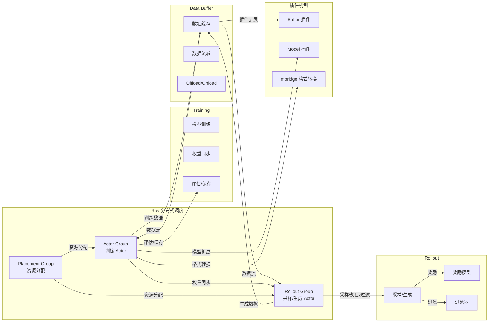

## 各模块视角的关系图
### slime/rollout 组件图
rollout 负责采样、奖励、过滤，支持多种采样/奖励/过滤策略。
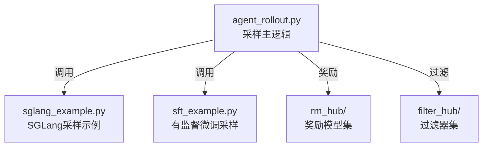

- `agent_rollout.py`：采样主流程，调度 SGLang、奖励模型、过滤器。

- `sglang_example.py/sft_example.py`：采样实现示例。

- `rm_hub/`：奖励模型集合。

- `filter_hub/`：过滤器集合。

### slime/ray 组件图
ray 负责分布式 actor、buffer、PPO 训练、资源分配。
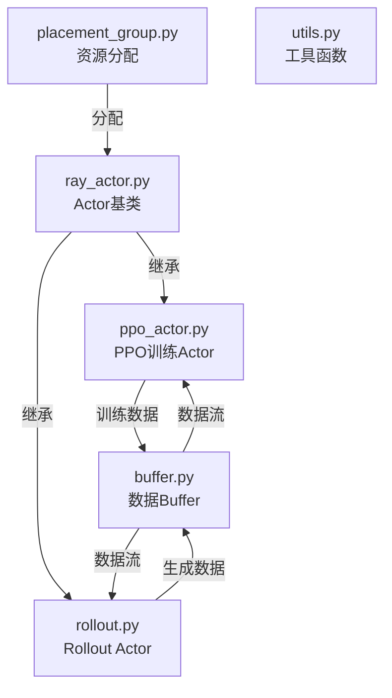


### slime/backends 组件图

后端适配，支持 Megatron、SGLang。
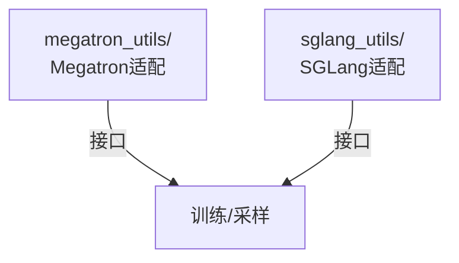


### slime/utils 组件图
工具、参数、类型、分布式、数据等通用功能。
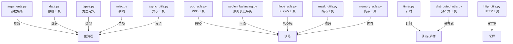


### slime_plugins/models 组件图
模型插件，支持不同模型适配.

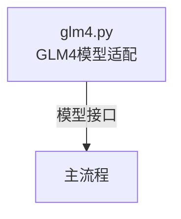

### slime_plugins/mbridge 组件图
模型格式转换插件。

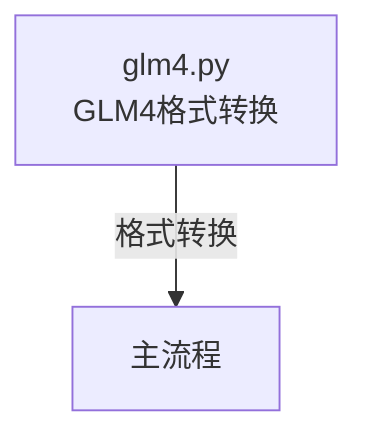

## 关键类角度的实现关系

### 全局视角
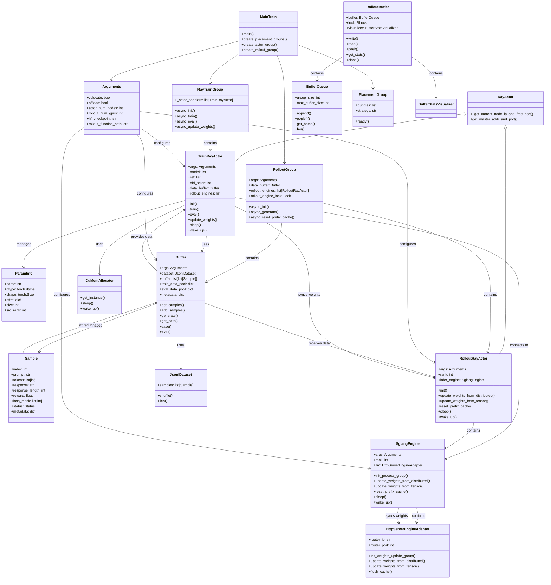


### 主流程精简版
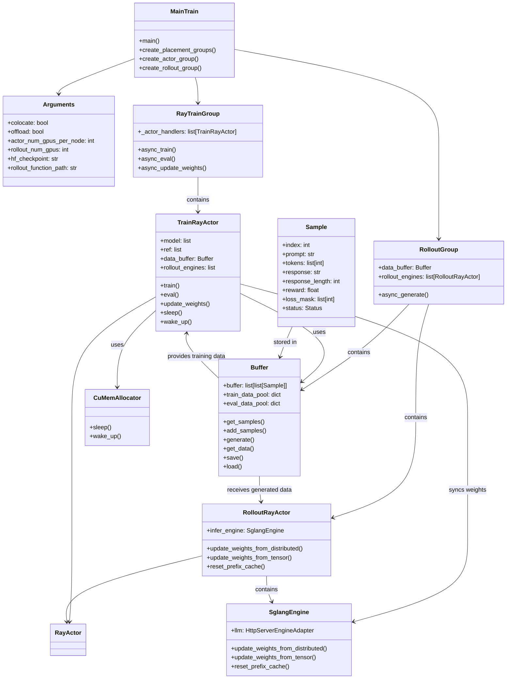


## 关于异步实现的方式
>需要注意的问题：
>1. `slime`的RL训练是`rollout_id`同步，不是完全的异步训练（即推理可以不等待训练完成，或者训练可以不等待推理完成）。
>2. 权重同步在每个rollout训练完成后立刻执行，确保下一个rollout使用最新权重。

```python
# train.py 主循环 - 实际上是同步的
for rollout_id in range(args.start_rollout_id, args.num_rollout):
    # 1. 等待采样完成
    ray.get(rollout_generator.async_generate(rollout_id))
    
    # 2. 等待训练完成  
    ray.get(actor_model.async_train(rollout_id))
    
    # 3. 等待权重同步完成
    ray.get(actor_model.async_update_weights())
```

- 虽然使用 Ray actor 的异步方法，但主循环用 ray.get() 等待每个步骤完成

- 每个 rollout_id 必须按顺序完成：采样 → 训练 → 权重同步

- 不是 rollout 一直生成、train actor 一直消费的完全异步模式
- 因此`slime`中异步的边界是内部的异步优化，多个actor分布式并行训练，但是主循环还是等待所有都要完成。

## 权重如何同步

权重同步流程：
```python
# RayTrainGroup.async_update_weights
def async_update_weights(self):
    """Broadcast weights from rank 0 to all other ranks."""
    return [actor.update_weights.remote() for actor in self._actor_handlers]

# TrainRayActor.update_weights
@timer
def update_weights(self):
    if self.args.debug_train_only or self.args.debug_rollout_only:
        return

    torch.cuda.empty_cache()
    if not self.args.colocate:
        self.update_weights_from_distributed()  # 分布式模式
    else:
        self.update_weights_from_tensor()       # 张量模式
    
    dist.barrier()
    clear_memory()
    print_memory("after update_weights")
```

以及权重同步的两种模式：
> 其中分布式模式适用于多节点分布式训练，利用高效的集合通信，比如大规模模型训练、需要跨节点权重同步的。
> 张量模式无网络依赖，延迟低。适合单机多进程训练，内存充足（利用共享内存，传输快）的场景。适合中小规模模型、且对网络延迟比较敏感的场景。

分析一下不同场景的延迟来源:
$$Latency_{distributed} = Latency_{net} + Time_{serialize} + Time_{broadcast}$$
$$Latency_{tensor} = Time_{memcopy} + Time_{serialize} + Time_{ipctransfer}$$

- 分布式模式
```python
def update_weights_from_distributed(self):
    # 1. 暂停 rollout engines
    if dist.get_rank() == 0:
        ray.get([engine.pause_generation.remote() for engine in self.rollout_engines])
        ray.get([engine.reset_prefix_cache.remote() for engine in self.rollout_engines])
    dist.barrier()

    # 2. 通过 NCCL 广播权重
    buffer_size = 0
    converted_named_tensors = []
    for name, param in update_weight_utils.named_parameters(self.args, self.model):
        param = update_weight_utils.all_gather_param(name, param)
        param = update_weight_utils.remove_padding(name, param, self.vocab_size)
        
        if buffer_size + param_size > self.args.update_weight_buffer_size:
            self._update_param_from_distributed(converted_named_tensors)
            buffer_size = 0
        
        converted_named_tensors += update_weight_utils.convert_to_hf(
            self.args, self.model_name, name, param, self.quantization_config
        )
        buffer_size += param_size

    # 3. 恢复 rollout engines
    if dist.get_rank() == 0:
        ray.get([engine.continue_generation.remote() for engine in self.rollout_engines])
    dist.barrier()
```


- 张量模式
> 训练GPU -> PCIe -> CPU内存 -> 序列化 -> 共享内存 -> 反序列化 -> CPU内存 -> PCIe -> rollout GPU

```python
def update_weights_from_tensor(self):
    # 1. 重置 prefix cache
    if rank == 0:
        ray.get([engine.reset_prefix_cache.remote() for engine in self.rollout_engines])
    dist.barrier()
    
    # 2. 通过 IPC 共享内存传输权重
    for param_infos in self.param_info_buckets:
        params = []
        for info in param_infos:
            if dist.get_rank() == info.src_rank:
                params.append(torch.nn.Parameter(self.params_dict[info.name].to(device=torch.cuda.current_device())))
            else:
                params.append(torch.empty(info.shape, dtype=info.dtype, device=torch.cuda.current_device()))

        # 广播参数
        if pp_size > 1:
            handles = []
            for info, param in zip(param_infos, params):
                handles.append(torch.distributed.broadcast(param, src=info.src_rank, group=mpu.get_pipeline_model_parallel_group(), async_op=True))
            for handle in handles:
                handle.wait()

        # 3. 通过 IPC 传输到 rollout engines
        converted_named_tensors = []
        for info, param in zip(param_infos, params):
            param = update_weight_utils.all_gather_param(info.name, param)
            param = update_weight_utils.remove_padding(info.name, param, self.vocab_size)
            converted_named_tensors.extend(update_weight_utils.convert_to_hf(
                self.args, self.model_name, info.name, param, self.quantization_config
            ))
        
        self._update_converted_params_from_tensor(converted_named_tensors)

def _update_converted_params_from_tensor(self, converted_named_tensors):
    # 序列化权重并通过 IPC 传输
    ipc_handle = MultiprocessingSerializer.serialize(converted_named_tensors, output_str=True)
    ipc_handles = [None] * dist.get_world_size(self._ipc_gather_group) if self._ipc_gather_src == dist.get_rank() else None
    
    dist.gather_object(ipc_handle, object_gather_list=ipc_handles, dst=self._ipc_gather_src, group=self._ipc_gather_group)
    
    if dist.get_rank() == self._ipc_gather_src:
        ref = self._ipc_engine.update_weights_from_tensor.remote(ipc_handles=ipc_handles)
        ray.get(ref)
```


## 训练数据流转角度
`train.py`主流程中训练、采样数据流转、权重同步时序：
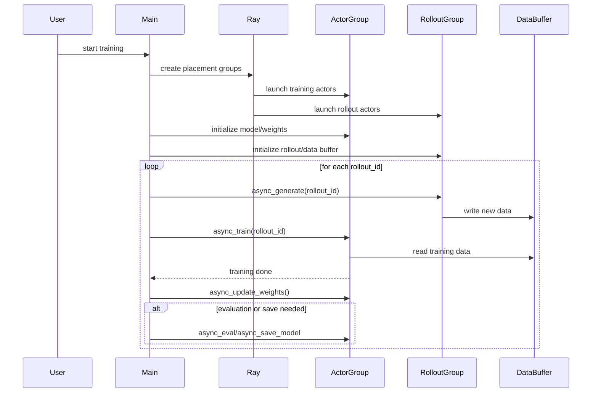


## 关于`data buffer`
>在`slime/ray/buffer.py`下，实现为Ray actor(@ray.remote class Buffer)，支持高效的本地缓存和流转，数据在传输时使用Ray的对象存储，数据结构保存在Ray actor的进程内存中。

### 主要功能
- `数据缓存与流转`：缓存采样生成的数据，供训练 actor 消费，实现采样与训练的解耦。

- `支持多种数据源`：可从全局数据集（如 prompt 数据）或采样生成数据中获取样本。

- `数据分组与批处理`：每组样本可包含多个 prompt/response，便于批量训练和采样。

- `元数据与状态管理`：支持元数据、epoch、样本索引等状态的保存与恢复。

- `支持 offload/onload`：可将 buffer 状态保存到本地/远程，支持断点续训和分布式场景。


### 详细类图
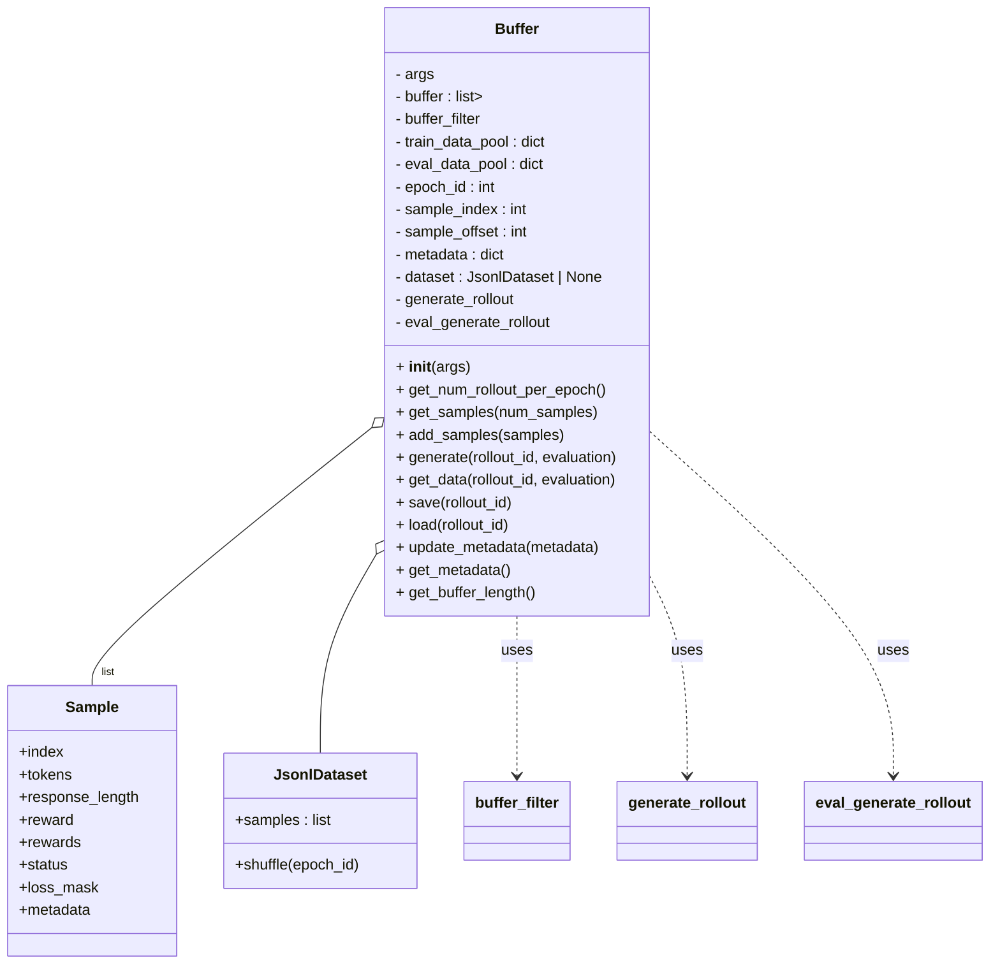


### Buffer和主流程关键模块的关联图
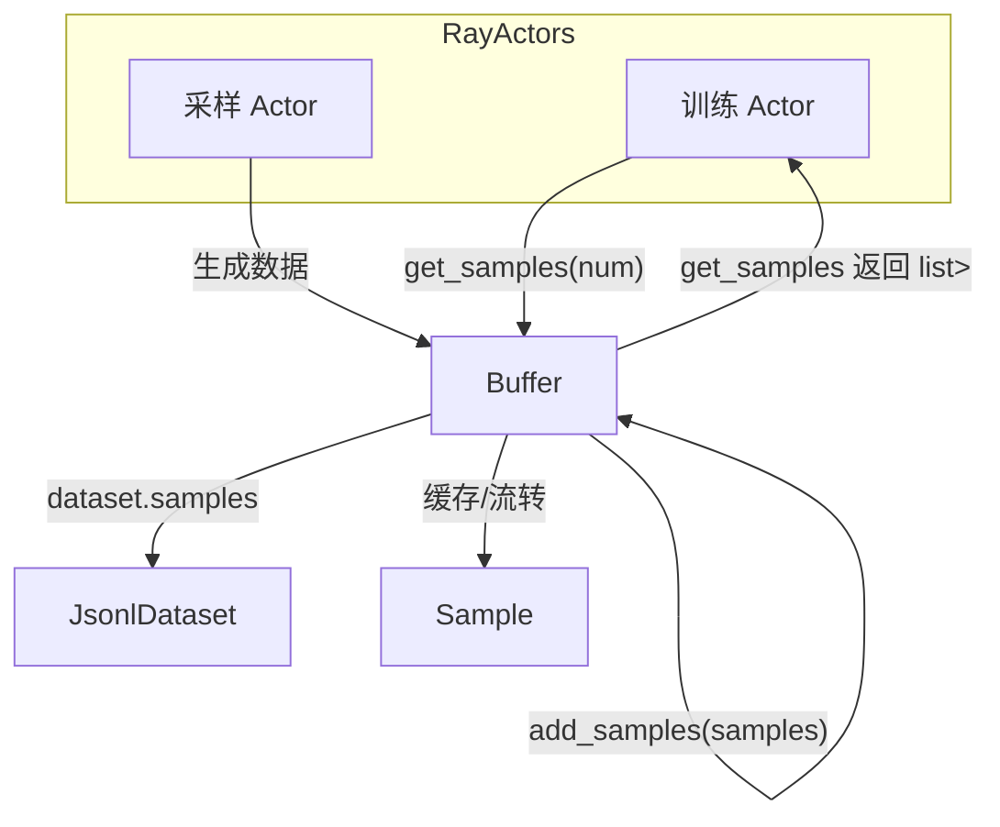

### 数据流转过程举例
>典型流程：采样生成 -> buffer缓存 -> 训练消费

1. 采样生成数据

- RolloutActor（采样 actor）调用 buffer.generate(rollout_id)

- generate 方法会调用 generate_rollout 函数，生成一批样本（Sample 对象），如：

	- data = generate_rollout(args, rollout_id, buffer, evaluation=False)

- 生成的数据通过 set_data 写入 train_data_pool

2. 采样数据写入 buffer

- 采样 actor 也可以直接调用 buffer.add_samples(samples)

- samples 是 list[list[Sample]]，每组样本对应一个 prompt 的多个采样

3. 训练 actor 获取数据

- 训练 actor（PPOActor）调用 buffer.get_samples(num_samples)

- get_samples 优先从 buffer（缓存队列）出队样本组，不足时从 dataset 生成

- 返回 list[list[Sample]]，每组样本可直接用于训练

4. 训练 actor 消费数据

- 训练 actor 拿到样本后，进行训练、更新权重等操作

### Buffer的`generate`职责以及如何实现弱耦合
- Buffer 的 generate 方法本质上是调用外部采样/推理函数（如 SGLang、模型采样等），这些函数通过**参数动态注入（如 `args.rollout_function_path`）**，所以只要采样接口一致，可以自己实现一个比如`generate_rollout_vllm.py`并在参数中指向它即可。
- 实现新的采样函数，其接口为：
```python
  def generate_rollout(args, rollout_id, buffer, evaluation=False):
      # 这里调用 vllm 的推理接口
      samples = vllm_generate(args, rollout_id)
      return samples
```
- 在启动训练的时候，参数指定:
```
  --rollout_function_path path/to/generate_rollout_vllm.py:generate_rollout
```

- buffer中的伪代码可以表示为:
```python
# buffer.py 内部
self.generate_rollout = load_function(self.args.rollout_function_path)

def generate(self, rollout_id, evaluation=False):
    generate_fn = self.eval_generate_rollout if evaluation else self.generate_rollout
    data = generate_fn(self.args, rollout_id, self, evaluation=evaluation)
    self._set_data(data, evaluation=evaluation)
```

- 因此Buffer 只负责：

1. 调用 generate_rollout（外部推理/采样后端）

2. 缓存采样得到的数据

3. 提供数据给训练 actor

- 推理/采样的具体实现（如 SGLang、模型后端）完全在 generate_rollout 这样的外部函数里，Buffer 只是“调度者”和“缓存者”。


###  默认对SGLang的支持
```python
# sglang_example.py - 默认的 SGLang 采样实现
def generate_rollout(args, rollout_id, data_buffer, evaluation=False):
    """默认的 generate_rollout 函数，使用 SGLang 进行采样"""
    assert args.rollout_global_dataset
    if evaluation:
        return run(eval_rollout(args, rollout_id))
    return run(generate_rollout_async(args, rollout_id, data_buffer))

# 异步采样实现
async def generate_rollout_async(args, rollout_id: int, data_buffer) -> list[list[Sample]]:
    # 1. 从 buffer 获取 prompt 样本
    samples = data_buffer.get_samples(args.over_sampling_batch_size)
    
    # 2. 提交 SGLang 生成任务
    state.submit_generate_tasks(samples)
    
    # 3. 等待生成完成
    done, state.pendings = await asyncio.wait(state.pendings, return_when=asyncio.FIRST_COMPLETED)
    
    # 4. 处理生成结果
    for task in done:
        group = task.result()
        data.append(group)
    
    return data
```


### 训推与buffer的api层级的交互
>rollout_id对应一次完整的采样-训练-评估循环

数据流动方式为：
- 采样：prompt 样本 → SGLang 生成 → 存入 pool

- 训练：从 pool 获取 → 训练 → 删除

- 评估：从 pool 获取 → 评估 → 删除

databuffer中数据结构的作用区别：
- self.buffer：采样过程中的 prompt 缓存和样本管理

- train_data_pool/eval_data_pool：rollout 粒度的数据对齐和生命周期管理

#### 主流程(train.py)
```python
def train(args):
    # 初始化
    actor_model = create_actor_group(args, pgs["actor"])
    rollout_generator = create_rollout_group(args, pgs["rollout"])
    
    # 主循环
    for rollout_id in range(args.start_rollout_id, args.num_rollout):
        # 训练采样
        ray.get(rollout_generator.async_generate(rollout_id))
        # 训练
        ray.get(actor_model.async_train(rollout_id))
        # 评估采样
        ray.get(rollout_generator.async_generate(rollout_id, evaluation=True))
        # 评估
        ray.get(actor_model.async_eval(rollout_id))
```

#### `Rollout Actor`与`Buffer`交互
- 采样阶段
```python
# RolloutGroup.async_generate
def async_generate(self, rollout_id, evaluation=False):
    return self.data_buffer.generate.remote(rollout_id, evaluation=evaluation)

# Buffer.generate
def generate(self, rollout_id, evaluation=False):
    # 调用外部采样函数
    generate_fn = self.eval_generate_rollout if evaluation else self.generate_rollout
    data = generate_fn(self.args, rollout_id, self, evaluation=evaluation)
    
    # 写入对应的 pool
    self._set_data(data, evaluation=evaluation)

# Buffer._set_data
def _set_data(self, data, evaluation=False):
    data_pool = self.eval_data_pool if evaluation else self.train_data_pool
    if not evaluation:
        data = self._convert_samples_to_train_data(data)  # 转换为训练格式
    data_pool[self.rollout_id] = data  # 存入 pool
```

- 其中外部采样函数（以 sglang_example.py 为例）
```python
# generate_rollout (sglang_example.py)
def generate_rollout(args, rollout_id, data_buffer, evaluation=False):
    if evaluation:
        return run(eval_rollout(args, rollout_id))
    
    # 从 buffer 获取 prompt 样本
    samples = data_buffer.get_samples(args.over_sampling_batch_size)
    
    # 使用 SGLang 生成 response
    # ... 生成逻辑 ...
    
    # 返回生成的样本
    return data

# 在生成过程中可能还会调用
data_buffer.add_samples(samples)  # 添加中间结果到 buffer
```


#### `Train Actor`与`Buffer`交互
- 训练阶段
```python
# RayTrainGroup.async_train
def async_train(self, rollout_id, with_data_fetching=True):
    return [actor.train.remote(rollout_id, with_data_fetching=with_data_fetching) 
            for actor in self._actor_handlers]

# TrainRayActor.train
def train(self, rollout_id, with_data_fetching=True):
    if with_data_fetching:
        self.get_rollout_data(rollout_id)  # 获取训练数据
    
    # ... 训练逻辑 ...

# TrainRayActor.get_rollout_data
def get_rollout_data(self, rollout_id):
    megatron_utils.process_rollout_data(rollout_id, self.args, self.data_buffer)

# process_rollout_data (megatron_utils/data.py)
def process_rollout_data(rollout_id, args, data_buffer):
    if rank == 0:
        # 从 buffer 获取训练数据
        data = ray.get(data_buffer.get_data.remote(rollout_id))
        dist.broadcast_object_list([data], src=0)
    else:
        data = [None]
        dist.broadcast_object_list(data, src=0)
        data = data[0]
    
    # 处理数据用于训练
    # ... 数据预处理逻辑 ...

# Buffer.get_data
def get_data(self, rollout_id, evaluation=False):
    data_pool = self.train_data_pool if not evaluation else self.eval_data_pool
    assert rollout_id in data_pool
    data = data_pool[rollout_id]
    del data_pool[rollout_id]  # 取出后删除
    return data
```


- 评估阶段
```python
# RayTrainGroup.async_eval
def async_eval(self, rollout_id):
    return [actor.eval.remote(rollout_id) for actor in self._actor_handlers]

# TrainRayActor.eval
def eval(self, rollout_id):
    megatron_utils.log_eval_data(rollout_id, self.args, self.data_buffer)

# log_eval_data (megatron_utils/data.py)
def log_eval_data(rollout_id, args, data_buffer):
    if rank == 0:
        data = ray.get(data_buffer.get_data.remote(rollout_id, evaluation=True))
        # ... 评估和日志逻辑 ...
```


### 更细粒度的实现分析

#### 构造参数

- `args`：配置参数对象，通常由 argparse 解析得到，包含所有训练/采样/数据相关的配置项。

#### 主要成员变量

| 名称                           | 类型                   | 作用与说明                               |
| ---------------------------- | -------------------- | ----------------------------------- |
| `self.args`                  | object               | 配置参数，包含所有 buffer 运行所需的参数。           |
| `self.buffer`                | list[list[Sample]]   | 主缓存队列，存储样本组（每组为同一 prompt 的多个采样）。    |
| `self.buffer_filter`         | function             | 样本出队策略函数，决定如何从 buffer 取出样本组。可自定义。   |
| `self.train_data_pool`       | dict[int, Any]       | 训练数据池，key 为 rollout_id，value 为训练数据。 |
| `self.eval_data_pool`        | dict[int, Any]       | 评估数据池，key 为 rollout_id，value 为评估数据。 |
| `self.epoch_id`              | int                  | 当前数据集 epoch 号，用于 shuffle。           |
| `self.sample_index`          | int                  | 样本全局索引，递增。                          |
| `self.sample_offset`         | int                  | 当前数据集采样偏移量。                         |
| `self.metadata`              | dict                 | 存储元数据（如采样状态、统计信息等）。                 |
| `self.dataset`               | JsonlDataset or None | 全局数据集对象，支持 prompt 初始化、shuffle。      |
| `self.generate_rollout`      | function             | 训练采样函数，外部注入，负责生成训练数据。               |
| `self.eval_generate_rollout` | function             | 评估采样函数，外部注入，负责生成评估数据。               |
| `self.rollout_id`            | int                  | 当前 rollout 的 id（仅 generate 时临时赋值）。  |

#### 依赖对象与数据结构

##### Sample

- 采样/训练的基本数据单元，定义见 slime/utils/types.py。
- 典型字段：index, tokens, response_length, reward, rewards, status, loss_mask, metadata 等。

##### JsonlDataset

- 数据集对象，支持从 jsonl 文件加载样本，支持 shuffle、按 key 取 prompt/label/metadata。
- 主要属性：samples（list[Sample]），shuffle(epoch_id)。

##### buffer_filter

- 样本出队策略函数，签名为 buffer_filter(args, rollout_id, buffer, num_samples)。
- 默认实现为 pop_first（先进先出），可通过参数自定义。

##### generate_rollout / eval_generate_rollout

- 外部注入的采样/推理函数，签名为 generate_rollout(args, rollout_id, buffer, evaluation=False)。
- 负责实际调用推理后端（如 SGLang、vllm）生成样本。

---

#### 主要方法定义与作用

##### __init__(self, args)
- 初始化 buffer，加载参数、数据集、采样/评估函数、buffer_filter 等。

##### get_num_rollout_per_epoch(self)
- 返回每个 epoch 可采样的 rollout 数量（仅全局数据集模式下有效）。

##### get_samples(self, num_samples)
- 获取指定数量的样本组（list[list[Sample]]）。
- 优先从 self.buffer 出队，不足时从 self.dataset 生成新样本组。
- 支持分组采样（每组 n_samples_per_prompt 个样本）。

##### _get_samples_from_buffer(self, num_samples)
- 内部方法，调用 buffer_filter 从 self.buffer 出队样本组。

##### add_samples(self, samples)
- 向 buffer 添加样本组（list[list[Sample]]）。
- 每组样本对应同一 prompt 的多个采样。

##### generate(self, rollout_id, evaluation=False)
- 调用 generate_rollout 或 eval_generate_rollout 生成数据，写入 train_data_pool 或 eval_data_pool。
- 采样逻辑由外部函数实现，buffer 只负责调度和缓存。

##### get_data(self, rollout_id, evaluation=False)
- 获取指定 rollout_id 的训练/评估数据（从 train_data_pool 或 eval_data_pool 取出并删除）。

##### _convert_samples_to_train_data(self, samples)
- 将采样得到的样本（Sample 列表）转换为训练数据格式（如 tokens、rewards、loss_masks 等）。

##### _set_data(self, data, evaluation=False)
- 将数据写入 train_data_pool 或 eval_data_pool。
- 支持 debug 数据保存。

##### update_metadata(self, metadata)
- 更新 buffer 的元数据。

##### get_metadata(self)
- 获取 buffer 的元数据。

##### get_buffer_length(self)
- 返回当前 buffer 中缓存的样本组数量。

##### save(self, rollout_id)
- 保存 buffer 状态（如 sample_offset、epoch_id、sample_index、metadata）到本地文件。

##### load(self, rollout_id=None)
- 加载 buffer 状态（如 sample_offset、epoch_id、sample_index、metadata）从本地文件。


####  主要数据结构

#####  **self.buffer**
  - 类型：list[list[Sample]]  
  - 结构：每个元素是一个样本组（同一 prompt 的多个采样），每组为 list[Sample]。  
  - 用途：缓存采样生成的数据，供训练 actor 批量消费。

##### **self.train_data_pool** 

- 作用：缓存训练数据，供训练 actor 消费

- 数据结构：dict[int, Any]，key 为 rollout_id，value 为训练数据（包含 tokens、rewards、loss_masks 等）

- 用途：存储每个 rollout 的训练样本，用于 PPO 训练

##### **self.eval_data_pool**

- 作用：缓存评估数据，供评估流程使用

- 数据结构：dict[int, Any]，key 为 rollout_id，value 为评估数据

- 用途：存储每个 rollout 的评估样本，用于模型性能评估

#####  **self.dataset**
  类型：JsonlDataset  
  结构：包含 samples（list[Sample]），支持 shuffle。  
  用途：全局数据集模式下，按需生成新样本组。

#####  **self.metadata**
  类型：dict  
  结构：任意元数据（如采样状态、统计信息等）。  
  用途：记录 buffer 的附加信息，便于状态恢复和监控。

---

#### 数据流转示意

1. **采样 actor 生成数据**  
   - 调用 buffer.generate(rollout_id)
   - generate_rollout(args, rollout_id, buffer) → 返回 list[Sample]
   - buffer._set_data(data) → 写入 train_data_pool[rollout_id]

2. **训练 actor 获取数据**  
   - 调用 buffer.get_samples(num_samples)
   - 优先从 self.buffer 出队，不足时从 self.dataset 生成
   - 返回 list[list[Sample]]，供训练使用

3. **训练 actor 消费数据**  
   - 训练 actor 拿到样本组后，进行训练、权重更新等操作

具体的例子：

```python
# 1. 采样生成训练数据
rollout_id = 100
rollout_generator.async_generate(rollout_id)  # evaluation=False
# Buffer 内部：
# - 调用 generate_rollout(args, 100, buffer, evaluation=False)
# - 生成训练样本：[Sample1, Sample2, ...]
# - 转换为训练格式：{"tokens": [...], "rewards": [...], "loss_masks": [...]}
# - 写入 train_data_pool[100]

# 2. 训练消费数据  
actor_model.async_train(rollout_id)
# Buffer 内部：
# - 从 train_data_pool[100] 取出训练数据
# - 返回给训练 actor
# - 删除 train_data_pool[100]

# 3. 评估生成数据
rollout_generator.async_generate(rollout_id, evaluation=True)
# Buffer 内部：
# - 调用 eval_generate_rollout(args, 100, buffer, evaluation=True)  
# - 生成评估样本
# - 写入 eval_data_pool[100]

# 4. 评估消费数据
actor_model.async_eval(rollout_id)
# Buffer 内部：
# - 从 eval_data_pool[100] 取出评估数据
# - 返回给评估 actor
# - 删除 eval_data_pool[100]
```


## 流水掩盖分析
> 目前slime框架计算ref  log_p -> old log_p -> current log_p是顺序执行的，训练阶段需要等待所有log_p计算完成，且采样->训练->权重同步之间也是通过ray.get()进行同步的，因此单actor异步掩盖的部分是计算reward、数据转换、数据存储等，而且主要的优化**不是主流程上的流水掩盖**而是**并行异步**带来的优化，比如并行计算多个样本的奖励、生成响应的时候同时计算奖励，当然还有远程reward model的网络I/O可以掩盖掉。


### 当前框架的约束
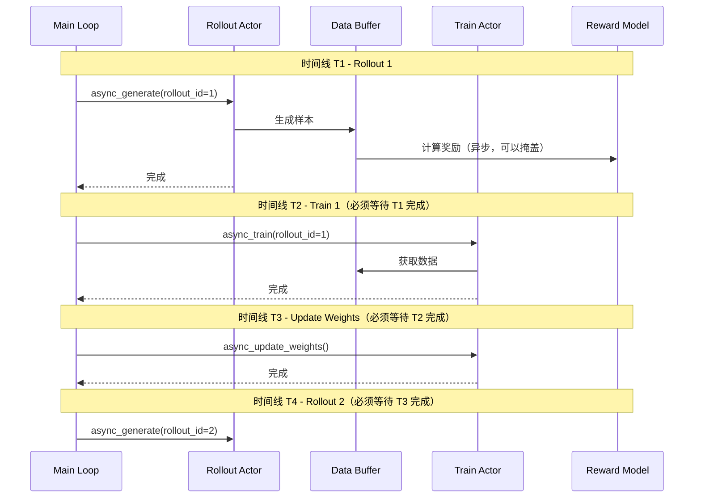

### 当前框架的掩盖效果
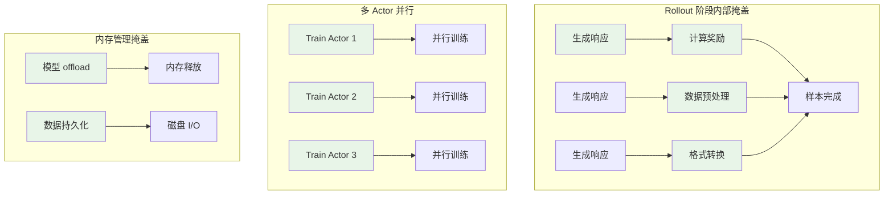

### 不能掩盖的部分
```mermaid
graph TD
    subgraph "主流程同步约束"
        A[Rollout 1] --> B[Train 1]
        B --> C[Update Weights 1]
        C --> D[Rollout 2]
        D --> E[Train 2]
        E --> F[Update Weights 2]
        
        style A fill:#ffebee
        style B fill:#ffebee
        style C fill:#ffebee
        style D fill:#ffebee
        style E fill:#ffebee
        style F fill:#ffebee
    end
    
    subgraph "训练阶段同步"
        G[获取数据] --> H[计算 ref log_p]
        H --> I[计算 old log_p]
        I --> J[计算 current log_p]
        J --> K[执行训练]
        
        style G fill:#ffebee
        style H fill:#ffebee
        style I fill:#ffebee
        style J fill:#ffebee
        style K fill:#ffebee
    end
```


###  `data buffer`当前的收益

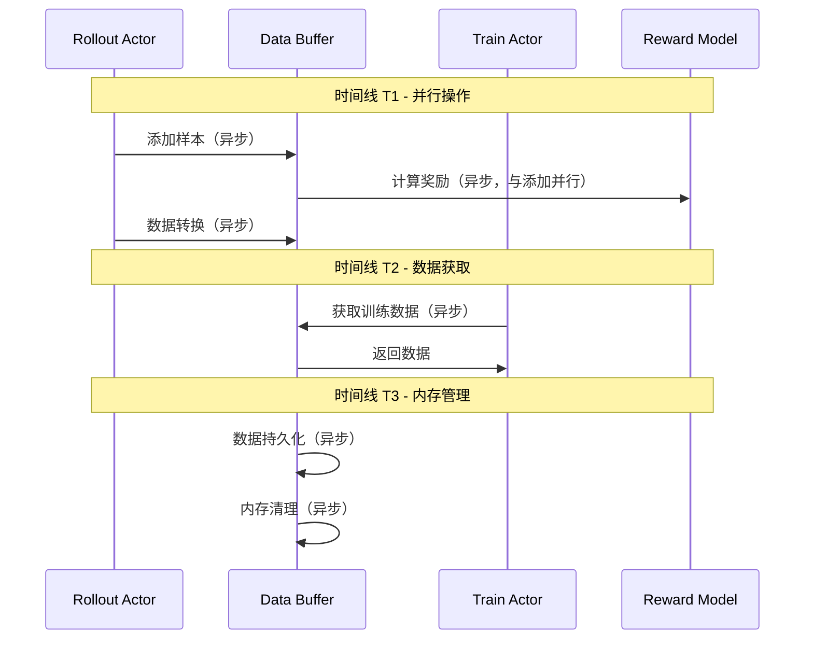

- 异步数据操作：添加、获取、转换可以并行

- 内存管理：持久化和清理可以异步

- 多进程访问：多个 Actor 可以并发访问


### 可以进一步掩盖的方案

#### `log_p`计算掩盖 

> 以PPO流程为例，reference model的log_p计算，权重固定（不参与训练），不计算梯度，可以提前计算；old actor的log_p计算，使用训练前的模型状态，可以在数据生成时提前计算。不过因为reward计算和log_p计算都需要完整的采样生成，所以实际应该只是reward计算（以及其他可并行项）和log_p计算之间的流水掩盖。


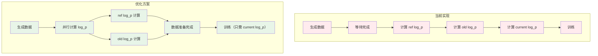

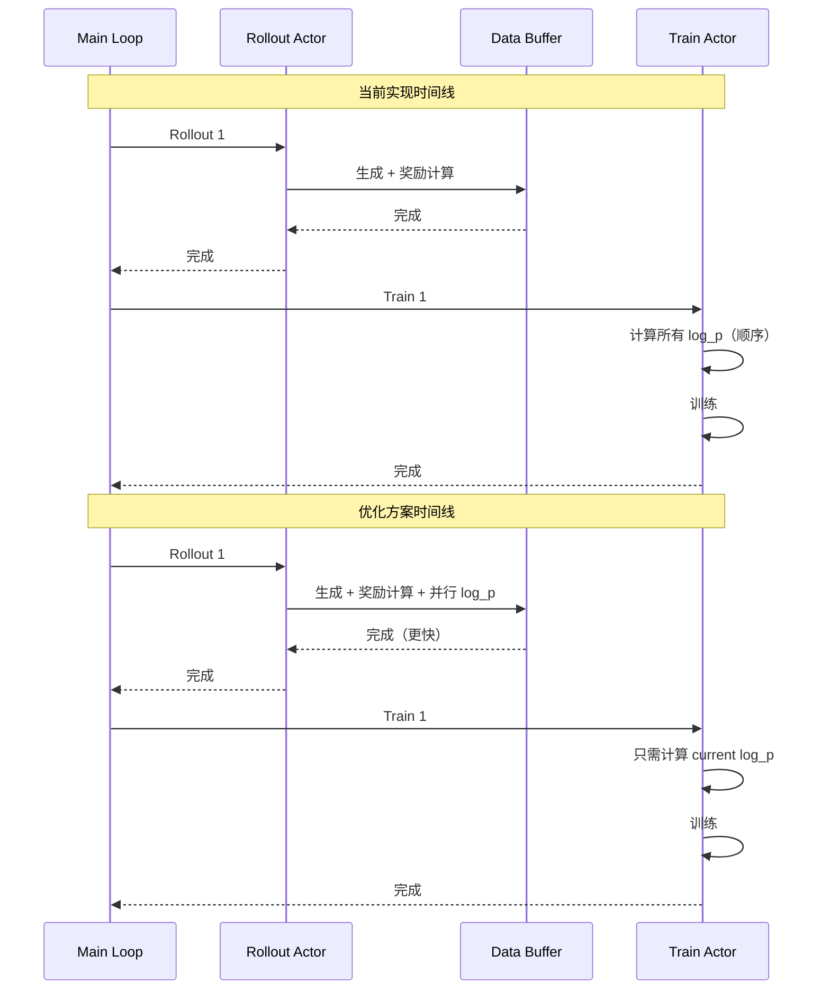


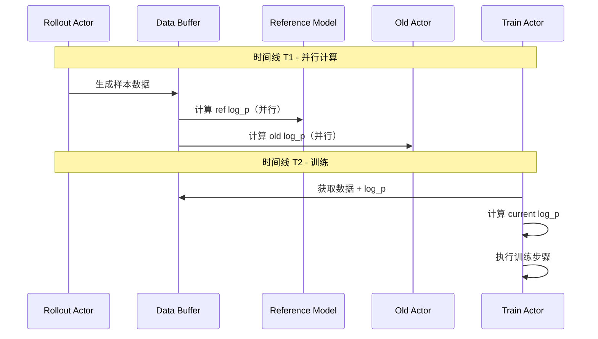


