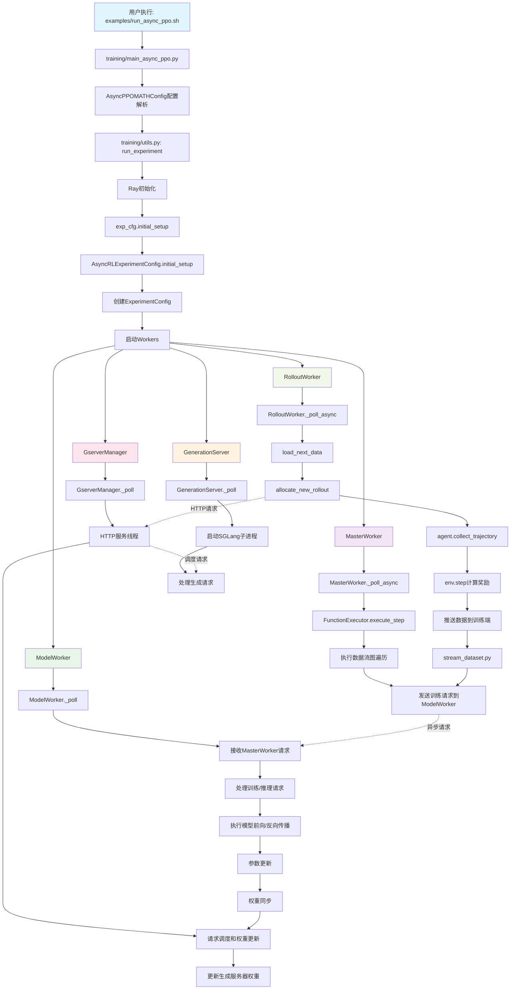
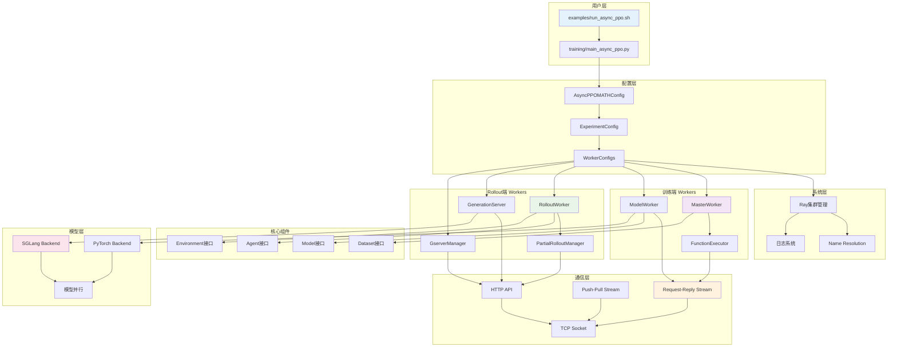
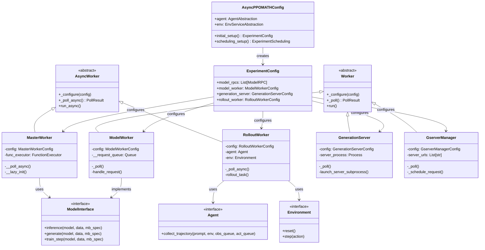
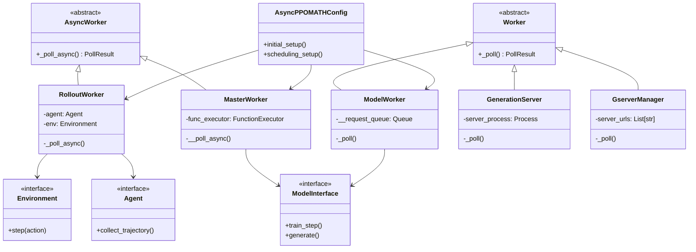
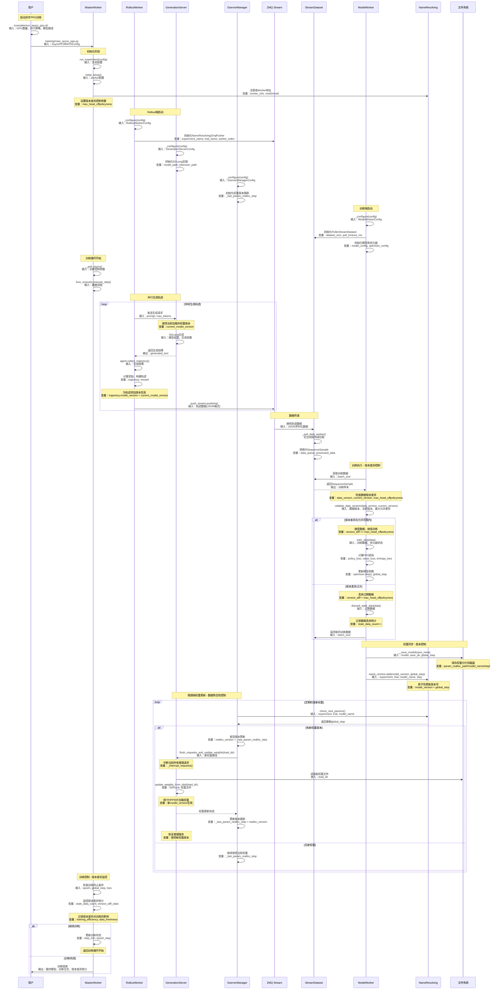
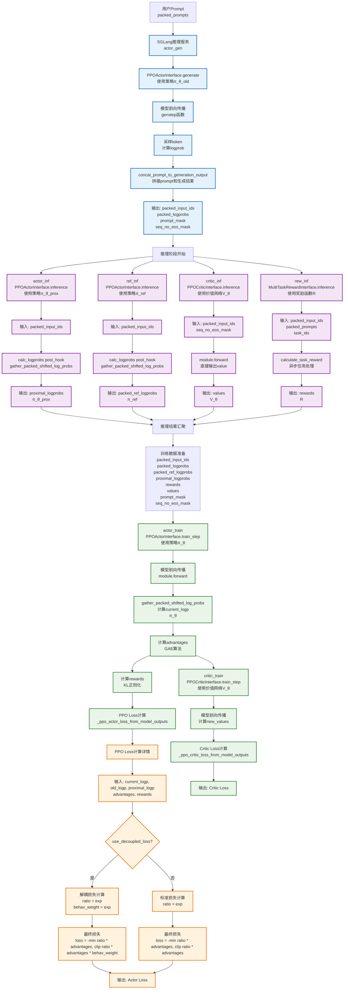
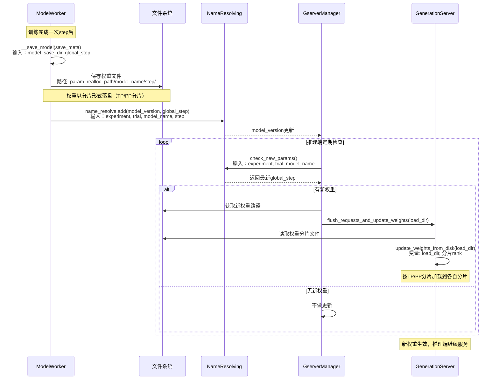
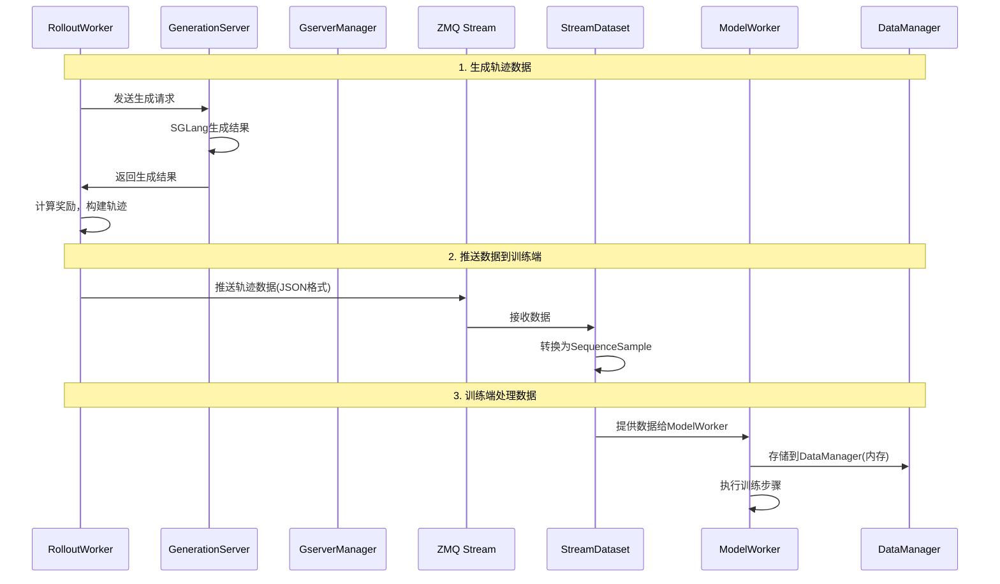
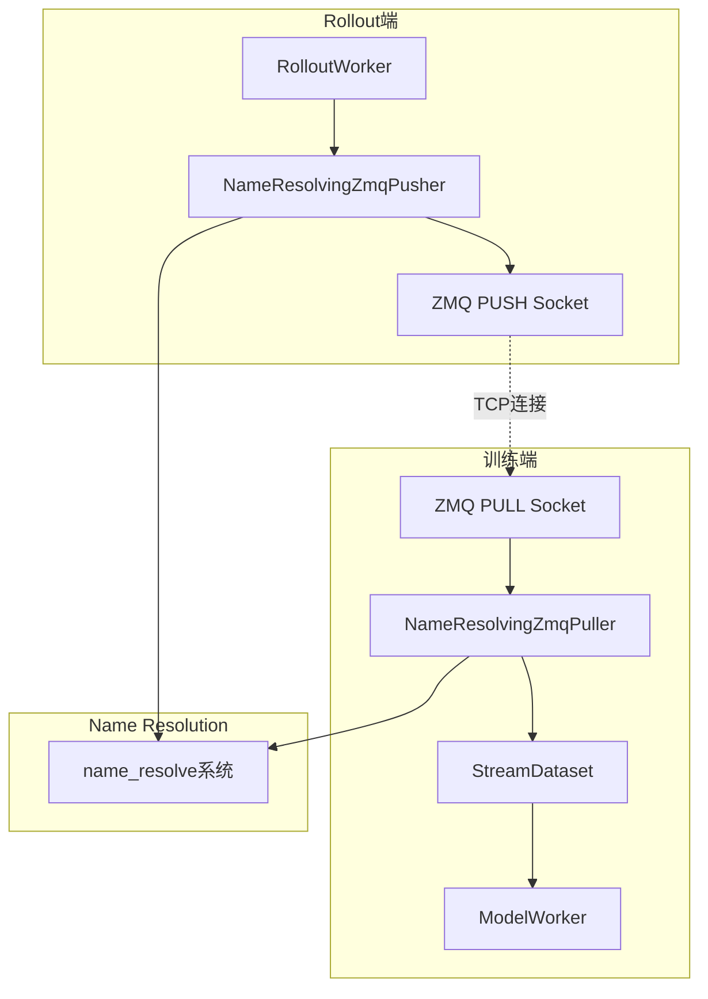
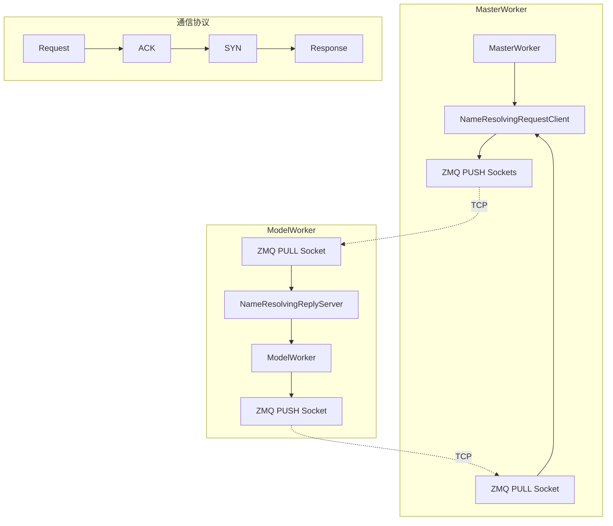

> https://github.com/inclusionAI/AReaL
> 纯异步RL方案

## 异步PPO训练调用流程




### 用户入口到配置解析

- `examples/run_async_ppo.sh` → `training/main_async_ppo.py`

- 通过Hydra解析CLI参数为`AsyncPPOMATHConfig`

- 调用`initial_setup()`生成`ExperimentConfig`

### Worker启动和初始化

- `training/utils.py:run_experiment()`启动Ray集群

- 根据`scheduling_setup()`创建各类Worker

- 每个Worker执行`_configure()`和`_poll()/_poll_async()`

### 训练端数据流

- `MasterWorker._poll_async()` → `FunctionExecutor.execute_step()`

- 通过`request_reply_stream`发送请求到ModelWorker

- ModelWorker处理训练/推理请求，执行模型计算

###  Rollout端数据流

- `RolloutWorker._poll_async()` → `agent.collect_trajectory()`

- 通过`GserverManager`调度生成请求到`GenerationServer`

- 通过`stream_dataset.py`推送轨迹数据到训练端

###  异步通信机制

- 训练端和Rollout端通过TCP Socket通信

- `GserverManager`提供HTTP API进行请求调度

- 权重更新通过文件系统同步

## 全局架构

### 部署形态
- 进程部署架构
> 以单机8卡为例

 `MasterWorker`：1个CPU进程，协调训练流程
 `ModelWorker`：6个GPU进程（GPU0-5），执行模型训练
 `GenerationServer`：2个GPU进程（GPU6-7），运行SGLang推理服务
 `GserverManager`：1个CPU进程，管理生成服务器
 `RolloutWorker`：多个CPU进程，执行智能体逻辑

### 训推资源分配
> 框架支持**分离部署**和**共享部署**两种模式

#### 分离部署
```bash
┌─────────────────────────────────────────────────────────────┐
│                    Ray Cluster (1 Node, 8 GPUs)             │
├─────────────────────────────────────────────────────────────┤
│  ┌─────────────┐  ┌─────────────┐  ┌─────────────┐         │
│  │MasterWorker │  │ModelWorker  │  │ModelWorker  │         │
│  │   (CPU)     │  │   (GPU0)    │  │   (GPU1)    │         │
│  └─────────────┘  └─────────────┘  └─────────────┘         │
│                                                             │
│  ┌─────────────┐  ┌─────────────┐  ┌─────────────┐         │
│  │ModelWorker  │  │ModelWorker  │  │ModelWorker  │         │
│  │   (GPU2)    │  │   (GPU3)    │  │   (GPU4)    │         │
│  └─────────────┘  └─────────────┘  └─────────────┘         │
│                                                             │
│  ┌─────────────┐  ┌─────────────┐  ┌─────────────┐         │
│  │ModelWorker  │  │GServerMgr   │  │RolloutWorker│         │
│  │   (GPU5)    │  │   (CPU)     │  │   (CPU)     │         │
│  └─────────────┘  └─────────────┘  └─────────────┘         │
│                                                             │
│  ┌─────────────┐  ┌─────────────┐  ┌─────────────┐         │
│  │GenServer    │  │GenServer    │  │RolloutWorker│         │
│  │ (SGLang)    │  │ (SGLang)    │  │   (CPU)     │         │
│  │   (GPU6)    │  │   (GPU7)    │  └─────────────┘         │
│  └─────────────┘  └─────────────┘                          │
└─────────────────────────────────────────────────────────────┘

```


- 训练端：使用4个GPU（d2p2m1 = 2×2×1）

- 推理端：使用4个GPU（d4p1m1 = 4×1×1）

- 优势：完全解耦，互不干扰，性能最优


### 分层关系




### 全局类图




### 核心模块类图




## 异步流程机制细节

### 异步完整流程图


### 异步带来的算法修正

#### 同步PPO完整流程
先回顾一下ppo的计算流程：
> 我们有一个策略π(a|s)，它决定在状态s下选择动作a的概率。PPO的目标是优化这个策略，使其能够获得更高的累积奖励。

- 数据收集（rollout）
```python
# 使用当前策略π_θ生成轨迹
for episode in range(num_episodes):
    state = env.reset()
    trajectory = []
    
    while not done:
        # 使用当前策略选择动作
        action_probs = π_θ(state)  # 当前策略的概率分布
        action = sample(action_probs)  # 采样动作
        
        # 记录动作概率（用于后续计算重要性比率）
        old_logp = log(action_probs[action])  # 这就是old_logp
        
        # 执行动作
        next_state, reward, done = env.step(action)
        trajectory.append((state, action, reward, old_logp))
        state = next_state
```

- 计算优势函数
```python
# 使用GAE计算优势函数
advantages = compute_gae(trajectory, γ=0.99, λ=0.95)
returns = compute_returns(trajectory, γ=0.99)
```

- 策略更新
```python
# 对收集的数据进行多次更新
for epoch in range(num_epochs):
    for batch in data_loader:
        # 重新计算当前策略的概率
        current_action_probs = π_θ(batch.states)  # 当前策略
        cur_logp = log(current_action_probs[batch.actions])  # 这就是cur_logp
        
        # 计算重要性比率
        ratio = exp(cur_logp - old_logp)
        
        # PPO损失函数
        surr1 = ratio * advantages
        surr2 = clip(ratio, 1-ε, 1+ε) * advantages
        loss = -min(surr1, surr2)
        
        # 更新策略参数
        optimizer.zero_grad()
        loss.backward()
        optimizer.step()
```


> 为什么需要重要性采样   ratio = π_θ(a|s) / π_θ_old(a|s) = exp(cur_logp - old_logp)
> 1.  我们想用当前策略π_θ来评估旧策略π_θ_old生成的数据
> 2. 重要性采样修正了这种分布偏移


#### 框架的异步PPO修正机制

- 异步带来的问题，数据生成和训练并行
```python
# 时间线
t=0: 策略π_θ_0生成数据
t=1: 策略π_θ_1生成数据，同时训练π_θ_0的数据
t=2: 策略π_θ_2生成数据，同时训练π_θ_1的数据
...
```
这导致：

- 训练数据来自较旧的策略版本

- 重要性比率可能变得很大或很小

- 策略更新可能不稳定

> 框架引入的修正机制如下：

**机制1： 版本控制**
```python
# 记录数据生成时的策略版本
data = {
    "version_start": model_version_when_generation_started,
    "version_end": model_version_when_generation_ended,
    "old_logp": logprobs_from_generation,
    "actions": actions,
    "rewards": rewards
}
```


**机制2：数据过滤**
```python
# 检查版本差异
version_diff = current_version - data.version_start
if version_diff > max_head_offpolicyness:
    # 数据太旧，丢弃
    continue
```

**机制3：解耦损失（Decoupled Loss）**
```python
# 标准PPO损失
def standard_ppo_loss(cur_logp, old_logp, advantages):
    ratio = exp(cur_logp - old_logp)
    return -min(ratio * advantages, clip(ratio, 1-ε, 1+ε) * advantages)

# AReaL解耦损失
def decoupled_loss(cur_logp, old_logp, prox_logp, advantages):
    # 使用prox_logp作为中间策略
    ratio = exp(cur_logp - prox_logp)
    behav_weight = exp(prox_logp - old_logp)
    return -min(ratio * advantages, clip(ratio, 1-ε, 1+ε) * advantages) * behav_weight
```


#### 修正的合理性分析

**数学基础**
解耦损失可以分解为:
```python
# 标准PPO
ratio = π_θ(a|s) / π_θ_old(a|s)

# AReaL解耦
ratio = π_θ(a|s) / π_prox(a|s)
behav_weight = π_prox(a|s) / π_θ_old(a|s)

# 等价性
ratio * behav_weight = π_θ(a|s) / π_θ_old(a|s)  # 与标准PPO相同
```

**稳定性提升**
```python
# 异步场景下的问题
# 如果π_θ与π_θ_old差异很大
ratio = π_θ(a|s) / π_θ_old(a|s)  # 可能很大或很小

# AReaL的解决方案
# 引入中间策略π_prox，使得：
# π_θ ≈ π_prox ≈ π_θ_old
ratio = π_θ(a|s) / π_prox(a|s)  # 更稳定
behav_weight = π_prox(a|s) / π_θ_old(a|s)  # 更稳定
```

**渐进式更新**
```python
# 标准异步PPO：直接从π_θ_old跳到π_θ
# AReaL：π_θ_old → π_prox → π_θ，分两步更新
```


#### 具体实现
**核心修正机制实现**
```python
# AReaL的解耦损失实现
if proximal_logprobs is not None:
    # 计算行为策略权重
    behav_kl = proximal_logprobs - old_logprobs
    behav_imp_weight = behav_kl.exp()
    
    # 应用权重上限
    if behav_imp_weight_cap is not None:
        behav_mask = (behav_imp_weight <= behav_imp_weight_cap).logical_and(loss_mask)
    else:
        behav_mask = loss_mask
    
    # 应用行为策略权重
    pg_loss = pg_loss * behav_imp_weight
```

**数学等价性证明**

```python
# 标准PPO损失
L_standard = -min(ratio * A, clip(ratio, 1-ε, 1+ε) * A)
其中 ratio = π_θ(a|s) / π_θ_old(a|s)

# AReaL解耦损失
L_decoupled = -min(ratio * A, clip(ratio, 1-ε, 1+ε) * A) * behav_weight
其中 ratio = π_θ(a|s) / π_prox(a|s)
     behav_weight = π_prox(a|s) / π_θ_old(a|s)

# 等价性证明
L_decoupled = -min(ratio * A, clip(ratio, 1-ε, 1+ε) * A) * behav_weight
           = -min((π_θ/π_prox) * A, clip(π_θ/π_prox, 1-ε, 1+ε) * A) * (π_prox/π_θ_old)
           = -min((π_θ/π_θ_old) * A, clip(π_θ/π_prox, 1-ε, 1+ε) * A * (π_prox/π_θ_old))
```


#### 流程图视角



**old_logp (π_θ_old)**
```python
# 生成阶段 - SGLang推理服务
# 模型：Actor模型 (策略π_θ_old)
# 时机：生成token时实时计算
# 函数：genstep() -> distrb.log_prob(next_tokens)
# 保存：concat_prompt_to_generation_output() -> packed_logprobs
```


**proximal_logp (π_θ_prox)**
```python
# 推理阶段 - actor_inf组件
# 模型：Actor模型 (策略π_θ_prox，比π_θ_old新，比π_θ旧)
# 时机：生成完成后，训练前
# 函数：PPOActorInterface.inference() -> calc_logprobs()
# 条件：仅当use_decoupled_loss=True时计算
```


**current_logp (π_θ)**
```python
# 训练阶段 - actor_train组件
# 模型：Actor模型 (当前策略π_θ，最新)
# 时机：训练时重新计算
# 函数：PPOActorInterface.train_step() -> gather_packed_shifted_log_probs()
# 作用：用于计算重要性采样比率
```


### 权重同步机制




核心机制：

- 训练端：`ModelWorker`在每次`train_step`后保存权重到`param_realloc_path`，并调用`name_resolve.add(model_version, global_step)`，在`NameResolving`服务中记录最新的权重版本号（global_step）。

- 推理端：`GserverManager`定期检查`model_version`，发现新版本（`model_version`和已经加载的对比）时通过HTTP API更新所有`GenerationServer`的权重。
s
- 同步动作：权重更新时会中断正在进行的生成请求，确保推理使用最新权重。


关键函数与变量说明：

- `__save_model(save_meta)`

- 输入：model_name, save_dir, global_step

- 输出：权重文件（分片）落盘

- `name_resolve.add(model_version, global_step)`

- 输入：实验名、trial名、模型名、step

- 输出：NameResolving服务中记录最新step

- `check_new_params()`

- 输入：实验名、trial名、模型名

- 输出：最新step（如果有更新）

- `flush_requests_and_update_weights(load_dir)`

- 输入：权重目录

- 输出：推理端各分片加载新权重

- `update_weights_from_disk(load_dir)`

- 输入：分片rank、load_dir

- 输出：各分片权重加载到内存

变量传递链路：

- `global_step/model_version`：用于标识权重版本

- `param_realloc_path/load_dir`：权重磁盘路径

- 分片rank：决定每个worker加载哪一份权重


### 数据陈旧性控制
> 异步训推协调的核心机制，需要限制陈旧性保证训练稳定性

```python
# GserverManager中的陈旧性检查
def is_staled(self):
    # 检查当前运行的rollout是否过时
    return self.rollout_stat.running > self.config.max_head_offpolicyness
```

协调机制：

- 版本控制：每个生成请求都携带version_start和version_end，记录使用的权重版本

- 陈旧性限制：通过`max_head_offpolicyness`参数控制允许的最大数据陈旧性

- 请求调度：`GserverManager`在分配新rollout时检查容量和陈旧性，拒绝过时的请求

确实存在使用老权重的情况：

- 异步训练允许一定程度的权重陈旧性

- 通过`max_head_offpolicyness`参数控制陈旧性上限

- 这种设计在提高训练效率的同时，通过限制陈旧性保证训练稳定性


### 数据传递机制

> 各个worker之间的通信核心是ZMQ：
> - 高性能：支持零拷贝和批量传输
> - 多种模式：PUSH/PULL、PUB/SUB、REQ/REP等
> - 异步通信：非阻塞I/O，适合高并发场景
> - 跨语言：支持多种编程语言
> - 网络透明：自动处理连接、重连、负载均衡

```python
# zmq的配置举例
# 高性能配置
self.context = zmq.Context.instance(io_threads=8)
self.context.set(zmq.MAX_SOCKETS, 65536)

# 缓冲区优化
self.socket.setsockopt(zmq.SNDHWM, 1000)  # 发送缓冲区
self.socket.setsockopt(zmq.RCVHWM, 1000)  # 接收缓冲区

# 超时设置
self.socket.setsockopt(zmq.RCVTIMEO, timeout_ms)
```





#### 数据传递层次

1. Rollout端到训练端：

- 使用ZMQ Push-Pull Stream传输轨迹数据

- RolloutWorker → NameResolvingZmqPusher → NameResolvingZmqPuller → StreamDataset



2. 训练端内部：

- 使用Request-Reply Stream传输训练请求

- MasterWorker → ModelWorker通过ZMQ通信



```python
# 请求发送
def request(self, handlers, handle_type, datas, no_syn=True):
    requests = [
        Payload(
            handler=handler,
            handle_name=handle_type,
            data=data,
            no_syn=no_syn,
        )
        for handler, data in zip(handlers, datas)
    ]
    
    # 发送请求
    for payload in requests:
        idx = self._handler_routing[payload.handler]
        self.send_sockets[idx].send(pickle.dumps(payload))
```


3. 存储分离：

- 训练数据：存储在DataManager中，支持分布式存储和重分布
   `DataManager`为内存存储：
```python
class DataManager:
    def __init__(self, model_topos, msid2mwid, data_transfer_pairs):
        # 核心存储：内存字典
        self.storage: Dict[Hashable, SequenceSample] = {}
        
    def store(self, x: SequenceSample):
        # 存储到内存字典
        self.storage[x.ids[0]] = x
        
    def get(self, data_id: Hashable):
        # 从内存获取
        return self.storage[data_id]
```

支持数据重分布：
```python
def redistribute(self, data_info: SequenceSample, plan: List[RedistribStep]):
    """执行数据重分布"""
    for step in plan:
        if step.comm_type == "bcast":
            self._run_bcast(step, data_infos)
        elif step.comm_type == "gather":
            self._run_gather(step, data_infos)
        elif step.comm_type == "scatter":
            self._run_scatter(step, data_infos)
```


- 推理数据：存储在SGLang服务器的内存中

- 元数据：通过name_resolve系统共享


#### 实现细节
##### `RolloutWorker` 数据发送

```python
# realhf/system/rollout_worker.py
class RolloutWorker(AsyncWorker):
    def _configure(self, config):
        # 初始化ZMQ推送器 - 发送轨迹数据到训练端
        self.push_stream = NameResolvingZmqPusher(
            self.experiment_name,
            self.trial_name, 
            pusher_index=self.worker_index,
            pusher_cnt=self.worker_count,
        )
    
    async def _poll_async(self):
        # 收集轨迹数据
        traj = await self.agent.collect_trajectory()
        
        # 推送数据到训练端
        self.push_stream.push([traj.as_json_serializable()])
```


##### `GenerationServer` 推理服务

```python
# realhf/system/generation_server.py  
class GenerationServer(Worker):
    def launch_server_subprocess(self):
        # 启动SGLang推理服务器
        self.server_process, self.server_port = launch_server_cmd(cmd, port=server_port)
        self.server_addr = f"http://{host}:{self.server_port}"
        
        # 注册服务地址到NameResolving
        name = names.gen_servers(self.experiment_name, self.trial_name)
        name_resolve.add_subentry(name, self.server_addr)
```


##### `GserverManager`负载均衡

```python
# realhf/system/gserver_manager.py
class GserverManager(Worker):
    def _discover_servers(self, n_servers: int):
        # 通过NameResolving发现所有推理服务器
        name = names.gen_servers(self.experiment_name, self.trial_name)
        urls = name_resolve.get_subtree(name)
        return urls
    
    def _run_routing_service(self):
        # HTTP服务，接收推理请求并路由到合适的服务器
        async def schedule_request(req_meta):
            server_idx = self._least_requests_schedule(req_meta)
            return self.server_urls[server_idx]
```

##### `MasterWorker` 训练协调

```python
# realhf/system/master_worker.py
class MasterWorker(AsyncWorker):
    def _configure(self, config):
        # 初始化Request-Reply客户端
        self.func_executor = FunctionExecutor(
            experiment_name=self.experiment_name,
            trial_name=self.trial_name,
            n_subscribers=self.config.n_model_workers,
            handler_routing=self.config.handler_routing,
        )
    
    async def _poll_async(self):
        # 执行训练步骤，通过Request-Reply与ModelWorker通信
        result = await self.func_executor.execute_step(
            step_name="train_step",
            step_kwargs={"batch": batch}
        )
```

##### `ModelWorker` 模型训练
```python
# realhf/system/model_worker.py
class ModelWorker(Worker):
    def _configure(self, config):
        # 初始化Request-Reply服务器
        self.reply_server = NameResolvingReplyServer(
            experiment_name=self.experiment_name,
            trial_name=self.trial_name,
            idx=self.worker_index,
        )
        
        # 注册训练处理函数
        self.reply_server.register_handler("train_step", self._train_step)
    
    def _train_step(self, batch):
        # 执行训练步骤
        loss = self.model.train_step(batch)
        
        # 保存权重并更新版本号
        self.model.save_weights(self.param_realloc_path)
        name = names.model_version(self.experiment_name, self.trial_name, self.model_name.role)
        name_resolve.add(name, self.global_step)
        
        return {"loss": loss, "global_step": self.global_step}
```


##### `StreamDataset` 数据接收

```python
# realhf/system/stream_dataset.py
class StreamDataset:
    def __init__(self, args, puller_index):
        # 初始化ZMQ拉取器 - 接收RolloutWorker推送的数据
        self.puller = NameResolvingZmqPuller(args, puller_index)
    
    def __iter__(self):
        while True:
            # 从ZMQ接收数据
            data = self.puller.pull()
            
            # 转换为训练格式
            sample = SequenceSample.from_json_serializable(data)
            yield sample
```


##### `ZMQ`通信层

```python
# realhf/system/push_pull_stream.py
class NameResolvingZmqPusher(ZMQJsonPusher):
    def __init__(self, experiment_name, trial_name, pusher_index, pusher_cnt):
        # 通过NameResolving获取目标地址
        pullers = name_resolve.get_subtree(names.stream_pullers(experiment_name, trial_name))
        
        # 计算路由关系
        groups = grouping(pusher_cnt, len(pullers))
        puller_index = self._find_target_puller(groups, pusher_index)
        
        # 获取目标地址并连接
        name = names.push_pull_stream(experiment_name, trial_name, f"puller{puller_index}")
        addr = name_resolve.wait(name)
        host, port = addr.split(":")
        super().__init__(host, int(port))

class NameResolvingZmqPuller(ZMQJsonPuller):
    def __init__(self, args, puller_index):
        # 绑定随机端口
        host, port = network.gethostip(), network.find_free_port()
        addr = f"{host}:{port}"
        
        # 注册地址到NameResolving
        name = names.push_pull_stream(args.experiment_name, args.trial_name, f"puller{puller_index}")
        name_resolve.add(name, addr)
        super().__init__(host, port)
```

##### `Request-Reply` 通信层

```python
# realhf/system/request_reply_stream.py
class NameResolvingRequestClient:
    def __init__(self, experiment_name, trial_name, n_subscribers, handler_routing):
        # 创建多个发送socket
        for i in range(n_subscribers):
            s = self.context.socket(zmq.PUSH)
            send_port = s.bind_to_random_port(f"tcp://{host_ip}")
            
            # 注册发送地址
            master_send_name = names.request_reply_stream(experiment_name, trial_name, f"master_send_{i}")
            name_resolve.add(name=master_send_name, value=f"{host_ip}:{send_port}")
            self.send_sockets.append(s)
        
        # 创建接收socket
        self.recv_socket = self.context.socket(zmq.PULL)
        recv_port = self.recv_socket.bind_to_random_port(f"tcp://{host_ip}")
        master_recv_name = names.request_reply_stream(experiment_name, trial_name, "master_recv")
        name_resolve.add(name=master_recv_name, value=f"{host_ip}:{recv_port}")

class NameResolvingReplyServer:
    def __init__(self, experiment_name, trial_name, idx):
        # 等待MasterWorker注册地址
        send_name = names.request_reply_stream(experiment_name, trial_name, "master_recv")
        master_recv_addr = name_resolve.wait(send_name, timeout=300)
        
        recv_name = names.request_reply_stream(experiment_name, trial_name, f"master_send_{idx}")
        master_send_addr = name_resolve.wait(recv_name, timeout=300)
        
        # 连接到MasterWorker
        self.accept(master_send_addr, master_recv_addr)
```

##### 轨迹数据序列化

```python
# 轨迹数据序列化
class Trajectory:
    def as_json_serializable(self):
        return {
            "observations": self.observations,
            "actions": self.actions, 
            "rewards": self.rewards,
            "dones": self.dones,
            "values": self.values,
            "log_probs": self.log_probs,
        }

# ZMQ传输
self.push_stream.push([traj.as_json_serializable()])

# 接收端反序列化
data = self.puller.pull()
sample = SequenceSample.from_json_serializable(data)
```

#### QA
##### 为什么数据流不通过`MasterWorker`而是直接到`ModelWorker`？
> `ModelWorker`直接创建`PullerStreamDataset`，通过`zmq`接收`RolloutWorker`推送的数据。

```python
# realhf/system/model_worker.py
class ModelWorker(Worker):
    def _lazy_setup(self):
        # 在ModelWorker中创建数据集
        datasets = [
            data_api.make_dataset(
                d,
                self.config.base_seed,
                self.__dataset_dp_rank,
                self.__dataset_dp_size,
                self.config.tokenizer_name_or_path,
            )
            for d in self.config.datasets
        ]
        
        # 特殊处理StreamDataset
        if not isinstance(self.__datasets[dataset_id], PullerStreamDataset):
            dataloader_kwargs["collate_fn"] = data_api.SequenceSample.gather
            dataloader_kwargs["batch_size"] = 10240
        else:
            dataloader_kwargs["batch_size"] = None  # StreamDataset不需要batch_size
```

```python
class PullerStreamDataset(Dataset):
    def __init__(self, util, args, dataset_cfgs, pull_timeout_ms=100):
        # 创建后台线程来拉取数据
        self.worker_thread = threading.Thread(target=self._pull_data_worker)
        self.worker_thread.start()
    
    def _pull_data_worker(self):
        # 在后台线程中创建ZMQ拉取器
        stream = NameResolvingZmqPuller(
            self.args,
            puller_index=self.util.dp_rank,
        )
        
        while not self._stop_event.is_set():
            # 从ZMQ接收RolloutWorker推送的数据
            data = stream.pull(timeout_ms=self.pull_timeout_ms)
            processed_data = [SequenceSample.from_json_compatible(x) for x in data]
            # 放入队列供训练使用
            self.data_queue.put_nowait(processed_data)
    
    def __getitem__(self, idx):
        # 从队列中获取数据用于训练
        samples = []
        while True:
            try:
                samples += self.data_queue.get_nowait()
            except queue.Empty:
                break
        return samples
```

**目的是为了控制流和数据流的分离，且减少数据中转** 。`MasterWorker`只是做协调训练步骤，而`ModelWorker`直接接收数据:
```python
# MasterWorker: 控制流
await self.func_executor.execute_step()  # 协调训练步骤

# ModelWorker: 数据流  
stream = NameResolvingZmqPuller(args, puller_index)  # 直接接收数据
```

这里需要理解一点：`StreamDataset`是持续接收`RolloutWorker`的数据的，不是按需获取的。stream过程会把数据缓存在内存的queue中，`MasterWorker`协调训练发生后，`ModelWorker`从内存队列里直接取数据训练。

此外，`RolloutWorker`是按照DP rank分组的，每个`ModelWorker`负责特定分组的`RolloutWorker`,通过`NameResolving`动态发现和链接。


##### `ModelWorker`如何和`RolloutWorker`分组建链？
> 问题的本质rollout worker是按照`dp`分组，那么rollout worker怎么找到对应的model worker的，这其中的服务发现是怎么实现的。

首先理解如何分组的，比如发送者和接受者的个数不同:
```python
def grouping(num_senders, num_receivers):
    groups = {}
    assert num_senders >= num_receivers
    # 每个接收者分配多个发送者
    senders_per_receiver = num_senders // num_receivers
    for receiver_id in range(num_receivers):
        start = receiver_id * senders_per_receiver
        end = (receiver_id + 1) * senders_per_receiver
        groups[receiver_id] = list(range(start, end))
    # 分配剩余的发送者
    remaining = num_senders % num_receivers
    for i in range(remaining):
        groups[i].append(num_receivers * senders_per_receiver + i)
    return groups
```

```python
# 假设有6个RolloutWorker，3个ModelWorker
grouping(6, 3)  # 6个发送者，3个接收者
# 结果：
# {
#   0: [0, 1],  # ModelWorker 0 负责 RolloutWorker 0,1
#   1: [2, 3],  # ModelWorker 1 负责 RolloutWorker 2,3  
#   2: [4, 5]   # ModelWorker 2 负责 RolloutWorker 4,5
# }
```

其次要理解`ModelWorker`如何确定自己的DP Rank:
- 只有数据并行头节点（`tp_rank == 0 and pp_rank == pp_size - 1`）才负责接收数据。
- 每个DP rank对应一个ModelWorker。
- **DP rank通过拓扑结构确定**。

```python
# realhf/system/model_worker.py
class ModelWorker(Worker):
    def _configure(self, cfg):
        # 遍历所有模型分片，找到数据并行头节点
        for s in self.config.shards:
            _pp_size = s.id.topo.get_dim("pipe")
            # 只有pipeline的最后一个stage且tensor rank为0的才是数据并行头
            if not (s.id.tp_rank == 0 and s.id.pp_rank == _pp_size - 1):
                continue
            if src_rpc.model_name == s.id.model_name:
                self.__has_dataset = True
                self.__dataset_dp_size = s.id.topo.get_dim("data")  # 总DP数量
                self.__dataset_dp_rank = s.id.dp_rank               # 当前DP rank
                break
        
        # 注册到NameResolving系统
        if self.__has_dataset:
            name = names.stream_pullers(self.__experiment_name, self.__trial_name)
            name_resolve.add_subentry(name, str(self.__dataset_dp_rank))
```

还要理解`RolloutWorker`是如何找到对应的`ModelWorker`的：
```python
# realhf/system/push_pull_stream.py
class NameResolvingZmqPusher(ZMQJsonPusher):
    def __init__(self, experiment_name, trial_name, pusher_index, pusher_cnt, **kwargs):
        # 1. 获取所有可用的puller（ModelWorker）
        pullers = name_resolve.get_subtree(
            names.stream_pullers(experiment_name, trial_name)
        )
        pullers = list(map(int, pullers))  # 转换为整数列表
        puller_cnt = len(pullers)
        
        # 2. 执行分组算法
        groups = grouping(pusher_cnt, puller_cnt)
        
        # 3. 找到当前pusher属于哪个puller组
        puller_index = None
        for puller_index, pusher_indices in groups.items():
            if pusher_index in pusher_indices:  # 这里有个bug，应该是pusher_index
                break
        
        # 4. 通过NameResolving获取目标地址
        name = names.push_pull_stream(
            experiment_name, trial_name, stream_name=f"puller{puller_index}"
        )
        addr = name_resolve.wait(name)
        host, port = addr.split(":")
        super().__init__(host, int(port), **kwargs)
```

最后理解完整的匹配流程：
1. `ModelWorker`注册
```python
# ModelWorker启动时
if self.__has_dataset:
    name = names.stream_pullers(self.__experiment_name, self.__trial_name)
    name_resolve.add_subentry(name, str(self.__dataset_dp_rank))
    # 例如：注册 "puller0", "puller1", "puller2"
```

2. `RolloutWorker`发现分组
```python
# RolloutWorker启动时
pullers = name_resolve.get_subtree(names.stream_pullers(exp_name, trial_name))
# 获取到 ["0", "1", "2"] 表示有3个ModelWorker

groups = grouping(6, 3)  # 6个RolloutWorker，3个ModelWorker
# 结果：{0: [0,1], 1: [2,3], 2: [4,5]}
```

3. 建立链接
```python
# RolloutWorker 0,1 连接到 ModelWorker 0
# RolloutWorker 2,3 连接到 ModelWorker 1  
# RolloutWorker 4,5 连接到 ModelWorker 2

name = names.push_pull_stream(exp_name, trial_name, f"puller{puller_index}")
addr = name_resolve.wait(name)  # 等待ModelWorker注册地址
```

##### `MasterWorker`如何和`ModelWorker`建链？

与`RolloutWorker-ModelWorker`的`Push-Pull`模式（单向）不同，`MasterWorker-ModelWorker`使用`Request-Reply`模式（双向）。

1. `MasterWorker`创建`Request Client`
```python
# realhf/system/master_worker.py
def __lazy_init(self):
    # 构建handler路由表
    handler_routing = copy.deepcopy(self.config.msid2mwid)
    
    # 为数据并行添加特殊路由
    src_rpc = self.__rpc_srcs[0]
    src_rpc_topo = self.config.model_topos[src_rpc.model_name]
    src_rpc_dp_size = src_rpc_topo.get_dim("data")
    src_rpc_pp_size = src_rpc_topo.get_dim("pipe")
    
    for i in range(src_rpc_dp_size):
        # 找到每个DP rank对应的ModelWorker
        rank = src_rpc_topo.get_rank(data=i, pipe=src_rpc_pp_size - 1, tensor=0)
        handler_routing[f"__data{i}__"] = self.config.msid2mwid[
            config_pkg.ModelShardID.from_parallelism_rank(
                model_name=src_rpc.model_name,
                topo=src_rpc_topo,
                parallelism_rank=rank,
            )
        ]
    
    # 添加简单的worker_index映射
    handler_routing.update({i: i for i in range(self.config.n_model_workers)})
    
    # 创建Request-Reply Stream
    self.__stream = request_reply_stream.make_master_stream(
        self.config.worker_info,
        n_subscribers=self.config.n_model_workers,
        handler_routing=handler_routing,
    )
```

```python
# realhf/system/request_reply_stream.py
class NameResolvingRequestClient:
    def __init__(self, experiment_name, trial_name, n_subscribers, handler_routing):
        self.context = zmq.Context.instance(io_threads=ZMQ_IO_THREADS)
        host_ip = socket.gethostbyname(socket.gethostname())
        
        # 1. 为每个ModelWorker创建发送socket
        self.send_sockets: List[zmq.Socket] = []
        for i in range(n_subscribers):
            s = self.context.socket(zmq.PUSH)
            send_port = s.bind_to_random_port(f"tcp://{host_ip}")
            s.setsockopt(zmq.LINGER, 0)
            
            # 注册发送地址到NameResolving
            master_send_name = names.request_reply_stream(
                experiment_name, trial_name, f"master_send_{i}"
            )
            name_resolve.add(name=master_send_name, value=f"{host_ip}:{send_port}")
            self.send_sockets.append(s)
        
        # 2. 创建接收socket
        self.recv_socket = self.context.socket(zmq.PULL)
        recv_port = self.recv_socket.bind_to_random_port(f"tcp://{host_ip}")
        self.recv_socket.setsockopt(zmq.LINGER, 0)
        self.recv_address = f"{host_ip}:{recv_port}"
        
        # 注册接收地址
        master_recv_name = names.request_reply_stream(
            experiment_name, trial_name, "master_recv"
        )
        name_resolve.add(name=master_recv_name, value=self.recv_address)
        
        # 3. 等待所有ModelWorker连接
        while (
            len(
                name_resolve.get_subtree(
                    names.request_reply_stream(experiment_name, trial_name, PUBSUB_BARRIER_NAME)
                )
            )
            < n_subscribers
        ):
            time.sleep(0.1)
```

2. `ModelWorker`创建`Reply Server`
```python
# realhf/system/model_worker.py
def __lazy_setup(self):
    # 创建与MasterWorker的连接
    self.__stream = request_reply_stream.make_worker_stream(
        self.config.worker_info,
        idx=self.__worker_index,
    )
```

```python
# realhf/system/request_reply_stream.py
class NameResolvingReplyServer:
    def __init__(self, experiment_name, trial_name, idx):
        self.context = zmq.Context.instance(io_threads=ZMQ_IO_THREADS)
        
        # 1. 等待MasterWorker注册接收地址
        send_name = names.request_reply_stream(
            experiment_name, trial_name, "master_recv"
        )
        try:
            master_recv_addr = name_resolve.wait(send_name, timeout=300)
        except TimeoutError as e:
            logger.error(f"Worker timeout waiting for master receive stream.")
            raise e
        
        # 2. 等待MasterWorker注册发送地址
        recv_name = names.request_reply_stream(
            experiment_name, trial_name, f"master_send_{idx}"
        )
        try:
            master_send_addr = name_resolve.wait(recv_name, timeout=300)
        except TimeoutError as e:
            logger.error(f"Worker timeout waiting for master send stream")
            raise e
        
        # 3. 建立连接
        self.accept(master_send_addr, master_recv_addr)
        
        # 4. 注册到barrier，通知MasterWorker已连接
        name_resolve.add_subentry(
            name=names.request_reply_stream(
                experiment_name, trial_name, PUBSUB_BARRIER_NAME
            ),
            value=socket.gethostbyname(socket.gethostname()),
            keepalive_ttl=1200,
        )
    
    def accept(self, server_send_addr: str, server_recv_addr: str):
        # 连接到MasterWorker的发送socket
        recv_socket = self.context.socket(zmq.PULL)
        recv_socket.connect(f"tcp://{server_send_addr}")
        recv_socket.setsockopt(zmq.LINGER, 0)
        self.recv_socket = recv_socket
        
        # 连接到MasterWorker的接收socket
        send_socket = self.context.socket(zmq.PUSH)
        send_socket.connect(f"tcp://{server_recv_addr}")
        send_socket.setsockopt(zmq.LINGER, 0)
        self.send_socket = send_socket
```


##### 为什么`Request-Reply`模式要设计路由表？
> 问题本质是`Push-Pull`模式直接用DP rank分组策略。而`MasterWorker`和`ModelWorker`之间的路由策略要设计特定的路由表。

因为`RolloutWorker-ModelWorker`的数据流场景有以下特点：
- 持续推送：RolloutWorker持续生成数据
- 负载均衡：只需要确保数据均匀分布
- 简单映射：一个RolloutWorker组对应一个ModelWorker
- 无状态：不需要跟踪具体的任务状态

而控制流场景的特点是：
- 精确控制：需要精确指定哪个ModelWorker执行哪个任务
- 复杂拓扑：模型可能有DP、TP、PP等多种并行维度
- 状态管理：需要跟踪请求-响应的状态
- 动态分配：任务可能需要根据负载动态分配

核心还是**复杂模型的并行拓扑问题**，比如还有细粒度的模型分片(tp, pp)等，不是push-pull场景的1：N映射，而是复杂的N:M映射，还需要考虑拓扑、负载、依赖关系等。所以路由表可以确保：
- 每个ModelShardID精确映射到对应的ModelWorker
- 支持一个ModelWorker承载多个模型分片
- 支持复杂的跨模型通信（如Actor-Critic架构）

```python
# 路由表示例
handler_routing = {
    # 模型分片ID -> ModelWorker索引
    "ModelShardID(model_name='actor', dp_rank=0, tp_rank=0, pp_rank=0)": 0,
    "ModelShardID(model_name='actor', dp_rank=1, tp_rank=0, pp_rank=0)": 1,
    
    # 数据并行特殊路由
    "__data0__": 0,  # DP rank 0 -> ModelWorker 0
    "__data1__": 1,  # DP rank 1 -> ModelWorker 1
    
    # 简单索引映射
    0: 0,  # ModelWorker 0
    1: 1,  # ModelWorker 1
}
```


##### 不同并行场景下的路由表长什么样？
**场景1：纯DP（dp=2）**
配置：
- 2个ModelWorker

- 1种模型结构，DP=2

- 每个ModelWorker承载1个DP rank
```python
handler_routing = {
    # 模型分片映射
    ModelShardID(model="actor", dp=0, tp=0, pp=0): 0,  # DP rank 0 -> MW 0
    ModelShardID(model="actor", dp=1, tp=0, pp=0): 1,  # DP rank 1 -> MW 1
    
    # 数据路由映射
    "__data0__": 0,  # 数据0 -> MW 0
    "__data1__": 1,  # 数据1 -> MW 1
    
    # 用于Worker间的直接通信
    0: 0,  # MW 0 -> MW 0
    1: 1,  # MW 1 -> MW 1
}
```

特点：

- 简单的1:1映射

- 每个ModelWorker独立处理一个DP rank

- 数据路由与模型分片路由一致


**场景2: DP + TP （DP=2，TP=2）**
配置：

- 4个ModelWorker

- 1种模型结构，DP=2, TP=2

- 每个ModelWorker承载1个模型分片
```python
handler_routing = {
    # 模型分片映射 (DP=2, TP=2)
    ModelShardID(model="actor", dp=0, tp=0, pp=0): 0,  # (0,0) -> MW 0 副本0的前半
    ModelShardID(model="actor", dp=0, tp=1, pp=0): 1,  # (0,1) -> MW 1 副本0的后半
    ModelShardID(model="actor", dp=1, tp=0, pp=0): 2,  # (1,0) -> MW 2 副本1的前半
    ModelShardID(model="actor", dp=1, tp=1, pp=0): 3,  # (1,1) -> MW 3 副本1的后半
    
    # 数据路由映射 (每个DP rank对应多个TP rank)
    "__data0__": 0,  # DP rank 0 的head -> MW 0 (tp=0)
    "__data1__": 2,  # DP rank 1 的head -> MW 2 (tp=0)
    
    # 直接索引映射
    0: 0, 1: 1, 2: 2, 3: 3,
}
```

- 前向/反向时，MasterWorker会根据dp/tp/pp的rank，查找ModelShardID，路由到对应的worker（卡号）。

- 数据分发时，比如dp=0的数据，直接通过"__data0__"路由到卡0（tp=0的head）；dp=1的数据路由到卡2。

特点：

- 每个DP rank有多个TP分片

- 数据路由指向每个DP rank的head (tp=0)

- 需要TP内部的通信协调

**场景3：DP + TP + PP （DP=2, TP=2, PP=2）**
配置：

- 8个ModelWorker

- 1种模型结构，DP=2, TP=2, PP=2

- 每个ModelWorker承载1个模型分片

```python
handler_routing = {
    # 模型分片映射 (DP=2, TP=2, PP=2)
    # PP=0
    ModelShardID(model="actor", dp=0, tp=0, pp=0): 0,  # (0,0,0) -> MW 0
    ModelShardID(model="actor", dp=0, tp=1, pp=0): 1,  # (0,1,0) -> MW 1
    ModelShardID(model="actor", dp=1, tp=0, pp=0): 2,  # (1,0,0) -> MW 2
    ModelShardID(model="actor", dp=1, tp=1, pp=0): 3,  # (1,1,0) -> MW 3
    # PP=1 (最后一层)
    ModelShardID(model="actor", dp=0, tp=0, pp=1): 4,  # (0,0,1) -> MW 4
    ModelShardID(model="actor", dp=0, tp=1, pp=1): 5,  # (0,1,1) -> MW 5
    ModelShardID(model="actor", dp=1, tp=0, pp=1): 6,  # (1,0,1) -> MW 6
    ModelShardID(model="actor", dp=1, tp=1, pp=1): 7,  # (1,1,1) -> MW 7
    
    # 数据路由映射 (每个dp组的head，通常pp=最后一层, tp=0)
    "__data0__": 4,  # DP rank 0 的最后一层 -> MW 4 (pp=1, tp=0)
    "__data1__": 6,  # DP rank 1 的最后一层 -> MW 6 (pp=1, tp=0)
    
    # 直接索引映射
    0: 0, 1: 1, 2: 2, 3: 3, 4: 4, 5: 5, 6: 6, 7: 7,
}
```

- 模型函数调用：

MasterWorker根据dp/tp/pp的rank，构造ModelShardID，查找handler_routing，路由到对应worker（卡号）。

- 例如：要调度dp=1, tp=0, pp=1的分片，查找ModelShardID(dp=1, tp=0, pp=1)，得到worker id=6（卡6）。

- 数据分发：

数据分发通常路由到每个dp组的“head”，即pp=最后一层、tp=0的分片。

- 例如：dp=0的数据，查找"__data0__"，得到worker id=4（卡4，dp=0, tp=0, pp=1）。

- dp=1的数据，查找"__data1__"，得到worker id=6（卡6，dp=1, tp=0, pp=1）。


特点：

- 最复杂的3D并行拓扑

- 数据路由指向每个DP rank的最后一层 (pp=1)

- 需要PP内部的流水线协调


**场景4：Actor-Critic架构 (DP=2)**
配置：
- 2个ModelWorker

- Actor和Critic两个模型结构，DP=2

- 每个ModelWorker承载Actor和Critic的同一个DP rank
```python
handler_routing = {
    # Actor模型分片
    ModelShardID(model="actor", dp=0, tp=0, pp=0): 0,  # Actor DP=0 -> MW 0
    ModelShardID(model="actor", dp=1, tp=0, pp=0): 1,  # Actor DP=1 -> MW 1
    
    # Critic模型分片
    ModelShardID(model="critic", dp=0, tp=0, pp=0): 0,  # Critic DP=0 -> MW 0
    ModelShardID(model="critic", dp=1, tp=0, pp=0): 1,  # Critic DP=1 -> MW 1
    
    # 数据路由映射 (Actor和Critic共享)
    "__data0__": 0,  # 数据0 -> MW 0 (Actor和Critic的DP=0)
    "__data1__": 1,  # 数据1 -> MW 1 (Actor和Critic的DP=1)
    
    # 直接索引映射
    0: 0, 1: 1,
}
```

特点：

- 一个ModelWorker承载多个模型

- Actor和Critic共享相同的DP rank

- 支持模型间的参数同步


##### 框架针对不同的拓扑是按照什么顺序切分的？

> 从路由表可以看到，3D并行下不同的切分顺序会影响卡和rank的映射，这个问题是一个分布式并行训练的基础问题，和框架的实现一起来理解。

从代码中可以看到，AReaL框架使用固定的切分顺序：
```python
# realhf/base/topology.py
class ProcessTopology:
    def __init__(self, axes, dims):
        # axes定义了切分顺序，dims定义了每个维度的切分大小
        self.axes = axes  # 切分顺序
        self.dims = dims  # 切分大小
```

```python
# 训练时的拓扑
PipeDataTensorParallelTopology(axes=['pipe', 'data', 'tensor'])

# 推理时的拓扑  
DataPipeTensorParallelTopology(axes=['data', 'pipe', 'tensor'])
```

也就是训练和推理的切分拓扑不同。

**标准顺序：PP -> DP -> TP (训练时)**：
```python
# 8张卡，DP=2, TP=2, PP=2
# 切分顺序：PP -> DP -> TP
rank = pp_rank * (dp_size * tp_size) + dp_rank * tp_size + tp_rank

# 映射结果：
# 卡0: pp=0, dp=0, tp=0  (rank=0)
# 卡1: pp=0, dp=0, tp=1  (rank=1)
# 卡2: pp=0, dp=1, tp=0  (rank=2)
# 卡3: pp=0, dp=1, tp=1  (rank=3)
# 卡4: pp=1, dp=0, tp=0  (rank=4)
# 卡5: pp=1, dp=0, tp=1  (rank=5)
# 卡6: pp=1, dp=1, tp=0  (rank=6)
# 卡7: pp=1, dp=1, tp=1  (rank=7)
```

原因：
-  流水线友好：PP维度相邻的rank在物理上相邻，减少流水线通信开销

-  数据并行效率：同一PP stage内的DP rank可以高效进行AllReduce

-  内存局部性：同一PP stage的数据在内存上更接近

**推理时：DP -> PP -> TP**:
原因：

-  数据分发友好：DP rank相邻，便于数据分发

-  推理并行：同一DP组内的PP rank可以并行处理不同batch

-  负载均衡：DP维度优先，便于负载均衡