# Verl DataProto 实现原理与数据流动分析

## 目录
- [1. 概述](#1-概述)
- [2. DataProto 核心架构](#2-dataproto-核心架构)
- [3. HybridFlow 设计理念](#3-hybridflow-设计理念)
- [4. 控制流与计算流分离](#4-控制流与计算流分离)
- [5. 数据流动机制](#5-数据流动机制)
- [6. Dispatch 模式详解](#6-dispatch-模式详解)
- [7. 性能优化策略](#7-性能优化策略)
- [8. 总结](#8-总结)

## 1. 概述

Verl 是一个基于 HybridFlow 论文的开源强化学习训练框架，专门为大语言模型的后训练优化而设计。其核心创新在于将控制流和计算流分离，通过 DataProto 协议实现高效的数据交换。

## 2. DataProto 核心架构

### 2.1 数据结构设计

DataProto 是 verl 框架中用于数据交换的核心协议，基于 PyTorch 的 TensorDict 构建：

```python
@dataclass
class DataProto:
    batch: TensorDict = None              # 张量数据容器
    non_tensor_batch: dict = field(default_factory=dict)  # 非张量数据
    meta_info: dict = field(default_factory=dict)         # 元信息
```

**核心特性：**
- **统一接口**: 提供标准化的数据容器，支持张量和非张量数据
- **设备管理**: 自动处理 GPU/CPU 设备间的数据移动
- **内存优化**: 支持分块处理和内存复用
- **序列化**: 支持高效的序列化和反序列化

### 2.2 数据一致性检查

```python
def check_consistency(self):
    """检查 DataProto 的一致性"""
    if self.batch is not None:
        assert len(self.batch.batch_size) == 1, "只支持 num_batch_dims=1"
    
    if self.non_tensor_batch is not None:
        for key, val in self.non_tensor_batch.items():
            assert isinstance(val, np.ndarray)
            
    # 检查批次大小一致性
    if self.batch is not None and self.non_tensor_batch is not None:
        batch_size = self.batch.batch_size[0]
        for key, val in self.non_tensor_batch.items():
            assert val.shape[0] == batch_size
```

## 3. HybridFlow 设计理念

### 3.1 设计动机

传统 RL 系统面临的问题：
- **耦合度高**: 控制逻辑与计算实现紧密耦合
- **扩展性差**: 难以支持不同的计算后端
- **复用困难**: 算法逻辑难以在不同框架间复用

### 3.2 解决方案

HybridFlow 采用分离式设计：

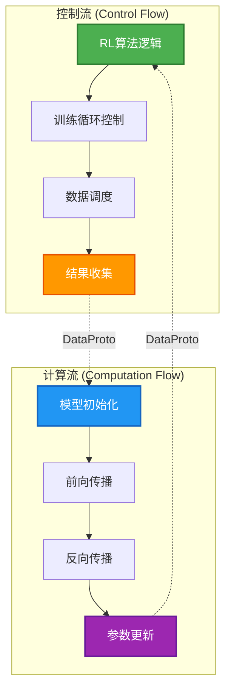

## 4. 控制流与计算流分离

### 4.1 控制流 (Control Flow)

控制流负责 RL 算法的核心逻辑，运行在单进程中：

**主要职责：**
- 训练循环管理
- 数据批次调度
- 算法参数控制
- 结果聚合分析

```python
class RayPPOTrainer:
    def fit(self):
        # 控制流：训练循环
        for epoch in range(self.config.trainer.total_epochs):
            # 1. 数据准备
            batch = self._get_training_batch()
            
            # 2. 分发到计算流
            rollout_data = self.actor_rollout_wg.generate_sequences(batch)
            
            # 3. 收集结果
            advantages = self._compute_advantages(rollout_data)
            
            # 4. 策略更新
            self._update_policy(advantages)
```

### 4.2 计算流 (Computation Flow)

计算流负责神经网络计算，运行在多进程中：

**主要职责：**
- 模型前向/反向传播
- 梯度计算和参数更新
- 分布式同步
- 内存管理

```python
@register(dispatch_mode=Dispatch.DP_COMPUTE_PROTO)
def generate_sequences(self, data: DataProto) -> DataProto:
    # 计算流：序列生成
    with torch.no_grad():
        # 1. 模型推理
        outputs = self.model.generate(
            input_ids=data.batch["input_ids"],
            attention_mask=data.batch["attention_mask"]
        )
        
        # 2. 返回结果
        return DataProto(
            batch=TensorDict({
                "generated_ids": outputs.sequences,
                "log_probs": outputs.log_probs
            }, batch_size=data.batch.batch_size),
            meta_info=data.meta_info
        )
```

### 4.3 分离的优势

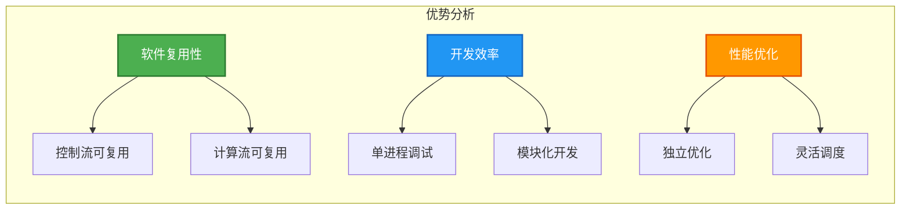

## 5. 数据流动机制

### 5.1 完整数据流动图

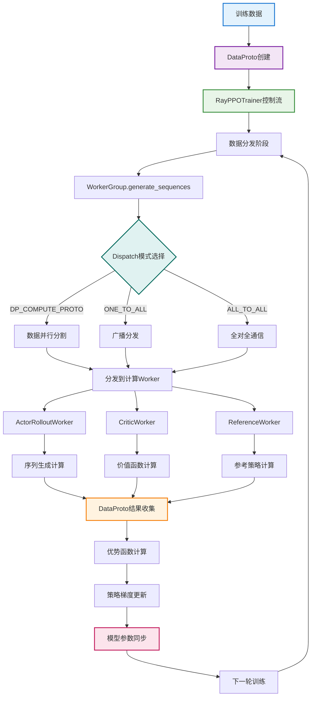

### 5.2 数据流动时间线

```mermaid
gantt
    title DataProto在分布式训练中的时间线
    dateFormat X
    axisFormat %s
    
    section 数据准备阶段
    数据加载与预处理    :0, 3
    DataProto对象创建   :3, 4
    
    section 分发阶段
    数据分割与调度     :4, 5
    网络传输与分发     :5, 7
    
    section 计算阶段
    Actor模型推理      :7, 12
    Critic价值计算     :7, 10
    Reference策略计算  :7, 11
    
    section 收集阶段
    结果收集与合并     :12, 14
    数据格式转换       :14, 15
    
    section 更新阶段
    优势函数计算       :15, 16
    策略梯度更新       :16, 18
    模型参数同步       :18, 20
```

## 6. Dispatch 模式详解

### 6.1 核心Dispatch模式

```python
class Dispatch(DynamicEnum):
    RANK_ZERO = "RANK_ZERO"                    # 只在rank 0执行
    ONE_TO_ALL = "ONE_TO_ALL"                  # 一对多广播
    ALL_TO_ALL = "ALL_TO_ALL"                  # 全对全通信
    DP_COMPUTE = "DP_COMPUTE"                   # 数据并行计算
    DP_COMPUTE_PROTO = "DP_COMPUTE_PROTO"       # DataProto数据并行
    DP_COMPUTE_PROTO_WITH_FUNC = "DP_COMPUTE_PROTO_WITH_FUNC"  # 带函数的DataProto并行
```

### 6.2 DP_COMPUTE_PROTO 实现

```python
def dispatch_dp_compute_data_proto(worker_group, *args, **kwargs):
    """DataProto数据并行分发"""
    # 自动分割DataProto到worker数量
    splitted_args, splitted_kwargs = _split_args_kwargs_data_proto_with_auto_padding(
        worker_group.world_size, *args, **kwargs
    )
    return splitted_args, splitted_kwargs

def collect_dp_compute_data_proto(worker_group, output):
    """DataProto数据并行收集"""
    output = collect_dp_compute(worker_group, output)
    return _concat_data_proto_or_future(output)
```

### 6.3 自动填充机制

```python
def _split_args_kwargs_data_proto_with_auto_padding(chunks, *args, **kwargs):
    """支持自动填充的数据分割"""
    data_proto_len = None
    padding_size = None
    
    def _padding_and_split_data(obj, chunks):
        nonlocal data_proto_len, padding_size
        if isinstance(obj, DataProto) and obj.is_padding_enabled():
            if data_proto_len is None:
                data_proto_len = len(obj)
                padding_size = (chunks - (data_proto_len % chunks)) if (data_proto_len % chunks > 0) else 0
            obj.padding(padding_size=padding_size)
        return obj.chunk(chunks=chunks)
    
    # 处理所有参数
    splitted_args = [_padding_and_split_data(arg, chunks) for arg in args]
    splitted_kwargs = {key: _padding_and_split_data(val, chunks) for key, val in kwargs.items()}
    
    return splitted_args, splitted_kwargs
```

### 6.4 Dispatch模式选择策略

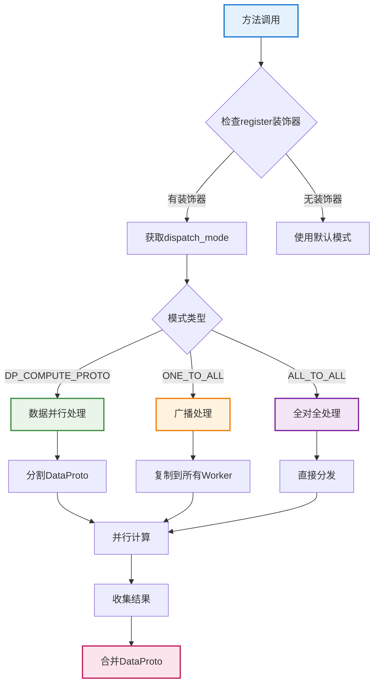

## 7. 性能优化策略

### 7.1 内存优化

**分块处理**:
```python
def chunk(self, chunks: int) -> list["DataProto"]:
    """将DataProto分割成多个块"""
    if self.batch is not None:
        batch_lst = self.batch.chunk(chunks=chunks, dim=0)
    else:
        batch_lst = [None for _ in range(chunks)]
    
    # 处理非张量数据
    non_tensor_batch_lst = [{} for _ in range(chunks)]
    for key, val in self.non_tensor_batch.items():
        non_tensor_lst = np.array_split(val, chunks)
        for i in range(chunks):
            non_tensor_batch_lst[i][key] = non_tensor_lst[i]
    
    return [type(self)(batch=batch_lst[i], 
                      non_tensor_batch=non_tensor_batch_lst[i], 
                      meta_info=self.meta_info) for i in range(chunks)]
```

**内存复用**:
```python
def to(self, device) -> "DataProto":
    """设备间数据移动"""
    if self.batch is not None:
        self.batch = self.batch.to(device)
    return self
```

### 7.2 异步执行

**DataProtoFuture**:
```python
@dataclass
class DataProtoFuture:
    """异步DataProto，避免阻塞控制流"""
    collect_fn: Callable
    futures: list[ray.ObjectRef]
    dispatch_fn: Callable = None
    
    def get(self):
        output = ray.get(self.futures)
        output = self.collect_fn(output)
        if self.dispatch_fn is not None:
            output = self.dispatch_fn(output)
        return output
```

### 7.3 流水线优化

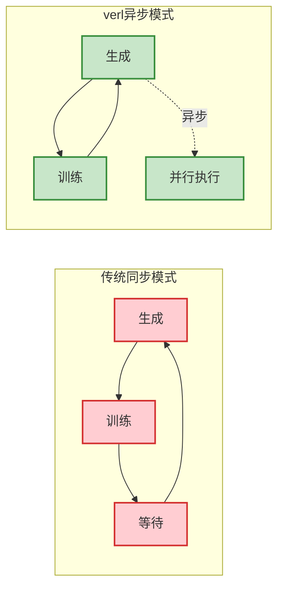

### 7.4 网络优化

**压缩传输**:
- 使用高效的序列化格式
- 支持数据压缩
- 批量传输减少网络开销

**负载均衡**:
- 动态调整数据分发策略
- 监控网络延迟和带宽
- 自适应调整批次大小

## 8. 具体RL训练示例

### 8.1 PPO训练中的DataProto实例

让我们通过一个具体的PPO训练过程来展示DataProto的实际使用：

#### 8.1.1 训练数据准备

```python
# 原始训练数据
raw_data = {
    "prompts": [
        "请计算 15 + 27 = ?",
        "求解方程 2x + 5 = 13",
        "一个圆的半径是3，求面积"
    ],
    "responses": [
        "15 + 27 = 42",
        "2x + 5 = 13\nx = 4", 
        "面积 = πr² = 9π"
    ],
    "rewards": [0.8, 0.9, 0.7]
}

# 转换为DataProto
def create_training_dataproto(raw_data):
    # 1. 文本编码
    tokenizer = AutoTokenizer.from_pretrained("Qwen/Qwen2.5-7B-Instruct")
    
    prompt_ids = []
    response_ids = []
    attention_masks = []
    
    for prompt, response in zip(raw_data["prompts"], raw_data["responses"]):
        # 编码prompt
        prompt_tokens = tokenizer.encode(prompt, add_special_tokens=True)
        prompt_ids.append(prompt_tokens)
        
        # 编码response
        response_tokens = tokenizer.encode(response, add_special_tokens=False)
        response_ids.append(response_tokens)
        
        # 创建attention mask
        total_length = len(prompt_tokens) + len(response_tokens)
        attention_masks.append([1] * total_length)
    
    # 2. 填充到相同长度
    max_length = max(len(p) + len(r) for p, r in zip(prompt_ids, response_ids))
    
    padded_prompt_ids = []
    padded_response_ids = []
    padded_attention_masks = []
    
    for p_ids, r_ids, mask in zip(prompt_ids, response_ids, attention_masks):
        # 填充prompt
        padded_p = p_ids + [tokenizer.pad_token_id] * (max_length - len(p_ids) - len(r_ids))
        padded_prompt_ids.append(padded_p)
        
        # 填充response
        padded_r = r_ids + [tokenizer.pad_token_id] * (max_length - len(p_ids) - len(r_ids))
        padded_response_ids.append(padded_r)
        
        # 更新attention mask
        padded_mask = mask + [0] * (max_length - len(mask))
        padded_attention_masks.append(padded_mask)
    
    # 3. 创建DataProto
    training_dataproto = DataProto.from_dict(
        tensors={
            "prompt_ids": torch.tensor(padded_prompt_ids, dtype=torch.long),
            "response_ids": torch.tensor(padded_response_ids, dtype=torch.long),
            "attention_mask": torch.tensor(padded_attention_masks, dtype=torch.long),
        },
        non_tensors={
            "raw_prompts": np.array(raw_data["prompts"], dtype=object),
            "raw_responses": np.array(raw_data["responses"], dtype=object),
            "rewards": np.array(raw_data["rewards"], dtype=np.float32),
        },
        meta_info={
            "dataset_name": "math_training",
            "batch_size": len(raw_data["prompts"]),
            "max_length": max_length,
            "tokenizer_name": "Qwen/Qwen2.5-7B-Instruct"
        }
    )
    
    return training_dataproto

# 创建训练数据
training_data = create_training_dataproto(raw_data)
print("DataProto结构:")
print(training_data.get_data_info())
```

**输出示例：**
```
DataProto结构:
batch
  prompt_ids: (3, 512) (torch.int64) cuda:0
  response_ids: (3, 512) (torch.int64) cuda:0
  attention_mask: (3, 512) (torch.int64) cuda:0
non_tensor_batch
  raw_prompts: ndarray(3,) (object)
  raw_responses: ndarray(3,) (object)
  rewards: ndarray(3,) (float32)
meta_info
  dataset_name: str
  batch_size: int
  max_length: int
  tokenizer_name: str
```

#### 8.1.2 数据分发过程

```python
# 假设有4个GPU worker
world_size = 4
batch_size = 3

# 原始DataProto
original_dataproto = training_data  # batch_size=3

# 自动填充到能被4整除的大小
padded_dataproto, pad_size = pad_dataproto_to_divisor(original_dataproto, world_size)
# 现在padded_dataproto的batch_size=4 (填充了1个样本)

# 分割成4个chunk
chunks = padded_dataproto.chunk(chunks=world_size)

print(f"原始batch_size: {len(original_dataproto)}")
print(f"填充后batch_size: {len(padded_dataproto)}")
print(f"分割后chunk数量: {len(chunks)}")
print(f"每个chunk的batch_size: {len(chunks[0])}")

# 分发到各个worker
for i, chunk in enumerate(chunks):
    print(f"Worker {i} 接收数据:")
    print(f"  - prompt_ids shape: {chunk.batch['prompt_ids'].shape}")
    print(f"  - 包含样本数: {len(chunk)}")
```

### 8.2 控制流与计算流交互示例

#### 8.2.1 控制流：PPO训练循环

```python
class RayPPOTrainer:
    def __init__(self, config):
        self.config = config
        self.actor_rollout_wg = None  # Actor和Rollout的WorkerGroup
        self.critic_wg = None         # Critic的WorkerGroup
        self.ref_policy_wg = None     # Reference Policy的WorkerGroup
        
    def fit(self):
        """PPO训练的主控制循环"""
        for epoch in range(self.config.trainer.total_epochs):
            print(f"开始第 {epoch} 轮训练")
            
            # 1. 获取训练批次
            batch_dataproto = self._get_training_batch()
            print(f"获取训练批次，batch_size: {len(batch_dataproto)}")
            
            # 2. 分发到Actor进行序列生成
            print("开始序列生成...")
            rollout_dataproto = self.actor_rollout_wg.generate_sequences(batch_dataproto)
            print(f"序列生成完成，生成 {len(rollout_dataproto)} 个序列")
            
            # 3. 分发到Critic计算价值
            print("开始价值计算...")
            value_dataproto = self.critic_wg.compute_values(rollout_dataproto)
            print(f"价值计算完成")
            
            # 4. 分发到Reference Policy计算log概率
            print("开始参考策略计算...")
            ref_log_prob_dataproto = self.ref_policy_wg.compute_log_probs(rollout_dataproto)
            print(f"参考策略计算完成")
            
            # 5. 在控制流中计算优势函数
            print("计算优势函数...")
            advantages = self._compute_advantages(
                rollout_dataproto, 
                value_dataproto, 
                ref_log_prob_dataproto
            )
            
            # 6. 更新Actor策略
            print("更新Actor策略...")
            self.actor_rollout_wg.update_actor(advantages)
            
            # 7. 更新Critic价值网络
            print("更新Critic价值网络...")
            self.critic_wg.update_critic(advantages)
            
            print(f"第 {epoch} 轮训练完成\n")
    
    def _get_training_batch(self):
        """获取训练批次"""
        # 从数据集中采样
        batch_data = {
            "prompt_ids": torch.randint(0, 1000, (self.config.data.train_batch_size, 512)),
            "attention_mask": torch.ones(self.config.data.train_batch_size, 512),
        }
        
        return DataProto.from_dict(
            tensors=batch_data,
            meta_info={"epoch": self.current_epoch}
        )
    
    def _compute_advantages(self, rollout_data, value_data, ref_log_prob_data):
        """计算优势函数 - 在控制流中执行"""
        # 从各个DataProto中提取数据
        rewards = rollout_data.batch["rewards"]  # [batch_size, seq_len]
        values = value_data.batch["values"]      # [batch_size, seq_len]
        log_probs = rollout_data.batch["log_probs"]  # [batch_size, seq_len]
        ref_log_probs = ref_log_prob_data.batch["log_probs"]  # [batch_size, seq_len]
        
        # 计算优势函数
        advantages = rewards - values
        advantages = advantages * rollout_data.batch["attention_mask"]
        
        # 计算策略比率
        log_ratio = log_probs - ref_log_probs
        ratio = torch.exp(log_ratio)
        
        # 创建优势DataProto
        advantages_dataproto = DataProto.from_dict(
            tensors={
                "advantages": advantages,
                "ratio": ratio,
                "rewards": rewards,
                "values": values
            },
            meta_info=rollout_data.meta_info
        )
        
        return advantages_dataproto
```

#### 8.2.2 计算流：Worker实现

```python
@ray.remote
class ActorRolloutWorker:
    def __init__(self, model_config):
        self.model = None
        self.config = model_config
        
    @register(dispatch_mode=Dispatch.DP_COMPUTE_PROTO)
    def generate_sequences(self, data: DataProto) -> DataProto:
        """生成序列 - 在计算流中执行"""
        print(f"Worker {self.rank} 开始生成序列，batch_size: {len(data)}")
        
        # 1. 模型推理
        with torch.no_grad():
            input_ids = data.batch["prompt_ids"]
            attention_mask = data.batch["attention_mask"]
            
            # 生成序列
            outputs = self.model.generate(
                input_ids=input_ids,
                attention_mask=attention_mask,
                max_new_tokens=256,
                do_sample=True,
                temperature=0.7,
                return_dict_in_generate=True,
                output_scores=True
            )
            
            # 提取生成的token ids
            generated_ids = outputs.sequences
            log_probs = torch.stack(outputs.scores, dim=1).log_softmax(dim=-1)
            
            # 计算每个token的log概率
            token_log_probs = []
            for i, seq in enumerate(generated_ids):
                seq_log_probs = []
                for j, token_id in enumerate(seq):
                    if j < len(log_probs[i]):
                        seq_log_probs.append(log_probs[i][j][token_id].item())
                token_log_probs.append(seq_log_probs)
            
            # 计算奖励（这里使用简单的长度奖励作为示例）
            rewards = torch.tensor([[len(seq) * 0.1] * len(seq) for seq in generated_ids])
        
        # 2. 创建结果DataProto
        result_dataproto = DataProto.from_dict(
            tensors={
                "generated_ids": generated_ids,
                "log_probs": torch.tensor(token_log_probs),
                "rewards": rewards,
                "attention_mask": torch.ones_like(generated_ids)
            },
            non_tensors={
                "raw_generated_texts": np.array([
                    self.tokenizer.decode(seq, skip_special_tokens=True) 
                    for seq in generated_ids
                ], dtype=object)
            },
            meta_info=data.meta_info
        )
        
        print(f"Worker {self.rank} 序列生成完成")
        return result_dataproto
    
    @register(dispatch_mode=Dispatch.DP_COMPUTE_PROTO)
    def update_actor(self, advantages: DataProto) -> None:
        """更新Actor策略 - 在计算流中执行"""
        print(f"Worker {self.rank} 开始更新Actor策略")
        
        # 1. 提取数据
        advantages_tensor = advantages.batch["advantages"]
        ratio = advantages.batch["ratio"]
        rewards = advantages.batch["rewards"]
        
        # 2. 计算PPO损失
        clip_ratio = 0.2
        policy_loss_1 = -advantages_tensor * ratio
        policy_loss_2 = -advantages_tensor * torch.clamp(ratio, 1 - clip_ratio, 1 + clip_ratio)
        policy_loss = torch.maximum(policy_loss_1, policy_loss_2).mean()
        
        # 3. 反向传播
        self.optimizer.zero_grad()
        policy_loss.backward()
        self.optimizer.step()
        
        print(f"Worker {self.rank} Actor策略更新完成，损失: {policy_loss.item():.4f}")

@ray.remote
class CriticWorker:
    def __init__(self, model_config):
        self.model = None
        self.config = model_config
        
    @register(dispatch_mode=Dispatch.DP_COMPUTE_PROTO)
    def compute_values(self, data: DataProto) -> DataProto:
        """计算价值函数 - 在计算流中执行"""
        print(f"Worker {self.rank} 开始计算价值函数")
        
        with torch.no_grad():
            input_ids = data.batch["generated_ids"]
            attention_mask = data.batch["attention_mask"]
            
            # 前向传播计算价值
            outputs = self.model(input_ids=input_ids, attention_mask=attention_mask)
            values = outputs.value  # [batch_size, seq_len]
        
        # 创建价值DataProto
        value_dataproto = DataProto.from_dict(
            tensors={"values": values},
            meta_info=data.meta_info
        )
        
        print(f"Worker {self.rank} 价值函数计算完成")
        return value_dataproto
```

### 8.3 数据流动可视化

#### 8.3.1 单轮训练的数据流动

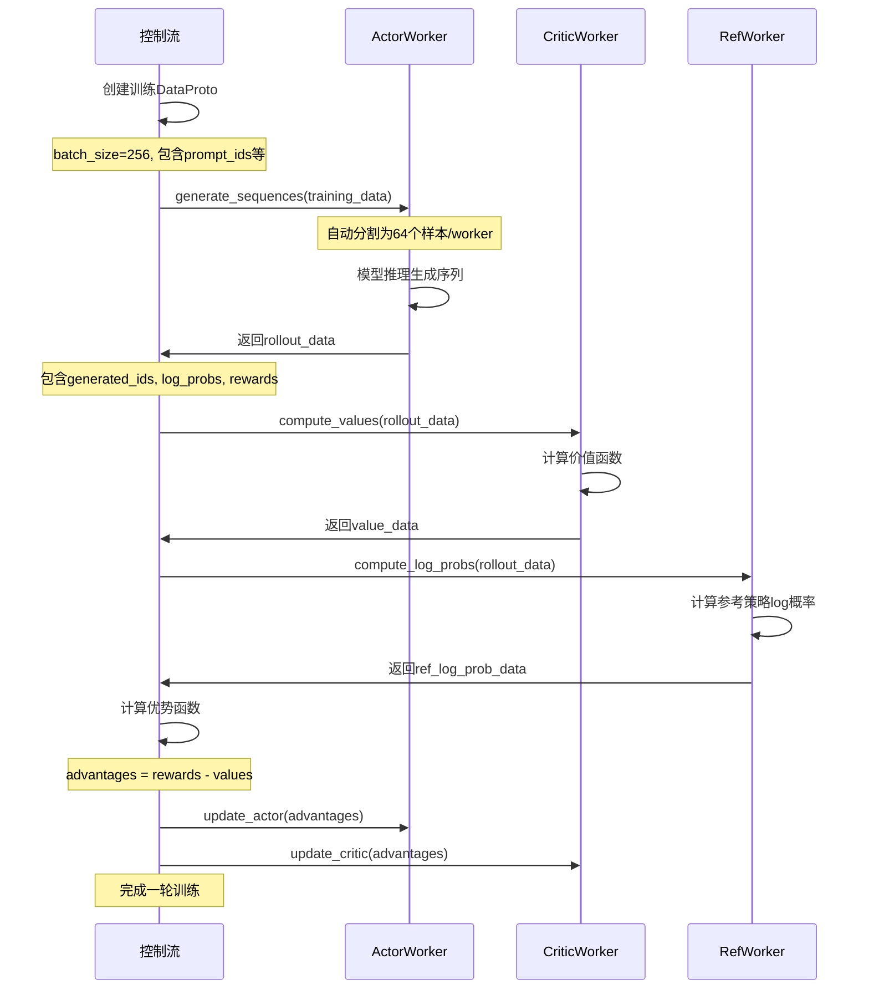

#### 8.3.2 DataProto在训练过程中的形态变化

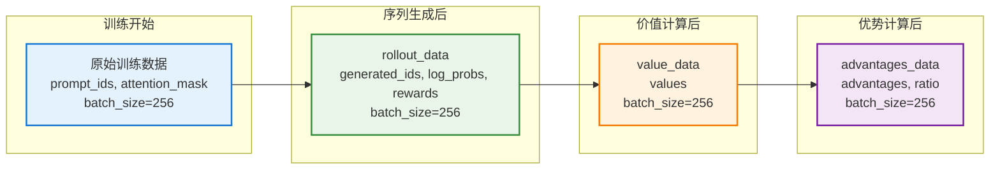

### 8.4 关键特性展示

#### 8.4.1 自动填充机制

```python
# 示例：batch_size=250, world_size=4
original_batch_size = 250
world_size = 4

# 计算需要填充的数量
padding_needed = (world_size - (original_batch_size % world_size)) % world_size
# padding_needed = 2

# 填充后的batch_size = 252，可以被4整除
final_batch_size = original_batch_size + padding_needed  # 252

# 每个worker获得 252 // 4 = 63 个样本
samples_per_worker = final_batch_size // world_size  # 63
```

#### 8.4.2 异步执行示例

```python
# 控制流中的异步调用
def async_training_step(self):
    # 1. 异步生成序列
    rollout_future = self.actor_rollout_wg.generate_sequences.remote(training_data)
    
    # 2. 控制流可以继续其他工作
    print("序列生成正在进行中...")
    
    # 3. 当需要结果时再等待
    rollout_data = ray.get(rollout_future)
    print("序列生成完成")
    
    # 4. 继续后续步骤
    value_data = self.critic_wg.compute_values(rollout_data)
```

## 9. Ray集群中的物理数据流动

### 9.1 Ray集群物理架构

#### 9.1.1 集群组成

```mermaid
graph TB
    subgraph "Head Node (主节点)"
        A[Ray Head Process]
        B[Object Store]
        C[GCS - Global Control Service]
        D[Driver Process<br/>控制流]
    end
    
    subgraph "Worker Node 1"
        E[Ray Worker Process 1]
        F[Object Store 1]
        G[ActorRolloutWorker 1]
        H[ActorRolloutWorker 2]
    end
    
    subgraph "Worker Node 2"
        I[Ray Worker Process 2]
        J[Object Store 2]
        K[CriticWorker 1]
        L[CriticWorker 2]
    end
    
    subgraph "Worker Node 3"
        M[Ray Worker Process 3]
        N[Object Store 3]
        O[ReferenceWorker 1]
        P[ReferenceWorker 2]
    end
    
    A -.->|心跳| E
    A -.->|心跳| I
    A -.->|心跳| M
    
    D -->|远程调用| G
    D -->|远程调用| H
    D -->|远程调用| K
    D -->|远程调用| L
    D -->|远程调用| O
    D -->|远程调用| P
    
    B -.->|数据共享| F
    B -.->|数据共享| J
    B -.->|数据共享| N
    
    style A fill:#4CAF50,stroke:#2E7D32,stroke-width:2px,color:#fff
    style D fill:#2196F3,stroke:#1565C0,stroke-width:2px,color:#fff
    style G fill:#FF9800,stroke:#E65100,stroke-width:2px,color:#fff
    style K fill:#9C27B0,stroke:#6A1B9A,stroke-width:2px,color:#fff
    style O fill:#607D8B,stroke:#37474F,stroke-width:2px,color:#fff
```

#### 9.1.2 Ray集群启动过程

```python
# 1. 启动Head节点
ray start --head --port=6379 --dashboard-host=0.0.0.0 --dashboard-port=8265

# 2. 启动Worker节点
ray start --address='head_node_ip:6379'

# 3. 在Driver中初始化集群
import ray
ray.init(address='ray://head_node_ip:10001')

# 4. 创建WorkerGroup
resource_pool = RayResourcePool(
    process_on_nodes=[4, 4, 4],  # 每个节点4个进程
    use_gpu=True,
    max_colocate_count=1
)

# 5. 启动Worker进程
actor_rollout_wg = RayWorkerGroup(
    resource_pool=resource_pool,
    ray_cls_with_init=RayClassWithInitArgs(ActorRolloutWorker, config)
)
```

### 9.2 Ray Object Store 核心概念

在深入理解DataProto的物理传输过程之前，我们需要先了解Ray集群中的Object Store机制，这是数据在节点间传输的基础设施。

#### 9.2.1 Object Store 概述

**Object Store**是Ray分布式系统的核心组件，用于在集群节点间高效地存储和共享数据。它基于Apache Arrow的Plasma实现，提供了高性能的分布式内存存储。

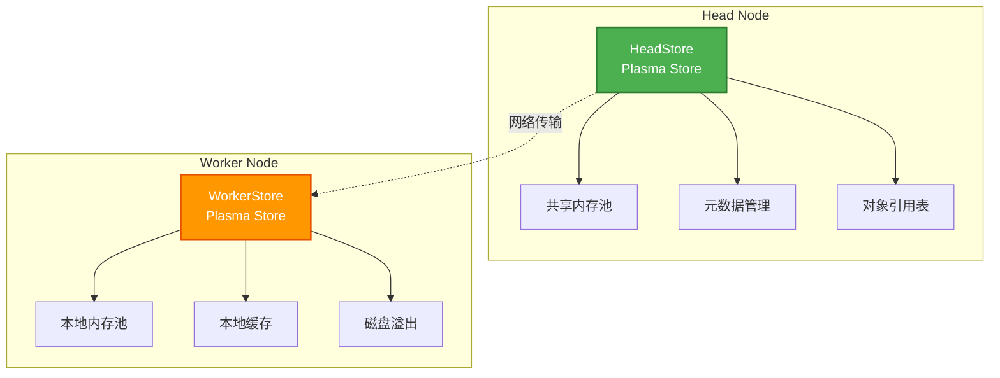

**核心组件：**
- **HeadStore**：Head节点上的Object Store，存储全局共享数据，管理元数据和对象引用
- **WorkerStore**：Worker节点上的Object Store，存储本地计算数据，提供快速数据访问

**工作原理：**
1. **数据存储**：通过`ray.put()`将数据存储到Object Store，返回ObjectRef
2. **数据获取**：通过`ray.get(ObjectRef)`从Object Store读取数据
3. **内存管理**：自动管理内存使用，支持磁盘溢出和垃圾回收

#### 9.2.2 Object Store 在verl中的作用

```python
# Object Store基本操作示例
import ray

# 1. 存储DataProto到Object Store
data_proto = DataProto.from_dict(tensors={"input_ids": torch.randn(256, 512)})
object_ref = ray.put(data_proto)  # 存储到本地Object Store

# 2. 发送ObjectRef到远程Worker
@ray.remote
def worker_function(ref):
    data = ray.get(ref)  # 从Object Store获取数据
    return process_data(data)

# 3. 执行远程调用
future = worker_function.remote(object_ref)
result = ray.get(future)
```

**关键特性：**
- **序列化优化**：自动处理DataProto的序列化和反序列化
- **内存共享**：支持跨进程和跨节点的内存共享
- **网络传输**：自动处理网络传输和错误恢复
- **性能优化**：支持数据压缩和缓存机制

### 9.3 DataProto的物理传输过程

#### 9.3.1 序列化与网络传输

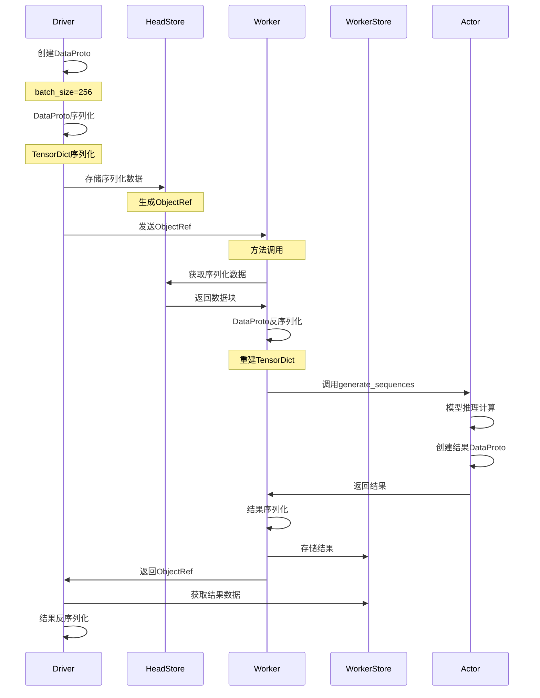

#### 9.3.2 数据序列化细节

```python
# DataProto的序列化过程
def __getstate__(self):
    """序列化DataProto"""
    import io
    buffer = io.BytesIO()
    
    # 1. 序列化TensorDict
    if self.batch is not None:
        batch_to_save = self.batch.contiguous().consolidate()
        torch.save(batch_to_save, buffer)
    
    # 2. 序列化numpy数组和meta_info
    buffer_bytes = buffer.getvalue()
    return buffer_bytes, self.non_tensor_batch, self.meta_info

def __setstate__(self, data):
    """反序列化DataProto"""
    import io
    batch_deserialized_bytes, non_tensor_batch, meta_info = data
    
    # 1. 反序列化TensorDict
    batch_deserialized = io.BytesIO(initial_bytes=batch_deserialized_bytes)
    batch = torch.load(batch_deserialized, map_location="cpu")
    
    # 2. 重建DataProto
    self.batch = batch
    self.non_tensor_batch = non_tensor_batch
    self.meta_info = meta_info
```

### 9.4 分布式数据流动架构

#### 9.4.1 多节点数据分发

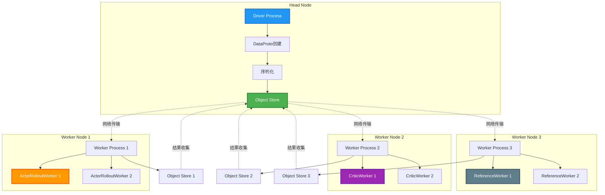

#### 9.4.2 数据并行分发过程

```python
# 实际的数据分发过程
def dispatch_dp_compute_data_proto(worker_group, *args, **kwargs):
    """DataProto数据并行分发"""
    world_size = worker_group.world_size  # 例如：8个worker
    
    # 1. 自动填充
    data_proto = args[0]  # 原始DataProto，batch_size=250
    padded_data, pad_size = pad_dataproto_to_divisor(data_proto, world_size)
    # 现在padded_data的batch_size=256 (填充了6个样本)
    
    # 2. 分割数据
    chunks = padded_data.chunk(chunks=world_size)
    # 每个chunk的batch_size=32
    
    # 3. 分发到各个worker
    futures = []
    for i, worker in enumerate(worker_group.workers):
        chunk = chunks[i]
        # 序列化chunk并通过Ray发送
        future = worker.generate_sequences.remote(chunk)
        futures.append(future)
    
    return futures

# 在物理层面的实际传输
def physical_data_transfer_example():
    """展示物理层面的数据传输"""
    
    # 原始数据大小
    batch_size = 250
    seq_len = 512
    vocab_size = 32000
    
    # 计算数据大小
    prompt_ids_size = batch_size * seq_len * 4  # int32, bytes
    attention_mask_size = batch_size * seq_len * 4  # int32, bytes
    tensor_data_size = prompt_ids_size + attention_mask_size  # ~2MB
    
    # 序列化开销
    serialization_overhead = tensor_data_size * 0.1  # 约10%开销
    
    # 网络传输
    network_bandwidth = 10 * 1024 * 1024  # 10Gbps
    transfer_time = (tensor_data_size + serialization_overhead) / network_bandwidth
    
    print(f"数据大小: {tensor_data_size / 1024 / 1024:.2f} MB")
    print(f"序列化开销: {serialization_overhead / 1024 / 1024:.2f} MB")
    print(f"传输时间: {transfer_time * 1000:.2f} ms")
```

### 9.5 内存管理与对象存储

#### 9.5.1 Ray Object Store架构

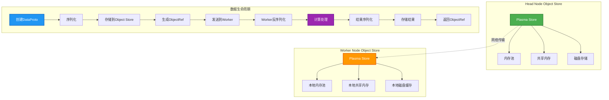

#### 9.5.2 内存优化策略

```python
# 内存优化示例
class MemoryOptimizedDataProto:
    def __init__(self):
        self.object_refs = {}  # 缓存ObjectRef
        
    def send_to_worker(self, data_proto, worker_id):
        """优化的数据传输"""
        
        # 1. 检查是否已有缓存
        cache_key = f"{worker_id}_{hash(data_proto)}"
        if cache_key in self.object_refs:
            return self.object_refs[cache_key]
        
        # 2. 序列化并存储
        object_ref = ray.put(data_proto)
        self.object_refs[cache_key] = object_ref
        
        # 3. 发送到worker
        return object_ref
    
    def cleanup_cache(self):
        """清理缓存"""
        for ref in self.object_refs.values():
            ray.delete(ref)
        self.object_refs.clear()
```

### 9.6 网络拓扑与性能优化

#### 9.6.1 网络拓扑图

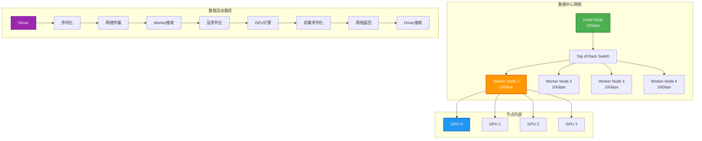

#### 9.6.2 性能监控

```python
# 性能监控示例
import time
import psutil
import ray

class PerformanceMonitor:
    def __init__(self):
        self.metrics = {}
        
    def monitor_data_transfer(self, data_proto, worker_id):
        """监控数据传输性能"""
        start_time = time.time()
        
        # 记录内存使用
        memory_before = psutil.virtual_memory().used
        
        # 执行数据传输
        object_ref = ray.put(data_proto)
        result = ray.get(worker_id.generate_sequences.remote(object_ref))
        
        end_time = time.time()
        memory_after = psutil.virtual_memory().used
        
        # 记录指标
        transfer_time = end_time - start_time
        memory_used = memory_after - memory_before
        data_size = len(data_proto.batch) * data_proto.batch.batch_size[0] * 4  # 估算大小
        
        self.metrics[f"transfer_{worker_id}"] = {
            "time": transfer_time,
            "memory": memory_used,
            "data_size": data_size,
            "throughput": data_size / transfer_time
        }
        
        return result
    
    def get_performance_report(self):
        """生成性能报告"""
        total_time = sum(m["time"] for m in self.metrics.values())
        total_data = sum(m["data_size"] for m in self.metrics.values())
        avg_throughput = total_data / total_time if total_time > 0 else 0
        
        return {
            "total_transfer_time": total_time,
            "total_data_transferred": total_data,
            "average_throughput": avg_throughput,
            "worker_metrics": self.metrics
        }
```

### 9.7 故障处理与容错

#### 9.7.1 故障恢复机制

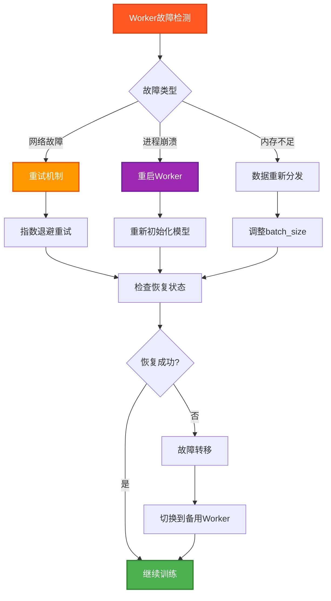

## 10. 总结

### 10.1 核心优势

1. **架构清晰**: 控制流与计算流分离，职责明确
2. **高度可扩展**: 支持多种计算后端和并行策略
3. **开发友好**: 单进程控制流便于调试和开发
4. **性能优异**: 异步执行和内存优化提升训练效率

### 10.2 技术特点

- **DataProto协议**: 统一的数据交换接口
- **Dispatch模式**: 灵活的数据分发策略
- **异步执行**: 支持非阻塞的分布式计算
- **内存优化**: 高效的内存管理和复用机制

### 10.3 应用场景

- **大规模RL训练**: 支持多节点、多GPU训练
- **算法研究**: 便于实现和测试新的RL算法
- **生产部署**: 支持高效的模型训练和推理
- **框架扩展**: 易于集成新的计算后端和优化策略

Verl 通过 DataProto 和 HybridFlow 设计，成功解决了大规模强化学习训练中的架构挑战，为LLM后训练提供了高效、灵活、可扩展的解决方案。 