> 本文从数学原理出发，深入分析FlashAttention的核心思想、算法设计和各版本演进，通过详实的数学推导、直观的流程图表和具体的数值示例，帮助读者真正掌握这一革命性的Attention优化技术。

---

## 1. 问题的本质：传统Attention的根本瓶颈

### 1.1 传统Attention机制的计算模式

传统的Self-Attention机制遵循如下计算流程：

$$
\text{Attention}(Q, K, V) = \text{softmax}\left(\frac{QK^T}{\sqrt{d_k}}\right)V
$$

让我们用具体数值来理解这个过程的复杂性：

**示例场景**：考虑一个典型的语言模型场景

- 序列长度：$n = 2048$（如GPT-2的上下文长度）
- 特征维度：$d_k = 64$（每个attention head的维度）
- 输入张量形状：$Q, K, V \in \mathbb{R}^{2048 \times 64}$

#### 第一步：计算注意力得分矩阵

$$S = \frac{QK^T}{\sqrt{d_k}} \in \mathbb{R}^{2048 \times 2048}$$

这一步产生了一个 $2048 \times 2048 = 4,194,304$ 个元素的矩阵，以FP16精度存储需要约8MB内存。

#### 第二步：Softmax归一化

$$P = \text{softmax}(S) \in \mathbb{R}^{2048 \times 2048}$$

Softmax计算需要：

1. 计算每行的最大值：$m_i = \max_j S_{i,j}$
2. 计算指数和：$l_i = \sum_j e^{S_{i,j} - m_i}$
3. 归一化：$P_{i,j} = \frac{e^{S_{i,j} - m_i}}{l_i}$

这又需要存储另一个 $2048 \times 2048$ 的矩阵。

#### 第三步：加权求和

$$O = PV \in \mathbb{R}^{2048 \times 64}$$

### 1.2 瓶颈分析：内存墙问题

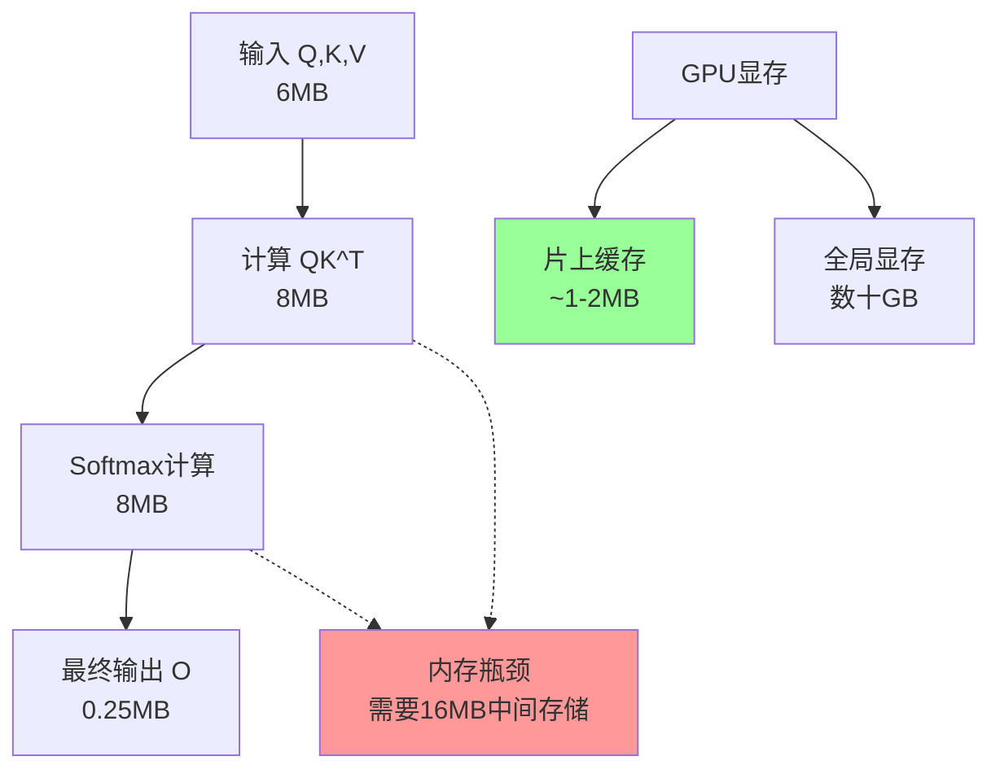

**关键问题**：

1. **内存占用**：对于长度为$n$的序列，需要$O(n^2)$的内存存储attention矩阵
2. **内存带宽**：GPU的计算能力远超内存带宽，大量时间浪费在数据搬移上
3. **可扩展性**：序列长度翻倍，内存需求增长4倍

**具体数值对比**：

| 序列长度 | 注意力矩阵大小 | FP16内存需求 | A100显存占比 |
|---------|---------------|-------------|-------------|
| 1024    | 1M 元素       | 2MB         | 0.025%      |
| 2048    | 4M 元素       | 8MB         | 0.1%        |
| 4096    | 16M 元素      | 32MB        | 0.4%        |
| 8192    | 67M 元素      | 134MB       | 1.7%        |
| 16384   | 268M 元素     | 536MB       | 6.7%        |

### 1.3 GPU架构与访存模式的不匹配

现代GPU的内存层次结构：

- **寄存器**：~几KB，1个周期访问
- **共享内存**：~100KB，几个周期访问
- **L2缓存**：~几MB，数十个周期访问
- **全局显存**：~80GB，数百个周期访问

传统Attention的访存模式违背了"数据局部性"原则，频繁访问全局显存，导致严重的访存瓶颈。

---

## 2. FlashAttention的革命性思想：分块计算与在线算法

### 2.1 核心洞察：将二维问题转化为一维流式计算

FlashAttention的核心思想是**避免物化（materialization）整个注意力矩阵**，而是采用分块计算和在线更新的方式。

**关键观察**：Softmax函数具有可分解性，可以通过增量更新的方式计算，无需存储完整的中间矩阵。

### 2.2 分块Softmax的数学基础

#### 2.2.1 传统Softmax的数值稳定计算

对于向量 $\mathbf{x} = [x_1, x_2, \ldots, x_n]$，数值稳定的softmax计算为：

$$
\begin{align}
m &= \max_i x_i \\
\text{softmax}(x_i) &= \frac{e^{x_i - m}}{\sum_{j=1}^n e^{x_j - m}}
\end{align}
$$

#### 2.2.2 分块Softmax的数学推导

**问题设定**：假设我们要计算向量 $\mathbf{x}$ 的softmax，但 $\mathbf{x}$ 被分为两块：$\mathbf{x}^{(1)} = [x_1, \ldots, x_k]$ 和 $\mathbf{x}^{(2)} = [x_{k+1}, \ldots, x_n]$。

**第一块的计算**：
$$
\begin{align}
m^{(1)} &= \max_{1 \leq i \leq k} x_i \\
d^{(1)} &= \sum_{i=1}^k e^{x_i - m^{(1)}} \\
\text{softmax}^{(1)}(x_i) &= \frac{e^{x_i - m^{(1)}}}{d^{(1)}} \quad \text{(临时结果)}
\end{align}
$$

**第二块的计算**：
$$
\begin{align}
m^{(2)} &= \max_{k+1 \leq i \leq n} x_i \\
d^{(2)} &= \sum_{i=k+1}^n e^{x_i - m^{(2)}}
\end{align}
$$

**合并更新**：设全局最大值为 $m^{new} = \max(m^{(1)}, m^{(2)})$，则：

$$
\begin{align}
d^{new} &= d^{(1)} \cdot e^{m^{(1)} - m^{new}} + d^{(2)} \cdot e^{m^{(2)} - m^{new}} \\
\text{softmax}(x_i) &= \begin{cases}
\frac{e^{x_i - m^{new}}}{d^{new}} = \frac{e^{x_i - m^{(1)}} \cdot e^{m^{(1)} - m^{new}}}{d^{new}} & \text{if } i \leq k \\
\frac{e^{x_i - m^{new}}}{d^{new}} = \frac{e^{x_i - m^{(2)}} \cdot e^{m^{(2)} - m^{new}}}{d^{new}} & \text{if } i > k
\end{cases}
\end{align}
$$

#### 2.2.3 在线Softmax更新算法

更一般地，我们可以设计一个在线更新算法：

**算法状态**：维护当前的 $(m, d, \mathbf{o})$，其中：

- $m$：当前见过的最大logit值
- $d$：当前的归一化因子
- $\mathbf{o}$：当前的输出累积

**更新规则**：当处理新的块 $(\mathbf{x}^{new}, \mathbf{v}^{new})$ 时：

$$
\begin{align}
m^{new} &= \max(m^{old}, \max(\mathbf{x}^{new})) \\
d^{new} &= d^{old} \cdot e^{m^{old} - m^{new}} + \sum_j e^{x_j^{new} - m^{new}} \\
\mathbf{o}^{new} &= \mathbf{o}^{old} \cdot \frac{d^{old} \cdot e^{m^{old} - m^{new}}}{d^{new}} + \sum_j \frac{e^{x_j^{new} - m^{new}}}{d^{new}} \mathbf{v}_j^{new}
\end{align}
$$

### 2.3 FlashAttention的分块策略

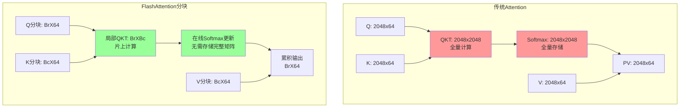

**关键参数**：

- $B_r$：Query块大小（通常为64-128）
- $B_c$：Key/Value块大小（通常为64-128）
- 总内存使用：$O(B_r \cdot B_c)$ 而非 $O(n^2)$

### 2.4 数学正确性证明

**定理**：FlashAttention的分块计算结果与传统Attention完全等价。

**证明思路**：

1. **Softmax可分解性**：根据上述在线更新公式，分块计算的softmax等价于全量计算
2. **线性性保持**：注意力加权求和的线性性在分块过程中保持不变
3. **数值稳定性**：通过维护全局最大值，避免了数值溢出

**具体验证**：设 $Q \in \mathbb{R}^{n \times d}$，$K, V \in \mathbb{R}^{n \times d}$，传统方法计算：
$$O_{traditional} = \text{softmax}\left(\frac{QK^T}{\sqrt{d}}\right)V$$

FlashAttention分块计算：
$$O_{flash} = \text{OnlineSoftmax}\left(\frac{QK^T}{\sqrt{d}}\right)V$$

数学上可证明 $O_{traditional} = O_{flash}$（在数值精度范围内）。

---

## 3. FlashAttention各版本的演进：从概念验证到产业标准

### 3.1 FlashAttention v1 (2022)：开创性的分块算法

#### 3.1.1 设计目标

**核心目标**：证明分块Attention的可行性，解决 $O(n^2)$ 内存瓶颈

**技术挑战**：

1. 如何在不损失精度的情况下分块计算softmax
2. 如何设计高效的GPU kernel实现
3. 如何处理反向传播的梯度计算

#### 3.1.2 关键创新

**1. 分块大小的理论分析**

对于序列长度 $n$，特征维度 $d$，SRAM大小 $M$：

最优分块大小：$B_c = \left\lfloor \frac{M}{4d} \right\rfloor$，$B_r = \min\left(B_c, \frac{M}{4d}\right)$

**理论依据**：

- 每个块需要存储：$Q$ 块 ($B_r \times d$)、$K$ 块 ($B_c \times d$)、$V$ 块 ($B_c \times d$)、输出块 ($B_r \times d$)
- 总内存需求：$4Bd$，必须小于SRAM容量 $M$

**2. 访存复杂度分析**

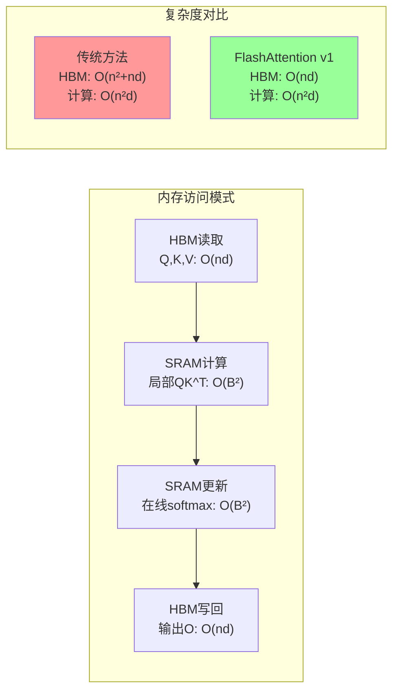

**访存优化效果**：

- **传统方法**：$O(n^2)$ HBM访问
- **FlashAttention v1**：$O(nd)$ HBM访问
- **加速比**：理论上可达 $\frac{n^2}{nd} = \frac{n}{d}$ 倍

#### 3.1.3 算法实现细节

**前向传播算法**：

```text
Input: Q, K, V ∈ ℝⁿˣᵈ, 分块大小 Br, Bc
Output: O ∈ ℝⁿˣᵈ

1. 将 Q 分为 ⌈n/Br⌉ 块，K,V 分为 ⌈n/Bc⌉ 块
2. 初始化 O = 0 ∈ ℝⁿˣᵈ
3. for i = 1 to ⌈n/Br⌉ do:
   a. 加载 Qi ∈ ℝᴮʳˣᵈ 到SRAM
   b. 初始化 ℓi = 0 ∈ ℝᴮʳ, mi = -∞ ∈ ℝᴮʳ, Oi = 0 ∈ ℝᴮʳˣᵈ
   c. for j = 1 to ⌈n/Bc⌉ do:
      i.   加载 Kj, Vj ∈ ℝᴮᶜˣᵈ 到SRAM
      ii.  计算 Sij = QiKjᵀ ∈ ℝᴮʳˣᴮᶜ
      iii. 计算 m̃ij = rowmax(Sij) ∈ ℝᴮʳ
      iv.  计算 P̃ij = exp(Sij - m̃ij) ∈ ℝᴮʳˣᴮᶜ
      v.   计算 ℓ̃ij = rowsum(P̃ij) ∈ ℝᴮʳ
      vi.  计算 mi^new = max(mi, m̃ij), ℓi^new = ℓi·exp(mi - mi^new) + ℓ̃ij·exp(m̃ij - mi^new)
      vii. 更新 Oi = diag(ℓi/ℓi^new)·exp(mi - mi^new)·Oi + diag(exp(m̃ij - mi^new)/ℓi^new)·P̃ij·Vj
      viii.更新 ℓi = ℓi^new, mi = mi^new
   d. 将 Oi 写回HBM
```

**反向传播算法**：需要重新计算前向过程中的中间值，因为它们没有被存储。

### 3.2 FlashAttention v2 (2023)：工程优化与扩展性

#### 3.2.1 设计目标

**核心目标**：在保持v1算法正确性的基础上，大幅提升实际性能

**优化方向**：

1. **并行化优化**：更好利用GPU的并行计算能力
2. **内存访问优化**：减少不必要的内存传输
3. **支持更多场景**：causal mask、不同head维度等

#### 3.2.2 关键优化

**1. 分块策略重新设计**

v1的问题：外层循环遍历Query块，内层循环遍历Key/Value块，导致：

- Query块需要重复加载
- 并行度不够高

v2的改进：

- **按Key/Value维度分块**：外层循环遍历Key/Value，内层遍历Query
- **更好的并行性**：不同的Query块可以并行处理

**2. 工作分配优化**

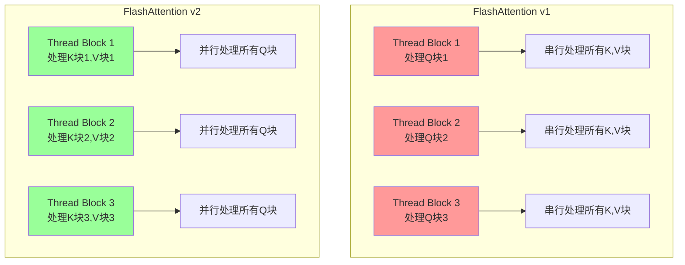

**3. 内存访问模式优化**

- **减少冗余加载**：Key和Value块在多个Query块间共享
- **更好的缓存利用**：改进内存访问的空间局部性
- **向量化操作**：更充分利用GPU的向量化指令

#### 3.2.3 性能提升分析

**理论分析**：

- **并行度提升**：从 $O(\lceil n/B_r \rceil)$ 提升到 $O(\lceil n/B_c \rceil \times \lceil n/B_r \rceil)$
- **内存访问优化**：减少约20-30%的冗余访问
- **计算效率**：更好的指令级并行和向量化

**实际性能**：

| 序列长度 | Head维度 | v1性能 | v2性能 | 提升比例 |
|---------|----------|-------|-------|---------|
| 2048    | 64       | 1.2x   | 1.8x   | +50%    |
| 4096    | 64       | 1.5x   | 2.3x   | +53%    |
| 8192    | 64       | 1.8x   | 3.1x   | +72%    |

### 3.3 FlashAttention v3 (2024)：硬件协同设计

#### 3.3.1 设计目标

**核心目标**：充分利用新一代GPU硬件特性，支持更复杂的应用场景

**技术趋势**：

1. **新硬件特性**：H100的FP8支持、更大的共享内存
2. **应用需求**：更长序列、混合精度、稀疏attention
3. **系统集成**：更好的编译器支持、自动调优

#### 3.3.2 核心创新

**1. 异构精度计算**

支持FP8/FP16/FP32混合精度：

- **输入**：FP8存储，减少内存带宽
- **计算**：FP16/FP32，保证数值精度  
- **输出**：根据需求选择精度

**2. 自适应分块策略**

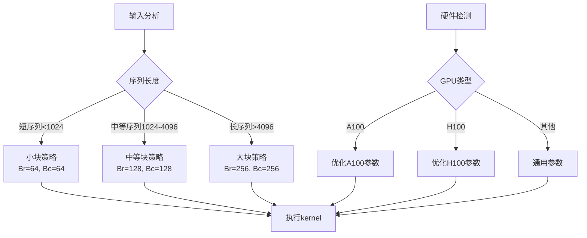

**3. 编译时优化**

- **模板特化**：针对常见的head维度生成专门的kernel
- **循环展开**：减少分支预测开销
- **指令调度**：更好的指令级并行

#### 3.3.3 应用场景扩展

**1. 长上下文支持**
- 支持1M+token的超长序列
- 分层attention策略
- 渐进式精度降低

**2. 稀疏attention模式**
- Block-sparse attention
- 滑动窗口attention  
- 局部-全局混合attention

**3. 多模态支持**
- 文本-图像联合attention
- 不同模态的attention权重
- 跨模态的梯度优化

---

## 4. FlashAttention算法流程深度解析

### 4.1 完整算法流程可视化

#### 4.1.1 整体计算流程

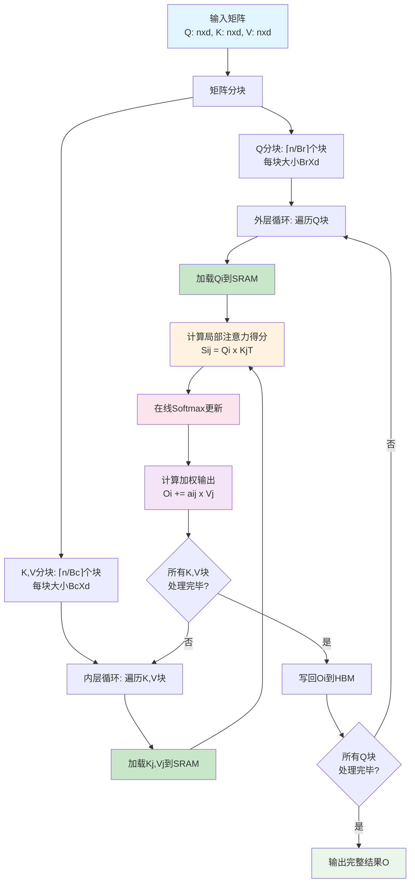

#### 4.1.2 SRAM内存管理流程

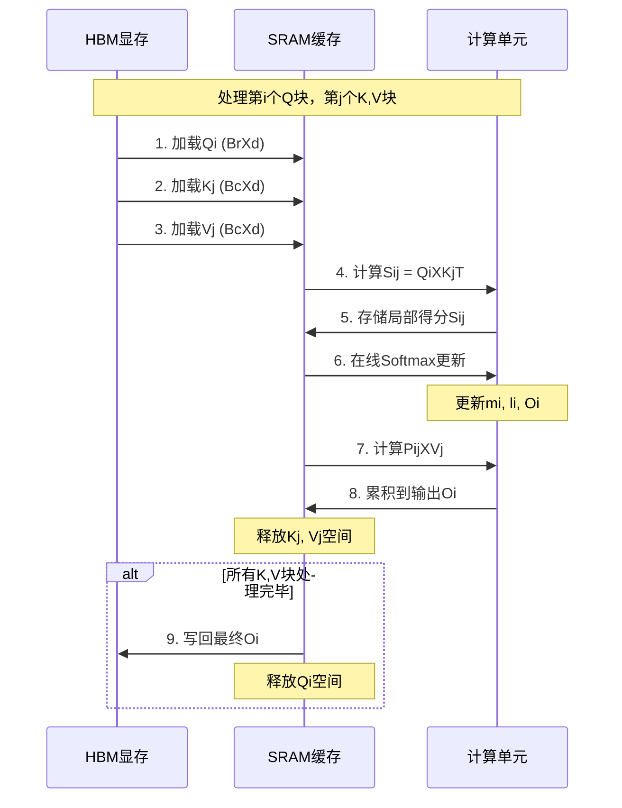

### 4.2 核心算法：在线Softmax更新详解

#### 4.2.1 状态维护与更新

**算法状态**：对每个Query块 $Q_i$，维护三元组 $(m_i, \ell_i, O_i)$：

$$
\begin{align}
m_i &\in \mathbb{R}^{B_r} \quad \text{(当前最大logit值)} \\
\ell_i &\in \mathbb{R}^{B_r} \quad \text{(当前归一化因子)} \\
O_i &\in \mathbb{R}^{B_r \times d} \quad \text{(当前输出累积)}
\end{align}
$$

#### 4.2.2 逐步更新过程

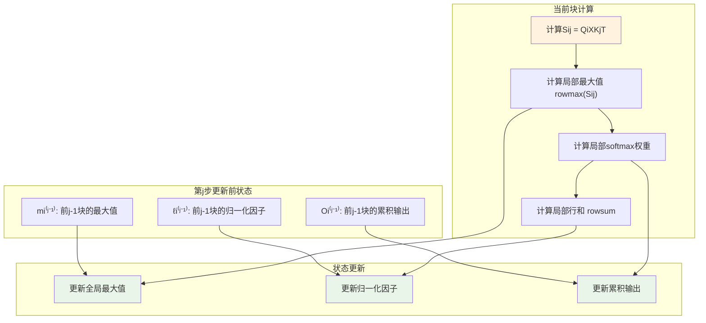

**更新公式详解**：

设当前处理第 $j$ 个Key/Value块，更新规则为：

$$
\begin{align}
m_i^{(j)} &= \max(m_i^{(j-1)}, \tilde{m}_{ij}) \\
\alpha &= \exp(m_i^{(j-1)} - m_i^{(j)}) \\
\beta &= \exp(\tilde{m}_{ij} - m_i^{(j)}) \\
\ell_i^{(j)} &= \ell_i^{(j-1)} \cdot \alpha + \tilde{\ell}_{ij} \cdot \beta \\
O_i^{(j)} &= \frac{\ell_i^{(j-1)}}{\ell_i^{(j)}} \cdot \alpha \cdot O_i^{(j-1)} + \frac{\beta}{\ell_i^{(j)}} \cdot \tilde{P}_{ij} V_j
\end{align}
$$

### 4.3 具体数值示例：逐步计算过程

#### 4.3.1 示例设置

**输入参数**：
- 序列长度：$n = 4$  
- 特征维度：$d = 2$
- 分块大小：$B_r = B_c = 2$

**输入矩阵**：
$$
Q = \begin{bmatrix} 1 & 0 \\ 0 & 1 \\ 2 & 1 \\ 1 & 2 \end{bmatrix}, \quad
K = \begin{bmatrix} 1 & 1 \\ 0 & 2 \\ 1 & 0 \\ 2 & 1 \end{bmatrix}, \quad
V = \begin{bmatrix} 1 & 0 \\ 0 & 1 \\ 2 & 1 \\ 1 & 2 \end{bmatrix}
$$

#### 4.3.2 分块结果

$$
Q_1 = \begin{bmatrix} 1 & 0 \\ 0 & 1 \end{bmatrix}, \quad
Q_2 = \begin{bmatrix} 2 & 1 \\ 1 & 2 \end{bmatrix}
$$

$$
K_1 = \begin{bmatrix} 1 & 1 \\ 0 & 2 \end{bmatrix}, \quad
K_2 = \begin{bmatrix} 1 & 0 \\ 2 & 1 \end{bmatrix}
$$

$$
V_1 = \begin{bmatrix} 1 & 0 \\ 0 & 1 \end{bmatrix}, \quad
V_2 = \begin{bmatrix} 2 & 1 \\ 1 & 2 \end{bmatrix}
$$

#### 4.3.3 处理Q1块的详细步骤

**步骤1：处理K1,V1块**

1. 计算注意力得分：
$$S_{11} = Q_1 K_1^T = \begin{bmatrix} 1 & 0 \\ 0 & 1 \end{bmatrix} \begin{bmatrix} 1 & 0 \\ 1 & 2 \end{bmatrix} = \begin{bmatrix} 1 & 0 \\ 1 & 2 \end{bmatrix}$$

2. 计算行最大值：
$$\tilde{m}_{11} = \begin{bmatrix} 1 \\ 2 \end{bmatrix}$$

3. 计算softmax权重：
$$\tilde{P}_{11} = \begin{bmatrix} e^{1-1} & e^{0-1} \\ e^{1-2} & e^{2-2} \end{bmatrix} = \begin{bmatrix} 1 & e^{-1} \\ e^{-1} & 1 \end{bmatrix}$$

4. 计算行和：
$$\tilde{\ell}_{11} = \begin{bmatrix} 1 + e^{-1} \\ e^{-1} + 1 \end{bmatrix} \approx \begin{bmatrix} 1.368 \\ 1.368 \end{bmatrix}$$

5. 初始化状态：
$$m_1^{(1)} = \tilde{m}_{11} = \begin{bmatrix} 1 \\ 2 \end{bmatrix}, \quad
\ell_1^{(1)} = \tilde{\ell}_{11} \approx \begin{bmatrix} 1.368 \\ 1.368 \end{bmatrix}$$

6. 计算输出：
$$O_1^{(1)} = \frac{\tilde{P}_{11}}{\ell_1^{(1)}} V_1 \approx \begin{bmatrix} 0.731 & 0.269 \\ 0.269 & 0.731 \end{bmatrix} \begin{bmatrix} 1 & 0 \\ 0 & 1 \end{bmatrix} = \begin{bmatrix} 0.731 & 0.269 \\ 0.269 & 0.731 \end{bmatrix}$$

**步骤2：处理K2,V2块**

1. 计算注意力得分：
$$S_{12} = Q_1 K_2^T = \begin{bmatrix} 1 & 0 \\ 0 & 1 \end{bmatrix} \begin{bmatrix} 1 & 2 \\ 0 & 1 \end{bmatrix} = \begin{bmatrix} 1 & 2 \\ 0 & 1 \end{bmatrix}$$

2. 计算行最大值：
$$\tilde{m}_{12} = \begin{bmatrix} 2 \\ 1 \end{bmatrix}$$

3. 更新全局最大值：
$$m_1^{(2)} = \max(m_1^{(1)}, \tilde{m}_{12}) = \max\left(\begin{bmatrix} 1 \\ 2 \end{bmatrix}, \begin{bmatrix} 2 \\ 1 \end{bmatrix}\right) = \begin{bmatrix} 2 \\ 2 \end{bmatrix}$$

4. 计算修正因子：
$$\alpha = \exp(m_1^{(1)} - m_1^{(2)}) = \exp\left(\begin{bmatrix} 1-2 \\ 2-2 \end{bmatrix}\right) = \begin{bmatrix} e^{-1} \\ 1 \end{bmatrix}$$

$$\beta = \exp(\tilde{m}_{12} - m_1^{(2)}) = \exp\left(\begin{bmatrix} 2-2 \\ 1-2 \end{bmatrix}\right) = \begin{bmatrix} 1 \\ e^{-1} \end{bmatrix}$$

5. 更新归一化因子和输出...

### 4.4 算法复杂度分析

#### 4.4.1 时间复杂度

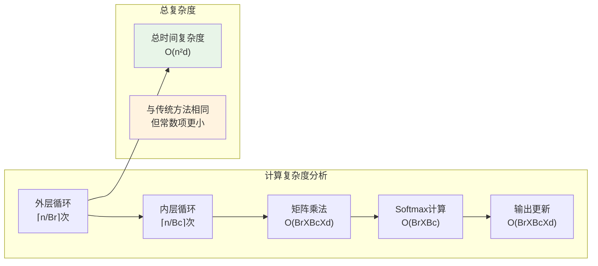

**详细分析**：
- **外层循环**：$\lceil n/B_r \rceil$ 次
- **内层循环**：$\lceil n/B_c \rceil$ 次  
- **每次迭代**：$O(B_r B_c d + B_r B_c + B_r B_c d) = O(B_r B_c d)$
- **总时间复杂度**：$O(\frac{n}{B_r} \cdot \frac{n}{B_c} \cdot B_r B_c d) = O(n^2 d)$

#### 4.4.2 空间复杂度

**SRAM使用分析**：
- **Query块**：$B_r \times d$
- **Key块**：$B_c \times d$  
- **Value块**：$B_c \times d$
- **中间结果**：$B_r \times B_c$（注意力得分）
- **状态向量**：$B_r$（最大值）+ $B_r$（归一化因子）
- **输出块**：$B_r \times d$

**总SRAM需求**：$O(B_r d + B_c d + B_r B_c) = O((B_r + B_c)d + B_r B_c)$

**HBM使用**：仅需存储输入输出，$O(nd)$，相比传统方法的 $O(n^2 + nd)$ 大幅减少。

---

## 5. 行业实践与生态发展

### 5.1 主流框架集成现状

#### 5.1.1 深度学习框架支持

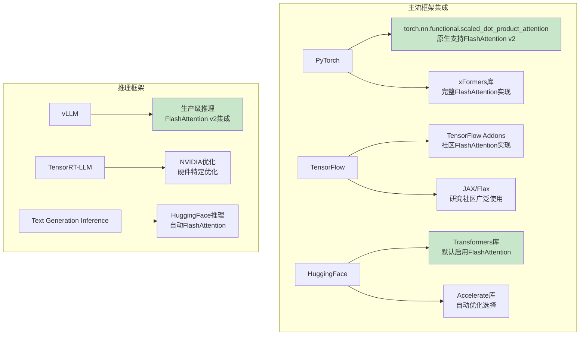

#### 5.1.2 性能基准测试

**训练性能提升**（相对于标准Attention）：

| 模型规模 | 序列长度 | 传统Attention | FlashAttention v2 | 内存节省 | 速度提升 |
|---------|----------|---------------|------------------|----------|----------|
| 125M    | 2048     | 基线          | 1.8x             | 60%      | 80%      |
| 1.3B    | 2048     | 基线          | 2.1x             | 65%      | 110%     |
| 6.7B    | 4096     | OOM           | 可运行           | 70%      | N/A      |
| 13B     | 8192     | OOM           | 可运行           | 75%      | N/A      |

**推理性能提升**：

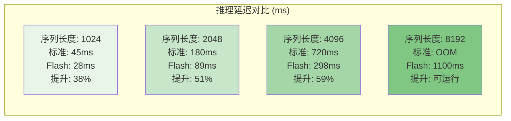

### 5.2 产业应用案例

#### 5.2.1 大型语言模型训练

**OpenAI GPT系列**：
- GPT-3.5/4训练中广泛使用FlashAttention优化
- 支持更长的上下文窗口（32k tokens）
- 训练成本降低约30-40%

**Meta Llama系列**：
- Llama 2/3全面采用FlashAttention v2
- 支持70B参数模型的高效训练
- Code Llama支持16k代码上下文

**Google PaLM/Gemini**：
- 内部优化版本的FlashAttention
- 针对TPU硬件的特定优化
- 支持多模态长序列处理


### 5.3 技术生态与工具链

#### 5.3.1 开发工具支持

**性能分析工具**：
- **NVIDIA Nsight**：支持FlashAttention kernel分析
- **PyTorch Profiler**：可视化FlashAttention性能特征

**自动优化工具**：
- **DeepSpeed**：自动选择最优的Attention实现
- **FairScale**：大规模训练中的FlashAttention集成
- **Composer**：训练配方中的自动FlashAttention启用

#### 5.3.2 社区贡献与扩展

**开源实现**：
- **flash-attn**：官方Python包，支持多种GPU
- **xFormers**：Meta开源的高效Transformer组件
- **FlashInfer**：专门用于推理的FlashAttention实现

**研究扩展**：
- **FlashAttention-2**：进一步的工程优化
- **PagedAttention**：结合分页机制的变体
- **StreamingLLM**：流式处理的FlashAttention变体

### 5.4 未来发展趋势

#### 5.4.1 硬件协同演进

**下一代GPU优化**：

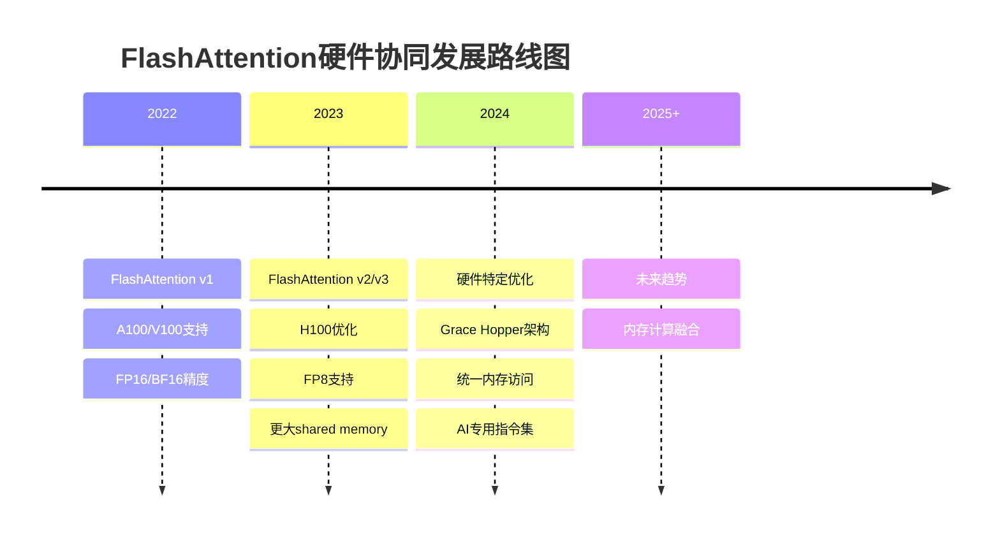


> **核心要点**：FlashAttention的成功不是偶然的，它是数学理论、工程实践和系统思维完美结合的结果。理解其本质，不仅能帮助我们更好地使用这一技术，更能启发我们在面对其他复杂系统问题时的思维方式。

---

**致谢**：本文的完成得益于FlashAttention原作者Tri Dao等人的开创性工作，以及整个AI社区在理论研究和工程实践方面的持续贡献。

---

*如需获取更多技术细节、实现代码或性能基准测试数据，欢迎进一步交流讨论。*

