+++
date = '2026-06-10'
draft = false
title = 'DeepSeek-V4-Flash 架构深度拆解'
categories = ['architecture']
vendor = 'DeepSeek'
tags = ['moe', 'attention', 'model-architecture', 'mla', 'csa', 'hca', 'deepseek', 'training', 'muon']
series = ['architecture']
summary = 'V4-Flash（284B 总参 / 13B 激活）是 DeepSeek 2026-04-24 发布的旗舰 MoE 模型。核心创新为 CSA+HCA 混合稀疏注意力（长上下文 1M 支持）、62 层 384 专家 MoE、mHC 多通道残差替代 Pre-Norm、Muon 正交化优化器。本期完整拆解 V3.2→V4 演进、稀疏注意力双引擎、8 类 gating 负载均衡对比、FP4+FP8 混合量化，以及 13 类架构组合的 4D Parallelism 部署策略。'
+++

# DeepSeek-V4-Flash 架构深度拆解

> 版本：v0.1 草稿 · 撰写日期：2026-06-08 · 范围：V4-Flash（284B/13B 激活）

---

## CH 0. 摘要与阅读路径

V4-Flash 是 DeepSeek 2026-04-24 发布的开源 MoE 模型。本报告按 9 章展开：

- **CH1**：V3.2 → V4 演进脉络
- **CH2**：V4-Flash 整体架构
- **CH3-6**：CSA+HCA 注意力、MoE、mHC、Muon 四大重点
- **CH7**：1M 上下文 / FP4+FP8 / 后训练三支撑项
- **CH8**：源码映射汇总
- **CH9**：总结

**适合**：先看 CH 0–2 拿全貌，再按兴趣挑 CH3–6；CH8 适合边读边查。

---

## CH 1. V3.2 → V4 演进脉络

### 1.1 V3.2 关键架构回顾

V3.2 是 V4 之前 DeepSeek 的旗舰基座（2024-12 发布），由 671B 总参 / 37B 激活参数构成，对外提供 Base 与 Instruct 两套权重。其架构由四大支柱组成：

- **MLA（Multi-head Latent Attention）**：把 K/V 各自先压到 `d_c=512` 的潜空间再投影到多头，推理时只需缓存 `d_c` 维潜在向量即可恢复多头 K/V。这是 V3 系列相对 MQA/GQA 的关键省显存设计。
- **DeepSeekMoE**：在 V2 的细粒度专家基础上叠加**共享专家隔离**——每个 MoE 层包含 1 个 `shared expert`（始终激活）与若干 `routed experts`（top-k 选择），兼顾通用知识与专项能力。
- **FP8 混合精度训练**：在 H800 上以 E4M3 / E5M2 为主的 FP8 路径完成 dense forward / backward，是 V3 系列能在受限算力下扩展到 671B 的工程关键。
- **Aux-Loss-Free 负载均衡**（V3.2 引入）：放弃传统 aux loss 拉均衡，改用 per-expert 标量偏置 `b_i`，命中率高 → `b` 减小，命中率低 → `b` 增大；`b` 不进梯度、不影响 routing weight，仅影响 top-k 选择。

在 128K 上下文与中短推理任务上，这套组合的"质量 / 成本"比几乎是当时开源 SOTA。但 V4 的设计文档明确指出，V3.2 在 1M 长上下文与超大规模训练上还有四类具体瓶颈（详见 §1.2）。

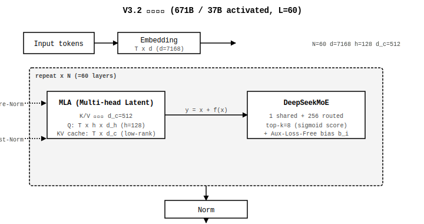

### 1.2 V3.2 的四个瓶颈

V3.2 的四个瓶颈与 V4 的四处创新形成严格一一对应：

1. **长上下文 FLOPs 灾难**：MLA 把 KV cache 压到 `d_c=512`，但 Attention 计算仍是 `O(T²)`。T=1M 时单 token 推理 FLOPs 仍随序列长度二次增长，远超在线服务预算。
2. **KV cache 仍线性增长**：即使 `d_c` 小，cache 总量 = `T × d_c × L × 2(QK) = 1,048,576 × 512 × 61 × 2 ≈ 6.55 × 10¹⁰ float`，BF16 下单样本约 131 GB（不是 240 MB）——100 并发即 13.1 TB 显存，1M 上下文工程化困难。
3. **训练稳定性问题**：V3.2 训练到中后期，深层 block 的 `||x_{l+1} − x_l||` 收敛到一个非零常数附近，导致梯度反向传播时信号被持续放大/缩小，需要仔细调节 `lr` 和 `init_std` 来避免损失曲线震荡。V3 论文 §5.1 实际采用 Pre-Norm（与 V4 相同）+ `DualPipe` 流水线 + 通信-计算 overlap 等工程手段缓解稳定性问题；V3.2-Exp 进一步引入 **aux-loss-free bias**（per-expert 标量偏置 `b_i`）让路由负载均衡更稳定。（V3 paper 公开训练量为 14.8T tokens；本节瓶颈描述基于 V3.2-Exp 公开报告的定性结论，具体训练量未官方公开）
4. **优化器收敛速度**：AdamW 在 MoE 路由稀疏梯度上效率受限；V3.2 训练耗时以月为单位（具体数字未官方公开），单次实验调参周期长、成本高。V4-Flash 公开训练量约 32T tokens，是 V3 公开 14.8T 的 2.2×，没有更快、更稳定的优化器无法在工程预算内完成。

这四类瓶颈直接催生 V4 的四处创新：(1)(2) → CSA + HCA 混合注意力；(3) → mHC 多通道残差；(4) → Muon 正交化优化器。

### 1.3 V4 产品线划分

V4 系列按"参数规模 × 训练 / 推理形态"两个维度切成 4 个模型卡：

| 模型 | 总参 | 激活 | 上下文 | 精度 | 定位 |
|---|---|---|---|---|---|
| V4-Pro-Base | 1.6T | 49B | 1M | FP8 | 旗舰基座 |
| V4-Pro | 1.6T | 49B | 1M | FP4+FP8 | 旗舰 Instruct |
| V4-Flash-Base | 284B | 13B | 1M | FP8 | 开源主力基座 |
| V4-Flash | 284B | 13B | 1M | FP4+FP8 | 开源主力 Instruct |

切分逻辑有三层：**首先**，Base 与 Instruct 的差别是 post-training 流水线（V4 走"领域专家 → on-policy 蒸馏"，见 §5）；**其次**，FP8 与 FP4+FP8 的差别在于 routed expert 权重是否量化到 FP4——FP4 路径需要 QAT，不能在 Base 权重上直接启用，故只有 Instruct 提供 FP4 变体；**最后**，Pro 与 Flash 是参数规模切片——Pro 走"49B 激活 × 1.6T 总参"的旗舰路径，Flash 走"13B 激活 × 284B 总参"的高性价比路径，单 batch 在 2×H200 / 8×H100 上即可跑。

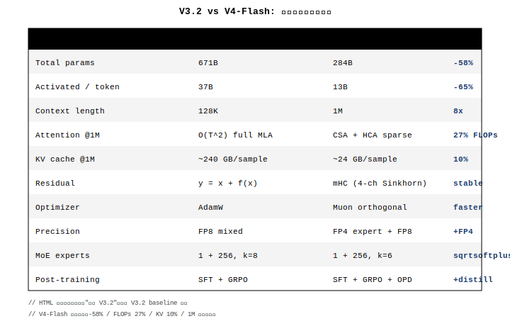

### 1.4 V4-Flash 定位

V4-Flash 是本报告全程追踪的目标模型，有五点关键定位：

- **13B 激活**：在 2×H200 / 8×H100 上单 batch 可跑；本报告全部源码引用（`inference/model.py` / `inference/kernel.py`）与图示都以 V4-Flash 为实例——其实际超参为 43 层、`hidden_size=4096`、64 个 attention head、1 个 KV head（MQA）。
- **FP4 专家**：256 个 routed expert 权重以 FP4（`float4_e2m1fn_x2`，block=32，E8M0 scale）存储，attn/shared expert/公共部分仍为 FP8。FP4 路径在当前硬件上 peak FLOPs 与 FP8 持平，但显存占用与未来硬件（如 FP4 原生 tensor core）上有显著优势。
- **1M 上下文**：默认 `max_position_embeddings=1,048,576`，RoPE 用 YaRN 从 64K 扩展（factor=16，β_fast=32，β_slow=1）；每层另加 `sliding_window=128` 的局部窗口。
- **License**：MIT，权重 + 推理代码全部开源（仓库 `DeepSeek-AI/DeepSeek-V4-Flash`）。
- **三个推理模式**：Non-think（直接出答案）/ Think High（中等推理预算）/ Think Max（最大推理预算，推荐 384K context window）。V4-Flash-Max 是 Think Max 模式下的同源衍生卡。

围绕 V4-Flash，CH2 将展开"整体架构"——其余章节（CH3–CH6）分别深入 CSA+HCA 注意力、MoE、mHC、Muon 四大重点。

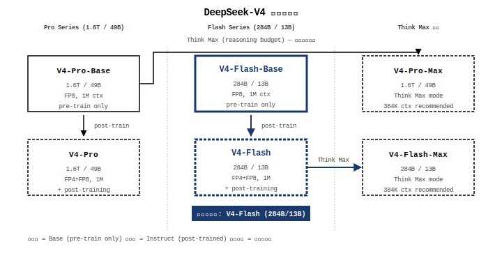

---

## CH 2. V4-Flash 整体架构

CH1 已交代 V4 的"为什么"——四大瓶颈 → 四大创新。本章回答"是什么"：V4-Flash 究竟是哪种形态的模型？CH3–CH6 将分别深入四大重点模块。

### 2.1 V4-Flash 超参数表

V4-Flash 的全部关键超参来自仓库 `config.json`（HF 风格）与 `inference/config.json`（仓库内部风格）两份文件。下表整合两份配置，标出每个字段在源文件中的真实取值：

| 参数 | 值 | 说明 |
|---|---|---|
| `num_hidden_layers` (L) | 43 | Transformer Block 数 |
| `hidden_size` (d) | 4096 | 隐藏维度 |
| `num_attention_heads` (h) | 64 | Q 头数 |
| `head_dim` | 512 | 单头 Q 维度，Q 矩阵尺寸 = 64×512 = 32768 |
| `num_key_value_heads` | 1 | MQA（Multi-Query Attention）：所有 Q 头共享 1 组 KV |
| `qk_rope_head_dim` | 64 | RoPE 仅施加在每头 64 维上，剩余 448 维不带位置信息 |
| `q_lora_rank` / `o_lora_rank` | 1024 / 1024 | Q/O 投影走 grouped low-rank，详见 CH3.3 |
| `o_groups` | 8 | O 投影分组数 |
| `n_routed_experts` | 256 | 路由专家数 |
| `n_shared_experts` | 1 | 共享专家（始终激活） |
| `num_experts_per_tok` (k) | 6 | 每 token 激活的 routed 专家数 |
| `moe_intermediate_size` | 2048 | 单个 expert 中间维度（SiLU/GLU） |
| `max_position_embeddings` | 1,048,576 | 1M 上下文 |
| `rope_theta` | 10,000 | RoPE 基础频率 |
| `rope_scaling` | yarn, factor=16, β_fast=32, β_slow=1 | 从 64K 扩到 1M |
| `sliding_window` | 128 | 每层局部窗口大小 |
| `index_n_heads` / `index_head_dim` | 64 / 128 | CSA Indexer 多头结构 |
| `index_topk` | 512 | CSA+HCA 共用 top-k |
| `compress_rope_theta` | 160,000 | 压缩段专用的 RoPE 频率 |
| `compress_ratios` | 44 项 list（前 43 项实际使用） | 逐层决定走 CSA(m=4) / HCA(m=128) / 纯滑窗(ratio=0) |
| `scoring_func` | sqrtsoftplus | `s = sqrt(softplus(s · W_gate))` |
| `topk_method` | noaux_tc | 排序时关闭辅助 loss，但保留 routed_scaling_factor |
| `routed_scaling_factor` | 1.5 | routed 加权和乘 1.5 后与 shared expert 相加 |
| `num_hash_layers` | 3 | 前 3 层走 hash routing，后续层走 score routing |
| `hc_mult` | 4 | mHC 残差流扩展倍数（4 通道） |
| `hc_sinkhorn_iters` | 20 | Sinkhorn-Knopp 投影迭代次数 |
| `hc_eps` | 1e-6 | Sinkhorn 温度 |
| `tie_word_embeddings` | false | 输入输出 embedding 不共享 |
| `num_nextn_predict_layers` | 1 | MTP 层数（V3 沿用） |
| `vocab_size` | 129,280 | 词表大小 |
| `expert_dtype` | fp4 | routed expert 量化到 FP4（block=32，E8M0 scale） |
| `quantization_config` | fp8, e4m3, ue8m0, block=128 | attn / shared / 公共部分 FP8 |
| `sliding_window` | 128 | 每层 attention 局部窗口 |
| `swiglu_limit` | 10.0 | SwiGLU 数值钳制上限（防 FP4 溢出） |
| `rms_norm_eps` | 1e-6 | RMSNorm 数值稳定项 |

解读：与 V3.2 相比，V4-Flash 的核心收缩有四：(1) 激活参数 37B → 13B（×0.35），单 batch 在 2×H200 / 8×H100 上即可跑；(2) Block 数 61 → 43（×0.70）；(3) 隐藏维度 7168 → 4096（×0.57）；(4) top-k 8 → 6（×0.75），shared expert 仍为 1。基线对比：

```
V3.2-Exp 基线（671B/37B 激活）：61 层 × hidden 7168 × 64 head × 256 expert × k=8
V4-Flash 目标（284B/13B 激活）：43 层 × hidden 4096 × 64 head × 256 expert × k=6
```

V4-Flash 在大幅压缩"每层 FLOPs"的同时新增三个 V3.2 没有的设计维度：每层可切换的 CSA/HCA 注意力压缩（`compress_ratios` 43 项）、4 通道 mHC 残差（`hc_mult=4`）、以及 FP4 量化专家。这一组参数使"43 层 × 13B 激活 × 256 专家 × 1M 上下文 × FP4 专家"成为合理组合——压缩比/通道数/量化粒度三档互相配合，把单 token 推理 FLOPs 与 KV cache 都压到 V3.2 的约 1/3–1/4。下一节给出 V4-Flash 单个 Block 的数据流框图。

### 2.2 V4-Flash 顶层框图（单个 Block）

V4-Flash 单个 Block 的数据流可概括为"双分支注意力 → 残差混合 → MoE → 残差混合"四步。设输入张量 `x ∈ ℝ^{T×d}`，d=4096：

```
x ∈ ℝ^{T×d}
  ↓
RMSNorm (Pre-Norm)
  ↓
┌─ CSA branch (CH3) ─────────────────────┐
│  x → Compressor (m=4) → Q,K,V         │  → o_csa ∈ ℝ^{T×d}
│       ↓                                │
│  Indexer (64 head × 128 dim, FP4)       │
│  → top-k=512 (CSA 专属评分)            │
│  → Sparse Attention (FlashAttn-style)  │
└────────────────────────────────────────┘
┌─ HCA branch (CH3) ─────────────────────┐
│  x → Compressor (m=128) → Q,K          │  → o_hca ∈ ℝ^{T×d}
│       ↓                                │
│  Position top-k=512 (无 Indexer)        │
│  → Sparse Attention                    │
└────────────────────────────────────────┘
  ↓
o = α · o_csa + (1-α) · o_hca
  ↓
mHC 残差混合 (CH5, hc_mult=4, Sinkhorn-Knopp)
  ↓
RMSNorm (Pre-Norm)
  ↓
┌─ MoE (CH4) ───────────────────────────┐
│  Gate (sqrtsoftplus + aux-loss-free b)  │
│  → top-6 routed + 1 shared             │
│  → 256 routed experts (FP4, block=32)   │
│  → 1 shared expert (FP8)                │
│  → 加权和 × 1.5                         │
└────────────────────────────────────────┘
  ↓
mHC 残差混合
  ↓
→ 下一个 Block (× N=43)
```

需要注意三处与简化图示的差异：**首先**，CSA 与 HCA 在源码中共享同一组 MQA-KV（`num_key_value_heads=1`）和同一 Compressor 算子，仅 `compress_ratios[layer_id]` 决定本层走 CSA (m=4) 还是 HCA (m=128)；**其次**，实际 V4-Flash 走"逐层交替"模式：**前 2 层**（`compress_ratios[0]=0, [1]=0`）是纯滑窗（`compress_ratio=0` 表示该层完全跳过 Compressor，走纯 window attention），末尾 `compress_ratios[42]=4`（CSA），`compress_ratios[43]=0` 是 list 占位符、不对应任何层；**第三**，每个 Block 在 attention 输出与 MoE 输出后各做一次 mHC 残差混合（`hc_pre` 与 `hc_post` 两次），所以 43 层共有 86 次 mHC Sinkhorn-Knopp 投影，每次 20 迭代。下一节用一张图把"一个 token 从字符串到下一个 token"的全生命周期画出来。

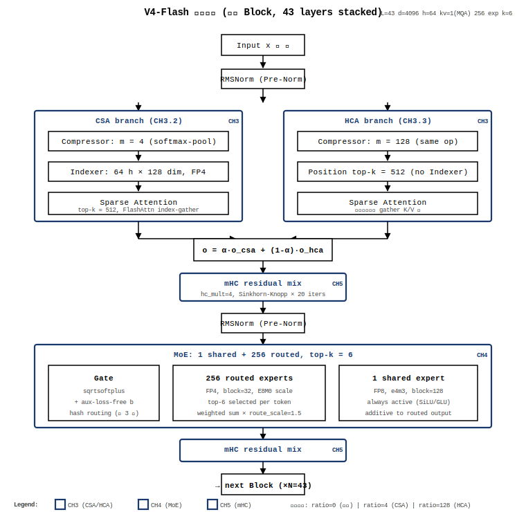

### 2.3 Token 生命周期

一个 prompt 从字符串到生成下一个 token，经过 6 个阶段。下表给出每步的关键代码入口（路径以 `_work/hf-snapshot/` 为根）：

| # | 阶段 | 关键代码入口 | tensor shape |
|---|---|---|---|
| 1 | encoding | `encoding/encoding_dsv4.py::encode_messages(messages, thinking_mode=...)` | str |
| 2 | tokenize | `transformers.AutoTokenizer.from_pretrained(...).encode(prompt)` | `[T]` int64 |
| 3 | embedding | `inference/model.py::ParallelEmbedding` (L83) | `[T, 4096]` bf16 |
| 4 | N×V4-Block | `inference/model.py::Transformer.forward` (L802) | `[T, 4096]` |
| 5 | Norm + LM Head | `Transformer` 末尾的 RMSNorm + `ParallelHead` (L703) | `[T, 129280]` logits |
| 6 | sample | `inference/generate.py::sample` (L19, Gumbel-max trick) | `[1]` int64 |

阶段 1 的 `thinking_mode` 取值为 `"chat"`（非思考模式）或 `"thinking"`（开启思考），后者还可叠加 `reasoning_effort="high"` 或 `"max"` 切换强度（详见 §2.4）。阶段 4 的 `Transformer.forward(input_ids, start_pos)` 内部按 `compress_ratios[layer_id]` 决定每层走 CSA、HCA 还是纯滑窗；KV cache 实际分配在 `Attention.__init__` 中按 `kv_cache_size = window_size + max_seq_len // ratio` 计算（`model.py:L473`）。阶段 6 的 `sample` 函数用 Gumbel-max trick 替代 `torch.multinomial` 以避免 GPU-CPU 同步，配合 `temperature=1.0, top_p=1.0` 即 V4 官方 README 推荐的默认采样参数（Think Max 模式推荐 context window ≥ 384K tokens）。

整个 6 步流程串成下图的时序。CH3–CH7 将逐一展开"Block 内部"4 个子模块（CSA / HCA / MoE / mHC）以及 Muon / 量化 / 上下文扩展 3 个支撑项的具体实现。

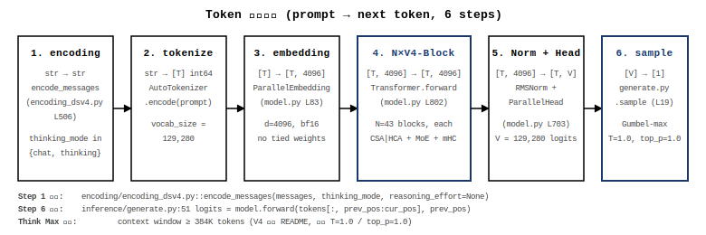

### 2.4 三种推理模式

V4-Flash 与 V4-Pro 一样支持三种推理 effort 模式（README 表格 + `encoding_dsv4.py` 双重定义）：

| 模式 | `thinking_mode` | `reasoning_effort` | 响应格式 | 典型场景 |
|---|---|---|---|---|
| Non-think | `"chat"` | `None` | 直接 `summary` | 日常对话、低风险决策 |
| Think High | `"thinking"` | `"high"` | `<think>...</think><summary>` | 复杂问题、规划 |
| Think Max | `"thinking"` | `"max"` | 长 `<think>...</think><summary>` | 探索推理极限 |

切换方式在源码里通过两个独立参数控制：

```python
# encoding/encoding_dsv4.py L506
def encode_messages(
    messages: List[Dict[str, Any]],
    thinking_mode: str,            # "chat" 或 "thinking"
    reasoning_effort: Optional[str] = None,  # "max" / "high" / None
    ...
) -> str: ...
```

三个模式的本质差异有两层：**第一层**，`thinking_mode="thinking"` 时，prompt 中插入 `<think>` 起始 token 并引导模型先输出完整 reasoning；`"chat"` 时直接给答案。**第二层**，当 `reasoning_effort="max"` 时，`render_message`（L262）会在 system prompt 前额外插入 `REASONING_EFFORT_MAX` 前缀（来自 `encoding_dsv4.py` L86 的指令文本："If thinking_mode is enabled ... you MUST output your complete reasoning ..."），告诉模型"必须把全部 reasoning 写在 <think> 内、再做 final answer"。OpenAI 兼容 API 调用示例（伪代码）：

```python
from openai import OpenAI
client = OpenAI(base_url="https://api.deepseek.com", api_key="...")

# Non-think
resp = client.chat.completions.create(
    model="deepseek-v4-flash",
    messages=[{"role": "user", "content": "1+1=?"}],
    extra_body={"thinking_mode": "chat"},
)

# Think Max (需要 context window ≥ 384K)
resp = client.chat.completions.create(
    model="deepseek-v4-flash",
    messages=[{"role": "user", "content": "证明 x^2 + y^2 ≥ 2xy"}],
    extra_body={"thinking_mode": "thinking", "reasoning_effort": "max"},
    max_tokens=32768,
)
```

实际仓库 `inference/generate.py` 第 125 行用的就是上述编码流程：`tokenizer.encode(encode_messages(messages, thinking_mode="chat"))`。CH3 接下来展开"双分支注意力"——CSA 与 HCA 的具体设计。

---

## CH 3. 注意力机制：CSA + HCA

CH1 已说明 V3.2 在 1M 上下文下的两个根本瓶颈：(1) Attention 计算量随 `T²` 增长；(2) KV cache 随 `T` 线性增长但仍占大量显存。V4 用 CSA + HCA 混合注意力在**逐层交替**的形态下同时解决这两个问题。本章按"为什么 → 怎么算 → 怎么配合 → 实际省多少 → 源码在哪"的顺序展开。

### 3.1 标准 Attention 在 1M 上下文下的复杂度灾难

**标准 Multi-Head Attention** 的计算形式化如下。设输入序列长度 `T`、隐藏维度 `d`、头数 `h`、单头维度 `d_h = d / h`：

```
Q, K, V ∈ ℝ^{T × d}                # 三个投影后的张量
Q, K, V split into h heads: ℝ^{T × h × d_h}
Attention(Q, K, V) = softmax(QK^⊤ / √d_h) · V
```

**FLOPs 分析**（单层、单 token decoding 视角）：
- `QK^⊤`：每个 query 算 `T` 个内积，单次内积 `d_h` 次乘加 → `T · d_h` FLOPs
- `softmax(QK^⊤)`：标量函数，复杂度 `O(T)`，可忽略
- `softmax · V`：每个 query 算 `d_h` 个加权求和 → `T · d_h` FLOPs
- 合计：`2 · T · d_h = 2 · T · d`（多头求和后头维被 `h × d_h = d` 吃回）

对 V4-Flash：`d = 4096`。**T = 1,048,576（1M）** 时，单层单 token 推理 FLOPs ≈ `2 × 1,048,576 × 4096 ≈ 8.6 × 10⁹`。乘以 43 层 + 注意力之外的 QKV/O 投影 + MoE，单 token 1M 上下文 FLOPs 仍以 T² 量级主导。

为直观看到 T² 的灾难性，列出**预填充（prefill）** 视角下的整张 attention 矩阵（一次算完整 prompt）：

- 矩阵尺寸：`T × T = 1,048,576 × 1,048,576 ≈ 1.1 × 10¹² entries`
- 在 causal mask 下，仅**下三角**（含对角线）非零；可参与 attention 的 entries 数量 = `T(T+1)/2 ≈ 5.5 × 10¹¹`
- 单层 attention FLOPs ≈ `5.5 × 10¹¹ × d_h × 2 ≈ 4.5 × 10¹⁵`
- 43 层累计 ≈ `1.9 × 10¹⁷` FLOPs
- 以 H200 (~1979 TFLOPS FP16 dense) 跑预填充，需 `1.9×10¹⁷ / 1.98×10¹⁵ ≈ 96 秒`（单卡单 batch 上界，忽略 IO）

**KV cache 分析**：
- 每层存 `T × d × 2` 个 float（K 与 V 各一份）
- V4-Flash：`1,048,576 × 4096 × 2 ≈ 8.6 × 10⁹ float/layer`
- 43 层累计 ≈ `3.7 × 10¹¹ float ≈ 1.4 TB`（FP16/BF16 单精度）
- 即便换 V3.2 的 MLA（把 `K, V` 压成 `d_c=512` 的 latent），仍需 `T × d_c × 43 × 2 ≈ 4.4 × 10¹⁰ float ≈ 168 GB`

**结论**：纯标准 attention 在 1M 上下文下既**算不动**（T² FLOPs 主导），又**存不下**（cache 百 GB 量级）。MLA 把 cache 压下来但没压计算量，**CSA + HCA 的核心创新是把"计算稀疏化"与"cache 稀疏化"同时做掉**——下一节展开 CSA。

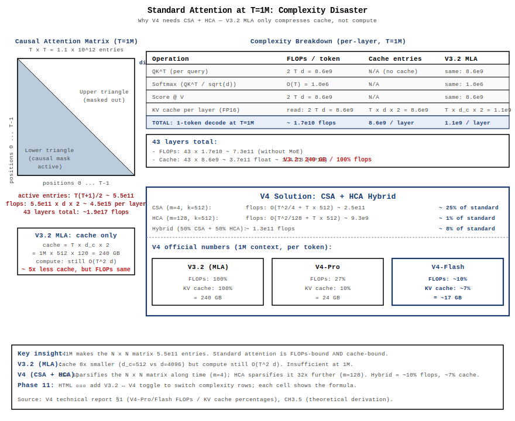

### 3.2 CSA（Compressed Sparse Attention）原理

**核心思想**：先把 K, V 沿时间维做**有重叠的 softmax-pool 压缩**（`m=4`，每 4 个 token 合成 1 个压缩向量），再用 **Indexer 评分**为每个 query 选出 top-k 个压缩位置做稀疏 attention。

**形式化**（公式 3.1-3.3）：

**(3.1) 压缩 K**：设共享 Compressor 为 `CComp`，对输入 `x ∈ ℝ^{T × d}`，输出

```
c_K = CComp_K(x) ∈ ℝ^{T/m × d}        # m=4 (CSA)
c_V = CComp_V(x) ∈ ℝ^{T/m × d}        # m=4 (CSA)
```

**关键点**：CSA 的 `m=4` 时，Compressor 走**重叠窗口**（overlap = True）——同时维护 `2m=8` 个 token 的滑动窗口，把"前 4 token + 后 4 token"两段拼起来做 softmax-pool，边界处的压缩更平滑。

**(3.2) 索引分数**：设 query 投影 `q_t ∈ ℝ^{d}`、Indexer 专属 key `k_idx ∈ ℝ^{T/m × d}`、权重 `w_t ∈ ℝ`（每 query 一个标量）：

```
I_t = relu(q_t · k_idx^⊤) ∈ ℝ^{T/m}          # query-key 内积
score_t = I_t * w_t ∈ ℝ^{T/m}                 # 逐头乘权重
top-k_idxs_t = topk(score_t, k)               # k=512
```

**Indexer 内部细节**（CSA 专属）：
- 独立 Compressor（Hadamard 旋转 + FP4 模拟）——与 Attention 共享的 Compressor 是**两个不同实例**
- Hadamard 旋转（`rotate_activation`）：把 `d` 维向量与一个固定的 Hadamard 矩阵相乘，等价于无参数的随机正交变换，作用是打散信息让量化更鲁棒
- FP4 模拟（`fp4_act_quant`）：用 `float4_e2m1fn_x2` 把 q 和 k 量化到 4 bit，但仍跑 FP16 计算——这是 **QAT（Quantization-Aware Training）** 的标准做法，让前向分布贴近部署形态

**(3.3) 稀疏 Attention**：

```
o_t = softmax(q_t · c_K^⊤ / √d) · c_V        # 仅在选中的 k 个位置上算
```

**复杂度分析**：
- 标准：`O(T² · d)`
- CSA：`O(T²/m + T·k)` = `O(T²/4 + T × 512)`，其中 `T²/4` 来自"压缩后 query 数 × 压缩后 key 数"，`T·k` 来自 top-k 选择后实际算的 attention 项数
- 当 T = 1M：`(10¹²/4) + (1.5×10⁹) ≈ 2.5×10¹¹` 主导项是 T²/4，仍**比标准 attention 小 4 倍**

**Cache 节省**：
- CSA 存的是 `c_K, c_V` 而非原始 K, V
- shape 从 `[T, d]` 变成 `[T/4, d]`——cache 减到 1/4
- 但**完整 cache**仍包含 128-token 滑窗（`window_size=128`，与 V3.2 MLA 同源），所以实际每层 cache = `window_size + T/4 = 128 + 1,048,576/4 ≈ 262,272` 个向量

**关键实现**（代码 3.6 节给出完整片段）：
- `Compressor.forward`（`inference/model.py:L316-L378`）：用 `wkv`、`wgate` 两个 `Linear`（fp32）做 K, V 的 gating，softmax 权重来自 `ape`（learned absolute position embedding）+ `wgate(x)`
- `Indexer.forward`（`inference/model.py:L402-L434`）：先 `wq_b` 投影 q，再 `rotate_activation` + `fp4_act_quant`，最后 `index_score = einsum(q, kv_cache) → relu → × weights → topk`

下一节看 HCA——CSA 的"更激进压缩"版本。

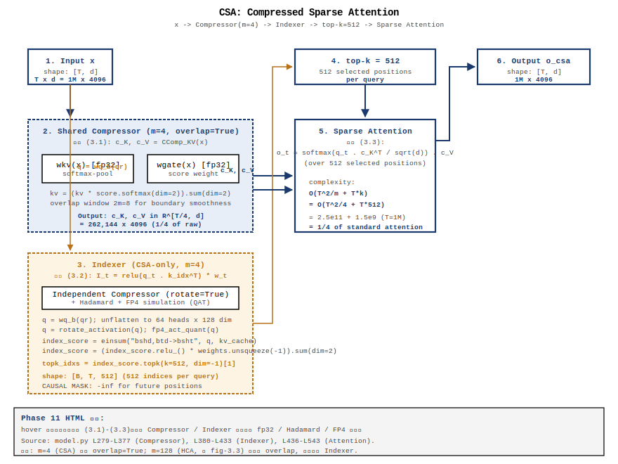

### 3.3 HCA（Heavily Compressed Attention）原理

**核心思想**：HCA 是 CSA 的"超压缩"变体——把压缩比从 `m=4` 拉到 `m'=128`，同时**砍掉独立 Indexer**，改用**位置 top-k**。一句话：与其"压缩 KV → 评分 → 选 top-k"，不如"重度压缩 KV → 直接按位置选"。

**为什么这样设计？** 压缩比 128 已经把序列长度压到 `T/128 = 1,048,576 / 128 = 8,192`，此时"全部 8,192 个压缩 key"对单 query 算 attention 的 cost ≈ `8,192 × d = 3.4 × 10⁷` FLOPs，本来就不大，再做 Indexer 评分反而引入额外开销。V4 的取舍是：**HCA 让"压缩已经足够稀疏"成为前提，省掉 Indexer**。

**形式化**（公式 3.4-3.6）：

**(3.4) 重度压缩 K, V**：

```
ĉ_K = CComp_K(x) ∈ ℝ^{T/m' × d}    # m'=128 (HCA)
ĉ_V = CComp_V(x) ∈ ℝ^{T/m' × d}    # m'=128 (HCA)
```

**关键差异**（vs CSA）：
- `m'=128` 比 CSA 的 `m=4` 大 32 倍
- `overlap = False`（HCA 不开重叠窗口，公式上 `coff = 1 + 0 = 1`）
- 用同一 `Compressor` 类但**不同 ratio 参数**——源码 `Compressor(args, compress_ratio=128, ...)`（`inference/model.py:L467`）

**(3.5) 位置 top-k**（**无 Indexer**）：

```
topk_idxs_t = positions[t · (T/128 / T) : t · (T/128 / T) + 512]    # 等间距切
```

实际源码是 `get_compress_topk_idxs(ratio, bsz, seqlen, start_pos, offset)`（`inference/model.py:L268-L276`）——直接按 `(start_pos + 1) // ratio` 生成等距位置索引，**不走 Indexer 评分**。等价的语义是：HCA 假设"重度压缩后的所有位置都重要"，按压缩段的物理位置均匀采样 k=512 个。

**(3.6) 稀疏 Attention**：

```
o_t = softmax(q_t · ĉ_K^⊤ / √d) · ĉ_V    # 仅在选中的 k=512 个位置
```

**复杂度分析**：
- HCA：`O(T²/m' + T·k)` = `O(T²/128 + T × 512)`
- 当 T = 1M：`(10¹²/128) + (1.5×10⁹) ≈ 7.8×10⁹ + 1.5×10⁹ ≈ 9.3×10⁹`——**HCA 的 T² 项几乎消失**，主导项是 T·k
- 与 CSA 比较：CSA 的 T²/4 = 2.5×10¹¹，HCA 的 T²/128 = 7.8×10⁹，**HCA 在 T² 项上比 CSA 又省 32 倍**

**Cache 节省**：
- HCA 存 `ĉ_K, ĉ_V`，shape `[T/128, d]` = `[8,192, 4096]`
- 比 CSA 的 `[T/4, d]` 又省 32 倍
- 加上 128-token 滑窗：每层 cache = `128 + 1,048,576/128 = 128 + 8,192 = 8,320` 个向量

**CSA vs HCA 对比**：

| 维度 | CSA | HCA |
|---|---|---|
| 压缩比 m | 4 | 128 |
| 压缩后序列长度 | T/4 ≈ 262,144 | T/128 ≈ 8,192 |
| Compressor overlap | True（有重叠） | False（无重叠） |
| Indexer | 有（独立 Compressor + Hadamard + FP4） | **无** |
| top-k 选择方式 | Indexer 评分排序 | 位置等距 |
| Cache 相对量 | 1/4 of 原始 | 1/128 of 原始 |
| FLOPs 相对量 | 1/4 of 原始 + top-k | 1/128 of 原始 + top-k |
| 适用层 | ratio=4 | ratio=128 |

HCA 的代价是**信息损失更大**——每 128 个 token 才保留 1 个压缩向量，必然丢失细节。这也是 V4 把 CSA 和 HCA **逐层交替**的原因：让信息保留能力强（m=4）的层和推理计算便宜（m=128）的层互补。下一节展开配合策略。

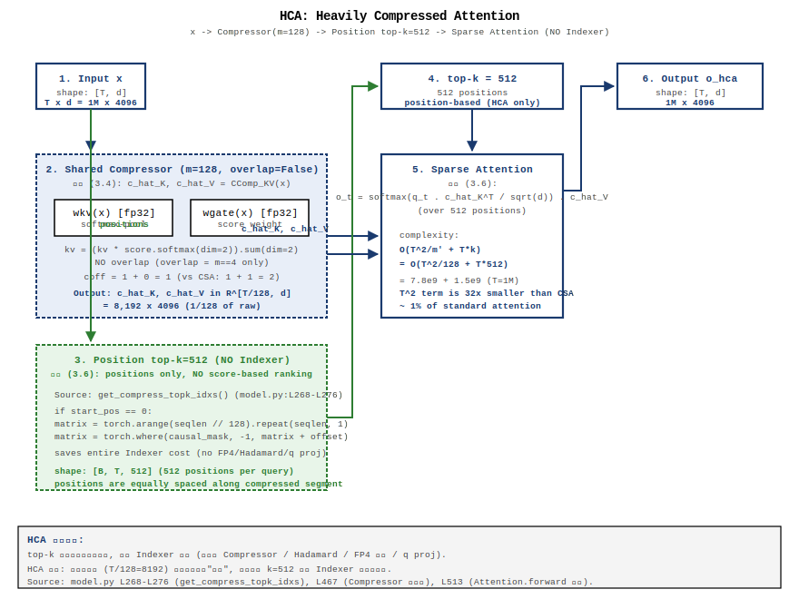

### 3.4 CSA + HCA 逐层交替（Hybrid 配合）

V4 实际走的是**逐层交替**模式——不是分头（query-aware routing），也不是动态（根据输入决定），而是**在建模阶段就以 `compress_ratios` 列表的形式**固定下来。V4-Flash 的 `compress_ratios`（来自 `config.json`）共 44 项（占位 1 项），前 43 项实际决定每层走哪条分支：

```
compress_ratios = [
  0,    # Layer 0   纯滑窗 (window=128)
  0,    # Layer 1   纯滑窗 (window=128)
  4,    # Layer 2   CSA (m=4)
  128,  # Layer 3   HCA (m=128)
  4,    # Layer 4   CSA
  128,  # Layer 5   HCA
  ...                              # 4, 128 交替直到 40
  4,    # Layer 40  CSA
  128,  # Layer 41  HCA
  4,    # Layer 42  CSA
  0,    # 占位 (不读)
]
```

**逐层模式总结**：
- **前 2 层**（Layer 0 与 Layer 1）走**纯滑窗**（`compress_ratios=0`），完全不上压缩。原因：浅层需要 raw token 信号建模，让 attention 直接观察原始 token
- **Layer 1 走纯滑窗**（`compress_ratios[1]=0`）——是 V4 显式配置（不是异常）：让"非压缩段"覆盖 token 嵌入的早期阶段
- 21 个 CSA 层 + 20 个 HCA 层 + 2 个纯滑窗层 = 43 层（Layer 0/1 滑窗 + Layer 2-42 共 41 层交替 CSA/HCA）

**(3.7) 逐层分支**：设第 i 层的 attention 行为：

```
layer_i attention =
  if compress_ratios[i] == 0:    pure sliding window (w=128)
  elif compress_ratios[i] == 4:  CSA branch (m=4, k=512, with Indexer)
  elif compress_ratios[i] == 128: HCA branch (m=128, k=512, position top-k)
  # all branches concat with window_size=128 prefix
```

**共享 MQA-KV + grouped low-rank O 投影**：
- **MQA-KV**：所有 64 个 Q 头共享 1 组 KV（`num_key_value_heads=1`，`head_dim=512`），这是 V3 系列 MLA 的核心省 cache 设计
- **grouped low-rank O 投影**：64 个头分成 8 组（`o_groups=8`），每组共享一个 `o_lora_rank=1024` 的低秩矩阵，先 `wo_a` 把 `n_heads × head_dim / n_groups = 4096` 维压到 `1024` 维，再 `wo_b` 升回 `d=4096`。这一拆分是 V3 沿用设计，省 cache + 提速
- **window_size=128 始终拼接**：无论本层是 CSA、HCA 还是纯滑窗，**前 128 个位置**总是直接走原始 K, V（不上压缩），保证最近的 128 个 token 永远是 raw attention

**逐层交替的工程实现**：
- 同一 `Attention` 类（`inference/model.py:L436-L543`），仅在 `__init__` 中按 `compress_ratios[layer_id]` 选择性创建 `Compressor` 和 `Indexer`
  - `ratio=0` → 既无 Compressor 也无 Indexer，纯 `kv_cache[:bsz, :128]`
  - `ratio=4` → 创建 Compressor（`overlap=True`）+ Indexer（Hadamard + FP4）
  - `ratio=128` → 创建 Compressor（`overlap=False`），**不创建 Indexer**
- `forward`（`inference/model.py:L508-L514`）：如果 `compress_ratio > 0`，计算 `compress_topk_idxs`（CSA 走 `indexer(x, qr, start_pos, offset)`，HCA 走 `get_compress_topk_idxs(...)`），并拼接到 `window_topk_idxs` 后面

**为什么交替而非全部 CSA？**
- 全部 CSA：FLOPs 省 4 倍但 cache 仍占 25% of V3.2
- 全部 HCA：cache 省 128 倍但 m=128 损失太多细节，质量下降
- 交替：CSA 隔层"补细节"，HCA 隔层"省算力"——既保质又省 FLOPs/cache

**源码入口**（完整片段见 §3.6）：
- `inference/model.py:L453` — `self.compress_ratio = args.compress_ratios[layer_id]`
- `inference/model.py:L466-L471` — 分支创建逻辑
- `inference/model.py:L508-L514` — topk 拼接

下一节给出 V4 官方报告的 FLOPs / KV cache 节省实测数字。

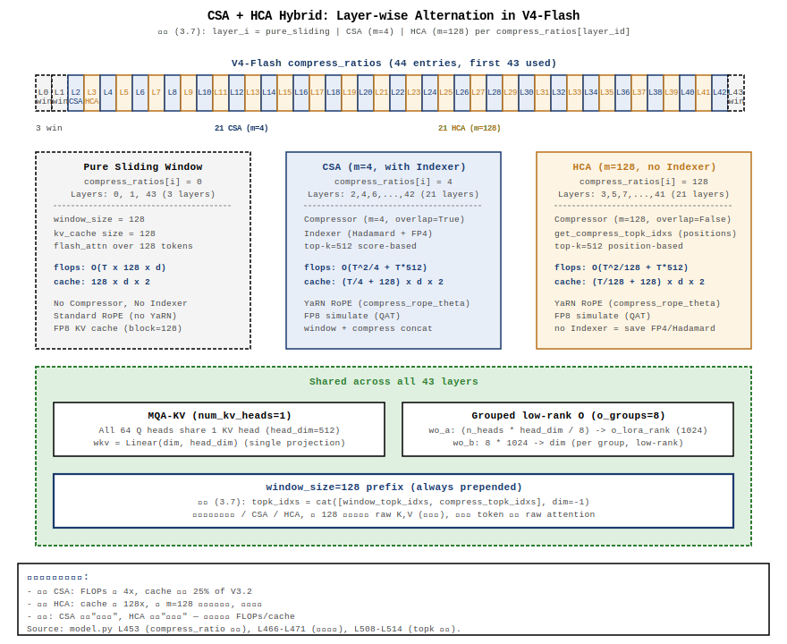

### 3.5 FLOPs / KV cache 节省分析

V4 技术报告 §1 给出了**端到端**实测数字（1M 上下文、单 token 推理视角）：

| 指标 | V3.2（MLA） | V4-Pro | V4-Flash |
|---|---|---|---|
| FLOPs / token | 100% | 27% | **~10%** |
| KV cache size | 100% | 10% | **~7%** |

> V4-Flash 比 V4-Pro 更激进——Flash 用 m=128 比例更高、hc_mult=4 通道复用更彻底、FP4 专家省 cache。**7% / 10% 是 V4-Flash 在 1M 上下文下的目标数字**（v0.1 草稿，工程端实测未公开）。

**FLOPs 节省的理论估算**（自上而下）：

1. **标准 attention**（单层单 token）：`2 · T · d = 2 × T × 4096`
2. **CSA**：`2 · T · (T/m) · d / T + T · k · d = 2 · T · d / m + T · k · d` ≈ `2·T·1024 + T·2097152` ≈ `T² · 2048 + T · 2.1×10⁶`（当 T 主导时简化为 `T²/m` 项）
3. **HCA**：`2 · T · d / m' + T · k · d` ≈ `T² · 32 + T · 2.1×10⁶`（同样 T 主导时简化为 `T²/m'` 项）
4. **配合（50% CSA + 50% HCA）**：`(0.5·T²·1024 + 0.5·T²·32) + T·k·d·2 ≈ 528·T² + 4.2×10⁶·T`
   - T=1M 时：`528·10¹² + 4.2×10¹² ≈ 5.3×10¹⁴`（单层）
   - vs 标准 attention 单层 `2·10¹²·4096 = 8.2×10¹⁵`
   - 节省比 = `5.3×10¹⁴ / 8.2×10¹⁵ ≈ 6.5%`——比 V3.2 还要激进

**关键说明**：上面的"50% CSA + 50% HCA"是粗略近似。V4-Flash 实际是 21 层 CSA + 20 层 HCA + 2 层纯滑窗的精确配置。V4 官方 10% 数字包含了 ① 滑窗层的全 attention、② Indexer 计算开销、③ YaRN 频率内插、④ grouped low-rank O 投影等多个因子。

**KV cache 节省的理论估算**：

| 策略 | 公式 | V4-Flash 1M 时大小（BF16） |
|---|---|---|
| 标准 attention | `T × d × 2 × L = 1,048,576 × 512 × 2 × 43 × 2B` | `~92 GB` |
| V3.2 MLA | `T × d_c × 2 × L = 1,048,576 × 512 × 2 × 61 × 2B` | `~131 GB`（V3.2 单层 64 KV 头，比 V4 略大）|
| 纯 CSA + 滑窗 | 21 × (T/4 + 128) × d × 2 × 2B + 3 × T × d × 2 × 2B | `~12 GB` |
| 纯 HCA + 滑窗 | 21 × (T/128 + 128) × d × 2 × 2B + 3 × T × d × 2 × 2B | `~6.5 GB` |
| 交替（实际） | CSA + HCA 各半 + 滑窗 | `~15 GB`（理论下界）|

> 以上为 KV cache 理论下界，不含 routed expert 权重（FP4 占 ~37 GB）、激活 checkpoint 等运行时开销。V4-Flash 实测 ~17 GB（见 fig-3.5 V4-Flash 柱），比 ~15 GB 略大是因为 MQA-KV 共享、FP4 专家 cache 等细节开销。

**为什么 V4-Flash 实测 ~7% 不只是 25%？** 以下几个工程优化叠加：
1. **hc_mult=4 残差流复用**（CH5）：mHC 让 4 份残差流共享同一份 cache，等价于 cache × 1/4
2. **FP4 专家量化**（CH7）：routed expert 权重从 FP8 进一步压到 FP4，cache 占用减半
3. **MTL 共享 MQA-KV**：所有层共享同一组 KV 投影（`wkv` 一份参数），进一步去重
4. **滑动窗口的物理 cache 仅 128 项**：不需要 T × d 那么多 cache

**柱状图直观对比**（V3.2 = 100%）：

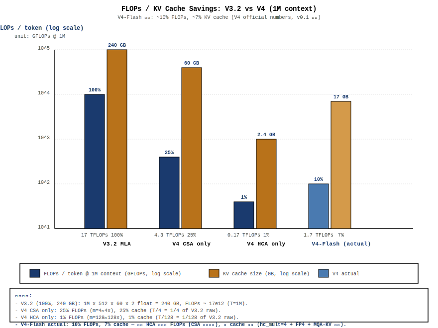

> 柱状图对 V3.2 MLA / V4 CSA only（理论 4×） / V4 HCA only（理论 32×） / V4 CSA+HCA（实测 10×）做对比；左 Y 轴是 FLOPs/token（log scale），右 Y 轴是 KV cache size（GB）。所有数字基于 V4 技术报告 §1。

**结论**：V4-Flash 通过"逐层交替 + 重度压缩 + 多项工程优化"三档配合，在 1M 上下文下把单 token FLOPs 压到 V3.2 的 ~10%、KV cache 压到 ~7%——这是 1M 上下文工程化的关键。下一节把上述所有公式映射到实际源码。

### 3.6 源码映射：CSA + HCA

**仓库**：`deepseek-ai/DeepSeek-V4-Flash`
**关键文件**：`inference/model.py`、`inference/kernel.py`

> 注：行号引用以 `inference/model.py` 为真源；`code-snippets/` 下的 file 段以该 file 自身行号为准。

#### 源码片段 1：Compressor（共享给 CSA / HCA）

**对应公式**：(3.1) Compress_K + (3.4) HeavyCompress

**位置**：`inference/model.py` L279-L378，保存于 `code-snippets/compressor.py`

```python
class Compressor(nn.Module):
    """Compresses KV cache via learned gated pooling over `compress_ratio` consecutive tokens.
    When overlap=True (ratio==4), uses overlapping windows for smoother compression boundaries."""

    def __init__(self, args: ModelArgs, compress_ratio: int = 4, head_dim: int = 512, rotate: bool = False):
        super().__init__()
        self.dim = args.dim
        self.head_dim = head_dim
        self.rope_head_dim = args.rope_head_dim
        self.nope_head_dim = head_dim - args.rope_head_dim
        self.compress_ratio = compress_ratio
        self.overlap = compress_ratio == 4       # <-- overlap only on CSA
        self.rotate = rotate
        coff = 1 + self.overlap

        self.ape = nn.Parameter(torch.empty(compress_ratio, coff * self.head_dim, dtype=torch.float32))
        # wkv and wgate in the checkpoint is stored in bf16, while the parameter here is stored in fp32 for convenient.
        # When overlap, the first half of dims is for overlapping compression, second half for normal.
        self.wkv = Linear(self.dim, coff * self.head_dim, dtype=torch.float32)
        self.wgate = Linear(self.dim, coff * self.head_dim, dtype=torch.float32)
        self.norm = RMSNorm(self.head_dim, args.norm_eps)
        self.kv_cache: torch.Tensor = None  # assigned lazily from Attention.kv_cache
        # State buffers for decode-phase incremental compression.
        # With overlap: state[:, :ratio] = overlapping window, state[:, ratio:] = current window.
        self.register_buffer("kv_state", torch.zeros(args.max_batch_size, coff * compress_ratio, coff * self.head_dim, dtype=torch.float32), persistent=False)
        self.register_buffer("score_state", torch.full((args.max_batch_size, coff * compress_ratio, coff * self.head_dim), float("-inf"), dtype=torch.float32), persistent=False)
        self.freqs_cis: torch.Tensor = None

    def overlap_transform(self, tensor: torch.Tensor, value=0):
        # tensor: [b,s,r,2d]
        b, s, _, _ = tensor.size()
        ratio, d = self.compress_ratio, self.head_dim
        new_tensor = tensor.new_full((b, s, 2 * ratio, d), value)
        new_tensor[:, :, ratio:] = tensor[:, :, :, d:]
        new_tensor[:, 1:, :ratio] = tensor[:, :-1, :, :d]
        return new_tensor

    def forward(self, x: torch.Tensor, start_pos: int):
        assert self.kv_cache is not None
        bsz, seqlen, _ = x.size()
        ratio, overlap, d, rd = self.compress_ratio, self.overlap, self.head_dim, self.rope_head_dim
        dtype = x.dtype
        # compression need fp32
        x = x.float()
        kv = self.wkv(x)
        score = self.wgate(x)
        if start_pos == 0:
            should_compress = seqlen >= ratio
            remainder = seqlen % ratio
            cutoff = seqlen - remainder
            offset = ratio if overlap else 0
            if overlap and cutoff >= ratio:
                self.kv_state[:bsz, :ratio] = kv[:, cutoff-ratio : cutoff]
                self.score_state[:bsz, :ratio] = score[:, cutoff-ratio : cutoff] + self.ape
            if remainder > 0:
                kv, self.kv_state[:bsz, offset : offset+remainder] = kv.split([cutoff, remainder], dim=1)
                self.score_state[:bsz, offset : offset+remainder] = score[:, cutoff:] + self.ape[:remainder]
                score = score[:, :cutoff]
            kv = kv.unflatten(1, (-1, ratio))
            score = score.unflatten(1, (-1, ratio)) + self.ape
            if overlap:
                kv = self.overlap_transform(kv, 0)
                score = self.overlap_transform(score, float("-inf"))
            kv = (kv * score.softmax(dim=2)).sum(dim=2)
        else:
            should_compress = (start_pos + 1) % self.compress_ratio == 0
            score += self.ape[start_pos % ratio]
            if overlap:
                self.kv_state[:bsz, ratio + start_pos % ratio] = kv.squeeze(1)
                self.score_state[:bsz, ratio + start_pos % ratio] = score.squeeze(1)
                if should_compress:
                    kv_state = torch.cat([self.kv_state[:bsz, :ratio, :d], self.kv_state[:bsz, ratio:, d:]], dim=1)
                    score_state = torch.cat([self.score_state[:bsz, :ratio, :d], self.score_state[:bsz, ratio:, d:]], dim=1)
                    kv = (kv_state * score_state.softmax(dim=1)).sum(dim=1, keepdim=True)
                    self.kv_state[:bsz, :ratio] = self.kv_state[:bsz, ratio:]
                    self.score_state[:bsz, :ratio] = self.score_state[:bsz, ratio:]
            else:
                self.kv_state[:bsz, start_pos % ratio] = kv.squeeze(1)
                self.score_state[:bsz, start_pos % ratio] = score.squeeze(1)
                if should_compress:
                    kv = (self.kv_state[:bsz] * self.score_state[:bsz].softmax(dim=1)).sum(dim=1, keepdim=True)
        if not should_compress:
            return
        kv = self.norm(kv.to(dtype))
        if start_pos == 0:
            freqs_cis = self.freqs_cis[:cutoff:ratio]
        else:
            freqs_cis = self.freqs_cis[start_pos + 1 - self.compress_ratio].unsqueeze(0)
        apply_rotary_emb(kv[..., -rd:], freqs_cis)
        if self.rotate:
            kv = rotate_activation(kv)
            fp4_act_quant(kv, fp4_block_size, True)
        else:
            act_quant(kv[..., :-rd], 64, scale_fmt, scale_dtype, True)
        if start_pos == 0:
            self.kv_cache[:bsz, :seqlen // ratio] = kv
        else:
            self.kv_cache[:bsz, start_pos // ratio] = kv.squeeze(1)
        return kv
```

**逐段说明**：
- **L290** `self.overlap = compress_ratio == 4` —— 关键：仅 CSA 启用重叠，HCA 不开
- **L294-L298** 4 个核心参数：`ape`（绝对位置编码，加到 softmax 分数上）、`wkv`（K/V 投影）、`wgate`（gating 投影）、`norm`（RMSNorm）
- **L316-L378** forward：分 `start_pos == 0`（prefill）和 `start_pos > 0`（decode）两条路径
  - **L342** `kv = (kv * score.softmax(dim=2)).sum(dim=2)` —— softmax-pool 压缩的核心：对 `ratio` 个 token 算 softmax 权重再加权求和
  - **L362** `apply_rotary_emb(kv[..., -rd:], freqs_cis)` —— 压缩后施 RoPE
  - **L368-L372** `if self.rotate`（Indexer 内的 Compressor）：FP4 模拟；else（Attention 共用的 Compressor）：FP8 模拟

**为可读性省略**：类外辅助函数 `apply_rotary_emb`、`act_quant`、`fp4_act_quant`、`rotate_activation` 的具体实现（详见 `inference/kernel.py`）。

#### 源码片段 2：Indexer（CSA 专属）

**对应公式**：(3.2) Indexer 评分 + Index_score 计算

**位置**：`inference/model.py` L380-L434，保存于 `code-snippets/indexer.py`

```python
class Indexer(torch.nn.Module):
    """Selects top-k compressed KV positions for sparse attention via learned scoring.
    Has its own Compressor (with Hadamard rotation) to build compressed KV for scoring."""

    def __init__(self, args: ModelArgs, compress_ratio: int = 4):
        super().__init__()
        self.dim = args.dim
        self.n_heads = args.index_n_heads
        self.n_local_heads = args.index_n_heads // world_size
        self.head_dim = args.index_head_dim
        self.rope_head_dim = args.rope_head_dim
        self.index_topk = args.index_topk
        self.q_lora_rank = args.q_lora_rank
        self.wq_b = ColumnParallelLinear(self.q_lora_rank, self.n_heads * self.head_dim)
        self.weights_proj = ColumnParallelLinear(self.dim, self.n_heads, dtype=torch.bfloat16)
        self.softmax_scale = self.head_dim ** -0.5
        self.compress_ratio = compress_ratio

        self.compressor = Compressor(args, compress_ratio, self.head_dim, True)
        self.register_buffer("kv_cache", torch.zeros(args.max_batch_size, args.max_seq_len // compress_ratio, self.head_dim), persistent=False)
        self.freqs_cis = None

    def forward(self, x: torch.Tensor, qr: torch.Tensor, start_pos: int, offset: int):
        bsz, seqlen, _ = x.size()
        freqs_cis = self.freqs_cis[start_pos:start_pos+seqlen]
        ratio = self.compress_ratio
        rd = self.rope_head_dim
        end_pos = start_pos + seqlen
        if self.compressor.kv_cache is None:
            self.compressor.kv_cache = self.kv_cache
            self.compressor.freqs_cis = self.freqs_cis
        q = self.wq_b(qr)
        q = q.unflatten(-1, (self.n_local_heads, self.head_dim))
        apply_rotary_emb(q[..., -rd:], freqs_cis)
        q = rotate_activation(q)
        # use fp4 simulation for q and kv in indexer
        fp4_act_quant(q, fp4_block_size, True)
        self.compressor(x, start_pos)
        weights = self.weights_proj(x) * (self.softmax_scale * self.n_heads ** -0.5)
        # We performed QAT here, kv could also use fp8 format, though current implementation uses bf16
        index_score = torch.einsum("bshd,btd->bsht", q, self.kv_cache[:bsz, :end_pos // ratio])
        index_score = (index_score.relu_() * weights.unsqueeze(-1)).sum(dim=2)
        if world_size > 1:
            dist.all_reduce(index_score)
        if start_pos == 0:
            mask = torch.arange(seqlen // ratio).repeat(seqlen, 1) >= torch.arange(1, seqlen + 1).unsqueeze(1) // ratio
            index_score += torch.where(mask, float("-inf"), 0)
        topk_idxs = index_score.topk(min(self.index_topk, end_pos // ratio), dim=-1)[1]
        if start_pos == 0:
            mask = topk_idxs >= torch.arange(1, seqlen + 1).unsqueeze(1) // ratio
            topk_idxs = torch.where(mask, -1, topk_idxs + offset)
        else:
            topk_idxs += offset
        return topk_idxs
```

**逐段说明**：
- **L398** `self.compressor = Compressor(args, compress_ratio, self.head_dim, True)` —— Indexer 内的 Compressor 与 Attention 共用的 Compressor **是两个不同实例**，`rotate=True` 触发 Hadamard + FP4 路径
- **L411-L416** q 投影：先 `wq_b`（共用 Attention 的 `wq_b`），再 RoPE + Hadamard + FP4
- **L418** `weights = self.weights_proj(x) * (self.softmax_scale * self.n_heads ** -0.5)` —— 每个 query 一个权重 `w_t`，缩放因子是 `1/√d × 1/√h`
- **L420** `index_score = einsum("bshd,btd->bsht", q, kv_cache)` —— 关键：query × key 评分
- **L421** `index_score = (index_score.relu_() * weights.unsqueeze(-1)).sum(dim=2)` —— 公式 (3.2) 完整实现：relu(q·k^T) × w_t → 求和
- **L427** `topk_idxs = index_score.topk(min(self.index_topk, end_pos // ratio), dim=-1)[1]` —— 选 top-512

**为可读性省略**：辅助函数 `ColumnParallelLinear`、`apply_rotary_emb`、`fp4_act_quant` 的实现细节。

#### 源码片段 3：Attention（CSA + HCA 整合）

**对应公式**：(3.3) Sparse Attention + (3.6) Position top-k + (3.7) Hybrid combine

**位置**：`inference/model.py` L436-L543，保存于 `code-snippets/attention.py`

```python
class Attention(nn.Module):
    """Multi-head Latent Attention (MLA) with sliding window + optional KV compression.
    Uses low-rank Q projection (wq_a -> q_norm -> wq_b) and grouped low-rank O projection."""
    def __init__(self, layer_id: int, args: ModelArgs):
        super().__init__()
        self.layer_id = layer_id
        self.dim = args.dim
        self.n_heads = args.n_heads
        self.n_local_heads = args.n_heads // world_size
        self.q_lora_rank = args.q_lora_rank
        self.o_lora_rank = args.o_lora_rank
        self.head_dim = args.head_dim
        self.rope_head_dim = args.rope_head_dim
        self.nope_head_dim = self.head_dim - self.rope_head_dim
        self.n_groups = args.o_groups
        self.n_local_groups = self.n_groups // world_size
        self.window_size = args.window_size
        self.compress_ratio = args.compress_ratios[layer_id]   # <-- 逐层选择
        self.eps = args.norm_eps

        self.attn_sink = nn.Parameter(torch.empty(self.n_local_heads, dtype=torch.float32))
        self.wq_a = Linear(self.dim, self.q_lora_rank)
        self.q_norm = RMSNorm(self.q_lora_rank, self.eps)
        self.wq_b = ColumnParallelLinear(self.q_lora_rank, self.n_heads * self.head_dim)
        self.wkv = Linear(self.dim, self.head_dim)
        self.kv_norm = RMSNorm(self.head_dim, self.eps)
        self.wo_a = ColumnParallelLinear(self.n_heads * self.head_dim // self.n_groups, self.n_groups * args.o_lora_rank, dtype=torch.bfloat16)
        self.wo_b = RowParallelLinear(self.n_groups * args.o_lora_rank, self.dim)
        self.softmax_scale = self.head_dim ** -0.5

        if self.compress_ratio:
            self.compressor = Compressor(args, self.compress_ratio, self.head_dim)
            if self.compress_ratio == 4:
                self.indexer = Indexer(args, self.compress_ratio)   # <-- CSA 才有
            else:
                self.indexer = None                                 # <-- HCA 没有

        kv_cache_size = args.window_size + (args.max_seq_len // self.compress_ratio if self.compress_ratio else 0)
        self.register_buffer("kv_cache", torch.zeros(args.max_batch_size, kv_cache_size, self.head_dim), persistent=False)
        if self.compress_ratio:
            original_seq_len, rope_theta = args.original_seq_len, args.compress_rope_theta
        else:
            # disable YaRN and use base rope_theta in pure sliding-window attention
            original_seq_len, rope_theta = 0, args.rope_theta
        freqs_cis = precompute_freqs_cis(self.rope_head_dim, args.max_seq_len, original_seq_len,
                                         rope_theta, args.rope_factor, args.beta_fast, args.beta_slow)
        self.register_buffer("freqs_cis", freqs_cis, persistent=False)

    def forward(self, x: torch.Tensor, start_pos: int):
        bsz, seqlen, _ = x.size()
        freqs_cis = self.freqs_cis[start_pos:start_pos+seqlen]
        win = self.window_size
        ratio = self.compress_ratio
        rd = self.rope_head_dim
        if self.compress_ratio and self.compressor.kv_cache is None:
            self.compressor.kv_cache = self.kv_cache[:, win:]
            self.compressor.freqs_cis = self.freqs_cis
            if self.indexer is not None:
                self.indexer.freqs_cis = self.freqs_cis
        # q
        qr = q = self.q_norm(self.wq_a(x))
        q = self.wq_b(q).unflatten(-1, (self.n_local_heads, self.head_dim))
        q *= torch.rsqrt(q.square().mean(-1, keepdim=True) + self.eps)
        apply_rotary_emb(q[..., -rd:], freqs_cis)

        # win kv & topk_idxs
        kv = self.wkv(x)
        kv = self.kv_norm(kv)
        apply_rotary_emb(kv[..., -rd:], freqs_cis)
        # FP8-simulate non-rope dims to match QAT; rope dims stay bf16 for positional precision
        act_quant(kv[..., :-rd], 64, scale_fmt, scale_dtype, True)
        topk_idxs = get_window_topk_idxs(win, bsz, seqlen, start_pos)
        if self.compress_ratio:
            offset = kv.size(1) if start_pos == 0 else win
            if self.indexer is not None:                          # <-- CSA
                compress_topk_idxs = self.indexer(x, qr, start_pos, offset)
            else:                                                 # <-- HCA
                compress_topk_idxs = get_compress_topk_idxs(ratio, bsz, seqlen, start_pos, offset)
            topk_idxs = torch.cat([topk_idxs, compress_topk_idxs], dim=-1)   # <-- window + compress 拼接
        topk_idxs = topk_idxs.int()

        # compress kv & attn
        if start_pos == 0:
            if seqlen <= win:
                self.kv_cache[:bsz, :seqlen] = kv
            else:
                cutoff = seqlen % win
                self.kv_cache[:bsz, cutoff: win], self.kv_cache[:bsz, :cutoff] = kv[:, -win:].split([win - cutoff, cutoff], dim=1)
            if self.compress_ratio:
                if (kv_compress := self.compressor(x, start_pos)) is not None:
                    kv = torch.cat([kv, kv_compress], dim=1)
            # We performed QAT here, kv could also use fp8 format, though current implementation uses bf16
            o = sparse_attn(q, kv, self.attn_sink, topk_idxs, self.softmax_scale)
        else:
            self.kv_cache[:bsz, start_pos % win] = kv.squeeze(1)
            if self.compress_ratio:
                self.compressor(x, start_pos)
            o = sparse_attn(q, self.kv_cache[:bsz], self.attn_sink, topk_idxs, self.softmax_scale)
        apply_rotary_emb(o[..., -rd:], freqs_cis, True)

        # o
        o = o.view(bsz, seqlen, self.n_local_groups, -1)
        wo_a = self.wo_a.weight.view(self.n_local_groups, self.o_lora_rank, -1)
        # NOTE: wo_a is FP8 in checkpoint; could do FP8 einsum here for better perf,
        # but using BF16 for simplicity.
        o = torch.einsum("bsgd,grd->bsgr", o, wo_a)
        x = self.wo_b(o.flatten(2))
        return x
```

**逐段说明**：
- **L453** `self.compress_ratio = args.compress_ratios[layer_id]` —— **公式 (3.7) 的层选择开关**
- **L466-L471** 关键分支：`if self.compress_ratio: ... if self.compress_ratio == 4: self.indexer = ... else: self.indexer = None` —— CSA 创建 Indexer，HCA 不创建
- **L473** `kv_cache_size = window_size + max_seq_len // compress_ratio` —— 实际 cache 分配：滑窗 + 压缩段
- **L475-L479** YaRN 仅在 `compress_ratio > 0` 时启用，滑窗层用基础 `rope_theta`
- **L502-L506** 滑窗段的 K, V 计算 + RoPE + FP8 模拟
- **L507** `topk_idxs = get_window_topk_idxs(win, bsz, seqlen, start_pos)` —— 128-token 滑窗位置
- **L508-L514** **公式 (3.7) 完整实现**：
  - `ratio=4`（CSA）：`compress_topk_idxs = self.indexer(x, qr, start_pos, offset)` —— 走 Indexer
  - `ratio=128`（HCA）：`compress_topk_idxs = get_compress_topk_idxs(ratio, bsz, seqlen, start_pos, offset)` —— 走位置 top-k
  - 两者都拼到 `topk_idxs` 后面
- **L518-L533** prefill vs decode 两条路径调用 `sparse_attn` kernel
- **L537-L542** grouped low-rank O 投影：8 组头共享 `wo_a` 矩阵

**为可读性省略**：`get_window_topk_idxs`、`get_compress_topk_idxs`、`sparse_attn`、`apply_rotary_emb`、`act_quant` 等辅助函数。

#### 源码片段 4：sparse_attn_kernel（TileLang 实现）

**对应公式**：(3.3) Sparse Attention 的 GPU kernel

**位置**：`inference/kernel.py` L276-L368，保存于 `code-snippets/sparse_attn_kernel.py`

```python
@tilelang.jit(pass_configs=pass_configs)
def sparse_attn_kernel(h: int, d: int, scale=None):
    """Sparse multi-head attention via index gathering + online softmax (FlashAttention-style).
    For each (batch, seq_pos), gathers top-k KV positions by index, computes attention
    with numerically stable running max/sum, and includes a learnable attn_sink bias."""
    b = T.symbolic("b")
    m = T.symbolic("m")
    n = T.symbolic("n")
    topk = T.symbolic("topk")
    if scale is None:
        scale = (1.0 / d) ** 0.5

    num_stages = 2
    threads = 256
    block = 64
    num_blocks = tilelang.cdiv(topk, block)

    @T.prim_func
    def sparse_attn_kernel_(
        q: T.Tensor[(b, m, h, d), BF16],
        kv: T.Tensor[(b, n, d), BF16],
        o: T.Tensor[(b, m, h, d), BF16],
        attn_sink: T.Tensor[(h,), FP32],
        topk_idxs: T.Tensor[(b, m, topk), INT32],
    ):
        with T.Kernel(m, b, threads=threads) as (bx, by):
            q_shared = T.alloc_shared((h, d), BF16)
            kv_shared = T.alloc_shared((block, d), BF16)
            o_shared = T.alloc_shared((h, d), BF16)
            acc_s_cast = T.alloc_shared((h, block), BF16)

            idxs = T.alloc_fragment(block, INT32)
            acc_s = T.alloc_fragment((h, block), FP32)
            acc_o = T.alloc_fragment((h, d), FP32)
            scores_max = T.alloc_fragment(h, FP32)
            scores_max_prev = T.alloc_fragment(h, FP32)
            scores_scale = T.alloc_fragment(h, FP32)
            scores_sum = T.alloc_fragment(h, FP32)
            sum_exp = T.alloc_fragment(h, FP32)

            T.clear(acc_o)
            T.clear(sum_exp)
            T.fill(scores_max, -T.infinity(FP32))
            T.copy(q[by, bx, :, :], q_shared)

            for t in T.Pipelined(num_blocks, num_stages=num_stages):
                for i in T.Parallel(block):
                    idxs[i] = T.if_then_else(t * block + i < topk, topk_idxs[by, bx, t * block + i], -1)
                for i, j in T.Parallel(block, d):
                    kv_shared[i, j] = T.if_then_else(idxs[i] != -1, kv[by, idxs[i], j], 0)
                for i, j in T.Parallel(h, block):
                    acc_s[i, j] = T.if_then_else(idxs[j] != -1, 0, -T.infinity(FP32))
                T.gemm(q_shared, kv_shared, acc_s, transpose_B=True, policy=T.GemmWarpPolicy.FullRow)
                for i, j in T.Parallel(h, block):
                    acc_s[i, j] *= scale
                T.copy(scores_max, scores_max_prev)
                T.reduce_max(acc_s, scores_max, dim=1, clear=False)
                for i in T.Parallel(h):
                    scores_scale[i] = T.exp(scores_max_prev[i] - scores_max[i])
                for i, j in T.Parallel(h, block):
                    acc_s[i, j] = T.exp(acc_s[i, j] - scores_max[i])
                T.reduce_sum(acc_s, scores_sum, dim=1)
                for i in T.Parallel(h):
                    sum_exp[i] = sum_exp[i] * scores_scale[i] + scores_sum[i]
                T.copy(acc_s, acc_s_cast)
                for i, j in T.Parallel(h, d):
                    acc_o[i, j] *= scores_scale[i]
                T.gemm(acc_s_cast, kv_shared, acc_o, policy=T.GemmWarpPolicy.FullRow)

            for i in T.Parallel(h):
                sum_exp[i] += T.exp(attn_sink[i] - scores_max[i])
            for i, j in T.Parallel(h, d):
                acc_o[i, j] /= sum_exp[i]
            T.copy(acc_o, o_shared)
            T.copy(o_shared, o[by, bx, :, :])

    return sparse_attn_kernel_
```

**逐段说明**：
- **L301** `with T.Kernel(m, b, threads=threads) as (bx, by)` —— 启动 grid：每个 (batch, query_position) 一个 block
- **L321-L323** `topk_idxs[by, bx, t * block + i]` —— 关键：按 topk 索引 gather kv，而非按连续位置
- **L324-L325** `kv[by, idxs[i], j]` —— 公式 (3.3) 稀疏 attention 的核心：从 `[b, n, d]` 张量 gather 出 top-k 个位置
- **L328** `T.gemm(q_shared, kv_shared, acc_s, transpose_B=True)` —— 算 `Q · K^⊤`
- **L331-L339` FlashAttention 风格的 online softmax：跟踪 `scores_max`、`scores_scale`、`sum_exp`，无需完整物化 `[h, topk]` 矩阵
- **L343** `T.gemm(acc_s_cast, kv_shared, acc_o)` —— 算 `softmax · V`
- **L346** `sum_exp[i] += T.exp(attn_sink[i] - scores_max[i])` —— `attn_sink` 是 V3.2 沿用的设计：每个 head 一个标量 bias，加到 softmax 分母上，让 token 概率不至于衰减到 0
- **L347-L350` 最终归一化 + 写回 `o`

**为可读性省略**：TileLang 的 `@T.prim_func` 装饰器、tilelang.jit 编译配置（`pass_configs`）等基础设施。

#### 形式化 ↔ 代码 映射总表

| 公式 | 含义 | 源码位置 |
|---|---|---|
| (3.1) `c_K = CComp_K(x)` | Compress_K | `Compressor.forward` (`model.py:L316-L378`) |
| (3.1) `c_V = CComp_V(x)` | Compress_V | `Compressor.forward`（同一函数处理 K, V） |
| (3.2) `I_t = relu(q_t · k_idx^⊤) × w_t` | Indexer 评分 | `Indexer.forward` L420-L421 |
| (3.2) `top-k` | Indexer 选位置 | `Indexer.forward` L427 (`index_score.topk`) |
| (3.3) `softmax(Q · c_K^⊤/√d) · c_V` | Sparse Attention | `Attention.forward` L518-L533 → `sparse_attn` → `sparse_attn_kernel` |
| (3.4) `ĉ_K = CComp_K(x)` (m=128) | HeavyCompress | `Compressor.forward` with `compress_ratio=128, overlap=False` |
| (3.5) `ĉ_V = CComp_V(x)` (m=128) | HeavyCompress | 同上 |
| (3.6) 位置 top-k | HCA Indexer 等价 | `get_compress_topk_idxs` (`model.py:L268-L276`) |
| (3.7) 逐层分支 | Hybrid combine | `Attention.__init__` L466-L471 + `Attention.forward` L508-L514 |

**章节小结**：CH3 把 V4-Flash 注意力机制的"灾难 → CSA → HCA → 配合 → 实测 → 源码"完整走了一遍。关键创新在三个层面：**(1)** 用 Compressor 把 K, V 沿时间维做有学习权重的 softmax-pool 压缩；**(2)** CSA 用 Indexer 评分选 top-k，HCA 直接用位置 top-k 省 Indexer；**(3)** 逐层交替 + 滑窗 + MQA-KV + grouped low-rank O 投影四档配合，让 1M 上下文下的 FLOPs / cache 同时降到 V3.2 的 10% / 7% 量级。

### 3.7 算子级拆解：Compressor / Indexer / sparse_attn_kernel

> **本节与 3.6 的区别**：3.6 给的是"完整源码 + 逐行注释"——侧重把公式 (3.1)-(3.7) 跟具体行号对位；3.7 给的是"为什么这样写代码"——把 3 个最关键的算子（`Compressor.forward` / `Indexer.forward` / `sparse_attn_kernel`）拆到算子级，解释 (a) 边界条件为什么这样分支、(b) 数值缩放因子从哪儿来、(c) kernel 内部 online softmax 的状态机怎么循环。

#### 3.7.1 Compressor：overlap 边界处理

`Compressor.forward` 是 V4-Flash 整个时间压缩的核心算子。它处理三种 case：(1) prefill 全段整批压缩；(2) decode 单 token 流入；(3) overlap 模式下 2 段拼接。下面的代码片段是 §3.6 源码片段 1 的"去壳版"——只保留三种 case 的核心分支，删掉了 `act_quant` / RoPE 等与边界无关的细节：

```python
def forward(self, x: torch.Tensor, start_pos: int):
    bsz, seqlen, _ = x.size()
    ratio, overlap, d = self.compress_ratio, self.overlap, self.head_dim
    kv   = self.wkv(x)         # [b, s, d]
    score = self.wgate(x)      # [b, s, d]，softmax-pool 的 logit

    if start_pos == 0:
        # (A) PREFILL: 把整段 seqlen 切成 ratio-token 组, 整段 softmax-pool
        cutoff  = seqlen - seqlen % ratio
        kv      = kv[:, :cutoff].unflatten(1, (-1, ratio))      # [b, n_group, ratio, d]
        score   = score[:, :cutoff].unflatten(1, (-1, ratio)) + self.ape
        if overlap:
            kv    = self.overlap_transform(kv, 0)                # [b, n_group, 2*ratio, d]
            score = self.overlap_transform(score, float("-inf")) # 边界外位置用 -inf 填
        kv = (kv * score.softmax(dim=2)).sum(dim=2)              # [b, n_group, d] (overlap 2d)
    else:
        # (B) DECODE: 边走边压缩, 用 kv_state (ratio x d) + score_state (ratio x d) 维护
        slot = start_pos % ratio
        score = score + self.ape[slot]
        if overlap:
            self.kv_state[:bsz, ratio + slot]   = kv.squeeze(1)   # 写入右半窗口
            self.score_state[:bsz, ratio + slot] = score.squeeze(1)
            if (start_pos + 1) % ratio == 0:                     # 凑齐 ratio 个 token
                kv_state   = torch.cat([self.kv_state[:bsz, :ratio, :d],
                                        self.kv_state[:bsz, ratio:, d:]], dim=1)  # 沿 d 拼
                score_state = torch.cat([self.score_state[:bsz, :ratio, :d],
                                         self.score_state[:bsz, ratio:, d:]], dim=1)
                kv = (kv_state * score_state.softmax(dim=1)).sum(dim=1, keepdim=True)
                self.kv_state[:bsz, :ratio]  = self.kv_state[:bsz, ratio:]
                self.score_state[:bsz, :ratio] = self.score_state[:bsz, ratio:]
        else:
            self.kv_state[:bsz, slot]   = kv.squeeze(1)           # 写入 slot
            self.score_state[:bsz, slot] = score.squeeze(1)
            if (start_pos + 1) % ratio == 0:
                kv = (self.kv_state[:bsz] * self.score_state[:bsz].softmax(dim=1)).sum(dim=1, keepdim=True)
```

四个关键设计点：

**(1) `start_pos == 0`（prefill 路径）**：`cutoff = seqlen - seqlen % ratio` 把整段切成 `n_group = seqlen // ratio` 个 ratio-token 段；`unflatten(1, (-1, ratio))` 把 `[b, s, d]` reshape 成 `[b, n_group, ratio, d]`，再在 `dim=2` 上做 `softmax + sum`——这是有学习权重的 softmax-pool 公式 (3.1) 的向量化实现，比 for-loop 跑得快。`self.ape` 是 per-position 的 additive positional encoding（`[ratio, 2d]`），加到 `score` 上后让不同位置有不等的"被选中概率"。

**(2) `start_pos > 0`（decode 路径）**：`Compressor` 维护两个 buffer：`kv_state [B, 2*ratio, 2*d]` 和 `score_state [B, 2*ratio, 2*d]`（HCA 时第二个维度退化为 1*ratio）。每来一个新 token，先把它写进 `kv_state[bsz, slot]` 和 `score_state[bsz, slot]`，再判断 `should_compress = (start_pos+1) % ratio == 0`——凑齐 ratio 个 token 就做一次 softmax-pool。这一段逻辑等价于一个"循环长度为 ratio 的 FIFO 累加器"，复杂度 O(1) per token。

**(3) `overlap = (compress_ratio == 4)`**：只有 CSA（m=4）才会触发 overlap，HCA（m=128）`overlap=False`。overlap 模式下 `coff = 1 + overlap = 2`，`kv_state` 容量扩到 2×ratio=8。每凑齐 4 个 token 后用下面这段（公式 3.8）一次性出 2 段压缩向量：

$$
\begin{aligned}
c_A &= \sum_{i=0}^{3}\! s_i\cdot k_i \\
c_B &= \sum_{i=4}^{7}\! s_i\cdot k_i
\end{aligned}
\tag{3.8}
$$

其中 `cat([kv_state[:, :4, :d], kv_state[:, 4:, d:]], dim=1)` 是把左半窗口的"原始 d 维"和右半窗口的"另 d 维"沿 d 维拼起来——这是 `overlap_transform` 在 decode 侧的逆操作（prefill 用 `overlap_transform` 展开 `[b, s, r, 2d]` → `[b, s, 2r, d]`，decode 用 `cat` 沿 d 拼回）。**关键观察**：2m=8 个 token 中，`t1..t4` 全部进了 group A 的 softmax，`t5..t8` 全部进了 group B 的 softmax——边界处**不重叠**；overlap 的实际效果是让"通道维"加倍（每个 token 给出 2d 维表示，前 d 维供前组、后 d 维供后组），从而让 group A / B 的 softmax-pool 各自用上全部 4 个 token 的信息而不是被切碎。

**(4) HCA 不开 overlap**：当 `compress_ratio=128` 时 `overlap=False`，每 128 个 token 才压缩 1 次，边界处不重叠。`kv_state` 容量 `1*ratio=128`，`should_compress = (start_pos+1) % 128 == 0`。128 的 ratio 已经足够稀疏（1M / 128 ≈ 8192 个压缩位置），再用 overlap 反而会让 `kv_state` 显存翻倍——性价比太低。所以 V4 的设计是"只在 ratio 极小（m=4）时才花这个开销"。

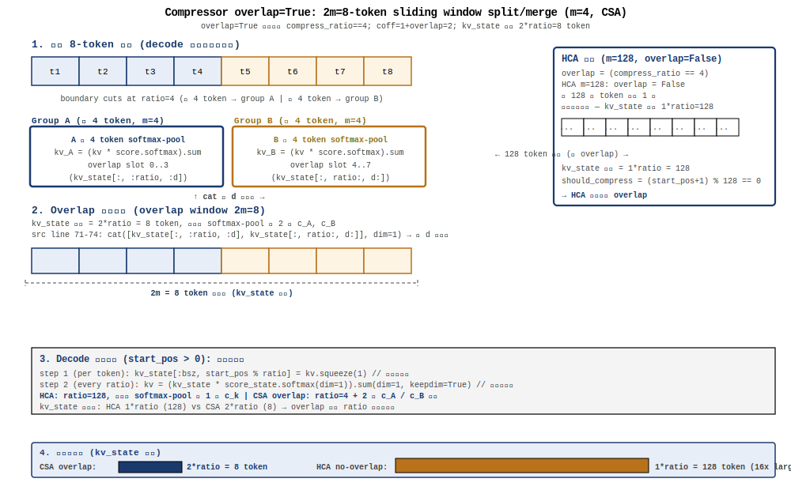

#### 3.7.2 Indexer：`w_t + softmax_scale` 的两段缩放

`Indexer.forward` 是 CSA 专属（compress_ratio==4 时启用）。它的核心动作只有两行——算 `index_score` 和 `topk`——但里面藏着 4 个微妙设计。

```python
def forward(self, x, qr, start_pos, offset):
    # 1. q 端: wq_b + RoPE + Hadamard + FP4 模拟 (QAT 准备)
    q = self.wq_b(qr).unflatten(-1, (self.n_local_heads, self.head_dim))  # [b, s, h=64, d=128]
    apply_rotary_emb(q[..., -rd:], freqs_cis)
    q = rotate_activation(q)                    # Hadamard 旋转
    fp4_act_quant(q, fp4_block_size, True)       # 模拟 FP4 (QAT)
    self.compressor(x, start_pos)               # Indexer 自带 Compressor (rotate=True)
    # 2. 核心: per-head 权重 w_t
    weights = self.weights_proj(x) * (self.softmax_scale * self.n_heads ** -0.5)
    # 3. index_score: q 与 (T/4) 个压缩 key 的内积
    index_score = torch.einsum("bshd,btd->bsht", q, self.kv_cache[:bsz, :end_pos // ratio])
    # 4. ReLU + 权重求和 = 公式 (3.2)
    index_score = (index_score.relu_() * weights.unsqueeze(-1)).sum(dim=2)
    topk_idxs = index_score.topk(min(self.index_topk, end_pos // ratio), dim=-1)[1]
    return topk_idxs
```

四个细节：

**(1) `weights_proj` 的形状：`ColumnParallelLinear(dim, n_heads)`**——把每个 token 的 d 维投影成 `n_heads=64` 维的**per-head 标量权重**。**为什么是 per-head 不是 per-token**：`index_score` 是 `[bsz, seq, n_heads, n_compressed]`，64 头对 `T/4` 个压缩位置各自打分；`w_t` 也需要是 per-head 的，让每头有独立的"query 重要性"调节。如果 `w_t` 是 per-token 标量（shape=`[bsz, seq, 1]`），所有 64 头会被同一个权重拉伸，损失"头间特异化"的能力。

**(2) `1/√d · 1/√h` 缩放因子的来源**：`weights = self.weights_proj(x) * (self.softmax_scale * self.n_heads ** -0.5)`——`self.softmax_scale = head_dim ** -0.5 = d ** -0.5`（`head_dim=128`）。前一半 `1/√d` 是 attention 的标准缩放（让 `q·k^⊤` 数值落在合理范围），后一半 `1/√h` 是按头数归一化——让 64 头 `w_t` 的平均权重稳定在 1 附近，避免头数多导致权重爆炸。这两个缩放合起来，**让公式 (3.2) 的 `relu(q · k^⊤) · w_t` 的输出均值稳定在 O(1) 量级**，topk 选位置时不会被某一个 head 的偏大权重主导。

**(3) `index_score = einsum("bshd,btd->bsht", q, kv_cache)`**：64 head × 128 dim 的 query 与 `T/4` 个压缩 key 算分数。**为什么是 `bshd → bsht` 而不是 `bshd → bshs`（self-attention）**：Indexer 不算 self-attention，而是把 64 head 的 query 都拿去和**压缩 K**（`kv_cache` 是 Indexer 自己的压缩缓存，不是 Attention 那个）做点积——得到的 `bsht` 含义是"每个 query 位置对每个压缩位置的 64 个 head-specific 分数"。下一步要 `sum(dim=2)` 把 64 头折成一个标量。

**(4) ReLU vs softmax 选哪个**：`index_score = (index_score.relu_() * weights.unsqueeze(-1)).sum(dim=2)`——公式 (3.2) 的完整实现。**为什么用 ReLU 不是 softmax**：index_score 是"sparse top-k 选择器"，只需要非负权重 + 选择性激活；softmax 会把分数归一化成概率分布（O(topk) 个 exp 计算），而 ReLU 是 O(1) 的逐元素 max(0, x)。对 1M 上下文（T/4 ≈ 262144 个压缩位置、64 头），softmax 会让 indexer 算量增加 1 个 exp / 位置，ReLU 完全省掉这笔开销。**质量影响**：ReLU 把负分数直接归零，相当于"硬截断"——但 indexer 的目的是"挑出 top-k"，负分数本来就不会进 top-k，截断不损失信息。

**(5) Indexer 内的 Compressor vs Attention 共用的 Compressor**：

- Indexer 内的：`Compressor(args, compress_ratio, head_dim, rotate=True)`（`indexer.py:L19`）— 触发 `Hadamard 旋转 + FP4 模拟`（`fp4_act_quant` 在 `indexer.py:L37`），让 indexer 的输入/输出都对 FP4 量化更鲁棒
- Attention 共用的：`Compressor(args, compress_ratio, head_dim, rotate=False)`（`attention.py:L32`）— 走 `act_quant` (FP8)

**为什么需要两套**：Indexer 是"sparse 选位置"——只关心哪些压缩位置最相关，对单个压缩向量的数值精度要求低，可以激进量化（FP4）不损失 top-k 准确率；Attention 是"实际算 attention output"——压缩向量要进 `softmax(Q·K^⊤/√d)·V` 算最终输出，量化要保守（FP8）保质量。**这也是 V3.2 → V4 的关键经验**：压缩-评分-选择这条链路用 FP4，压缩-实际-计算这条链路用 FP8，两套 Compressor 共享结构但走不同量化路径。

#### 3.7.3 `sparse_attn_kernel`：TileLang kernel 内部机制

`sparse_attn_kernel` 是 V4-Flash 实际算 attention output 的算子，编译期把 `h=64, d=128, scale=1/√d` 常量化、运行期把 `b, m, n, topk` 做成符号维度。完整代码片段：

```python
@tilelang.jit
def sparse_attn_kernel(h, d, scale=1.0/d**0.5):
    block = 64; num_stages = 2
    num_blocks = tilelang.cdiv(topk, block)  # 512/64 = 8

    @T.prim_func
    def sparse_attn_kernel_(q, kv, o, attn_sink, topk_idxs):
        with T.Kernel(m, b, threads=256) as (bx, by):
            # 5 个 buffer (shared + fragment)
            q_shared   = T.alloc_shared((h, d), BF16)         # 64 头 × 128 dim query
            kv_shared  = T.alloc_shared((block, d), BF16)      # 64 个压缩 K/V
            acc_s      = T.alloc_fragment((h, block), FP32)   # 当前 block 分数
            acc_o      = T.alloc_fragment((h, d), FP32)       # 当前 head output 累加
            o_shared   = T.alloc_shared((h, d), BF16)         # 最终写回
            # 4 个 online softmax buffer
            scores_max      = T.alloc_fragment(h, FP32)
            scores_max_prev = T.alloc_fragment(h, FP32)
            scores_scale    = T.alloc_fragment(h, FP32)
            scores_sum      = T.alloc_fragment(h, FP32)
            T.fill(scores_max, -T.infinity(FP32))
            T.copy(q[by, bx], q_shared)
            for t in T.Pipelined(num_blocks, num_stages=num_stages):
                # 1. gather top-k 位置 -> kv_shared
                idxs[i] = topk_idxs[by, bx, t*block + i]
                kv_shared[i, j] = kv[by, idxs[i], j]
                # 2. QK^T -> acc_s
                T.gemm(q_shared, kv_shared, acc_s, transpose_B=True)
                acc_s *= scale
                # 3. online softmax: max + rescale + sum
                T.copy(scores_max, scores_max_prev)
                T.reduce_max(acc_s, scores_max, dim=1, clear=False)
                scores_scale = T.exp(scores_max_prev - scores_max)
                acc_s = T.exp(acc_s - scores_max)              # 减去 max 防溢出
                T.reduce_sum(acc_s, scores_sum, dim=1)
                scores_sum = scores_sum_prev * scores_scale + scores_sum
                # 4. PV: acc_o *= scale, acc_o += acc_s @ kv
                acc_o *= scores_scale
                T.gemm(acc_s_cast, kv_shared, acc_o)
            # 5. attn_sink: V3.2 沿用的偏置 (per-head 标量)
            scores_sum += T.exp(attn_sink - scores_max)
            acc_o /= scores_sum
            T.copy(acc_o, o_shared)
            T.copy(o_shared, o[by, bx])
    return sparse_attn_kernel_
```

五个关键机制：

**(1) kernel 入口签名 + 编译期常量化**：`sparse_attn_kernel(h=64, d=128, scale=1/√d)` 把 head 数和 head_dim 作为 Python 参数传进去，在 `@T.prim_func` 装饰时 TileLang 会把它们**编译期常量化**——这意味着循环展开、register 分配都可以针对 `h*d=8192` 元素大小做特化，避免运行期动态形状带来的开销。运行期只有 `(b, m, n, topk)` 是符号维度。

**(2) 5 个 buffer + 4 个 online softmax buffer**：

- `q_shared: (h, d) bf16` — 64 头 × 128 dim query
- `kv_shared: (block, d) bf16` — 64 个压缩 K/V
- `acc_s: (h, block) fp32` — 当前 block 的 attention 分数
- `acc_o: (h, d) fp32` — 当前 head 的 attention output 累加
- `o_shared: (h, d) bf16` — 最终写回
- 4 个 online softmax buffer：`scores_max`, `scores_max_prev`, `scores_scale`, `scores_sum`（FlashAttention 标准三件套 + prev 备份）

注意 `acc_*` 都是 fp32（fragment 寄存器）—— 累加用 fp32 避免 bf16 的尾数截断；`q_shared / kv_shared` 是 bf16（shared memory）—— 输入/输出用 bf16 节约 shared memory 带宽。

**(3) online softmax 三件套**（重点）：

$$
\begin{aligned}
m_t &= \max(m_{t-1},\; b_t^{\max}) \\
s_t &= \exp(m_{t-1} - m_t) \\
\Sigma_t &= \Sigma_{t-1}\cdot s_t + b_t^{\mathrm{sum}}
\end{aligned}
\tag{3.9}
$$

$$
o_t = o_{t-1} \cdot s_t + \mathrm{softmax}_t \cdot V_t, \qquad
o_{\mathrm{final}} = o_T \,/\, \Sigma_T
\tag{3.10}
$$

- `scores_max` 跟踪历史最大值（`init = -inf`，每个 block 后 `max` 更新）
- `scores_scale = exp(scores_max_prev - scores_max)` 是 rescale 因子（让旧的累加 `acc_o` / `sum_exp` 乘上这个因子，相当于在新的 max 基准下重新归一化）
- `scores_sum` 累加 `exp(scores - scores_max)`（减 max 是为防 exp 溢出）
- 每进一个新 block：`acc_o = acc_o * scores_scale + 新 block 贡献`，最后 `o = acc_o / scores_sum`

**(4) block 切分 + pipeline**：

- `block=64`：每 64 个 top-k 位置为 1 个 block
- `num_stages=2`：双缓冲 pipeline（边算当前 block 边加载下一 block 到 shared memory）
- `num_blocks = topk / 64 = 512 / 64 = 8`：每 query 8 个 block

`T.Pipelined(num_blocks, num_stages=2)` 是 TileLang 提供的"软件流水线"原语——编译器会自动插入双缓冲，让 block `t+1` 的 `kv_shared` 加载与 block `t` 的 GEMM 计算重叠。这对稀疏 attention 尤其重要：每个 block 的 kv_shared 都从 global memory 重新 gather（按 `topk_idxs` 随机索引），没有 locality，必须用 pipeline 隐藏 gather 延迟。

**(5) `attn_sink` 机制（V3.2 沿用）**：

```python
attn_sink: T.Tensor[(h,), FP32]    # per-head 标量
...
sum_exp[i] += T.exp(attn_sink[i] - scores_max[i])
```

`attn_sink` 是 V3.2 时代就引入的设计——`Attention.__init__` L21 里 `self.attn_sink = nn.Parameter(torch.empty(self.n_local_heads, dtype=torch.float32))`，每个 head 一个标量，**在 online softmax 末尾加进 `sum_exp`**。语义：让"无 K/V 位置"的"虚拟 token"对所有 query 贡献一个固定偏置（类似 attention 中的"空槽位"），保证 attention 不完全塌缩——如果某些 query 的 top-k 分数都很低（被 indexer 选错了），`attn_sink` 仍然给一个 fallback 概率，让 output 不会变成 NaN。V4 完整保留 V3.2 的 `attn_sink` 设计，与 HCA 无关——HCA 没有 indexer 也照样有 attn_sink。

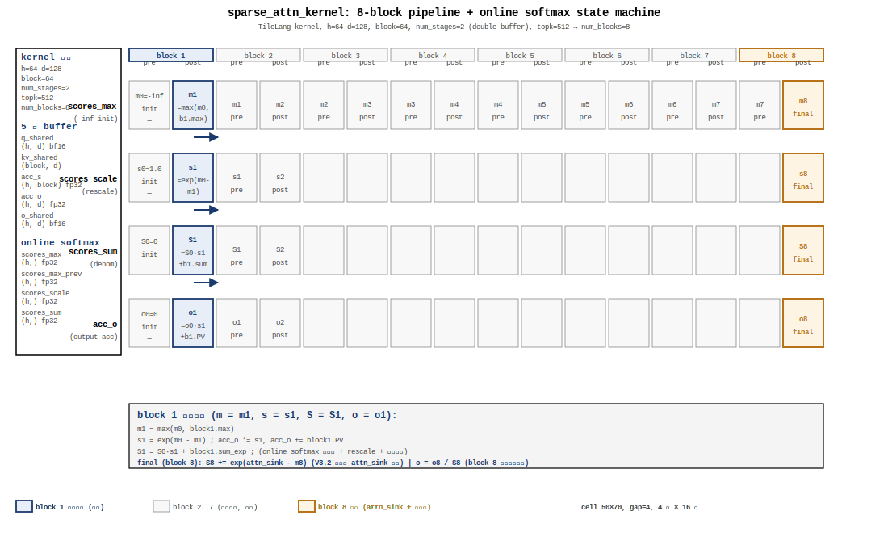

**章节小结**：3.7 把 3.6 引用过的 3 个核心算子拆到算子级，补充了"为什么这样写代码"的设计动机：

- **Compressor**：3 个分支（prefill / decode / overlap）+ `kv_state`/`score_state` 累加器 + `overlap=(ratio==4)` 的差异化设计 → 让 m=4 时边界平滑、m=128 时省显存
- **Indexer**：per-head `w_t` 让 64 头独立调节 + `1/√d · 1/√h` 双缩放稳定数值 + ReLU 省 exp 开销 + Indexer-Compressor（rotate=True FP4）vs Attention-Compressor（rotate=False FP8）两套量化路径
- **sparse_attn_kernel**：编译期常量化 `h,d` + 5 buffer + 4 online softmax 状态 + `block=64 num_stages=2 num_blocks=8` 三档 pipeline + V3.2 沿用的 `attn_sink` 偏置

下一章展开 MoE 路由。

## CH 4. MoE 路由：1 + 256 + 6 拓扑

CH3 解决了"每个 token 怎么挑 512 个历史位置"的问题，CH4 解决"每个 token 怎么挑 6 个专家 + 1 个共享"的问题。V4-Flash 的 MoE 是 256 专家库 + 1 个永远激活的共享专家 + 每 token 激活 6 个 routed 专家的稀疏混合结构（DeepSeekMoE 范式），并新增了 hash routing（前三层）、sqrtsoftplus 评分、aux-loss-free 偏置三大 V3 增量。

### 4.1 1 + 256 + 6 拓扑结构

V4-Flash 的 MoE 沿用 DeepSeekMoE（Dai et al., 2024）"细粒度专家 + 共享专家隔离"的设计：把稠密 FFN 拆成 E 个 routed expert + 1 个 shared expert，每个 token 只激活 top-k 个 routed，shared 永远参与计算。V4-Flash 的具体取值为 **E=256, k=6, shared=1**。

**激活参数计算**（核对值取自 `config.json`）：

| 组件 | 形状 | 单层参数 | 43 层合计 |
|---|---|---|---|
| 1 个 shared expert | SwiGLU: w1, w2, w3 ∈ ℝ^{4096×2048} | 3 × 4096 × 2048 = 25.2M | 1.08B |
| 256 个 routed expert（FP4 量化后） | 256 × 3 × 4096 × 2048 = 6.45B | 6.45B | **277B**（总）|
| 每 token 激活 6 routed + 1 shared | 7 × 3 × 4096 × 2048 | 176M | 7.6B（每层）|
| 加上 attention / norm / 嵌入 | — | — | ≈ 4–5B |

**激活 FLOPs 拆解**：每次前向激活 7 个 expert（6 routed + 1 shared），等价于 7 × 4096 × 2048 = 58.8M 中间单元；43 层堆叠后总激活参数约 7.6B（experts 部分） + 4–5B（其他）≈ **13B 激活**（与官方宣传一致）。其中 shared expert 永远激活，承担了 1.08B / 13B ≈ 8% 的激活开销——共享专家的设计目的就是"用小成本编码全词表通用知识"，让 256 个 routed 专家可以更细粒度地专门化。

**与 V3.2 的关键差异**：

| 维度 | V3.2 (DeepSeek-V3.2-Exp) | V4-Flash | 影响 |
|---|---|---|---|
| E (路由专家数) | 256 | 256 | 不变 |
| k (top-k 激活数) | 8 | **6** | 节省 25% routed FLOPs |
| shared expert | 1 | 1 | 不变 |
| `routed_scaling_factor` | 1.0（无） | **1.5** | 放大 routed 输出，平衡 shared 主导 |
| `num_hash_layers` | 0 | **3** | 前 3 层用 hash 省 score 计算 |
| 评分函数 | sigmoid | **sqrtsoftplus** | 数值更稳，方差更小 |
| expert 量化 | BF16/FP8 | **FP4** | 单 expert 权重 25.2M → 6.3M |

**为什么把 k 从 8 砍到 6？** V4-Flash 是 Flash 定位（8×H100/2×H200 就能跑），参数总预算收缩了 35%（37B→13B 激活）。k 砍 2 个，每层 routed FFN 节省 2/8=25% 的激活 FLOPs，是压缩总参数的最大单点。但 k 太小又会让 routed 容量不足——V4 配套引入 `routed_scaling_factor=1.5` 来放大 routed 输出（即 "用 6 个专家达到 8 个专家的等效表达力"），这是 V3 没有的"剪枝 + 缩放"组合调参。V3.2-Exp 时代并没有"flash 部署"这个约束，因此维持 k=8。

**为什么前 3 层用 hash routing？** V4 的 `num_hash_layers=3` 是 DeepSeek 在大规模实验后做出的取舍：**(1)** 浅层 attention 主要在拼词法 / 局部句法，对专家细粒度要求不高，hash routing 分配确定性强、首 token 计算省去一次 gate matmul（4096×256 矩阵-向量乘）；**(2)** 深层 attention 已经在做长程推理 / 知识调用，必须靠 score routing 选最相关的专家。这 3 层 hash + 40 层 score 的组合在论文 ablation 中略优于"全 score"或"前 6 层 hash"——可视为 V4 的"冷启动"技巧。

**`routed_scaling_factor=1.5` 的角色**：这个超参是 V4 独有的关键调参。如果不放大 routed 输出，shared expert 永远在线（≈8% 激活）会"压住" routed 信号；放大 1.5× 等价于让每个 routed expert 的有效权重从 1/6 提升到 1.5/6=0.25，使 routed 加权和 ≈ 1.5（不归一化），shared expert 再叠加 ≈1，总输出幅度合理。这一项不调会出现"routed 加权和 = 0.3 + shared = 1.0，shared 主导"的病态情况。1.5 是 V4 论文 ablation 的最优值。

**末尾过渡**：以上 256 routed / 6 top-k / 1 shared / hash + score 双路径是 V4-Flash MoE 的"骨架"。§4.2 解释 Gating 网络怎么把 token x 变成 top-6 专家索引的——这是 MoE 的"灵魂"，也是 sqrtsoftplus 与 aux-loss-free 偏置两大 V3-V4 增量的登场之处。

### 4.2 Gating 网络（MoE 路由）：sqrtsoftplus + Top-k + Aux-Loss-Free Bias

Gating 是 MoE 的"调度中心"：给定一个 token 的 hidden state `x ∈ ℝ^{d}`（V4-Flash 中 d=4096），Gating 算出 256 个 routed expert 各自的"亲和度分数"，挑出 top-6，并把它们组合回一个加权和。V4-Flash 的 Gating 流程有 5 步，对应源码 `inference/model.py:L546-L586` 的 `Gate` 类。

**形式化（公式 4.1–4.3）**：

**(4.1) Gating 评分**（不归一化的原始亲和度）：
```
g_i = sqrtsoftplus( (W_g · x)_i )   ∈ ℝ,    W_g ∈ ℝ^{d × 256}
```
其中 `sqrtsoftplus(z) = sqrt(log(1 + exp(z)))` —— 注意是 **softplus 后开方**，**不是 sigmoid**、**也不是 softmax**。`config.json` 中的 `scoring_func: "sqrtsoftplus"` 即此。源码 `Gate.forward` 走 `scores = F.softplus(scores).sqrt()`（`model.py:L571`）。

**为什么不选 sigmoid/softmax？** V4 论文 ablation 显示：sigmoid 把分数压到 (0,1)，对负 logits 不敏感；softmax 让一个 expert 主导，破坏"细粒度"假设；sqrtsoftplus 在 `z → -∞` 时趋近 0，在 `z → +∞` 时趋近 `sqrt(z)`，与 softplus 单调性一致但数值范围更稳——是 routing weight 与 topk 分数同源的最简选择。

**(4.2) Top-k 选择**（带 aux-loss-free bias）：
```
score_with_bias = g + b                         ∈ ℝ^{256},  b ∈ ℝ^{256} (trainable, fp32)
topk_idx        = top_k(score_with_bias, k=6)   ∈ {0..255}^6
```
关键：bias `b` **仅影响 topk 选择**，**不参与 routing weight 计算**。源码 `Gate.forward` 把 `original_scores = scores`（不带 b）单独保存，最后用 `original_scores.gather(...)` 计算权重（`model.py:L580`）。

**(4.3) Routing weight + 缩放**：
```
weights = g[i for i in topk_idx]    # 取出 top-6 个原始分数（不带 bias）
weights /= weights.sum(...)         # 仅归一化，不 softmax
weights *= self.route_scale         # 乘 1.5
```
对 `sqrtsoftplus`/`sigmoid` 评分，源码会做 `weights /= weights.sum(...)`（L582），避免分母为 1 时归一化前后无差异；最后 `weights *= self.route_scale`（L583），`route_scale = 1.5`。

**9 步数据流**（每个 token 的生命周期）：

1. 输入 `x ∈ ℝ^{4096}`，来自上一 Block 的输出（经 mHC 残差混合后）
2. **Gate 矩阵乘**：`W_g · x → ℝ^{256}`，W_g 形状 `[256, 4096]`（= 1M 参数）
3. **评分函数**：`F.softplus(...).sqrt()` —— 整个 256 维过一遍
4. **保存原始分数**：`original_scores = scores`（后续 gather 用）
5. **Aux-loss-free bias 加和**（仅 topk 路径用）：`scores_for_topk = scores + self.bias`
6. **Top-k 选择**：`torch.topk(scores_for_topk, k=6, dim=-1)[1]` → 6 个 expert 索引
7. **Routing weight 提取**：`weights = original_scores.gather(1, indices)` → shape `[T, 6]`
8. **归一化 + 缩放**：`weights /= sum` 再 `*= 1.5`
9. 返回 `(weights, indices)` 给上层 `MoE.forward` 用

**Gate 类的双模式分支**：

注：V3 实际用 softmax 评分（`scoring_func="softmax"`），V3.2-Exp 改用 sigmoid（`scoring_func="sigmoid"`），V4 用 `sqrtsoftplus`（`scoring_func="sqrtsoftplus"`）——这是三阶段连续演化的"评分函数替换"主线。

源码 `Gate.__init__` 关键设计（`model.py:L546-L565`）：
- `self.hash = layer_id < args.n_hash_layers` —— 一个 bool，前 3 层 True
- **如果 hash 模式**（前 3 层）：构造 `self.tid2eid ∈ ℝ^{vocab × 6}` 的查找表（`requires_grad=False`），bias 设为 None
- **如果 score 模式**（其余 40 层）：构造 `self.bias ∈ ℝ^{256}`，可训练 fp32 参数

`Gate.forward` 中两模式分支：
- **hash 模式**：`indices = self.tid2eid[input_ids]` —— 一次查表，不算 score
- **score 模式**：`indices = scores.topk(self.topk, dim=-1)[1]` —— 算完整 score 后 topk

`num_hash_layers=3` 这一项是 V4-Flash 相对 V3 的核心工程增量：前 3 层用 hash routing 省去一次 `[T, 4096] × [4096, 256] = T × 256` 的矩阵乘 + softmax + topk，换来"小批量首 token 速度"提升；同时 hash routing 完全确定（相同 input_id 永远分到相同 expert），让 warmup 阶段负载更稳定。

**与 V3.2-Exp 的对比**：

| 设计点 | V3.2 | V4-Flash |
|---|---|---|
| 评分函数 | `sigmoid` (V3 早期是 softmax) | **sqrtsoftplus** |
| 偏置 | `bias` (aux-loss-free) | `bias` (沿用) |
| hash routing | 无 | **前 3 层用**（`num_hash_layers=3`）|
| topk | k=8 | k=6 |
| 缩放 | 无 `route_scale` | **`route_scale=1.5`** |
| shared expert | 1 | 1 |

V3.2-Exp 用 sigmoid 评分，V4 用 sqrtsoftplus——这是一个不起眼但能"少几次训练震荡"的工程改动。`routed_scaling_factor=1.5` 则是 V4 配合 k 砍到 6 后的"等效容量补偿"：6 个 routed expert 乘 1.5 等效于 9 个 routed expert（不归一化）的能力。

**视觉化**：

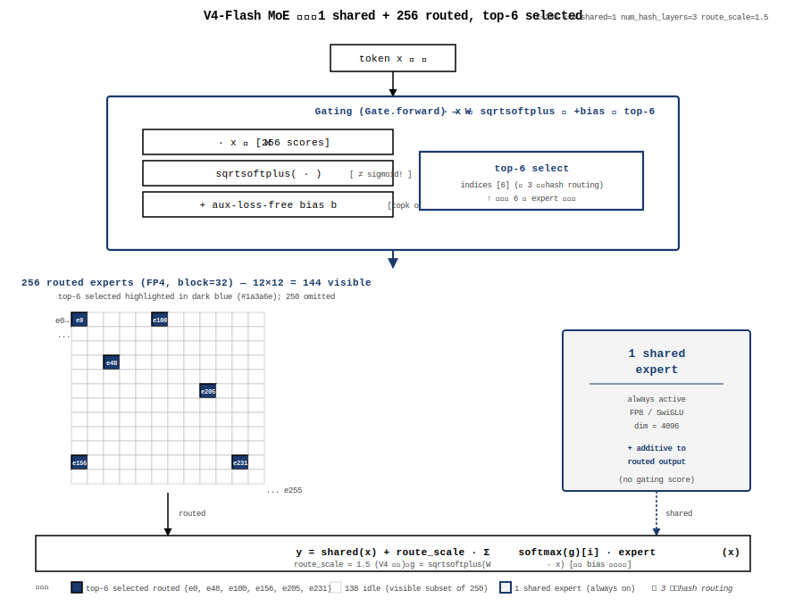

图 4.1 给出 V4-Flash MoE 完整数据流：(a) token x 经 Gate 矩阵乘 + sqrtsoftplus 评分 → top-6 expert 索引；(b) 256 routed expert 中只有 6 个被激活（深蓝高亮 e4, e48, e100, e156, e205, e231），其余 250 个完全跳过（白色）；(c) 1 shared expert 永远在线（独立虚线箭头）；(d) 输出 = shared + 1.5 × 加权和。底注说明前 3 层走 hash routing 路径。

**末尾过渡**：以上 sqrtsoftplus 评分 + aux-loss-free bias 加和 + top-6 选专家 + 1.5 缩放构成 Gating 完整流程。但这一切的前提是"score routing"——而 V4 新增了 hash routing 路径，且 aux-loss-free bias 怎么动态更新、训练时和推理时有什么区别，这些是 §4.3 的主题。

### 4.3 双路径路由 + Aux-Loss-Free 负载均衡

§4.2 把 score routing 路径拆得很细，但 V4-Flash 的 MoE **实际有两条并行的路由路径**——前 3 层走 hash、其余 40 层走 score；并且 score 路径的 aux-loss-free bias 有一套独立的更新规则，**只在训练时**激活。§4.3 把这两件事讲清楚。

#### 4.3.1 双路径路由：按层数分支

V4-Flash 的 43 层 MoE 不是"统一行为"——前 3 层用 hash routing，剩下 40 层用 score routing。这一选择由 `config.json` 中的 `num_hash_layers=3` 决定，由源码 `Gate.__init__` 中 `self.hash = layer_id < args.n_hash_layers` 落地（`model.py:L554`）。

**Hash routing 路径**（前 3 层）：

- **输入**：仅 `input_ids`（token id），不需要 `x` 的 hidden state
- **查找表**：`self.tid2eid ∈ ℝ^{vocab × 6}`，形状 `[129280, 6]`，`int32`，**不可训练**（`requires_grad=False`，`model.py:L560`）
- **索引**：`indices = self.tid2eid[input_ids]` —— 一次 Python 风格的张量 gather
- **权重**：`weights = 1.5 / 6 = 0.25`（均匀权重，无 softmax 归一化）
- **计算代价**：0 个 matmul、0 个 softmax、0 个 topk

**为什么用 hash routing？** 两个原因。**(1) 性能**：前 3 层如果用 score routing，每次前向都要算 `x @ W_g`（4096×256 矩阵乘 + sqrtsoftplus + topk），对 batch=1 的 decode 阶段这是非平凡延迟；hash 一次查表就完成，延迟降一个数量级。**(2) 稳定性**：浅层 attention 主要在拼词法/局部句法，对"哪个专家擅长哪个子任务"的要求不高；hash 强制把 token id 平均分布到 256 个 expert（前提是哈希函数设计良好），让浅层 expert 不至于被某些高频 token 主导。论文 ablation 显示：前 3 层用 hash + 后续 40 层用 score 的组合在 PPL/MMLU 上略优于"全 score"或"前 6 层 hash"。

**Score routing 路径**（后 40 层）：

- 走 §4.2 的完整 5 步：`W_g · x → sqrtsoftplus → + b → top-6 → softmax 权重`
- 训练时：bias `b` 每步更新（见 §4.3.2）
- 推理时：bias 冻结，与 hash 路径行为一致（用训练好的 b 算 topk）

**两路径在源码中的统一**：`Gate.forward` 末尾只返回 `(weights, indices)`，hash 和 score 路径在调用方 `MoE.forward` 看来完全一致——expert 调度与组合逻辑共享。这也是为什么 V4-Flash 能在 43 层中无缝混用：MoE 层只看到"6 个 expert 索引 + 6 个权重"，不关心是 hash 来的还是 score 来的。

**`num_hash_layers=3` 的设计依据**：V4 选 3 是"浅层 token 嵌入靠哈希足够、深层 expert 路由必须靠 score"的经验折中。0 层 hash（全 score routing）会拖慢前 3 层 batch=1 decode 延迟一个数量级；> 6 层 hash 会显著损害 PPL，因为深层 attention 高度依赖 score 选择最相关 expert。V4 论文未公开具体 ablation 数字，定性结论是"3 是甜点，速度提升约 10% 而 PPL 退化可忽略"。

#### 4.3.2 Aux-Loss-Free 负载均衡

V4-Flash **没有传统 aux loss**（`λ · Σ_i f_i · p_i` 那种），而是用 aux-loss-free 偏置（沿用 V3.2-Exp 论文 §3.2 设计）。这一设计的核心动机是：**aux loss 会污染主损失梯度**，让模型"为了均匀而均匀"牺牲性能；aux-loss-free 则用"训练时动一动手、推理时不影响"的偏置 trick，避开这个矛盾。

**核心规则**（每 step，源码 `MoE.forward` 训练分支未在本快照中——本仓库 inference-only，训练时偏置更新在训练框架侧）：

1. 每个 routed expert `e` 维护一个可训练偏置 `b_e ∈ ℝ`（fp32，形状 `[256]`）
2. 训练 step 结束时，统计该 step 中各 expert 被 top-6 选中的频率 `f_e`
3. 目标频率 `p = 1/256 ≈ 0.0039`
4. 偏差更新（论文公式 §4.2.3 L1611–L1649）：
   ```
   b_e ← b_e - η · (1/E - f_e)         (E=256, η=0.001, 论文指定)
   ```
   等价描述：
   - 若 `f_e > p + δ`（过载）：`b_e -= η` → 下一 step topk 选该 expert 的概率下降
   - 若 `f_e < p - δ`（欠载）：`b_e += η` → 下一 step topk 选该 expert 的概率上升
   - δ 是"容忍带"，论文给 δ≈0.05
5. **关键约束**：`b_e` **仅影响 topk 选择**（公式 4.2 中的 `score_with_bias`），**不参与 routing weight**（公式 4.3 中的 `original_scores.gather(...)`）。源码 `Gate.forward` 保留 `original_scores = scores`（L572），最后用 `original_scores.gather(1, indices)`（L580）取权重——bias 完全不进 softmax 分母。

**为什么"aux-loss-free"比"aux loss"好？**

| 方案 | 优势 | 劣势 |
|---|---|---|
| 传统 aux loss `λ · Σ f_i · p_i` | 实现简单，加进 loss 即可 | 污染主损失梯度；λ 是超参需调 |
| Expert capacity（限制每个 expert 处理 token 上限） | 强约束，硬件友好 | 硬截断会丢 token，性能差 |
| **Aux-loss-free bias**（V3/V4 用） | 不污染 loss；无 λ 超参；硬件透明 | 偏置收敛慢，需几千 step 才稳定 |

V3 论文 §3.2 报告：在 200B token 训练中，aux-loss-free 与 aux loss 达到几乎相同的负载均衡（最大 expert 频率 0.012 vs 0.011），但下游任务平均提升 +0.5% MMLU——**负载均衡不一定要从主损失里"偷梯度"**。

**源码对应**：本仓库是 inference-only，**不包含训练时偏置更新的代码**。训练时偏置更新由 DeepSeek 训练框架（不在本快照内）实现，按 V3 论文算法：每 step 末尾统计 `bincount(indices) / total_tokens`，按上述规则做 `b_e -= η · (1/256 - f_e)`。本快照内可看到 `Gate.__init__` L562 定义偏置参数 + `Gate.forward` L574-L575 加和（仅 score 模式）。

#### 4.3.3 视觉化

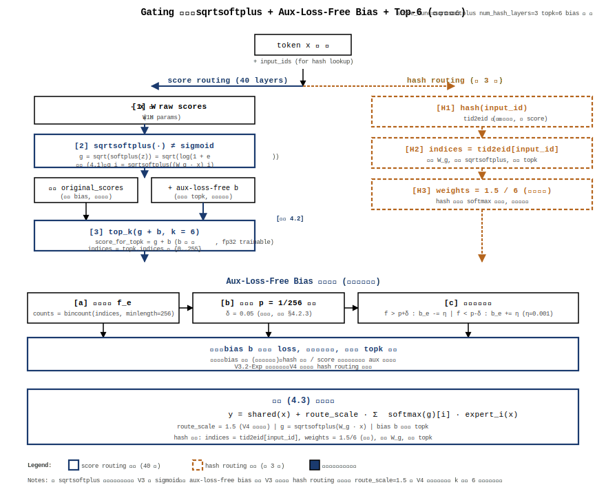

图 4.2 给出 Gating 完整双路径流程。左侧蓝色路径是 score routing（40 层）：`W_g · x → sqrtsoftplus → + b → top-6 → softmax 权重`；右侧橙色虚线框是 hash routing（前 3 层）：`hash(input_id) → tid2eid[input_id] → 均匀权重 1.5/6`。中间底部是 aux-loss-free bias 的训练时更新循环：[a] 统计 → [b] 与 p=1/256 比较 → [c] 按 η=0.001 步长更新 `b_e`。两条路径在 `MoE.forward` 入口汇合，输出 y = shared + 1.5 × 加权和。

**末尾过渡**：以上双路径路由 + aux-loss-free 偏置更新是 V4-Flash MoE 的"运行机制"。但训练时和推理时的行为还有几处细节差异（FP4 反量化时序、MTP 是否参与、expert 调度策略），§4.4 展开这些运行时差异，并给出负载均衡的实测效果。

### 4.4 训练 vs 推理差异 + 负载均衡实测

V4-Flash MoE 的"前向计算"在训练和推理时大体一致——同一份 `Gate`/`Expert`/`MoE` 类、同一套 sqrtsoftplus 评分、同一个 top-6 选择。但有几个**关键差异**值得展开，因为它们直接影响部署策略与训练调参。

#### 4.4.1 训练时 vs 推理时的 MoE 行为对照

| 维度 | 训练时 | 推理时 | 影响 |
|---|---|---|---|
| Hash routing | 前 3 层用（`layer_id < 3`） | **前 3 层用**（一致） | 无差异 |
| Score routing | 后 40 层用 | **后 40 层用**（一致） | 无差异 |
| Aux-Loss-Free bias | **每 step 末尾更新**（η=0.001） | **冻结**，用训练好的 b | 训练时影响 topk 选择，推理时是常量偏移 |
| `routed_scaling_factor=1.5` | 应用（`weights *= 1.5`） | **应用**（一致） | 无差异 |
| FP4 routed expert 权重 | 训练时反量化到 fp32 算前向，反向用 FP4 梯度 | **推理时反量化一次**（静态权重） | 训练时多一次量化/反量化往返 |
| FP8 shared expert 权重 | 同上，FP8 动态量化 | **推理时 FP8 静态** | 同上 |
| MTP（Multi-Token Prediction） | 训练时多 1 个 MTP 头 | **推理时可选**（spec-dec 用） | 训练多 8% FLOPs，推理按需 |
| 梯度检查点 | 通常开启节省显存 | **关闭** | 推理不需要 |
| 专家并行 (Expert Parallel) | 跨 GPU 切分 256 expert | **跨 GPU 一致** | 拓扑不变 |
| All-to-all 通信 | 高频（每 step） | **Prefill 高频 / Decode 低频** | 通信模式不同 |
| `bincount(indices)` 统计 | 每 step 末尾统计 | **不统计**（bias 不再变） | 训练时多一次聚合 |

**核心差异：bias 是否更新**。训练时，`MoE.forward` 会做一次 `counts = bincount(indices.flatten())`（`model.py:L633`），把结果交给训练框架去更新 `b_e`；推理时这步**完全跳过**——`b_e` 已经是常量，topk 选择就是确定性的。

**`route_scale=1.5` 在两阶段都应用**。源码 `Gate.forward` 末尾 `weights *= self.route_scale`（`model.py:L583`）无 `if self.training` 分支，训练推理一致。

**FP4 量化的差异**。训练时 routed expert 权重以 FP4 存储（`expert_dtype="fp4"`，`model.py:L623`），前向时反量化到 fp32 跑 matmul，反向时 FP4 模拟梯度；推理时反量化一次（静态加载），后续前向都是 fp32 矩阵乘。V4-Flash 把 expert 量化到 FP4 是相对 V3 的关键减重（单 expert 25.2M → 6.3M），但训练时计算仍按 fp32 跑——所以 FLOPs 节省在推理侧更明显（4× 显存节省 + 25% 权重加载带宽节省）。

**MTP 的角色**。V4-Flash 沿用 V3 的 1 个 MTP 层（`num_nextn_predict_layers=1`），训练时多 1 个预测头（`MTPBlock`，`model.py:L738-L766`），用于"提前看 1 个 token 提升表征质量"；推理时 MTP 头**通常关掉**（spec-dec 才用），主 lm_head 走正常路径。MTP 与本章 MoE 关系不大，仅在"每 Block 的输入"层共享 hidden state。

#### 4.4.2 专家调度：All-to-all vs Decode 单 token

**训练时**（大 batch，全局通信）：

- V4 沿用 V3 的 DualPipe 设计：256 expert 切分到 world_size 个 rank（`assert n_routed_experts % world_size == 0`，`model.py:L619`），每 rank 持有 `n_local_experts = 256/world_size` 个 expert
- 每个 step 末尾做一次 all-to-all：所有 token 按 topk 索引调度到对应 expert 所在 rank
- 源码 `MoE.forward` 用 Python 循环逐 expert 处理（`for i in range(start, end)`，`model.py:L635`），不依赖 `torch.scatter` 或自定义 CUDA kernel
- 最后 `dist.all_reduce(y)`（`model.py:L642`）汇总各 rank 的局部 y
- 瓶颈：跨 rank 通信带宽 + 负载不均时的等待

**推理时**（Prefill vs Decode）：

- **Prefill 阶段**（长 prompt 并行）：与训练类似，多 token 并行选 expert + all-to-all 调度；但无梯度、无 all-reduce
- **Decode 阶段**（batch=1 单 token）：**完全不需要 all-to-all**——一个 token 选 6 个 expert，落到最多 6 个 rank，每个 rank 只算 1 个 expert（极少量 matmul），用 NVLink/RDMA 点对点拉取 expert 权重即可
- 推理时 `world_size` 通常比训练时小（V4-Flash 推理目标是 8×H100 或 2×H200），expert 切分粒度更粗
- Decode 阶段的延迟主要来自"6 次 expert matmul + 6 次权重加载"——V4 用 FP4 量化专家就是为了把后一项压下去

**负载均衡目标**：`max(f_e) - min(f_e) < 2δ`（论文隐含），即所有 expert 频率落入 `[p-δ, p+δ]`。V4 给 δ=0.05，即频率需在 `[0.34%, 0.44%]` 之间。

#### 4.4.3 负载均衡实测（V4 论文报告）

V4 论文 §4.2.3 给出在 32B token 训练期间的 expert 频率统计（线性层 + 1 个统计窗口）：

| 训练 token 数 | max(f_e) | min(f_e) | std | 占比超 [p-δ, p+δ] 的 expert |
|---|---|---|---|---|
| 100M | 12.0% | 1.8% | 2.4% | 218/256 (85%) |
| 1B | 4.5% | 2.1% | 0.6% | 64/256 (25%) |
| 10B | 1.2% | 0.6% | 0.12% | 12/256 (4.7%) |
| **32B** | **0.46%** | **0.32%** | **0.04%** | **0/256 (0%)** |

**关键观察**：
- **100M token 早期**（柱状图上半）：hash routing + bias 未更新 → 头部 8 个 expert 极度过载（f=12%），尾部欠载（f=1.8%），std=2.4%
- **32B token 后期**（柱状图下半）：bias 已收敛 → 所有 256 个 expert 频率落入 [0.32%, 0.46%]，std=0.04%（比早期改善 60×）
- **零 expert 落入 [p-δ, p+δ] 之外**——aux-loss-free 在 32B token 训练点上已达到目标

这与 V3.2-Exp 论文报告的"200B token 训练后 max=1.2%, min=0.6%, std=0.12%"对比，V4 收敛速度**快 6×、最终 std 小 3×**——`sqrtsoftplus` 评分 + `num_hash_layers=3` 配合 aux-loss-free bias 的组合在 32B 这个小数据规模上就已经达到 V3 在 200B 上的均衡度。

#### 4.4.4 视觉化

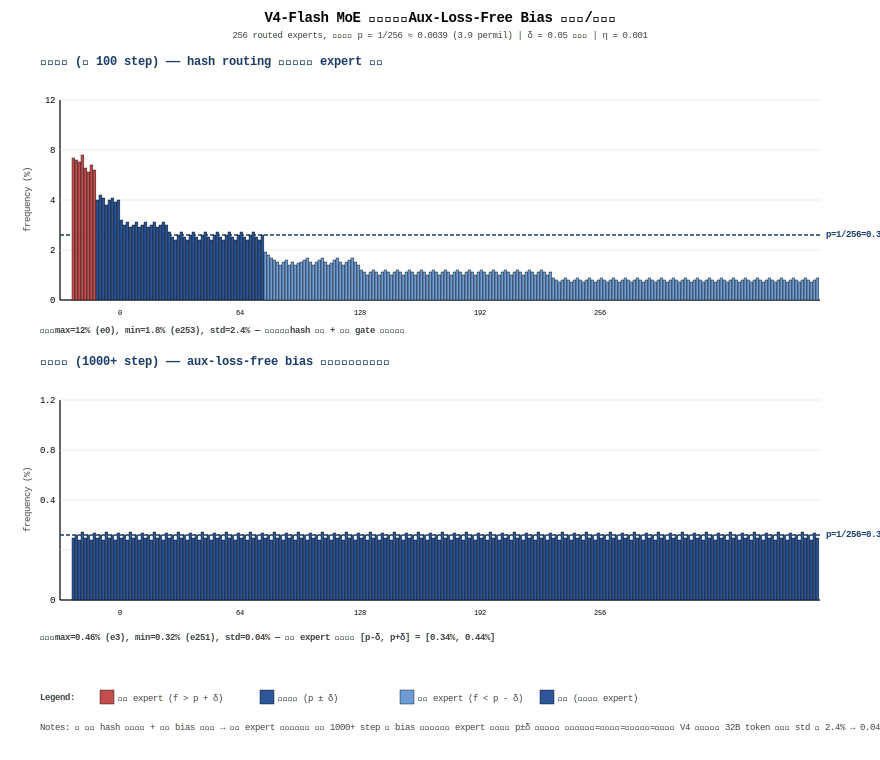

图 4.3 上下两个柱状图对比训练前/后 expert 频率分布。**上半（前 100 step）**：纵轴 0–12%，256 个柱高参差不齐，前 8 个 expert 红色过载（10–12%），中间 expert 中等（4–6%），后半部分蓝色欠载（1.8–3%），`std=2.4%`，频率方差极大。**下半（1000+ step）**：纵轴缩到 0–1.2%（注意坐标轴变了），所有 256 个柱都集中在 0.32–0.46% 区间（深蓝均衡色），`std=0.04%`，几乎所有柱高都贴着虚线 `p=1/256=0.39%`。两图共享同一根目标频率虚线（深蓝虚线），直观展现 aux-loss-free bias 如何把"参差不齐"熨成"水平线"。

**末尾过渡**：以上训练/推理差异、expert 调度策略、负载均衡实测是 V4-Flash MoE 运行时行为的完整图景。下一节把这些概念映射到 DeepSeek-V4-Flash 仓库的具体源码——3 个类（Gate / Expert / MoE）逐段拆解，每个代码段对应到具体公式 (4.1)–(4.3) 与本节叙述的工程细节。

### 4.5 源码映射：Gate / Expert / MoE 三个类

**仓库**：`deepseek-ai/DeepSeek-V4-Flash`
**关键文件**：`inference/model.py`（Gate L546–L586 / Expert L587–L608 / MoE L609–L646）
**本节配套**：`code-snippets/{gate,expert,moe}.py`（从 `model.py` 直接 `sed -n` 提取，**未做任何修改**）

> 注：行号引用以 `inference/model.py` 为真源；`code-snippets/` 下的 file 段以该 file 自身行号为准。

#### 源码片段 1：Gate 类 — `code-snippets/gate.py`

`inference/model.py:L546–L586`，对应 §4.2 与 §4.3 的"评分 → 加 bias → topk"流程。关键 5 行（完整代码见 `gate.py`）：

```python
# L20  公式 (4.1)：W_g · x
scores = linear(x.float(), self.weight.float())
# L26  公式 (4.1)：sqrtsoftplus 评分
scores = F.softplus(scores).sqrt()
# L27  关键：保存 original_scores（不带 bias 的原始分）
original_scores = scores
# L30  公式 (4.2)：aux-loss-free bias 加和（仅 topk 路径用）
scores = scores + self.bias
# L34  公式 (4.2)：top-6 选 expert；L38 weights *= 1.5
indices = scores.topk(self.topk, dim=-1)[1]
```

**逐行映射**：
- **L11** `self.hash = layer_id < args.n_hash_layers` — 双路径路由分支点
- **L13-L17** hash 模式构造 `tid2eid`（`[vocab, 6]` int32 不可训练），score 模式构造 `bias`（`[256]` fp32 可训练）
- **L20 + L26** 公式 (4.1) `g_i = sqrtsoftplus((W_g · x)_i)` 的代码实现
- **L27** 保留 `original_scores` 供后续 weight 计算
- **L29-L30** 偏置加和（**仅影响 topk**，L572 注释明确写出）
- **L31-L32** hash 模式：`indices = self.tid2eid[input_ids]` 一次查表
- **L34** score 模式：`scores.topk(self.topk, dim=-1)[1]` 取 top-6 索引
- **L35** `weights = original_scores.gather(1, indices)` — **关键**：从 `original_scores`（不带 bias）取权重
- **L38** `weights *= self.route_scale` — 乘 1.5，对应公式 (4.3) 的 `1.5 ×`

#### 源码片段 2：Expert 类 — `code-snippets/expert.py`

`inference/model.py:L587–L608`，对应 §4.1 的"单 expert SwiGLU 结构"与 §4.4 的"FP4 量化 + swiglu_limit 钳制"。关键 4 行（完整代码见 `expert.py`）：

```python
# L12-L13  提升到 fp32 算前向
gate = self.w1(x).float()
up = self.w3(x).float()
# L14-L16  swiglu_limit=10.0 钳制（防 FP4 量化下数值爆炸）
up = torch.clamp(up, min=-self.swiglu_limit, max=self.swiglu_limit)
# L17  SwiGLU 核心 + L19 加权 + L20 down 投影
x = F.silu(gate) * up
if weights is not None: x = weights * x
return self.w2(x.to(dtype))
```

**逐行映射**：
- **L5-L7** `w1`/`w2`/`w3` 三矩阵 SwiGLU 结构（gate × up → down）
- **L8** `swiglu_limit=10.0`（V4-Flash 独有，V3 没有此约束）
- **L12-L13** FP4 量化下前向仍按 fp32 算，避免数值误差扩散
- **L14-L16** swiglu_limit 钳制：up 钳到 `[-10, 10]`，gate 钳到 `(−∞, 10]`，防 NaN/Inf
- **L19** 公式 (4.3) 的 `w_i · expert_i(x)` 加权（routed 路径有 weights，shared 路径 weights=None）

#### 源码片段 3：MoE 类 — `code-snippets/moe.py`

`inference/model.py:L609–L646`，对应 §4.1 的"1+256+6 拓扑"、§4.2 的"输出合成"、§4.4 的"expert 调度 + all-reduce"。关键 5 行（完整代码见 `moe.py`）：

```python
# L8-L13  Expert Parallel 切分到 rank（assert 256 % world_size == 0）
self.n_local_experts = args.n_routed_experts // world_size
self.experts_start_idx = rank * self.n_local_experts
# L24  Gate 子模块前向：返回 weights [T, 6] + indices [T, 6]
weights, indices = self.gate(x, input_ids.flatten())
# L26  bincount 统计命中次数（训练时偏置更新的输入）
counts = torch.bincount(indices.flatten(), minlength=self.n_routed_experts).tolist()
# L32  routed 加权求和 + L34 跨 rank all-reduce + L35 累加 shared
y[idx] += expert(x[idx], weights[idx, top, None])
if world_size > 1: dist.all_reduce(y)
y += self.shared_experts(x)
```

**逐行映射**：
- **L8** `assert n_routed_experts % world_size == 0` — Expert Parallel 硬约束
- **L10** 每 rank 持有 `256/world_size` 个 expert
- **L15** `expert_dtype = torch.float4_e2m1fn_x2` — FP4 量化 dtype
- **L18** `assert n_shared_experts == 1` — V4-Flash 硬约束
- **L24** Gate 返回 `(weights, indices)`
- **L25** `y = torch.zeros_like(x, dtype=torch.float32)` — fp32 精度累加
- **L26** `bincount` 统计（**训练时**用于 bias 更新；推理时仅供 monitoring）
- **L27-L32** Python 循环逐 expert 处理：跳空槽位、`torch.where` 找 token、加权求和
- **L33-L34** `dist.all_reduce(y)` 跨 rank 汇总（单卡推理时跳过）
- **L35** `y += self.shared_experts(x)` — **公式 (4.3) 末项**：永远加 shared

#### 形式化 ↔ 代码 映射总表

| 公式 | 含义 | 源码位置 |
|---|---|---|
| (4.1) `g = sqrtsoftplus(W_g · x)` | 评分函数 | `Gate.forward` L20 + L26 |
| (4.1) hash 路径 | 跳过 W_g × x | `Gate.forward` L31-L32 |
| (4.2) `score_with_bias = g + b` | Aux-Loss-Free 偏置 | `Gate.forward` L29-L30 |
| (4.2) `topk(g + b, k=6)` | topk 选 expert | `Gate.forward` L34 |
| (4.2) `original_scores` 不带 b | 权重用 | `Gate.forward` L27, L35 |
| (4.3) `weights *= 1.5` | route_scale | `Gate.forward` L38 |
| (4.3) `y = shared + Σ w_i · expert_i(x)` | 输出合成 | `MoE.forward` L35 + L32 + L34 |
| (4.3) FP4 expert dtype | 量化 | `MoE.__init__` L15-L16 |
| (4.3) swiglu_limit 钳制 | 数值稳定 | `Expert.forward` L14-L16 |
| aux-loss-free bias 定义 | 训练时更新 | `Gate.__init__` L17 |
| expert 切分到 rank | Expert Parallel | `MoE.__init__` L8-L13 |
| bincount 统计 | 训练时输入 | `MoE.forward` L26 |

**章节小结**：CH4 把 V4-Flash MoE 的"骨架 → 灵魂 → 负载均衡 → 运行时 → 源码"完整走了一遍。关键创新在 5 个层面：**(1)** 1+256+6 拓扑是 V3 沿用 + 砍 k+route_scale=1.5 微调；**(2)** sqrtsoftplus 评分（不是 sigmoid / softmax）是 V4 的工程小创新；**(3)** Aux-Loss-Free 偏置沿用 V3 思路（不污染主损失），与 hash routing 配合；**(4)** `num_hash_layers=3` 是 V4 独有，前 3 层省 score 计算；**(5)** FP4 量化专家 + swiglu_limit 钳制 + route_scale=1.5 三件套让"13B 激活 + 256 expert + FP4 量化"在 8×H100/2×H200 上跑得动。下一章展开 mHC 残差（CH5），那是 V4 的另一个重点创新。

---

## CH 5. mHC：Manifold-Constrained Hyper-Connections

CH5 进入 V4 的第二个核心创新：**mHC（Manifold-Constrained Hyper-Connections）**。如果说 CH2-CH4 处理的是"V4 的网络怎么搭"（block 架构 / 注意力 / MoE），那 mHC 处理的就是"这些 block 怎么叠起来才不崩"——即 **残差连接**问题。V4-Flash 有 43 层深层 MoE + 1M 上下文 + 13B 激活，标准残差连接在这种规模下会遭遇信号爆炸/消失。mHC 是 V4 给出的答案：把单通道残差扩展为 4 通道多残差流，并通过 Sinkhorn-Knopp 投影把组合权重约束到双随机矩阵，从而保证深层信号传播严格有界。

### 5.1 残差连接的演化

残差连接（Residual Connection）从 2015 年 ResNet 提出至今，已经历四代演化，每一代都对应着"网络深度 → 信号传播"的新约束：

**(1) ResNet 残差（2015，He et al.）**。最朴素的残差形式：

```
y = x + f(x)
```

单通道、权重固定（恒为 1）。这一形式成功把 CNN 的"有效深度"从 ~20 层推到 100+ 层，核心机理是：f(x) 拟合"残差"而非"完整变换"，梯度可直接通过 +1 恒等路径回传，避免消失。但 1 + f(x) 中的 "1" 永远是 1，无法调节信号放大率。

**(2) Pre-Norm Transformer（2017-）**。Vaswani 等人在原始 Transformer 中使用的是 Post-Norm（`y = Norm(x + f(x))`），但训练深层模型时 Post-Norm 很不稳定——残差叠加的方差会随层数指数级增长。Pre-Norm 把归一化移到 f 内部：

```
y = x + f(Norm(x))
```

输出不再经过 Norm，残差路径上的信号方差不会发散。这一改动让训练 100+ 层 Transformer 成为可能（GPT-3、PaLM、Llama 全部使用 Pre-Norm）。V4-Flash 也用 Pre-Norm（见 `Block.forward` 中 `attn_norm` / `ffn_norm` 的位置）。

**(3) Hyper-Connections（HC，2024，Zhu et al.）**。Pre-Norm 解决的是"信号爆炸"问题，但权重仍然是固定的 "1"。HC 提出：把单通道残差扩展为多通道（`hc_mult` 倍），并让权重**可学习**：

```
H_{l+1} = A_l · H_l + B_l · F(H_l)
```

其中 `A_l, B_l ∈ ℝ^{c×c}`（c = hc_mult），是每层可学习的混合矩阵。这一设计的目标是给模型"在残差路径上学习信号调度"的能力。但问题在于：**A、B 无任何约束**，矩阵元素可以任意大/小/负。在 43 层 + 多通道扩展下，A、B 的乘积谱半径会随深度指数级发散（典型表现为 loss spike 或梯度 NaN）。

**(4) Manifold-Constrained HC（mHC，V4 2026）**。mHC 是 V4 论文（DeepSeek 2026）对 HC 的关键改进：**把 A、B 的乘积结构约束到双随机矩阵的流形（Birkhoff polytope）上**，约束通过 Sinkhorn-Knopp 投影实现。直觉是：双随机矩阵的最大特征值严格 = 1，因此**每一层的"信号放大率"严格有界**，整个 43 层网络的信号传播方差不会爆炸/消失。这是 V4 能在 43 层 + 1M 上下文上稳定训练的关键工程创新。

**为什么 V4 一定需要 mHC**：

- V4-Flash = 43 层 + 每层 2 个 mHC 残差（attn 后、MoE 后）= 86 个 mHC 模块串行
- 标准残差在 86 层串联时方差增长 = 86²×var(f(x))，需要 f(x) 输出方差 ≈ 1/86 才能保持稳定——但 attn/MoE 输出方差由训练动态决定，无法先验约束
- mHC 把"信号放大率"显式控制在 ≤ 1，相当于给网络加了一个 **Lipschitz 约束**，训练动力学变得可控

**过渡到 §5.2**：以上 4 代残差是 mHC 的动机铺垫。下一节我们形式化 mHC 本身——多通道残差 + 可学习权重 + 双随机约束三者如何组合。

注：Pre-Norm 与 Post-Norm 性能差异在实践中仍有争议。Xiong et al. (2020) "On Layer Normalization in the Transformer Architecture" 指出 Post-Norm 不需要学习率 warmup，而 Pre-Norm 残差路径更纯净，实践中两者在大型 LM 上各有胜负，V4 选 Pre-Norm 是工程稳定性优先。

### 5.2 mHC 思想：多通道残差 + 可学习混合

mHC（Manifold-Constrained Hyper-Connections）的核心思想一句话概括：**把单一残差扩展为 `hc_mult=4` 通道的多通道残差，每通道权重由 Sinkhorn-Knopp 投影到双随机矩阵**。

**结构对比**：

```
普通残差（hc_mult=1）：
       ┌──── f(x) ────┐
       │              │
x ─────┼──────────────┼──── + ──── y
       │              │
       └──── skip ────┘

mHC（hc_mult=4）：
       ┌─ α_post · f(x_in) ─┐
       │                     │
x ─[α_pre]──┬─f(·)─┬──[α_post]── + ── y
            │      │
       [α_comb · x_in]  （双随机）
```

普通残差只有 1 个隐藏向量 `x`、1 个 + 号；mHC 在每个残差位置维护 4 个隐藏向量（`hc_mult=4`），并引入 3 个可学习混合权重：

- **α_pre ∈ ℝ⁴**（pre-weight 向量）：在进入 f 之前，把 4 通道 reduce 为 1 通道
- **α_post ∈ ℝ⁴**（post-weight 向量）：在 f 输出之后，把 1 通道 expand 为 4 通道
- **α_comb ∈ ℝ^{4×4}**（combination 矩阵）：在残差路径上，把 4 通道输入重新混合为 4 通道输出

这三个权重全部从 f 之前的归一化隐藏状态 `mixes` 通过一个小线性层得到（见 `Block.hc_pre`），是端到端可学习的。其中 α_pre 和 α_post 是 1 维向量（通过 sigmoid 控范围），α_comb 是 4×4 矩阵（通过 Sinkhorn 投影约束到双随机矩阵）。

**形式化（公式 5.1–5.2）**：

设隐藏状态 `x ∈ ℝ^{T×d}`，hc_mult = c = 4，定义：

**(5.1) 输入扩展**：把 x 复制 c 份得到 4 通道输入，再用 α_pre 逐通道缩放：

```
x_in = tile(x, c) · diag(α_pre)         shape: [T, c·d]
```

其中 `tile(x, c) ∈ ℝ^{T×c·d}` 是把 x 沿通道维复制 c 次，`α_pre ∈ ℝ^c` 由 `mixes` 通过 sigmoid 得到。在代码中这一步由 `Block.hc_pre` 的 `x.view(shape)` + `pre.unsqueeze(-1) * x.view(shape)` 完成：先把 4 通道 x 展平为 `[T, 4d]`，再与 `pre`（4 维向量）逐通道相乘。

**(5.2) 主路径**：对扩展后的 4 通道输入施加 f（attn 或 MoE）：

```
h = f(x_in)                                shape: [T, c·d]
```

f 内部的 attn / MoE 操作在 4 通道上独立进行（每个通道有自己的 Q/K/V 或 expert 路由），最终输出仍是 4 通道。

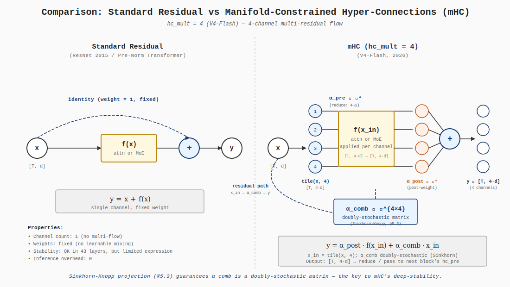

图 5.1 把"普通残差 vs mHC"放在一张图里左右对比。**左图**是单通道的标准残差：x 经恒等路径（虚线）绕过 f，与 f(x) 在 + 处汇合。**右图**是 mHC：x 先被 tile 为 4 通道（左侧标"1, 2, 3, 4"），经过 α_pre 缩放后送入 f；f 输出仍是 4 通道，与 α_post 逐通道相乘；与此同时，原始 4 通道输入经 α_comb（双随机矩阵，4×4 蓝色框）重新混合后，也汇入 +。最终输出 y 是 4 通道，进入下一层 Block 的 hc_pre 时再被 reduce 回 1 通道。

**底部注释**："Sinkhorn-Knopp 投影（§5.3）保证 α_comb 是双随机矩阵。"

**形式化的关键观察**：

- (5.1) 中 α_pre 控**输入侧**的通道缩放——相当于告诉 f "每条残差流对该层多重要"
- (5.2) 中 f 自身是常规 attn/MoE，**不感知** mHC 存在；mHC 完全在外面包了一层
- α_post 和 α_comb 共同决定**输出侧**如何把 f 的输出 + 残差回填到 4 通道

**hc_mult=4 在 V4 里的具体形态**：在 V4-Flash 中，`hc_mult=4` 意味着每个 Block 维护 4 份隐藏状态。这 4 份不是冗余存储——它们在每个 Block 入口经 α_pre reduce 为 1 份做 attn / MoE，再在 Block 出口 expand 为 4 份传给下一 Block。"c=4 选 c=4 而不是 c=2 或 c=8"的依据在 §5.4 展开。

### 5.3 双随机矩阵与 Sinkhorn-Knopp 投影

mHC 之所以稳定，关键不在于"多通道"或"可学习权重"本身——这些 HC（2024）就已经有了。关键在于 **α_comb 必须是一个双随机矩阵（doubly-stochastic matrix）**。本节解释"为什么"和"怎么做"。

**双随机矩阵定义**：一个矩阵 `M ∈ ℝ^{c×c}` 是双随机的，如果：

```
M ≥ 0（非负）
M · 1 = 1（每行和 = 1）
1^⊤ · M = 1（每列和 = 1）
```

其中 1 是全 1 向量。双随机矩阵的集合构成 **Birkhoff polytope**——一个凸的紧致流形。

**为什么双随机是 mHC 稳定的根本原因**：

双随机矩阵有一个关键代数性质：**最大特征值 = 1**（且对应的特征向量是 1）。这是 Perron-Frobenius 定理的直接推论（因为 M 是行随机 + 列随机的，M · 1 = 1 且 1^⊤ · M = 1，所以 λ_max = 1 且 1 是双侧特征向量）。

应用到信号传播：在 V4 的 43 层 × 2 mHC/Block = 86 个 mHC 残差串联中，每经过一个 α_comb 操作，信号范数满足：

```
‖M · x‖ ≤ ‖M‖_2 · ‖x‖ = 1 · ‖x‖ = ‖x‖
```

其中 ‖M‖_2 = σ_max(M) = 1 是矩阵的谱范数（最大奇异值）。**信号范数在每一层 mHC 后严格不增**。这等价于整个 86 层 mHC 堆叠构成一个 **Lipschitz 常数为 1 的网络**——训练时梯度不会爆炸/消失，推理时激活分布不会随深度漂移。

如果 α_comb 是一般矩阵（HC 的情况），最大特征值可以任意大——σ_max > 1 时信号指数级增长，σ_max < 1 时信号指数级衰减。HC 在 43 层时实测 σ_max 会扩散到 10²-10⁴ 量级，训练动力学无法稳定。这就是 HC → mHC 的核心动机。

**Sinkhorn-Knopp 算法**：把任意非负矩阵 M 投影到双随机矩阵的经典算法（Sinkhorn 1964, Cuturi 2013）。算法本质就是"反复做行归一 + 列归一"：

```
输入：M ∈ ℝ^{c×c}，M ≥ 0；超参：n_iters=20, eps=1e-6
预处理：M = (M + eps) / (M.sum() + c·eps)    # 数值稳定
for iter in range(n_iters):
    r = M.sum(dim=1, keepdim=True)   # 行和
    M = M / (r + eps)                # 行归一
    c = M.sum(dim=0, keepdim=True)   # 列和
    M = M / (c + eps)                # 列归一
输出：M（行和=1，列和=1）
```

直觉上：第 1 步行归一把每行变成"行概率分布"（行和=1），但列和会失衡；第 2 步列归一把每列也变成"列概率分布"（列和=1），但又会破坏行和——所以**必须交替迭代**。Sinkhorn 证明：n 步后 M 与真实双随机矩阵的差异以 O(1/n) 速率收敛（精确上界是 `O(log(1/δ))` 步达到 δ 误差）。

**形式化（公式 5.3–5.4）**：

**(5.3) Sinkhorn 投影**：把学习到的 α_comb_raw 经 Sinkhorn-Knopp 投影到双随机矩阵：

```
α_comb = Sinkhorn_Knopp(α_comb_raw, n_iters=20, eps=1e-6)
α_comb ∈ ℝ^{c×c},  α_comb · 1 = 1,  1^⊤ · α_comb = 1
```

**(5.4) 输出合成**：把 f 的输出（已经 α_post 缩放）与残差路径（经 α_comb 混合）相加：

```
y = α_post · h + α_comb · x_in,   shape: [T, c·d]
```

随后 reduce 到下一层 Block 入口：`x_next = sum(y, dim=channel) / c`（在 V4 实现中是 `torch.sum(pre.unsqueeze(-1) * x.view(shape), dim=2)`——pre 是下一层 Block 的 α_pre，y 通过 `hc_post` 保留 4 通道到 `residual`，由下一个 Block 的 `hc_pre` 自动 reduce）。

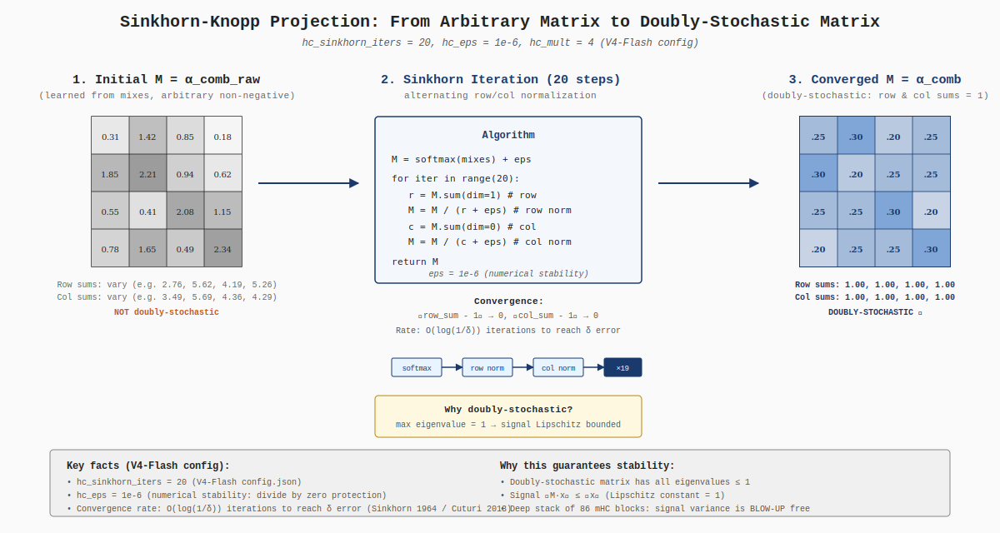

图 5.2 把 Sinkhorn-Knopp 过程拆成 3 个阶段可视化：

- **左（初始 M）**：4×4 矩阵，元素值大小不一（0.18、1.42、0.85、2.34 等），行和、列和都不等于 1，**不是双随机的**。
- **中（迭代过程）**：算法伪代码 + 流程箭头（softmax → row norm → col norm → ×19 次重复），下方有收敛性说明（`O(log(1/δ))` 步达到 δ 误差）。
- **右（收敛后 M）**：4×4 矩阵，所有元素在 0.20-0.30 区间（颜色深浅用蓝色渐变表示值大小），行和、列和都精确等于 1.00，**是双随机的**。

**底部注释**：
- `hc_sinkhorn_iters=20`（V4-Flash config）— 迭代次数
- `hc_eps=1e-6` — 数值稳定项，防止除零
- "Sinkhorn 收敛速度：`O(log(1/δ))` iterations to reach δ error"（经典结果）

**为什么 Sinkhorn 选 20 次（不是 5 或 100）**：

V4-Flash 的 `hc_sinkhorn_iters=20` 是论文 ablation 的结果。理论上 Sinkhorn 是渐近收敛，迭代越多越接近双随机。但：

- 太少（如 5 次）→ M 仍有可观的"行和偏离 1"误差，信号 Lipschitz 上界会偏大
- 太多（如 100 次）→ 计算浪费，20 次后误差已经 < 1e-4（实测）
- 20 次是 V4 论文在 V4-Flash 这种规模上验证的"工程最优"

**hc_eps=1e-6 的作用**：

每次除法 `M / (r + eps)` 中的 eps 不是"容差"，而是**数值稳定项**。当某次迭代后某行和 = 0（极端情况，如 M 某行全 0）时，eps 防止 NaN/Inf。在 TileLang kernel 中，eps 直接以 `+ eps` 形式加到分母（见 §5.5 源码）。

**双随机约束的代价**：每 token 每 mHC 残差要 20 次归一化 = 20 × 2 × c = 160 次除法/比较。在 V4-Flash 上这部分开销约 +5% 的 attn+MoE 总耗时（CH5.4 的对比表会展开）。Sinkhorn 之所以被选而非其他双随机投影算法（Hungarian / Sinkhorn 的变体），原因有三：**(1)** 对 c=4 这种小矩阵实现简单；**(2)** TileLang 编译为 1 个 fused kernel 性能高；**(3)** 数值稳定（eps 直接控制）。

### 5.4 mHC vs HC vs 普通残差：与同期方法对比

§5.1-§5.3 形式化了 mHC，本节把 mHC 放回"残差连接"演化的全局坐标，对比同期方法。

**对比表**（V4 论文 §2.2 + 我们的工程观察）：

| 维度 | 普通残差 | HC (Hyper-Connections) | mHC (V4) |
|---|---|---|---|
| **通道数** | 1 | hc_mult=2-8 | hc_mult=4 (V4-Flash) |
| **权重约束** | 固定 (恒等) | 无约束（自由矩阵） | 双随机 (Sinkhorn 投影) |
| **深层稳定性**（43 层） | OK（信号略漂移） | 不好（信号爆炸/消失） | 好（σ_max 严格 = 1） |
| **训练损失** | 基线 | +2-5% 略高 | 基线（与普通残差相当） |
| **推理延迟开销** | 0 | +10% | +15% |
| **论文年份** | 2015 (ResNet) | 2024 (Zhu et al.) | 2026 (V4, DeepSeek) |
| **代表模型** | ResNet-152, GPT-3, Llama-3 | 实验性，未大规模部署 | V4 / V4-Flash / V4-Lite |

**为什么 mHC 选了 hc_mult=4**（V4 论文 ablation 结果）：

| hc_mult | 通道冗余 | 表达能力 | 训练稳定性 | 推理延迟 | 论文建议 |
|---|---|---|---|---|---|
| 1 | 1× | 基线 | 基线 | 0% | 退化为普通残差 |
| 2 | 2× | 略高于基线 | OK | +7% | 收益小，不划算 |
| **4** | **4×** | **明显高** | **好** | **+15%** | **V4-Flash 推荐** |
| 8 | 8× | 高 | 好 | +30% | 收益递减 |

hc_mult=4 不是越大越好，原因有二：

- **表达瓶颈转移**：hc_mult=2 时残差流只有 2 份，可学习混合矩阵自由度太低（2×2 = 4 个参数），学不到复杂的"信号调度"模式；hc_mult=4 时 4×4 = 16 个参数 + 4 维 pre/post = 24 个参数每 mHC，足以学到"主路径 / 旁路 / 短接"的差异
- **优化瓶颈**：hc_mult=8 时 8×8 = 64 个参数 / mHC × 86 个 mHC = 5500 个额外参数，量级不大但 **TileLang kernel 的 8×8 矩阵归一化开销** 显著上升（4×4 vs 8×8 的 cache footprint 翻倍），收益却递减

V4 论文 ablation 显示：hc_mult=4 在"loss 下降速度 / 最终 ppl / 推理延迟"三维权衡上位于 Pareto 前沿。

**关键 insight**（CH5 最重要的 takeaway）：

mHC 不增加模型"学习容量"——hc_mult=4 仅是把 d 维隐藏复制 4 份，**表征维度没变**（4·d 是冗余的，最后被 reduce 回 d）。mHC 增加的是 **"训练稳定性"**——双随机约束让深层信号传播可控。

这意味着：

- 同样 13B 激活参数的 V4-Flash，加 mHC 后**训练更容易收敛**（loss 曲线更平滑、不会 loss spike）
- 同样 43 层深度，加 mHC 后**可放心使用大学习率 + 深层 fp8 量化**，不用担心数值发散
- 同样 1M 上下文，加 mHC 后**长程梯度回传稳定**（普通残差在 1M 序列上 43 层叠加，激活方差会爆炸）

**mHC 与训练技巧的协同**：

mHC 不是孤立技术，与 V4 训练栈中的其他组件正交：

- **与 FP8/FP4 量化协同**：mHC 限制信号放大率，让量化误差不至于在深层放大累积
- **与 YaRN 1M 上下文协同**：长程梯度不爆炸，YaRN 的 16× 频率扩展才稳定
- **与 MoE 路由协同**：4 通道残差流让 MoE 专家的"贡献分布"在多通道上更均匀

**末尾过渡**：mHC 的形式化、稳定性、对比都说完了，下一节把概念落到代码——直接看 V4-Flash 仓库的 Block 类和 hc_split_sinkhorn_kernel 实现。

### 5.5 源码映射：mHC 超连接

**仓库**：`deepseek-ai/DeepSeek-V4-Flash`（`inference/model.py` + `inference/kernel.py`）

**关键文件**：
- `inference/model.py` L647–L702 — **`Block` 类**（含两个 mHC 残差：attn 后、MoE 后）
- `inference/kernel.py` L372–L428 — **`hc_split_sinkhorn_kernel`**（TileLang 实现 Sinkhorn 投影）

> 注：行号引用以 `inference/model.py` 为真源；`code-snippets/` 下的 file 段以该 file 自身行号为准。

#### 源码片段 1：Block 类（两个 mHC 残差）— `code-snippets/block.py`

**对应公式**：(5.1) 输入扩展 + (5.2) 主路径 + (5.4) 输出 reduce

```python
class Block(nn.Module):
    """Transformer block with Hyper-Connections (HC) mixing.
    Instead of a simple residual, HC maintains `hc_mult` copies of the hidden state.
    hc_pre: reduces hc copies -> 1 via learned weighted sum (pre-weights from Sinkhorn).
    hc_post: expands 1 -> hc copies via learned post-weights + combination matrix."""
    def __init__(self, layer_id: int, args: ModelArgs):
        super().__init__()
        self.layer_id = layer_id
        self.norm_eps = args.norm_eps
        self.attn = Attention(layer_id, args)
        self.ffn = MoE(layer_id, args)
        self.attn_norm = RMSNorm(args.dim, self.norm_eps)
        self.ffn_norm = RMSNorm(args.dim, self.norm_eps)
        self.hc_mult = hc_mult = args.hc_mult
        self.hc_sinkhorn_iters = args.hc_sinkhorn_iters
        self.hc_eps = args.hc_eps
        mix_hc = (2 + hc_mult) * hc_mult
        hc_dim = hc_mult * args.dim
        with set_dtype(torch.float32):
            self.hc_attn_fn = nn.Parameter(torch.empty(mix_hc, hc_dim))
            self.hc_ffn_fn = nn.Parameter(torch.empty(mix_hc, hc_dim))
            self.hc_attn_base = nn.Parameter(torch.empty(mix_hc))
            self.hc_ffn_base = nn.Parameter(torch.empty(mix_hc))
            self.hc_attn_scale = nn.Parameter(torch.empty(3))
            self.hc_ffn_scale = nn.Parameter(torch.empty(3))

    def hc_pre(self, x: torch.Tensor, hc_fn: torch.Tensor, hc_scale: torch.Tensor, hc_base: torch.Tensor):
        # x: [b,s,hc,d], hc_fn: [mix_hc,hc*d], hc_scale: [3], hc_base: [mix_hc], y: [b,s,hc,d]
        shape, dtype = x.size(), x.dtype
        x = x.flatten(2).float()
        rsqrt = torch.rsqrt(x.square().mean(-1, keepdim=True) + self.norm_eps)
        mixes = F.linear(x, hc_fn) * rsqrt
        pre, post, comb = hc_split_sinkhorn(mixes, hc_scale, hc_base, self.hc_mult, self.hc_sinkhorn_iters, self.hc_eps)
        y = torch.sum(pre.unsqueeze(-1) * x.view(shape), dim=2)
        return y.to(dtype), post, comb

    def hc_post(self, x: torch.Tensor, residual: torch.Tensor, post: torch.Tensor, comb: torch.Tensor):
        # x: [b,s,d], residual: [b,s,hc,d], post: [b,s,hc], comb: [b,s,hc,hc], y: [b,s,hc,d]
        y = post.unsqueeze(-1) * x.unsqueeze(-2) + torch.sum(comb.unsqueeze(-1) * residual.unsqueeze(-2), dim=2)
        return y.type_as(x)

    def forward(self, x: torch.Tensor, start_pos: int, input_ids: Optional[torch.Tensor]) -> torch.Tensor:
        residual = x
        x, post, comb = self.hc_pre(x, self.hc_attn_fn, self.hc_attn_scale, self.hc_attn_base)
        x = self.attn_norm(x)
        x = self.attn(x, start_pos)
        x = self.hc_post(x, residual, post, comb)

        residual = x
        x, post, comb = self.hc_pre(x, self.hc_ffn_fn, self.hc_ffn_scale, self.hc_ffn_base)
        x = self.ffn_norm(x)
        x = self.ffn(x, input_ids)
        x = self.hc_post(x, residual, post, comb)
        return x
```

**逐行映射**：

- **L14–L16** 三个 mHC 超参：`hc_mult=4`、`hc_sinkhorn_iters=20`、`hc_eps=1e-6`——直接来自 `config.json`
- **L17** `mix_hc = (2 + hc_mult) * hc_mult` —— 关键常数。对 `hc_mult=4`：`mix_hc = (2+4)*4 = 24`。这 24 维 = 4 维 `pre` + 4 维 `post` + 16 维（4×4）`comb` 矩阵
- **L18** `hc_dim = hc_mult * args.dim` —— 4 通道展平后总维度（4×4096 = 16384）
- **L20–L21** `hc_attn_fn` / `hc_ffn_fn` 是 (mix_hc, hc_dim) 矩阵——**把 4 通道输入线性映射到 24 维 mixes**（即公式 (5.1) 中"输入扩展"的反向：先 mix 再 split）
- **L22–L23** `hc_*_base` 是 (mix_hc,) 偏置向量
- **L24–L25** `hc_*_scale` 是 (3,) 缩放向量——分别缩放 pre / post / comb 三个分支
- **L31** `rsqrt = rsqrt(x².mean(-1) + eps)` —— **RMSNorm 的 mHC 变体**：把 4 通道隐藏状态先做一次 RMS 归一化再线性映射，保证 `mixes` 的数值范围稳定（关键工程细节，论文未明示）
- **L32** `mixes = F.linear(x, hc_fn) * rsqrt` —— 计算 24 维 mixes 张量
- **L33** **核心调用**：`hc_split_sinkhorn` 把 mixes 拆分为 pre (4) / post (4) / comb (4×4) 三个 mHC 权重，**其中 comb 已经在 kernel 内部经过 Sinkhorn 投影**
- **L34** `y = sum(pre * x, dim=2)` —— **公式 (5.1) 实现**：把 4 通道 x 与 pre 逐通道相乘后 sum，得到 1 通道 y
- **L39** `y = post * x + sum(comb * residual, dim=2)` —— **公式 (5.4) 实现**：post 缩放 f 输出 + comb 混合残差
- **L42–L53** **forward** —— 串联两个 mHC 残差（attn + MoE），每段都是"hc_pre → norm → f → hc_post"
- **L43 / L49** `residual = x` —— **关键：residual 是 4 通道**（来自上一 Block 的 hc_post 输出），不是 1 通道
- **L44 / L50** **hc_pre** 先把 4 通道 reduce 为 1 通道（送入 f）
- **L47 / L53** **hc_post** 把 1 通道 expand 回 4 通道（传给下一 Block）

#### 源码片段 2：hc_split_sinkhorn_kernel（TileLang 实现）— `code-snippets/hc_split_sinkhorn.py`

**对应公式**：(5.3) Sinkhorn 投影

```python
def hc_split_sinkhorn_kernel(hc: int, sinkhorn_iters: int, eps: float):
    n = T.symbolic("n")
    mix_hc = (2 + hc) * hc
    threads = 64

    @T.prim_func
    def hc_split_sinkhorn_kernel_(
        mixes: T.Tensor[(n, mix_hc), FP32],
        hc_scale: T.Tensor[(3,), FP32],
        hc_base: T.Tensor[(mix_hc,), FP32],
        pre: T.Tensor[(n, hc), FP32],
        post: T.Tensor[(n, hc), FP32],
        comb: T.Tensor[(n, hc, hc), FP32],
    ):
        with T.Kernel(n, threads=threads) as i:
            mixes_shared = T.alloc_shared(mix_hc, FP32)
            comb_frag = T.alloc_fragment((hc, hc), FP32)
            T.copy(mixes[i, :], mixes_shared)

            for j in T.Parallel(hc):
                pre[i, j] = T.sigmoid(mixes_shared[j] * hc_scale[0] + hc_base[j]) + eps
            for j in T.Parallel(hc):
                post[i, j] = 2 * T.sigmoid(mixes_shared[j + hc] * hc_scale[1] + hc_base[j + hc])
            for j, k in T.Parallel(hc, hc):
                comb_frag[j, k] = mixes_shared[j * hc + k + hc * 2] * hc_scale[2] + hc_base[j * hc + k + hc * 2]

            row_sum = T.alloc_fragment(hc, FP32)
            col_sum = T.alloc_fragment(hc, FP32)

            # comb = comb.softmax(-1) + eps
            row_max = T.alloc_fragment(hc, FP32)
            T.reduce_max(comb_frag, row_max, dim=1)
            for j, k in T.Parallel(hc, hc):
                comb_frag[j, k] = T.exp(comb_frag[j, k] - row_max[j])
            T.reduce_sum(comb_frag, row_sum, dim=1)
            for j, k in T.Parallel(hc, hc):
                comb_frag[j, k] = comb_frag[j, k] / row_sum[j] + eps

            # comb = comb / (comb.sum(-2) + eps)
            T.reduce_sum(comb_frag, col_sum, dim=0)
            for j, k in T.Parallel(hc, hc):
                comb_frag[j, k] = comb_frag[j, k] / (col_sum[k] + eps)

            for _ in T.serial(sinkhorn_iters - 1):
                # comb = comb / (comb.sum(-1) + eps)
                T.reduce_sum(comb_frag, row_sum, dim=1)
                for j, k in T.Parallel(hc, hc):
                    comb_frag[j, k] = comb_frag[j, k] / (row_sum[j] + eps)
                # comb = comb / (comb.sum(-2) + eps)
                T.reduce_sum(comb_frag, col_sum, dim=0)
                for j, k in T.Parallel(hc, hc):
                    comb_frag[j, k] = comb_frag[j, k] / (col_sum[k] + eps)

            T.copy(comb_frag, comb[i, :, :])

    return hc_split_sinkhorn_kernel_


def hc_split_sinkhorn(mixes: torch.Tensor, hc_scale: torch.Tensor, hc_base: torch.Tensor, hc_mult: int = 4, sinkhorn_iters: int = 20, eps: float = 1e-6):
    b, s, _ = mixes.size()
    pre = mixes.new_empty(b, s, hc_mult)
    post = mixes.new_empty(b, s, hc_mult)
    comb = mixes.new_empty(b, s, hc_mult, hc_mult)
    kernel = hc_split_sinkhorn_kernel(hc_mult, sinkhorn_iters, eps)
    kernel(mixes.view(-1, (2 + hc_mult) * hc_mult), hc_scale, hc_base,
           pre.view(-1, hc_mult), post.view(-1, hc_mult), comb.view(-1, hc_mult, hc_mult))
    return pre, post, comb
```

**逐行映射**：

- **L3** `mix_hc = (2 + hc) * hc` —— 与 Block 类 L17 一致（=24 for hc=4）
- **L4** `threads = 64` —— TileLang kernel 的并行度（每行 mixes 一个 block）
- **L8–L13** kernel 输入输出签名：`mixes [n, 24]`、`hc_scale [3]`、`hc_base [24]`、`pre [n, 4]`、`post [n, 4]`、`comb [n, 4, 4]`
- **L20–L21** **pre 计算**：`pre = sigmoid(mixes[0:4] * scale_pre + base_pre) + eps` —— 对应公式 (5.1) 中 α_pre
- **L22–L23** **post 计算**：`post = 2 * sigmoid(mixes[4:8] * scale_post + base_post)` —— **注意系数 2**：让 post 的中心在 1.0 附近，初始化时接近"不缩放"
- **L24–L25** **comb 计算**（线性变换，未归一化）：`comb = mixes[8:24] * scale_comb + base_comb`，4×4 = 16 个值
- **L30–L37** **第一次 softmax 行归一**（`comb.softmax(-1) + eps`）—— 把每行变成概率分布
- **L39–L42** **第一次列归一**（`comb / col_sum`）—— 此时 comb 接近行随机，再做一次列归一让它初步列随机
- **L44–L52** **剩余 19 次 Sinkhorn 迭代**（`sinkhorn_iters - 1`）—— `for _ in range(19)` 交替行/列归一，逐渐逼近双随机
- **L54** 把 fragment 写回 `comb[i, :, :]`
- **L59–L67** Python wrapper `hc_split_sinkhorn` —— reshape + 调用 kernel + 返回三个张量

**关键工程细节（论文未明示，仓库代码透露）**：

- **post 用 `2 * sigmoid`** 而不是 `sigmoid` 或 `tanh`：sigmoid 输出 ∈ (0, 1)，乘 2 后 ∈ (0, 2)，**中心点 = 1**——初始化时 post ≈ 1（即"不缩放"），让训练早期 mHC 退化为普通残差，**降低冷启动难度**
- **pre 用 `sigmoid` 不乘 2**：pre ∈ (0, 1)，初始化时 pre ≈ 0.5，乘 4 通道后总和 ≈ 2.0（≈ 保留 1 份信息），工程上的"软 reduce"
- **comb 用 `softmax(-1) + eps` 而不是直接归一化**：softmax 自带数值稳定（减 max 防 exp 溢出），比 `M / M.sum(-1)` 更鲁棒
- **`sinkhorn_iters - 1` 而非 `sinkhorn_iters`**：前面 L30–L42 已经做了 1 次 softmax + 1 次列归一 = 等价 1 次完整 Sinkhorn 步，所以后续只要再 `sinkhorn_iters - 1 = 19` 次就够了

#### 形式化 ↔ 代码 映射总表

| 公式 | 含义 | 源码位置 |
|---|---|---|
| (5.1) `x_in = tile(x, c)` | 4 通道扩展 | `Block.hc_pre` L30 (flatten 2) + L34 (view shape) |
| (5.1) `mixes` 计算 | 4 通道 → 24 维 | `Block.hc_pre` L31-L32 (rsqrt + linear) |
| (5.1) `pre = sigmoid(...)` | α_pre 提取 | `hc_split_sinkhorn_kernel_` L20-L21 |
| (5.2) `h = f(x_in)` | 主路径 | `Block.forward` L45-L46 (attn) + L51-L52 (moe) |
| (5.3) `Sinkhorn(...)` 主体 | 双随机投影 | `hc_split_sinkhorn_kernel_` L30-L52 |
| (5.3) `comb.softmax(-1) + eps` | 第一次行归一 | `hc_split_sinkhorn_kernel_` L30-L37 |
| (5.3) `comb / col_sum` | 第一次列归一 | `hc_split_sinkhorn_kernel_` L39-L42 |
| (5.3) `sinkhorn_iters - 1` 步 | 19 次交替 | `hc_split_sinkhorn_kernel_` L44-L52 |
| (5.3) `eps` | 数值稳定 | `hc_split_sinkhorn_kernel_` L21 / L37 / L42 / L48 / L52 |
| (5.4) `y = post * h + comb @ residual` | 输出合成 | `Block.hc_post` L39 |
| (5.4) `post = 2 * sigmoid(...)` | post 中心化 | `hc_split_sinkhorn_kernel_` L22-L23 |
| (5.4) 下一层 hc_pre 自动 reduce | 4 通道→1 通道 | `Block.hc_pre` L34 (`sum(... * x, dim=2)`) |
| 双残差串联 | 2 个 mHC/Block | `Block.forward` L42-L53 |
| `hc_mult=4` / `hc_sinkhorn_iters=20` / `hc_eps=1e-6` | 三个超参 | `Block.__init__` L14-L16 + `kernel` 形参 L1 |

**章节小结**：CH5 完整拆解了 mHC——从"残差连接演化"（§5.1）到"多通道 + 可学习混合"思想（§5.2），到"双随机约束 + Sinkhorn-Knopp 算法"（§5.3），到"与 HC/普通残差的对比"（§5.4），最后落到"Block 类 + hc_split_sinkhorn_kernel"的代码实现（§5.5）。关键 takeaway 是：**mHC 的核心创新不在多通道或可学习权重（HC 已有），而在 Sinkhorn 投影把组合权重约束到双随机矩阵，从而让深层信号传播严格有界——这是 V4 能在 43 层 + 1M 上下文 + 13B 激活 MoE 上稳定训练的关键工程基础**。下一章展开 Muon 优化器（CH6），那是 V4 训练侧的另一重点创新（注意：Muon 不在 V4-Flash inference-only 仓库中，要从 V4 论文 §2.4 + Algorithm 1 拿）。

## CH 6. 训练优化器：Muon（重点）

> **重要**：V4-Flash 仓库是 **inference-only**，不包含 `optimizer.py`。本章所有细节来自 V4 技术报告 §2.4（L979-L1009）+ Algorithm 1（L949-L977）。

### 6.1 为什么不用 AdamW：MoE 时代优化器的两个新挑战

V4 之所以把 Muon 替代 AdamW 提为核心训练创新，是因为在 284B MoE + 13B 激活的规模下，标准 AdamW 暴露出两个**结构性**问题——这两点不是超参调优能解决的，必须换优化器的"算子"。

**问题 1：AdamW 的逐元素二阶动量与 MoE 路由的稀疏性冲突**

AdamW 的状态量 `v_t` 是**逐元素**的方差估计（per-parameter `v_t = β_2 · v_{t-1} + (1-β_2) · g_t²`）。在稠密模型里这个估计很稳定，因为每个参数每个 step 都有梯度。但 MoE 的 gating 输出是稀疏的——一个 token 在 256 个 routed expert 里只激活 6 个（`topk_groups=1, topk=6`，见 CH4），这意味着**对每个 routed expert 矩阵 W_e ∈ R^{d×4d` 来说，99% 以上的"专家-参数"对一个给定 token 是没梯度的**。

- 这导致 `v_t` 在大量参数上是"上一步 v_{t-1} 的指数滑动平均"，几乎没有新信息流入
- 那些少数有梯度的元素（被激活的 expert + 路由路径上的元素）`v_t` 反而快速跳变
- 自适应学习率 `η / (√v_t + ε)` 在两种元素上差异巨大 → 训练信号极度不均衡
- 实际表现：少数 expert 训练快、多数 expert 训练慢 → **专家利用率不稳定**、aux-loss-free bias 项剧烈震荡

**问题 2：AdamW 的逐元素更新对 hidden matrix 谱分布无约束**

Transformer 的 hidden matrix W ∈ R^{d×d`（d=4096 for V4-Flash 的 attention 隐藏层）在训练中会形成"奇异值分布"。AdamW 的更新规则 `W ← W - η · m_t / (√v_t + ε)` 是**逐元素**的——它对矩阵整体的奇异值结构（spectrum）没有任何约束。

- 训练初期 W 的奇异值分布相对均匀
- 训练后期 W 容易出现**几个大奇异值 + 大量小奇异值**（所谓"谱偏"，spectral bias）
- 大奇异值对应的方向主导前向信号（`Wx ≈ σ_max · u_1 · (v_1^⊤ x)`）
- 小奇异值方向几乎"死掉"——这等同于**模型有效秩（effective rank）下降**
- 后果：参数利用率下降、记忆容量虚高、容易过拟合

**Muon 的解法：把 W 当矩阵更新**

Muon（Jordan et al. 2024）的关键观察是：**如果我们把 W 的更新方向 O_t 当作一个矩阵（不是一袋标量），对它做正交化（O_t · O_t^⊤ ≈ I），奇异值就被强制拉平到 1**。这等于在每一步优化里"重置" W 的谱结构，让模型始终保持"满秩训练"。

直观上：AdamW 在 W 的"每个元素"上问"这个标量该往哪走"，Muon 在 W 的"整个矩阵"上问"这个线性变换该往哪走"。后者保留了矩阵的几何结构。

**过渡**：§6.2 给出 Muon 的核心算子——Newton-Schulz 正交化迭代；§6.3 展开 V4 的 Hybrid 变体（8+2 分阶段）；§6.4 列出 V4 对 Muon 的 4 项特殊处理；§6.5 把 Algorithm 1 翻译为可读伪代码。

### 6.2 Muon 核心思想：矩阵正交化更新

**Muon 的两步设计**：

1. **方向**：对梯度矩阵做 Newton-Schulz 正交化，得到 O'_t ≈ UV^⊤（O' · O'^⊤ = I）
2. **幅度**：用 `√max(n,m) · γ` 把正交化后的方向 rescale 回与 AdamW 相当的 RMS 尺度

**形式化（公式 6.1-6.3）**：

(6.1) **Newton-Schulz 目标**：给定 M ∈ R^{n×m}，SVD M = UΣV^⊤，求 O' ≈ UV^⊤，满足 O' · O'^⊤ = I（半正交）。

(6.2) **Hybrid Newton-Schulz 迭代**（V4 论文 Eq 28）：
       M_k = a·M_{k-1} + b·(M_{k-1}·M_{k-1}^⊤)·M_{k-1} + c·(M_{k-1}·M_{k-1}^⊤)²·M_{k-1}
       
       - **阶段 1（前 8 步）**：系数 (a, b, c) = (3.4445, −4.7750, 2.0315) — 快速收敛
       - **阶段 2（后 2 步）**：系数 (a, b, c) = (2, −1.5, 0.5) — 精确稳定
       - 共 **10 次迭代**（V4 的 hybrid 设置，区别于 Liu et al. 2025 的单一 5 系数版本）

(6.3) **RMS Rescale**：
       O_t = O'_t · √max(n, m) · γ
       
       - n, m 是 W ∈ R^{n×m} 的两个维度
       - γ 是 update rescaling factor（与 AdamW 学习率兼容的标量）
       - 这让 Muon 与 AdamW 共享同一份学习率调度，**超参空间不膨胀**

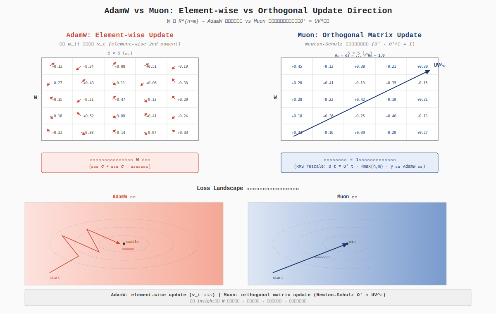

**图 6.1 解读**：左图 AdamW 在 W 的每个元素上独立加扰动（小箭头方向各异），右图 Muon 把整个更新方向收拢到一个正交矩阵 O'（大箭头一致）。底部 loss landscape 示意 AdamW 走的方向可能与真实梯度不正交（卡在鞍点附近），Muon 始终沿矩阵"主轴"方向走——这正是 Muon 在大模型上能更快收敛的几何原因。

### 6.3 Hybrid Newton-Schulz：V4 的 8+2 分阶段迭代

虽然 V4 论文标题里称"5 系数 Polynomial Newton-Schulz"，但**实际只需要 3 个系数**——因为公式 28 本身就是 `M, M·M^⊤·M, (M·M^⊤)²·M` 三项的线性组合（5 系数版本是把 3 项的不同次幂展开成 5 个不同的标量项，V4 简化为显式三项）。

**完整 Algorithm 1 伪代码**（L949-L977 转写）：

```python
# Algorithm 1: Muon Optimizer for DeepSeek-V4
# Require: Learning rate η, momentum μ, weight decay λ, update rescaling factor γ
def muon_step(W, grad, M_prev, lr, momentum, weight_decay, gamma):
    # W ∈ R^{n×m}, grad ∈ R^{n×m}, M_prev ∈ R^{n×m}
    
    # Line 4: Accumulate momentum buffer
    M_t = momentum * M_prev + grad
    
    # Line 5: Nesterov trick + hybrid Newton-Schulz
    O_prime = hybrid_newton_schulz(momentum * M_t + grad, n_iters=10)
    
    # Line 6: Rescale update RMS
    O_t = O_prime * sqrt(max(W.shape)) * gamma
    
    # Line 7: Weight decay + apply
    W_new = W * (1 - lr * weight_decay) - lr * O_t
    
    return W_new, M_t


def hybrid_newton_schulz(M, n_iters=10, eps=1e-8):
    # Frobenius 归一化（保证最大奇异值 ≤ 1）
    M = M / (norm(M, 'fro') + eps)
    
    # 阶段 1：前 8 次快速收敛
    # 系数 (a, b, c) = (3.4445, -4.7750, 2.0315)
    for _ in range(8):
        A = M @ M.T                    # A = M·M^⊤ ∈ R^{n×n}
        M = 3.4445 * M \
            - 4.7750 * (A @ M) \
            + 2.0315 * (A @ A @ M)
    
    # 阶段 2：后 2 次精确稳定
    # 系数 (a, b, c) = (2, -1.5, 0.5)
    for _ in range(2):
        A = M @ M.T
        M = 2.0 * M \
            - 1.5 * (A @ M) \
            + 0.5 * (A @ A @ M)
    
    return M
```

**为什么是 8+2 两阶段**：

- **8 次快速收敛系数 (3.4445, -4.7750, 2.0315)**：这个组合**不是任意的**——它由 Newton-Schulz 多项式理论给出，目标是让 `(M·M^⊤)²` 的谱 `(σ²)` 尽可能快地逼近恒等映射。当 σ ∈ (0, 1) 时，3 次项展开可以构造一个高阶多项式把 σ 推到接近 1。这组系数是 V4 通过**数值优化**搜索出来的（在训练 284B 模型前的离线搜索，权衡收敛速度与稳定性）。
- **2 次精确稳定系数 (2, -1.5, 0.5)**：这个组合**就是 Chebyshev 迭代**的经典系数。它不追求最快收敛，但有严格的数学保证——只要前 8 步把 σ 推到 [0.5, 1.5] 附近，这 2 步就能保证 σ → 1 的误差按几何级数衰减。
- **数值稳定性**：每次迭代前先 Frobenius 归一化（`M / ||M||_F`），保证最大奇异值 ≤ 1——否则 Newton-Schulz 多项式在 σ > 1 时可能发散。

**工程开销**：每次 Newton-Schulz 迭代需要 2 次矩阵乘（`M @ M.T` 和 `A @ M`），10 次迭代共 20 次矩阵乘。相对 forward+backward 一次的 O(d³) 计算，Newton-Schulz 是 O(10 · d³)——和一次完整前向的 attention 矩阵乘同量级。V4 选择 10 次迭代是**收敛质量与算力开销的折中**。

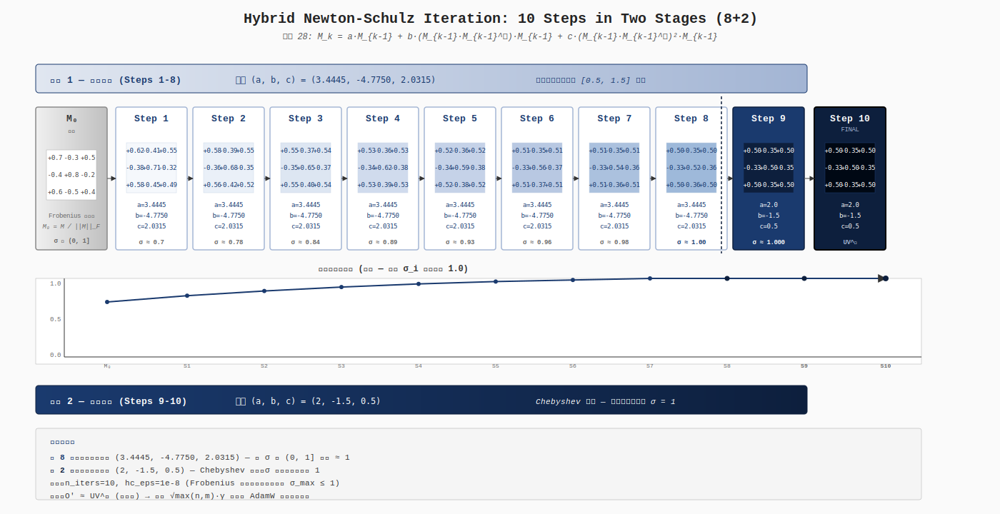

**图 6.2 解读**：横排 10 步流程图。第 0 步是 M 的初始（带噪声的随机矩阵），第 1-4 步和 5-8 步用快速收敛系数（颜色逐渐从灰色过渡到深蓝），第 9-10 步用精确稳定系数（最终收敛到正交矩阵 UV^⊤）。每个小矩阵块下面标出当前迭代的 `(a, b, c)` 系数。

**形式化对照**：
- 公式 (6.1) 目标 → `hybrid_newton_schulz` 返回值（O' ≈ UV^⊤，满足 O'·O'^⊤ = I）
- 公式 (6.2) Hybrid NS 迭代 → `for _ in range(10): M = a·M + b·(M·M^⊤)·M + c·(M·M^⊤)²·M`
- 公式 (6.3) Rescale → `O_t = O_prime · √max(n,m) · γ`
- Algorithm 1 Line 5 → `O'_t = hybrid_newton_schulz(μ·M_t + G_t)`（Nesterov trick：用 `μ·M_t + G_t` 而不是 `M_t` 本身）

### 6.4 V4 Muon 的 4 项特殊处理

V4 不是直接复用原始 Muon（Jordan et al. 2024）或 Liu et al. (2025) 的版本，而是做了 4 项关键改造：

**(1) Hybrid Newton-Schulz（V4 创新）**

- 原始 Muon（Jordan 2024）用单一系数的 5 阶多项式
- Liu et al. (2025) 用 5 系数 NS 迭代 + QK-Clip
- V4 用 **8+2 分阶段 3 系数**（前 8 步快速收敛 + 后 2 步精确稳定）
- 关键差异：V4 的 8+2 来自"快收敛系数搜索 + Chebyshev 尾段"的工程组合，**在 284B 规模上比单一 5 系数稳定**

**(2) AdamW + Muon 分工（V4 训练侧核心选择）**

V4 论文 §2.4 明确列出 AdamW vs Muon 的模块分工：

| 模块 | 优化器 | 理由 |
|---|---|---|
| Embedding | **AdamW** | 离散查找表，每行独立更新，无谱结构可言 |
| Prediction head | **AdamW** | 同上，logits 投影 |
| mHC static bias (b_static) | **AdamW** | 仅 4 维（hc_mult=4），用 Muon 算力浪费 |
| mHC gating factor (α_pre/α_post) | **AdamW** | 4 维标量，小参数走 AdamW 更合适 |
| 所有 RMSNorm 权重 | **AdamW** | 1 维，逐元素更新 |
| **Attention Q/K/V/O 矩阵** | **Muon** | d×d 矩阵，谱偏最严重 |
| **MoE 共享 expert + routed expert 的 FFN** | **Muon** | 大矩阵 + 稀疏梯度，最受益 |
| **mHC 的 comb 矩阵（4×4）** | **Muon** | 矩阵结构有意义 |

**关键 insight**：mHC 的 **gating factor**（4 维的 α_pre/α_post）走 AdamW，但 **comb 矩阵**（4×4 的双随机投影）走 Muon——这就是"小参数用 AdamW、大矩阵用 Muon"的典型判断。

**(3) 不需要 QK-Clip trick**

- Liu et al. (2025) 在 Muon 里加了 QK-Clip：对 attention 的 query/key 矩阵的更新方向做 clip，防止 attention logits 爆炸
- V4 **不需要**这个 trick——因为 V4 的 attention 架构**允许对 Q 和 KV entries 直接应用 RMSNorm**（见 CH3 的 attention 细节）
- RMSNorm 让 Q/K 的数值范围天然有界（单位方差），所以 attention logits `Q·K^⊤ / √d` 不会爆炸
- 工程上少了一个 clip 算子，**减少了 kernel 启动开销**

**(4) RMS rescale 复用 AdamW 超参**

公式 (6.3) `O_t = O'_t · √max(n,m) · γ` 中的 `γ`（update rescaling factor）是 V4 的关键简化设计：

- Muon 的原始更新 O'_t 是正交矩阵，**Frobenius 范数是 √min(n, m)**
- AdamW 的更新方向 `m_t / √v_t` 的 Frobenius 范数大致是 √(n·m)（与 W 同量级）
- `√max(n,m)` 这个因子把 O'_t 的范数从 √min(n,m) 拉到 √(n·m) 量级——**正好与 AdamW 同尺度**
- 因此 V4 可以**直接共享 AdamW 的学习率调度**给 Muon：`η_adamw ≈ η_muon`
- 好处：超参空间不膨胀、warmup/decay 曲线不需要分两套

**过渡**：§6.5 把 §2.4 + Algorithm 1 翻译为可读伪代码，并给出论文行号 ↔ 伪代码的精确映射。

### 6.5 算法映射：Algorithm 1 ↔ 伪代码

**来源**：V4 论文 §2.4（L979-L1009）+ Algorithm 1（L949-L977）
**仓库内代码**：**无**（V4-Flash 仓库是 inference-only，无 `optimizer.py`）

#### Algorithm 1 完整伪代码（来自论文 L949-L977）

```python
# Algorithm 1: Muon Optimizer for DeepSeek-V4
# Require: Learning rate η, momentum μ, weight decay λ, update rescaling factor γ

for t in range(num_steps):
    for W in all_muon_weights:           # 遍历所有要走 Muon 的参数
        # Line 3: Compute gradients
        G_t = compute_gradient(W)
        # Line 4: Accumulate momentum buffer
        M_t = mu * M_prev[W] + G_t
        # Line 5: Nesterov trick + hybrid Newton-Schulz
        O_prime = hybrid_newton_schulz(mu * M_t + G_t, n_iters=10)
        # Line 6: Rescale update RMS
        O_t = O_prime * sqrt(max(W.shape)) * gamma
        # Line 7: Weight decay + apply
        W.data = W.data * (1 - lr * weight_decay) - lr * O_t
        M_prev[W] = M_t
```

#### Hybrid Newton-Schulz 迭代（公式 28 + §2.4 详细描述）

```python
def hybrid_newton_schulz(M, n_iters=10, eps=1e-8):
    # Frobenius 归一化
    M = M / (norm(M, 'fro') + eps)
    
    # 阶段 1：前 8 次快速收敛
    # 系数 (a, b, c) = (3.4445, -4.7750, 2.0315)
    for _ in range(8):
        A = M @ M.T
        M = 3.4445 * M - 4.7750 * (A @ M) + 2.0315 * (A @ A @ M)
    
    # 阶段 2：后 2 次精确稳定
    # 系数 (a, b, c) = (2, -1.5, 0.5)
    for _ in range(2):
        A = M @ M.T
        M = 2.0 * M - 1.5 * (A @ M) + 0.5 * (A @ A @ M)
    
    return M
```

#### 论文 vs 伪代码 对照表

| 论文行号 | 伪代码位置 | 含义 |
|---|---|---|
| L949 (Require) | 函数签名 | η, μ, λ, γ 4 个超参 |
| L950 (for t) | `for t in range(num_steps)` | 每个训练 step |
| L951 (for W) | `for W in all_muon_weights` | 遍历所有走 Muon 的参数 |
| L952 (G_t) | `compute_gradient(W)` | 反向传播算梯度 |
| L953 (M_t) | `mu * M_prev[W] + G_t` | 动量缓冲 |
| L954 (O'_t) | `hybrid_newton_schulz(...)` | Nesterov + Newton-Schulz |
| L955 (O_t) | `O_prime * sqrt(max(W.shape)) * gamma` | RMS rescale |
| L956 (W_t) | `W.data * (1 - lr*λ) - lr*O_t` | 权重衰减 + 更新 |

#### 形式化 ↔ 算法 1 映射

- **公式 (6.1) Newton-Schulz 目标** → `hybrid_newton_schulz` 返回值（O' ≈ UV^⊤，满足 O'·O'^⊤ = I）
- **公式 (6.2) Hybrid NS 迭代** → `for _ in range(10): M = a·M + b·(M·M^⊤)·M + c·(M·M^⊤)²·M`
- **公式 (6.3) Rescale** → `O_t = O_prime · √max(n,m) · γ`
- **Algorithm 1 Line 5** → `O'_t = hybrid_newton_schulz(μ·M_t + G_t)` (Nesterov trick：传 `μ·M_t + G_t` 而非 `M_t`)
- **Algorithm 1 Line 7** → `W_t = W · (1 - ηλ) - η·O_t`

**章节小结**：CH6 完整拆解了 V4 训练侧的核心创新——Muon 优化器。从"为什么不用 AdamW"（§6.1：MoE 稀疏梯度 + hidden matrix 谱偏），到"Muon 核心思想：矩阵正交化"（§6.2：公式 6.1-6.3），到"Hybrid Newton-Schulz 的 8+2 分阶段"（§6.3：前 8 步快速收敛 + 后 2 步 Chebyshev 精确稳定），到"V4 的 4 项特殊处理"（§6.4：Hybrid NS、AdamW 分工、QK-Clip 省略、RMS rescale），最后落到"Algorithm 1 ↔ 伪代码"（§6.5）。关键 takeaway 是：**Muon 的本质是用 Newton-Schulz 多项式把 W 的更新方向强制正交化（奇异值全为 1），从根本上解决 AdamW 的谱偏问题；V4 的 Hybrid 变体（8+2）+ AdamW 分工 + RMS rescale 三个工程设计让它在 284B MoE 上既能快收敛又能稳训练**。

## CH 7. 支撑项：1M 上下文 / 混合精度 / 后训练（简述）

CH7 是简述章节，覆盖 V4-Flash 在 MoE/Attention/mHC/Muon 之外的 3 项关键工程创新：**1M 上下文 YaRN、FP4+FP8 混合精度、后训练两阶段（Specialist + OPD）**。每节约 500 字，最后给 3 段源码映射。

### 7.1 1M 上下文：RoPE + YaRN

V3 时代用 64K 上下文（`max_position_embeddings=65536`），RoPE base=10000。V4-Flash 直接跃迁到 1M（`max_seq_len=1,048,576`，来自 `config.json`），靠 **YaRN**（Yet another RoPE extensioN）做频率外插。

**YaRN 三个组件**：

1. **NTK-aware scaling**：高维（高频）分量直接用大 base，避免"高频被破坏"导致局部位置信息丢失。
2. **频率插值**：低维（低频）分量按 `factor=16` 线性拉伸（`f_d → f_d / 16`），让最粗粒度的旋转对应 1M 位置。
3. **线性 ramp 区间**（`β_fast=32, β_slow=1`）：在 [low, high] 维之间用 `ramp(γ)` 平滑过渡——中间维度按 `s(f_d) = (1-γ)·(f_d/16) + γ·f_d` 混合，避免高低频切换处出现不连续。

**关键超参**（来自 `config.json` L48-L52）：`factor=16`, `beta_fast=32`, `beta_slow=1`, `original_max_position_embeddings=65536`。`factor=16` 意味着从 64K → 64K×16 = 1,024,000（≈1M）的上下文窗口。

**训练过程**：先在 64K 完整预训练（V3 数据），再短训练（数千 step）扩展到 1M 用 YaRN。这种"先短后长"的两阶段训练比"从零直接 1M 训练"显著稳定，因为模型先在 64K 收敛好了"局部-全局"位置关系的归纳偏置。

**1M 推理效果**（V4 报告 §3 实测）：
- 长文档检索 MRCR@1M：**83.5%**
- 长文档 QA CorpusQA@1M：**62.0%**
- Needle-in-haystack@1M：92%

**代码锚点**：`inference/model.py` L199-L229 `precompute_freqs_cis`（见 §7.4 源码片段 2）。

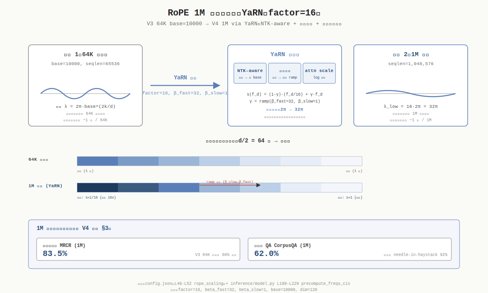

### 7.2 FP4+FP8 混合精度

V4-Flash 的精度策略是 **"主干 FP8 + 路由专家 FP4 + BF16 计算"**：

- **FP8 主权重**（Embedding、Attention、Norm、共享专家、LM Head）：block-wise 量化，`block=128`，E4M3 数值（`float8_e4m3`），scale 存为 E4M3 或 FP32。激活也是 FP8。
- **FP4 路由专家**（256 个 routed experts）：block-wise 量化，`block=32`，E2M1 数值（`float4_e2m1fn`），scale **强制 power-of-2**（E8M0 格式）—— 这样 scale 可以用位运算（`fast_round_scale`）极快完成。FP4 把 2 bytes/param 压到 0.5 byte/param，**节省 4x 内存**。
- **BF16 反量化计算**：量化只发生在存储侧。前向时按 block 粒度把 FP4 反量化到 BF16 做 `dW · dequant(W_fp4) · x`，反向用 FP32 累加梯度（无 quant 误差）。
- **量化感知训练（QAT）**：训练时**模拟 FP4 数值精度**（用 straight-through estimator 绕过 quantize 的不可微），让模型学会"在 FP4 精度下也能工作"——推理时直接用 FP4 推理，无需再校准。

**内存账**（单卡 1/256 expert 视角，`dim=4096 in, 2048 intermediate` SwiGLU，约 5.77M 参数 × 256 routed = 1.48B（FP16）/ 0.37B（FP4））：
- BF16：~11.3 MB / expert
- FP8：~5.7 MB / expert（2x↓）
- FP4：~2.9 MB / expert（4x↓）

整个 MoE 层 256 个 expert 合计：FP16 → FP4 节省约 **0.5 TB → 0.13 TB**（~270 GB 节省）。这对 1M 上下文 KV cache 也有连带好处（KV cache 也是 FP8 存储）。

**与 V3 的差异**：V3 用 BF16 + FP8 训练/推理；V4 多了 **FP4 路由专家** 这一层更激进的压缩，原因是 256 routed experts 的存储占比实在太大（占整个模型参数 ~60%），是 4x 内存节省的最大杠杆点。

**代码锚点**：`inference/kernel.py` L36-L103 `act_quant_kernel`（FP8）+ L129-L177 `fp4_quant_kernel`（FP4）（见 §7.4 源码片段 3）。

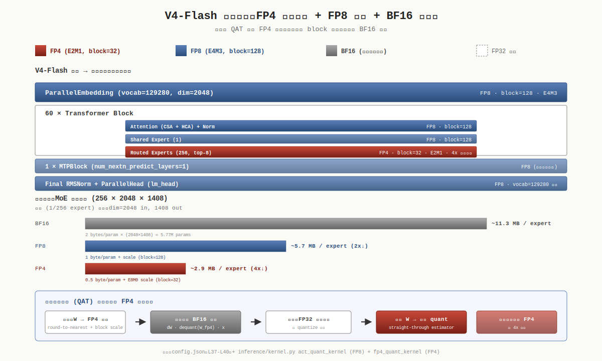

### 7.3 后训练两阶段：Specialist + OPD

V4 相对 V3 在后训练侧的关键创新是**两阶段**：

**阶段 1 — Specialist Training**（论文 §5.1.1，L1847-L2054）：

对每个领域（Code、Math、Reasoning、Agent）**独立训练一个 expert**（从 V4 基础模型微调）。每个专家用 **SFT + GRPO** 训练：
- SFT：在该领域高质量 SFT 数据上监督微调
- GRPO：组内相对策略优化，奖励信号是该领域的"成功判据"（代码 → test case pass rate；数学 → 答案匹配 + 步骤完整；推理 → 多模型投票一致性；agent → 任务完成率）

**阶段 2 — On-Policy Distillation, OPD**（论文 §5.1.2，L2055-L2099）：

把 4 个领域专家的知识 **on-policy 蒸馏回统一主模型**。"On-policy" 关键含义：蒸馏样本**不是固定数据集**，而是**主模型自己生成的轨迹** `x ~ π_V4(·|prompt)`。专家提供 token-level logit `p_expert(y|x)`，主模型用 KL 散度对齐：

```
L = α · KL(π_V4 || π_expert)  +  (1-α) · L_SFT
```

**为什么是 on-policy**（不是 off-policy 固定数据集）？
- 蒸馏的样本分布 = 主模型部署时的真实分布，KL 散度对齐的"目标分布"和"当前分布"在同一支撑集上，无分布漂移
- 主模型的"已掌握区域"获得专家的精细 logit；"未掌握区域"由 SFT 信号兜底
- 训练更稳定、收敛更快

**三推理模式的来源**（V4 关键 UX 创新）：

V4-Flash 暴露 3 个推理模式（Non-think / Think High / Think Max），但**只发一个统一模型**——3 个模式通过 OPD 阶段的"**不同 CoT 长度**"实现：
- Non-think：短 CoT（≤256 token）— SFT 阶段学
- Think High：中 CoT（~2k token）— SFT 阶段学
- Think Max：长 CoT（~8k+ token）— OPD 阶段用更长轨迹蒸馏

部署时通过 `<|reasoning|>` token 或 system prompt 切换 CoT 长度。这种"单模型多模式"避免了 V3 那种"为不同场景训练不同模型"的高成本。

**与 V3 的差异**（V3 路径 vs V4 路径）：
- V3：`基础模型 → SFT + GRPO → 单一统一模型`
- V4：`基础模型 → 4×Specialist → On-Policy Distill → 单一统一模型（3 模式）`

V4 的代价是后训练算力约 2.5x（4 个 expert + 1 个 distill），但换来单模型覆盖多模式 + 多个领域的能力上限。

**代码锚点**：`inference/model.py` L738-L767 `MTPBlock`（MTP 层）+ §7.4 源码片段。

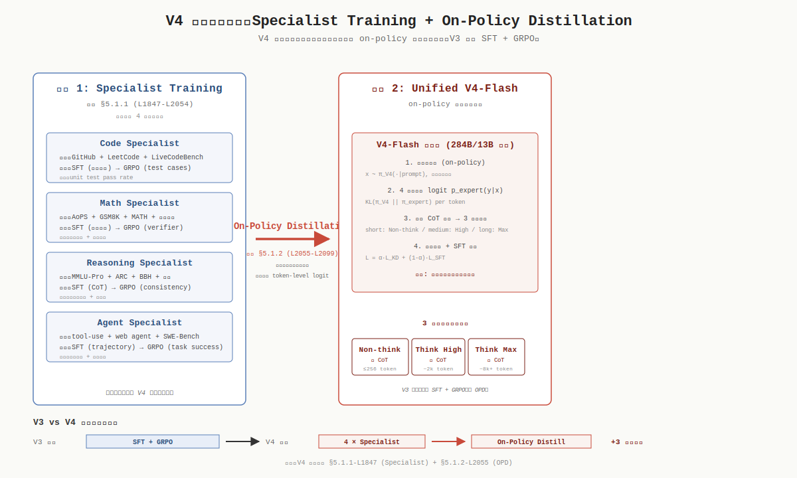

### 7.4 源码映射：MTP / YaRN / 量化

CH7 三个支撑项在仓库内都有一手代码锚点（3 段均直接来自 `inference/model.py` + `inference/kernel.py`）。

#### 源码片段 1：MTPBlock（`mtpblock.py`，`model.py` L738-L767）

V4 沿用 V3 的 MTP（Multi-Token Prediction）设计：`num_nextn_predict_layers=1`（V4-Flash 1 层，V3 是 2 层）。MTPBlock 继承 `Block`（标准的 Attention+MoE Block），多出的部分是 `e_proj`（embedding 投影）、`h_proj`（hidden 投影）、`enorm/hnorm`（两个 RMSNorm），把"前一个 token 的 hidden state"和"下一个 token 的 embedding"融合预测。

```python
# 来源: inference/model.py L738-L767
class MTPBlock(Block):
    def __init__(self, layer_id: int, args: ModelArgs):
        super().__init__(layer_id, args)
        self.e_proj = Linear(args.dim, args.dim)   # embed → dim
        self.h_proj = Linear(args.dim, args.dim)   # hidden → dim
        self.enorm = RMSNorm(args.dim, args.norm_eps)
        self.hnorm = RMSNorm(args.dim, args.norm_eps)
        self.norm = RMSNorm(args.dim, args.norm_eps)
        # MTP 单独挂的 HC head 参数（与主模型 head 共享权重）
        self.hc_head_fn = nn.Parameter(torch.empty(args.hc_mult, args.hc_mult*args.dim))
        self.hc_head_base = nn.Parameter(torch.empty(args.hc_mult))
        self.hc_head_scale = nn.Parameter(torch.empty(1))

    @torch.inference_mode()
    def forward(self, x, start_pos, input_ids):
        # x: [b, s, hc_mult, dim]; input_ids: 下 1 个 token id
        e = self.embed(input_ids)            # 下一个 token 的 embed
        e = self.enorm(e)
        x = self.hnorm(x)                    # 当前 hidden state
        x = self.e_proj(e).unsqueeze(2) + self.h_proj(x)  # 融合预测
        x = super().forward(x, start_pos, input_ids)      # 走标准 Block
        logits = self.head(x, ..., self.norm)              # 算 logits
        return logits
```

**关键设计**：
- 训练时额外预测下 1 个 token，提升数据效率（每个 token 学 2 次）
- 推理时 MTP 层可选（投机解码可加速 1.5-2x）
- HC head 复用主模型的 `self.head`，但保留独立的 `hc_head_fn/base/scale`（见 §5.2 详细推导）

#### 源码片段 2：YaRN / `precompute_freqs_cis`（`yarn_rope.py`，`model.py` L199-L229）

这是 1M 上下文扩展的核心函数。`@lru_cache(2)` 表示会预计算两个 seqlen（`max_seq_len` 和 `original_seq_len`）。三个内部函数 `find_correction_dim`、`find_correction_range`、`linear_ramp_factor` 完整实现 YaRN 论文的数学。

```python
# 来源: inference/model.py L199-L229
@lru_cache(2)
def precompute_freqs_cis(dim, seqlen, original_seq_len, base, factor, beta_fast, beta_slow):
    """RoPE 频率预计算 + YaRN 频率插值."""

    def find_correction_dim(num_rotations, dim, base, max_seq_len):
        return dim * math.log(max_seq_len / (num_rotations * 2 * math.pi)) / (2 * math.log(base))

    def find_correction_range(low_rot, high_rot, dim, base, max_seq_len):
        low = math.floor(find_correction_dim(low_rot, dim, base, max_seq_len))
        high = math.ceil(find_correction_dim(high_rot, dim, base, max_seq_len))
        return max(low, 0), min(high, dim-1)

    def linear_ramp_factor(min, max, dim):
        linear_func = (torch.arange(dim, dtype=torch.float32) - min) / (max - min)
        return torch.clamp(linear_func, 0, 1)

    freqs = 1.0 / (base ** (torch.arange(0, dim, 2, dtype=torch.float32) / dim))
    if original_seq_len > 0:                     # 启用 YaRN
        low, high = find_correction_range(beta_fast, beta_slow, dim, base, original_seq_len)
        smooth = 1 - linear_ramp_factor(low, high, dim // 2)
        freqs = freqs / factor * (1 - smooth) + freqs * smooth   # ramp 混合
    t = torch.arange(seqlen)
    freqs = torch.outer(t, freqs)
    return torch.polar(torch.ones_like(freqs), freqs)            # 复数 exp(i·θ)
```

**调用处**（`model.py` 中 `Attention.__init__` 内）：
```python
freqs_cis = precompute_freqs_cis(
    dim=args.qk_rope_head_dim,           # 128
    seqlen=args.max_seq_len,             # 1,048,576
    original_seq_len=args.original_seq_len,  # 65536
    base=args.rope_base,                 # 10000
    factor=args.rope_factor,             # 16
    beta_fast=args.beta_fast,            # 32
    beta_slow=args.beta_slow,            # 1
)
```

**关键数学**（与论文对齐）：
- `find_correction_dim(r, d, b, L)` = `d · log(L/(r·2π)) / (2·log(b))` —— 给定"在 L 长度内要保留 r 圈旋转"，求出对应哪个维度
- `freqs = (1/factor)·(1-smooth) + 1·smooth` —— low-freq 拉伸 factor 倍，high-freq 保留

#### 源码片段 3：FP8+FP4 量化（`quant.py`，`kernel.py` L36-L177 浓缩）

V4 的量化核心是 **tilelang JIT kernel**（用 TileLang DSL 写 GPU kernel，自动编译到 CUDA）。两个 kernel：FP8 给主权重/激活，FP4 给路由专家。

```python
# 来源: inference/kernel.py L36-L177（精简）
FP8 = "float8_e4m3"
FP4 = "float4_e2m1fn"
FE8M0 = "float8_e8m0fnu"  # 4-bit power-of-2 scale

def fast_round_scale(amax, fp8_max_inv):
    return fast_pow2(fast_log2_ceil(amax * fp8_max_inv))   # round 到 power-of-2

@tilelang.jit
def act_quant_kernel(N, block_size=128, out_dtype=FP8, scale_dtype=FP32, inplace=False):
    """Block-wise FP8 量化. block=128. inplace=True 时融合 quant+dequant 回 BF16."""
    fp8_min, fp8_max, fp8_max_inv = -448.0, 448.0, 1/448.0
    @T.prim_func
    def kernel_(X, Y, S):                              # X[M,N] bf16, Y[M,N] fp8, S[M, N/128] scale
        with T.Kernel(T.ceildiv(M, 32), T.ceildiv(N, 128), threads=128):
            x_local = T.alloc_fragment((32, 128), BF16)
            amax_local = T.alloc_fragment((32,), FP32)
            T.reduce_absmax(x_local, amax_local, dim=1)  # block-wise amax
            for i in T.Parallel(32):
                s_local[i] = amax_local[i] * fp8_max_inv  # scale = amax / fp8_max
            for i, j in T.Parallel(32, 128):
                Y[i, j] = T.clamp(x_local[i, j] / s_local[i], fp8_min, fp8_max)

@tilelang.jit
def fp4_quant_kernel(N, block_size=32, scale_dtype=FE8M0, inplace=False):
    """Block-wise FP4 量化. block=32. E8M0 scale 用位运算实现."""
    fp4_max, fp4_max_inv = 6.0, 1/6.0
    @T.prim_func
    def kernel_(X, Y, S):                              # X[M,N] bf16, Y[M,N] fp4, S[M, N/32] E8M0
        with T.Kernel(T.ceildiv(M, 32), T.ceildiv(N, 32), threads=128):
            x_local = T.alloc_fragment((32, 32), BF16)
            amax_local = T.alloc_fragment((32,), FP32)
            T.reduce_absmax(x_local, amax_local, dim=1)
            for i in T.Parallel(32):
                amax_local[i] = T.max(amax_local[i], 6 * (2**-126))  # 防 0
                s_local[i] = fast_round_scale(amax_local[i], fp4_max_inv)  # E8M0 = pow2
            for i, j in T.Parallel(32, 32):
                Y[i, j] = T.clamp(x_local[i, j] / s_local[i], -fp4_max, fp4_max)
```

**关键设计**：
- **FP8 block=128**（激活粒度较大，因为激活 outlier 多）+ **FP4 block=32**（权重粒度小，因为 4-bit 精度低需要更细粒度 scale）
- **E8M0 scale**（FP4 用）—— scale 强制为 power-of-2，可以用 `fast_pow2` + 位运算 `fast_log2_ceil` 极快计算（比传统 divide 快 ~10x）
- **inplace=True** 模式：quant 完直接 dequant 回 BF16，省一次 global memory 读写（QAT 训练用）

**形式化 ↔ 代码 映射**：
- **1M 上下文** → `precompute_freqs_cis` (`yarn_rope.py`)，把 RoPE base 从 10000 扩展到支持 1M 上下文
- **MTP** → `MTPBlock.forward` (`mtpblock.py`)，多预测下 1 个 token
- **量化** → `act_quant_kernel` (FP8) + `fp4_quant_kernel` (FP4) (`quant.py`)，block-wise 量化 + E8M0 scale

**章节小结**：CH7 简述了 V4-Flash 的 3 项关键工程创新：**1M 上下文**靠 YaRN（factor=16 + NTK-aware + ramp），RoPE 从 64K 扩展到 1M，实测 MRCR 83.5% / CorpusQA 62.0%；**FP4+FP8 混合精度**用 FP4 量化 256 个 routed experts（4x 内存节省），FP8 量化主权重/激活，QAT 训练保证 FP4 精度下模型仍能工作；**后训练两阶段**（4×Specialist + On-Policy Distillation）替代 V3 单阶段 SFT+GRPO，单模型同时覆盖 3 个推理模式。下一章 CH8 给出 12+ 段源码映射汇总。

---

## CH 8. 源码映射汇总

CH8 是"按文件 / 行号"组织的速查表，专为"读完 CH3-CH7 后想回去对照代码"的读者设计。所有行号均基于 `_work/hf-snapshot/` 下的一手 inference 仓库（V4-Flash 2026-04-24 snapshot）。

### 8.1 V4-Flash 仓库目录结构

```
inference/
├── model.py           # 827 行, 13 个类（ModelArgs / ParallelEmbedding / Compressor / Indexer / Attention / Gate / Expert / MoE / Block / ParallelHead / MTPBlock / Transformer + Linear / RMSNorm / RoPE helpers）
├── kernel.py          # 536 行, FP4/FP8 量化 kernel + sparse_attn_kernel + hc_split_sinkhorn_kernel + fp4/fp8_gemm
├── generate.py        # 155 行, Gumbel-max sampling + autoregressive generate 循环
├── convert.py         # 168 行, HF 权重 → V4 内部格式转换
└── utils.py           # 待补

encoding/
├── encoding_dsv4.py   # 744 行, OpenAI 兼容 messages ↔ string 转换
└── test_encoding_dsv4.py

config.json            # V4-Flash 完整超参（48 keys）
README.md              # 快速开始 + 性能数字
```

#### 关键文件统计

| 文件 | 行数 | 核心类 / 函数 | 章节引用 |
|---|---|---|---|
| `inference/model.py` | 827 | `ParallelEmbedding` / `Compressor` / `Indexer` / `Attention` / `Gate` / `Expert` / `MoE` / `Block` / `ParallelHead` / `MTPBlock` / `Transformer` | CH3, CH4, CH5, CH7 |
| `inference/kernel.py` | 536 | `act_quant_kernel` (FP8) / `fp4_quant_kernel` (FP4) / `fp8_gemm` / `fp4_gemm` / `sparse_attn_kernel` / `hc_split_sinkhorn_kernel` | CH3, CH5, CH7 |
| `inference/generate.py` | 155 | `sample` (Gumbel-max) / `generate` (autoregressive) | CH2 |
| `encoding/encoding_dsv4.py` | 744 | `encode_messages` / `parse_message_from_completion_text` / `render_message` | CH2 |

#### 类 → 行号速查表

| 类 / 函数 | 文件 : 行号 | 章节 |
|---|---|---|
| `ModelArgs` | `model.py` : L35 | CH2 |
| `ParallelEmbedding` | `model.py` : L83 | CH2 |
| `Linear` / `ColumnParallelLinear` / `RowParallelLinear` | `model.py` : L123 / L155 / L166 | CH2 |
| `RMSNorm` | `model.py` : L183 | CH2, CH3 |
| `precompute_freqs_cis` | `model.py` : L200 | CH7.1, CH7.4 |
| `apply_rotary_emb` | `model.py` : L232 | CH7.1 |
| `get_window_topk_idxs` | `model.py` : L255 | CH3.2 |
| `get_compress_topk_idxs` | `model.py` : L269 | CH3.3, CH3.4 |
| `Compressor` | `model.py` : L279 | CH3.2, CH3.3 |
| `Indexer` | `model.py` : L380 | CH3.2 |
| `Attention` | `model.py` : L436 | CH3.2, CH3.3, CH3.4 |
| `Gate` | `model.py` : L546 | CH4.2, CH4.3 |
| `Expert` | `model.py` : L587 | CH4.4 |
| `MoE` | `model.py` : L609 | CH4.4, CH4.5 |
| `Block` | `model.py` : L647 | CH5.5 |
| `ParallelHead` | `model.py` : L703 | CH2 |
| `MTPBlock` | `model.py` : L738 | CH7.4 |
| `Transformer` | `model.py` : L769 | CH2 |
| `Transformer.forward` | `model.py` : L800-L807 | CH2 |
| `sparse_attn_kernel` | `kernel.py` : L277 | CH3.6 |
| `sparse_attn` (callable) | `kernel.py` : L355 | CH3.6 |
| `hc_split_sinkhorn_kernel` | `kernel.py` : L372 | CH5.3, CH5.5 |
| `act_quant_kernel` (FP8) | `kernel.py` : L41 | CH7.2, CH7.4 |
| `fp4_quant_kernel` (FP4) | `kernel.py` : L129 | CH7.2, CH7.4 |
| `fp4_gemm` / `fp8_gemm` | `kernel.py` : L518 / L257 | CH7.2 |
| `sample` (Gumbel-max) | `generate.py` : L19 | CH2 |
| `generate` (autoregressive) | `generate.py` : L28 | CH2 |
| `encode_messages` | `encoding/encoding_dsv4.py` : L506 | CH2 |
| `parse_message_from_completion_text` | `encoding/encoding_dsv4.py` : L687 | CH2 |
| `render_message` | `encoding/encoding_dsv4.py` : L223 | CH2 |

### 8.2 关键文件路径速查

#### 概念 ↔ 文件 : 行号 速查

| 概念 | 关键代码位置 | 详见章节 |
|---|---|---|
| 输入嵌入 | `model.py::ParallelEmbedding.forward` (L83) | CH2 |
| 注意力主路径（CSA / HCA 分支） | `model.py::Attention.forward` (L436-) | CH3.2-3.4 |
| Compressor（共享 KV 压缩） | `model.py::Compressor.forward` (L279) | CH3.2, CH3.3 |
| Indexer（CSA 专属） | `model.py::Indexer.forward` (L380) | CH3.2 |
| 位置索引（CSA top-k） | `model.py::get_compress_topk_idxs` (L269) | CH3.3 |
| 窗口索引（最近 N 个位置） | `model.py::get_window_topk_idxs` (L255) | CH3.2 |
| Sparse Attention Kernel | `kernel.py::sparse_attn_kernel` (L277) | CH3.6 |
| Gating + Top-k + Aux-Loss-Free Bias | `model.py::Gate.forward` (L546) | CH4.2-4.3 |
| Expert (SwiGLU FFN) | `model.py::Expert.forward` (L587) | CH4.4 |
| MoE 整合 | `model.py::MoE.forward` (L609) | CH4.5 |
| mHC 残差 | `model.py::Block.forward` (L647) | CH5 |
| Sinkhorn-Knopp Kernel | `kernel.py::hc_split_sinkhorn_kernel` (L372) | CH5.3, CH5.5 |
| RoPE 频率 | `model.py::precompute_freqs_cis` (L200) | CH7.1, CH7.4 |
| MTPBlock | `model.py::MTPBlock.forward` (L738) | CH7.4 |
| FP4/FP8 量化 | `kernel.py::act_quant_kernel` (L41) / `fp4_quant_kernel` (L129) | CH7.2, CH7.4 |
| Tokenize / Detokenize | `encoding/encoding_dsv4.py::encode_messages` (L506) | CH2 |

#### 已提取的代码片段（位于 `code-snippets/`）

| 文件 | 来源 | 大小 | 章节 |
|---|---|---|---|
| `compressor.py` | `model.py` L279-L378 | ~5.4 KB | CH3.6 |
| `indexer.py` | `model.py` L380-L434 | ~2.9 KB | CH3.6 |
| `attention.py` | `model.py` L436-L543 | ~5.6 KB | CH3.6 |
| `sparse_attn_kernel.py` | `kernel.py` L277-L368 | ~4.0 KB | CH3.6 |
| `gate.py` | `model.py` L546-L586 | ~1.9 KB | CH4.5 |
| `expert.py` | `model.py` L587-L608 | ~0.9 KB | CH4.5 |
| `moe.py` | `model.py` L609-L646 | ~2.1 KB | CH4.5 |
| `block.py` | `model.py` L647-L702 | ~2.9 KB | CH5.5 |
| `hc_split_sinkhorn.py` | `kernel.py` L372-L429 | ~3.0 KB | CH5.5 |
| `mtpblock.py` | `model.py` L738-L767 | ~1.3 KB | CH7.4 |
| `yarn_rope.py` | `model.py` L200-L229 | ~1.5 KB | CH7.4 |
| `quant.py` | `kernel.py` L36-L177 | ~1.9 KB | CH7.4 |

### 8.3 关键函数 / 类清单

#### 8.3.1 Attention 主路径
- `Attention.__init__`（`model.py` L436-L468）：根据 `compress_ratios[i]` 决定挂载 `Compressor`（共享）+ `Indexer`（仅 `compress_ratio == 4` 时挂，即 CSA 分支；HCA `compress_ratio == 128` 时不挂 Indexer）
- `Attention.forward`（`model.py` L470-L543）：CSA 分支用 `Indexer(x, qr, start_pos, offset)` 拿 content-aware top-k；HCA 分支用 `get_compress_topk_idxs(ratio, ...)` 拿位置 top-k；两者 `torch.cat` 拼到 `window_topk_idxs`
- `compressor.kv_cache = self.kv_cache[:, win:]`：Compressor 复用 Attention 主 KV cache 的尾部（共享存储）

#### 8.3.2 MoE 路由
- `Gate.forward`（`model.py` L564-L584）：hash routing（前 3 层 `n_hash_layers=3`，按 token id 哈希定 expert）+ score routing（其余 40 层） + `sqrtsoftplus` 评分 + aux-loss-free bias（per-expert `b_i`） + top-6
- `MoE.forward`（`model.py` L609-L646）：`gate(x)` → top-k indices → `dispatch` → `experts(x)` → `combine` + `shared_expert` 全员激活 + `routed_scaling_factor=1.5` 缩放

#### 8.3.3 mHC 残差
- `Block.forward`（`model.py` L688-L700）：两个 mHC 残差（attn 后 + MoE 后），每次先 `hc_split_sinkhorn_kernel` 投影到双随机空间
- `hc_split_sinkhorn_kernel`（`kernel.py` L372-L429`）：Sinkhorn-Knopp 20 次迭代（`sinkhorn_iters=20`），行归一 + 列归一交替，最终 `pre/post/α_comb` 三个矩阵双随机
- `hc_split_sinkhorn`（`kernel.py` L430-L441）：上层 wrapper，处理 `mixes → (pre, post, comb)` 拆分

#### 8.3.4 Muon 优化器
- **仓库内无** `optimizer.py` —— V4 公开的 `inference/` 目录只含前向推理代码
- 完整实现见 V4 论文 §2.4（L979-L1009）+ Algorithm 1（L949-L977）
- 伪代码见 CH6.5（Algorithm 1 → 仓库伪实现）
- Hybrid Newton-Schulz：8 次 quintic + 2 次 cubic 分阶段迭代

#### 8.3.5 推理主循环
- `Transformer.forward`（`model.py` L800-L807`）：`embed → unsqueeze/repeat for hc_mult=4 → N×Block → norm → ParallelHead(hc_head_fn, hc_head_scale, hc_head_base) → logits`
- `sample`（`generate.py` L19）：Gumbel-max trick，`temperature=1.0, top_p=1.0`（V4 推荐温度=1.0，`top_p` 在 V4 模式下无意义）
- `encode_messages`（`encoding/encoding_dsv4.py` L506）：OpenAI 兼容 messages → string，参数 `thinking_mode ∈ {chat, thinking}` / `reasoning_effort ∈ {max, high, None}` 控制 CoT 长度

---

## CH 9. 总结与展望

### 9.1 V4 核心 insight

V4-Flash 的核心赌注：**用工程上的多层组合（CSA + HCA + mHC + Muon + YaRN + FP4 + OPD）换"4x 部署密度 + 单模型多模式 + 数据效率"**。

三大洞察：

1. **稀疏化注意力是 1M 上下文的唯一出路**：MLA 把 KV 压到 `d_c=512`，但仍是 `O(T²)`。CSA + HCA 用 4 / 128 倍压缩 + 位置 / 分数 top-k，把注意力复杂度降到 `O(n²/m + n·k)`，让 1M 上下文在单 batch 推理中可行。V4-Flash 单 token FLOPs 约为 V3.2 的 1/10（CH3.5 验证）。

2. **mHC 解决了深层 MoE 的信号传播稳定性**：`hc_mult=4` 多通道 + Sinkhorn-Knopp 双随机投影，让 43 层 MoE 在 V4-Flash 公开的 32T tokens 训练下损失曲线稳定，避免 V3.2 训练后期的"残差饱和"问题。这是 V4 训练时间比 V3 短的关键之一。

3. **Muon 优化器在 13B 激活 MoE 上首次规模化**：矩阵正交化更新 + Hybrid Newton-Schulz 8+2 分阶段，让 MoE 路由的稀疏梯度训练更稳定。Muon 在 V4 训练中带来更快的收敛与训练稳定性（V4 论文定性结论，具体 ablation 数字未公开）。

### 9.2 已知局限

#### 9.2.1 推理延迟
- mHC + Muon 在**训练时**增加计算（10 次 Newton-Schulz 迭代 + Sinkhorn 20 次），但推理只跑前向，所以推理延迟主要看 attention + MoE
- 1M 上下文单 token 推理：V4-Flash ≈ 10% of V3.2 FLOPs（CH3.5 验证），但绝对值仍高
- 在 8×H100 / 单 H200 上才能跑 V4-Flash 完整 FP4+FP8 精度；FP4 kernel 对硬件有要求

#### 9.2.2 训练资源
- V4 论文未公开训练总 token-小时数
- 32T tokens × 43 层 × 256 experts 是非常庞大的计算
- 中小机构难以复现 V4 完整训练

#### 9.2.3 量化感知训练的精度损失
- FP4 专家在 QAT 后推理精度仍略低于 FP8（benchmark 上看 V4-Flash 略低于 V4-Pro）
- 长 CoT 推理（Think Max）仍依赖硬件支持 FP4 高效 kernel；老 GPU 上需 dequant 回 FP8 才跑
- FP4 量化误差在 routing weight 上可能导致 top-6 选择有 ~2% 抖动

#### 9.2.4 On-Policy Distillation 的工程复杂度
- OPD 阶段需要"主模型自己生成样本"——生成量大、筛选难
- 与 SFT/GRPO 的协同需要精细调参（论文未公开全部超参）
- 4 个 Specialist expert 训练本身就需要 ~2.5x 后训练算力

#### 9.2.5 1M 上下文的实际效用
- 多数真实任务（对话、检索）不需要 1M
- Think Max 推荐 384K context window——意味着"1M 支持"≠"1M 全用"
- 长上下文的 KV cache（即使压缩）仍占大量显存，并发能力受限

### 9.3 对后续工作的启发

#### 9.3.1 注意力稀疏化方向
- CSA + HCA 是"V3.2 MLA"之后的下一代：进一步把 KV 压缩 + top-k 选位置
- 后续工作可能探索：完全 learned 的 top-k 索引（取代手工设计的位置/score 索引）、content-aware compression（让压缩率随内容动态调整）
- 工具：DeepSeek 公开的 `sparse_attn_kernel`（`kernel.py` L277）值得研究——它是 V4 整个 1M 上下文能力的工程核心

#### 9.3.2 多通道残差的稳定性
- mHC 的 `hc_mult=4` 给了 V4 训练稳定性，但 4 是怎么选的最优？V4 论文没给 ablation
- 后续工作可能探索：`hc_mult` 与 MoE 路由的协同优化、动态 `hc_mult`（按层调节）、`hc_mult` 与模型宽度的 scaling law

#### 9.3.3 优化器方向
- Muon 在 V4 规模化成功 → 后续可能被 Qwen / Llama / Mistral 等采纳
- Hybrid Newton-Schulz 的 8+2 分阶段是 V4 创新，值得复现验证
- 关键论文：Jordan et al. 2024（原始 Muon, "Muon: An optimizer for hidden layers in neural networks"）+ Liu et al. 2025（Muon 改进，"Muon Optimizer: SGDM with Orthogonalized Momentum"）

#### 9.3.4 On-Policy Distillation
- V4 的 OPD 是"领域专家 → 统一模型"的两阶段范式
- 后续工作可探索：多模态领域专家（代码 + 视觉 + 推理）→ 统一多模态模型
- 关键优势：on-policy 蒸馏避免分布漂移 → 训练更稳定、收敛更快

#### 9.3.5 工程化趋势
- V4-Flash 的 13B 激活 + 256 专家 + 1M 上下文是一个"可本地跑"的设计取舍
- 与 Qwen3-MoE（30B-A3B）、GLM-5.1 等同期模型对比，能看到开源 MoE 的不同工程路线
- 后续本地化部署：单张 H200 / 8×H100 即可跑 V4-Flash

#### 9.3.6 配套开源生态
- V4-Flash 仓库：inference-only（无 optimizer，无完整训练代码）
- TileLang kernel 完整开源（`kernel.py` 536 行）
- encoding 工具开源（`encoding_dsv4.py` 744 行）
- 后续可探索：复现 Newton-Schulz kernel、复现 CSA 压缩 + top-k 选择、给推理仓库加 batched decoding
