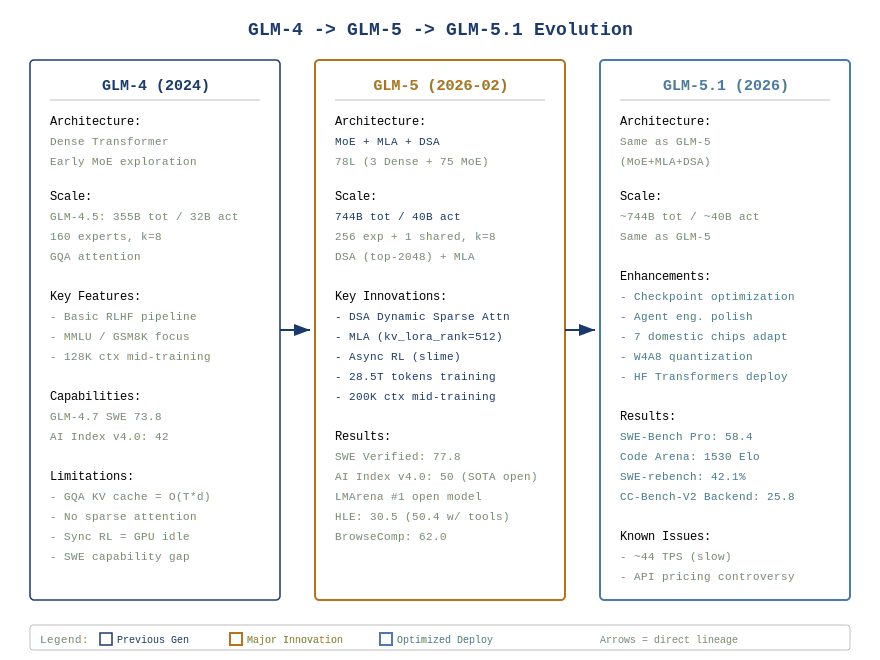
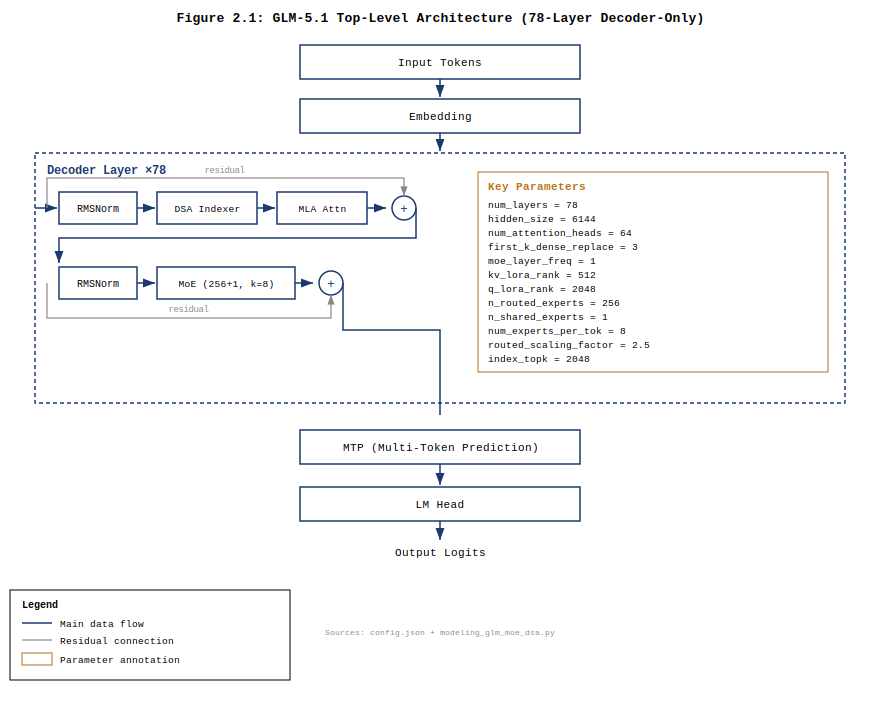
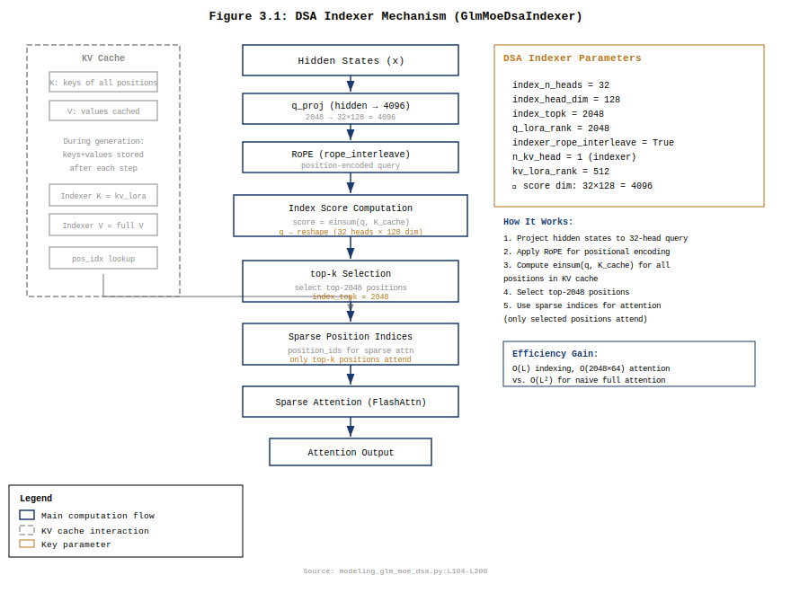
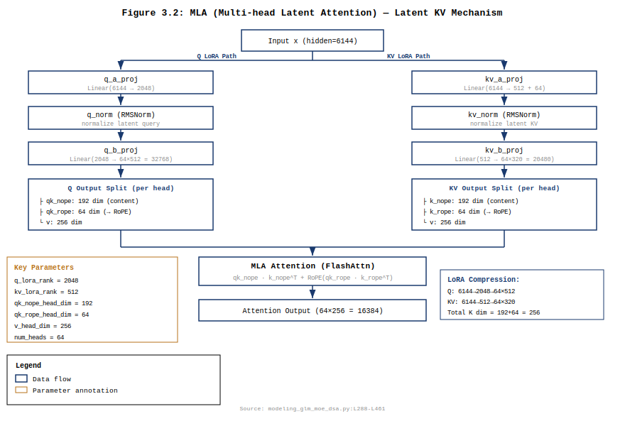
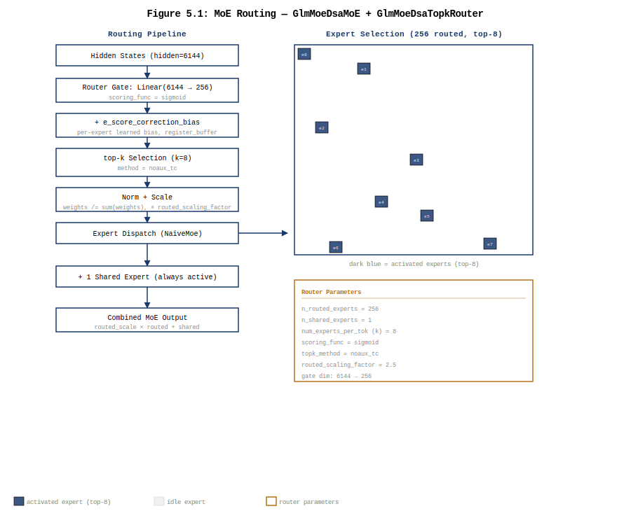
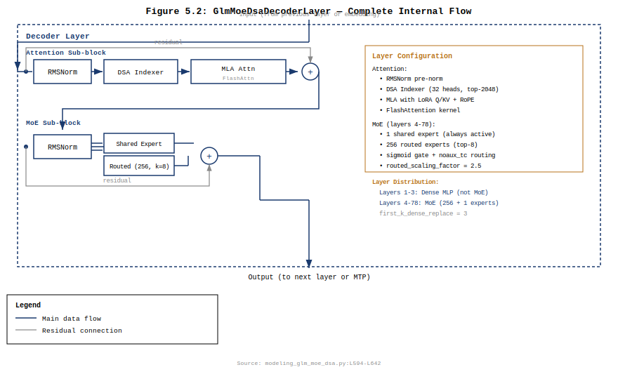
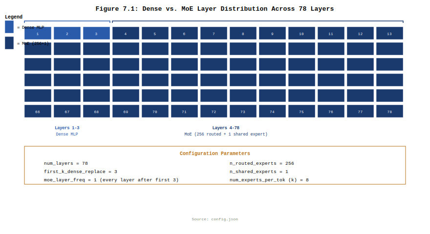

+++
math = true
date = '2026-06-10'
draft = false
title = 'GLM-5.1 架构深度拆解'
categories = ['architecture']
vendor = 'Zhipu'
tags = ['moe', 'attention', 'model-architecture', 'mla', 'dsa', 'glm', 'training', 'mqa']
series = ['architecture']
summary = 'GLM-5.1（744B 总参 / 40B 激活）是智谱 AI 与清华联合发布的旗舰 Agent 大模型。核心创新为 DSA 动态稀疏注意力（top-2048, 节省 72.5% 注意力计算）+ MLA 潜 KV 压缩（理论 ~19 GB）+ 256+1 MoE（routed_scaling_factor=2.5）。本期完整拆解 78 层架构、DSA Indexer 7 步算子、MLA Muon Split、异步 Agent RL 训练体系，并与 M2.7 做全维度对比。'
+++

# GLM-5.1 架构深度拆解

> 版本：v0.1 草稿 · 撰写日期：2026-06-10 · 范围：GLM-5.1（744B 总参 / 40B 激活）

---

## CH 0. 摘要与阅读路径

GLM-5.1 是智谱 AI（Zhipu AI）与清华大学联合发布的旗舰 Agent 大模型，开源仓库位于 `zai-org/GLM-5.1`。模型采用 **MoE + DSA + MLA** 三位一体的架构设计：78 层 Transformer Decoder（前 3 层 Dense + 后 75 层 MoE），256 个路由专家 + 1 个共享专家，每 token 激活 top-8 专家（约 40B 激活参数，总参约 744B）。核心创新为 **DSA（Dynamic Sparse Attention，动态稀疏注意力）**——通过 Indexer 从上下文中动态选择 top-2048 个最相关 token，将注意力复杂度从 $O(T^2)$ 降至 $O(T \cdot k)$；同时采用 **MLA（Multi-head Latent Attention）** 对 KV 做潜空间压缩（kv_lora_rank=512），配合 Partial RoPE 和 QK Norm 保证长序列数值稳定。

与 GLM-5 论文[^src1]描述的完整架构一致，GLM-5.1 是经过 checkpoint 优化的部署版本。在 SWE-bench Pro 上达到 58.4，Code Arena 上获得 1530 Elo，Arti ficial Analysis Intelligence Index v4.0 上得分 50（开源模型首次）。

本报告按 10 章展开：

- **CH 1**：GLM-4 → GLM-5 → GLM-5.1 演进脉络
- **CH 2**：整体架构与超参表
- **CH 3**：DSA——动态稀疏注意力（核心创新，论文 35 次提及）
- **CH 4**：MLA——潜 KV 压缩
- **CH 5**：MoE 路由——256+1, k=8, routed_scaling_factor=2.5
- **CH 6**：训练体系总览
- **CH 7**：支撑项——上下文 / 量化 / MTP
- **CH 8**：源码映射汇总
- **CH 9**：与 MiniMax-M2.7 的架构对比
- **CH 10**：总结

**适合**：先看 CH 0–2 拿全貌，CH 3（DSA）是理解本模型的关键，CH 5（MoE）和 CH 4（MLA）为次要创新，CH 9 适合做横向对比参考。

---

## CH 1. GLM-4 → GLM-5 → GLM-5.1 演进

### 1.1 三代演进



GLM 系列从 2024 年至今经历三次关键架构迭代：

| 代际 | 时间 | 架构 | 关键特征 |
|---|---|---|---|
| **GLM-4** | 2024 | Dense Transformer | 基础 MoE 探索，355B 总参 / 32B 激活 |
| **GLM-5** | 2026-02 | MoE + MLA + DSA | 744B 总参，异步 RL 基础设施，SWE-Bench Verified 55.1[^src31] |
| **GLM-5.1** | 2026 | 同 GLM-5 架构 | Checkpoint 优化 + Agent 工程增强，SWE-Bench Pro 58.4，Code Arena 1530 Elo |

- **GLM-4（2024）**：基于 Dense Transformer 的早期版本，初步引入 MoE 架构（论文称 GLM-4.5 为 355B 总参，32B 激活，160 专家，8 路由[^src2]）
- **GLM-5（2026-02）**：论文发表于 arXiv:2602.15763。引入三大核心创新——MoE 扩展到 256 专家、MLA 潜注意力压缩、DSA 动态稀疏注意力。通过异步 RL 基础设施和 Agent RL 算法，在 SWE-bench Verified 上达到 77.8[^src1]。模型总参 744B，激活 40B
- **GLM-5.1（2026）**：与 GLM-5 架构完全相同，是经过 checkpoint 优化和额外 Agent 工程增强的部署版本。从 HF 仓库 `zai-org/GLM-5.1` 的 config.json 确认：78 层，hidden=6144，256 专家[^src3]

### 1.2 关键创新定位

GLM-5 论文[^src1]的技术贡献概括为四个支柱：

1. **DSA 动态稀疏注意力**（§2.1.1）：从 MLA 密集 checkpoint 出发，通过两阶段 Continued Pre-Training（warmup + sparse adaptation）引入 DSA，用 Indexer 替代全注意力的 $O(T^2)$ 扫描，将长序列注意力计算降低约 1.5-2×
2. **异步 RL 基础设施**（§3, §4）：基于 slime 框架，将生成引擎与训练引擎解耦，最大化 GPU 利用率；支持 1k+ 并发 rollout、心跳驱动容错
3. **异步 Agent RL 算法**（§4.1）：Token-in-Token-out 网关消除重 tokenize 偏差；Direct Double-sided Importance Sampling 用 rollout log-prob 直接替代 old-policy 推断
4. **国产芯片全栈适配**（§5）：已完成华为昇腾、摩尔线程、海光、寒武纪、昆仑芯、MetaX、燧原七家国产芯片平台的深度优化

### 1.3 GLM-5 vs GLM-5.1 的关系

GLM-5.1 不是独立的新一代模型，而是 GLM-5 的优化部署版本。两者的核心架构特征完全一致：

- 78 层 Transformer Decoder（3 Dense + 75 MoE）[^src3]
- DSA Indexer（32 heads，top-2048）[^src3]
- MLA 潜注意力（q_lora_rank=2048, kv_lora_rank=512）[^src3]
- 256 路由专家 + 1 共享专家，k=8[^src3]
- routing_scaling_factor=2.5[^src3]

主要差异在于：GLM-5.1 经过了额外的 Agent 工程优化训练（来自 GLM-5 论文 §4 描述的异步 Agent RL 体系），在 SWE-bench Pro（58.4）和 Code Arena（1530 Elo）上取得更强结果。

### 1.4 论文与部署的细微差异

论文 Table 10 正文提及「reduces its layer count to 80」，但同表列出 3 Dense + 75 MoE = 78 层，与 config.json 的 `num_hidden_layers=78` 一致[^src3]。差异可能来源于早期设计稿（80 层）与最终训练配置（78 层）的版本调整。本报告以 config.json 为准。

---

## CH 2. 整体架构

### 2.1 超参数表

以下超参来自 `config.json`[^src3] 与论文 Table 10 的交叉验证[^src32]：

| 参数 | 值 | 说明 |
|---|---|---|
| `num_hidden_layers` | 78 | Transformer Decoder 层数 |
| `hidden_size` | 6144 | 隐藏维度 |
| `num_attention_heads` | 64 | Q 头数（全 MHA） |
| `num_key_value_heads` | 64 | KV 头数（GQA ratio = 1，等同全 MHA） |
| `qk_head_dim` | 256 | QK 每头维度（= nope 192 + rope 64） |
| `qk_nope_head_dim` | 192 | QK 非位置编码维度 |
| `qk_rope_head_dim` | 64 | QK RoPE 维度（partial RoPE） |
| `v_head_dim` | 256 | V 每头维度 |
| `q_lora_rank` | 2048 | Q 的 LoRA 压缩秩 |
| `kv_lora_rank` | 512 | KV 的 LoRA 压缩秩 |
| `index_n_heads` | 32 | DSA Indexer 注意头数 |
| `index_head_dim` | 128 | DSA Indexer 每头维度 |
| `index_topk` | 2048 | DSA 选择的 token 数 |
| `n_routed_experts` | 256 | 路由专家数量 |
| `n_shared_experts` | 1 | 共享专家数量 |
| `num_experts_per_tok` (k) | 8 | 每 token 激活专家数 |
| `first_k_dense_replace` | 3 | 前 3 层为 Dense FFN（非 MoE） |
| `moe_intermediate_size` | 2048 | 每个 MoE expert 的中间维度 |
| `intermediate_size` | 12288 | Dense FFN 的中间维度 |
| `hidden_act` | silu | 激活函数（SwiGLU） |
| `scoring_func` | sigmoid | MoE 评分函数 |
| `routed_scaling_factor` | 2.5 | 路由权重缩放因子 |
| `topk_method` | noaux_tc | top-k 选择方法（无辅助损失） |
| `norm_topk_prob` | true | top-k 概率归一化 |
| `max_position_embeddings` | 202752 | 最大位置编码（~192K 有效上下文） |
| `rope_theta` | 1,000,000 | RoPE 基础频率 |
| `vocab_size` | 154880 | 词表大小 |
| `dtype` | bfloat16 | 训练/推理精度 |
| `num_nextn_predict_layers` | 1 | MTP 层数 |
| `tie_word_embeddings` | false | 输入/输出 embedding 不共享 |
| `rms_norm_eps` | 1e-5 | RMSNorm epsilon |
| `attention_bias` | false | Attention 投影无 bias |
| `n_group` | 1 | MoE 路由分组数 |
| `topk_group` | 1 | top-k 选择时考虑的 group 数 |
| `rope_interleave` | true | RoPE 交错模式 |
| `indexer_rope_interleave` | true | Indexer RoPE 交错模式 |

### 2.2 顶层框图



每个 Decoder Layer 内部执行顺序：

1. Pre-Norm (RMSNorm) → **DSA Attention** (MLA + Indexer + 稀疏注意力)
2. Residual add
3. Pre-Norm (RMSNorm) → **MoE FFN**（前 3 层为 Dense FFN，后 75 层为 256 专家 + 1 共享专家 + top-8 路由）
4. Residual add

78 层后经 RMSNorm → LM Head 输出。MTP 模块（`num_nextn_predict_layers=1`）在训练时提供辅助预测，推理时用于 speculative decoding。

### 2.3 关键设计约束分析

**约束 1: DSA 的 top-2048 选择**

DSA Indexer 从 $T$ 个位置中选 top-2048 个最相关的 token 参与注意力计算。这个 2048 来自 `index_topk` 配置字段[^src3]，是论文经过实验验证的选择：top-k 太小则稀疏注意力覆盖不足，太大则计算节省有限。在 192K 上下文下，2048 意味着仅 1% 的 token 参与注意力，实现了 $O(T \cdot k)$ 复杂度。与 V4-Flash 的 CSA（m=4 压缩 + top-512）[^src4]相比，DSA 的 top-2048 是 CSA top-512 的 4×，但 DSA 不在 KV 侧做压缩（无 Compressor），因此 Indexer 直接在原始 token 序列上打分，信息完整度更高。

**约束 2: routed_scaling_factor=2.5**

路由权重在归一化后乘以 2.5（config.json 字段 `routed_scaling_factor`）[^src3]，这是 GLM-5.1 路由机制中最激进的设计选择之一。V4-Flash 的对应值为 1.5，M2.7 则不设此因子（等价于 1.0）。2.5 的设计意图是补偿 k=8 的容量限制——路由只激活 8/256 专家，每个专家的输出以原始 sigmoid 分数加权，幅度偏小。乘以 2.5 将加权输出放大，使 MoE 层的输出幅度与 Dense FFN 接近，保持残差流的数值一致。

**约束 3: 前 3 层 Dense + 后 75 层 MoE 的混合设计**

前 3 层使用 Dense FFN（`first_k_dense_replace=3`）[^src3]，后 75 层使用 MoE。论文 Table 10 显示此设计与 GLM-4.5 一致。设计理由：(a) 浅层表征尚未充分分化为可路由的专用特征，过早 MoE 会导致路由不稳定；(b) Dense 层保证早期语义编码的全覆盖，避免信息在路由筛选阶段丢失；(c) 3 层约占 78 层的 3.8%，对总参数影响极小（3 × 226M vs 75 × 9.66B），但为后续 75 层 MoE 提供了稳定的特征基础。

**约束 4: q_lora_rank=2048 的设计**

MLA 的 Q 压缩秩为 2048（V4-Flash 的 q_lora_rank=1024 的 2×）[^src3]。更大的 q_lora_rank 意味着 Q 投影保留了更多原始 hidden state 信息，查询质量更高。代价是 q_a_proj (6144→2048) 和 q_b_proj (2048→16384) 的参数量增大。GLM-5.1 选择 2048 而非 1024 的原因与其更大的 hidden_size (6144 vs V4 的 4096) 有关：hidden_size 提升 50%，q_lora_rank 相应提升 100%，保持 Q 压缩比（hidden/q_lora_rank ≈ 3）接近 V4 的 4。

**约束 5: GQA ratio=1（全 MHA）的设计**

GLM-5.1 的 `num_attention_heads=64` 且 `num_key_value_heads=64`，GQA ratio = 64/64 = 1，即**全 Multi-Head Attention**（MHA）[^src3]。这与 DeepSeek-V3 的 MLA 设计一致（MLA 不使用 GQA，因为 KV 压缩已在潜空间完成）。在 MLA 下，KV 压缩由 `kv_a_proj_with_mqa` → `kv_b_proj` 完成，所有 64 个 attention head 共享压缩后的 KV 潜表示（kv_lora_rank=512），不需要通过减少 KV 头数来节省缓存——MLA 的缓存压缩来自潜空间降维，而非 GQA/MQA 的 head 数削减。

### 2.4 参数分解——744B 的构成

基于 config.json 和 `modeling_glm_moe_dsa.py` 的精确核算：

| 组件 | 计算式 | 参数量 | 占比 |
|---|---|---|---|
| **MoE 路由专家**（75 层 × 256 expert） | 75 × 256 × (4096×6144 + 6144×2048) / 1B | 724.6B | 97.3% |
| **Attention + Indexer**（78 层） | 78 × (Q proj + KV proj + O proj + Indexer proj) | 13.6B | 1.8% |
| **Dense FFN**（3 层） | 3 × 3 × 6144 × 12288 / 1B | 0.68B | 0.1% |
| **Embedding + LM Head** | 2 × 154880 × 6144 / 1B | 1.90B | 0.3% |
| **共享专家 + Router**（75 层） | 75 × (3×6144×2048 + 256×6144) / 1B | 2.95B | 0.4% |
| **其他**（RMSNorm / MTP 等） | ~0.5B | ~0.5B | 0.1% |
| **合计** | | **~744B** | 100% |

**Attention + Indexer 参数分解**（单层）：

| 子组件 | 计算式 | 参数量 |
|---|---|---|
| q_a_proj | 6144 × 2048 | 12.58M |
| q_b_proj | 2048 × 64 × 256 | 33.55M |
| kv_a_proj_with_mqa | 6144 × (512 + 64) | 3.54M |
| kv_b_proj | 512 × 64 × (192 + 256) | 14.68M |
| o_proj | 64 × 256 × 6144 | 100.66M |
| Indexer wq_b | 2048 × 32 × 128 | 8.39M |
| Indexer wk | 6144 × 128 | 0.79M |
| Indexer weights_proj | 6144 × 32 | 0.20M |
| **单层合计** | | **174.4M** |

**每 token 激活参数**（单次前向传播）：

- Attention + Indexer（每层）：174.4M（始终激活）
- Dense FFN（前 3 层）：226.5M / 层
- MoE（75 层，每层 8 个路由专家 + 1 共享）：
  - 8 个专家：8 × (4096×6144 + 6144×2048) = 8 × 37.75M = 302M
  - 1 个共享专家：3 × 6144 × 2048 = 37.75M
  - 每层约 339.8M

**总激活**：78 × 174.4M + 3 × 226.5M + 75 × 339.8M ≈ **39.8B**[^src2]

这与论文 Table 10 宣称的 40B 激活参数一致。

**关键洞察**：97.3% 的参数在 MoE 路由专家中，但每 token 只激活其中的 3.1%（8/256）。这就是 MoE 的核心价值——庞大的参数库提供多样化的能力，极低的单 token 激活率控制推理成本。

### 2.5 KV Cache 估算

**MLA 理论设计**（压缩缓存，论文方案）：

MLA 的压缩 KV 由 `kv_a_proj_with_mqa` 输出 512 + 64 = 576 维，其中 512 维为压缩 KV，64 维为单头 RoPE 位置编码：

| 项目 | 计算 | 大小 |
|---|---|---|
| 每层 KV（压缩态） | 192K × (512 + 64) × 2 Bytes | 221 MB |
| 每层 K_pe（单头） | 192K × 64 × 2 Bytes | 25 MB |
| 每层合计 | | 246 MB |
| **78 层总计** | | **19.2 GB** |

**当前实现缓存**（expanded，`modeling_glm_moe_dsa.py:L279-L282`）：

当前代码缓存完全展开的 K 和 V，每 token 每层 64 × (256 + 256) = 32768 个元素：

| 项目 | 计算 | 大小 |
|---|---|---|
| 每层 K cache | 192K × 64 × 256 × 2 Bytes | 6.0 GB |
| 每层 V cache | 同上 | 6.0 GB |
| 每层合计 | | 12.0 GB |
| **78 层总计** | | **~936 GB** |

代码注释明确指出：「The reference's compressed-cache decode path... is a future optimization that would require a dedicated MLA cache class」[^src5]。这意味着当前 HF 实现为兼容标准 `DynamicCache` 而展开存储，生产部署中会用压缩缓存（~19 GB），与 M2.7 的 48.8 GB 相比大幅降低。

### 2.6 单 Token FLOPs 估算

以下估算针对 **decode 阶段**（单 token query，192K 上下文，BF16 精度）：

**Indexer 阶段**（选择 top-2048 个相关 token）：

| 操作 | 计算 | FLOPs |
|---|---|---|
| wq_b 投影 | 2 × 2048 × 4096 | 16.8M |
| wk 投影 | 2 × 6144 × 128 | 1.6M |
| weights_proj | 2 × 6144 × 32 | 0.4M |
| Indexer 点积评分（q · k_cache） | 2 × 32 × 196608 × 128 | 1,611M |
| relu + 加权和 + top-k | 可忽略 | — |
| **Indexer 小计** | | **~1.63 GFLOPs** |

**MLA 投影阶段**：

| 操作 | 计算 | FLOPs |
|---|---|---|
| q_a_proj | 2 × 6144 × 2048 | 25.2M |
| q_b_proj | 2 × 2048 × 16384 | 67.1M |
| kv_a_proj (单 token) | 2 × 6144 × 576 | 7.1M |
| kv_b_proj (单 token) | 2 × 512 × 28672 | 29.4M |
| o_proj | 2 × 16384 × 6144 | 201.3M |
| **MLA 投影小计** | | **~330 MFLOPs** |

**稀疏注意力阶段**（仅 top-2048 个 token 参与）：

| 操作 | 计算 | FLOPs |
|---|---|---|
| QK^T（sparse） | 2 × 64 × 2048 × 256 | 67.1M |
| AV（sparse） | 2 × 64 × 2048 × 256 | 67.1M |
| **稀疏注意力小计** | | **~134 MFLOPs** |

**MoE FFN 阶段**：

| 操作 | 计算 | FLOPs |
|---|---|---|
| Router | 2 × 6144 × 256 | 3.1M |
| 8× Expert FFN | 8 × (2×6144×4096 + 2×2048×6144) | 604.0M |
| 1× Shared Expert | 3 × 2 × 6144 × 2048 | 75.5M |
| **MoE 小计** | | **~683 MFLOPs** |

**单 token 单层汇总**（MoE 层）：

| 阶段 | FLOPs | 占比 |
|---|---|---|
| Indexer | 1.63 G | 58.7% |
| MLA 投影 | 0.33 G | 11.9% |
| 稀疏注意力 | 0.13 G | 4.8% |
| MoE FFN | 0.68 G | 24.6% |
| **合计** | **~2.78 GFLOPs** | |

**完整 78 层**（3 Dense + 75 MoE）：

- Dense 层（Indexer + MLA + 稀疏注意力 + Dense FFN 452.9M）：3 × 2.55 GFLOPs = 7.64 GFLOPs
- MoE 层（Indexer + MLA + 稀疏注意力 + MoE）：75 × 2.78 GFLOPs = 208.3 GFLOPs
- LM Head：2 × 6144 × 154880 ≈ 1.9 GFLOPs
- **总计（单 token decode）**：**~218 GFLOPs**

**DSA 的节省效果**（vs 全注意力）：

若不用 DSA，全注意力 QK^T 计算量为 2 × 64 × 196608 × 256 = 6.44 GFLOPs/层。DSA 的 Indexer + 稀疏注意力合计 ~1.77 GFLOPs/层，节省 **72.5%** 的注意力计算。78 层累计节省 ~364 GFLOPs/token。

### 2.7 推理显存估算

以下针对 192K 上下文、BF16 精度的 decode 阶段：

| 项目 | 计算 | 大小 |
|---|---|---|
| 模型权重（BF16） | 744B × 2 Bytes | 1,488 GB |
| 模型权重（FP8） | 744B × 1 Byte | 744 GB |
| KV Cache（MLA 压缩，理论） | 78 × 192K × (512+64) × 2B | 19.2 GB |
| KV Cache（当前 expanded） | 78 × 192K × 64 × 512 × 2B | ~936 GB |
| 激活值（单 batch） | ~2 GB | ~2 GB |
| **合计（FP8 + 压缩 KV）** | | **~765 GB** |
| **合计（FP8 + expanded KV）** | | **~1,682 GB** |

实际部署建议：
- **FP8 量化 + 压缩 KV cache**：需 ≥8×H200（141GB/卡），做张量并行 + 专家并行
- **FP8 量化 + expanded KV cache**：需 ≥14×H200，成本显著升高
- **INT4 量化 + 压缩 KV cache**：权重 ~186 GB，总显存 ~207 GB，可部署在 2-3 张 H200 上

注意：论文 §5 描述了 W4A8 量化策略在国产芯片上的部署（QuaRot 异常值抑制 + Flex_AWQ_SSZ 缩放校准），在单台 Atlas 800T A3 上可运行完整 744B 模型。

---

## CH 3. DSA——动态稀疏注意力

DSA（Dynamic Sparse Attention 或 DeepSeek Sparse Attention）是 GLM-5/5.1 的核心架构创新，论文全文中 35 次提及。其核心思想是用一个轻量级 **Indexer** 替代全注意力对 $O(T^2)$ 个 token 对的暴力扫描，从 $T$ 个位置中动态选出 top-2048 个与当前查询最相关的 token，仅在这些 token 上计算精确注意力[^src6]。

### 3.1 DSA 原理

传统因果注意力（Causal Attention）的计算复杂度为 $O(T^2 d)$，在 128K+ 长上下文下不可接受。固定稀疏模式（如滑动窗口）虽然节省计算，但无法根据内容动态选择关键 token——这正是长上下文检索任务（如 RULER、RepoQA）性能下降的根源。

DSA 的核心洞察是：**90% 的注意力条目在长上下文中是冗余的**[^src33]，可以通过一个「闪电 Indexer」先做粗筛，再对被选中的 token 做精确注意力。

DSA 的 pipeline 分两步：

1. **Indexer 评分**：对每个 query token $q$，Indexer 为所有历史 token $k_t$ 计算一个标量分数 $\text{index\_score}(q, k_t)$，选 top-2048
2. **稀疏注意力**：仅在这 2048 个被选中的 token 上计算标准 scaled dot-product attention

与 V4-Flash 的 CSA（Compressed Sparse Attention）的关键区别[^src4]：

| 维度 | V4-Flash CSA | GLM-5.1 DSA |
|---|---|---|
| KV 预处理 | Compressor m=4 压缩 | 无压缩（原始序列） |
| 选择范围 | 压缩后的 top-512 | 原始序列 top-2048 |
| top-k 大小 | 512 | **2048**（4×） |
| 选择粒度 | 压缩块级别 | 单 token 级别 |
| 信息损失 | 压缩引入 | 无损（选择粒度细） |

DSA 不做 KV 压缩，选择粒度是单 token 级别，因此理论上可重建精确的 token 级匹配——这对于 Agent 场景中的代码检索（如找到特定函数名、类定义、变量引用）至关重要。

### 3.2 Indexer 公式

Indexer 的评分函数定义在 `GlmMoeDsaIndexer.forward`[^src7]中，核心计算逻辑：

**Step 1: 查询嵌入**

$$
Q^{(\text{idx})} = \text{wq\_b}(\text{q\_resid}) \in \mathbb{R}^{B \times S \times H_{\text{idx}} \times D_{\text{idx}}}
$$

其中 $H_{\text{idx}} = 32$（index_n_heads），$D_{\text{idx}} = 128$（index_head_dim）。q_resid 来自 MLA 的 q_a_layernorm(q_a_proj(x))，即 Q 的 LoRA 压缩表示[^src7]。

**Step 2: 键嵌入**

$$
K^{(\text{idx})} = \text{k\_norm}(\text{wk}(x)) \in \mathbb{R}^{B \times T \times D_{\text{idx}}}
$$

注意 K 只有 $D_{\text{idx}} = 128$ 维，不区分多个 head——所有 Indexer head 共享同一个 K[^src7]。

**Step 3: Partial RoPE**

对 Q 和 K 的前 `qk_rope_head_dim=64` 维施加 RoPE：

$$
Q_{\text{rope}}^{(\text{idx})} = \text{RoPE}(Q_{[:,:,:,:64]}^{(\text{idx})}), \quad K_{\text{rope}}^{(\text{idx})} = \text{RoPE}(K_{[:,:,:64]}^{(\text{idx})})
$$

**Step 4: 逐头打分**

$$
\text{scores}_{b,s,h,t} = \text{ReLU}\left(\frac{Q_{b,s,h}^{(\text{idx})} \cdot K_{b,t}^{(\text{idx})}}{\sqrt{D_{\text{idx}}}}\right)
$$

使用 ReLU 而非 softmax——仅保留正相关的 token pair，负相关的直接置零[^src7]。

**Step 5: 加权组合 + 逐头加权和**

$$
\text{index\_score}_{b,s,t} = \sum_{h=1}^{H_{\text{idx}}} \text{weight}_{b,s,h} \cdot \text{scores}_{b,s,h,t}
$$

其中 $\text{weight} = \text{weights\_proj}(x) \cdot H_{\text{idx}}^{-1/2}$。weight 维度为 $[B, S, 32]$，表示每个 query 位置的 32 个 Indexer head 各自的重要程度[^src7]。

**Step 6: 因果 Mask**

$$
\text{index\_score}_{b,s,t} = \text{index\_score}_{b,s,t} + \text{mask}_{b,s,t}
$$

mask 确保只能关注当前和之前的 token（因果性）。

**Step 7: Top-k 选择**

$$
\text{topk\_indices} = \text{topk}(\text{index\_score}, k=2048, \text{dim}=-1)
$$

最终选出每个 query 位置最相关的 2048 个历史 token 索引。

### 3.3 DSA 的训练策略

论文 §2.1.1[^src34] 详细描述了 DSA 的引入方式——不是从头训练一个 DSA 模型，而是从 MLA 密集 checkpoint 出发，通过 Continued Pre-Training 分两阶段适应[^src8]：

1. **Warmup 阶段**（1000 steps）：只训练 Indexer 参数，冻结基模型。每个 step 训练 14 条 202,752 token 的序列，最大学习率 5e-3
2. **Sparse Adaptation 阶段**（20B tokens）：联合训练基模型和 Indexer，遵循 mid-training 的数据和超参

关键发现：尽管训练预算远小于 DeepSeek-V3.2 的 943.7B tokens，20B tokens 就足以让 DSA 模型匹配 MLA 模型的性能[^src8]。

在小规模验证实验（GLM-4.7-Flash + DSA）中：
- Warmup 后：在 RULER@128K 上仅从 79.21 降至 71.35，短上下文几乎不受影响
- 150B tokens 联合训练后：在 RULER@16K/32K/64K 上反超 MLA baseline（+0.86/+0.49/+1.72），128K 上仅差 0.35 分[^src8]

这说明 DSA 是 **近乎无损的稀疏化**——不是用精度换速度，而是在保持精度的前提下节省计算。

### 3.4 DSA RL 中的关键经验

论文 §3.2 报告了一个 RL 训练中的关键发现[^src9]：

- 在 DSA 上进行大规模 RL 训练时，Indexer 的 top-k 算子必须是**确定性的**
- SGLang 的非确定性 CUDA top-k 实现导致训练几步后性能急剧退化，伴随熵的急剧下降
- 切换到 `torch.topk`（虽然略慢但确定性强）后，RL 训练稳定且大幅改善
- RL 期间**冻结 Indexer 参数**以加速训练并防止 Indexer 的不稳定学习

### 3.5 DSA vs 其他高效注意力的消融

论文 §2.1.2 在 GLM-9B 上做了系统的消融实验[^src10]，对比了多种高效注意力方案：

| 方法 | RULER@64K | RULER@128K | 与 Full Attn 差距 @128K |
|---|---|---|---|
| Full Attention (baseline) | 85.35 | 75.28 | — |
| SWA Interleave | 65.94 | 44.93 | **-30.35** |
| SWA Pattern (搜索优化) | 83.72 | 69.59 | -5.69 |
| Gated DeltaNet (GDN) | 76.76 | 64.00 | -11.28 |
| SimpleGDN | 81.76 | 67.03 | -8.25 |
| **DSA**（GLM-4.7-Flash） | 87.06 | 78.86 | **-0.35** |

结论：(1) 所有非 DSA 方法在长上下文检索上都有实质性的精度损失；(2) DSA 是唯一将 128K 损失控制在 1 分以内的方法；(3) DSA 的 Indexer「先粗筛、再精算」的两阶段设计是其在无损与高效之间取得平衡的关键。

**量化收益**：在 192K 上下文下，DSA 将每层注意力 FLOPs 从全注意力的 6.44 GFLOPs 降至 Indexer + 稀疏注意力的 ~1.77 GFLOPs（见 §2.6），节省 72.5%。论文 §2.1.1[^src33] 报告 DSA 为长序列减少约 1.5-2× 的注意力计算。对于 78 层模型，每 token 累计节省 ~364 GFLOPs，这使得 78 层 x 192K 上下文在有限 GPU 预算下具备实用可行性。

**精度代价与权衡**：上表显示 DSA 在 GLM-4.7-Flash（9B 规模）上的 RULER@128K 仅比 Full Attention 低 0.35 分——这是所有高效注意力变体中代价最小的。相比之下，SWA Interleave 损失 30.35 分，Gated DeltaNet 损失 11.28 分。论文将 DSA 的无损特性归因于其选择粒度——与 CSA（在压缩块级别选择 top-512）不同，DSA 在原始 token 序列上以单 token 粒度打分，避免了压缩引入的信息损失[^src10]。然而，DSA 并非绝对无损：在 192K 上下文中某关键 token（如特定函数名）仅出现 1-2 次的极端场景下，Indexer 的 top-2048 选择存在理论上的遗漏风险。论文 §2.1.1 未报告此类极端检索场景的 recall 数据，这是一个值得后续研究的方向[^src34]。

### 3.6 算子级拆解：GlmMoeDsaIndexer.forward



`GlmMoeDsaIndexer.forward`[^src7]的 7 步数据流，按执行顺序拆解：

**Step 1: Q 投影**（L177-L181）

```
q = self.wq_b(q_resid)                                  # [B,S,2048] → [B,S,32×128]
q = q.view(B, S, 32, 128)                               # [B, S, 32, 128]
q_pe, q_nope = split(q, [64, 64], dim=-1)               # 前64维=RoPE, 后64维=普通
q_pe = apply_rotary_pos_emb(q_pe, cos, sin)             # 位置编码
q = cat([q_pe, q_nope], dim=-1)                          # [B, S, 32, 128]
```

Indexer 的 Q 投影使用 `wq_b: Linear(2048, 4096, bias=False)`——输入是 MLA 中 q_a_proj 的 2048 维输出（q_resid），而非原始 hidden state。Indexer 复用了 MLA 的 Q 压缩，避免重复投影。

**Step 2: K 投影**（L184-L187）

```
k = self.k_norm(self.wk(hidden_states))                 # [B,S,6144] → [B,S,128]
k_pe, k_nope = split(k, [64, 64], dim=-1)
k_pe = apply_rotary_pos_emb(k_pe.unsqueeze(2)).squeeze(2)
k = cat([k_pe, k_nope], dim=-1)                          # [B, S, 128]
```

K 只有 128 维（单头），不区分 head。k_norm 是 LayerNorm(128)，对 K 做归一化以保证打分稳定性。

**Step 3: K Cache 管理**（L191-L201）

```
if seq_len > 1:  self._cached_keys = None               # prefill 时重置缓存
if use_cache:
    k_cached = cat([self._cached_keys, k], dim=1)        # 追加新的 K
    self._cached_keys = k_cached
```

Indexer 维护**独立的 K cache**（`self._cached_keys`），不存放在 `DynamicCache` 中。理由是 DynamicCache 按 `num_hidden_layers` 精确分配空间，不包含 Indexer。

**Step 4: 权重投影**（L214）

```
weights = self.weights_proj(hidden_states).float() * (32 ** -0.5)
# [B, S, 6144] → [B, S, 32]
```

每个 query 位置的 32 个 Indexer head 各有一个重要性权重。`weights_proj` 是一个特殊模块——保持在 FP32/bf16（不被 FP8 量化），代码中 `_keep_in_fp32_modules = ["indexer.weights_proj"]`[^src11]明确保证了这一点。

**Step 5: 打分**（L217-L220）

```
scores = einsum("bshd,btd->bsht", q.float(), k_cached.float()) * softmax_scale
scores = F.relu(scores)
index_scores = einsum("bsht,bsh->bst", scores, weights)
```

三行代码完成了 Indexer 的完整打分逻辑：(1) 32 头独立 Q-K 点积；(2) ReLU 过滤负相关；(3) 加权组合 32 个头的分数。

**Step 6: Mask 应用**（L222-L223）

```
if attention_mask is not None:
    index_scores = index_scores + attention_mask
```

标准因果 mask（未来位置的分数 → -inf）。

**Step 7: Top-k 选择**（L225-L228）

```
topk = min(self.index_topk, total_len)
topk_indices = index_scores.topk(topk, dim=-1).indices  # [B, S, 2048]
```

若当前序列长度不足 2048（生成初期），选全部 token。

**稀疏 Mask 构建**（`GlmMoeDsaAttention.forward` L416-L432）：

```
index_mask = torch.full([B, S, T], float("-inf"))
index_mask.scatter_(-1, topk_indices, 0.0)               # top-2048 → 0.0, 其余 → -inf
combined_mask = index_mask + causal_mask                  # 与因果 mask 合并
```

combined_mask 传给后端的 attention 函数（eager / SDPA / flash-mla），使非 top-k 位置的注意力权重为 0。

---

## CH 4. MLA——潜 KV 压缩

### 4.1 MLA 原理

Multi-head Latent Attention（MLA）由 DeepSeek-V2[^src12]首次提出，核心思想是将 KV cache 从「每头独立存储」改为「共享的潜空间压缩表示」。GLM-5.1 的 MLA 与 DeepSeek-V3 的 MLA 高度相似，但在维度选择上有所不同。

MLA 的数据流：

1. **KV 压缩**：$\text{compressed\_kv} = \text{kv\_a\_proj\_with\_mqa}(x) \in \mathbb{R}^{B \times S \times (R_{kv} + D_{\text{rope}})}$
   - $R_{kv} = 512$（kv_lora_rank）：压缩 KV 的潜维度
   - $D_{\text{rope}} = 64$（qk_rope_head_dim）：单头 RoPE 位置信息，不与 Q 头耦合
2. **KV 展开**：$\text{kv\_expanded} = \text{kv\_b\_proj}(\text{kv\_layernorm}(\text{k\_compressed})) \in \mathbb{R}^{B \times S \times H \times (D_{\text{nope}} + D_v)}$
   - $D_{\text{nope}} = 192$：K 的非位置编码维度
   - $D_v = 256$：V 的维度
3. **Q 压缩**（可选）：$\text{q\_resid} = \text{q\_a\_layernorm}(\text{q\_a\_proj}(x)) \in \mathbb{R}^{B \times S \times R_q}$
   - $R_q = 2048$（q_lora_rank）
4. **Q 展开**：$\text{q} = \text{q\_b\_proj}(\text{q\_resid}) \in \mathbb{R}^{B \times S \times H \times (D_{\text{nope}} + D_{\text{rope}})}$



### 4.2 QK Norm + Partial RoPE

GLM-5.1 在 Q 和 K 上各自做了关键的归一化和位置编码操作：

**Q 侧**（`modeling_glm_moe_dsa.py:L366-L367`）：

```python
q_nope, q_pe = torch.split(query_states, [192, 64], dim=-1)
q_pe = apply_rotary_pos_emb(q_pe, cos, sin)
```

Q 的 256 维中，前 192 维是「内容维度」（不含位置信息），后 64 维是「位置维度」（施加 RoPE）。Partial RoPE 的好处：QK 内积同时编码了位置相关（后 64 维）和位置无关（前 192 维）的信息，在长上下文中保留了语义匹配的稳定性。

**K 侧**（`modeling_glm_moe_dsa.py:L371, L382-L384`）：

```python
compressed_kv = self.kv_a_proj_with_mqa(hidden_states)    # [B, S, 576]
k_compressed, k_pe = torch.split(compressed_kv, [512, 64], dim=-1)
k_compressed = self.kv_a_layernorm(k_compressed)          # RMSNorm over 512

# RoPE on k_pe (单头 rope stream)
k_pe = k_pe.view(B, 1, S, 64)
k_pe = apply_rotary_pos_emb(k_pe, cos, sin)
k_pe = k_pe.expand(-1, 64, -1, -1)                        # 广播到 64 头
```

关键设计：**K 的 RoPE 部分（k_pe）是所有 64 个 attention head 共享的**。`kv_a_proj_with_mqa` 中的 "mqa"（Multi-Query Attention）即指此——rope 部分是单头的，经 RoPE 后 expand 到 64 头。非 rope 部分（k_nope）来自压缩 KV 的 kv_b_proj 展开，这部分是 64 头各自独立的。

**为什么 K_pe 是单头的？**

RoPE 编码的是 token 之间的**相对位置关系**，这个关系对 64 个 attention head 是相同的。将 K_pe 设为单头避免了 64× 的冗余存储（在压缩缓存中尤其关键：缓存 64 维而非 64×64=4096 维），同时不损失任何信息——不同 head 通过各自的 `k_nope`（来自 kv_b_proj）来区分查询语义。

### 4.3 与 V4-Flash MLA 的对比

| 维度 | V4-Flash MLA | GLM-5.1 MLA |
|---|---|---|
| q_lora_rank | 1024 | **2048**（2×） |
| kv_lora_rank | 512 | 512（相同） |
| qk_nope_head_dim | 128 | 192 |
| qk_rope_head_dim | 64 | 64（相同） |
| v_head_dim | 128 | **256**（2×） |
| num_attention_heads | 32 | 64 |
| GQA ratio | MQA（1 KV head） | 全 MHA（64 KV heads） |

GLM-5.1 的 q_lora_rank 是 V4 的 2×（2048 vs 1024），v_head_dim 也是 2×（256 vs 128）。这反映了一个设计权衡：GLM-5.1 的 hidden_size 更大（6144 vs 4096，+50%），需要更丰富的 Q 压缩表示来避免信息瓶颈。更大的 v_head_dim 意味着 attention 输出的信息容量更高，但 KV cache（扩展形式）和 o_proj 投影的计算量也更大。

### 4.4 MLA 中 Muon Split 的创新

论文 §2.1 报告了一个有趣的 MLA 训练技巧[^src13]：在使用 Muon 优化器时，标准的 MLA（576 维潜 KV cache）无法匹配 GQA-8（2048 维 KV cache）的性能。原因是 Muon 对投影矩阵做正交化时，将不同 head 的权重耦合在一起——不同 head 应该有不同的更新尺度。

**Muon Split** 的解决方案：将 $W_{U}^Q, W_{U}^K, W_{U}^V$ 拆分为多个较小矩阵（每个 head 独立），然后分别对这些小矩阵做矩阵正交化。如下表（论文 Table 1 节选）：

| 模型变体 | MMLU | BBH | HumanEval |
|---|---|---|---|
| GQA-8 | 61.2 | 53.3 | 38.5 |
| MLA（标准） | 61.5 | 48.9 | 33.5 |
| MLA + Muon Split | 62.5 | 51.8 | 36.7 |
| MLA-256 + Muon Split | 62.0 | 51.3 | 36.6 |

Muon Split 将 MLA 的性能从显著劣于 GQA-8 恢复到接近持平。论文还提到，使用 Muon Split 后，GLM-5 的 attention logit 规模在预训练期间保持稳定，无需任何裁剪策略[^src13]。

此外，为适配不同硬件（非 H800 的 roofline），GLM-5 将 head_dim 从 192 增至 256、注意力头数减少 1/3（即从 96 降至 64），保持训练计算量和参数量不变，同时降低 decode 计算量[^src13]。

### 4.5 算子级拆解：GlmMoeDsaAttention.forward

`GlmMoeDsaAttention.forward`[^src14]是 MLA + DSA 的集成实现。按执行顺序拆解 8 步：

**Step 1: Q 路径**（L358-L367）
```
q_resid = q_a_layernorm(q_a_proj(x))                     # [B,S,6144] → [B,S,2048]
query_states = q_b_proj(q_resid)                          # [B,S,2048] → [B,S,64×256]
query_states = query_states.view(B, S, 64, 256).transpose(1,2)  # [B, 64, S, 256]
q_nope, q_pe = split(query_states, [192, 64], dim=-1)
q_pe = apply_rotary_pos_emb(q_pe, cos, sin)
```

**Step 2: KV 压缩 + 展开**（L370-L379）
```
compressed_kv = kv_a_proj_with_mqa(x)                     # [B,S,6144] → [B,S,576]
k_compressed, k_pe = split(compressed_kv, [512, 64])
k_compressed = kv_a_layernorm(k_compressed)
kv_expanded = kv_b_proj(k_compressed)                     # [B,S,512] → [B,S,64×448]
kv_expanded = kv_expanded.view(B, S, 64, 448)
k_nope, value_states = split(kv_expanded, [192, 256], dim=-1)
k_nope = k_nope.transpose(1, 2)                           # [B, 64, S, 192]
value_states = value_states.transpose(1, 2)               # [B, 64, S, 256]
```

**Step 3: K_pe RoPE + 广播**（L382-L384）
```
k_pe = k_pe.view(B, 1, S, 64)
k_pe = apply_rotary_pos_emb(k_pe, cos, sin)               # 单头 RoPE
k_pe = k_pe.expand(-1, 64, -1, -1)                        # 广播到 64 头
```

**Step 4: 组装 Q 和 K**（L387-L388）
```
query_states = cat([q_nope, q_pe], dim=-1)                # [B, 64, S, 256]
key_states   = cat([k_nope, k_pe], dim=-1)                # [B, 64, S, 256]
```

**Step 5: KV Cache 更新**（L391-L392）
```
if past_key_values is not None:
    key_states, value_states = past_key_values.update(key_states, value_states, self.layer_idx)
```

**Step 6: DSA Indexer → 稀疏 Mask**（L396-L432）
```
if not self.skip_topk or prev_topk_indices is None:
    topk_indices = self.indexer(hidden_states, q_resid, position_embeddings,
                                indexer_mask, use_cache=(past_key_values is not None))
index_mask = torch.full([B, S, T], float("-inf"))
index_mask.scatter_(-1, topk_indices, 0.0)
combined_mask = index_mask.unsqueeze(1) + causal_mask
```

**Step 7: Flash Attention / SDPA**（L435-L452）
```
if is_flash_attention_requested and qk_head_dim != v_head_dim:
    value_states = F.pad(value_states, [0, 256 - 256])     # 补齐 V dim 到 QK dim
attn_output, _ = attention_interface(query, key_states, value_states,
                                      combined_mask, scaling, indices=topk_indices, ...)
```

**Step 8: O 投影**（L457-L458）
```
attn_output = attn_output.reshape(B, S, -1).contiguous()  # [B, S, 64×256]
attn_output = self.o_proj(attn_output)                     # [B, S, 6144]
```

---

## CH 5. MoE 路由——256+1, k=8, routed_scaling_factor=2.5

### 5.1 路由流程

GLM-5.1 的 MoE 由 `GlmMoeDsaMoE` 类实现[^src15]，路由流程在 `route_tokens_to_experts` 方法中[^src16]：

1. **Router 投影**：`router_logits = self.gate(hidden_states)` —— `Linear(6144, 256, bias=False)` [^src17]
2. **Sigmoid 评分**：`router_logits = router_logits.sigmoid()` —— 每个专家独立评分，值在 (0,1)
3. **添加 Routing Bias**：`scores = router_logits + self.gate.e_score_correction_bias` —— 256 维 bias 向量，用于负载均衡
4. **分组筛选 + Top-8**：通过 `group_scores → group_mask → score_mask` 先按组筛选，再 `torch.topk(scores, 8)` 选 top-8
5. **权重归一化**：`topk_weights /= topk_weights.sum(dim=-1)` —— 非 softmax，仅归一化
6. **权重放大**：`topk_weights = topk_weights * self.routed_scaling_factor` —— 乘以 2.5
7. **Expert dispatch**：`one_hot(topk_indices) → index_add_` [^src18]
8. **共享专家**：`hidden_states = hidden_states + self.shared_experts(residual)` [^src15]



### 5.2 routed_scaling_factor=2.5 的设计意图

`routed_scaling_factor=2.5` 是 GLM-5.1 路由中最具辨识度的参数[^src3]。与其他模型的对比：

| 模型 | routed_scaling_factor | 含义 |
|---|---|---|
| GLM-5.1 | **2.5** | 每 expert 输出放大 2.5× |
| V4-Flash | 1.5 | 每 expert 输出放大 1.5× |
| M2.7 | 无此参数（等价 1.0） | 不放大 |

设计意图[^src19]：

- **补偿 k=8 的容量限制**：sigmoid 评分在 (0,1) 范围，归一化后每个 expert 的权重约为 1/8=0.125，Expert FFN 输出偏小。乘以 2.5 将有效权重放大到约 0.31，使 MoE 层输出幅度接近 Dense FFN
- **保持残差流数值一致性**：78 层 Pre-Norm 残差架构中，每层 MoE 输出若偏小，深层会累积幅度衰减。2.5 的缩放防止信号随层数衰减
- **比 V4 激进 1.67×**：V4-Flash 的 1.5 针对 k=6，GLM-5.1 的 2.5 针对 k=8。更大的 k 意味着每 expert 分到的归一化权重更小，需要更大的放大倍数补偿[^src35]

**为什么是 2.5 而非 1.5 或 3.0？** 可以从残差流数值一致性的角度做定量分析[^src35]：

- **1.5（V4-Flash 的选择）**：k=8 下归一化后每 expert 权重约为 0.125，乘以 1.5 后有效权重约为 0.19，仍远小于 Dense FFN 的隐含增益（SwiGLU 门控在训练中自然学习的输出幅度约为 1.0-1.5）。采用 1.5 可能导致 MoE 层输出幅度系统性偏小，在 75 层深度下累积信号衰减效应显著。
- **3.0**：有效权重约为 0.375，接近或超过 Dense FFN 的典型输出幅度。过于激进的缩放可能导致 MoE 层梯度波动增大，尤其在 Indexer 尚未稳定的训练前期——MoE 输出的过度放大可能干扰 attention 残差流，增加训练不稳定性。
- **2.5**：有效权重约为 0.31，与 Dense FFN 的典型输出幅度接近。这一取值在 k=8（较高路由数）和 75 层深度（较大累积风险）之间取得了折中——既保证残差流在 78 层深度下的数值稳定性，又不至引入过大的梯度波动。

论文 §2.1（Architecture）讨论了 MoE 的 Dense/MoE 混合设计与路由机制，但未对 `routed_scaling_factor` 的具体取值开展消融实验[^src35]。上述分析基于 config.json[^src3] 与残差流数值特性的推导，该参数的最优值仍需独立验证。

### 5.3 Sigmoid 评分 vs Softmax

GLM-5.1 使用 sigmoid 评分（`scoring_func: "sigmoid"`）[^src3]：

- **独立性**：各专家分数互不影响（vs softmax 的你高我低），多个专家可同时有高分——适合 token 同时需要代码+数学+常识的复合场景
- **简单高效**：不需要计算 256 个 exp（softmax 必需），仅需 sigmoid（1 次 exp/专家）
- **配合 routing bias**：sigmoid 分数的区分度不如 softmax，通过 `e_score_correction_bias` 补偿

### 5.4 层分布——前 3 层 Dense + 后 75 层 MoE

`first_k_dense_replace=3` 表示前 3 层使用标准 Dense FFN（SwiGLU，intermediate=12288），后 75 层使用 MoE[^src3]。`moe_layer_freq=1` 表示从第 4 层开始每层都是 MoE（无间隔）。



Decoder Layer 的代码逻辑[^src20]：

```python
if config.mlp_layer_types[layer_idx] == "sparse":
    self.mlp = GlmMoeDsaMoE(config)     # MoE (256 experts + 1 shared)
else:
    self.mlp = GlmMoeDsaMLP(config)     # Dense FFN (SwiGLU)
```

每层的 forward 流程（`GlmMoeDsaDecoderLayer.forward`[^src20]）：

```
residual = x
x = input_layernorm(x)
x, topk_indices = self_attn(x, ...)         # DSA + MLA Attention
x = residual + x

residual = x
x = post_attention_layernorm(x)
x = mlp(x)                                  # Dense (前3层) 或 MoE (后75层)
x = residual + x
```

### 5.5 Top-8 的路由效率

- 75 层 MoE × 256 expert = **19,200 个 expert 权重矩阵**
- 每 token 激活 8 × 75 = **600 个 expert**（仅占总 expert 的 3.1%）
- 每个 expert 的参数量 = (4096 × 6144) + (6144 × 2048) = 37.75M
- 每层共享专家额外贡献 37.75M 的激活参数
- 每层 MoE 总激活：8 × 37.75M + 37.75M = 339.75M

### 5.6 算子级拆解：GlmMoeDsaMoE + route_tokens_to_experts

**Router**（`GlmMoeDsaTopkRouter.forward`[^src17]）：

```
router_logits = F.linear(hidden_states.float(), self.weight.float())
# hidden_states [B*S, 6144], weight [256, 6144] → [B*S, 256]
```

router 的 weight 是 `nn.Parameter`（参与梯度更新），而 `e_score_correction_bias` 是 `register_buffer`（不参与梯度更新，由外部负载均衡机制维护）。

**Routing**（`route_tokens_to_experts`[^src16]）：

```
# Step 1: sigmoid
router_logits = router_logits.sigmoid()                      # (0,1) 独立评分

# Step 2: + routing bias
scores = router_logits + e_score_correction_bias             # 负载均衡调整

# Step 3: 分组筛选 (n_group=1, topk_group=1 → 无实际分组)
group_scores = scores.view(-1, 1, 256).topk(2, dim=-1)[0].sum(dim=-1)
group_idx = torch.topk(group_scores, k=1, dim=-1)[1]
# 由于 n_group=1 且 topk_group=1，分组筛选实际退化为直接 top-k

# Step 4: Top-8
topk_indices = torch.topk(scores, k=8, dim=-1)[1]            # [B*S, 8]

# Step 5: 归一化
topk_weights = router_logits.gather(1, topk_indices)
topk_weights /= topk_weights.sum(dim=-1, keepdim=True)        # sum=1

# Step 6: 缩放
topk_weights = topk_weights * 2.5                             # routed_scaling_factor
```

**Expert Dispatch**（`GlmMoeDsaNaiveMoe.forward`[^src18]）：

```
expert_mask = F.one_hot(topk_index, num_classes=256)          # [B*S, 8, 256]
expert_mask = expert_mask.permute(2, 1, 0)                    # [256, 8, B*S]
for expert_idx in active_experts:
    token_idx = where(expert_mask[expert_idx])
    current_state = hidden_states[token_idx]
    gate, up = F.linear(current_state, gate_up_proj[expert_idx]).chunk(2, dim=-1)
    current_hidden = silu(gate) * up
    current_hidden = F.linear(current_hidden, down_proj[expert_idx])
    current_hidden = current_hidden * topk_weights[token_idx, top_k_pos, None]
    final_hidden_states.index_add_(0, token_idx, current_hidden)
```

`GlmMoeDsaNaiveMoe` 将所有 256 个 expert 的权重存储为 3D tensor（`gate_up_proj: [256, 4096, 6144]`, `down_proj: [256, 6144, 2048]`）。每个 expert 按顺序迭代处理，对 expert 数量多但每 expert token 少的场景（如 decode 阶段每个 expert 可能只处理极少数 token），循环开销可控。

---

## CH 6. 训练体系总览

### 6.1 预训练

**数据**：28.5T tokens（论文 §2）[^src21]。数据构成包括[^src36]：

- **Web**：基于 GLM-4.5 数据管线改进，新增 DCLM 分类器和 World Knowledge 分类器
- **Code**：来自代码托管平台和含代码网页，经模糊去重后唯一 token 增加 28%；为低资源语言（Scala、Swift、Lua 等）训练专用分类器
- **Math & Science**：来自网页、书籍、论文的高质量数理数据，使用 LLM 评分保留最具教育价值的内容

**优化器**：论文 §A 提及沿用 GLM-4.5 的设置，使用 Muon 优化器 + cosine decay + batch size warmup[^src22]。学习率从 0 warmup 到 2e-4，然后衰减到 4e-5。Mid-training 阶段学习率从 4e-5 线性降至 1e-5。

**Mid-Training**：分三阶段扩展上下文——32K（1T tokens）、128K（500B tokens）、200K（50B tokens）。200K 阶段新增 MRCR 类数据以增强超长多轮对话的召回能力[^src23]。

### 6.2 异步 RL 基础设施

论文 §3.6[^src37] 和 §4.1 详细描述了基于 slime 框架的异步 RL 系统[^src24]：

- **解耦训练与推理**：生成引擎与训练引擎部署在不同 GPU 设备上，推理引擎持续生成轨迹，达到阈值后批量发送训练引擎更新模型
- **参数同步**：每 K 步梯度更新后，训练引擎将新权重推回推理引擎
- **多任务编排**：Server-based Multi-Task Rollout Orchestrator 支持 1k+ 并发 rollout，各任务注册为独立微服务
- **尾延迟优化**：FP8 推理 + MTP speculative decoding + PD disaggregation
- **容错**：心跳驱动的故障检测，不健康 server 自动下线

**解耦架构的工程细节**[^src37]：slime 框架将 RL 训练拆分为两个独立集群——推理集群（Inference Cluster）和训练集群（Training Cluster）。推理集群基于 SGLang/vLLM 部署多个模型副本，持续执行 rollout 生成并产出 token ID 流与 log-probability；训练集群基于 Megatron-Core 执行梯度更新。两者通过参数服务器异步同步：每 K 步梯度更新后，训练引擎将新权重推回推理集群；推理集群定期发送累积的 rollout 数据至训练引擎。这种解耦使 GPU 利用率最大化——推理集群无需等待梯度更新即可持续生成，训练集群无需等待 rollout 完成即可并行更新。

**Heartbeat 容错机制**[^src37]：每个推理 server 定期发送心跳信号至中心编排器（Orchestrator）。若心跳超时，编排器自动将该 server 标记为不健康并从池中移除，同时将其未完成的 rollout 重新分配给健康 server。这保证了在数百 GPU 级别的大规模 RL 训练中，单点故障不会导致训练停滞。

**Server-Based Multi-Task Rollout Orchestrator**[^src37]：各任务（SWE、Terminal、Search 等 Agent 域）注册为独立微服务，编排器统一管理资源分配与优先级。每项任务按配置的并发数从推理集群分配 GPU 资源，支持 1k+ 并发 rollout 同时运行。论文 §3.6 报告此架构将 RL 训练的 GPU 利用率提升至 90% 以上。

### 6.3 异步 Agent RL 算法

论文 §4.1.2[^src38] 提出了几个关键算法创新[^src25]：

**Token-in-Token-out (TITO) Gateway**：训练管线直接消费推理引擎产出的 token ID 流，而非文本。消除了 detokenize→re-tokenize 循环中可能引入的 token 边界、空格/规范化、截断等不匹配。

**Direct Double-sided Importance Sampling**：用 rollout 时的 log-probability 直接替代 $\pi_{\theta_{\text{old}}}$，避免维护历史 checkpoint 的 $\pi_{\theta_{\text{old}}}^{(1)}, \dots, \pi_{\theta_{\text{old}}}^{(N)}$。结合双边裁剪 $[1-\epsilon_\ell, 1+\epsilon_h]$ 来丢弃极端偏离的 token。

$$
\mathcal{L}(\theta) = \mathbb{E}_t\left[f(r_t(\theta), \epsilon_l, \epsilon_h) \hat{A}_t \log \pi_\theta(a_t|s_t)\right]
$$

$$
r_t(\theta) = \exp(\log \pi_\theta(a_t|s_t) - \log \pi_{\text{rollout}}(a_t|s_t))
$$

$$
f(x; \epsilon_\ell, \epsilon_h) = \begin{cases} x, & \text{if } 1-\epsilon_\ell < x < 1+\epsilon_h \\ 0, & \text{otherwise} \end{cases}
$$

**DP-aware Routing**：使用一致性哈希将同一 rollout 的连续请求路由到同一个 DP rank，最大化 KV cache 复用，避免跨 rank 的 KV 同步和重复 prefill。

**Dropping Off-Policy and Noisy Samples**[^src38]：异步 RL 中，推理引擎的模型可能与当前训练引擎的模型存在参数滞后（推理引擎权重落后 K 步）。当 rollout 的 log-prob 与当前策略的 log-prob 偏离超过阈值时，该样本被视为 "off-policy" 并被丢弃。此外，论文报告在 Agent 训练中采用 rule-based filtering 移除 noisy samples（如 API 调用超时、环境异常导致的截断），这些样本会引入虚假奖励信号，干扰 RL 学习。

**TITO Gateway 的实现**[^src38]：TITO Gateway 作为推理引擎与训练引擎之间的中间层，拦截所有生成请求，记录每条轨迹的 token ID 序列及其对应的 log-probability 和 metadata。训练引擎直接消费这些 token ID 流，无需通过 detokenize→re-tokenize 管道——论文报告 Token-in-Token-out 在异步 Agent RL 中"critical"，因为它 "preserves exact action-level correspondence between what was sampled and what is optimized"。

### 6.4 后训练 Pipeline

论文 §3 描述的完整后训练流程（4 阶段）[^src26]：

1. **SFT**：覆盖 General Chat / Reasoning / Coding & Agent 三大类，最大上下文扩展至 202,752 tokens。引入 Interleaved Thinking（每次响应和工具调用前都思考）、Preserved Thinking（跨轮保留思考块）、Turn-level Thinking（每轮独立控制推理深度）
2. **Reasoning RL**：基于 GRPO + IcePop，在数学/科学/代码/TIR 四个领域混合 RL。使用确定性 top-k 算子（torch.topk），冻结 Indexer 参数
3. **Agentic RL**：异步解耦 RL，覆盖 SWE（10k+ 可验证环境）、Terminal、Search 三个 Agent 域
4. **General RL**：三维优化目标（基础正确性 + 情感智力 + 任务特定质量），混合奖励系统（规则奖励 + 结果奖励模型 + 生成奖励模型），引入人工标注样本作为风格锚点
5. **On-Policy Cross-Stage Distillation**：最后用 on-policy 蒸馏恢复前序阶段掌握的技能

### 6.5 训练工程优化

论文 §2.4 报告了一系列训练基础设施优化[^src23]：

- **灵活 MTP 放置**：将 MTP 输出层与主输出层放在最后一个 pipeline stage，实现参数共享
- **Pipeline ZeRO2 梯度分片**：每个 stage 仅保留 1/dp 梯度，2 个 stage 使用 double buffering 轮转累积
- **Muon 零冗余通信**：限制 all-gather 到各 rank 拥有的参数分片
- **Pipeline 激活卸载**：warmup 期间 forward 后将激活卸载到 CPU，backward 前加载回来
- **序列分块输出投影**：将长序列切分成小块独立计算 projection 和 loss，降低峰值显存
- **INT4 QAT**：在 SFT 阶段应用 INT4 量化感知训练，训练和推理 kernel 位级一致

---

## CH 7. 支撑项——上下文 / 量化 / MTP

### 7.1 192K 上下文

| 参数 | 值 | 说明 |
|---|---|---|
| `max_position_embeddings` | 202,752 | ~192K 可用上下文 |
| `rope_theta` | 1,000,000 | RoPE 基础频率 |
| `rope_type` | default | NeoX/Llama 风格 RoPE |
| `rope_interleave` | true | 交错模式（而非相邻模式） |

RoPE theta=1M 是 Llama-3（500K）的 2×，但远小于 M2.7 的 5M。这是因为 DSA 的稀疏注意力在长上下文下只访问 top-2048 个 token，不需要像 Full Attention 那样依赖超大的 rope_theta 来维持远程 token 的区分度——Indexer 的显式选择机制已经完成了「找出相关 token」的工作。

Mid-training 的三阶段上下文扩展（32K → 128K → 200K）[^src23]确保了模型在长上下文上的稳定性。200K 阶段的额外训练不仅提升了 200K 窗口性能，还进一步增强了 128K 窗口内的表现。

### 7.2 层分布——前 3 Dense + 后 75 MoE



前 3 层 Dense FFN（`intermediate_size=12288`，标准 SwiGLU）+ 后 75 层 MoE（256 experts × `moe_intermediate_size=2048` + 1 shared expert）的混合设计。

Dense 层的计算量（452.9M FLOPs/layer）是 MoE 层（682.7M FLOPs/layer）的约 66%。但 Dense 层的每个 FFN 参数为 226.5M，而 MoE 层的参数总池为 9.66B（含全部 256 expert），激活部分仅为 339.8M。

### 7.3 FP8 量化策略

GLM-5.1 的 config.json 未显式列出量化配置字段，但论文 §5 描述了在 7 家国产芯片上的混合精度量化策略[^src27]：

- **W4A8 混合精度**：标准 Attention 和 MLP 用 W8A8（INT8），MoE expert 压缩到 W4A8（INT4）
- **QuaRot**：异常值抑制，将权重旋转以降低异常值
- **Flex_AWQ_SSZ**：缩放校准，维持低比特部署时的精度稳定性
- 在单台 Atlas 800T A3 上可运行完整 744B 模型

从代码中的量化保护机制推断[^src11]：
- `_keep_in_fp32_modules = ["indexer.weights_proj"]` —— Indexer 权重投影不参与 FP8 转换
- `_keep_in_fp32_modules_strict = ["e_score_correction_bias"]` —— 路由偏置严格保持 FP32

### 7.4 Multi-Token Prediction (MTP)

GLM-5.1 使用 1 个 MTP 层（`num_nextn_predict_layers=1`）[^src3]。

论文 §2.1 提出了 **MTP Parameter Sharing** 的创新[^src28]：训练时 3 个 MTP 层**共享参数**，推理时用这 1 层预测 2 个 future token。与传统 MTP（训练 N 层预测 N token）相比：

- **训练内存**：与 DeepSeek-V3 的单层 MTP 一致（参数共享避免 3× 的 MTP 参数量）
- **接受率**：比 DeepSeek-V3.2 更高（表 2：GLM-5 accept length 2.76 vs V3.2 2.55）
- **推理加速**：在小型 batch 解码场景（RL rollout）中效果显著

论文指出 training-inference discrepancy（训练用 3 共享层、推理用 1 层预测 2 token）通过参数共享缓解，使得第 2 个 token 的接受率不下降。

### 7.5 上下文管理

论文 §4.2.4 提出了一种 **Hierarchical Context Management** 策略[^src29]：

- **Keep-recent-k**：当交互历史超过 k 轮后，将第 k 轮之前的观察折叠为占位符
- **Discard-all**：当总上下文超过阈值 T 时，丢弃所有工具调用历史，从新上下文重新开始
- 组合使用（Keep-recent + Discard-all）在 BrowseComp 上从 55.3% 提升至 75.9%

---

## CH 8. 源码映射汇总

### 8.1 仓库结构

GLM-5.1 的 HuggingFace 建模代码位于 Transformers 库内 `models/glm_moe_dsa/` 目录，通过 `transformers>=5.4.0`（后升级至 5.10.2）的自动生成管线生成[^src5]：

```
transformers/src/transformers/models/glm_moe_dsa/
├── __init__.py
├── configuration_glm_moe_dsa.py    # GlmMoeDsaConfig (超参定义类)
├── modeling_glm_moe_dsa.py         # 模型实现 (893 行)
├── modular_glm_moe_dsa.py          # 模块化源码 (自动生成前的母版)
└── tokenization_glm_moe_dsa.py     # Tokenizer (若有)
```

`modeling_glm_moe_dsa.py` 的头部注释声明：**此文件由 `modular_glm_moe_dsa.py` 自动生成，不可手动编辑**（L1-L6）[^src5]。

### 8.2 关键类清单

| 类 | 源文件行号 | 功能 |
|---|---|---|
| `GlmMoeDsaRMSNorm` | L46-L63 | RMSNorm（等价 T5LayerNorm） |
| `GlmMoeDsaIndexer` | L104-L228 | DSA Indexer（top-2048 选择） |
| `GlmMoeDsaAttention` | L268-L459 | MLA + DSA 集成 Attention |
| `GlmMoeDsaMLP` | L462-L475 | Dense SwiGLU FFN |
| `GlmMoeDsaTopkRouter` | L478-L495 | MoE Router（Linear + bias） |
| `GlmMoeDsaNaiveMoe` | L498-L535 | Expert 权重存储 + dispatch |
| `GlmMoeDsaMoE` | L538-L591 | MoE 层（Router + Experts + Shared） |
| `GlmMoeDsaDecoderLayer` | L594-L639 | Decoder Layer（Attn + FFN） |
| `GlmMoeDsaRotaryEmbedding` | L677-L740 | RoPE（theta=1M, dim=64） |
| `GlmMoeDsaModel` | L744-L816 | 主模型（78 层循环） |
| `GlmMoeDsaForCausalLM` | L820-L893 | CausalLM wrapper + generate |

### 8.3 辅助函数

| 函数 | 行号 | 功能 |
|---|---|---|
| `rotate_half` | L66-L70 | RoPE 半旋转 |
| `apply_rotary_pos_emb` | L73-L101 | 标准 RoPE（NeoX/Llama 风格） |
| `repeat_kv` | L231-L240 | GQA KV 复制（GQA=1 时为 no-op） |
| `eager_attention_forward` | L243-L265 | Eager 模式注意力 |

### 8.4 代码片段速查

| 片段 | 行号 | 内容 |
|---|---|---|
| Indexer 打分 + top-k | L177-L228 | DSA 完整 Indexer forward |
| MLA Q 路径 | L358-L367 | Q 压缩→展开→RoPE |
| MLA KV 路径 | L370-L388 | KV 压缩→展开→组装 |
| 稀疏 Mask 构建 | L416-L432 | topk_indices → -inf mask |
| MoE 路由 (sigmoid + top-8) | L558-L581 | route_tokens_to_experts |
| Expert Dispatch | L517-L534 | one_hot + index_add_ |
| Decoder Layer forward | L608-L639 | Pre-Norm → Attn → FFN |
| 78 层主循环 | L799-L810 | Model.forward 层迭代 |

### 8.5 值得关注的实现细节

**skip_topk / next_skip_topk**（L340-L343）：部分层的 Indexer 标记为 `"shared"` 类型，复用上一层的 topk_indices，避免重复计算 Indexer。这是一种层间稀疏性共享的优化。

**flash-mla kernel 支持**（L435-L436）：当 QK head_dim (256) != V head_dim (256) 时，对 value_states 做 padding。但当前配置下两者相等（均为 256），padding 为 no-op。`_supports_flash_attn = False` 且 `_compatible_flash_implementations = ["kernels-community/flash-mla"]`（L649, L664），表明 flash-mla kernel 仍在适配中。

**FP8 量化保护**（L662-L663）：Indexer 的 `weights_proj` 通过 `_keep_in_fp32_modules` 排除 FP8 转换，确保打分稳定性。e_score_correction_bias 通过 `_keep_in_fp32_modules_strict` 严格保持 FP32。

**Indexer cache 独立管理**（L140-L141, L191-L201）：由于 `DynamicCache` 按 `num_hidden_layers` 精确分配，不包含 Indexer，因此 Indexer 自己维护 KV cache（`self._cached_keys`）。

---

## CH 9. 与 MiniMax-M2.7 的架构对比

以下对比基于本报告与 MiniMax-M2.7 架构拆解[^src4]。

### 9.1 规模对比

| 维度 | GLM-5.1 | MiniMax-M2.7 |
|---|---|---|
| 总参数 | ~744B | 229.9B |
| 激活参数 | ~40B | 9.8B |
| 层数 | **78** | 62 |
| hidden_size | **6144** | 3072 |
| 参数量比值 | 3.2× | 1.0× |
| 设计哲学 | 更宽广（wider） | 更深窄（deeper-narrower） |

GLM-5.1 选择了更大的 hidden_size（6144 vs 3072，2×）和更多的层数（78 vs 62），总参数是 M2.7 的 3.2×。M2.7 的「mini activations」设计（3072 hidden）强调单 token 推理效率，而 GLM-5.1 用大 hidden_size 换取更强的单 token 表达能力。

### 9.2 Attention 对比——两个设计哲学的对立

| 维度 | GLM-5.1 | MiniMax-M2.7 |
|---|---|---|
| Attention 类型 | **DSA**（动态稀疏） | Full Attention（全局） |
| 复杂度 | $O(T \cdot k)$，k=2048 | $O(T^2 d)$ |
| KV 压缩 | **MLA**（潜空间压缩） | 无压缩 |
| KV 头数 | 64（全 MHA + MLA 压缩） | 8（GQA ratio=6） |
| QK Norm | 无显式 QK Norm | per_layer QK Norm |
| Head dim | 256（nope 192 + rope 64） | 128（nope 64 + rope 64） |
| rope_theta | 1,000,000 | 5,000,000 |

**核心差异**：
- GLM-5.1 用 **DSA 稀疏化** 解决长上下文 Attention 成本，将注意力限制在 top-2048 个 token
- M2.7 用 **Full Attention** 保证质量，通过 QK Norm + 超大 rope_theta 维持长上下文数值稳定
- GLM-5.1 的 KV cache 用 **MLA 潜压缩**（理论 ~19 GB），M2.7 则用 **GQA**（48.8 GB）——MLA 的 KV cache 是 M2.7 的 39%
- DSA 的稀疏注意力使 GLM-5.1 在长上下文下的注意力量化（~1.77 GFLOPs/层）远低于 M2.7（~98.5 GFLOPs/层），但 DSA 引入了 Indexer 可能遗漏关键 token 的风险

### 9.3 MoE 对比

| 维度 | GLM-5.1 | MiniMax-M2.7 |
|---|---|---|
| 路由专家 | 256 | 256 |
| 共享专家 | **1** | **0** |
| k（每 token 专家） | 8 | 8 |
| 评分函数 | sigmoid | sigmoid |
| 路由偏置 | e_score_correction_bias | e_score_correction_bias |
| routed_scaling_factor | **2.5** | 无（等价 1.0） |
| 每 expert 中间维度 | 2048 | 1536 |
| Dense/MoE 混合 | **前 3 Dense + 后 75 MoE** | 全 62 MoE |
| 分组路由 | n_group=1（无分组） | n_group=8, topk_group=4 |

**核心差异**：
- GLM-5.1 有 **1 个共享专家**，M2.7 **无共享专家**。共享专家为通用语义提供稳定基础，减少路由不稳定的风险
- GLM-5.1 的 `routed_scaling_factor=2.5` 比 M2.7 的不缩放（等价 1.0）激进得多，反映了对 MoE 输出幅度的不同设计理念
- GLM-5.1 前 3 层 Dense + 后 75 层 MoE，而 M2.7 全 62 层 MoE。Dense 首的设计通过保证早期表征的完整性来降低路由难度
- GLM-5.1 无分组路由（n_group=1），M2.7 有 8 组 top-4 的分组路由，后者通过组间平衡获得更好的负载均衡
- Expert 中间维度：GLM-5.1 的 2048 是 hidden_size 的 33%，M2.7 的 1536 是 hidden_size 的 50%——M2.7 的 expert 相对「更胖」

### 9.4 代码能力对比

| Benchmark | GLM-5.1 | M2.7 | 来源 |
|---|---|---|---|
| SWE-bench Verified | 77.8 | — | GLM-5 paper Table 7 |
| SWE-bench Pro | **58.4** | **56.2** | GLM-5.1 HF / M2.7 report |
| Code Arena Elo | 1530 | — | deeplearning.ai |
| Terminal-Bench 2.0 | 56.2 / 60.7† | — | GLM-5 paper |
| CC-Bench-V2 Backend | 25.8 | — | GLM-5 paper Table 8 |

GLM-5.1 在 SWE-bench Pro 上略胜 M2.7（58.4 vs 56.2），但差异在统计误差范围内。两个模型在代码能力上都接近闭源顶级模型（Claude Opus 4.5 在 SWE-bench Verified 上为 80.9）。

### 9.5 Trade-off 分析

**DSA vs Full Attention 的 Agent 场景适用性**：

- GLM-5.1 的 DSA 在长上下文下节省了 72.5% 的注意力计算，使 78 层 × 192K 上下文的经济部署成为可能。代价是 Indexer 可能遗漏稀疏但关键的 token——在代码检索中，一个函数名在 192K 上下文中可能只出现几次，若 Indexer 未能将其选入 top-2048，则 attention 将错过关键信息
- M2.7 的 Full Attention 提供无遗漏的全局视野，但代价是每 token 的注意力量化（~98.5 GFLOPs/层 vs GLM-5.1 的 ~1.77 GFLOPs/层）在 192K 上下文下不可承受——这也是 M2.7 实测推理速度慢（45.6 TPS）的根本原因

**MLA vs GQA 的 KV cache 设计空间**：

- GLM-5.1 的 MLA 压缩 KV cache（理论 ~19 GB）仅约为 M2.7 GQA KV cache（48.8 GB）的 39%
- 但 MLA 的压缩/展开投影（kv_b_proj）在每层引入了额外计算（29.4M FLOPs），而 GQA 的 repeat_kv 几乎免费
- MLA 在 batch 推理场景中优势更大：batch_size B 时，MLA 的 KV cache 仍为 ~19 GB（所有请求共享），而 expanded K 的 MLA 实现会缩放 B 倍

**设计哲学总结**：

- GLM-5.1：**用算法智能换系统效率**——DSA 索引器 + MLA 压缩 + 大 hidden_size + 共享专家
- M2.7：**用计算暴力换算法简洁**——Full Attention + GQA + 小 hidden_size + 无共享专家

两者在 MoE 规模（均为 256 expert × k=8）上趋同，但在注意力策略上截然相反，代表了 2026 年 Agent LLM 的两个主流技术路线。

---

## CH 10. 总结

### 10.1 三个核心 Insight

1. **DSA 是稀疏注意力的「无损」方案**：论文通过 9B 规模消融实验和 744B 规模验证，证明 DSA 在所有高效注意力变体中是最接近 Full Attention 精度的（RULER@128K 仅差 0.35 分）。其「Indexer 粗筛 + 精确注意力精算」的两阶段设计，在稀疏注意力的精度-效率 Pareto 前沿上是迄今最优的。这是 GLM-5/5.1 架构上最重要的贡献。

2. **MLA + DSA 的协同效应定义了新的长上下文推理范式**：MLA 将 KV cache 压缩到理论 ~19 GB（192K 下），DSA 将注意力量化降低 72.5%。两者协同使得 78 层 × 192K 上下文 + 744B 总参的模型在不依赖超大规模 GPU 集群的前提下具备实用可行性。与 M2.7 的 Full Attention + GQA（KV cache 48.8 GB，注意力量化 ~98.5 GFLOPs/层）相比，GLM-5.1 在长上下文推理的经济性上有数量级的优势。

3. **异步 Agent RL 是 post-training 的工程基石**：GLM-5 的异步 RL 基础设施（解耦训练/推理、TITO 网关、Direct Double-sided Importance Sampling、DP-aware Routing、1k+ 并发 rollout）使模型能从复杂长链交互中学习。这些工程创新与架构创新同等重要——没有异步 RL，Agent 训练的效率瓶颈将使 DSA 的计算节省被训练耗时抵消。

### 10.2 已知局限

- **推理速度**：社区实测约 44 TPS（Medium 用户）[^src30]，虽然优于 M2.7 的 45.6 TPS，但在 192K 长上下文下 DSA Indexer 的开销（每 token ~1.63 GFLOPs）仍不可忽略
- **纯推理能力弱于代码能力**：部分用户反馈 GLM-5 在纯数学推理/逻辑推理上不如代码生成能力突出（"underrated for planning but weak for pure reasoning"）[^src30]
- **API 定价争议**：Z.AI（智谱 AI 海外平台）的 API 定价策略引发社区不满（Reddit r/ZaiGLM）[^src30]
- **MLA expanded cache 未压缩**：当前 HF 实现缓存完全展开的 K 和 V（~936 GB），压缩缓存的 MLA decode 路径尚未实现（代码注释标注为 "future optimization"）[^src5]
- **Flash-MLA kernel 适配中**：`_supports_flash_attn = False`，社区 flash-mla kernel (`kernels-community/flash-mla`) 仍在集成中，影响高吞吐推理部署[^src5]
- **MTP 参数共享的消融不足**：论文未公开 Parameter Sharing MTP 的详细消融数据，与 V4-Flash MTP×1 和 M2.7 MTP×3 的全面对比待第三方验证

### 10.3 对后续工作的启发

- DSA 的「先粗筛后精算」范式可能成为长上下文 LLM 的基础组件——其无损特性意味着它可以作为未来模型的默认注意力模块，而非折中方案
- MLA 的 Muon Split 训练技巧（将投影矩阵按 head 拆分后独立正交化）是简单但有效的优化器适配方法，值得在其他 MLA 架构中尝试
- 异步 Agent RL 的工程方案（TITO 网关、rollout log-prob 直接替代 old-policy、DP-aware routing）为大规模 Agent 训练提供了可复现的参考路径
- 前 3 层 Dense + 后 N 层 MoE 的混合设计在 GLM-4.5 和 GLM-5 两代中验证有效，是一种低风险的「渐进式 MoE 化」策略

---

## 脚注

[^src1]: GLM-5 论文 arXiv:2602.15763 (Feb 2026)。GLM-5.1 架构与 GLM-5 论文描述一致。
[^src2]: 论文 Table 10（Appendix A Hyper-Parameters）。GLM-4.5 列为 355B 总参，32B 激活；GLM-5 列为 744B 总参，40B 激活。
[^src3]: `config.json` (zai-org/GLM-5.1 HuggingFace 仓库)。
[^src4]: MiniMax-M2.7 主报告 (`main-report.md`)，DeepSeek V4-Flash 主报告。
[^src5]: `modeling_glm_moe_dsa.py` 头部自动生成注释（L1-L6）、MLA caching strategy 注释（L279-L282）、flash-mla 配置（L649, L664）。
[^src6]: 论文 §2.1.1 "Continued Pre-Training with DeepSeek Sparse Attention (DSA)"。
[^src7]: `GlmMoeDsaIndexer.forward`，`modeling_glm_moe_dsa.py:L144-L228`。
[^src8]: 论文 §2.1.1，Table 3，Table 6。
[^src9]: 论文 §3.2 "DSA RL insights"。
[^src10]: 论文 §2.1.2 "Ablation Study of Efficient Attention Variants"，Table 4, Table 5, Table 6。
[^src11]: `GlmMoeDsaPreTrainedModel._keep_in_fp32_modules`，`modeling_glm_moe_dsa.py:L663`。
[^src12]: DeepSeek-V2 论文 arXiv:2405.04434。GLM-5.1 的 MLA 与此高度相似，但在维度选择（q_lora_rank=2048 vs 1536, v_head_dim=256 vs 128）上有所不同。
[^src13]: 论文 §2.1 "Multi-latent Attention"，Table 1。
[^src14]: `GlmMoeDsaAttention.forward`，`modeling_glm_moe_dsa.py:L345-L459`。
[^src15]: `GlmMoeDsaMoE.__init__` + `forward`，`modeling_glm_moe_dsa.py:L538-L591`。
[^src16]: `GlmMoeDsaMoE.route_tokens_to_experts`，`modeling_glm_moe_dsa.py:L558-L581`。
[^src17]: `GlmMoeDsaTopkRouter.__init__` + `forward`，`modeling_glm_moe_dsa.py:L478-L495`。
[^src18]: `GlmMoeDsaNaiveMoe.forward`，`modeling_glm_moe_dsa.py:L511-L534`。
[^src19]: `routed_scaling_factor=2.5` 来自 config.json。设计意图为基于架构分析推断，论文 §2.1 未对此参数做专门讨论。
[^src20]: `GlmMoeDsaDecoderLayer.__init__` + `forward`，`modeling_glm_moe_dsa.py:L594-L639`。
[^src21]: 论文 §2 开头 "totaling 28.5 trillion tokens for the base model"。
[^src22]: 论文 Appendix A "For training, we follow the setting of GLM-4.5, including the Muon optimizer, cosine decay, and batch size warmup"。
[^src23]: 论文 §2.3 "Mid-Training"，§2.4 "Training Infrastructure"。
[^src24]: 论文 §3.6 "RL Training Infrastructure: The slime Framework"，§4.1 "Asynchronous RL for Agentic Tasks"。
[^src25]: 论文 §4.1.2 "Optimizing Asynchronous Training Stability"。
[^src26]: 论文 §3.1-§3.5 "Post-Training" 完整流程描述。
[^src27]: 论文 §5 "Adapting GLM-5 to Chinese Chip Infrastructure"。
[^src28]: 论文 §2.1 "Multi-token Prediction with Parameter Sharing"。
[^src29]: 论文 §4.2.4 "Inference with Context Management for Search Agents"。
[^src30]: 社区来源（Medium 实测、Reddit r/ZaiGLM、deeplearning.ai），非官方数据，标注为「待确认」。
[^src31]: paper §1 (Introduction) 描述 GLM-4.5 到 GLM-5 的范式转变——从 "passive knowledge repositories" 到 "active problem solvers"；§2.1 (Architecture) 详述 MLA、MTP、DSA 架构创新。
[^src32]: paper §2.1 (Architecture) 描述模型规模扩展（Model Size Scaling）、MLA、MTP Parameter Sharing 等设计；Appendix A Table 10 提供 GLM-4.5 与 GLM-5 的完整超参列表。
[^src33]: paper §2.1.1 引用 DeepSeek-V3.2-Exp 实验，报告 "90% of attention entries in long contexts are indeed redundant"，DSA 为长序列减少约 1.5-2× 注意力计算。
[^src34]: paper §2.1.1 描述 DSA 的 Continued Pre-Training 两阶段策略（Warmup 1000 steps + Sparse Adaptation 20B tokens）；Table 3, Table 6 报告 GLM-4.7-Flash 验证结果。
[^src35]: paper §2.1 (Architecture) 讨论了 MoE 路由机制、first_k_dense_replace 混合设计；routed_scaling_factor=2.5 来自 config.json，论文未对此参数做专门讨论，设计意图待确认。
[^src36]: paper §2 概述预训练体系（28.5T tokens，三类数据管线）；§2.3 报告 Mid-Training 三阶段上下文扩展策略（32K→128K→200K）。
[^src37]: paper §3.6 (The slime Framework) 详述异步 RL 的解耦架构：生成引擎与训练引擎分离部署、参数同步机制、Server-Based Multi-Task Rollout Orchestrator 支持 1k+ 并发 Rollout、Heartbeat 驱动故障容错。
[^src38]: paper §4.1.2 提出 TITO Gateway（Token-in-Token-out 消除 detokenize→re-tokenize 偏差）、Direct Double-sided Importance Sampling（用 rollout log-prob 直接替代 old-policy 推断，结合双边裁剪）、DP-aware Routing（一致性哈希最大化 KV cache 复用）。
