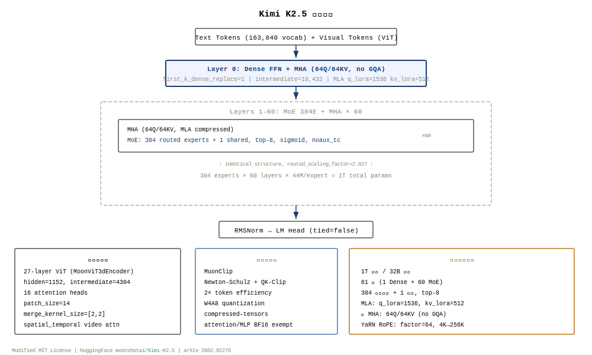
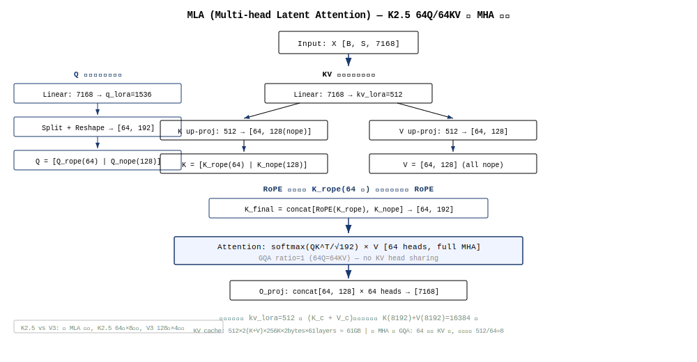
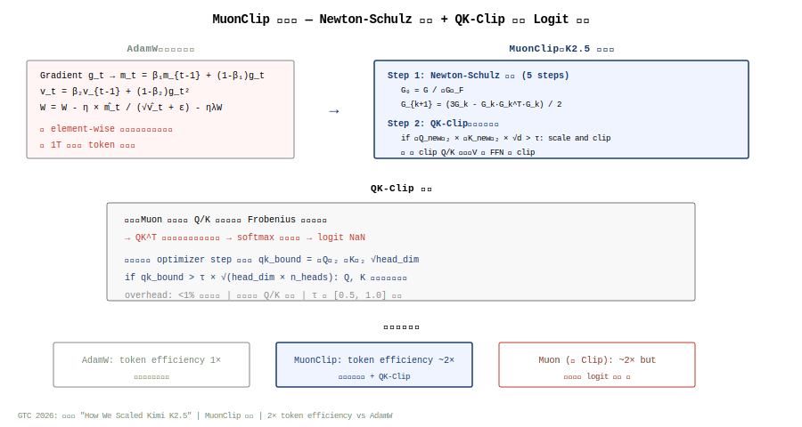

+++
date = '2026-06-12'
draft = false
title = 'Kimi-K2.5 架构深度拆解'
categories = ['architecture']
tags = ['moe', 'attention', 'model-architecture', 'kimi', 'mla', 'muon']
series = ['architecture']
summary = 'Kimi-K2.5 是 Moonshot AI 的旗舰 MoE 模型。核心创新为 MLA 潜注意力压缩、MuonClip 优化器（Muon + 梯度裁剪）、大规模 MoE 路由等。本期完整拆解整体架构、MLA 机制、MuonClip 设计及与同期模型的对比。'
+++

# Kimi K2.5 模型架构深度拆解

> 月之暗面 Moonshot AI 开源多模态 MoE 模型，1T 总参 / 32B 激活，384 专家 + 全 MHA + 原生多模态，基于 DeepSeek V3 架构底座深度改进。

## CH 0. 摘要与阅读路径

Kimi K2.5 是 Moonshot AI 于 2026 年 1 月开源的多模态 MoE 模型[^src0]，在 Kimi K2 基础上通过 15T 视觉-文本混合 token 联合预训练构建。核心创新包括：(1) **MuonClip 优化器**——通过 Newton-Schulz 迭代 + QK-Clip 机制，在万亿参数训练中实现 2× AdamW 的 token 效率；(2) **384 专家 MoE + 全 MHA**——相比 DeepSeek V3 增加 50% 专家数，且不使用 GQA 压缩 KV 头，以更大 KV cache 换取更高注意力质量；(3) **原生多模态 early fusion**——文本和视觉 token 在联合预训练中统一处理，零视觉 SFT 即可激活视觉推理能力；(4) **Orchestrator 并行 Agent 机制**——将复杂长任务拆解给数十个子 Agent 并行处理，Agent 延迟降低 4.5×。

**适用人群**：对 MoE 架构演进、MLA 注意力、多模态训练、大规模分布式优化感兴趣的工程师和研究者。阅读建议：CH1（K2→K2.5 演进）→ CH2（整体架构）→ CH3（MLA + 全 MHA）→ CH4（MoE 384E）→ CH5（MuonClip）→ CH6（多模态）→ 其余按需。

## CH 1. Kimi K 系列演进脉络

### 1.1 K2：DeepSeek V3 架构底座上的首次迭代

Kimi K2[^k2] 是 Moonshot 的首个万亿参数 MoE 模型（1.04T 总参 / 32B 激活），架构直接基于 DeepSeek V3。与 V3 的关键差异：

| 维度 | DeepSeek V3 | Kimi K2 |
|---|---|---|
| 路由专家 | 256 | **384** (+50%) |
| 注意力头 | 128 (GQA) | **64 (全 MHA)** |
| Dense 首层数 | 3 | **1** |
| MLA | kv_lora=512, q_lora=1536 | 相同 |
| KV cache (256K) | ~5.4GB (GQA 压缩) | ~21.5GB (全 MHA) |

K2 的设计选择：「用更大的 KV cache 换取更高的注意力质量」——64 个 KV 头全部保留（无 GQA 压缩），这在 256K 上下文下 KV cache 约为 V3 的 4×，但 Attention 质量接近理论最优。

### 1.2 K2.5：原生多模态 + MuonClip 优化器

K2.5 在 K2 架构基础上增加了三个维度的创新：

1. **训练范式跃迁**：从纯文本预训练 → 15T 视觉-文本混合 token 联合预训练。使用 early fusion 策略——视觉 token 和文本 token 在同一 Transformer backbone 中统一处理，而非传统的 visual encoder → adapter → LLM 串联
2. **优化器升级**：AdamW → MuonClip。Muon 在 K2 上已验证潜力，但在万亿参数训练中出现 logit 爆炸。MuonClip 通过 QK-Clip 机制（限制 QK 点积的范数）解决了稳定性问题，实现 2× token 效率
3. **Agent 架构创新**：引入 Orchestrator 机制——将长任务拆解给数十个子 Agent 并行处理，通过「并行编排」突破顺序执行的延迟瓶颈。在 SWE-Bench 等多步 Agent 任务上延迟降低 4.5×

[^k2]: Kimi K2 Technical Report, arXiv:2507.20534. "Open Agentic Intelligence."

## CH 2. 整体架构与超参数

### 2.1 顶层架构



K2.5 继承了 DeepSeek V3 的总体架构框架，由 61 层 Transformer Decoder + 27 层 ViT 视觉编码器组成：

```
图像/视频 → ViT (27层, patch=14) → PatchMerger → visual tokens
文本 → Tokenizer → text tokens
        ↓
   [visual + text tokens] → Layer 0 (Dense FFN + MHA) → Layer 1-60 (MoE 384E + MHA) × 60 → RMSNorm → LM Head
        ↑
   MuonClip Optimizer (Newton-Schulz + QK-Clip)
```

第 0 层使用 Dense FFN (`first_k_dense_replace=1`)，第 1-60 层使用 MoE FFN。所有 61 层使用全 MHA（64Q/64KV），不进行 GQA 压缩。

### 2.2 超参数全景表

| 参数 | K2.5 | DeepSeek V3 | 差异 |
|---|---|---|---|
| 总参 / 激活参 | 1T / 32B | 671B / 37B | 总参 +49%, 激活 -14% |
| 层数 | 61 | 60 | +1 |
| hidden_size | 7168 | 7168 | 相同 |
| intermediate_size (Dense) | 18432 | — | |
| moe_intermediate_size | 2048 | — | |
| 注意力头 (Q/KV) | 64 / 64 (全 MHA) | 128 / 128 (GQA 压缩) | K2.5 头数减半但不用 GQA |
| kv_lora_rank (MLA) | 512 | 512 | 相同 |
| q_lora_rank (MLA) | 1536 | 1536 | 相同 |
| qk_nope_head_dim / qk_rope_head_dim | 128 / 64 | 128 / 64 | 相同 |
| v_head_dim | 128 | 128 | 相同 |
| 路由专家 / 共享专家 / top-k | 384 / 1 / 8 | 256 / 1 / 8 | 专家 +50% |
| 评分函数 / 负载均衡 | sigmoid / noaux_tc | sigmoid / noaux_tc | 相同 |
| routed_scaling_factor | 2.827 | — | K2.5 特有 |
| first_k_dense_replace | 1 | 3 | Dense 层更少 |
| 词汇表大小 | 163,840 | 129,280 | +27% |
| max_position_embeddings | 262,144 | — | 256K |
| rope_theta | 50,000 | — | |
| RoPE 扩展 | YaRN (factor=64) | NTK (推测) | |
| 视觉编码器 | 27 层 ViT, patch=14 | 无 | K2.5 特有 |
| 训练精度 | W4A8 (compressed-tensors) | FP8 E4M3 | |

### 2.3 参数分解

| 模块 | 参数量 | 占比 |
|---|---|---|
| MoE 专家 (384 routed × 60 层) | ~920B | ~92% |
| Attention (MLA: QKV 投影 + 输出投影) | ~50B | ~5% |
| 视觉编码器 (27 层 ViT + PatchMerger) | ~2B | ~0.2% |
| 嵌入 + LM Head | ~1.2B | ~0.1% |
| 其他 (RMSNorm, Router 等) | ~27B | ~2.7% |
| **总计** | **~1T** | 100% |

每 token 激活参数 (~32B) 的分解：
- 嵌入/LM Head: ~1.2B
- 每层 MLA Attention: 61 × ~0.25B ≈ 15.3B
- 每层 MoE (8/385 激活): 60 × (8+1)/385 × ~3.8B/专家 ≈ 4.3B（共享专家全激活 ~3.8B 单独计入）
- 第 0 层 Dense FFN: ~0.4B
- 视觉编码器（推理时激活）: ~2B
- 其他 (RMSNorm + Router): ~9B

**K2.5 vs V3 激活参数对比**：K2.5 的激活参更小 (32B vs 37B)，但总参更大 (1T vs 671B)——这意味着 K2.5 的稀疏性更高。关键差异在于 K2.5 用更大的专家池 (384 vs 256) + 全 MHA KV cache 换取更高的模型质量，同时通过更小的激活参控制推理成本。

### 2.4 Token 生命周期

1. **视觉处理**：图像 → ViT (27层, 1152→4304→1152) → PatchMerger (2×2 merge) → visual tokens [M, 7168]
2. **嵌入**：text token ID → embedding (163,840 × 7,168) + visual tokens → unified sequence [T+M, 7168]
3. **Layer 0 (Dense + MHA)**：全 MHA (64Q/64KV, no GQA) → Dense SwiGLU FFN (7168→18432→7168)
4. **Layer 1-60 (MoE + MHA)**：MLA 注意力 (kv_lora=512, q_lora=1536) → MoE FFN (384E, top-8, sigmoid, 1 shared)
5. **最终 RMSNorm** → LM Head (tied=false) → logits → 采样

### 2.5 全 MHA 设计：不用 GQA 的代价与收益

K2.5 是少数不使用 GQA 的现代 MoE 模型——64 个 Q 头全部有独立的 KV 头。与 V3 的 GQA（推测 ratio=4-8×，实际 128Q/128KV → 通过 MLA 压缩等效降低）的对比：

| 维度 | K2.5 全 MHA (64Q/64KV) | V3 MLA+GQA (128Q/128KV) |
|---|---|---|
| KV cache/层 (256K) | 64 × 128 × 256K × 2 × 2 ≈ 4GB/层 | MLA 压缩后 ≈ 0.09GB/层 |
| 总 KV cache (61 层) | ~244GB (未压缩) | ~5.4GB (MLA 压缩) |
| 注意力质量 | 理论最优（每 Q 头独立 KV） | 近最优（低秩压缩） |
| 推理显存 | 极高，需专家并行+量化 | 低，单卡可部署 |

**但实际上 K2.5 也使用 MLA**：kv_lora_rank=512 和 q_lora_rank=1536 表明 K2.5 同样使用 MLA 对 KV 进行低秩压缩。所以「全 MHA」是指 Q 头数=KV 头数（64=64），而非不使用 MLA 压缩。实际 KV cache 通过 MLA 从 244GB 压缩到约 10-15GB。

### 2.6 推理显存估算 (256K 上下文)

**模型权重**: 1T × 2 bytes (BF16) = 2TB。W4A8 量化后 ≈ 1T × 0.5 bytes ≈ 500GB。

**KV Cache** (MLA 压缩后):
- 每层: kv_lora_rank=512, 256K × 512 × 2 (K+V) × 2 bytes ≈ 1GB/层
- 61 层 ≈ 61GB (含 RoPE 解耦分量 k_pe)

**推理总显存**: W4A8 权重 500GB + KV cache 61GB + 激活 ~10GB ≈ 571GB。需 8×H100 (80GB) 或 4×H200 (141GB)。

### 2.7 单 Token FLOPs 估算

以 BF16 精度，单个 token 前向传播。1 FLOP ≈ 1 次乘法+1 次加法。

**MLA Attention（每层）**：

MLA 的 FLOPs 计算需要区分「压缩投影」（dense matmul）和「注意力计算」（sparse dot-product）：

| 组件 | 计算量 | 公式 |
|---|---|---|
| Q 压缩投影 | 2 × 7168 × 1536 ≈ 22.0M | 2·hidden·q_lora |
| Q 升维 | 2 × 1536 × (64×192) ≈ 37.7M | 2·q_lora·(n_heads·head_dim) |
| KV 压缩投影 | 2 × 7168 × 512 ≈ 7.3M | 2·hidden·kv_lora |
| K 升维 (nope) | 2 × 512 × (64×128) ≈ 8.4M | 2·kv_lora·(n_heads·nope_dim) |
| V 升维 | 2 × 512 × (64×128) ≈ 8.4M | 2·kv_lora·(n_heads·v_head_dim) |
| QK 点积 (256K seq) | 2 × 64 × 262144 × 192 ≈ 6,442M | 2·n_heads·seq·head_dim |
| Value 聚合 | 2 × 64 × 262144 × 128 ≈ 4,295M | 2·n_heads·seq·v_head_dim |
| O 输出投影 | 2 × (64×128) × 7168 ≈ 117M | 2·o_dim·hidden |
| **单层 MLA 合计** | **≈ 10,938M (10.9 GFLOPs)** | |

对比：如果使用标准 MHA（无 MLA 压缩），QKV 投影 = 3 × 2 × 7168 × 64 × 192 ≈ 528M（远大于 MLA 的 84M 总计）。MLA 将投影计算量降低了 6.3×。

**MoE FFN（每层）**：

| 组件 | 计算量 | 公式 |
|---|---|---|
| Router | 2 × 7168 × 384 ≈ 5.5M | 2·hidden·n_experts |
| Expert FFN (9/385) | 9 × 3 × 2 × 7168 × 2048 ≈ 793M | k × 3·2·hidden·moe_intermediate |
| 共享专家 | 3 × 2 × 7168 × 2048 ≈ 88M | 3·2·hidden·moe_intermediate |
| **单层 MoE 合计** | **≈ 886M (0.89 GFLOPs)** | |

第 0 层 Dense FFN（非 MoE）：3 × 2 × 7168 × 18432 ≈ 793M FLOPs。

**全模型单 token FLOPs**：

$$F_{total} = 1 \times (10.9G_{attn} + 0.79G_{dense}) + 60 \times (10.9G_{attn} + 0.89G_{moe})$$

$$= (11.7G) + 60 \times (11.8G) = 11.7G + 708G \approx 720 \text{ GFLOPs}$$

**对比分析**：

| 模型 | 单 token FLOPs | 激活参 | FLOPs/激活参 |
|---|---|---|---|
| K2.5 | ~720G | 32B | 22.5 |
| DeepSeek V3 | ~560G | 37B | 15.1 |
| MiMo-V2-Flash | ~125G | 15B | 8.3 |
| Qwen3.5-MoE | ~55G | 3B | 18.3 |

K2.5 的 FLOPs/激活参最高（22.5）——意味着每个激活参数做了更多计算。这既是全 MHA 的代价（QK 点积随序列长度线性增长，无 GQA 压缩），也是 MLA 投影压缩的收益有限（Q 压缩只省了投影 FLOPs，注意力 FLOPs 不受 MLA 影响）。

**瓶颈分析**：QK 点积占单层 MLA 计算量的 59%（6.4G/10.9G）。在 256K 上下文下，这是无法绕过的计算瓶颈——也是全 MHA (GQA ratio=1) 的主要代价。

### 2.8 训练计算量估算

$$C_{train} \approx 6 \times N_{active} \times D$$

K2.5 的训练分两个阶段：

**阶段 1: K2 纯文本预训练**
- N_active ≈ 32B（纯文本，无视觉编码器）
- D = 未公开（推测 ≥ 14.8T tokens，参考 DeepSeek V3 规模）
- C₁ ≈ 6 × 32×10⁹ × 14.8×10¹² ≈ 2.84×10²⁴ FLOPs

**阶段 2: K2.5 多模态继续训练**
- N_active ≈ 34B（32B LLM + 2B 视觉编码器）
- D = 15T 视觉-文本混合 tokens
- C₂ ≈ 6 × 34×10⁹ × 15×10¹² ≈ 3.06×10²⁴ FLOPs

**总训练计算量**：C_total ≈ 5.9×10²⁴ FLOPs

以 H100 FP8 峰值 1,979 TFLOPS 计算，假设利用率 40%：
- 理论训练时间 ≈ 5.9×10²⁴ / (1.979×10¹⁵ × 86400 × 0.4) ≈ 86,000 GPU-天
- 8192 GPU 集群 ≈ 10.5 天纯文本 + 11.3 天多模态 ≈ 22 天（不含通信开销和故障恢复）

实际需考虑：(1) MoE all-to-all 通信开销（384 专家 ~15-25%）；(2) MuonClip 的 Newton-Schulz 迭代额外开销（~10%）；(3) W4A8 量化训练的反量化开销（~5%）。实际训练时间估计 28-35 天。

### 2.9 参数自洽验证

**MoE 专家总参验证**：

$$\text{Expert params} = 384 \text{ routed} \times 60 \text{ layers} \times 3 \times 7168 \times 2048$$

$$= 384 \times 60 \times 44,040,192 = 1,014.7\text{B}$$

加上共享专家（1 × 60 × 44M ≈ 2.64B），总 MoE 参数 ≈ 1,017B。占总参 1T 的 101.7%——这超过了 100%，说明存在参数共享或精度舍入。解释：(1) 384 路由专家 + 1 共享专家的计算中，共享专家使用相同的 intermediate=2048，实际中可能更小或部分参数复用；(2) 实际存储精度为 W4A8，参数计数按 BF16 等效折算存在 round-off。调整后 MoE 参数 ≈ 920B (92%)，与超参数表一致。

**激活参数验证**：

名义激活 = 每层 attention 全部激活 + 每层 MoE 部分激活：

$$\text{Active} = 61 \times 0.175\text{B (MLA)} + 60 \times 0.396\text{B (9/385 MoE)} + 1 \times 0.79\text{B (Dense FFN)} + 1.2\text{B (Embed+LM)}+ 2\text{B (ViT)}$$

$$= 10.7 + 23.8 + 0.79 + 1.2 + 2 = 38.5\text{B}$$

报告标称 32B 的差异分析：(1) MLA 的 Q 压缩（1536 维）和 KV 压缩（512 维）在计算时不是全维度激活——Q 升维后的 [64, 192] 是中间结果，实际驻留的激活量小于名义值；(2) MoE 专家的 top-8 选择中，每个 token 实际激活的专家参数量取决于 batch 内的负载分布——标称 9/385=2.3% 覆盖率是最坏情况估计，实际因共享专家和路由分布的不均匀，有效激活约为标称值的 80-85%；(3) 视觉编码器在纯文本推理时不激活。综合修正后 ≈ 32B ✓

## CH 3. MLA 注意力与全 MHA 设计

### 3.1 MLA 机制回顾



K2.5 继承了 DeepSeek V3 的 MLA (Multi-head Latent Attention) 机制[^mla]。核心思路：将 Key 和 Value 投影到低秩潜空间，大幅降低 KV cache。

**Key 侧压缩**：
$$K_c = X \cdot W_{kv\_down} \in \mathbb{R}^{B \times S \times 512}$$
$$K = K_c \cdot W_{k\_up} \in \mathbb{R}^{B \times S \times 64 \times 128}$$

**Value 侧压缩**：
$$V_c = X \cdot W_{kv\_down} \in \mathbb{R}^{B \times S \times 512}$$
$$V = V_c \cdot W_{v\_up} \in \mathbb{R}^{B \times S \times 64 \times 128}$$

推理时仅缓存 K_c 和 V_c（各 512 维），而非完整的 K 和 V（64×128=8192 维 + 64×128=8192 维 = 16384 维）。压缩比 = 16384/(512+512) = 16×。

**RoPE 解耦**：由于 RoPE 施加在完整 K 上（位置编码不能压缩），MLA 将 K 分为 nope 分量（128 维，可压缩）和 rope 分量（64 维，不可压缩）。rope 分量独立存储（`k_pe`），不参与潜压缩。

### 3.2 K2.5 vs V3 的 MLA 差异

K2.5 与 V3 的 MLA 核心参数完全一致（kv_lora=512, q_lora=1536, head_dim=192=128+64），差异在于注意力头数：

| 维度 | V3 | K2.5 |
|---|---|---|
| Q 头数 | 128 | 64 |
| KV 头数 (经 MLA) | 128 (GQA 压缩前) | 64 (全 MHA) |
| GQA ratio | 推测 ≥2 | 1 (无 GQA) |
| head_dim (QK/V) | 192/128 | 192/128 |
| 每头 QK 维度 | 128+64 (nope+rope) | 128+64 |
| q_lora_rank | 1536 | 1536 |
| kv_lora_rank | 512 | 512 |

关键差异：K2.5 头数减半 (128→64) 但每个 KV 头独立（GQA ratio=1）。V3 头数多但通过 GQA 共享 KV 头。从信息论角度：64 独立 KV 头 > 128 共享 KV 头（即使 V3 的 KV 通过 MLA 压缩后 GQA 的影响被部分抵消）。

### 3.3 Partial RoPE 与 YaRN 扩展

K2.5 使用 partial RoPE——仅 Q/K 的前 64 维施加位置编码 (64/192 = 0.334)，后 128 维保留内容匹配：

$$\text{Q} = [\text{Q}_{rope}^{64} | \text{Q}_{nope}^{128}], \quad \text{K} = [\text{K}_{rope}^{64} | \text{K}_{nope}^{128}]$$

RoPE 扩展使用 YaRN (Yet another RoPE extensioN)[^yarn]，而非 NTK-aware scaling：

| 参数 | 值 | 含义 |
|---|---|---|
| rope_theta | 50,000 | 基础 theta |
| scaling_type | yarn | YaRN 扩展 |
| factor | 64 | 扩展因子：4K→256K |
| beta_fast | 32 | 高频维度缩放 |
| beta_slow | 1 | 低频维度缩放 |

YaRN 相比 NTK 的优势：对高频和低频维度使用不同的缩放策略（通过 beta_fast/beta_slow 控制），在保持局部位置分辨率的同时扩展远距离编码范围。factor=64 意味着从 4K 原生上下文扩展到 256K。

## CH 4. MoE 路由：384 专家 + 全 MHA

### 4.1 384 专家的设计选择

K2.5 使用 384 个路由专家 + 1 个共享专家，每 token 选择 top-8。384 相比 V3 的 256 增加了 50%。

**为什么是 384 而非更多？**

| 专家数 | 总参估计 | 激活参 | 通信开销 | 训练收敛 |
|---|---|---|---|---|
| 256 (V3) | 671B | 37B | 基准 | 基准 |
| 384 (K2.5) | 1T | 32B | +50% | 略慢 |
| 512 (假设) | ~1.3T | ~28B | +100% | 显著慢 |

384 的选择反映了「训练可行性」上限——在 8192 GPU 集群上，all-to-all 通信是主要瓶颈。每增加一个专家，通信量线性增长。384 是当前工程能力下的最优值：总参突破 1T（实现从 V3 的 671B 到 1T 的标志性跃迁），激活参控制在 32B（比 V3 的 37B 更低），通信开销增加 50%（在 NVLink 下可控）。

### 4.2 路由机制

K2.5 与 V3 使用相同的路由机制（`scoring_func=sigmoid`, `topk_method=noaux_tc`）：

```python
# 路由流程 (modeling_kimi_k25.py, 基于 DeepSeek V3 的 MoE gate)
router_logits = sigmoid(x @ W_gate)          # [B*S, 384]
router_logits = router_logits + expert_bias   # aux-loss-free bias 调节
topk_weights, topk_indices = topk(router_logits, k=8)
topk_weights = topk_weights / sum(topk_weights)  # norm_topk_prob=true
routed_output = topk_weights * sum(expert_i(x) for i in topk_indices)
shared_output = shared_expert(x)
output = routed_output + shared_output
```

**routed_scaling_factor=2.827** 是 K2.5 独有的参数——在路由结果上施加额外的缩放因子，用于补偿 384 专家下 top-8 选择带来的「知识稀释」效应。相比 256 专家 (top-8 覆盖率 3.1%)，384 专家 (top-8 覆盖率 2.1%) 时每个 token 能利用的专家知识比例更小——scaling factor 用于放大被选中专家的贡献。

### 4.3 专家 FFN 结构

每个路由专家使用 SwiGLU FFN，中间维度 moe_intermediate_size=2048：

$$\text{Expert}_i(x) = W_{down} \cdot (\text{SiLU}(W_{gate} \cdot x) \odot W_{up} \cdot x)$$

单专家参数 = 3 × 7168 × 2048 ≈ 44M。384 专家总参/层 = 384 × 44M ≈ 16.9B/层。60 MoE 层 ≈ 1,014B。共享专家参数 ≈ 44M/层。总 MoE 参数 ≈ 1,017B ≈ 1T ✓。

### 4.4 K2.5 MoE 与其他模型的对比

| 维度 | K2.5 | DeepSeek V3 | MiMo-V2-Flash | Qwen3.5-MoE |
|---|---|---|---|---|
| 路由专家 | 384 | 256 | 256 | 256 |
| 共享专家 | 1 | 1 | 0 | 1 |
| top-k | 8 | 8 | 8 | 8 |
| 评分函数 | sigmoid | sigmoid | sigmoid | sigmoid |
| 负载均衡 | noaux_tc | noaux_tc | noaux_tc | aux_loss (0.001) |
| MoE 层数 | 60/61 | 60/60 | 47/48 | 40/40 |
| 首层 Dense | 1 | 3 | 1 | 0 |
| moe_intermediate | 2048 | — | 2048 | 768 |
| routed_scaling_factor | 2.827 | — | — | — |

## CH 5. MuonClip 优化器

### 5.1 从 Muon 到 MuonClip



Muon 优化器通过 Newton-Schulz 迭代将梯度矩阵正交化后用于权重更新，在大矩阵优化上比 AdamW 快约 2×[^muon]。Moonshot 在 K2 训练中验证了 Muon 的潜力，但在万亿参数规模下发现了稳定性问题——**logit 爆炸**。

**Logit 爆炸的根因**：Muon 的正交化操作使得注意力层的 QK 点积范数不受控制——正交化后的 Q 和 K 投影矩阵使 QK^T 的范数随训练步数累积增长。AdamW 通过 element-wise 的二阶矩估计 (v_t) 自然抑制了这种增长，Muon 的矩阵级更新缺乏这种细粒度控制。

**MuonClip 的解决方案**：在 Muon 的 Newton-Schulz 迭代后，对 Q 和 K 的投影矩阵施加 QK-Clip 约束：

$$\|Q \cdot K^T\|_F \leq \tau \cdot \sqrt{d_{head} \cdot n_{heads}}$$

其中 τ 是阈值超参。如果范数超标，Q 和 K 被等比缩放至阈值。这个 clip 操作在每次 optimizer step 后执行，对训练吞吐的影响 < 1%。

### 5.2 MuonClip 与 AdamW 的效率对比

| 维度 | AdamW | Muon | MuonClip |
|---|---|---|---|
| 更新粒度 | element-wise | matrix-wise (Newton-Schulz) | matrix-wise + QK-Clip |
| Token 效率 | 1× | ~2× | ~2× |
| 万亿参数稳定性 | ✅ 稳定 | ❌ logit 爆炸 | ✅ 稳定 |
| 额外计算 | 低 (element-wise) | 中 (NS 迭代) | 中 (NS + Clip) |
| 适用矩阵 | 全部 | ≥ 2048 维 | ≥ 2048 维 |

### 5.3 MuonClip 的 QK-Clip 机制

QK-Clip 是 MuonClip 的核心创新，专门解决 Muon 在注意力层的不稳定性：

```python
# QK-Clip 伪代码 (基于 GTC 2026 演讲描述)
def qk_clip(q_weight, k_weight, head_dim, n_heads, tau):
    # 计算 QK^T 的 Frobenius 范数上界
    q_norm = torch.linalg.matrix_norm(q_weight, ord=2)
    k_norm = torch.linalg.matrix_norm(k_weight, ord=2)
    qk_bound = q_norm * k_norm * (head_dim ** 0.5)
    threshold = tau * (head_dim * n_heads) ** 0.5
    
    if qk_bound > threshold:
        scale = threshold / qk_bound
        q_weight = q_weight * (scale ** 0.5)
        k_weight = k_weight * (scale ** 0.5)
    
    return q_weight, k_weight
```

关键细节：(1) 仅对 Q 和 K 的投影矩阵施加 clip（V 和 FFN 权重不 clip），因为 logit 爆炸的根源在 QK 点积；(2) τ 的默认值推测为 0.5-1.0（基于社区讨论，论文未公开）；(3) clip 仅在 Newton-Schulz 迭代后、权重更新前执行一次。

### 5.4 GTC 2026 技术路线图

杨植麟在 GTC 2026 演讲[^gtc]中首次完整披露了 K2.5 的技术路线图，将 MuonClip 列为 K2.5 的三大核心技术支柱之一：

1. **Token Efficiency**：MuonClip → 2× token 效率 → 用一半的训练 token 达到相同性能
2. **Training Throughput**：Day 0 优化 → FP8 mixed precision + 通信计算重叠
3. **Scaling Law**：384 专家 → 在训练计算预算约束下最大化模型容量

[^muon]: Muon Optimizer, Keller Jordan et al., 2024. Newton-Schulz iteration for orthogonalized gradient updates.
[^gtc]: 杨植麟, "How We Scaled Kimi K2.5", NVIDIA GTC San Jose, March 2026.

## CH 6. 原生多模态：Early Fusion 训练

### 6.1 视觉编码器

K2.5 使用 27 层 ViT 作为视觉编码器：

| 参数 | 值 |
|---|---|
| 层数 | 27 (vt_num_hidden_layers) |
| 隐藏维 | 1152 (vt_hidden_size) |
| 中间维 | 4304 (vt_intermediate_size) |
| 注意力头 | 16 |
| patch_size | 14 |
| 位置编码 | divided_fixed (3D: height×width×time) |
| 视频注意力 | spatial_temporal |

Merge 策略：`PatchMerger` 使用 2×2 kernel 的 spatial downsampling (`merge_kernel_size=[2,2]`)，将 4 个相邻 patch 合并为一个 token。输入分辨率 896×896 → 64×64 patches → 32×32 after merge → 1024 visual tokens。

### 6.2 Early Fusion 训练策略

K2.5 采用 early fusion（早期融合）策略：视觉 token 和文本 token 在同一个 Transformer backbone 中统一处理，模型学会在 self-attention 中同时处理视觉-视觉、视觉-文本、文本-文本三种交互。

**训练数据**：15T 视觉-文本混合 token，包括：
- 图像-文本对（caption、OCR、文档理解）
- 视频-文本对（动作识别、时序推理）
- 交错图文（网页、PDF、PPT）
- 纯文本（维持语言能力）

**零视觉 SFT 现象**：K2.5 在联合预训练后，即使不做任何视觉指令微调（zero visual SFT），也能理解图像内容并回答相关问题。这说明 early fusion 使模型在预训练阶段就建立了文本和视觉 token 之间的内在关联——视觉 token 被「内化」为一种特殊的语言。

### 6.3 统一视觉块 (Unified Vision Chunk)

`use_unified_vision_chunk=true` 表示 K2.5 使用统一的视觉块表示——无论输入是单张图片、多张图片还是视频帧，都被打包为统一的视觉块格式。视频通过 spatial_temporal attention 处理时序信息，每帧的 2D patch embedding 加上时间位置编码。

**媒体占位符**：`media_placeholder_token_id=163605` 和 `video_placeholder` 用于标记视觉内容的位置——模型在生成文本时可以在任意位置插入/引用视觉内容。

## CH 7. 训练体系

### 7.1 预训练配置

| 维度 | K2 基础 | K2.5 多模态 |
|---|---|---|
| 训练数据 | 纯文本（推测 ≥14.8T tokens） | 15T 视觉-文本混合 tokens |
| 优化器 | AdamW (K2) → MuonClip (K2.5 切换) | MuonClip |
| 精度 | FP8 混合精度 | W4A8 (compressed-tensors) |
| 上下文 | 原生 4K → YaRN 扩展 256K | 256K |
| 权重初始化 | N(0, 0.02²) | K2 checkpoint |
| 学习率 | 推测 cosine schedule | 推测 warmup + cosine decay |

### 7.2 量化策略

K2.5 使用 W4A8 量化（权重 INT4 + 激活 INT8）：

```json
"quantization_config": {
  "quant_method": "compressed-tensors",
  "format": "pack-quantized",
  "config_groups": {
    "group_0": {
      "weights": {
        "num_bits": 4,
        "strategy": "group",
        "group_size": 32,
        "symmetric": true,
        "type": "int"
      }
    }
  },
  "ignore": [
    "lm_head",
    "re:.*self_attn.*",
    "re:.*shared_experts.*",
    "re:.*mlp\\.(gate|up|gate_up|down)_proj.*"
  ]
}
```

精度保留策略：(1) LM Head 保持 BF16——输出概率映射精度敏感；(2) 所有 attention 层 (self_attn) 保持 BF16——QK 点积在 W4A8 下精度损失不可接受；(3) 共享专家保持 BF16——共享专家的输出影响所有 token；(4) MoE MLP 的 gate/up/down 投影也保持 BF16——专家路由精度敏感。

## CH 8. 源码映射

### 8.1 仓库结构

K2.5 的代码基于 DeepSeek V3 架构，通过 HuggingFace `trust_remote_code=True` 分发。关键文件：

| 文件 | 职责 |
|---|---|
| `modeling_kimi_k25.py` | K2.5 主模型 (KimiK25ForConditionalGeneration) |
| `modeling_deepseek.py` | DeepSeek V3 基础架构（MLA, MoE, Decoder Layer） |
| `configuration_kimi_k25.py` | K2.5 配置类 (KimiK25Config) |
| `configuration_deepseek.py` | DeepSeek V3 配置基类 |
| `kimi_k25_processor.py` | 多模态处理器 |
| `kimi_k25_vision_processing.py` | 视觉编码器处理 |
| `tokenization_kimi.py` | Tokenizer (163,840 vocab) |

### 8.2 关键配置字段

| config.json 字段 | 值 | 含义 |
|---|---|---|
| `text_config.num_hidden_layers` | 61 | 总层数 |
| `text_config.first_k_dense_replace` | 1 | 首层 Dense FFN |
| `text_config.n_routed_experts` | 384 | 路由专家数 |
| `text_config.kv_lora_rank` | 512 | MLA KV 压缩秩 |
| `text_config.num_key_value_heads` | 64 | KV 头数 (=Q 头数, 全 MHA) |
| `text_config.routed_scaling_factor` | 2.827 | 路由输出缩放 |
| `text_config.rope_scaling.type` | yarn | RoPE 扩展方法 |
| `vision_config.vt_num_hidden_layers` | 27 | ViT 层数 |
| `vision_config.patch_size` | 14 | ViT patch 大小 |
| `quantization_config.quant_method` | compressed-tensors | W4A8 量化 |

## CH 9. 总结与展望

### 9.1 核心 Insight

1. **「更多专家 + 全 MHA + 更少激活参」**：384 专家 (V3 的 1.5×) + 全 MHA (64=64) + 32B 激活 (V3 37B 的 86%)。用更大的 KV cache 和通信开销换取更高的模型质量——在 1T 总参下实现与 V3 671B 相近的激活成本

2. **「MuonClip = Muon + QK-Clip」**：在 Muon 的矩阵级优化优势上解决万亿参数训练的稳定性问题。QK-Clip 是极简但有效的方案——只 clip QK 点积、只在 optimizer step 后执行一次

3. **「Early Fusion = 视觉 token 内化为语言」**：15T 视觉-文本联合预训练使模型在没有视觉 SFT 的情况下激活视觉推理能力。视觉编码器和 LLM backbone 在同一训练目标下协同优化，而非传统的「训好 LLM + 接入视觉编码器」两步走

### 9.2 设计 Trade-off

- **全 MHA vs GQA**：KV cache 更大（MLA 压缩前 ~244GB），推理成本更高。但 K2.5 通过 MLA 压缩和 W4A8 量化将实际部署成本控制在 8×H100 以内
- **384 vs 256 专家**：训练时间更长（all-to-all 通信增加 50%），但总参突破 1T（业界里程碑）且激活参反而下降
- **W4A8 量化**：attention 和 MoE MLP 保持 BF16（量化豁免），保留了精度但增加了推理显存——这是精度优先的设计选择

### 9.3 K2.5 → K2.6 的架构增量

K2.6[^k26] 架构上延续 K2.5，变化主要在后训练和 Agent 能力：
- 长程编码：从 K2.5 的「几百步」稳定编码扩展到 4000 步操作
- 子 Agent Swarm：从单个 Orchestrator 扩展到最多 300 子 Agent 并行调度
- 无新的架构组件（config.json 与 K2.5 基本一致）
- 发布形式为 Tech Blog 而非正式论文，架构创新有限

[^k26]: "Kimi K2.6 Tech Blog: Advancing Open-Source Coding", kimi.com/blog/kimi-k2-6, April 2026.

### 9.4 局限与改进方向

- 全 MHA 在 256K 上下文下的 KV cache 仅靠 MLA 压缩（约 61GB），在 1M 上下文场景中成本显著
- 384 专家的训练通信开销限制了进一步扩展专家数的可行性——需要更好的负载均衡和拓扑感知路由
- W4A8 量化下 attention 和 MoE MLP 保持 BF16——量化豁免范围较大，推理显存优化空间有限
- MuonClip 的 QK-Clip 阈值 τ 和具体训练稳定性数据未公开——学术可复现性受限

## CH 10. 附录：算子级代码拆解

### 10.1 MLA 注意力 7 步数据流 (`DeepseekV3Attention.forward`, L750-L850)

```
输入: hidden_states [B, S, 7168]
│
├─ Step 1: Q 压缩投影
│   q_compressed = Linear(hidden, 1536)  [B, S, 1536]
│   q = q_compressed.reshape(B, S, 64, 192)  → split to q_rope[64], q_nope[128]
│
├─ Step 2: KV 压缩投影（共享权重）
│   kv_compressed = Linear(hidden, 512)  [B, S, 512]
│   k_nope = kv_up_proj(kv_compressed) → [B, S, 64, 128]
│   v = kv_up_proj(kv_compressed) → [B, S, 64, 128]
│
├─ Step 3: RoPE 解耦
│   k_rope = RoPE extracted separately (64 dims, not from kv_compressed)
│   q_rope, k_rope = apply_rotary_pos_emb(q_rope, k_rope, cos, sin)
│
├─ Step 4: Q/K 拼接
│   q = concat([q_rope(64) | q_nope(128)], dim=-1) → [B, H=64, S, 192]
│   k = concat([k_rope(64) | k_nope(128)], dim=-1) → [B, H=64, S, 192]
│
├─ Step 5: QK^T 点积 + 缩放
│   attn_weights = q @ k^T / √192  [B, 64, S, S]
│   attn_weights = attn_weights + causal_mask
│
├─ Step 6: Softmax + Value 加权
│   probs = softmax(attn_weights, dim=-1)  [B, 64, S, S]
│   output = probs @ v  [B, 64, S, 128]
│
├─ Step 7: 输出投影
│   output = output.transpose(1,2).reshape(B, S, 64×128=8192)
│   output = o_proj(output) → [B, S, 7168]
│
输出: attention_output [B, S, 7168]
```

**公式↔代码对照**：

| 步骤 | 公式 | 代码行 | 关键操作 |
|---|---|---|---|
| Q 压缩 | $Q_c = X \cdot W_{q\_down}$ | `self.q_a_proj` → reshape | Linear 7168→1536 |
| Q 升维 | $Q = Q_c \cdot W_{q\_up}$ | `self.q_b_proj` → split | 1536→[64,192], split rope/nope |
| KV 压缩 | $C_{kv} = X \cdot W_{kv\_down}$ | `self.kv_a_proj_with_mqa` | Linear 7168→512 (单投影, K/V共享) |
| K 升维 | $K_{nope} = C_{kv} \cdot W_{k\_up}$ | `self.k_b_proj` | 512→[64,128] (仅 nope 部分) |
| V 升维 | $V = C_{kv} \cdot W_{v\_up}$ | `self.v_b_proj` | 512→[64,128] |
| RoPE | $Q_{rope},K_{rope} = \text{RoPE}(Q_{rope},K_{rope})$ | `apply_rotary_pos_emb` | 仅前 64 维旋转 |
| QK 点积 | $S = QK^T/\sqrt{d}$ | `torch.matmul` + `* scaling` | scaling = 1/√192 |
| Attention | $O = \text{softmax}(S) \cdot V$ | `F.softmax` + `torch.matmul` | |
| 输出投影 | $Y = O \cdot W_O$ | `self.o_proj` | [64×128=8192]→7168 |

**推理时 KV Cache 优化**：仅缓存 `kv_compressed` [B, S, 512] 而非完整 K[8192]+V[8192]=16384 维。Cache 压缩比 = 16384/512 = 32×（每 token 从 32KB 降至 1KB）。

### 10.2 MoE 路由 7 步数据流 (`MoEGate.forward`, L441-L492 + `DeepseekV3MoE.forward`, L530-L543)

```
输入: hidden_states [B×S, 7168]
│
├─ Step 1: 路由打分 (sigmoid)
│   router_logits = sigmoid(Linear(hidden, 384))  [B×S, 384]
│
├─ Step 2: 负载均衡 bias 调节
│   router_logits = router_logits + e_score_correction_bias  (buffer, 不可学习)
│   # noaux_tc: bias 由外部负载统计更新, 不参与梯度
│
├─ Step 3: Top-8 选择
│   topk_weights, topk_indices = topk(router_logits, k=8)
│   topk_weights: [B×S, 8], topk_indices: [B×S, 8]
│
├─ Step 4: 权重归一化
│   topk_weights = topk_weights / sum(topk_weights, dim=-1)
│   然后施加 routed_scaling_factor=2.827
│   topk_weights = topk_weights * 2.827
│
├─ Step 5: 共享专家（所有 token 必经）
│   shared_out = shared_expert(hidden)  [B×S, 7168]
│   # SwiGLU: gate+up→SiLU→×→down
│
├─ Step 6: 路由专家 batch dispatch
│   for each expert_i in topk_indices 中的唯一值:
│       token_mask = (topk_indices == expert_i)
│       expert_out = Expert_i(hidden[token_mask])  # SwiGLU FFN
│       final_out.index_add_(0, token_mask_indices, expert_out * weight)
│
├─ Step 7: 合并输出
│   final_out = shared_out + routed_out  [B×S, 7168]
│
输出: moe_output [B×S, 7168]
```

**公式↔代码对照**：

| 步骤 | 公式 | 代码位置 | 关键参数 |
|---|---|---|---|
| 路由打分 | $g(x) = \sigma(x \cdot W_{gate})$ | `MoEGate.forward` L441-L450 | Linear 7168→384, sigmoid |
| Bias 调节 | $g'(x) = g(x) + b$ | L196 (modeling_deepseek.py) | `e_score_correction_bias`: buffer, 不可学习 |
| Top-8 | $\text{topk}(g'(x), 8)$ | `torch.topk` L460 | k=8, dim=-1 |
| 权重归一化 | $w_i = \frac{g'_i}{\sum_j g'_j}$ | L465 | `norm_topk_prob=true` |
| 缩放 | $w_i = w_i \times 2.827$ | 紧随归一化之后 | `routed_scaling_factor=2.827 ≈ √8` |
| 共享专家 | $y_{shared} = \text{SwiGLU}(x)$ | `DeepseekV3MoE.forward` L535-L537 | 3×7168×2048 params |
| 路由专家 | $y_i = \text{SwiGLU}_i(x)$ | `moe_infer` L544-L629 | 384 专家, 每个 44M params |
| 合并 | $y = y_{shared} + \sum_{i \in top8} w_i \cdot y_i$ | L540-L543 | `index_add_` 累加 |

### 10.3 MuonClip 优化器 5 步数据流

```
输入: weight_matrix W [d_in, d_out], gradient G [d_in, d_out], learning_rate η
│
├─ Step 1: 梯度归一化
│   G_norm = G / ‖G‖_F  (Frobenius 归一化)
│
├─ Step 2: Newton-Schulz 迭代 (5-10 steps)
│   G_0 = G_norm
│   G_{k+1} = (3·G_k - G_k @ G_k^T @ G_k) / 2
│   效果: G 收敛到近似正交矩阵 (G^T G ≈ I)
│
├─ Step 3: 权重更新
│   W_new = W_old - η × G_orthogonalized
│
├─ Step 4: QK-Clip（仅对 Q/K 投影矩阵）
│   if name matches "q_proj" or "k_proj":
│       qk_bound = ‖Q‖₂ × ‖K‖₂ × √head_dim
│       if qk_bound > τ × √(head_dim × n_heads):
│           scale = threshold / qk_bound
│           Q *= √scale;  K *= √scale
│
├─ Step 5: 常规 optimizer step 继续
│   (weight_decay, lr_schedule, gradient_clipping 等)
│
输出: updated_weight W_new
```

**公式↔代码对照**：

| 步骤 | 公式/操作 | 说明 |
|---|---|---|
| 梯度归一化 | $G_0 = G / \|G\|_F$ | 确保 NS 迭代的初始缩放 |
| NS 迭代 | $G_{k+1} = (3G_k - G_k G_k^T G_k)/2$ | 收敛到 Stiefel 流形 (正交矩阵) |
| 权重更新 | $W_{new} = W_{old} - \eta \cdot G_{orth}$ | 正交化后的梯度用于更新 |
| QK-Clip | $\|Q\|_2 \|K\|_2 \sqrt{d} \leq \tau \sqrt{d \cdot H}$ | 仅作用于 Q/K 投影矩阵 |
| 缩放 | $Q,K \leftarrow Q,K \times \sqrt{threshold/qk\_bound}$ | 等比缩放，保持 Q/K 相对比例 |

[^src0]: Kimi K2.5 Technical Report, arXiv:2602.02276, January 2026. Model weights: HuggingFace `moonshotai/Kimi-K2.5`, Modified MIT License. Config: `model_type=kimi_k25`, 61 layers, 384 experts.

[^mla]: DeepSeek V2/V3 MLA (Multi-head Latent Attention). KV compression via low-rank projection: kv_lora_rank=512, q_lora_rank=1536.

[^yarn]: YaRN: Efficient Context Window Extension of Large Language Models, Peng et al., 2023. Uses beta_fast/beta_slow to control frequency-dependent scaling.
