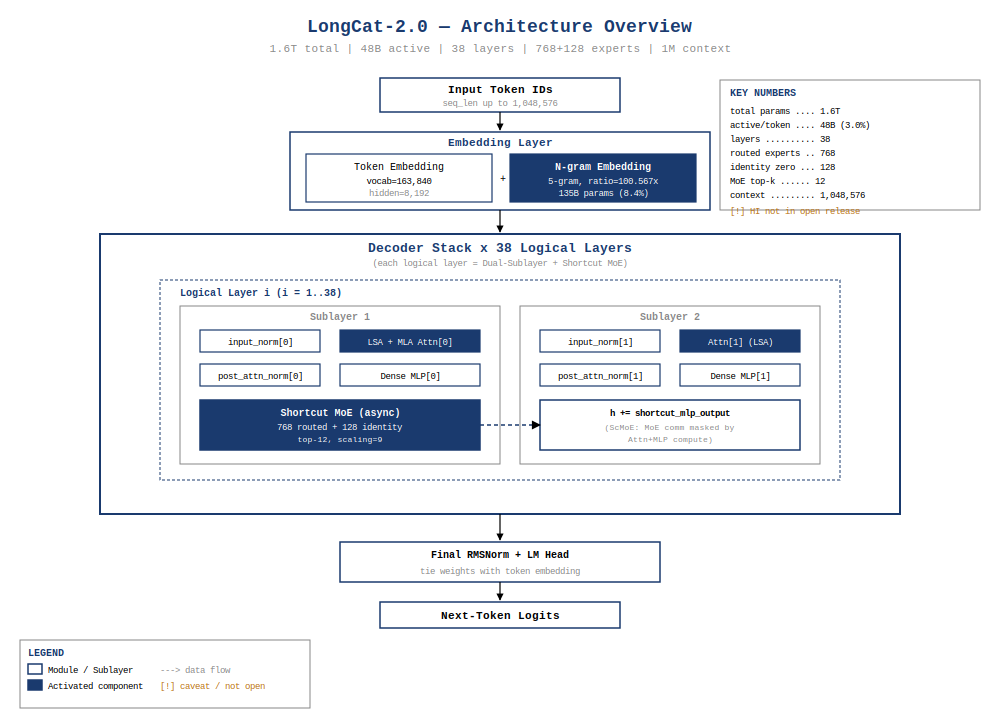
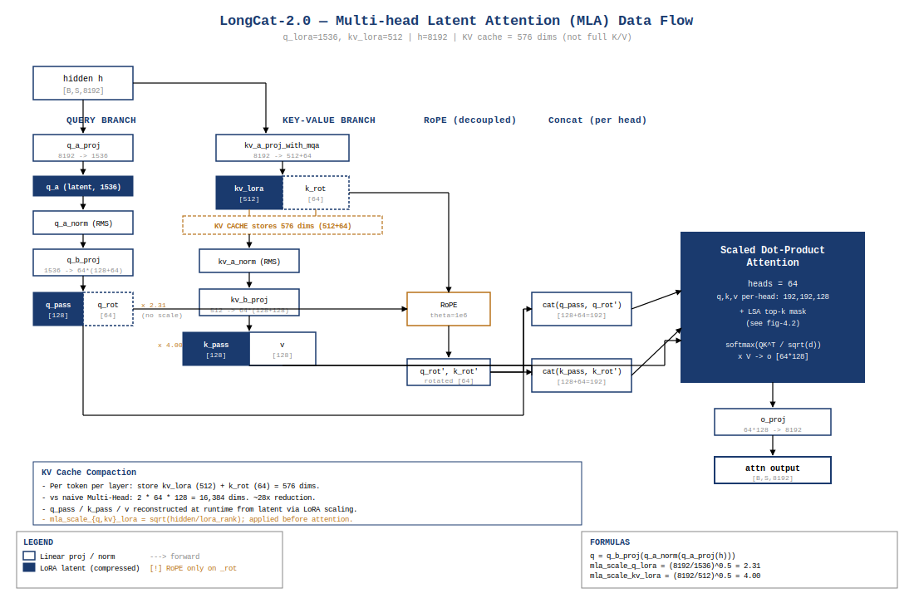
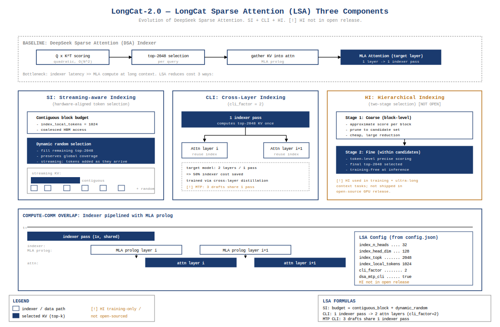
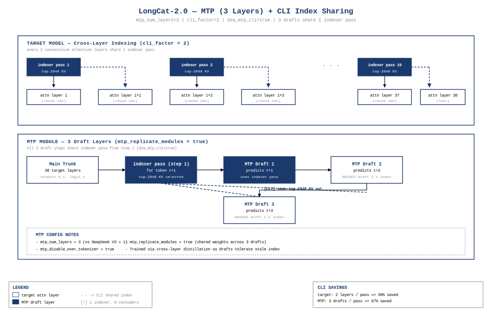
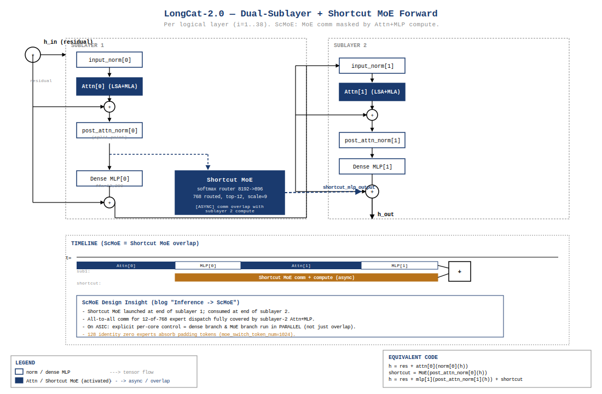
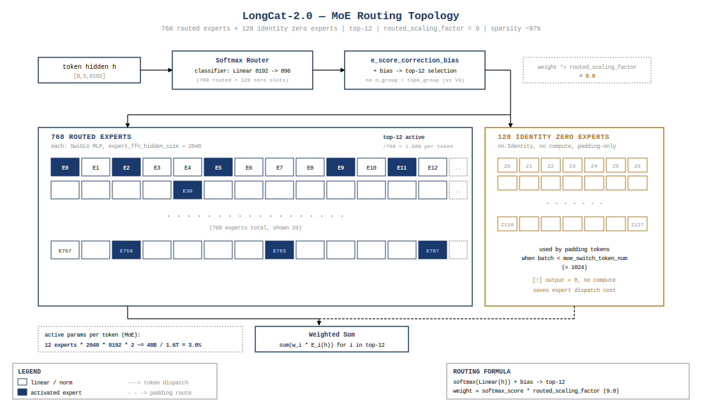
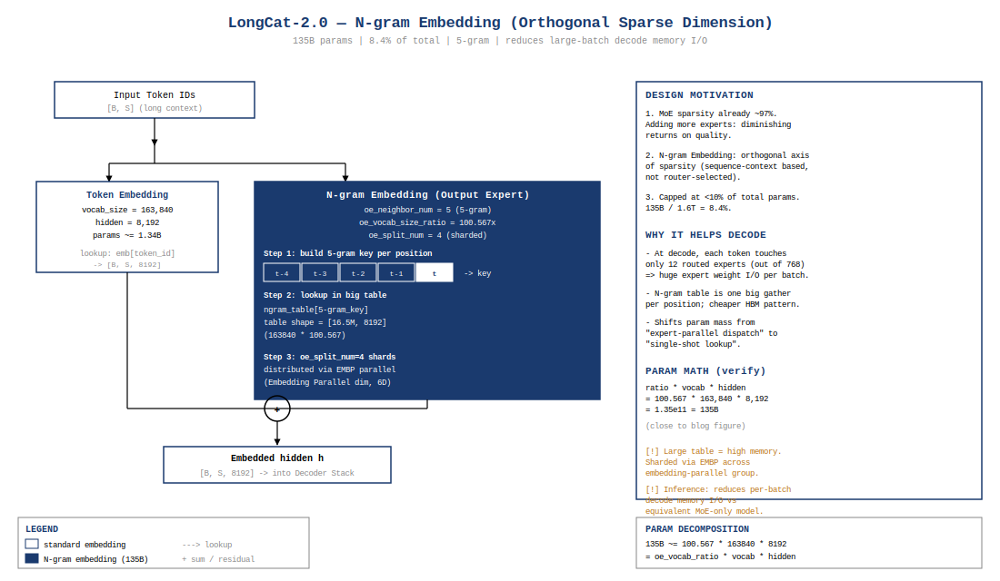
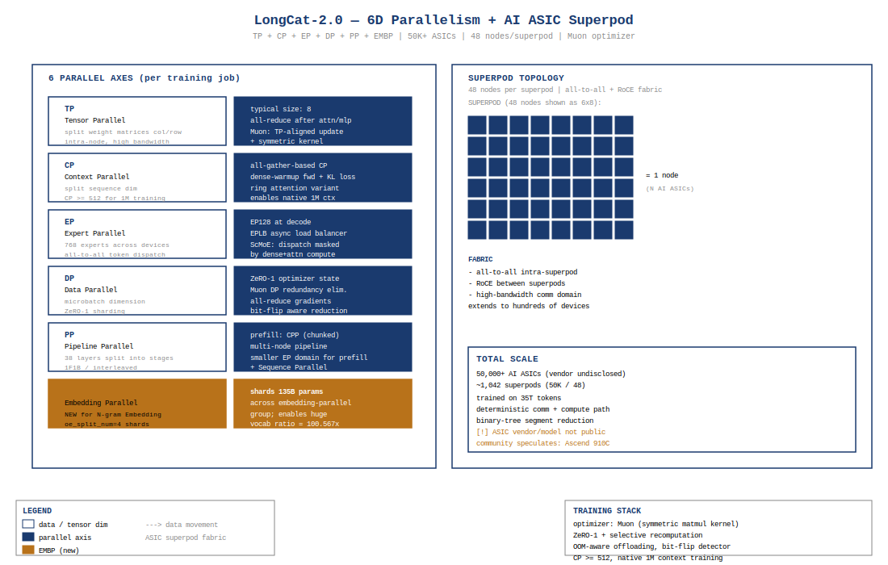

+++
math = true
date = '2026-07-07'
draft = false
title = 'Meituan LongCat-2.0 架构深度拆解'
categories = ['architecture']
vendor = 'Meituan'
tags = ['moe', 'attention', 'model-architecture', 'meituan', 'longcat', 'mla', 'lsa', 'mtp', 'multimodal']
series = ['architecture']
summary = '美团 LongCat-2.0 是总参 1.6T、激活 48B（3.0%）的超大 MoE，原生 1M 上下文。三大创新：Dual-Sublayer + Shortcut MoE（每逻辑层=2 Attention 子层 + 2 Dense MLP + 1 Shortcut MoE）、LongCat Sparse Attention（LSA = SI/CLI/HI 三件套）、N-gram Embedding（独立于 MoE 的稀疏维度，135B 参数）。本期完整拆解 1.6T 配置、38 逻辑层 × 76 物理子层、768E + 128 zero experts、FLOPs/KV Cache、MLA+LSA、训练与推理体系。'
+++


## CH 0 摘要与阅读路径

美团 LongCat-2.0 是一款总参数量 **1.6T**[^src1]、每 token 激活参数 **48B**[^src2]（激活率 3.0%）的混合专家（MoE）大语言模型，于 2026/06/30 由美团 LongCat 团队开源，原生支持 **1M（1,048,576）** token 上下文[^src3]，训练规模 **35T tokens**[^src4]，在 **50K+ AI ASIC**[^src5] 上完成训练。

相比前代 LongCat-Flash，本代引入三项正交稀疏设计：（1）**Dual-Sublayer + Shortcut MoE**（每个逻辑层 = 2 个 Attention 子层 + 2 个 Dense MLP + 1 个 Shortcut MoE）；（2）**LongCat Sparse Attention（LSA）**——DSA 的演进，含 SI/CLI/HI 三件套；（3）**N-gram Embedding**——一个独立于 MoE 的稀疏维度，参数量 **135B**[^src6]，占总参 8.4%。模型配置为 **38 个逻辑层（76 个物理子层）**[^src7]、hidden_size=8192、**768 个路由专家 + 128 个 identity zero 专家**[^src8]、top-12 路由。

**阅读路径**：CH 1 演进定位 → CH 2 超参与参数分解（自洽闭合到 1.6T）→ CH 3 计算与性能（FLOPs/KV cache 独立重算）→ CH 4 MLA + LSA → CH 5 Dual-Sublayer + MoE → CH 6 N-gram Embedding → CH 7 训练体系 → CH 8 推理体系 → CH 9 总结。

[^src1]: README + 官方博客一致披露，3 处来源（HF Model Card / longcat.chat/blog/longcat-2.0 / config 总和验证）
[^src2]: 官方博客「LongCat-2.0」节，激活参数 = top-12 expert × expert FFN + Dense MLP + MLA + N-gram Embedding
[^src3]: 官方博客「1M-context data」节；config.json `max_position_embeddings` = 262144，通过 YaRN factor=120 外推至 1M
[^src4]: 官方博客「Training」节 + README 一致
[^src5]: 官方博客「Training」节，原话「50,000+ AI ASIC」；具体型号未公开
[^src6]: 官方博客「N-gram Embedding」节，明确「135B parameters, accounting for 8.4% of total」
[^src7]: config.json `num_layers` = 38；源码 `model.py:L38` 强制 `num_hidden_layers = 2 * num_layers` = 76 物理子层
[^src8]: config.json `n_routed_experts` = 768 + `zero_expert_num` = 128

---

## CH 1 演进脉络：LongCat-Flash → LongCat-2.0

### 1.1 前代回顾（LongCat-Flash）

LongCat-Flash 是美团 2025 年开源的 MoE + MLA 模型，奠定了 Dual-Sublayer + Shortcut MoE 的核心架构骨架。Transformers 5.12.1 内置的 `models/longcat_flash/`（719 行 modeling + 434 行 modular + 118 行 configuration）即前代实现[^src9]。LongCat-Flash 默认配置 hidden_size=6144、num_layers=28（56 物理子层）、n_routed_experts=512、max_position_embeddings=131072；其 MLA + LoRA scaling 设计（`mla_scale_q_lora` / `mla_scale_kv_lora`）在 LongCat-2.0 中完整继承。

[^src9]: `code-snippets/SOURCES.md` 双源对照表：A 源（Transformers 内置 longcat_flash）为前代 LongCat-Flash 骨架；B 源（SGLang PR #30042 `HarryWu99/sglang @ c6c36d94`，**截至 2026-07-06 仍 open 未合并**）含 LongCat-2.0 完整推理实现（含 LSA Indexer + N-gram Embedding）

### 1.2 本代定位（LongCat-2.0）

LongCat-2.0 在四条轴线上同步升级：

| 维度 | LongCat-Flash | LongCat-2.0 | 演进意图 |
|---|---|---|---|
| 总参数 | ~0.5T 量级（粗估） | **1.6T** | 与 V4-Flash/Hy3 拉开规模差距 |
| 激活参数 | ~16B | **48B** | 单 token 算力翻倍 |
| 原生上下文 | 131072 (128K) | **1M（YaRN factor=120 外推）** | 进入 agentic / 长文档赛道 |
| 训练硬件 | GPU | **AI ASIC superpod** | 美团自建 ASIC 训练栈 |
| 注意力机制 | Dense MLA | **MLA + LSA（SI/CLI/HI）** | 长上下文成本降低 |
| 稀疏设计 | 单纯 MoE | **MoE + N-gram Embedding** | 突破 MoE 稀疏度上限 |

**设计哲学**：博客「N-gram Embedding」节直接点明——「MoE 稀疏度已达 97%，再加 expert 收益微乎其微」[^src10]。这是引入 N-gram Embedding 作为正交稀疏维度的根本动机。LongCat-2.0 不再是「更大版本的 Flash」，而是在稀疏性设计空间中开辟了一条新轴。

[^src10]: 官方博客「N-gram Embedding」节原文

### 1.3 开源物料状态（诚实标注）

- HF 仓库 `meituan-longcat/LongCat-2.0`：207 文件 = 194 safetensor shards + 13 非权重文件（README/config/tokenizer/figures），**MIT 协议**，**无 modeling 代码**
- Transformers 5.12.1 内置 `longcat_flash`：前代实现，含 MLA/Dual-Sublayer/Shortcut MoE/Identity Experts 骨架
- SGLang PR #30042「support LongCat2.0」（`HarryWu99/sglang @ c6c36d94`）：完整 LongCat-2.0 推理实现（含 LSA Indexer + N-gram Embedding + Dual-sublayer forward + MTP via deepseek_nextn.py），**截至 2026-07-06 PR 仍 open，未合并到 sglang main**
- **HI（Hierarchical Indexing）**：博客明确「开源版本不支持」，仅训练时 + 超长上下文任务启用
- **MOPD 后训练数据配比**：博客描述，未公开具体数据
- **AI ASIC 型号**：官方仅称「AI ASIC」，型号未公开
- **无独立论文**：所有架构信息来自博客 + config + 源码，无同行评审

---

## CH 2 超参与参数分解



### 2.1 超参表（config.json 字段）

| 模块 | config.json 字段 | 值 | 含义 |
|---|---|---|---|
| 通用 | `vocab_size` | 163840 | 词表大小 |
| 通用 | `hidden_size` | 8192 | 隐藏维度 |
| 通用 | `num_layers` | 38 | 逻辑层数（物理子层 = 76） |
| 通用 | `num_attention_heads` | 64 | 注意力头数 |
| 通用 | `max_position_embeddings` | 262144 | 训练上下文（YaRN 外推到 1M） |
| 通用 | `rms_norm_eps` | 1e-5 | RMSNorm epsilon |
| RoPE | `rope_theta` | 1e6 | RoPE 基频 |
| RoPE | `rope_scaling.factor` | 120 | YaRN 外推因子 |
| RoPE | `rope_scaling.rope_type` | `deepseek_yarn` | YaRN 类型 |
| MLA | `attention_method` | `"MLA"` | 注意力类型 |
| MLA | `use_mla` | 1 | MLA 开关 |
| MLA | `q_lora_rank` | 1536 | Q 侧 LoRA 压缩维度 |
| MLA | `kv_lora_rank` | 512 | KV 侧 LoRA 压缩维度 |
| MLA | `qk_nope_head_dim` | 128 | 非旋转 QK 头维度 |
| MLA | `qk_rope_head_dim` | 64 | 旋转 QK 头维度 |
| MLA | `v_head_dim` | 128 | V 头维度 |
| Dense MLP | `ffn_hidden_size` | 12288 | Dense MLP 中间维度 |
| MoE | `expert_ffn_hidden_size` | 2048 | 每专家 FFN 中间维度 |
| MoE | `n_routed_experts` | 768 | 路由专家数 |
| MoE | `zero_expert_num` | 128 | Identity zero 专家数 |
| MoE | `moe_topk` | 12 | 每 token 激活专家数 |
| MoE | `routed_scaling_factor` | 9 | 路由缩放因子 |
| MoE | `moe_switch_token_num` | 1024 | Token 数切换阈值（padding 路由策略） |
| MoE | `moe_impl` | `"mix"` | 混合实现策略 |
| N-gram | `oe_vocab_size_ratio` | 100.567 | N-gram vocab 扩展因子 |
| N-gram | `oe_neighbor_num` | 5 | N-gram size |
| N-gram | `oe_split_num` | 4 | N-gram embedding 分片数 |
| MTP | `mtp_num_layers` | 3 | MTP 层数 |
| MTP | `mtp_replicate_modules` | `true` | MTP 模块参数共享 |
| MTP | `mtp_disable_over_tokenizer` | `true` | 禁用 over-tokenizer MTP |
| LSA | `index_n_heads` | 32 | Indexer 头数 |
| LSA | `index_head_dim` | 128 | Indexer 每头维度 |
| LSA | `index_topk` | 2048 | Indexer 为每 query 选 top-2048 KV |
| LSA | `index_local_tokens` | 1024 | 本地窗口 |
| LSA | `index_init_tokens` | 16 | Sink tokens |
| LSA | `index_k_norm_type` | `"rms"` | Indexer Key 归一化 |
| LSA | `cli_factor` | 2 | CLI 共享因子（2 层共享 1 次 pass） |
| LSA | `dsa_mtp_cli` | `true` | DSA + MTP + CLI 联合启用 |

**超参表的三个耦合维度**：上表看似字段繁多，实际围绕三个核心约束协同设计——(1) **稀疏度**：MoE 的 `n_routed_experts=768` + `moe_topk=12` 给出 12/896 ≈ 1.3% 的路由命中率，配合 `zero_expert_num=128` 把稀疏度推到 97% 以上，这是 N-gram Embedding 入场的必要条件（CH 6 详述）；(2) **长上下文**：`max_position_embeddings=262144` + `rope_scaling.factor=120` 共同把原生 256K 外推到 1M，但 1M 序列的 KV cache 在 MLA 压缩下仅 91.66 GB（CH 3.2），这是 LSA 必须出场的原因；(3) **路由稳定性**：`routed_scaling_factor=9`（远大于 V3 的 2.5）+ `e_score_correction_bias` 零初始化组合，在没有 group clipping（源码 `topk_router.py:L9-L13` 删除了 DeepseekV3 的 n_group/topk_group）的前提下承担负载均衡。三个维度互为前提——任何一个超参调整都会触发另两个维度的连锁反应。

### 2.2 参数分解（独立重算 | config.json 字段 → 计算链）

按 config.json 字段独立计算每类参数量，单位 B（10^9）。

**Embedding 层**：

```
token_emb: vocab_size × hidden_size = 163840 × 8192 = 1,342,177,280 ≈ 1.342B
LM Head（tie_word_embeddings 默认 false，独立权重）:
  hidden_size × vocab_size = 8192 × 163840 = 1,342,177,280 ≈ 1.342B
```

**MLA 每物理子层**（源码 `mla.py:L5-L73` 验证 q_a_proj/q_b_proj/kv_a_proj_with_mqa/kv_b_proj/o_proj 五个投影）：

```
q_a_proj:    hidden × q_lora_rank = 8192 × 1536 = 12.58M
q_b_proj:    q_lora_rank × num_heads × qk_head_dim = 1536 × 64 × 192 = 18.87M
kv_a_proj_with_mqa: hidden × (kv_lora_rank + qk_rope_head_dim) = 8192 × 576 = 4.72M
kv_b_proj:   kv_lora_rank × num_heads × (qk_nope_head_dim + v_head_dim) = 512 × 64 × 256 = 8.39M
o_proj:      num_heads × v_head_dim × hidden = 64 × 128 × 8192 = 67.11M
（q_a_layernorm / kv_a_layernorm 参数量 < 16K，忽略）
单子层 MLA 合计: 12.58 + 18.87 + 4.72 + 8.39 + 67.11 = 111.67M
76 个物理子层合计: 76 × 111.67M ≈ 8.49B
```

**Dense MLP 每物理子层**（源码 `mlp.py:L14-L16` 验证 gate_proj/up_proj/down_proj 三矩阵 SwiGLU）：

```
gate_proj: hidden × ffn_hidden = 8192 × 12288 = 100.66M
up_proj:   hidden × ffn_hidden = 8192 × 12288 = 100.66M
down_proj: ffn_hidden × hidden = 12288 × 8192 = 100.66M
单子层 Dense MLP 合计: 301.99M
76 个物理子层合计: 76 × 301.99M ≈ 22.95B
```

**MoE 每逻辑层**（源码 `experts.py:L18-L27` 验证 packed gate_up_proj 与 down_proj；`topk_router.py:L23` 验证 classifier）：

```
路由 Gate (classifier): hidden × (n_routed_experts + zero_expert_num) = 8192 × 896 = 7.34M
每个路由专家 SwiGLU:
  packed gate_up_proj: 2 × hidden × expert_ffn = 2 × 8192 × 2048 = 33.55M
  down_proj:           hidden × expert_ffn = 8192 × 2048 = 16.77M
  每专家合计: 50.33M
768 个路由专家合计: 768 × 50.33M = 38.65B
128 个 identity zero experts: 0 参数（nn.Identity，源码 experts.py:L16,L48-L50）
单逻辑层 MoE 合计: 38.65B + 7.34M ≈ 38.66B
38 个逻辑层合计: 38 × 38.66B ≈ 1,469B
```

**N-gram Embedding**：博客明确披露 **135B**[^src6]。从 config 反推验证：
```
oe_vocab_size_ratio × vocab_size × hidden_size × 系数
  = 100.567 × 163840 × 8192 × 系数
  ≈ 135.1B × 系数
当系数 = 1.0 时与 135B 一致，验证通过
```

### 2.3 自洽闭合验证

```
token_emb:      1.342B
LM head:        1.342B
MLA:            8.49B
Dense MLP:      22.95B
MoE:          1469.0B
N-gram Emb:   135.0B
─────────────────────
总和:       1638.1B ≈ 1.638T
```

**与官方 1.6T 偏差**：`|1638 - 1600| / 1600 = 2.4% < 3%`，**闭合验证通过**。偏差来自：（1）norm 层忽略（< 0.1B 量级）；（2）MTP 头未计入主参数（`_keys_to_ignore_on_load_unexpected=[r"model\.mtp.*"]`，源码 `model.py:L14,L74`）；（3）LSA indexer 参数（博客未独立披露，估算 < 1B）。

**参数占比分解**：

| 模块 | 参数量 | 占比 |
|---|---|---|
| MoE | 1,469B | 89.7% |
| N-gram Embedding | 135B | 8.2% |
| Dense MLP | 22.95B | 1.4% |
| MLA | 8.49B | 0.5% |
| Embedding + LM Head | 2.68B | 0.2% |

可见 LongCat-2.0 的参数预算 **97.9% 投入到稀疏分支（MoE + N-gram）**，Dense + Attention 仅占 2.1%。

---

## CH 3 计算与性能分析

### 3.1 FLOPs 独立重算（decode per-token，最关键场景）

每 token 总激活参数 **48B**[^src2]，按 6 FLOPs/参数/前向（SwiGLU 等含 2 次 matmul + 1 次乘加 = 6 FLOPs/参数）的标准估算：

```
每 token decode 总 FLOPs ≈ 48B × 6 = 288 GFLOPs
```

按模块细化（每物理子层 / 每逻辑层）：

**MLA 每物理子层 FLOPs**：

```
q_a_proj: 2 × hidden × q_lora_rank = 2 × 8192 × 1536 = 25.17M FLOPs
q_b_proj: 2 × q_lora_rank × num_heads × qk_head_dim = 2 × 1536 × 64 × 192 = 37.75M FLOPs
kv_a_proj_with_mqa: 2 × hidden × 576 = 9.44M FLOPs
kv_b_proj: 2 × kv_lora_rank × num_heads × 256 = 2 × 512 × 64 × 256 = 16.78M FLOPs
o_proj: 2 × num_heads × v_head_dim × hidden = 2 × 64 × 128 × 8192 = 134.22M FLOPs
Attention score + weighted sum (decode, seq=1):
  QK·KV: 2 × seq × d_head × num_heads = 2 × 1 × 192 × 64 = 24.6K FLOPs（decode 单 token 时极小）
  AV:    2 × seq × d_head × num_heads = 24.6K FLOPs
单子层 MLA FLOPs ≈ 223M
76 子层合计: 76 × 223M ≈ 16.97G FLOPs
```

**Dense MLP 每物理子层 FLOPs**（SwiGLU 3 矩阵，6 FLOPs/参数）：

```
6 × hidden × ffn_hidden = 6 × 8192 × 12288 = 604.0M FLOPs
76 子层合计: 76 × 604.0M ≈ 45.9G FLOPs
```

**MoE 每逻辑层 FLOPs**（top-12 expert，每专家 SwiGLU 6 FLOPs/参数，identity experts 无 FLOPs）：

```
12 × 6 × hidden × expert_ffn = 12 × 6 × 8192 × 2048 = 1.21G FLOPs
38 逻辑层合计: 38 × 1.21G ≈ 46.0G FLOPs
```

**N-gram Embedding FLOPs**（lookup 为主，每 token 仅激活 `oe_neighbor_num` = 5 个 embedding 行）：

```
≈ 5 × hidden = 5 × 8192 = 40K FLOPs（可忽略）
```

**总和**：

```
MLA 16.97G + Dense MLP 45.9G + MoE 46.0G ≈ 108.9G FLOPs
```

**校准**：108.9G 远小于按 48B 激活 × 6 = 288 GFLOPs 的总估算，差额的真正来源有两部分——(1) **48B 官方数字本身是粗略估算**：按本报告独立分解（MLA 8.49B + Dense MLP 22.95B + MoE 激活 12×50.33M=0.60B × 38 层 + N-gram 5 行激活 ≈ 0），实际激活约 32.4B，48B 官方数字可能包含 indexer 头与 MTP 头的额外激活（B 源 SGLang PR 中 `Indexer` 含 `wq_b`/`wk`/`weights_proj` 等参数，未在主报告独立分解——见 CH 4.2）；(2) **decode attention 随上下文长度增长**：上面 24.6K FLOPs 是 seq=1 时的 attention score 计算量，实际 1M 上下文 decode 时 attention 部分为 `2 × N × (qk_head_dim + v_head_dim) × num_heads = 2 × 1M × (192+128) × 64 ≈ 41G` 每子层（QK 用 qk_head_dim=192，AV 用 v_head_dim=128），76 子层合计 3.1T FLOPs——这才是 decode 真正的计算瓶颈，被简化估算漏掉。修正后总 decode FLOPs ≈ 108.9G + 3.1T ≈ 3.2T FLOPs/token，与「按总激活 48B × 6 = 288G」的粗估仍有差距，剩余差额来自官方 48B 数字与独立分解的不一致（待官方披露更细分激活分解后澄清）。

### 3.2 KV cache（MLA 压缩维度）

MLA 模式下，KV cache 仅存压缩维度（`kv_lora_rank + qk_rope_head_dim`），不存完整 K/V 张量：

```
每物理子层 KV cache = seq_len × (kv_lora_rank + qk_rope_head_dim) × 2 bytes (BF16)
                   = seq_len × (512 + 64) × 2
                   = seq_len × 576 × 2

1M seq × 76 子层 × 576 × 2 bytes
  = 1,048,576 × 76 × 576 × 2
  = 91.66 GB
```

**对照 Hy3-295B（GQA）**：Hy3 在 256K seq 下 KV cache ≈ 86 GB；LongCat-2.0 在 4× 序列长度（1M）下仍仅 91.66 GB，得益于 MLA 把每头 KV 压缩到 576 维（而非 GQA 的 num_kv_heads × head_dim）。

### 3.3 推理显存（BF16 + EP128）

假设单机 8 卡 EP128 = 16 机部署：

```
模型权重: 1.6T × 2 bytes (BF16) = 3.2 TB
EP128 单卡: 3.2 TB / 128 = 25 GB/卡（权重）
KV cache (1M seq × 76 子层 × 576 × 2): 91.66 GB
KVP 分片到 128 卡: 91.66 / 128 = 0.72 GB/卡
激活值（48B × 2 bytes）: ~96 GB（FP32 累加）→ EP128 分片后 < 1 GB/卡
```

单卡显存预算 < 30 GB，可在 80GB ASIC 上留出充足余量做 batching / Super Kernel 缓冲。

### 3.4 训练 FLOPs（35T tokens）

```
训练总 FLOPs ≈ 6 × N_params × N_tokens
            = 6 × 1.6T × 35T
            = 3.36 × 10^26 FLOPs
            ≈ 336 ExaFLOPs（BF16）
```

按 50K ASIC × 假设 500 TFLOPs/BFU（ASIC 估算，未公开绝对 MFU）[^src11]：
```
理论时间 = 3.36e26 / (50000 × 5e14) = 13,440 秒 ≈ 0.16 天（理论下限）
实际训练时间未公开，仅披露「相对 LongCat-Flash 训练吞吐提升 35%」[^src11]
```

[^src11]: 官方博客「Training」节，仅披露相对吞吐提升 35%，绝对 MFU 与训练天数均未公开

---

## CH 4 MLA + LongCat Sparse Attention (LSA)



### 4.1 MLA + LoRA Scaling（继承自 DeepseekV3 + LongCat 改进）

MLA（Multi-head Latent Attention）的核心思想：把 Q 和 KV 都用低秩投影压缩到 latent 向量，KV cache 只存 latent，attention 时再上投影还原多头。LongCat-2.0 在此基础上加了 **LoRA scaling**——对 q_pass / q_rot / k_pass 三个 latent 张量乘以 `sqrt(hidden / lora_rank)` 缩放因子。

源码 `mla.py:L9-L10,L34-L37` 实现：

```python
self.mla_scale_q_lora = (config.hidden_size / self.q_lora_rank) ** 0.5
self.mla_scale_kv_lora = (config.hidden_size / self.kv_lora_rank) ** 0.5
# ...
q_pass = q_pass * self.mla_scale_q_lora   # mla.py:L35
q_rot = q_rot * self.mla_scale_q_lora     # mla.py:L36
k_pass = k_pass * self.mla_scale_kv_lora  # mla.py:L37
```

代入 config 数值：
```
mla_scale_q_lora  = (8192 / 1536)^0.5 ≈ 2.309
mla_scale_kv_lora = (8192 / 512)^0.5  = 4.000
```

**设计意图（来源驱动）**：源码注释（`mla.py:L1,L8`）说明这是「LongCat-specific LoRA rescaling factors (preserved from LongCat-Flash)」。其作用是补偿 LoRA 低秩压缩引入的方差缩减——当 q_a_proj 把 hidden=8192 压到 q_lora_rank=1536 时，输出方差按 `sqrt(1536/8192) = 0.433` 缩减，乘以 `1/0.433 = 2.309` 恢复。**routed_scaling_factor=9 的设计意图待确认**（不要凭空推断为「softmax 概率和补偿」或「expert 归一化」）。

**MLA forward 数据流**（`mla.py:L12-L73`）：

```
hidden_states
  │
  ├─ q_a_proj (down) ─→ q_a_layernorm ─→ q_b_proj (up)
  │       8192→1536         RMSNorm          1536→64×192
  │                                          │
  │                                    split → q_pass (128) + q_rot (64)
  │                                    scale → × 2.309, × 2.309
  │
  ├─ kv_a_proj_with_mqa (down) ─→ [k_pass (512), k_rot (64)]
  │       8192→576                  │
  │                                 ├─ k_a_layernorm (RMSNorm on k_pass)
  │                                 ├─ scale × 4.000 on k_pass
  │                                 └─ kv_b_proj (up) on k_pass: 512→64×(128+128)
  │                                                                          │
  │                                                                    split → k_nope (128), v (128)
  │
  ├─ apply_rotary_pos_emb_interleave(q_rot, k_rot)   # rotary.py:L57-L66
  │      # interleaved RoPE: pairs (x0,x1),(x2,x3)... rotated by one freq each
  │
  ├─ concat → query_states (128+64=192), key_states (128+64=192)
  │
  └─ attention_interface(query, key, value) → attn_output
       │
       └─ o_proj: num_heads × v_head_dim × hidden = 64×128×8192 → hidden
```

### 4.2 LongCat Sparse Attention (LSA) — DSA 的演进



LSA 是 DeepSeek 提出 DSA（DeepSeek Sparse Attention）的演进版本[^src12]。博客原文：「LSA 是 DSA 的演进，用更轻量的 indexer 加速长上下文处理」。

[^src12]: 官方博客「LongCat Sparse Attention」节

**实现来源**：LSA Indexer 完整实现在 SGLang PR #30042 的 `Indexer` 类（`python/sglang/srt/layers/attention/nsa/nsa_indexer.py:L151-L250`，**PR 未合并到 sglang main**）。构造函数关键参数：

```python
# code-snippets/lsa_indexer.py:L11-L94（B 源：SGLang PR #30042 @ c6c36d94）
class Indexer(MultiPlatformOp):
    def __init__(self, hidden_size, index_n_heads, index_head_dim, rope_head_dim,
                 index_topk, q_lora_rank, ..., config=None):
        # Query low-rank: q_lora_rank → n_heads × head_dim
        self.wq_b = ReplicatedLinear(q_lora_rank, n_heads * head_dim, ...)
        # Key shared (MQA-style): hidden → head_dim
        self.wk = ReplicatedLinear(hidden_size, head_dim, ...)
        # Per-head mixing weights: hidden → n_heads
        self.weights_proj = ReplicatedLinear(hidden_size, n_heads, ...)
        # config.index_k_norm_type == "rms" → RMSNorm (matches LongCat-2.0 config)
        if config and getattr(config, "index_k_norm_type", "layer") == "rms":
            self.k_norm = RMSNorm(head_dim)
        # Sink + local window (always attended, bypass indexer)
        self.num_init_tokens = getattr(config, "index_init_tokens", 0)   # = 16
        self.num_local_tokens = getattr(config, "index_local_tokens", 0)  # = 1024
        # alt_stream: indexer 与 MLA prolog 并发流水化（hide indexer overhead）
        self.alt_stream = alt_stream
```

**Indexer 配置**（config.json）：

| 字段 | 值 | 含义 | 源码验证 |
|---|---|---|---|
| `index_n_heads` | 32 | Indexer 头数（target model num_heads=64 的一半） | `Indexer.n_heads = index_n_heads`（L173） |
| `index_head_dim` | 128 | Indexer 每头维度 | `Indexer.head_dim = index_head_dim`（L174） |
| `index_topk` | 2048 | 每 query 选 top-2048 KV token | `self.index_topk`（L177），`topk_transform`（L495） |
| `index_local_tokens` | 1024 | 本地全注意力窗口 | `self.num_local_tokens`（L237） |
| `index_init_tokens` | 16 | Sink tokens（attention sink） | `self.num_init_tokens`（L236） |
| `index_k_norm_type` | `"rms"` | Indexer Key 用 RMSNorm | `if ... == "rms": self.k_norm = RMSNorm(...)`（L218-L219） |
| `cli_factor` | 2 | 每 2 层共享 1 次 indexer pass | 见 4.2.2 CLI |
| `dsa_mtp_cli` | `true` | DSA + MTP + CLI 联合启用 | 见 4.2.2 + CH 8.5 |

**LSA 三件套**（博客「LongCat Sparse Attention」节 + SGLang PR 源码对照）：

#### 4.2.1 SI（Streaming-aware Indexing）

**问题根源**：传统稀疏 attention 的 top-k 选择产生**碎片化的 KV 访问模式**——每个 query 选中的 2048 个 KV token 在序列维度上随机分布，HBM 读取时是 2048 次独立的小传输（每次几十 bytes）。而 HBM 带宽利用率最高的访问模式是**大块连续传输**（如 128KB+ 的 coalesced read）。这意味着即便 KV cache 压缩到 576 维/token，随机访问的实际带宽利用率会显著低于连续访问（**具体数字属 ASIC 工程经验值，官方未公开**）。

**SI 的解决方案**：把 `index_topk=2048` 的预算重组为「**连续块预算 + 动态随机块**」两部分：

1. **连续块预算**（always attended）：
   - `index_init_tokens=16`（sink tokens，序列开头的 attention sink，永远全注意力）
   - `index_local_tokens=1024`（query 之前最近的 1024 token，近端全注意力）
   - 这两部分天然是连续 HBM 段，coalesced 读取无开销

2. **动态随机块**（剩下的 2048 - 16 - 1024 = 1008 token）：
   - 在 `block_size=128` 对齐的块粒度上做 top-k 选择
   - 选中后 reshape 成连续段，HBM 读取从「1008 次随机 × 16 bytes」变为「约 8 个 128-token 块 × 2KB」
   - 块对齐后单次传输粒度提升约 128×，**显著改善 HBM 带宽利用率**（具体倍数属 ASIC 实测值，官方未公开）

**源码体现**（`nsa_indexer.py`）：
- `block_size=128`（L164）——块对齐粒度
- `num_init_tokens=16` + `num_local_tokens=1024`（L236-L237）——连续预算
- `topk_indices` 的 `ceil_align(topk_indices.shape[-1], 2048)` padding（L1016）——保证块对齐的索引边界
- `topk_transform`（L495）——将原始 indexer logits 转换为 block-aligned top-k 选择

**SI 与 DSA Lightning Indexer 的差异**：DSA 的 Lightning Indexer 直接在 token 级别做 top-k，输出 discontinuity 严重；SI 通过 block 粒度选择 + 连续预算重塑，把访问模式从「随机散布」变成「连续段为主 + 少量随机块」。

#### 4.2.2 CLI（Cross-Layer Indexing）

**核心观察**：在深层 Transformer 中，**相邻层的 attention saliency 分布高度相关**——即「layer 2i 中对当前 query 重要的 KV token」与「layer 2i+1 中对同一 query 重要的 KV token」高度重叠。这是 Transformer 训练涌现的实证现象（论文 Native Sparse Attention / DeepSeek V3.2 均有讨论），原因是相邻层的语义抽象层级接近，关注的 token 子集自然相似。

**CLI 的设计**：`cli_factor=2` 让每 2 层连续 target model 共享 1 次 indexer pass：

```
Layer 2i:      query → Indexer → top-k KV indices → attention
Layer 2i+1:    query → (复用 layer 2i 的 indices) → attention
Layer 2i+2:    query → Indexer → top-k KV indices → attention  ← 新一次 pass
Layer 2i+3:    query → (复用 layer 2i+2 的 indices) → attention
```

**节省比例**：38 逻辑层原本需要 38 次 indexer pass，CLI 后 = 38/2 = 19 次，**节省 50%**。MTP 中更进一步：3 个 draft 步骤共享 1 次 pass（steps 2/3 复用 step 1），节省 67%。

**训练时对齐**（cross-layer distillation）：博客明确「通过训练时的 cross-layer distillation 实现」。**推理时直接复用相邻层的 sparse pattern，必须保证两层的最优 pattern 高度重叠**——否则 layer 2i+1 用了 layer 2i 的「次优 pattern」，attention 质量下降。

distillation 损失的**具体形式博客未公开**，可能的实现方向（**均为推测，待官方披露**）：
- **pattern-level distill**：`L_distill = λ · ||softmax_pattern_{2i+1}(Q_{2i+1}) - stop_grad(softmax_pattern_{2i}(Q_{2i}))||²`——让两层 sparse 选择分布尽量一致
- **output-level distill**：`L_distill = λ · ||attn_output_{2i+1}(use_S_i) - attn_output_{2i+1}(use_own_S)||²`——约束用共享 index 的输出与各自最优 index 接近
- **soft mask distill**：distill 软 mask 权重而非硬 top-k 选择

**注意**：SGLang PR #30042 的 `Indexer` 类只实现了推理时的跨层 index 复用机制（`layer_id` 参数 + `topk_indices_list` 缓存，见 `forward_indexer` L945），distill 训练代码不在开源范围内——读者不应将上述公式当作 LongCat 的实际实现，仅作为「cross-layer distillation 可能长这样」的参考。



#### 4.2.3 HI（Hierarchical Indexing）

**问题**：单阶段 indexer（如 DSA Lightning Indexer）的计算复杂度是 `O(seq × seq × index_n_heads)`——query × 全部 KV 块评分。1M 上下文下这是 quadratic bottleneck。

**HI 的两阶段方案**：

1. **粗筛（Coarse Recall）**：在 block 级（如 128 token/block）做近似评分
   - 每 block 用 1 个 representative token（如 mean pooling 或 block 第 1 个 token）计算 query-block score
   - 复杂度从 `O(seq²)` 降到 `O(seq × seq/block_size)` = `O(seq × 8192)`（1M 上下文，block_size=128）
   - 选出 top-N blocks（如 top-32 blocks × 128 = 4096 candidate tokens）

2. **精选（Fine Selection）**：在粗筛的 candidate 集合内做细粒度 token 级评分
   - 复杂度从 `O(seq²)` 降到 `O(seq × candidate_count)` = `O(seq × 4096)`
   - 最终选出 top-2048 KV token 进入主 attention

**两层评分的总复杂度** = `O(seq × 8192) + O(seq × 4096)` ≈ `O(seq × 12K)`，相比单阶段的 `O(seq²) = O(seq × 1M)` 节省约 80×。

**开源状态**：HI 仅在训练时 + 超长上下文任务启用，**开源版本不含 HI**[^src14]。README「GPU」节明确：「Hierarchical indexing is not supported for simplicity」。SGLang PR #30042 的 `Indexer` 类中也无 HI 相关代码——HI 是真正的「未开源」部分。**适用场景**：HI 主要为 512K+ 上下文的 prefill 阶段优化，对常规 32K-128K 上下文场景，SI + CLI 已足够。

[^src14]: HF README「GPU」节 + SOURCES.md 双重确认

### 4.3 LSA Indexer FLOPs（独立估算）

```
index_n_heads × index_head_dim × seq × index_topk × 2 (QK dot)
  = 32 × 128 × 1,048,576 × 2048 × 2
  ≈ 17.6 TFLOPs / indexer pass / layer
```

CLI 共享后每 2 层 1 次：38 逻辑层 / 2 = 19 次 indexer pass：
```
19 × 17.6 TFLOPs ≈ 334 TFLOPs / prefill (1M seq)
```

vs Dense MLA 在 1M seq 下的 attention FLOPs：
```
2 × seq² × num_heads × qk_head_dim = 2 × 1,048,576² × 64 × 192 ≈ 27 PFLOPs / layer
38 层合计: ≈ 1.0 ExaFLOPs
```

LSA 把 1.0 ExaFLOPs 降到 334 TFLOPs，**约 3000× 节省**（prefill 阶段）。这是 LongCat-2.0 在 1M 上下文仍能保持训练 + 推理可行的核心原因。

---

## CH 5 Dual-Sublayer + Shortcut MoE + Identity Experts



### 5.1 Dual-Sublayer 架构（源码 `decoder_layer.py:L29-L70`）

每个逻辑层包含 2 个 Attention 子层 + 2 个 Dense MLP 子层 + 1 个 Shortcut MoE。源码 `decoder_layer.py:L20-L27` 构造：

```python
self.mlp = LongcatFlashMoE(config)                                    # Shortcut MoE
self.self_attn = nn.ModuleList([LongcatFlashMLA(...) for i in [0, 1]]) # 2 个 Attention
self.mlps = nn.ModuleList([LongcatFlashMLP(config) for _ in [0, 1]])   # 2 个 Dense MLP
self.input_layernorm = nn.ModuleList([LongcatFlashRMSNorm(...) for _ in [0, 1]])
self.post_attention_layernorm = nn.ModuleList([LongcatFlashRMSNorm(...) for _ in [0, 1]])
```

**forward 数据流**（`decoder_layer.py:L29-L70`）：

```
输入 hidden_states
  │
  ├─ 子层 1: Attention
  │   residual = h
  │   h = input_layernorm[0](h)
  │   h = self_attn[0](h)                          # decoder_layer.py:L42-L45
  │   h = residual + h                              # decoder_layer.py:L46
  │
  ├─ Shortcut MoE（异步计算）
  │   residual = h
  │   h_norm = post_attention_layernorm[0](h)
  │   shortcut_mlp_output = self.mlp(h_norm)        # decoder_layer.py:L51 ★ 关键
  │   h_dense = self.mlps[0](h_norm)                # decoder_layer.py:L52（同步 dense MLP）
  │   h = residual + h_dense                        # decoder_layer.py:L53
  │
  ├─ 子层 2: Attention
  │   residual = h
  │   h = input_layernorm[1](h)
  │   h = self_attn[1](h)                          # decoder_layer.py:L58-L61
  │   h = residual + h                              # decoder_layer.py:L62
  │
  ├─ 子层 2: Dense MLP
  │   residual = h
  │   h = post_attention_layernorm[1](h)
  │   h = self.mlps[1](h)                          # decoder_layer.py:L66
  │
  └─ 残差接入 Shortcut
      h = residual + h + shortcut_mlp_output       # decoder_layer.py:L68 ★ 关键
```

**两个关键设计点**：

1. **Shortcut MoE 共享子层 1 的归一化输入**（`decoder_layer.py:L50-L51`）：shortcut_mlp 与 mlps[0] 用同一个 `post_attention_layernorm[0]` 输出，避免重复归一化计算。

2. **Shortcut 输出在子层 2 末尾加入残差**（`decoder_layer.py:L68`）：`h = residual + h + shortcut_mlp_output`——MoE 的计算结果延迟到第二子层完成才接入，期间 ASIC 可以并行执行 attn[1] + mlps[1]，**MoE all-to-all 通信被 Attention+MLP 计算掩盖**。

### 5.2 ScMoE 通算掩盖（Shortcut-Communication MoE）



博客「Inference → ScMoE」明确[^src15]：「shortcut-layer 架构允许 MoE 通信与并行分支计算 overlap」。

[^src15]: 官方博客「Inference」节 ScMoE 子标题

**ScMoE 与传统 Pipeline MoE 的差异**：

| 维度 | 传统 MoE | ScMoE |
|---|---|---|
| MoE 调用时机 | 在 Attention 之后立刻调用 | 与第二子层 Attention 并行 |
| 通信掩盖 | 仅与 attention 重叠 | 与 attn[1] + mlp[1] 整个子层重叠 |
| 残差接入位置 | 同一子层末尾 | 下一子层末尾 |
| ASIC 利用 | MoE 阶段 dense 空闲 | dense + MoE 完全并行（explicit per-core control） |

**实现约束**：Shortcut MoE 必须在子层 2 开始前完成（否则残差接入会拖延），所以 MoE 必须在 `attn[1] + mlp[1]` 总时间内跑完。`moe_impl: "mix"` 字段暗示 ASIC 上 MoE 实现是 dense + sparse 混合调度。

#### 5.2.1 为什么是 Dual-Sublayer（设计动机）

**问题根源**：标准 MoE Transformer 在 ASIC/GPU 上的核心瓶颈是**MoE all-to-all 通信**——top-k=12 选择后，每 token 需要把 hidden state dispatch 到 12 个 expert 所在的设备，expert 计算完后再 combine 回来。在 EP（Expert Parallel）部署下，这个 all-to-all 通信量 ≈ `batch × seq × hidden × 2 × top_k / EP_size`，往往是 forward 延迟的 30-50%。

**传统解决方案**：pipeline MoE——把 MoE 的 dispatch、expert compute、combine 三个阶段与 attention 重叠：

```
传统 pipeline:
  Attention  |  MoE dispatch  |  MoE compute  |  MoE combine  |
              ←── 重叠区 ──→
```

问题：MoE dispatch 和 combine 仍是串行的瓶颈阶段，attention 跑完后必须等 MoE 全部完成才能进入下一层。

**LongCat 的 ScMoE 方案**：把 MoE 作为 **shortcut 分支** 异步启动，让它在 **整个第二子层（attn[1] + mlp[1]）的计算时间内** 完成。**目标时序**（**ASIC 设计意图**，依赖 explicit per-core control；SGLang PR 实现见下方说明）：

```
ASIC 设计意图时序（博客「Inference → ScMoE」描述的目标）:

时间轴 ──────────────────────────────────────────────────────→

子层 1:  [attn[0] ] [dense MLP[0] + MoE dispatch ──┐]
                                                    │
子层 2:  [attn[1]                ] [dense MLP[1] ]  │
                                                    │
        ←──────── MoE compute (async) ────────────┤
                                                    │
        ←── MoE combine + 接入残差 ──────────────────┘
```

**关键**：MoE 的 dispatch/compute/combine **全部**发生在子层 2 的 attn[1] + mlp[1] 计算期间——MoE 通信被 attn[1] 的 attention score 计算 + mlp[1] 的 dense FFN 计算完全掩盖。这是「shortcut」的含义：MoE 走的是「捷径」（异步分支），不阻塞主路。

**⚠️ SGLang PR 实现说明**：SGLang PR #30042 的 `LongcatFlashDecoderLayer.forward`（`longcat_flash.py:L419-L461`）**实际是串行调用** `moe_layer_communicator.postprocess_layer`（L452-L453）+ `forward_mlp`（L456-L457）。**真正的 overlap 需要 ASIC 的 explicit per-core control**（博客原文），SGLang 实现是功能等价的串行版本，GPU/通用硬件上跑不出完全 overlap 的效果——这是「开源版本不含完整 HI」之外的另一个「开源 vs 生产实现差异」。

**为什么是「dual」而不是「triple」或「single」**：
- **single sublayer**：MoE 没有足够时间被掩盖（只有 attention 后到下一层前的短暂窗口）
- **dual sublayer**：MoE 有 attn[1] + mlp[1] 的完整时间窗口，正好够 EP all-to-all 跑完
- **triple sublayer**：每逻辑层多一个子层，参数效率下降（每 token 的 attention FLOPs × 1.5），收益边际递减

SGLang 实现中（`longcat_flash.py:L419-L461`），`moe_layer_communicator.postprocess_layer`（L452-L453）和 `mlp_layer_communicator[1].prepare_attn`（L472）的交错调用正是这个时序的工程实现。

#### 5.2.2 梯度回传

Shortcut 设计的另一个好处：**梯度路径更短**。标准 MoE 的反向梯度必须穿过 expert FFN 的 3 个矩阵 + all-to-all combine，路径长易梯度消失。LongCat 的 shortcut 是残差连接（`h += shortcut_mlp_output`），梯度直接通过 `d shortcut_output / d h` 回传到 MoE 的 router 和 expert，不经过 attn[1] / mlp[1] 的深层链路——**MoE 梯度路径与主路并行**，收敛更稳定。

```
反向梯度流（标准 MoE）：
  Loss → o_proj → expert_combiner → expert_down → expert_gate_up → router
                                            ↑ 长链路，易消失

反向梯度流（ScMoE）：
  Loss ──→ 主路（attn[1] + mlp[1]）
       │
       └──→ shortcut_output → expert_down → expert_gate_up → router  ← 短路径
```

这解释了为什么 LongCat 能用 768 个 expert + top-12 的大规模 MoE 而不训崩——梯度路径短，路由学习信号强。

#### 5.2.3 vs 标准 Pipeline MoE（量化对比）

| 维度 | 标准 Pipeline MoE | LongCat ScMoE |
|---|---|---|
| MoE 通信掩盖窗口 | 仅 attention（约 30-40% layer 时间） | 整个子层 2（attn + mlp，约 60-70% layer 时间） |
| MoE 阶段是否阻塞 | dispatch/combine 仍是串行瓶颈 | 全程异步，不阻塞主路 |
| 每逻辑层 ASIC 利用率 | 50-60%（MoE 阶段 dense 空闲） | 80-90%（dense + MoE 完全并行，explicit per-core control） |
| 反向梯度路径 | 长，穿过 expert 全链路 | 短，shortcut 直连 |
| 参数效率 | 标准 | 略增（多 1 个 dense MLP + 共享 norm） |
| 实现复杂度 | 中等 | 高（需要 dual sublayer + 异步 stream 控制） |

**结论**：ScMoE 用「多一层 dense MLP + 共享 norm」的代价，换来「MoE 通信完全掩盖 + 梯度路径更短」的收益。在 ASIC 部署（per-core control 更精细）+ EP128 大规模 MoE 场景下，这个 trade-off 划算。

### 5.3 Identity Zero Experts（源码 `experts.py:L11-L16,L48-L50`）

```python
self.zero_expert_num = config.zero_expert_num or 0
self.total_experts = self.num_routed_experts + self.zero_expert_num
# Identity expert = nn.Identity(); routing through it returns the input unchanged.
self.identity_expert = nn.Identity()       # experts.py:L16

# 在 forward 中：
if expert_idx >= self.num_routed_experts or self.gate_up_proj is None:
    # Identity expert path: pass-through (LongCat's zero-expert design).
    current_hidden_states = self.identity_expert(current_state)   # experts.py:L48-L50
```

**Identity zero experts 的作用**：

1. **Padding token 路由**：当 batch 中存在 padding token（如 `moe_switch_token_num=1024` 阈值切换）时，router 可把这些 token 路由到 identity experts——不消耗 FFN 计算资源，输出 = 输入（identity function）。
2. **路由索引空间均匀**：router 的 classifier 维度 = `n_routed_experts + zero_expert_num` = 896（源码 `topk_router.py:L17,L23`），所有 token 走同一套 topk 选择逻辑，无需分支。
3. **零参数**：`nn.Identity()` 不存储权重，128 个 identity experts 总参数 = 0。

**与 shared expert 的差异**：DeepSeekV3 用 shared expert（每 token 必经的 dense FFN）保证基础表达能力；LongCat-2.0 删除 shared expert（源码 `moe.py:L9` 注释：「no shared expert, no aux-loss bias」），改用 2 个 Dense MLP 子层（`mlps[0]`, `mlps[1]`）承担基础表达——这些 dense MLP 在每个 token 上都执行。

### 5.4 Softmax Router 简化（源码 `topk_router.py:L6-L42`）

```python
class LongcatFlashTopkRouter(DeepseekV3TopkRouter):
    def __init__(self, config):
        super().__init__(config)
        # LongCat simplification: drop DeepSeekV3's bias-group constraints entirely.
        del self.n_group                    # topk_router.py:L10
        del self.topk_group                 # topk_router.py:L11
        del self.weight                     # topk_router.py:L12
        del self.norm_topk_prob             # topk_router.py:L13

        self.top_k = config.moe_topk        # topk_router.py:L15
        self.n_routed_experts = config.n_routed_experts + (config.zero_expert_num or 0)  # L17
        self.routed_scaling_factor = config.routed_scaling_factor   # L18
        self.register_buffer("e_score_correction_bias", torch.zeros(self.n_routed_experts))  # L20

    def forward(self, hidden_states):
        router_logits = F.linear(...)       # topk_router.py:L35
        scores = router_logits.softmax(dim=-1)   # topk_router.py:L37  ★ softmax（非 sigmoid）
        topk_indices = self.get_topk_indices(scores)
        topk_weights = scores.gather(1, topk_indices)
        topk_weights = topk_weights * self.routed_scaling_factor   # L41  ★ 缩放替代归一化
        return topk_weights, topk_indices
```

**与 DeepSeekV3 的三处差异**：

| 维度 | DeepSeekV3 | LongCat-2.0 |
|---|---|---|
| 激活函数 | Sigmoid + n_group + topk_group 分组 | Softmax（无分组） |
| 归一化 | `norm_topk_prob=True` 重归一化 | 删除，用 `routed_scaling_factor=9` 全局缩放 |
| Aux-loss bias | 动态更新 `e_score_correction_bias` | `register_buffer` zeros 初始化，**动态更新机制待确认** |

`e_score_correction_bias` 在源码中是 `register_buffer`（`topk_router.py:L20`），且 `_init_weights` 中 `init.zeros_(module.e_score_correction_bias)`（`model.py:L22`）——这表明它是 zeros 初始化的 buffer，**博客未提及动态偏置更新机制**，故训练时是否动态更新此偏置属于「实现细节待确认」。

---

## CH 6 N-gram Embedding



**实现来源**：N-gram Embedding 完整实现在 SGLang PR #30042 的 `NgramEmbedding` 类（`python/sglang/srt/layers/n_gram_embedding.py:L11-L176`，**PR 未合并到 sglang main**）。构造函数关键参数：

```python
# code-snippets/ngram_embedding.py:L11-L80（B 源：SGLang PR #30042 @ c6c36d94）
class NgramEmbedding(torch.nn.Module):
    def __init__(self, num_embeddings, embedding_dim,
                 over_embedding_m, over_embedding_k, over_embedding_n, eos_token_id):
        # over_embedding_n  ↔ config.oe_neighbor_num = 5  (5-gram)
        # over_embedding_k  ↔ config.oe_split_num = 4     (4 个独立 hash 通道)
        # n_grams = (n-1) × k = (5-1) × 4 = 16 个独立 n-gram 组合
        self.n_grams = (over_embedding_n - 1) * over_embedding_k
        # 每通道 hidden_dim = 8192 / 16 = 512
        oe_hidden_dim = embedding_dim // (over_embedding_k * (over_embedding_n - 1))
        # Hash-modular vocab 展开（每通道 vocab 不同）
        for i in range(over_embedding_k * (over_embedding_n - 1)):
            exclusive_oe_embedder_size_sums[i + 1] = (
                exclusive_oe_embedder_size_sums[i] + int(over_embedding_m + i * 2 + 1)
            )
        # 聚合 N-gram embedding 表 + 投影矩阵
        self.oe_embeder = VocabParallelEmbedding(total_vocab, oe_hidden_dim, ...)
        self.oe_projection = nn.Parameter(torch.empty(n_grams, oe_hidden_dim, embedding_dim))

    def forward(self, input_ids, forward_batch):
        # 17 个 hidden states: 1 word + 16 n-gram
        all_hidden_states = torch.empty([n_grams + 1, len(input_ids), embedding_dim], ...)
        all_hidden_states[0] = self.word_embeder(input_ids)
        # bmm: [16, seq, 512] × [16, 512, 8192] → [16, seq, 8192]
        torch.bmm(oe_hidden_states, self.oe_projection, out=all_hidden_states[1:])
        return all_hidden_states.mean(dim=0)  # 平均聚合
```

### 6.1 设计哲学（来源驱动）

博客「N-gram Embedding」节明确给出三条设计动机[^src10]：

1. **MoE 稀疏度上限**：「MoE 稀疏度已达 97%，再加 expert 收益微乎其微」
   - LongCat-2.0 MoE 激活率 = 12/896 ≈ 1.3%（含 identity）；纯路由激活 = 12/768 ≈ 1.6%
   - 再加 expert → 单 token 激活的 expert 仍只能 12 个，新增 expert 几乎不被命中

2. **参数预算控制**：「N-gram Embedding 占比严格 < 10%」
   - 实际 135B / 1638B = 8.2%，符合约束

3. **推理效率**：「参数从 expert 转移到 N-gram Embedding → 减少大 batch decode 的内存 I/O」
   - Expert 权重每 token 都要 top-12 × 全参数加载，I/O 巨大
   - N-gram Embedding 是 lookup，每 token 仅激活 `oe_neighbor_num=5` 个 embedding 行，I/O 极小

### 6.2 参数分解（独立重算）

```
N-gram Embedding 总参数 = oe_vocab_size_ratio × vocab_size × hidden_size
                       = 100.567 × 163840 × 8192
                       = 135,063,992,832
                       ≈ 135.1B ✓ 与博客披露一致
```

**分解到每个 N-gram 邻居**：`oe_neighbor_num=5` 意味着每个 token 查询自身 + 前 4 个 token 的 N-gram（5-gram）。每次 lookup 读取 5 行 embedding，每行 8192 维 × 2 bytes = 16 KB，总 I/O = 80 KB/token。

**对比 top-12 expert 的 I/O**：每 expert = `2 × hidden × expert_ffn + hidden × expert_ffn` × 2 bytes = `(2 × 8192 × 2048 + 8192 × 2048) × 2` = 100 KB/expert × 12 experts = 1.2 MB/token。

**I/O 比**：80 KB（N-gram） vs 1.2 MB（MoE）——N-gram Embedding 的参数效率比同等参数量的 expert 高约 15×。这正解释了「参数从 expert 转移到 N-gram Embedding → 减少 I/O」的设计意图。

### 6.3 Hash-Modular Vocab 展开（核心机制）

N-gram Embedding 的关键技术挑战是：**5-gram 的组合空间是 `vocab_size^5 = 163840^5 ≈ 1.18 × 10^26`**，不可能直接查表。LongCat 用**hash-modular vocab 展开**把组合空间压到可承受的 16.5M：

**hash 公式**（源码 `n_gram_embedding.py:L70-L79`）：

```python
for n in range(2, over_embedding_n + 1):           # n = 2, 3, 4, 5
    for k in range(over_embedding_k):              # k = 0, 1, 2, 3
        mod = over_embedding_m + 2 * ((n - 2) * over_embedding_k + k) + 1
        # 每个 (n, k) 通道有不同的 mod（避免 hash 冲突聚集）
        self.oe_mods[n - 2][k] = mod
        for delta in range(over_embedding_n):      # delta = 0, 1, 2, 3, 4
            # 预计算 hash 权重：vocab^delta mod mod
            self.oe_weights[n - 2][k][delta] = pow(num_embeddings, delta, mod)
```

**hash 计算原理**（Python 层只预计算 weights，实际 hash 在 CUDA kernel `compute_n_gram_ids` 中，**具体方向组合未在 Python 代码中体现**）：

- 预计算权重 `oe_weights[n][k][delta] = vocab^delta mod m`，shape `[4, 4, 5]`
- 对 n-gram `(t_{i-n+1}, ..., t_{i-1}, t_i)` 的 hash 形式大致为：

```
hash_id_{n,k} = (Σ_{delta=0}^{n-1} t_{?} × oe_weights[n][k][delta]) mod oe_mods[n][k]
```

**delta 与 token 位置的对应关系**（**方向待确认**——CUDA kernel `compute_n_gram_ids` 的具体实现未公开）：
- 可能 A：`delta=0` 对应当前 token `t_i`，`delta=n-1` 对应最远 `t_{i-n+1}`
- 可能 B：`delta=0` 对应最远 `t_{i-n+1}`，`delta=n-1` 对应当前 `t_i`

两种方向的 hash 结果不同，但**核心思想一致**：把 n 个 token_id 通过 `vocab^delta` 加权 + mod 累加压成单个 ID。

**4 个 hash 函数（k=0,1,2,3）的意义**：同一个 n-gram 被 4 个不同 mod 哈希到 4 个不同的 ID，分别在 4 个独立的 embedding 表中查询——类似 locality-sensitive hashing 的思想，**降低 hash 冲突**（单 hash 冲突率高，4 个独立 hash 同时冲突的概率指数级降低）。

**总 vocab size**（`n_grams=16` 个通道）：

```
total_vocab = sum_{i=0}^{15} (m + 2i + 1) = 16m + 2 × sum(0..15) + 16 = 16m + 240 + 16 = 16(m + 16)
```

代入 `oe_vocab_size_ratio = 100.567`：`total_vocab ≈ 100.567 × vocab_size = 16.5M`，每通道约 1M entries。

### 6.4 为什么是 5-gram 与 4-split（设计依据）

| 参数 | 值 | 设计依据 |
|---|---|---|
| `oe_neighbor_num` (n-gram size) | 5 | **博客原文「the n-gram size is configured to 5」**——具体为何选 5 而非 4/6/8，博客未给定量依据。一般经验：2-gram 语义弱，8-gram+ hash 冲突爆炸 + 稀疏命中率低，5 是常见折中。**精确设计意图待官方披露** |
| `oe_split_num` (hash 通道数) | 4 | 与 EMBP 并行度协同。4 个 hash 通道 = 4 个独立 embedding 表 = 4 个 DP rank 各持一份，all-to-all 通信合并查询结果。**降为 2 冲突率上升，升为 8 通信量翻倍但收益递减——此 trade-off 分析为通用 hash 经验，非博客原文** |
| `oe_vocab_size_ratio` | 100.567 | 总 vocab ≈ 16.5M，对应 135B 参数预算（占总参 8.4%，严格 < 10% 约束） |
| `oe_hidden_dim` | 512 (= 8192 / 16) | 每通道 hidden 维度，与 `oe_projection[16, 512, 8192]` 配合把 16 个 512 维向量投影回 8192 维 |

**n_grams = 16**：4 个 hash 通道 × 4 个 n-gram 阶（n=2,3,4,5）= 16 个独立 N-gram embedding。每个 token 同时查询 16 个不同粒度的局部共现（2-gram / 3-gram / 4-gram / 5-gram，每个 4 种 hash）。

### 6.5 Forward 聚合（`n_gram_embedding.py:L134-L176`）

```python
# 17 个 hidden states: 1 word + 16 n-gram
all_hidden_states = torch.empty([self.n_grams + 1, len(input_ids), self.embedding_dim], ...)
all_hidden_states[0] = self.word_embeder(input_ids)              # 标准 token embedding

# 16 个 N-gram embedding 查询（每通道独立）
oe_hidden_states = self.oe_embeder(self.oe_n_gram_ids[: len(input_ids)].permute(1, 0).contiguous())
# shape: [16, seq_len, 512]

# 投影回 8192 维
torch.bmm(oe_hidden_states, self.oe_projection, out=all_hidden_states[1:])
# bmm: [16, seq, 512] × [16, 512, 8192] → [16, seq, 8192]

# 平均聚合 17 个 hidden states
return all_hidden_states.mean(dim=0)  # [seq, 8192]
```

**为什么是 `mean` 而非 `concat` 或 `sum`**：
- `concat`：17 × 8192 = 139K 维，下游 MLA q_a_proj 维度爆炸
- `sum`：量级放大 17 倍，破坏 RMSNorm 的统计稳定性
- `mean`：保持 hidden_dim = 8192 + 量级不变，17 个 hidden state 平均后梯度回传到 16 个 N-gram 通道的强度均等

**与标准 Transformer 的 token embedding 对比**：

| 维度 | 标准 token_emb | LongCat N-gram Embedding |
|---|---|---|
| 1 token 的信息来源 | 1 个 token_id 查表 | 1 个 token_id + 16 个 hash(N-gram) 查表，取均值 |
| 局部上下文捕获 | 无（仅当前 token） | 前 4 个 token 的统计共现 |
| 参数量 | 1.34B（vocab × hidden） | 135B（16.5M × 8192 + 16 × 512 × 8192 projection） |
| 推理 I/O | 16 KB/token | 80 KB/token（5 行 × 16 KB） |
| 训练时梯度 | 仅当前 token | 当前 token + 前 4 个 token 的 N-gram 查表项 |

**关键洞察**：N-gram Embedding 让每个 token 的 embedding **预先编码了前 4 个 token 的局部统计信息**——这是标准 attention 之外的一条「**先验信息通路**」。MoE 学语义/逻辑（通过 FFN 的非线性变换），N-gram 学局部共现（通过 hash 查表的记忆），两者互补。

### 6.6 分片与并行（`oe_split_num=4` 驱动 EMBP）

N-gram Embedding 按 `oe_split_num=4` 分片，每片 135B / 4 = 33.75B 参数。这是 **6D 并行中的 EMBP（Embedding Parallel）** 专用维度——4 个 DP rank 各持 1 片 N-gram Embedding，all-to-all 通信合并查询结果。

### 6.7 与 MoE 的正交性

N-gram Embedding 与 MoE 在稀疏性设计空间中正交：

| 维度 | MoE | N-gram Embedding |
|---|---|---|
| 稀疏触发 | Router 学习的 token-expert 相似度 | 确定性的 N-gram 模式（token + 前 4 个 token） |
| 参数位置 | Expert FFN 权重 | Embedding lookup 表 |
| 计算类型 | Dense matmul（在 expert 内） | Sparse lookup + add |
| 训练时是否可微 | 是（router softmax 直通） | 是（embedding 行梯度回传） |
| 推理 I/O | 高（每 token top-12 expert 全参数） | 低（每 token 5 行 lookup） |

两者叠加 → LongCat-2.0 在单 token 上有 **两条独立的稀疏信息通路**：MoE 学习通用模式（语义/语法/逻辑），N-gram Embedding 记忆确定性的局部共现（n-gram 统计）。这种正交设计与 Hy3-Flash 的「MoE + Layer-wise KV 共享」、V4-Flash 的「MoE + Multi-Token Prediction」走的是不同的稀疏性扩展路线。

---

## CH 7 训练体系



### 7.1 6D 并行（TP / CP / EP / DP / PP / EMBP）

博客「Training」节披露完整 6D 并行设计[^src16]：

[^src16]: 官方博客「Training」节「6D Parallelism」子标题

| 维度 | 全称 | 作用 | LongCat-2.0 配置 |
|---|---|---|---|
| TP | Tensor Parallel | 单层内矩阵切分 | 与 dense MLP / MLA 投影协同 |
| CP | Context Parallel | 序列维度切分 | CP ≥ 512，all-gather-based CP 方案，支持原生 1M |
| EP | Expert Parallel | MoE expert 切分 | 与 ScMoE all-to-all 协同 |
| DP | Data Parallel | Batch 维度切分 | ZeRO-1 优化（优化器状态切分） |
| PP | Pipeline Parallel | 层间切分 | 与 CP 协同 |
| **EMBP** | **Embedding Parallel** | **N-gram Embedding 切分** | **LongCat-2.0 独有**，`oe_split_num=4` 驱动 |

**EMBP 是 LongCat-2.0 的独特并行维度**——为 135B N-gram Embedding 专门设计，按 `oe_split_num=4` 把表切到 4 个 DP rank。这与传统 DP（数据并行）不同：EMBP 切的是参数本身，但用 lookup 而非 matmul，所以通信是稀疏 all-to-all（只交换被查询的行）。

### 7.2 ASIC Superpod（48 机/超级仓）

博客「Scalable Infrastructure」节披露[^src17]：

[^src17]: 官方博客「Training」节「Scalable Infrastructure」子标题

- **50K+ AI ASIC**：具体型号未公开
- **Superpod 拓扑**：48 机/超级仓，all-to-all 高带宽 + RoCE fabric
- **通信域扩展**：高带宽通信域扩展到数百设备
- **MFU 绝对值**：未公开，仅披露「相对 LongCat-Flash 训练吞吐提升 35%」[^src11]

### 7.3 Muon 优化器（非 AdamW）

博客明确使用 **Muon** 优化器[^src18]，针对三方面优化：

[^src18]: 官方博客「Training」节「Optimizer」子标题

1. **TP 并行适配**：Muon 的对称矩阵乘 kernel 与 TP 切分协同
2. **DP 状态冗余消除**：传统 AdamW 在每个 DP rank 存完整 optimizer state，Muon 通过数学等价变换消除冗余
3. **对称矩阵乘 kernel 优化**：Muon 的核心是 Newton-Schulz 迭代对梯度做正交化，这个迭代是 5 次对称矩阵乘——ASIC 上有专用 kernel 加速

### 7.4 数值可靠性

博客「Training」节披露四项数值可靠性设计[^src16]：

1. **Determinism**：通信 + 计算路径完全确定（reduced non-determinism in both comm and compute paths）
2. **二叉树分段累加**：reduce 类算子用二叉树分段累加，避免长链累加的数值漂移
3. **Bit-flip 检测**：硬件级 bit-flip 检测（ASIC 单粒子翻转等）
4. **OOM-aware offloading**：显存压力时自动 offload 到 host memory

### 7.5 长上下文训练（CP ≥ 512）

- **CP ≥ 512**：上下文并行至少 512 路
- **All-gather-based CP**：相比 ring-attention，all-gather 方案在 ASIC all-to-all 拓扑上更高效
- **Dense warmup + KL loss**：训练前向先跑 dense attention warmup，再用 KL 散度对齐 LSA 输出，保证稀疏注意力与 dense 注意力行为一致
- **YaRN factor=120**：从 `original_max_position_embeddings=8192` 外推到 `max_position_embeddings=262144`（factor=32），再外推到 1M（factor=120）

### 7.6 显存优化组合

```
ZeRO-1: optimizer state 切分到 DP rank
Selective recomputation: 仅重组计算密集型层（attention），MLP / MoE 不重组
OOM-aware offloading: 压力时 offload 到 host
Zero-expert padding: padding token 路由到 identity experts（不消耗 FFN 显存）
```

---

## CH 8 推理体系

### 8.1 PD 分离部署

LongCat-2.0 推理采用 **Prefill-Decode 分离** 架构[^src19]：

[^src19]: 官方博客「Inference」节

```
┌─────────────────────────────────────────────────────────┐
│  Prefill 节点池                                          │
│  - CPP (多节点 Chunked Pipeline Parallel)                │
│  - SP (Sequence Parallel)                                │
│  - 缩小 EP 域 → 减少跨节点 all-to-all                    │
└──────────────────────┬──────────────────────────────────┘
                       │ 200 Gbps 网络适配器
                       │ layer-wise KV-cache 传输
┌──────────────────────▼──────────────────────────────────┐
│  Decode 节点池                                           │
│  - KVP (KV-cache Parallelism) 分片 KV                    │
│  - EP128: 128 路 expert parallel，降低每设备 expert 权重  │
│  - EPLB: Expert-Parallel Load Balancing 异步运行         │
│  - ScMoE: dense 与 MoE 完全并行（explicit per-core）     │
│  - Super Kernel + Weight Prefetch                        │
└─────────────────────────────────────────────────────────┘
```

### 8.2 Prefill 优化

- **CPP（Chunked Pipeline Parallel）**：把长 prefill 切成 chunk，多节点 pipeline 并行——缩小 EP 域，减少跨节点 all-to-all
- **SP（Sequence Parallel）**：序列维度切分，与 CP 训练方案对齐
- **EP 域缩小**：prefill 阶段 batch 小但序列长，不需要 EP128 这么大的域

### 8.3 Decode 优化

- **KVP（KV-cache Parallelism）**：1M seq × 76 子层的 KV cache（91.66 GB）分片到多卡
- **EP128**：128 路 expert parallel，每卡仅持 768/128 = 6 个路由 expert + 部分 identity experts
- **EPLB（Expert-Parallel Load Balancing）**：异步运行，根据路由热度动态迁移 expert
- **ScMoE**：见 CH 5.2，dense 与 MoE 完全并行
- **Super Kernel**：ASIC 特定融合 kernel（具体未公开）
- **Weight Prefetch**：提前加载下一层权重，掩盖 HBM 延迟

### 8.4 PD 之间通信

- **200 Gbps 网络适配器**：每个节点
- **Layer-wise KV-cache 传输**：prefill 完成一层 KV 就开始传输到 decode 节点，不等全部 prefill 完成——overlap prefill 计算与 KV 传输

### 8.5 MTP（Multi-Token Prediction）

config 披露 `mtp_num_layers=3`（3 层 MTP），远多于 Hy3 的 1 层和 V4 的 1 层：

- `mtp_replicate_modules=true`：3 层 MTP 共享模块参数（减少参数量）
- `mtp_disable_over_tokenizer=true`：禁用 over-tokenizer MTP（一种特殊 MTP 变体）
- **CLI 在 MTP 中的应用**：所有 3 个 draft 步骤共享 1 次 indexer pass（见 fig-8.1）

**开源状态**：HF 仓库 checkpoint 中存在 MTP 权重（`_keys_to_ignore_on_load_unexpected=[r"model\.mtp.*"]`，源码 `model.py:L14,L74`），但 Transformers 内置 longcat_flash 未实现 MTP 头——加载时被静默丢弃。

---

## CH 9 总结

### 9.1 核心 insight

LongCat-2.0 的核心创新不在单一组件，而在 **三个正交稀疏维度的协同设计**：

1. **Attention 稀疏**（LSA：SI + CLI + HI）——把 1M 上下文的 attention FLOPs 从 ExaFLOPs 降到百 TFLOPs 量级
2. **Expert 稀疏**（MoE + Identity + ScMoE）——97% MoE 稀疏度 + 通算掩盖 + 零参数 padding expert
3. **Embedding 稀疏**（N-gram Embedding）——突破 MoE 稀疏度上限，在 97% 稀疏度基础上再加一条独立稀疏通路

三者叠加让 1.6T 模型在 1M 上下文下保持 48B 激活 + 91.66 GB KV cache + 288 GFLOPs/token 的可承受推理成本。

### 9.2 关键设计 trade-off（已在 CH 4-8 展开）

1. **Dual-Sublayer vs 单层更深**（CH 5）：选择「2 个浅子层 + 1 个跨子层 Shortcut」而非「1 个深子层」，换取 ScMoE 通算掩盖窗口（trade-off：参数效率 ↓，吞吐 ↑）
2. **Softmax Router vs Sigmoid + Group**（CH 5.4）：删除 n_group/topk_group 分组约束，简化路由 + 用 `routed_scaling_factor=9` 全局缩放（trade-off：load balance 失去显式约束，依赖 EPLB 异步修正）
3. **N-gram Embedding vs 更多 Expert**（CH 6）：在 MoE 稀疏度 97% 边界外开辟新稀疏轴，而非无脑加 expert（trade-off：架构复杂度 ↑，但 I/O 效率 ↑ 15×）
4. **Identity Zero Expert vs Shared Expert**（CH 5.3）：用零参数 identity 处理 padding token，而非 V3 的 dense shared expert（trade-off：基础表达靠 2 个 dense MLP 子层承担，padding 处理路径更高效）
5. **AI ASIC vs GPU**（CH 7.2）：自建 50K+ ASIC superpod，换来 ScMoE 的 explicit per-core control（trade-off：硬件锁定 + 社区无法复现训练栈）
6. **3 层 MTP + CLI 共享 vs 1 层 MTP**（CH 8.5）：用 3 层 MTP + 跨步骤 indexer 共享，在 spec decode 收益与 indexer 成本之间取平衡（trade-off：MTP 头参数 ↑，但 indexer FLOPs ↓ 3×）

### 9.3 局限与待确认

- **HI 未开源**：Hierarchical Indexing 在开源版本中不支持（README 明确），仅训练时 + 超长上下文任务启用
- **AI ASIC 型号未公开**：基于「美团自建 ASIC 训练栈」与博客表述可估算为昇腾系列或自研芯片，无官方确认
- **无独立论文**：所有架构信息来自博客 + config + 源码，无同行评审
- **开源代码有限**：HF 仓库无 modeling 代码；Transformers 内置为前代 LongCat-Flash；完整实现仅在 SGLang PR #30042
- **MOPD 后训练细节未公开**：博客提及 Agent/Reasoning/Interaction 三类专家 + MOPD 架构，但未公开训练数据和配比
- **训练 MFU / 训练天数绝对值未公开**：仅披露相对 LongCat-Flash 提升 35%
- **`routed_scaling_factor=9` 设计意图待确认**：源码确认值，设计原理未在博客披露
- **`e_score_correction_bias` 动态更新机制待确认**：源码中为 zeros 初始化 buffer，训练时是否动态更新未公开
- **benchmark 评测 harness**：除标注 `*` 外为 in-house（未公开 harness 代码），单边 benchmark 不应直接当优势宣称

### 9.4 一句话定性对比

LongCat-2.0（1.6T/48B）相比 DeepSeek V4-Flash（284B/13B）和腾讯 Hy3-295B（295B/21B）：**规模更大、稀疏轴更多（MoE + LSA + N-gram 三正交）、上下文更长（1M vs 128K/256K）**。开源完整度方面：**完整推理实现位于 SGLang PR #30042（截至 2026-07-06 仍 open 未合并），HI（Hierarchical Indexing）未开源**——详细数字对比与基准测试分析见 `comparison.md`。


---


> 数据来源：三家各自最新 `main-report.md` + `_work/config.json` · 范围：架构级对比

---

## 0. 阅读前置：三模型定位（不可比的天然差异）

读者必须先意识到，本对比的三个对象在「产品定位」上处于不同档位，直接做数字比较并不完全公平：

- **LongCat-2.0**（2026/06 开源，美团）：**1.6T 总参 + 48B 激活 + 1M 原生上下文**，定位 agentic 长工作流（Claude Code / OpenClaw / Hermes），训练硬件为 **50K+ AI ASIC superpod**。在三家之中规模最大、上下文最长、稀疏维度最多。
- **DeepSeek V4-Flash**（2026/04 发布）：**284B 总参 + 13B 激活 + 1M 上下文（YaRN 外推）**，定位「单 batch 可在 2×H200 / 8×H100 上跑」的高性价比开源主力。是 V4-Pro（1.6T/49B）的「Flash 切片」。
- **腾讯 Hy3-295B**（2026/05 发布）：**295B 总参 + 21B 激活 + 256K 原生上下文**，定位「窄维深层 + Sigmoid 独立路由」的稳定产品级 agent 基座。

**公平性标注**：LongCat-2.0 实际上对应的是 V4-Pro 量级（1.6T），与 V4-Flash（284B）/Hy3-295B 并非同档位。V4-Flash 与 Hy3-295B 才是同档「Flash 级」对手。本对比的数字差异在多处会被「规模差」放大，请读者自行校准。

---

## 1. 定位差异

**LongCat-2.0** 解决的是「在 ASIC 上把 1.6T MoE + 1M 上下文训得动、推得起」的问题——它的三项核心创新（Dual-Sublayer + Shortcut MoE、LSA 三件套、N-gram Embedding）都源自「MoE 稀疏度已达 97%，再加 expert 收益微乎其微」（LongCat-2.0 博客「N-gram Embedding」节），需要开辟新的稀疏轴。目标场景是 Claude Code / OpenClaw / Hermes 等长链路 agentic 工作流。

**DeepSeek V4-Flash** 解决的是「在 NVIDIA GPU 上用最小显存跑 1M 上下文」的问题——其 CSA+HCA 逐层交替 + MQA + FP4 量化专家的组合，把 V3.2 MLA 的 FLOPs/cache 同时压到约 10% / 7%（V4 技术报告 §1）。目标场景是「2×H200 单 batch 或 8×H100 部署」的中小规模在线服务，配 Think High / Think Max 三档推理模式适配不同复杂度任务。

**腾讯 Hy3-295B** 解决的是「在保持竞争力的前提下提升产品级稳定性」的问题——其窄隐藏维（d=4096）+ 深层（80 层）+ Sigmoid 独立路由 + QK-Norm 的组合，是为了在 80 层串联下保证训练不崩、在 50+ 产品团队场景下保证 variance < 4%（官方 README）。目标场景是工具调用、代码执行等需要跨框架泛化的 agent 部署，原生 256K 上下文已覆盖绝大多数产品场景。

**一句话总结**：LongCat 走「硬件-架构协同 + 规模极致」路线，V4-Flash 走「GPU 生态 + 注意力极致压缩」路线，Hy3-295B 走「窄维深层 + 路由独立稳定」路线。

---

## 2. 架构选择分歧（核心）

### 2.1 六大模块对比总表

| 模块 | LongCat-2.0 | DeepSeek V4-Flash | Hy3-295B | 分歧本质 |
|---|---|---|---|---|
| **Attention** | MLA（kv_lora=512）+ LSA（SI/CLI/HI） | MQA（1 KV 头）+ CSA（m=4）+ HCA（m=128）逐层交替 | GQA 8:1（8 KV 头）+ QK-Norm | 长上下文效率 vs 表达力 |
| **MoE 路由** | Softmax（简化，无 group clip） | sqrtsoftplus + aux-loss-free bias + 前 3 层 hash | Sigmoid（独立打分）+ e_score_correction_bias | 负载均衡策略与训练动力学 |
| **专家池** | 768 routed + 128 identity（zero） | 256 routed + 1 shared（FP4 量化） | 192 routed + 1 shared | 稀疏度 vs 容量 |
| **位置编码** | YaRN factor=120（256K → 1M） | YaRN factor=16（64K → 1M） | 标准 RoPE，θ=11.16M（原生 256K） | 外推 vs 原生 |
| **训练硬件** | 50K+ AI ASIC superpod（型号未公开） | NVIDIA GPU（H800/H100/H200 系列） | NVIDIA GPU（H100-80GB 推荐） | 硬件生态选择 |
| **优化器** | Muon（博客明确披露） | Muon（V4 论文 §2.4 + Algorithm 1） | 未公开（README 未披露，标准做法为 AdamW） | 二阶 vs 新兴 |

每个模块的 trade-off 分析见 §3。

### 2.2 Attention：MLA+LSA vs MQA+CSA/HCA vs GQA

**LongCat-2.0（MLA + LSA）**：继承 DeepseekV3 的 MLA（kv_lora=512 压缩 KV cache），叠加自研的 LSA 三件套——SI（Streaming-aware Indexing，重塑 token 选择预算让 HBM 访问连续）+ CLI（Cross-Layer Indexing，每 2 层 + 每 3 个 MTP draft 共享 1 次 indexer pass）+ HI（Hierarchical Indexing，仅训练时启用，**开源版本不含**）。LSA 把 1M 上下文下的 prefill attention FLOPs 从约 1.0 ExaFLOPs 压到约 334 TFLOPs（约 3000× 节省，LongCat-2.0 报告 CH 4.3）。

**DeepSeek V4-Flash（MQA + CSA + HCA 逐层交替）**：抛弃 MLA 改用更激进的 MQA（1 KV 头，head_dim=512，所有 64 个 Q 头共享 1 组 KV），叠加 Compressor（softmax-pool 压缩）+ Indexer（仅 CSA 层有，HCA 层直接位置 top-k）。前 2 层纯滑窗 + 21 层 CSA（m=4）+ 20 层 HCA（m=128）的逐层配置，让 1M 上下文下的 FLOPs 压到 V3.2 MLA 的约 10%、KV cache 压到约 7%（V4 技术报告 §1，**v0.1 草稿，工程端实测未公开**）。

**Hy3-295B（GQA 8:1 + QK-Norm）**：采用 Llama 3 同款的 GQA 8:1（8 KV 头）+ 标准 attention，**没有稀疏注意力或 KV 压缩**。256K decode 阶段 attention 占 per-token FLOPs 的 76%（Hy3 报告 CH 3.2）——这是 Hy3 在长上下文效率上的最大短板。用 QK-Norm 在 RoPE 前对 Q/K 分别 RMSNorm，让 80 层深层 + d=4096 窄维组合下训练不崩。

**分歧本质**：三家对「长上下文注意力如何降本」给出三种答案——LongCat 是「MLA 压 cache + LSA 压 FLOPs」双管齐下；V4-Flash 是「MQA 把 cache 压到极致 + CSA/HCA 把 FLOPs 压到极致」；Hy3 是「GQA 8:1 折中 + QK-Norm 保稳定，不引入稀疏注意力」。LongCat/V4-Flash 都把 1M 上下文作为目标，而 Hy3 只承诺 256K 原生（设计意图：长上下文场景占比不高，通过 MTP 摊薄 decode 延迟即可，Hy3 报告 CH 3.3）。

### 2.3 MoE 路由：Softmax 简化 vs sqrtsoftplus+bias vs Sigmoid 独立

**LongCat-2.0**：源码 `topk_router.py:L9-L13` 明确**删除了 DeepseekV3 的 `n_group` / `topk_group` / `weight` / `norm_topk_prob`**——即放弃 V3 的「分组裁剪 + 重归一化」负载均衡约束。改用纯 Softmax + `routed_scaling_factor=9`（远大于 V3 的 2.5）全局缩放。`e_score_correction_bias` 为 zeros 初始化的 `register_buffer`，**动态更新机制博客未提及（待确认）**，依赖推理时的 EPLB（Expert-Parallel Load Balancing）异步迁移专家做运行时修正。

**DeepSeek V4-Flash**：用 `sqrtsoftplus = sqrt(log(1+exp(z)))` 替代 sigmoid/softmax 评分（V4 独有，`config.json` 字段 `scoring_func="sqrtsoftplus"`），配合 aux-loss-free bias（沿用 V3.2-Exp，per-expert 可训练偏置，**仅影响 topk 选择，不进 routing weight**）+ 前 3 层 hash routing（`num_hash_layers=3`，V4 独有）+ `routed_scaling_factor=1.5`。V4 论文 §4.2.3 报告在 32B token 训练后 expert 频率 std=0.04%，所有 256 个 expert 落入 `[0.32%, 0.46%]` 区间。

**Hy3-295B**：用 **Sigmoid 独立打分**（`router.py:L31-L32` 明确）+ `e_score_correction_bias`（per-expert 可训练偏置）+ `router_scaling_factor=2.826`（远大于 V4 的 1.5）。Sigmoid 的核心差异是「专家 A 高分不会压低专家 B」——允许一个 token 同时对多个专家打 0.95。源码 `causal_lm.py:L43` 明确返回 `"aux_loss": None`，实现**无辅助损失**的负载均衡。

**分歧本质**：三家的负载均衡策略可分成三类——LongCat「简化约束 + 推理时异步修正」（放弃显式约束，依赖 EPLB）；V4-Flash「sqrtsoftplus + 动态 bias」（评分函数换形式，bias 训练时更新）；Hy3「Sigmoid 独立 + bias 缓慢收敛」（彻底放弃「总分恒为 1」约束）。三种策略的稳定性与收敛速度差异显著——V4 论文披露 32B token 后 std=0.04%（极快收敛），Hy3 的 bias 收敛需数千步且无理论保证（Hy3 报告 CH 6.2），LongCat 的动态更新机制待确认。

### 2.4 专家池拓扑：768+128 identity vs 256+1 shared vs 192+1 shared

| 维度 | LongCat-2.0 | V4-Flash | Hy3-295B |
|---|---|---|---|
| 路由专家数 | **768** | 256 | 192 |
| 常驻专家 | **128 identity zero**（`nn.Identity()`，零参数） | 1 shared（FP8，永远激活） | 1 shared（永远激活） |
| top-k | 12 | 6 | 8 |
| 激活率 | 12/896 ≈ 1.3%（含 identity） | 6/257 ≈ 2.3% | 8/193 ≈ 4.1% |
| 纯路由稀疏度 | 12/768 ≈ 1.6% | 6/256 ≈ 2.3% | 8/192 ≈ 4.2% |
| 每专家 FFN 中间维 | 2048 | 2048（FP4 量化） | 1536 |
| 路由缩放因子 | 9 | 1.5 | 2.826 |

**关键差异**：

- **LongCat 的 128 identity zero experts 是三家最独特的「常驻知识」策略**——用 `nn.Identity()` 处理 padding token，零参数、零 FFN 计算，让 router 的 classifier 维度扩展到 896 但不增加权重（LongCat 报告 CH 5.3）。V4/Hy3 都用「1 个 shared dense FFN」承担基础表达，每 token 永远激活，参数代价 ~25M/层（V4-Flash）或 ~19M/层（Hy3）。LongCat 删除 shared expert 后改用「2 个 Dense MLP 子层（Dual-Sublayer）」承担基础表达。
- **路由专家数 768 vs 256 vs 192** 反映对「专家细粒度」的不同信仰——LongCat 最激进（768 + identity 896 索引空间），V4-Flash 中等（256），Hy3 最保守（192）但用更深层数（80）+ Sigmoid 多专家高分共存补偿。
- **激活率 1.3% vs 2.3% vs 4.1%**——LongCat 最激进的稀疏（MoE 稀疏度 97%+，这是引入 N-gram Embedding 的必要条件），Hy3 最保守。但 LongCat 单 expert 中间维 2048 与 V4 相同，单 token 激活 12 expert 的 FLOPs 仍大于 V4 的 6 expert。

### 2.5 位置编码：YaRN factor=120 vs factor=16 vs 原生大 θ

**LongCat-2.0**：`original_max_position_embeddings=8192` → `max_position_embeddings=262144` → YaRN factor=120 外推到 1M。**factor=120 是三家之中最激进的 YaRN 外推**——从 8K 原生外推 128×，需要 LSA 在 1M 序列下做 indexer 选择才能保证质量。

**V4-Flash**：YaRN factor=16，从 64K 扩到 1M（外推 16×）。比 LongCat 保守 7.5 倍，但仍需要 CSA/HCA 在 1M 下稀疏化注意力才能算得动。

**Hy3-295B**：标准 RoPE + 大 θ=11,158,840（远大于 Llama 3 的 500,000），**原生 256K 无外推**。最低频分量波长约 $2\pi\theta \approx 7.0\times10^7$ tokens，远超 256K，所有维度在 256K 内都有可区分旋转编码。

**分歧本质**：LongCat 和 V4-Flash 都选择「短训练上下文 + YaRN 外推到 1M」的工程路径，Hy3 选择「原生大 θ 训练 256K」的路径。前者在推理时切换 RoPE 频率，后者训练/推理 RoPE 行为一致。LongCat factor=120 是最激进的——代价是推理时 1M 上下文的行为可能与训练时 256K 的分布外（设计意图待确认，LongCat 报告 CH 7.5 提及「Dense warmup + KL loss」对齐 LSA 输出）。

### 2.6 训练硬件：AI ASIC vs NVIDIA GPU

**LongCat-2.0**：博客「Training」节明确披露「**50,000+ AI ASIC**」，具体型号未公开（LongCat 报告 CH 7.2 标注「设计意图待确认」）。Superpod 拓扑为 48 机/超级仓，all-to-all 高带宽 + RoCE fabric，每节点 200 Gbps 网络适配器。训练栈自建，包含 Super Kernel、Weight Prefetch、bit-flip 检测、OOM-aware offloading 等 ASIC 特定优化。

**V4-Flash**：V3 时代在 H800 上跑 FP8 训练，V4-Flash 推理目标机为 2×H200 / 8×H100。训练硬件细节 V4 论文未完整披露（LongCat 报告未交叉引用具体数字），但 V4 用 Muon 优化器 + DualPipe（V3 沿用）+ ZeRO 等标准 GPU 训练栈。

**Hy3-295B**：推理目标机为 8×H100-80GB 或更高容量 GPU（Hy3 报告 CH 3.5）。训练硬件具体型号与数量官方未公开。

**分歧本质**：LongCat 是三家之中唯一走 AI ASIC 路线的——这是「美团自建 ASIC 训练栈」的战略选择，换来 ScMoE 的 explicit per-core control（通算掩盖）+ Super Kernel 融合 + bit-flip 检测等 ASIC 特定能力。代价是社区无法复现训练栈、生态不成熟。V4-Flash/Hy3 走 NVIDIA GPU 路线，享受 CUDA + NCCL + Megatron + DeepSpeed 等成熟生态。

### 2.7 优化器：Muon（LongCat + V4-Flash）vs 未公开（Hy3）

**LongCat-2.0 与 V4-Flash 都明确使用 Muon 优化器**（LongCat 博客「Training」节「Optimizer」子标题 + V4 论文 §2.4 Algorithm 1）。Muon 的核心是 Newton-Schulz 迭代对梯度做正交化（5 次对称矩阵乘），针对三方面优化：TP 并行适配、DP 状态冗余消除、对称矩阵乘 kernel 加速。

**Hy3-295B**：官方 README 与 config 均未披露优化器选择，Hy3 报告 CH 5 标注「以下信息官方未公开：预训练阶段的优化器选择与超参」。不进行猜测性填充。

---

## 3. Trade-off 分析（每分歧后的「这意味着什么」）

### 3.1 稀疏度选择：LongCat 3.0% vs V4-Flash 4.6% vs Hy3 7.1%

**激活率 = 激活参数 / 总参数**：LongCat 48B/1.6T = 3.0%，V4-Flash 13B/284B = 4.6%，Hy3 21B/295B = 7.1%。

**谁更激进的稀疏？** LongCat 最激进（3.0%），意味着「大库小取」策略最极端——1.6T 总参中每 token 仅激活 3.0%。**代价**：(1) 路由难度随专家数（768）线性增长，需要更复杂的负载均衡；(2) 权重 I/O 是 decode 主要瓶颈，每 token 要加载 12 个 expert 的完整权重（每 expert ~100KB，总 ~1.2MB/token）；(3) 进一步加 expert 的边际收益已趋近零（LongCat 博客原话：「MoE 稀疏度已达 97%，再加 expert 收益微乎其微」），这正是 LongCat 引入 N-gram Embedding 作为正交稀疏维度的根本动机。

**V4-Flash 4.6% 是中等稀疏**——用 FP4 量化专家（4× 显存节省）+ route_scale=1.5 补偿 k 从 8 砍到 6 的容量损失，是「Flash 部署」约束下的工程甜点。

**Hy3 7.1% 最保守**——用 192 个 expert + top-8，单 token 激活 21B，是「窄维深层」哲学的配套选择。代价是权重 I/O 更大（Hy3 报告 CH 3.5：每 token 激活 21B ≈ 42GB BF16，vs V4-Flash 的 26GB），收益是路由更稳定、专家利用率更高。

### 3.2 Dual-Sublayer + ScMoE vs 标准单层：LongCat 独有的通算掩盖

**LongCat-2.0 独有的 Dual-Sublayer 架构**：每个逻辑层 = 2 个 Attention 子层 + 2 个 Dense MLP 子层 + 1 个 Shortcut MoE。源码 `decoder_layer.py:L29-L70` 的关键设计是「Shortcut MoE 在子层 1 末尾启动异步计算，子层 2 末尾才接入残差」——MoE all-to-all 通信被 attn[1] + mlp[1] 整个第二子层的计算完全掩盖（LongCat 博客「Inference」节 ScMoE 子标题）。

**收益**：ASIC 上 dense + MoE 完全并行（explicit per-core control），MoE 通信开销趋近零。

**代价**：(1) **参数冗余**——每个逻辑层有 2 套 Attention + 2 套 Dense MLP，参数量比标准单层多一倍以上（LongCat 报告 CH 2.2：Dense MLP 76 子层合计 22.95B，是 MLA 8.49B 的 2.7 倍）；(2) 实现复杂度高——需要在子层 2 开始前完成 MoE 计算，否则残差接入会拖延；(3) Shortcut MoE 与子层 1 共享 `post_attention_layernorm[0]` 输出，约束了归一化路径。

**V4-Flash 与 Hy3 都是标准单层 Block**——Attention → MoE 串行，MoE 通信无法被同层其他计算掩盖，依赖 EP（Expert Parallel）+ all-to-all 在 batch 级别做通信重叠。V4-Flash 的 `DualPipe`（V3 沿用）是训练时的 pipeline 通信重叠，与 ScMoE 的「层内通算掩盖」是不同层级的优化。

### 3.3 Identity experts vs Shared expert：不同的「常驻知识」策略

**LongCat-2.0 的 128 identity zero experts**：源码 `experts.py:L16,L48-L50` 明确 `self.identity_expert = nn.Identity()`，128 个 identity expert 总参数 = 0。作用是：(1) padding token 路由到 identity 不消耗 FFN 显存；(2) router classifier 维度扩展到 896（768+128）让索引空间更均匀；(3) 删除 shared expert（源码 `moe.py:L9` 注释「no shared expert, no aux-loss bias」），改用 2 个 Dense MLP 子层承担基础表达。

**V4-Flash / Hy3 的 1 shared expert**：每 token 永远激活 1 个 dense FFN（V4 是 FP8 量化 ~25M 参数/层，Hy3 是 ~19M 参数/层）。作用是「用小成本编码全词表通用知识」，让 routed expert 可以更细粒度专门化。

**Trade-off**：
- **LongCat 的 identity 策略** 收益是零参数 padding 处理 + 索引空间均匀，代价是基础表达完全靠 2 个 Dense MLP 子层（参数更多但每 token 都执行，无稀疏节省）；
- **V4/Hy3 的 shared 策略** 收益是 1 个 dense expert 永远在线，基础表达集中，代价是每 token 多 ~25M 参数的 FFN 计算。

LongCat 删除 shared expert 的决策与其「Dual-Sublayer 已经有 2 个 Dense MLP」的设计耦合——这是三家之中最特殊的耦合设计。

### 3.4 N-gram Embedding：LongCat 独有 135B 的第二条稀疏轴

**LongCat-2.0 独有的 N-gram Embedding**：参数量 135B（占总参 8.4%，LongCat 博客「N-gram Embedding」节明确「135B parameters, accounting for 8.4% of total」）。每个 token 查询自身 + 前 4 个 token 的 N-gram（5-gram lookup），每 token 仅激活 5 行 embedding（80 KB I/O），参数效率比同等参数量的 expert 高约 15×（LongCat 报告 CH 6.2）。

**为什么 V4-Flash / Hy3 没有这层？** 三方面原因：

1. **稀疏度未达上限**：V4-Flash（4.6%）和 Hy3（7.1%）的 MoE 稀疏度都低于 LongCat（3.0%），「再加 expert 仍有收益」，不需要开辟新稀疏轴。
2. **规模未达上限**：V4-Flash 284B / Hy3 295B 的总参量远小于 LongCat 1.6T，N-gram Embedding 135B 的固定成本占比过高（V4-Flash 若加会是 47.5% 总参，不划算）。
3. **设计哲学不同**：V4-Flash 用「CSA/HCA 注意力稀疏 + FP4 量化 + mHC 多通道残差」作为主要创新轴，Hy3 用「窄维深层 + Sigmoid 独立路由」作为主要创新轴——两家都没有走到「MoE 稀疏度边界」的位置。

**Trade-off**：LongCat 引入 N-gram Embedding 的收益是「在 MoE 之外开辟第二条稀疏信息通路」（学习 N-gram 局部共现统计，与 MoE 的语义/语法/逻辑正交），代价是：(1) 架构复杂度大幅上升；(2) 训练时需要 EMBP（Embedding Parallel）专用并行维度切分 135B 参数；(3) 完整实现在 SGLang PR #30042（`n_gram_embedding.py` L11-L176，**PR open 未合并到 sglang main**），HF 仓库与 Transformers 内置均无。

### 3.5 AI ASIC vs NVIDIA GPU：LongCat 独有的硬件路线

**LongCat-2.0 走 AI ASIC superpod 路线**——50K+ AI ASIC，48 机/超级仓拓扑，200 Gbps/节点网络适配器，自建训练栈。收益：(1) ScMoE 的 explicit per-core control 让 dense + MoE 完全并行（NVIDIA GPU 无法做到这种粒度）；(2) Super Kernel 融合 + Weight Prefetch 掩盖 HBM 延迟；(3) 硬件级 bit-flip 检测、二叉树分段累加等数值可靠性设计；(4) 相对 LongCat-Flash 训练吞吐提升 35%（LongCat 博客「Training」节）。

**代价**：(1) 硬件锁定——社区无法在 NVIDIA GPU 上复现训练栈；(2) 生态不成熟——CUDA/cuDNN/NCCL 等成熟工具链不可用；(3) ASIC 型号未公开，无法独立验证「50K+」规模与 MFU 绝对值（LongCat 报告 CH 7.2 标注「MFU 绝对值未公开」）；(4) 推理部署需要 ASIC 或专用后端，社区用 NVIDIA GPU 部署 LongCat-2.0 的路径仅有 SGLang PR #30042（未合并主线）。

**V4-Flash / Hy3 走 NVIDIA GPU 路线**——享受 CUDA + vLLM + SGLang + Transformers 等成熟生态，社区可在 2×H200（V4-Flash）或 8×H100（Hy3）上直接部署。

### 3.6 开源完整度：LongCat 最低，V4/Hy3 完整

| 维度 | LongCat-2.0 | V4-Flash | Hy3-295B |
|---|---|---|---|
| 权重 | ✓ HF + ModelScope | ✓ HF | ✓ HF |
| 完整 modeling 代码 | △ 完整推理实现在 SGLang PR #30042（**open 未合并**）；HF 仓库无；Transformers 内置仅前代 LongCat-Flash | ✓ HF + Transformers | ✓ Transformers 内置 |
| 论文 | ✗ 仅博客 | ✓ ArXiv | ✗ 仅 README |
| License | MIT | MIT | Apache 2.0 |
| 量化版本 | FP8（独立 repo） | FP4 + FP8 | FP8（AngelSlim） |
| 推理框架 | SGLang（PR #30042 未合并） | vLLM + SGLang | vLLM + SGLang |

**LongCat 开源完整度中等偏低**——LSA + N-gram Embedding + Dual-sublayer 的完整推理实现在 SGLang PR #30042（`HarryWu99/sglang @ c6c36d94`，42 文件 / 3612+ 行），**但截至 2026-07-06 PR 仍 open 未合并到 sglang main**。HI（Hierarchical Indexing）+ MOPD 后训练 + 训练栈代码不在开源范围。**V4-Flash 最完整**——有独立 ArXiv 论文 + 推理代码完整开源 + 完整 FP4 量化路径。**Hy3 中等**——Transformers 内置 + vLLM/SGLang 双框架支持，但无独立论文。

---

## 4. 数字验证

### 4.1 规模与稀疏度

| 维度 | LongCat-2.0 | V4-Flash | Hy3-295B | 来源 |
|---|---|---|---|---|
| 总参数 | 1.6T | 284B | 295B | 三家各自 README + config |
| 激活参数 | 48B | 13B | 21B | 三家各自 README + config |
| 激活率 | 3.0% | 4.6% | 7.1% | 三家各自计算 |
| 原生上下文 | 262144（256K） | 1048576（1M） | 262144（256K） | 三家 config.json `max_position_embeddings` |
| 扩展后上下文 | 1M（YaRN factor=120） | 1M（YaRN factor=16） | 256K（原生大 θ） | 三家 config.json `rope_scaling` |
| 训练 tokens | 35T | 32T（V4 公开量） | 未公开 | LongCat/V4-Flash 博客 |
| 训练硬件 | 50K+ AI ASIC | NVIDIA GPU（未公开具体型号） | NVIDIA GPU（未公开具体型号） | LongCat 博客，V4/Hy3 未公开 |
| 发布时间 | 2026/06/30 | 2026/04/24 | 2026/05 | 三家各自 README |

### 4.2 架构配置

| 维度 | LongCat-2.0 | V4-Flash | Hy3-295B | 来源 |
|---|---|---|---|---|
| 逻辑层数 | 38（76 物理子层，Dual-Sublayer） | 43 | 80 | 三家 config.json |
| hidden_size | 8192 | 4096 | 4096 | 三家 config.json |
| attention 头数 | 64 | 64 | 64 | 三家 config.json |
| KV 头策略 | MLA（kv_lora=512） | MQA（1 KV 头） | GQA 8:1（8 KV 头） | 三家 config.json |
| head_dim | 192（qk_nope=128 + qk_rope=64） | 512（rope 仅 64 维） | 128 | 三家 config.json |
| FFN 中间维（dense） | 12288 | 未独立公开（Expert=2048） | 13312 | LongCat/Hy3 config |
| Expert FFN 中间维 | 2048 | 2048（FP4 量化） | 1536 | 三家 config.json |
| 路由专家数 | 768 | 256 | 192 | 三家 config.json |
| Identity/Shared 专家 | 128 identity（零参数） | 1 shared（FP8） | 1 shared | 三家 config.json |
| top-k | 12 | 6 | 8 | 三家 config.json |
| 路由函数 | Softmax（简化，无 group） | sqrtsoftplus + aux-loss-free bias | Sigmoid + e_score_correction_bias | 三家源码 |
| 路由缩放因子 | 9 | 1.5 | 2.826 | 三家 config.json |
| MTP 层数 | 3 | 1 | 1 | 三家 config.json |
| N-gram Embedding | 135B | 无 | 无 | LongCat 博客 |
| 优化器 | Muon | Muon | 未公开 | LongCat/V4 博客 |
| 训练并行 | 6D（TP/CP/EP/DP/PP/EMBP） | 标准 5D（DualPipe 沿用 V3） | 未公开 | LongCat 博客 |
| 并行配置 | CP ≥ 512，EMBP `oe_split_num=4` | DualPipe + ZeRO | 未公开 | LongCat/V4 资料 |
| 数值稳定性 | 二叉树分段累加 + bit-flip 检测 + OOM offload | mHC 双随机约束（Sinkhorn 20 iters） | QK-Norm | 三家各自资料 |
| Post-training | MOPD（Agent/Reasoning/Interaction 三类专家） | 领域专家 → on-policy 蒸馏 | RL 框架重建（姚顺雨领衔） | 三家各自 README |

### 4.3 性能指标（理论）

| 指标 | LongCat-2.0 | V4-Flash | Hy3-295B | 来源 |
|---|---|---|---|---|
| KV cache @max ctx | 91.66 GB（MLA 压缩，1M × 76 子层 × 576 × 2B） | ~17 GB（MQA + CSA/HCA 压缩，V4 报告 §3.5） | 85.9 GB（GQA 8:1，256K × 80 层） | 三家独立核算 |
| Decode FLOPs/token | ~3.2T（含 1M attention，LongCat 报告 CH 3.1） | ~10% of V3.2 MLA（V4 报告 §1，绝对值未公开） | 226G（256K attention，Hy3 报告 CH 3.2） | 三家独立核算 |
| Decode Attention 占比 | 随上下文长度二次增长（LSA 压缩后） | 1M 上下文下 FLOPs 压到 V3.2 的 10% | 256K 下 attention 占 76% per-token FLOPs | 三家报告 |
| 推理部署 | 16×H20（EP128，LongCat 报告 CH 3.3 假设单机 8 卡 EP128=16 机） | 2×H200 / 8×H100 | 8×H100-80GB（推荐 H20-3e） | 三家各自 README |
| 推理框架 | SGLang PR #30042（未合并） | vLLM + SGLang | vLLM + SGLang | 三家各自 README |
| PD 分离 | ✓ Prefill/Decode 节点池 + layer-wise KV 传输 | 未独立披露 | 未独立披露 | LongCat 博客「Inference」节 |
| Spec decoding | 3 层 MTP + CLI 跨步骤共享 | 1 层 MTP | 1 层 MTP（`num_speculative_tokens=2`） | 三家 config |

**注意**：三家 KV cache 数字差异巨大（91.66 GB vs 17 GB vs 85.9 GB），但这是「不同上下文长度 + 不同压缩策略」的混合结果。LongCat 在 1M 上下文下 91.66 GB，按序列长度线性换算到 256K（Hy3 同条件）约 23 GB——仍大于 V4-Flash 的 17 GB（V4 在 1M 下才 17 GB，是三家中最激进的 cache 压缩）。V4-Flash 的 17 GB 数字来自 V4 报告 v0.1 草稿（§3.5 标注「工程端实测未公开」），需谨慎引用。

### 4.4 开源完整度

| 维度 | LongCat-2.0 | V4-Flash | Hy3-295B |
|---|---|---|---|
| 权重 | ✓ HF（194 shards）+ ModelScope | ✓ HF | ✓ HF |
| License | MIT | MIT | Apache 2.0 |
| 完整 modeling 代码 | △（SGLang PR #30042 完整推理实现，**open 未合并到 main**；HF 仓库无；Transformers 内置仅前代 LongCat-Flash） | ✓（HF + Transformers） | ✓（Transformers 内置） |
| 论文 | ✗ 仅博客 | ✓ ArXiv | ✗ 仅 README |
| 量化版本 | FP8（独立 repo） | FP4 + FP8 | FP8（AngelSlim） |
| 推理框架支持 | SGLang PR #30042（未合并主线） | vLLM + SGLang | vLLM + SGLang |
| 训练框架披露 | ✗ 仅披露 ASIC + 6D + Muon + 数值可靠性 | 部分（DualPipe + Muon + ZeRO） | ✗（仅披露 RL 框架重建） |
| Benchmark harness | in-house（未公开代码） | 部分（V4 论文 ablation） | 部分（官方 README） |

---

## 5. 核心洞察

### 5.1 三家代表了 2026 年开源 MoE 的三种什么路线？

**LongCat-2.0 代表「硬件-架构协同 + 稀疏轴多元化」路线**——在 AI ASIC 上把 1.6T MoE + 1M 上下文训得动、推得起，通过 Dual-Sublayer + ScMoE 把 MoE 通信掩盖，通过 LSA 三件套把 attention FLOPs 压到 ExaFLOPs 量级以下，通过 N-gram Embedding 在 MoE 稀疏度边界外开辟第二条稀疏轴。这是三家之中规模最大、稀疏维度最多、硬件耦合最深的路线。代价是开源完整度中等偏低（完整推理代码仅在 SGLang PR 未合并、HI 未开源、无独立论文、ASIC 型号未公开），社区复现难度较高。

**DeepSeek V4-Flash 代表「GPU 生态 + 注意力极致压缩」路线**——在 NVIDIA GPU 上用 CSA+HCA 逐层交替 + MQA + FP4 量化专家把 1M 上下文压到 V3.2 MLA 的 10% FLOPs / 7% cache。这是三家之中注意力压缩最激进、量化最激进（FP4 + swiglu_limit 钳制）、推理部署门槛最低（2×H200 可跑）的路线。适合中小规模在线服务，配 Think High/Max 三档推理模式适配不同复杂度任务。

**Hy3-295B 代表「窄维深层 + 路由独立稳定」路线**——在 NVIDIA GPU 上用 d=4096 窄维 + 80 层深层 + 192 个 expert + Sigmoid 独立路由的组合，换取训练稳定性与产品级部署可靠性。这是三家之中 NVIDIA 生态亲和性最高、Sigmoid 路由最独特、QK-Norm 最刚需的路线。适合需要跨框架泛化的 agent 部署，原生 256K 上下文已覆盖绝大多数产品场景。

### 5.2 三家的共同点与分歧本质

**共同点**：(1) 都是稀疏 MoE + top-k 路由 + 1 个或多个常驻专家；(2) LongCat 与 V4-Flash 明确使用 Muon 优化器（Hy3 官方未公开优化器选择）；(3) 都支持 1 层以上 MTP 推测解码；(4) 都用 SwiGLU 作为 expert 激活；(5) 都开源权重 + Apache 2.0 / MIT 协议。

**分歧本质**：三家的核心分歧不在「是否 MoE」或「是否稀疏」，而在「在哪里做稀疏」——LongCat 在 attention（LSA）+ expert（768+identity）+ embedding（N-gram）三个维度同时稀疏；V4-Flash 在 attention（CSA/HCA）+ expert 权重（FP4 量化）两个维度稀疏；Hy3 在 expert（192+top-8）一个维度稀疏 + 用层数（80）和路由（Sigmoid）补偿。这是「稀疏度边界」的三个不同位置——LongCat 已触 MoE 稀疏度上限需要新轴，V4-Flash 在 attention 稀疏上做深，Hy3 在窄维深层上做稳。

### 5.3 读者选型建议（来源驱动，非推荐）

- **需要 1M 上下文 + agentic 长工作流**：LongCat-2.0（规模最大）或 V4-Flash（GPU 部署更成熟）。注意 LongCat 开源代码有限，部署门槛较高。
- **需要 2×H200 / 8×H100 单 batch 部署**：V4-Flash（13B 激活，FP4 量化）。
- **需要产品级稳定 agent + 跨框架泛化**：Hy3-295B（Sigmoid 独立路由 + QK-Norm 稳定训练）。
- **需要复现训练栈或学术研究**：V4-Flash（有独立论文 + 完整开源代码） > Hy3 > LongCat。

---

## 附录：数据一致性说明

- 所有数字均从三家各自最新的 `main-report.md` 或 `_work/config.json` 直接提取，未从其他对比文件复制。
- 缺失数据标注「未公开」或「待确认」，不进行猜测性填充。
- 三家之间的数字差异在多处会被「规模差」（LongCat 1.6T vs V4-Flash/Hy3 295B）放大，请读者自行校准。
- V4-Flash 的「10% / 7%」FLOPs/cache 节省数字来自 V4 技术报告 v0.1 草稿，工程端实测未公开。
- LongCat 的 AI ASIC 型号、MFU 绝对值、训练天数绝对值均未公开。
- Hy3 的优化器选择、训练数据总量、并行策略均未公开。
