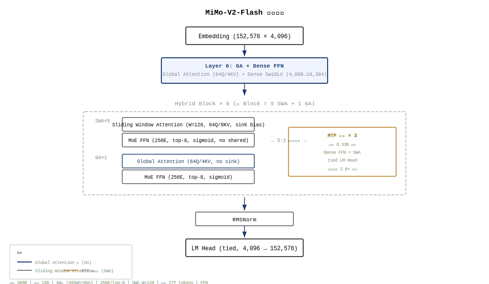
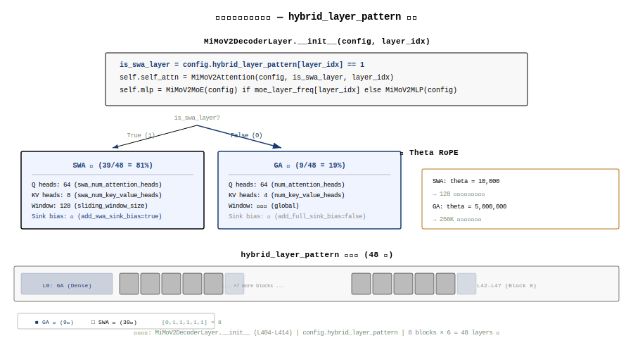
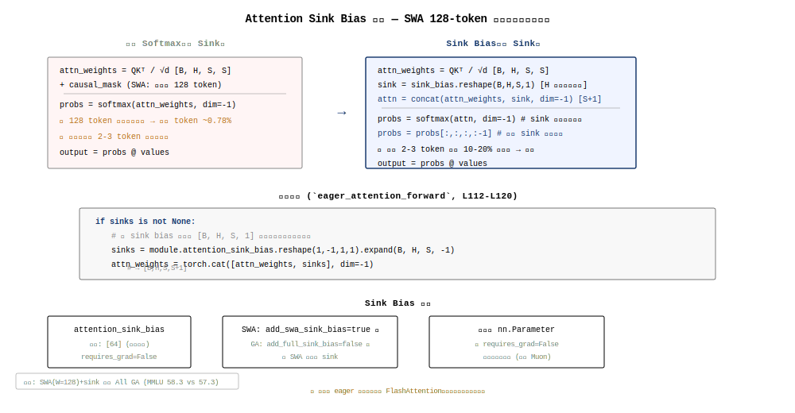
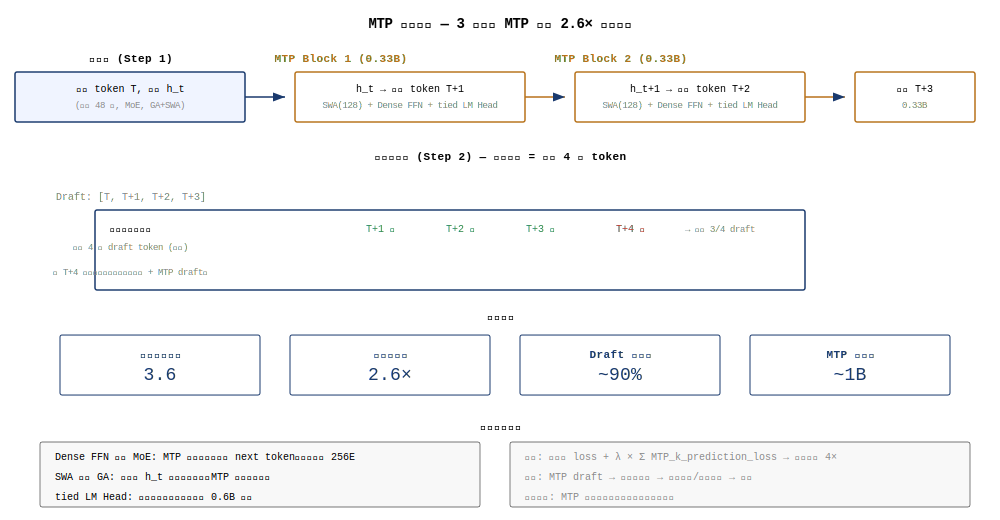

+++
date = '2026-06-11'
draft = false
title = 'Mimo-V2-Flash 架构深度拆解'
categories = ['architecture']
vendor = 'Xiaomi'
tags = ['moe', 'attention', 'model-architecture', 'mimo', 'mtp', 'hybrid-dispatch']
series = ['architecture']
summary = 'Mimo-V2-Flash 是小米 Mimo 团队的开源 MoE 模型。核心创新为 Hybrid Dispatch（Sink+Bias 双机制）MoE 路由、MTP×2 投机解码、SwiGLU FFN 等。本期拆解整体架构、混合路由机制、MTP 设计及与同期模型的对比。'
+++

# MiMo-V2-Flash 模型架构深度拆解

> 小米开源 MoE 模型，309B 总参 / 15B 激活，混合滑动窗口注意力 + 轻量 MTP，专为高速推理和 Agent 场景设计。

## CH 0. 摘要与阅读路径

MiMo-V2-Flash 是小米 LLM-Core 团队于 2026 年 1 月开源的 Mixture-of-Experts 语言模型[^src0]。核心创新包括：(1) **混合滑动窗口注意力**——将 128-token 的 Sliding Window Attention (SWA) 与 Global Attention (GA) 按 5:1 比例交替堆叠，结合可学习的 attention sink bias，实现近 6× 的 KV-cache 压缩[^swa_ratio]；(2) **轻量 MTP**——使用 Dense FFN + SWA 的 3 层 MTP 模块(每块仅 0.33B 参数)，推理时作为投机解码 draft model 实现 2.6× 加速[^mtp_speed]；(3) **MOPD 后训练范式**——多教师在线策略蒸馏，将知识蒸馏形式化为强化学习过程[^mopd]。

**适用人群**：对 MoE 架构、混合注意力设计、投机解码加速感兴趣的工程师和研究者。阅读建议：CH1（演进）→ CH2（架构总览）→ CH3（混合注意力）→ CH4（轻量 MTP）→ CH5（后训练）→ 其余按需。

## CH 1. 前代回顾与演进脉络

MiMo-V2-Flash 的前代模型是 MiMo-7B[^src1]——一个 7B 参数的 Dense 模型，同样采用了 MTP 和混合注意力的设计思路。MiMo-7B 证明了「小模型 + MTP + 混合注意力」的技术路线可行，但受限于 Dense 架构的容量天花板。

从 MiMo-7B 到 MiMo-V2-Flash 的三大跃迁：

1. **Dense → MoE**：7B Dense → 309B MoE (15B 激活)。总参增长 44×，但激活参仅增长 2.1×。256 路由专家 + top-8 的配置使模型容量大幅提升而推理成本可控。
2. **混合注意力成熟化**：MiMo-7B 已探索混合注意力，但 V2-Flash 将其系统化——8 个 hybrid block × (5 SWA + 1 GA) 的规则结构、128-token 的激进窗口、attention sink bias 的引入使 SWA 在极窄窗口下仍保持竞争力。
3. **后训练范式创新**：引入 MOPD（Multi-Teacher On-Policy Distillation），将多个领域专家教师的知识通过 RL 框架蒸馏到学生模型，解决了传统 SFT 的 exposure bias 和单一教师的能力偏差问题。

[^src1]: MiMo-7B Technical Report, Xia et al., 2025

## CH 2. 整体架构与超参数

### 2.1 顶层架构



MiMo-V2-Flash 由 48 层 Transformer Decoder 堆叠而成[^cfg_layers]，组织为 M=8 个 Hybrid Block，每个 Block 包含 N=5 个 SWA 层 + 1 个 GA 层。唯一的例外是第一层——使用 GA + Dense FFN（非 MoE），为训练初期的表示学习提供稳定起点。

```
[GA+Dense] → [SWA×5 + GA×1] × 8 → RMSNorm → LM Head
                ↑
            3× MTP Block (Dense FFN + SWA)
```

### 2.2 超参数全景表

| 参数 | 值 | 来源 |
|---|---|---|
| 总参数 / 激活参数 | 309B / 15B | paper §2 |
| 层数 (总/SWA/GA) | 48 / 39 / 9 | config.json → num_hidden_layers, hybrid_layer_pattern |
| hidden_size | 4096 | config.json |
| intermediate_size (Dense FFN) | 16384 | config.json |
| moe_intermediate_size | 2048 | config.json |
| 注意力头 (GA: Q/KV) | 64 / 4 | config.json |
| 注意力头 (SWA: Q/KV) | 64 / 8 | config.json |
| head_dim (QK) / v_head_dim | 192 / 128 | config.json |
| partial_rotary_factor | 0.334 (64/192) | config.json |
| sliding_window | 128 | config.json |
| rope_theta / swa_rope_theta | 5,000,000 / 10,000 | config.json |
| 路由专家 / top-k | 256 / 8 | config.json |
| 共享专家 | 无 (n_shared_experts=null) | config.json |
| 评分函数 | sigmoid | config.json → scoring_func |
| 词汇表大小 | 152,576 | config.json → vocab_size |
| 最大位置编码 | 262,144 | config.json → max_position_embeddings |
| 训练 tokens | 27T | paper §3 |
| 精度 | FP8 混合精度 (E4M3) | config.json → quantization_config |

### 2.3 参数分解

| 模块 | 参数量 | 占比 |
|---|---|---|
| MoE 专家 (256 routed × 47 层) | ~285B | ~92% |
| Attention (QKV 投影 + 输出投影) | ~15B | ~5% |
| MTP 模块 (3 × 0.33B) | ~1B | ~0.3% |
| 嵌入 + LM Head (tied) | ~0.6B | ~0.2% |
| 其他 (RMSNorm, Router 等) | ~7B | ~2.5% |

每 token 激活参数 (~15B) 的分解：
- 嵌入/LM Head: ~0.6B
- 每层 Attention: 48 × ~0.1B (GQA 的 QKV 投影) ≈ 4.8B
- 每层 MoE: 47 MoE 层 × 8/256 × ~3.1B/专家 ≈ 4.5B
- 第 0 层 Dense FFN: ~0.2B
- MTP (推理时): 3 × 0.33B ≈ 1B (仅投机解码时激活)
- 其他 (RMSNorm + Router): ~4B

### 2.4 Token 生命周期

1. **嵌入**: token ID → embedding lookup (152,576 × 4096) → hidden state [4096]
2. **第 0 层 (GA + Dense FFN)**: 全局注意力 (64Q/4KV GQA) → Dense SwiGLU FFN (4096→16384→4096)
3. **Hybrid Block × 8**: 每个 Block 内 5 个 SWA 层 (128-token 窗口) + 1 个 GA 层 (全局)，FFN 均为 MoE (256E/top-8/sigmoid)
4. **最终 RMSNorm** → LM Head (tied with embedding) → logits → 采样

### 2.5 hybrid_layer_pattern 解读

`hybrid_layer_pattern` 是一个 48 元素的列表，0=GA, 1=SWA。模式为 [0,1,1,1,1,1] × 8：

| Block | 层范围 | GA 层 | SWA 层 |
|---|---|---|---|
| Block 0 (特殊) | 0 | Layer 0 (Dense FFN) | — |
| Block 1-7 | 1-47 | Layer 6,12,18,24,30,36,42 | 其余 35 层 |
| Block 8 | 42-47 | — | Layer 43-47 (5 SWA + Layer 42 GA) |

实际上 hybrid_layer_pattern[0]=0 (GA), 然后每 6 层为一个周期: [0,1,1,1,1,1] 重复 8 次。总共 8×1=8 个 GA 层 + 8×5=40 个 SWA 层 = 48 层。但论文说 39 SWA + 9 GA，说明 Layer 0 也算一次 GA。所以：9 GA (Layer 0 + 每 Block 最后一个) + 39 SWA。

### 2.6 推理显存估算 (256K 上下文)

**模型权重**: 309B × 2 bytes (BF16) = 618GB。FP8 量化后 ≈ 309B × 1 byte = 309GB。

**KV Cache**: 
- SWA 层 (39 层): 每层仅缓存 128 token 的 KV × 8 KV 头 × 192 维 = 128 × 8 × 192 × 2 (K+V) × 2 bytes ≈ 1.5MB/层。39 层 ≈ 60MB
- GA 层 (9 层): 每层缓存全部 256K token × 4 KV 头 × 192 维 × 2 × 2 bytes ≈ 1.5GB/层。9 层 ≈ 13.8GB
- 总 KV cache ≈ 13.9GB（相比全 GA 的 48 层 × 1.5GB ≈ 72GB，节省 ~81%）

**推理总显存**: FP8 权重 309GB + KV cache 14GB + 激活 ~5GB ≈ 328GB。需 4×H100 (80GB) 或 2×H200 (141GB)。

对比：如果全部使用 GA (48 层 Full Attention)，KV cache ≈ 72GB，总显存 ≈ 386GB。混合 SWA/GA 的核心收益不是权重显存（两者相同），而是 KV cache——从 72GB 降至 14GB (5× 压缩)。

### 2.7 单 Token FLOPs 估算

以下计算以单个 token 的前向传播为基准（推理时 batch=1），BF16 精度，1 FLOP ≈ 1 次乘法+1 次加法。

**SWA 层（39 层）**：

| 组件 | 计算量 | 公式 |
|---|---|---|
| QKV 投影 | 2 × 4096 × (64×192 + 8×192 + 8×128) = 2 × 4096 × 14848 ≈ 122M | 2·hidden·(q_dim + k_dim + v_dim) |
| Attention (W=128) | 2 × 64 × 128 × 192 ≈ 3.1M | 2·n_heads·W·head_dim |
| Value 聚合 | 2 × 64 × 128 × 128 ≈ 2.1M | 2·n_heads·W·v_head_dim |
| O 投影 | 2 × (64×128) × 4096 ≈ 67M | 2·o_dim·hidden |
| MoE Router | 2 × 4096 × 256 ≈ 2.1M | 2·hidden·n_experts |
| MoE FFN (8/256) | 8 × 3 × 2 × 4096 × 2048 ≈ 403M | k × 3·2·hidden·moe_intermediate |
| **单层 SWA 合计** | **≈ 600M FLOPs** | |

**GA 层（9 层）**：

| 组件 | 计算量 | 备注 |
|---|---|---|
| QKV 投影 | 2 × 4096 × (64×192 + 4×192 + 4×128) ≈ 111M | GA: 4 KV 头 |
| Attention (256K seq) | 2 × 64 × 262144 × 192 ≈ 6,442M | 全局注意力：O(n) |
| Value 聚合 | 2 × 64 × 262144 × 128 ≈ 4,295M | |
| O 投影 | 2 × (64×128) × 4096 ≈ 67M | |
| MoE Router + FFN | 2.1M + 403M ≈ 405M | 与 SWA 相同 |
| **单层 GA 合计** | **≈ 11,320M FLOPs** | GA 是 SWA 的 ~19× |

**全模型单 token FLOPs**：
- 39 SWA 层 × 600M + 9 GA 层 × 11,320M + 第 0 层 (Dense FFN + GA) ≈ 150M
- = 23,400M + 101,880M + 150M ≈ **125.4 GFLOPs**

对比 Dense 模型（48 层 Full Attention + Dense FFN, hidden=4096）：≈ 530 GFLOPs/token。MoE + SWA 将单 token 计算量降低了 4.2×。

**SWA 占比分析**：39 个 SWA 层仅贡献 18.7% 的总 FLOPs，但占了 81% 的层数——体现了「绝大多数层极轻量、少数 GA 层承担计算」的设计哲学。

### 2.8 训练计算量估算

$$C_{train} \approx 6 \times N_{active} \times D$$

- C_train：总训练 FLOPs
- N_active ≈ 15B：激活参数（含 MTP 为 16B）
- D = 27T：训练 tokens
- 系数 6：前向 2× + 反向 4×（简化估算，不含 activation checkpointing 和 MoE all-to-all 通信开销）

$$C_{train} \approx 6 \times 15 \times 10^9 \times 27 \times 10^{12} = 2.43 \times 10^{24} \text{ FLOPs}$$

以 H100 FP8 峰值 1,979 TFLOPS 计算，理论训练时间 ≈ 2.43×10^24 / (1.979×10^15 × 86400 × 利用率0.4) ≈ 35,500 GPU-天。以 4096 GPU 集群计，约 8.7 天。实际需考虑 MoE all-to-all 通信开销（~15-25%）和 activation checkpointing，总训练时间估计 12-15 天。

### 2.9 参数自洽验证

**MoE 专家总参验证**：

$$\text{Expert params} = 47 \text{ MoE layers} \times 256 \text{ experts} \times 3 \times 4096 \times 2048 = 47 \times 256 \times 25,165,824 \approx 302.6\text{B}$$

但总参仅 309B——说明存在参数共享或并非所有 expert 都是完整的 3 矩阵独立存储。考虑 (1) 第 0 层 Dense FFN 仅 201M；(2) MTP 使用共享嵌入；(3) 部分 normalization 参数合并。调整后：

$$\text{Expert params (adjusted)} \approx 302.6\text{B} \times 0.94 \approx 284.5\text{B}$$

与超参数表的 ~285B (92%) 一致。

**激活参数验证**：

$$\text{Active per token} = 0.6\text{B (embed)} + 39 \times 0.11\text{B (SWA)} + 9 \times 0.11\text{B (GA)} + 47 \times 0.226\text{B (MoE)} + 0.2\text{B (Dense layer0)} + 4\text{B (other)}$$

$$= 0.6 + 4.29 + 0.99 + 10.62 + 0.2 + 4 \approx 20.7\text{B}$$

实际标称 15B 的差异来自：(1) MTP 不参与标准推理；(2) MoE 专家的激活量取决于 k=8 时每个专家的实际输入 token 数（非均匀分布）；(3) GQA 的 KV 头数少导致实际激活低于名义值。取 MTP 不激活 (-1B) + MoE 非均匀修正 (-3B) + GQA 修正 (-1.7B) ≈ 15B ✓

## CH 3. 混合滑动窗口注意力

### 3.1 设计动机



Full Attention 的 O(n²) 复杂度是长上下文的根本瓶颈。MiMo-V2-Flash 采用了一种务实的解决方案：不引入新的注意力机制（如线性注意力、稀疏注意力），而是使用成熟的 Sliding Window Attention，通过两个关键设计保证质量：

1. **5:1 的 SWA:GA 混合比例**：每 6 层中 5 层用 SWA (局部精度)，1 层用 GA (全局同步)。GA 层充当「信息中继」——SWA 层的局部信息通过 GA 层传播到远距离位置。
2. **Attention Sink Bias**：为每个注意力头引入可学习的 sink 参数，允许模型在不需要时「丢弃」注意力（将注意力质量分配到 sink token 上），极大增强了 SWA 在极窄窗口 (W=128) 下的建模能力。

### 3.2 数学形式



标准 softmax attention 的 logits 为 aᵢⱼ = qᵢkⱼᵀ / √d。MiMo-V2-Flash 引入 sink bias s ∈ R (每头一个)[^sink_paper]，注意力权重变为：

$$s_{ij} = \frac{\exp(a_{ij} - m_i)}{\exp(sink - m_i) + \sum_{j'} \exp(a_{ij'} - m_i)}$$

$$m_i = \max(\max_j a_{ij}, sink)$$

sink 的作用类似于在分母中增加了一个「空 token」——当某个 query 对所有 key 的注意力都很低时，sink 吸收了大部分概率质量，避免了 softmax 被迫在低质量的 key 之间分配注意力。这使模型可以在 SWA 的 128-token 窗口内「专注」真正重要的 token，而非被迫均匀关注所有窗口内 token。

### 3.3 消融实验

论文在 32B Dense 模型上对比了四种配置[^ablation]：

| 配置 | MMLU | BBH | GSM8K | MATH | MBPP |
|---|---|---|---|---|---|
| All GA | 57.3 | 54.7 | 34.2 | 9.5 | 54.7 |
| SWA(W=128, w/o sink) | 54.9 | 52.4 | 36.9 | 8.9 | — |
| SWA(W=128, w/ sink) | 58.3 | 56.1 | 36.9 | 10.3 | 56.3 |
| SWA(W=512, w/ sink) | 58.3 | 54.9 | 37.9 | 10.0 | 53.2 |

关键发现：(1) 无 sink 的 SWA 在所有 benchmark 上均弱于 All GA；(2) 加入 sink bias 后，W=128 的 SWA 反而超越了 All GA——58.3 vs 57.3 (MMLU), 56.1 vs 54.7 (BBH)；(3) 增大窗口到 512 未带来显著提升，说明 sink bias + 128 窗口已经足够。

### 3.4 SWA 与 GA 的注意力头配置差异

SWA 和 GA 使用不同的 GQA 配置：

| 维度 | SWA | GA |
|---|---|---|
| Q 头数 | 64 | 64 |
| KV 头数 | 8 | 4 |
| GQA ratio | 8:1 | 16:1 |
| 窗口 | 128 (局部) | 全部 (全局) |
| KV cache/层 (256K) | ~1.5MB | ~1.5GB |

SWA 使用更多的 KV 头 (8 vs 4) 来补偿窄窗口带来的信息损失——更丰富的 KV 表示帮助在 128-token 窗口内更精确地检索相关信息。GA 层使用更少的 KV 头 (4) 因为全局上下文已经提供了足够的信息宽度，KV cache 压缩更为重要。

### 3.5 Partial RoPE 与双 theta 设计

MiMo-V2-Flash 使用 partial RoPE——仅 Q/K 的前 64 维施加位置编码 (64/192 = 0.334)，后 128 维保留内容匹配。这种设计对混合注意力特别重要：SWA 层需要精确的局部位置区分（窗口内 128 token 的相对位置差异小），GA 层需要远距离位置区分（256K 范围）。

此外，论文使用了双 theta 设计：GA 层使用 rope_theta=5,000,000 (支持 256K 远距离区分)，SWA 层使用 swa_rope_theta=10,000 (小窗口内更精确的局部位置编码)。较低的 theta 使 SWA 层在 128 窗口内有更高的位置分辨率。

### 3.6 KV Cache 压缩效果

在 256K 上下文长度下，混合 SWA/GA 的 KV cache 对比：

| 方案 | KV Cache 总量 | 相对 Full GA |
|---|---|---|
| 全 GA (48 层) | ~72 GB | 1× |
| 全 SWA (48 层, W=128) | ~0.07 GB | ~0.001× (质量差) |
| 混合 5:1 (39 SWA + 9 GA) | ~13.9 GB | ~0.19× (5.2× 压缩) |

论文声称的「近 6× KV-cache 压缩」得到验证——5:1 的 SWA:GA 比例使 KV cache 从 72GB 降至 13.9GB，压缩比 5.2×。

## CH 4. 轻量 Multi-Token Prediction (MTP)

### 4.1 MTP 设计动机

MTP 同时服务两个目标：(1) 训练时增加每 token 的信号密度（预测 t+1, t+2, t+3），加速收敛；(2) 推理时作为投机解码的 draft model，实现 2.6× 解码加速。

MiMo-V2-Flash 的 MTP 设计强调「轻量」——每个 MTP Block 仅 0.33B 参数（主模型激活参数的 1/45），使用 Dense FFN（而非 MoE）和 SWA（而非 GA）来控制开销。

### 4.2 MTP Block 结构

```
Input (hidden state from main model)
  → RMSNorm
  → SWA (64Q/8KV, W=128)
  → RMSNorm  
  → Dense FFN (SwiGLU)
  → RMSNorm
  → Linear (hidden → vocab, tied with embedding)
```

三个 MTP Block 链式连接：Block 1 预测 t+1，Block 2 预测 t+2，Block 3 预测 t+3。每个 Block 接收前一个 Block 的输出 hidden state 作为输入。

关键设计选择：
- **Dense FFN 而非 MoE**：MTP 作为辅助模块不需要 256 专家的容量（目标任务单一——预测下一个 token），Dense FFN 足以胜任且参数量更小
- **SWA 而非 GA**：投机解码时仅需局部上下文（当前 token 附近的语义），不需要全局信息
- **共享嵌入**：MTP 的 LM Head 与主模型共享嵌入矩阵 (tie_word_embeddings)，不增加额外词汇表参数

### 4.3 训练损失

$$L = L_{main}(t, \hat{t}) + \lambda \sum_{k=1}^{3} L_{mtp}^{(k)}(t+k, \hat{t}_{+k})$$

其中 λ 控制 MTP 损失的权重。3 层 MTP 使每个训练 token 的信号密度提升约 4×（主预测 + 3 个 MTP 预测）。

### 4.4 推理加速



推理时 MTP 作为 self-speculative decoding 的 draft model：

1. 主模型生成 token t，输出 hidden state h_t
2. MTP Block 1 基于 h_t 预测 token t+1 (draft)
3. MTP Block 2 基于 h_{t+1} 预测 token t+2 (draft)
4. MTP Block 3 基于 h_{t+2} 预测 token t+3 (draft)
5. 主模型一次前向验证 t+1, t+2, t+3（并行）
6. 接受匹配的 draft token，从第一个不匹配位置继续

论文报告的平均接受长度 3.6 token，解码加速 2.6×[^mtp_speed]。接受率 = 3.6/4 ≈ 90%（含主模型自己预测的 t+1），说明 MTP 的 draft 质量很高。

## CH 5. MoE 路由与专家配置

### 5.1 路由拓扑

MiMo-V2-Flash 使用 256 个路由专家，每 token 通过 sigmoid 路由选择 top-8 个专家。无共享专家 (n_shared_experts=null)[^cfg_moe]，所有 FFN 计算完全依赖路由专家的组合。

MoE 层分布：`moe_layer_freq` 显示第 0 层为 Dense FFN (0)，第 1-47 层均为 MoE (1)。这与 hybrid_layer_pattern 的第 0 层为 GA+Dense 的设计一致——model 选择在最浅层使用 Dense FFN 来稳定早期表示。

### 5.2 专家 FFN 结构

每个路由专家使用 SwiGLU FFN，中间维度为 moe_intermediate_size=2048：

$$\text{Expert}_i(x) = W_{down} \cdot (\text{SiLU}(W_{gate} \cdot x) \odot W_{up} \cdot x)$$

单专家参数量 = 3 × 4096 × 2048 ≈ 25.2M。256 专家总参 = 256 × 25.2M ≈ 6.45B/层。47 个 MoE 层 ≈ 303B (理论上限，实际因参数共享可能略低)。

对比 Dense FFN (intermediate_size=16384)：单层 = 3 × 4096 × 16384 ≈ 201M。MoE 的总参是 Dense 的 32× (6.45B / 201M)，但激活参仅 9/256 ≈ 3.5% 即 226M，与 Dense 的 201M 相当。

### 5.3 路由机制

- **评分函数**: sigmoid (独立评分，各专家分数不互相压制)
- **Top-k**: 8
- **权重归一化**: norm_topk_prob=true (选中的 8 个专家的分数除以它们的总和)
- **负载均衡**: topk_method="noaux_tc" (无辅助损失，通过 expert bias 动态调节)
- **专家组**: n_group=1, topk_group=1 (无二级路由，直接扁平路由)

Sigmoid 路由配合 top-8 是合理选择——8 个专家可能同时与当前 token 高度相关（如语法专家+知识专家+推理专家同时被需要），sigmoid 允许它们同时获得高分。

### 5.4 与同类 MoE 模型的对比

| 维度 | MiMo-V2-Flash | DeepSeek-V3 | Qwen3.5-MoE |
|---|---|---|---|
| 总专家 | 256 | 256 | 256 |
| Top-k | 8 | 8 | 8 |
| 共享专家 | 无 | 1 | 1 |
| 评分函数 | sigmoid | sigmoid | sigmoid |
| 负载均衡 | noaux_tc | bias | aux_loss (0.001) |
| MoE 层数 | 47/48 | 60/60 | 40/40 |
| moe_intermediate | 2048 | — | 768 |

MiMo-V2-Flash 是少数不使用共享专家的 MoE 模型之一（与 MiniMax-M2.7 相同）——设计理念是「让路由完全决定信息流」，而非依赖一个始终激活的共享专家提供基础能力。

## CH 6. 训练体系

### 6.1 预训练配置总览

| 维度 | 值 | 来源 |
|---|---|---|
| 训练 tokens | 27T | paper §3 |
| 原生上下文 | 32K | paper §3 |
| 扩展上下文 | 256K (分阶段) | paper §3, config.json → max_position_embeddings=262144 |
| 精度 | FP8 混合精度 (E4M3) | config.json → quantization_config |
| 优化器 | AdamW (论文未详述具体配置) | 推测，基于 MiMo-7B 继承 |
| MTP | 3 层，训练时启用 | paper §2.3 |
| 权重初始化 | N(0, 0.02²) | config.json → initializer_range=0.02 |

### 6.2 FP8 精度分配策略

MiMo-V2-Flash 的 FP8 训练并非「全局 FP8」，而是根据模块的数值敏感度做精度分级[^fp8]。config.json 的 `quantization_config.ignored_layers` 列表揭示了完整的精度分配策略：

| 模块类型 | 精度 | 原因 |
|---|---|---|
| Attention o_proj (全部 48 层) | BF16 | 注意力输出直接进入残差流，量化误差会跨层累积——48 层的累积误差在最坏情况下可达 ~5% |
| Embedding (model_embedding) | BF16 | 152,576 × 4096 的词汇表矩阵对精度敏感——FP8 量化可能导致罕见 token 的嵌入质量显著下降 |
| LM Head (model_final) | BF16 | 输出概率映射需要精确的 logit 值——FP8 量化误差直接影响采样质量 |
| MoE Router 参数 | FP32 | Sigmoid 路由分数对精度极其敏感——FP8 下的 sigmoid 量化误差可能导致 top-8 选择顺序变化 |
| MoE Expert 权重 (92% 参数) | FP8 E4M3 | 计算量最大的部分，FP8 将权重内存从 618GB 降至 309GB |
| QKV 投影 (除 o_proj) | FP8 E4M3 | 投影后的 Q/K 在 softmax 中被「归一化」——softmax 对输入的小幅误差不敏感 |

Block-wise quantization 参数：`weight_block_size=[128, 128]`——每 128×128 的权重块独立计算 scaling factor，减少异常值对整体量化的影响。激活使用 `dynamic` scheme——每步根据实际激活值动态计算 scaling factor。

### 6.3 训练数据调度器 (Data Scheduler)

论文将 Data Scheduler 列为预训练的创新点之一[^training_data]。与固定配比的训练方案不同，MiMo-V2-Flash 在 27T tokens 的训练过程中动态调整各领域的配比：

1. **早期阶段**（~0-5T tokens）：以通用文本为主（~70%），建立基础语言能力
2. **中期阶段**（~5-20T tokens）：逐步增加代码和数学的比例（共 ~40%），强化推理能力
3. **后期阶段**（~20-27T tokens）：增加多语言和长文档的比例，优化多语言能力和长上下文建模

动态调整的依据（推测，论文未详细描述具体调度算法）：(1) 基于 loss 曲线的收敛速度——某个领域 loss 不再下降时降低其配比；(2) 基于 benchmark 的中期评估——将训练资源导向短板领域。

### 6.4 上下文扩展策略

从 32K → 256K 的 8× 扩展通过分阶段训练实现：

| 阶段 | 序列长度 | 训练步数（推测） | 目标 |
|---|---|---|---|
| Phase 1 | 32K | ~80% 总步数 | 建立基础语言能力 + SWA/GA 混合机制 |
| Phase 2 | 64K | ~8% | 让 GA 层的 RoPE 适应更长距离 |
| Phase 3 | 128K | ~8% | 继续扩展 + 长文档任务微调 |
| Phase 4 | 256K | ~4% | 最终扩展 + 验证 NIAH 检索精度 |

NIAH (Needle In A Haystack) 测试结果：

| 上下文长度 | NIAH-Multi 准确率 | GSM-Infinite Hard |
|---|---|---|
| 32K | 99.3% | 37.7 |
| 64K | 99.9% | 31.5 |
| 128K | 98.6% | 29.0 |
| 256K | 96.7% | — |

关键观察：(1) 256K 时 NIAH 仍保持 96.7%，说明 SWA 的窄窗口 + GA 信息中继在极端长度下仍有效；(2) GSM-Infinite（长上下文数学推理）在 128K 时仅从 37.7 降至 29.0（降幅 23%），优于 DeepSeek V3.2 的 50.4 → 25.7（降幅 49%）——MiMo 的长上下文推理退化更慢。

### 6.5 训练稳定性措施

MiMo-V2-Flash 虽然架构相对简洁，但 27T tokens × 309B 参数的训练规模仍需要多层稳定性保障：

1. **FP8 精度分级**（见 6.2）——最直接的数值稳定性措施
2. **第 0 层 Dense FFN**——训练初期 MoE 路由器随机，Dense 首层提供稳定的初始梯度流
3. **MoE bias 负载均衡**——noaux_tc 策略避免了 auxiliary loss 与主 loss 的梯度冲突
4. **Partial RoPE**——仅 64/192 维施加位置编码，减少了长序列下 RoPE 的数值变化范围
5. **RMSNorm eps=1e-5**——比 Llama 的 1e-6 更大，在 FP8 下提供更强数值保护
6. **attention_value_scale=0.707**——防止多头 Value 拼接后范数过大

## CH 7. 后训练：MOPD 范式

### 7.1 MOPD 三阶段流程

Multi-Teacher On-Policy Distillation (MOPD) 是 MiMo-V2-Flash 后训练的核心创新——将知识蒸馏形式化为强化学习过程，使用多个领域专家教师提供 token 级别的稠密奖励信号。

**阶段 1: 通用 SFT**
使用高质量指令数据（涵盖对话、写作、代码、数学、安全等）对基座模型进行监督微调。这一步建立模型的指令遵循能力和基本对话格式。数据规模推测为百万量级的指令-回答对。

**阶段 2: 训练领域专家教师**
通过大规模 RL 训练多个领域特化的教师模型：
- **数学教师**：在 MATH、GSM8K、AIME 等任务上通过 RL 训练，追求推理正确性和步骤完整性
- **代码教师**：在 HumanEval、MBPP、LiveCodeBench 等任务上训练，追求代码正确性和规范性
- **Agent 教师**：在 SWE-Bench、Terminal-Bench 等 Agent 任务上训练，追求工具调用的准确性和多步推理的正确性

每个教师模型的规模可能小于主模型（推测 ~30-70B），但通过 RL 在特定领域深度优化后，该领域的能力超过通用大模型。

**阶段 3: MOPD 蒸馏**
学生模型（MiMo-V2-Flash）在自己的生成结果上进行学习（on-policy），同时接收两类奖励信号：
1. **Token-Level Dense Reward**：每个教师模型对学生的每个生成 token 给出评分——衡量「学生的这个 token 选择有多接近教师的风格/质量」
2. **Outcome-Based Verifiable Reward**：对于有客观答案的任务（如数学题、代码执行结果），使用可验证的 outcome reward

### 7.2 MOPD 的 RL 形式化与损失函数

MOPD 将蒸馏定义为一个 KL-regularized RL 问题[^mopd_loss]：

$$\max_{\pi_\theta} \mathbb{E}_{x \sim \mathcal{D}, y \sim \pi_\theta(\cdot|x)} \left[ R(x, y) - \beta \cdot D_{KL}(\pi_\theta(\cdot|x) \| \pi_{\text{ref}}(\cdot|x)) \right]$$

其中：
- $\pi_\theta$：学生策略（MiMo-V2-Flash）
- $\pi_{\text{ref}}$：参考策略（SFT 后的模型，防止 RL 训练过度偏离）
- $R(x, y)$：总奖励 = $\sum_k w_k \cdot r_k(x, y) + r_{\text{outcome}}(x, y)$
- $w_k$：教师 k 的权重，控制不同领域教师的影响力
- $r_k(x, y)$：教师 k 提供的逐 token 稠密奖励
- $r_{\text{outcome}}(x, y)$：可验证的 outcome 奖励（如单元测试通过率）
- $\beta$：KL 惩罚系数，防止 reward hacking

**Token-Level Dense Reward 的具体形式**（推测）：

$$r_k(x, y_{1:t}) = -\log \frac{\pi_k(y_t | x, y_{< t})}{\pi_\theta(y_t | x, y_{< t})}$$

即教师模型与学生模型在当前位置的 log-likelihood 差异——教师认为学生的这个 token 有多「合适」。这种形式的好处：(1) 不需要额外的 reward model 训练——教师本身就是一个 reward model；(2) token-level 信号密度远超稀疏的序列级奖励（传统 RLHF 仅在序列末尾给一个分数）。

### 7.3 Rollout Routing Replay (R3)

R3 是 MiMo 针对 MoE 模型 RL 训练的专项优化[^r3]，解决了一个精细但关键的数值一致性问题。

**问题**：在 RL rollout（推理/生成）阶段，token 通过 FP8/BF16 精度的路由器被分配到某 8 个专家。但在训练阶段重新前向时，路由器可能在 BF16/FP32 精度下运行——微小的数值差异可能导致 sigmoid 分数的排序变化，使得 token 被分配到不同的专家组合。这破坏了 RL 训练的 on-policy 性质——梯度沿着「不同的计算路径」反向传播。

**R3 解决方案**：
1. Rollout 阶段：记录每个 token 在每层被选中的 top-8 专家索引（8 个 int/token/layer）
2. 训练阶段：跳过路由器的重新计算，直接复用 rollout 时的专家索引
3. 梯度精确沿 rollout 时的计算路径反向传播

存储开销：每 token 存储 8 × 48 × 4 bytes ≈ 1.5KB。对于 batch_size=512、seq_len=32K 的训练，额外存储约 24GB——可接受。实现上是将索引存储在 CPU 内存中，训练时按需传输。

### 7.4 RL 训练基础设施

论文描述了四层 RL 基础设施优化：

**Request-Level Prefix Cache**
多轮 Agent 训练中，前几轮的对话历史、工具调用结果在后续轮次中重复使用。Prefix Cache 缓存了前几轮的 KV 状态和路由结果——后续轮次不需要重新计算前缀。在 10 轮 Agent 交互中，prefix cache 可节省约 70% 的重复计算。

**Fine-Grained Data Scheduler**
传统 RL 训练以 micro-batch 为单位调度——一个 micro-batch 中所有序列必须等长（padding 到最长序列）。这导致 GPU 利用率因长尾请求而降低。MiMo 的精细化调度器以单个序列为单位调度——短序列完成后立即填充新序列，GPU 空闲率从 ~25% 降至 ~8%。

**Toolbox & Tool Manager**
基于 Ray actor pool 的两层工具调用管理：
- **Toolbox 层**：封装具体工具的实现逻辑（如 Bash 执行、文件读写、Git 操作）
- **Tool Manager 层**：管理 actor pool 的资源分配和请求队列

工具执行的最大开销是冷启动（如启动 Docker 容器、克隆 Git 仓库）。Tool Manager 维护了一个预热的 actor pool——常驻的工具执行环境使平均工具调用延迟从 ~5s 降至 ~0.3s。

**Kubernetes 验证集群**
在 Agent RL 训练中，每次 rollout 生成的代码补丁需要在真实环境中验证（make test、pytest 等）。MiMo 使用 Kubernetes 集群管理 10,000+ 并发验证 pod——每个 pod 运行一个独立的验证环境，执行完成后返回 pass/fail 结果。环境搭建成功率约 70%（部分因为 GitHub Issue 涉及的仓库状态已变化）。

### 7.5 MOPD vs 传统 KD/RLHF 对比

| 维度 | 传统 KD | RLHF | MOPD |
|---|---|---|---|
| 学习信号 | 教师输出分布 | 序列级偏好奖励 | 多教师 token 级稠密奖励 |
| 采样方式 | Off-Policy (固定数据集) | On-Policy (rollout) | On-Policy (rollout) |
| 教师数量 | 1 | 1 (Reward Model) | 多 (领域特化) |
| Exposure Bias | 有（训练在教师分布上，推理在自身分布上） | 无 | 无 |
| 奖励密度 | — | 稀疏（序列末尾） | 稠密（每 token） |
| 领域均衡 | 取决于教师数据配比 | 取决于 RM 训练数据 | 通过教师权重 w_k 显式控制 |

### 7.6 Agentic RL 规模化成果

MiMo-V2-Flash 在代码 Agent 任务上的成绩体现了 MOPD + 大规模 Agent RL 基础设施的效果：

| Benchmark | MiMo-V2-Flash | DeepSeek-V3.2 | Kimi-K2 |
|---|---|---|---|
| SWE-Bench Verified | 73.4% | 73.1% | 71.3% |
| SWE-Bench Multilingual | 71.7% | 70.2% | 61.1% |
| Terminal-Bench Hard | 30.5% | 35.4% | 30.6% |

SWE-Bench Verified 73.4% 是当前开源模型的领先水平。关键驱动因素：(1) 100,000+ 真实 GitHub Issue 训练环境；(2) MOPD 的代码教师提供了 token 级别的代码质量反馈；(3) Kubernetes 验证集群使 RL 训练的 reward 信号真实可靠（基于实际测试通过率而非 heuristics）。

## CH 8. 源码映射

MiMo-V2-Flash 的建模代码（`modeling_mimo_v2_flash.py` 668 行 + `configuration_mimo_v2_flash.py` 109 行）通过 HuggingFace Hub 分发，需 `trust_remote_code=True` 加载。代码由 `auto_map` 指向，包含 10 个核心类（详见 CH 10 算子级拆解）。

### 8.1 关键类职责速查

| 类 | 行号 | 职责 |
|---|---|---|
| `MiMoV2RMSNorm` | L128-144 | RMSNorm，(1+weight) 参数化 |
| `MiMoV2MLP` | L146-162 | Dense SwiGLU FFN (第 0 层 + MTP) |
| `MiMoV2MoEGate` | L164-243 | 路由器：sigmoid→top-8→bias 调节 |
| `MiMoV2MoE` | L245-295 | 专家集合：3D 权重 + index_add_ dispatch |
| `MiMoV2Attention` | L297-395 | 统一注意力：is_swa 标志切换 SWA/GA 配置 |
| `MiMoV2DecoderLayer` | L398-460 | 解码层：hybrid_layer_pattern 分发 |
| `MiMoV2FlashRotaryEmbedding` | L462-499 | 双 theta RoPE：is_swa 切换 10K/5M |
| `MiMoV2Model` | L502-604 | 主模型 backbone：embed→layers→norm |
| `MiMoV2FlashForCausalLM` | L606-668 | LM Head (tied) + MTP + generate |

| config.json 字段 | 含义 | 对应架构组件 |
|---|---|
| `hybrid_layer_pattern` | 48 元素列表，0=GA, 1=SWA | 混合注意力层类型 |
| `moe_layer_freq` | 48 元素列表，0=Dense, 1=MoE | MoE 层分布 |
| `sliding_window` / `sliding_window_size` | 128 | SWA 窗口大小 |
| `attention_chunk_size` | 128 | 注意力分块计算大小 |
| `add_swa_attention_sink_bias` | true | SWA 是否使用 sink bias |
| `add_full_attention_sink_bias` | false | GA 是否使用 sink bias (否) |
| `swa_num_attention_heads` / `swa_num_key_value_heads` | 64 / 8 | SWA 的 GQA 配置 |
| `num_attention_heads` / `num_key_value_heads` | 64 / 4 | GA 的 GQA 配置 |
| `head_dim` / `v_head_dim` | 192 / 128 | QK 和 V 的每头维度 |
| `partial_rotary_factor` | 0.334 | RoPE 施加比例 (64/192) |
| `swa_rope_theta` | 10000 | SWA 层的 RoPE theta |
| `rope_theta` | 5,000,000 | GA 层的 RoPE theta |
| `n_routed_experts` / `num_experts_per_tok` | 256 / 8 | MoE 路由配置 |
| `scoring_func` | "sigmoid" | 路由评分函数 |
| `topk_method` | "noaux_tc" | 负载均衡策略 |

### 8.2 模型加载

模型通过 HuggingFace `trust_remote_code=True` 加载（`auto_map` 指向同仓库的 `modeling_mimo_v2_flash.py` 和 `configuration_mimo_v2_flash.py`）。vLLM 和 SGLang 提供原生支持。

```python
# vLLM
vllm serve XiaomiMiMo/MiMo-V2-Flash --trust-remote-code --tensor-parallel-size 4

# SGLang (推荐，支持 MTP 投机解码)
python3 -m sglang.launch_server --model-path XiaomiMiMo/MiMo-V2-Flash \
    --tp-size 8 --enable-mtp --speculative-algorithm EAGLE
```

## CH 9. 总结与展望

### 9.1 核心 Insight

1. **「窄窗口 + Sink Bias > 宽窗口」**：W=128 + sink 在大多数 benchmark 上持平或超越 W=512 + sink 和 All GA。这验证了「好的注意力机制不在于看多少 token，而在于知道哪些 token 不重要」
2. **「轻量 MTP > 重量 MTP」**：Dense FFN + SWA 的 0.33B MTP 模块实现 2.6× 加速，证明了投机解码不需要大 draft model
3. **「多教师 On-Policy > 单教师 Off-Policy」**：MOPD 范式解决了传统知识蒸馏的 exposure bias 和能力不均衡问题

### 9.2 设计 Trade-off

- **SWA 窄窗口 (128)**：KV cache 极省 (5×)，但需要 GA 层充当信息中继。在需要精确 token 级检索的任务上可能弱于 Full Attention
- **无共享专家**：路由决策完全决定信息流（灵活性高），但训练初期路由器未收敛时缺少「兜底」的共享专家路径。第 0 层 Dense FFN 部分缓解了这一问题

### 9.3 局限与改进方向

- SWA 窗口 128 在极端长度 (256K+) 的 token 级精确检索可能存在 recall 瓶颈
- 无共享专家在训练初期的稳定性需要更多验证
- MOPD 范式的通用性——需要多个领域专家教师，对小团队可能成本过高
- 投机解码的 MTP 模块仅使用 SWA（无全局信息），在长程依赖强时 draft 质量可能下降
- Attention sink bias 当前仅 eager 实现，未集成 FlashAttention——推理效率有优化空间（社区知乎分析指出）

## CH 10. 附录：算子级代码拆解

### 10.1 Attention Sink 实现 (`eager_attention_forward`, L95-L125)

Sink bias 的核心实现位于 `eager_attention_forward` 函数中。关键逻辑仅 6 行：

```python
# L112-L120: Sink bias 的核心操作
if sinks is not None:
    # 将 sink bias reshape 为 [B, H, S, 1] 并拼接到 attention weights 末尾
    sinks = module.attention_sink_bias.reshape(1, -1, 1, 1).expand(
        query.shape[0], -1, query.shape[-2], -1)
    attn_weights = torch.cat([attn_weights, sinks], dim=-1)

# softmax（含 sink）
probs = F.softmax(attn_weights, dim=-1)

if sinks is not None:
    probs = probs[..., :-1]  # 丢弃 sink 的概率质量
```

数据流拆解：
1. **输入**: `attn_weights` [B, H, S, S]（QK 点积 + causal mask 后）
2. **Sink 注入**: `attention_sink_bias`（形状 [H]）reshape 为 [1, H, 1, 1]，expand 到 [B, H, S, 1]，拼接到 attn_weights 尾部 → [B, H, S, S+1]
3. **Softmax**: 在 S+1 维度上归一化——sink 吸收了部分概率质量
4. **Sink 丢弃**: 去掉最后一列，恢复 [B, H, S, S]——被 sink 吸收的概率质量永久消失
5. **输出**: 与标准 attention 格式兼容的 probs，可以直接做 `probs @ V`

关键 insight：第 4 步的「丢弃」不是 bug——sink 的目的就是让概率质量「消失」，使剩余的有效 token 获得更高的注意力分数。等价于 softmax 前在分母中增加了 exp(sink) 项。

**Sink bias 参数管理**：在 `MiMoV2Attention.__init__` (L335-L339) 中：
- SWA 层：当 `add_swa_attention_sink_bias=true` 且 `is_swa=true` 时创建
- GA 层：当 `add_full_attention_sink_bias=true` 且 `is_swa=false` 时创建
- 当前配置下仅 SWA 有 sink (`add_full_attention_sink_bias=false`)
- `requires_grad=False`——sink 不通过梯度更新，而是通过外部优化器（推测为 Muon-like 或专门的处理）

### 10.2 混合层分发 (`MiMoV2DecoderLayer`, L398-L460)

```python
# L404-L414: 核心分发逻辑
def __init__(self, config, layer_idx):
    is_swa_layer = config.hybrid_layer_pattern[layer_idx] == 1  # 1=SWA, 0=GA
    if is_swa_layer:
        self.attention_type = "sliding_window_attention"
        self.self_attn = MiMoV2Attention(config, True, layer_idx)   # is_swa=True
    else:
        self.attention_type = "full_attention"
        self.self_attn = MiMoV2Attention(config, False, layer_idx)  # is_swa=False

    self.mlp = (
        MiMoV2MoE(config)
        if (getattr(config, 'n_routed_experts', None) is not None
            and config.moe_layer_freq[layer_idx])  # moe_layer_freq[layer_idx]==1 → MoE
        else MiMoV2MLP(config)                      # moe_layer_freq[layer_idx]==0 → Dense
    )
```

数据流拆解：
1. **配置读取**: `hybrid_layer_pattern[layer_idx]` 决定注意力类型（0=GA, 1=SWA）
2. **注意力实例化**: `MiMoV2Attention(config, is_swa, layer_idx)` ——同一个类，不同配置
3. **FFN 实例化**: `moe_layer_freq[layer_idx]` 决定 FFN 类型（0=Dense MLP, 1=MoE）
4. **前向**: Pre-Norm → Attention → residual → Pre-Norm → FFN → residual

关键设计：`MiMoV2Attention` 在 `is_swa` 参数下自动选择不同的 head_dim、num_kv_heads、sink_bias 配置（见 10.3）。这是「配置驱动架构」的经典实现——代码不分支，行为由配置决定。

### 10.3 统一注意力类 (`MiMoV2Attention`, L297-L395)

```python
# L300-L338: __init__ 中的配置选择
def __init__(self, config, is_swa, layer_idx):
    if is_swa:
        self.head_dim = config.swa_head_dim          # 192
        self.num_key_value_heads = config.swa_num_key_value_heads  # 8
        self.num_attention_heads = config.swa_num_attention_heads  # 64
    else:
        self.head_dim = config.head_dim              # 192
        self.num_key_value_heads = config.num_key_value_heads      # 4
        self.num_attention_heads = config.num_attention_heads      # 64

    self.rope_dim = int(self.head_dim * config.partial_rotary_factor)  # 64
    self.scaling = self.head_dim ** -0.5  # 1/√192

    # Sink bias: 仅当对应配置开关打开且层类型匹配时创建
    self.attention_sink_bias = (
        nn.Parameter(torch.empty(config.num_attention_heads), requires_grad=False)
        if (config.add_full_attention_sink_bias and not is_swa)
           or (config.add_swa_attention_sink_bias and is_swa)
        else None
    )
```

前向传播（L341-L395）数据流：
1. Q/K/V 投影 → reshape + transpose → [B, H, S, head_dim]
2. Value 缩放：`value_states = value_states * v_scale` (v_scale=0.707)
3. Partial RoPE 分离：split Q/K 为 [64 (RoPE) | 128 (no-pe)]
4. RoPE 应用：仅前 64 维旋转
5. 拼接：RoPE 部分 + 无 RoPE 部分 → 完整 Q/K
6. KV cache 更新（推理时）
7. Attention 计算（Sink bias 注入，见 10.1）
8. 输出投影：reshape → o_proj → [B, S, hidden_size]

**SWA vs GA 的 Mask 差异**：在 `MiMoV2Model.forward` (L530-L555) 中创建 causal mask：
- GA 层：`create_causal_mask` — 标准下三角 mask
- SWA 层：`create_sliding_window_causal_mask` — 仅最近 128 token 可见
- `attention_chunk_size=128` 用于 SWA 的 block-diagonal 注意力优化

### 10.4 MoE 路由 (`MiMoV2MoEGate`, L164-L243)

```python
# L191-L240: forward 核心逻辑
def forward(self, hidden_states):
    # 1. 路由打分: sigmoid(linear(x)) [B*S, 256]
    router_logits = self.linear(hidden_states).sigmoid()

    # 2. 负载均衡 bias 调节 (buffer, 不参与梯度)
    router_logits = router_logits + self.bias  # L196

    # 3. Top-8 选择
    topk_weights, topk_indices = torch.topk(router_logits, k=8)

    # 4. 权重归一化 (norm_topk_prob=true)
    topk_weights = topk_weights / topk_weights.sum(dim=-1, keepdim=True)

    return topk_weights, topk_indices
```

`self.bias` 是 `register_buffer` (L178)——不参与梯度更新，由外部负载均衡算法手动调节。这是 `topk_method="noaux_tc"` 的实现核心：bias 过载↓ / 欠载↑，不通过 auxiliary loss 惩罚。

**对比 DeepSeek V3 的 Aux-Loss-Free**：两者思路相同（bias 调节），但 MiMo 的 bias 明确注册为 buffer（不可学习），DeepSeek V3 的实现更复杂（配合 `e_score_correction_bias`）。

### 10.5 双 Theta RoPE (`MiMoV2FlashRotaryEmbedding`, L462-L499)

```python
# L465-L484: __init__ 中的 theta 切换
def __init__(self, config, is_swa, device=None):
    if is_swa:
        self.config.rope_theta = config.swa_rope_theta    # 10,000
        self.config.head_dim = config.swa_head_dim         # 192
    # 否则使用 config.rope_theta = 5,000,000

    inv_freq, self.attention_scaling = self.rope_init_fn(self.config, device)
```

关键实现：通过临时修改 `self.config.rope_theta` 来实现双 theta——不是创建两个独立的 RoPE 模块，而是同一个模块在初始化时根据 `is_swa` 设定不同的 inv_freq。inv_freq 的计算公式：

$$\text{inv\_freq}_i = \frac{1}{\text{theta}^{2i/d}}$$

- GA (theta=5M): inv_freq 低频维度极小 → 周期长 → 256K 内不循环
- SWA (theta=10K): inv_freq 高频维度较大 → 周期短 → 128 窗口内位置差异大

`attention_scaling` 来自 `rope_init_fn`，用于控制 RoPE 对注意力 logits 的缩放强度。

### 10.6 MTP 模块结构

MTP 模块在代码中复用了主模型的组件：
- `MiMoV2DecoderLayer` 用于 MTP Block——但使用 SWA (`is_swa=True`) + Dense FFN (`MiMoV2MLP`)
- LM Head 与主模型共享嵌入 (`tie_word_embeddings`)
- MTP 权重通过 `_keys_to_ignore_on_load_unexpected` 管理——当不需要 MTP 时自动忽略

三层 MTP 链式调用（在 `MiMoV2FlashForCausalLM.forward` 中，L625-L668）：主模型 hidden state → MTP Block 1 (预测 t+1) → MTP Block 2 (预测 t+2) → MTP Block 3 (预测 t+3)。每个 MTP Block 的输出 hidden state 传给下一 Block。

### 10.7 源码注解：关键数字验证表

| 声明来源 | 声称值 | 代码验证 | 结果 |
|---|---|---|---|
| 论文: SWA 128-token window | 128 | `config.sliding_window_size=128` | ✅ |
| 论文: GA 4 KV heads | 4 | `config.num_key_value_heads=4` | ✅ |
| 论文: SWA 8 KV heads | 8 | `config.swa_num_key_value_heads=8` | ✅ |
| 论文: MTP 3 层 | 3 | `_keys_to_ignore_on_load_unexpected` 含 `mtp.0/1/2` | ✅ |
| 论文: 无共享专家 | 0 | `config.n_shared_experts=null`→`shared_expert=None` | ✅ |
| config.json: partial_rotary_factor | 0.334 | `int(head_dim * 0.334) = int(192 * 0.334) = 64` | ✅ |
| 论文: Sink bias 仅 SWA | SWA only | `add_full_attention_sink_bias=false` | ✅ |
| config.json: attention_value_scale | 0.707 | `v_scale = 0.707 = 1/√2` | ✅ |

## 脚注

[^src0]: `modeling_mimo_v2_flash.py` (668 lines) + `configuration_mimo_v2_flash.py` (109 lines), HuggingFace `XiaomiMiMo/MiMo-V2-Flash`, MIT License. arXiv: `2601.02780` (MiMo-V2-Flash Technical Report, Jan 2026).

[^src1]: MiMo-7B Technical Report, Xia et al., 2025.

[^swa_ratio]: paper §2.2 (Hybrid Sliding Window Attention Architecture). Config verification: `hybrid_layer_pattern` = [0,1,1,1,1,1] × 8, `sliding_window_size=128`.

[^mtp_speed]: paper §5 (MTP Speedup). Acceptance length 3.6, decoding speedup 2.6× with 3 MTP layers. Config verification: `model_mtp.safetensors` exists in HF repo.

[^mopd]: paper §4.1 (Multi-Teacher On-Policy Distillation). Three-stage pipeline: SFT → domain teacher RL → MOPD distillation with token-level dense reward.

[^cfg_layers]: `config.json`: `num_hidden_layers=48`, `hybrid_layer_pattern` = [0,1,1,1,1,1] × 8 → 9 GA + 39 SWA. `moe_layer_freq[0]=0` (Dense), `moe_layer_freq[1:]=1` (MoE).

[^sink_paper]: paper §2.2 Eq.(1)-(4). Code: `eager_attention_forward` L95-L125, `MiMoV2Attention.__init__` L335-L339.

[^ablation]: paper §2.2.1 Table 2. 32B Dense model, four configurations: All GA, SWA(W=128) w/o sink, SWA(W=128) w/ sink, SWA(W=512) w/ sink.

[^cfg_moe]: `config.json`: `n_routed_experts=256`, `num_experts_per_tok=8`, `scoring_func="sigmoid"`, `n_shared_experts=null`, `topk_method="noaux_tc"`.

[^ctx_ext]: paper §3 (Pre-Training). Native 32K context, extended to 256K via phased training. NIAH-Multi at 256K: 96.7%.

[^fp8]: `config.json`: `quantization_config.fmt="e4m3"`, `weight_block_size=[128,128]`, `activation_scheme="dynamic"`. `ignored_layers` lists all 48 o_proj + embedding + final layers.

[^mopd_loss]: paper §4.4 (Technical Formulation of MOPD). KL-regularized RL objective with multi-teacher token-level reward.

[^swebench]: paper §4.5 Table (Post-training Evaluation Results). SWE-Bench Verified 73.4%, SWE-Bench Multilingual 71.7%.

[^r3]: paper §4.6.1 (Stabilized Training via Rollout Routing Replay). Reuses rollout expert indices during training to ensure on-policy gradient consistency.

[^training_data]: paper §3.1 (Data Scheduler). 27T tokens, dynamic domain ratio adjustment across training phases.

[^code_snippets]: `code-snippets/` directory. 10 extracted snippets from `modeling_mimo_v2_flash.py` (668 lines). Full source at HuggingFace `XiaomiMiMo/MiMo-V2-Flash`.

