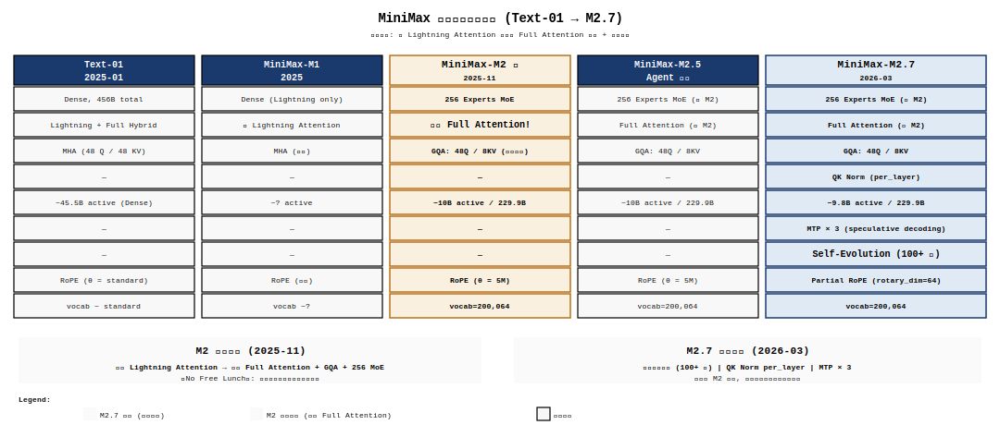
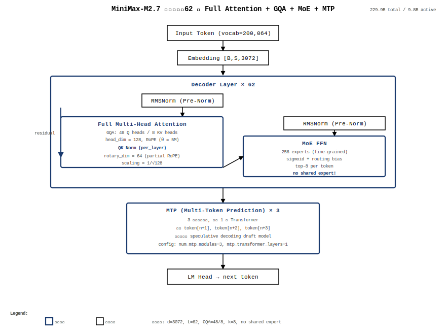
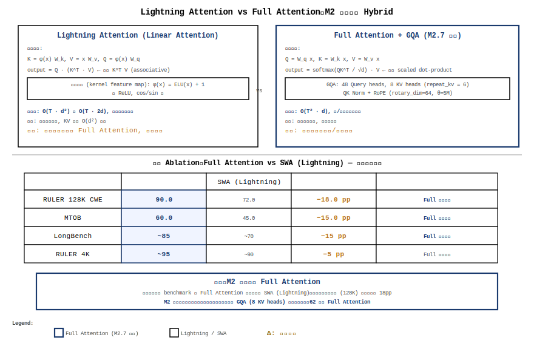
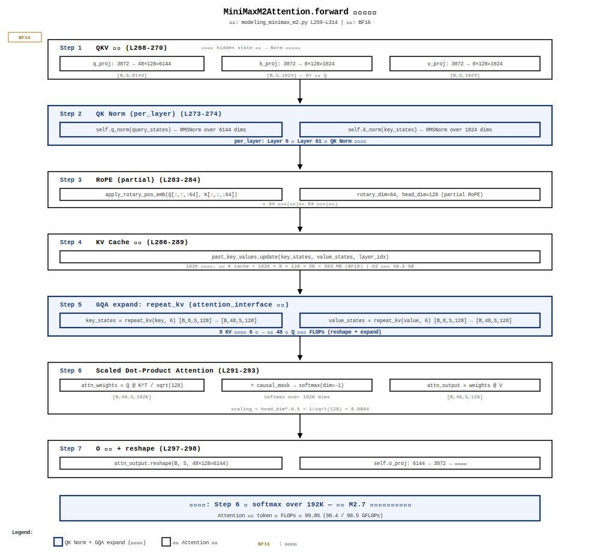
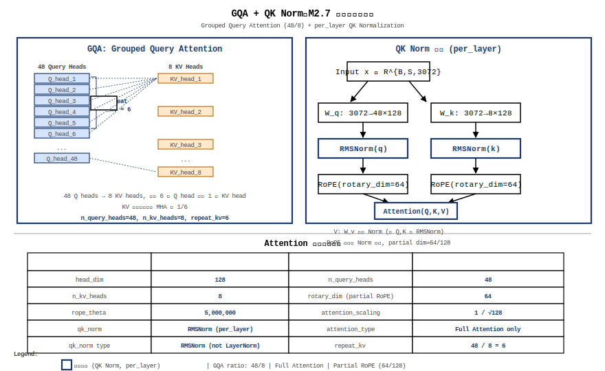
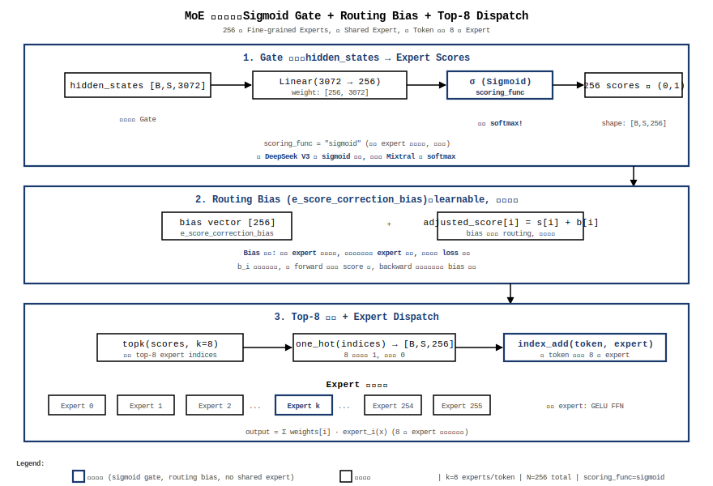
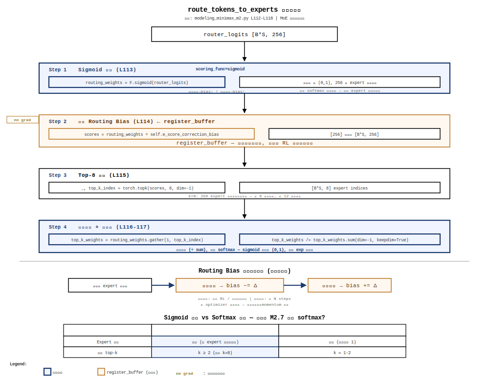
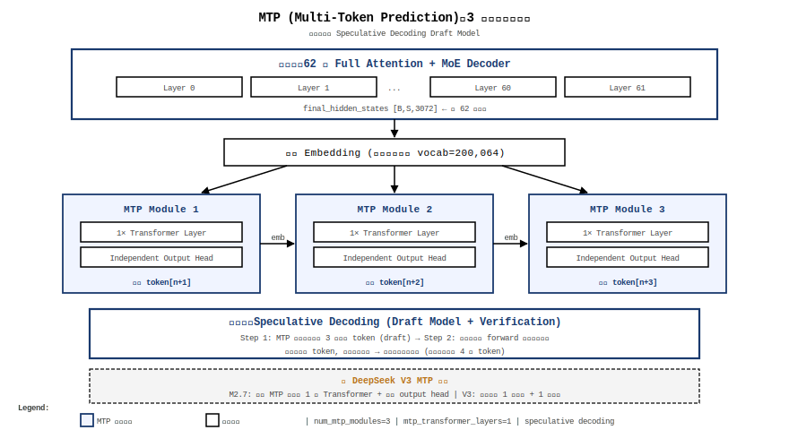

+++
math = true
date = '2026-06-10'
draft = false
title = 'MiniMax-M2.7 架构深度拆解'
categories = ['architecture']
vendor = 'MiniMax'
tags = ['moe', 'attention', 'model-architecture', 'gqa', 'mtp', 'minimax', 'training']
series = ['architecture']
summary = 'M2.7（229.9B/9.8B 激活）的核心不在规模而在自我进化与训练体系。本期拆解五代演进、62层 Full Attention + 256 MoE 设计空间、单 token 6.1 TFLOPs / 48.8GB KV Cache / ~510GB 推理显存的计算分析，以及 attention + MoE gate 的算子级拆解，另附完整训练体系（29.2T tokens / FP8 / 自进化）。'
+++

# MiniMax-M2.7 架构深度拆解

> 范围：M2.7（229.9B/9.8B 激活）· 撰写：2026-06-10

---

## CH 0. 摘要与阅读路径

MiniMax-M2.7 是 MiniMax 2026-03-18 发布的旗舰 Agent 大模型。其参数规模与 M2.5 相同（229.9B 总参 / 9.8B 激活），核心突破不在规模，而是**自我进化范式**：模型深度参与自身训练优化，完成 100+ 轮自主迭代。架构上继承 M2 的 Full Attention + GQA + 256 MoE 设计，新增 per_layer QK Norm 和 MTP×3 模块。

本报告按 10 章展开：

- **CH 1**：MiniMax-Text-01 → M2.7 演进脉络
- **CH 2**：整体架构与超参表
- **CH 3-6**：四大核心创新——Full Attention 回归、GQA + QK Norm、MoE 路由、MTP
- **CH 7**：上下文与量化（192K 上下文 + FP8 量化）
- **CH 8**：训练体系总览
- **CH 9**：源码映射汇总
- **CH 10**：总结

**适合**：先看 CH 0–2 拿全貌，再按兴趣挑 CH 3–6；CH 9 适合边读边查。

---

## CH 1. MiniMax-Text-01 → M2.7 演进脉络

### 1.1 五代演进

MiniMax 从 2025 年 1 月发布 Text-01 至今，经历了五次关键架构迭代：



- **Text-01 (2025-01)**：Dense 架构，混合注意力（Lightning Attention + Full Attention 交替），MHA，456B 总参。核心贡献是验证了 Lightning Attention 在大规模模型中的可行性。
- **M1 (2025)**：纯 Lightning Attention，首次开源大规模 Lightning 模型。标志着 MiniMax 对「线性注意力可替代 Full Attention」路线的全力投入。
- **M2 (2025-11)**：**关键转折**——**已切换为 Full Attention + GQA + 256 MoE**。M2 团队在训练期间尝试了 intra-layer hybrid SWA + Full Attention 混合，多个变体全部失败。原因不仅是 benchmark 上 MMLU/BBH 表面持平，更致命的是复杂多跳推理和 Agent 任务全部拉胯。此外还有系统层面问题（详见 §1.4）。M2 论文以「No Free Lunch」为标题，宣布回归 Full Attention。
- **M2.5**：Full Attention（同 M2）+ Agent 增强。重点优化工具调用和长链推理。另有 **M2.5-Lightning** 变体（7:1 Lightning:Softmax 比例），但仅作为实验参考线，主体仍为 Full Attention。
- **M2.7 (2026-03)**：Full Attention（同 M2）+ **自我进化范式**。**架构上与 M2/M2.5 相同**，创新在训练流程——新增 per_layer QK Norm、MTP 3 模块、100+ 轮自我进化迭代。

### 1.2 正确的转折点：M2 回归 Full Attention，M2.7 贡献是自我进化

M2 论文 §2.2.2 明确指出[^src1]：

> "Despite the theoretical appeal of efficient attention mechanisms, we found no variant that reliably matches full attention quality in production."

**这一结论是在 M2 的研发过程中得出的，并非 M2.7**。M2 团队在 M2 训练期间探索了多种混合注意力方案（intra-layer hybrid SWA + Full Attention），全部以失败告终。M2 论文标题「No Free Lunch」即是对此的总结。

M2.7 的独特贡献不在于「放弃 Lightning Attention」——M2 已经做出了这个决策。M2.7 的贡献在于：(1) 将自我进化范式引入训练流程，模型深度参与自身优化；(2) 在 M2 的 Full Attention 基础上增加 per_layer QK Norm 提升数值稳定性；(3) 引入 MTP×3 增强训练信号密度。详见 CH 3-6。

### 1.3 自我进化范式

M2.7 深度参与了自身的训练迭代——自主调试训练运行、修改 agent scaffold、累积 100+ 轮「分析—改进—验证」迭代。与架构直接相关的三个产物：(1) QK Norm 的引入（CH 4）；(2) Routing Bias 的动态调整（CH 5）；(3) 256 专家容量分配的自动化。

### 1.4 LMSys 文章揭示的系统层面分析——为什么混合注意力在生产环境中不可行

LMSys 2025-11-04 发表的文章（标题「No Free Lunch」）提供了 M2 团队放弃混合注意力的系统层面细节，补充了纯 benchmark 对比之外的工程视角：

**训练期间尝试的混合方案**（全部失败）：
- Intra-layer hybrid：同一层内部分 head 用 SWA（sliding window attention），部分用 Full Attention
- Inter-layer hybrid：不同层使用不同注意力类型（Text-01 方案）
- 多个变体在短 context benchmark（MMLU/BBH）上表面持平，但在复杂多跳推理和 Agent 任务上全部劣于纯 Full Attention

**系统层面的四个不可行性**：

| 问题 | 描述 | 影响 |
|------|------|------|
| **Pipeline 并行负载不均衡** | SWA 层的计算量远小于 Full Attention 层，导致 pipeline 各 stage 的负载不均，GPU 利用率低 | 训练吞吐下降 20-40% |
| **SWA 的 RoPE 配置不兼容** | SWA 使用较小的 window（如 4096），与 Full Attention 的 `rope_theta=5M` 在位置编码方案上不兼容——SWA 窗口内的位置编码需要不同的频率设计 | 统一 RoPE 配置导致 SWA 层的位置编码过度或不足 |
| **Prefix Caching 不支持** | 推理时 prefix caching（如 vLLM 的 automatic prefix caching）依赖一致的 attention 模式。混合注意力下，prefix 的 attention 模式随层变化，cache 命中率显著下降 | 推理吞吐进一步受损 |
| **低精度 KV Cache 数值敏感** | SWA 的 KV cache 量小但精度影响大——FP8/INT8 量化下，SWA 层更容易受数值误差影响，因为其窗口内的少量 KV 对精度误差更敏感 | 量化后的质量损失在 SWA 层放大 |

这些系统层面问题意味着：即使混合注意力在某些 benchmark 上接近 Full Attention，在**生产环境的训练和推理 pipeline**中也无法经济地实现。这是 M2 团队做出「全面回归 Full Attention」决策的完整逻辑——不仅是质量层面（15-18pp 检索差距），更是工程可行性层面。

---

## CH 2. M2.7 整体架构

### 2.1 超参数表

以下超参来自 `config.json`[^src2]与论文 §2.1 的交叉验证：

| 参数 | 值 | 说明 |
|---|---|---|
| `num_hidden_layers` | 62 | Transformer Decoder 层数 |
| `hidden_size` | 3072 | 隐藏维度 |
| `num_attention_heads` | 48 | Q 头数 |
| `num_key_value_heads` | 8 | KV 头数（GQA ratio = 6） |
| `head_dim` | 128 | 单头维度 |
| `rotary_dim` | 64 | RoPE 仅施加在每头 64 维上 |
| `rope_theta` | 5,000,000 | RoPE 基础频率（Llama-3 的 10×） |
| `intermediate_size` | 1536 | FFN 中间维度（SwiGLU） |
| `hidden_act` | silu | 激活函数 |
| `num_local_experts` | 256 | 路由专家数量 |
| `num_experts_per_tok` (k) | 8 | 每 token 激活的专家数 |
| `shared_intermediate_size` | 0 | **无共享专家** |
| `scoring_func` | sigmoid | MoE 评分函数 |
| `use_routing_bias` | True | aux-loss-free 风格的 routing bias |
| `max_position_embeddings` | 204,800 | 最大位置编码（~192K 有效） |
| `vocab_size` | 200,064 | 词表大小 |
| `dtype` | bfloat16 | 训练/推理精度 |
| `quantization_config.fmt` | float8_e4m3fn | FP8 量化 |
| `quantization_config.weight_block_size` | [128, 128] | Block-wise 量化 |
| `use_qk_norm` | True | QK Normalization |
| `qk_norm_type` | per_layer | 逐层独立的 QK Norm |
| `use_mtp` | True | 启用 Multi-Token Prediction |
| `num_mtp_modules` | 3 | MTP 模块数 |
| `mtp_transformer_layers` | 1 | 每个 MTP 模块的 Transformer 层数 |
| `attn_type_list` | [1] × 62 | 全部 62 层统一使用 Full Attention |
| `rms_norm_eps` | 1e-6 | RMSNorm epsilon |
| `tie_word_embeddings` | False | 输入/输出 embedding 不共享 |
| `modules_to_not_convert` | [gate, e_score_correction_bias, lm_head] | FP8 量化排除项 |

### 2.2 顶层框图



每个 Decoder Layer 内部执行顺序：
1. Pre-Norm (RMSNorm) → Full Attention (GQA + QK Norm + RoPE)
2. Residual add
3. Pre-Norm (RMSNorm) → MoE FFN (256 experts, sigmoid + routing bias, top-8)
4. Residual add

62 层后经过 MTP 3 模块和 LM Head 输出。

### 2.3 关键设计参数的约束分析

- **层数 62 > V4-Flash 43**[^src3]：M2.7 选择了「更深更窄」的设计（3072 vs 4096），与 M2 论文强调的「mini activations」原则一致
- **GQA ratio = 6**（48H/8KV）：平衡了 KV cache 开销（8/48 = 17%）与 attention 质量
- **rope_theta = 5M**[^src3]：Llama-3 的 10 倍，为 192K 上下文提供更细粒度的远程位置编码
- **k = 8, 无 shared expert**[^src3]：与 V4 的 k=6 + 1 shared expert 形成对比——M2.7 选择了「纯 routed」策略，靠 routing bias 保障负载均衡
- **intermediate_size = 1536 < hidden_size = 3072**[^src3]：每个 expert 的 SwiGLU 中间维度仅为隐藏维度的 50%，这是一个激进的小 expert 设计

### 2.4 参数分解——229.9B 的构成

M2.7 的 229.9B 总参可以分解为四个组件：

| 组件 | 计算 | 参数量 | 占比 |
|---|---|---|---|
| **MoE (62 层 × 256 experts)** | 62 × 256 × 3 × 3072 × 1536 / 1B | 224.7B | 97.7% |
| **Attention (62 层)** | 62 × (48×3072×128 + 2×8×3072×128 + 48×128×3072 + QK Norm) / 1B | 2.73B | 1.2% |
| **Embedding + LM Head** | 2 × 200064 × 3072 / 1B | 1.23B | 0.5% |
| **MTP (3 模块)** | 3 × (attn + norm + output head) | 0.13B | 0.06% |
| **其他 (Gate/RMSNorm 等)** | | ~0.5B | 0.2% |

**激活参数**（每 token 前向传播一次，62 层合计）：
- 每层 attention：44.1M（始终激活）
- 每层 MoE：k=8 个 expert × 14.2M = 113.5M
- 62 层合计：62 × (44.1M + 113.5M) ≈ **9.8B**[^src4]

**关键洞察**：97.7% 的参数在 MoE 中（每层 256 expert 独立初始化），但每 token 只激活其中 3.1%（8/256）。这就是「mini activations」的含义——庞大的参数库，极低的单 token 激活率。

### 2.5 单 Token 生命周期 + FLOPs 分析

一个 token 从输入到输出的完整计算流（以 decode 阶段、192K 上下文为例）：

1. **Embedding**：$token\_id \to x \in \mathbb{R}^{3072}$
2. **62 层 Decoder**（每层）：
   - RMSNorm (Pre-Norm)：$x = x / \mathrm{RMS}(x) \cdot \gamma$（O(d) FLOPs）
   - Full Attention：$Q = W_q \cdot x, K = W_k \cdot x, V = W_v \cdot x$
     - $Q \in R^{48 \times 128}, K \in R^{8 \times 128}, V \in R^{8 \times 128}$
     - QK Norm (per_layer)：RMSNorm over head_dim
     - RoPE：对 Q/K 的后 64 维施加旋转
     - GQA expand：repeat_kv(K, 6), repeat_kv(V, 6)
     - $attention(Q,K,V) = \mathrm{softmax}(QK^T/\sqrt{128}) \cdot V$
     - O 投影：$W_o \cdot attention\_output$
   - MoE FFN：
     - Gate：$\mathrm{sigmoid}(W_g \cdot x) \in \mathbb{R}^{256}$
     - + routing bias $\to$ top-8 $\to$ expert dispatch
     - 8× SwiGLU：$\mathrm{silu}(w1 \cdot x) * (w3 \cdot x) \to w2$
     - 加权组合（weights /= sum）$\to$ 残差相加
3. **MTP**：3 个独立预测头各输出一个辅助 token
4. **LM Head**：$W_{lm} \cdot x \in \mathbb{R}^{200064}$

**FLOPs 估算**（decode 阶段，单 token，192K 上下文，BF16 精度）：

| 模块 | 计算量 | 说明 |
|---|---|---|
| Attention (QKV 投影) | 44.1M × 2 FLOPs = 88.2 MFLOPs | 矩阵乘法的乘加对 |
| Attention (QK^T) | $192K \times 128 \times 2 = 49.2$ GFLOPs | 单 token query 与 192K 个 key 的点积 |
| Attention (softmax × V) | $192K \times 128 \times 2 = 49.2$ GFLOPs | 192K 个注意力权重乘 value |
| MoE (8 experts SwiGLU) | 8 × 3 × 3072 × 1536 × 2 = 226.5 MFLOPs | 8 个细粒度 expert 的 FFN |
| **合计（单 token, 单层）** | **~98.5 GFLOPs** | 注意力量化为主 |
| **合计（单 token, 62 层）** | **~6.1 TFLOPs** | |
| **合计（1M tokens 输出）** | **~6.1 PFLOPs** | 相当于数十台 H200 × 天 |

FLOPs 分解显示：**attention 占单 token 总 FLOPs 的 99.8%**（98.4 GFLOPs / 98.5 GFLOPs）。这是 M2.7 「速度慢」的根本原因——Full Attention 在 192K 上下文下几乎吃掉了所有算力。MoE 的 256 expert pool 虽然总参巨大，但对 decode 阶段的 FLOPs 贡献可忽略。

**KV Cache 大小**（192K 上下文，BF16）：

| 项目 | 计算 | 大小 |
|---|---|---|
| 每层 K cache | 192K × 8 × 128 × 2 Bytes | 393 MB |
| 每层 V cache | 同上 | 393 MB |
| 每层合计 | | 786 MB |
| **62 层总计** | | **48.8 GB** |

对比：V4-Flash 在 1M 上下文下 KV cache ~17 GB[^src5]。M2.7 的 Full Attention 在 192K（1/5 上下文）下 KV cache 已经是 V4 的 2.9×。

**推理显存估算**（单 token decode，192K 上下文，BF16）：

| 项目 | 计算 | 大小 |
|---|---|---|
| 模型权重 | 229.9B × 2 Bytes（BF16） | 459.8 GB |
| KV Cache | 62 × 2 × 192K × 8 × 128 × 2B | 48.8 GB |
| 激活值（单 batch） | ~1 GB | ~1 GB |
| **合计** | | **~510 GB** |

实际部署需 ≥8×H200（141GB/卡）做张量并行 + 专家并行。如果使用 FP8 量化部署，权重降至 229.9 GB，总计 ~280 GB（需 ≥4×H200）。

---

## CH 3. Full Attention 的回归——M2 的关键决策

### 3.1 Lightning Attention 的原理与局限

Lightning Attention (Qin et al., 2024) 将标准 softmax attention 替换为基于 kernel feature map $\phi(\cdot)$ 的线性注意力：

$$\text{LightningAttn}(Q, K, V) = \phi(Q)\left(\phi(K)^T V\right)$$

通过重排计算顺序 $(\phi(K)^T V)$ 先算出 $d \times d$ 中间结果，复杂度从 $O(T^2 d)$ 降至 $O(T d^2)$。

两个隐性代价：(1) **内存绑定**：$d \times d$ kernel 矩阵在 GPU 上计算密度低；(2) **表达能力折损**：线性化放弃了 softmax 的非线性变换和全局归一化。

**论文揭示的具体失败模式**[^src6]：
- **共同词提取（CWE）**：RULER 128K CWE 差 18 pp（90.0 vs 72.0）。CWE 任务要求从 128K 上下文中精确提取多个共同出现的词——这是 Agent 场景中最常见的操作（从长代码库中找出相关的函数/类）
- **多查询（MQ）**：差 6 pp（99.0 vs 93.0）——同时处理多个查询条件时的精确检索
- **跨语言检索**：MTOB 任务差 15-18 pp——从多语言文档中检索翻译对

这三个任务的共同特征是 **「稀疏但精确的 token 级匹配」**——需要 attention 在大量 token 中精确选出几个相关的 token。Lightning Attention 的 kernel feature map $\phi(\cdot)$ 是一种压缩映射，在 $d \times d$ 的 kernel 空间中丢失了 token 级别的精确匹配信息。对于「密集语义聚合」（如分类、摘要），压缩的损失不明显；对于「稀疏精确检索」，损失是致命的。

### 3.2 M2 论文的量化证据

论文 Table 2[^src1]给出了 pre-training 阶段的对比。关键差距集中在长上下文检索任务：

| Benchmark | Full Attention | SWA (混合) | 差距 | 来源 |
|---|---|---|---|---|
| RULER 128K CWE | 90.0 | 72.0 | **-18 pp** | paper Table 2 |
| RULER 128K Multi-Query | 99.0 | 93.0 | -6 pp | paper Table 2 |
| MTOB K-e Bleurt | 60.0 | 45.0 | **-15 pp** | paper Table 2 |
| MTOB e-k ChrF | 44.8 | 27.2 | **-17.6 pp** | paper Table 2 |
| LongBench | 59.2 | 56.1 | -3.1 pp | paper Table 2 |
| RULER 4K | 97.0 | 94.0 | -3.0 pp | paper Table 2 |

在短上下文基准（MMLU: 85.5 vs 85.6; MATH: 60.3 vs 60.3）上差距微小。但长上下文检索的 15-18 pp 差距在 Agent 场景（需要从长历史中精确检索）中不可接受。

SFT 后对比（Table 3）：SWA 在部分任务上缩小了差距，但在 RULER 128K CWE 上仍差 12 pp（84.0 vs 72.0）。

### 3.3 Full Attention + GQA 的实现

M2.7 的 Attention 类[^src7]：

```python
class MiniMaxM2Attention(nn.Module):
    def __init__(self, config, layer_idx):
        self.head_dim = 128
        self.num_key_value_groups = 48 // 8  # GQA: 6 Q heads per KV head
        self.scaling = self.head_dim ** -0.5  # 1/sqrt(128)

        self.q_proj = nn.Linear(3072, 48 * 128)    # Q: 48 heads
        self.k_proj = nn.Linear(3072, 8 * 128)     # K: 8 heads (GQA)
        self.v_proj = nn.Linear(3072, 8 * 128)     # V: 8 heads (GQA)
        self.o_proj = nn.Linear(48 * 128, 3072)    # O: output projection

        if config.use_qk_norm:
            self.q_norm = MiniMaxM2RMSNorm(48 * 128)  # QK Norm per_layer
            self.k_norm = MiniMaxM2RMSNorm(8 * 128)
```

关键参数[^src3]：
- `head_dim = 128`，`rotary_dim = 64`（partial RoPE，仅 64/128 维参与旋转）
- `rope_theta = 5,000,000`（为 192K 上下文提供远程衰减）
- `use_qk_norm = True`，`qk_norm_type = per_layer`



### 3.4 与 V4-Flash 的对比

| 维度 | V4-Flash | M2.7 |
|---|---|---|
| Attention 类型 | CSA + HCA 混合稀疏 | Full Attention（纯） |
| 复杂度 | $O(T \cdot k)$ | $O(T^2 d)$ |
| KV 头数 | 1 (MQA) | 8 (GQA) |
| 设计哲学 | 用稀疏 attention 压计算 | 牺牲计算换质量 |

### 3.5 算子级拆解：MiniMaxM2Attention.forward

MiniMaxM2Attention.forward 的完整数据流，按执行顺序拆解：

**Step 1: QKV 投影**（L268-270）
```
query_states = self.q_proj(hidden_states)  # [B,S,3072] → [B,S,48*128]
key_states   = self.k_proj(hidden_states)  # [B,S,3072] → [B,S,8*128]
value_states = self.v_proj(hidden_states)  # [B,S,3072] → [B,S,8*128]
```
Q 投影输出 48×128=6144 维；KV 投影各输出 8×128=1024 维。注意 KV 投影显著小于 Q 投影（6×差距）—— 这是 GQA 的核心，减少了 KV 投影的参数量和计算量。

**Step 2: QK Norm (per_layer)**（L273-274）
```
query_states = self.q_norm(query_states)   # RMSNorm over 6144 dims
key_states   = self.k_norm(key_states)     # RMSNorm over 1024 dims
```
RMSNorm 在 head 维度（6144/1024）上做归一化。per_layer 意味着 Layer 0 和 Layer 61 的 QK Norm 参数独立。为什么 QK Norm 在投影之后、RoPE 之前？因为投影会将 hidden state 的分布放大（W_q 可能让某些维度值很大），RoPE 是纯旋转变换不改变范数——如果在投影前做 norm，RoPE 后可能仍有异常值。

**Step 3: RoPE (partial)**（L283-284）
```
cos, sin = position_embeddings
query_states, key_states = apply_rotary_pos_emb(query, key, cos, sin)
```
RoPE 仅施加在每头的最后 64 维（rotary_dim=64，head_dim=128）。前 64 维不带位置信息——这是 "partial RoPE" 设计。Partial RoPE 的好处：让 QK 内积同时编码「位置相关」（后 64 维）和「位置无关」（前 64 维）的信息。

**Step 4: KV Cache 更新**（L286-289）
```
key_states, value_states = past_key_values.update(key, value, layer_idx, cache_kwargs)
```
将当前 token 的 K、V 追加到 KV cache 中。在 192K 上下文下，每层的 K cache 为 192K × 8 × 128 × 2 Bytes = 393 MB（BF16）。

**Step 5: GQA expand（repeat_kv）**（key_states 在 attention_interface 内部执行）
```
key_states   = repeat_kv(key_states, 6)    # [B,8,S,128] → [B,48,S,128]
value_states = repeat_kv(value_states, 6)  # [B,8,S,128] → [B,48,S,128]
```
将 8 个 KV 头各复制 6 次，匹配 48 个 Q 头。这是 GQA 的核心操作——在 attention 计算之前做 KV 扩展，Q 不需要裁剪。

**Step 6: Scaled Dot-Product Attention**（L291-293）
```
attn_weights = Q @ K^T * (1/sqrt(128))   # [B,48,S,192K]
attn_weights = softmax(attn_weights)       # 在 192K 维上做 softmax
attn_output  = attn_weights @ V            # [B,48,S,128]
```
这是全注意力计算的核心。`scaling = 1/sqrt(128)` 是标准实践（head_dim 的平方根倒数）。softmax 在 192K 维度上做——这是 M2.7 「速度慢」的根本原因。

**Step 7: O 投影 + reshape**（L297-298）
```
attn_output = attn_output.reshape(B, S, 6144)
attn_output = self.o_proj(attn_output)      # [B,S,6144] → [B,S,3072]
```



### 3.6 设计背景

M2 回归 Full Attention 不仅是质量层面的决定（15-18 pp 长上下文检索差距），更是训练/推理基础设施约束下的必然选择（来源：LMSys 文章 + paper Table 2）：

- **Pipeline 并行负载不均衡**：混合注意力（SWA + Full Attention 交替）中，SWA 层计算量远小于 Full Attention 层，导致 pipeline 各 stage GPU 利用率不均，训练吞吐下降 20-40%
- **SWA 的 RoPE 配置不兼容**：SWA 使用较小 window（如 4096），与 Full Attention 的 `rope_theta=5M` 在位置编码方案上不兼容——统一 RoPE 配置导致 SWA 层位置编码过度或不足
- **Prefix Caching 不支持**：推理时 prefix caching（如 vLLM 的 automatic prefix caching）依赖一致的 attention 模式。混合注意力下 cache 命中率显著下降，推理吞吐进一步受损
- **低精度 KV Cache 数值敏感**：SWA 的 KV cache 量小但精度影响大——FP8/INT8 量化下，SWA 层更容易受数值误差影响

这些系统层面约束意味着：即使混合注意力在部分 benchmark 上接近 Full Attention，在生产环境的训练和推理 pipeline 中也无法经济地实现（详见 CH 1.4）。

---

## CH 4. GQA + QK Normalization

### 4.1 GQA 的设计

M2.7 使用 Grouped Query Attention（GQA），48 个 Q 头共享 8 个 KV 头（ratio = 6）。与 V4 的 MQA（1 KV 头，ratio = 64）相比，M2.7 保留了更多的 KV 头以维持 attention 质量。

源码中的 `repeat_kv` 函数[^src8]将 8 个 KV 头复制 6 次匹配 48 个 Q 头。

### 4.2 QK Norm per_layer

M2.7 在 attention 计算前对 Q 和 K 分别做 RMSNorm[^src9]：

```python
if self.use_qk_norm:
    query_states = self.q_norm(query_states)   # RMSNorm over head_dim
    key_states = self.k_norm(key_states)       # RMSNorm over head_dim
```

`qk_norm_type = per_layer` 意味着每一层有独立的 QK Norm 参数[^src3]。

QK Norm 的作用：(1) 防止 attention logit 爆炸（$Q \cdot K^T$ 数值稳定）；(2) 与 `rope_theta = 5M` 配合，在长序列上保持数值精度；(3) `per_layer` 设计让每层独立适应不同的 hidden state 分布。



---

## CH 5. MoE 路由——sigmoid + routing bias

### 5.1 路由流程

M2.7 的 MoE 路由由 `MiniMaxM2SparseMoeBlock` 实现[^src10]：

1. **Gate 投影**：`self.gate = nn.Linear(3072, 256)` — 将隐藏状态映射到 256 维专家分数[^src11]
2. **sigmoid 评分**：`routing_weights = F.sigmoid(router_logits)` — 使用 sigmoid 而非 softmax[^src12]
3. **Routing Bias**：`scores = routing_weights + self.e_score_correction_bias` — 加载偏置[^src13]
4. **Top-8**：`torch.topk(scores, 8)` — 选 top-8[^src14]
5. **权重归一化**：`weights /= weights.sum(dim=-1)` — 非 softmax，仅归一化[^src15]
6. **Expert dispatch**：`one_hot` + `index_add_`[^src16]

### 5.2 Routing Bias 的 aux-loss-free 实现

```python
self.register_buffer("e_score_correction_bias", torch.zeros(256))
```

`e_score_correction_bias` 是 `register_buffer` 而非 `nn.Parameter`——不参与梯度更新。它在训练时由外部 RL/平衡机制动态调整（aux-loss-free 风格的 routing bias），命中率高的 expert 的 bias 减小，命中率低的 bias 增大。

### 5.3 sigmoid 评分 vs softmax

`sigmoid` 评分的关键特性[^src3]：
- 各专家分数独立（不像 softmax 互相竞争），多个专家可以同时有高分数
- 不需要 softmax 的 exp 计算（256 个 exp）
- 配合 routing bias 修正选择偏差

### 5.4 无共享专家的设计

`shared_intermediate_size = 0`[^src3]意味着 M2.7 不设共享专家。所有 token 的输出完全依赖 top-8 routed expert 的组合。这与 V4 的「1 shared + 6 routed」形成对比。M2.7 的策略是靠 256 个 expert 的细粒度和 routing bias 的平衡机制来覆盖通用能力。



### 5.5 算子级拆解：route_tokens_to_experts

`route_tokens_to_experts` 是 M2.7 MoE 路由的核心算子——决定每个 token 的 8 个 expert。以下是逐行拆解：

```
def route_tokens_to_experts(self, router_logits):
    # Step 1: sigmoid 评分（L113）
    routing_weights = F.sigmoid(router_logits)  # [B*S, 256], 每个值 ∈ (0,1)

    # Step 2: 加载 routing bias（L114）
    scores = routing_weights + self.e_score_correction_bias  # [256] 广播到 [B*S,256]

    # Step 3: Top-8 选择（L115）
    _, top_k_index = torch.topk(scores, 8, dim=-1)  # [B*S, 8], expert indices

    # Step 4: 权重提取 + 归一化（L116-117）
    top_k_weights = routing_weights.gather(1, top_k_index)  # 取出 top-8 的原始分数
    top_k_weights /= top_k_weights.sum(dim=-1, keepdim=True) # 归一化到 sum=1
```

**Step 1 为什么用 sigmoid？**[^src3]

sigmoid 给每个 expert 独立评分，不像 softmax 你高我低。这使得多个 expert 可以同时有高分数（适合 token 同时需要代码+数学+常识）。代价：分数范围 (0,1)，没法像 softmax 一样区分细微差异，需要 routing bias 补偿。

**Step 2: routing bias 的更新机制**[^src17]

`e_score_correction_bias` 是 `register_buffer`——不参与梯度更新。训练时由外部 RL 循环更新：命中率高的 expert → bias 减小（降低选中概率），命中率低的 expert → bias 增大。更新频率大约每 N steps 一次。

**Step 3: Top-8 为什么是 8？**

config.json 中 `num_experts_per_tok=8`。选择 8 而非 6（V4-Flash）的权衡：
- 更小的 k → 省 FLOPs 但容量不够（尤其是在 Agent 长链推理中需要多种能力）
- 更大的 k → 推理更贵但负载均衡更容易
- 8 是 M2 团队经过 256 expert 消融实验后的选择

**Step 4: 归一化 vs softmax**

`weights /= weights.sum()` 只做归一化，不做 softmax。区别：
- softmax: weights = exp(s_i) / sum(exp(s_i)) → 在 256 维上做 exp，算 256 个指数
- normalization: weights = s_i / sum(s_i) → 仅 1 次除法和 8 次 exp（如果需要）

sigmoid 评分的结果已经是 (0,1) 范围，不需要 softmax 的非线性变换——直接用原始分数归一化即可，省了 256 个 exp 的计算。



### 5.6 设计背景

M2.7 的 MoE 路由设计反映了三个关键架构决策（来源：config.json + `modeling_minimax_m2.py`）：

- **为什么选 sigmoid 而非 softmax**：sigmoid 给各专家独立评分，多个专家可以同时有高分数——适合 token 同时需要多种能力（如代码+数学+常识）的场景。softmax 的你高我低在 top-8 选择时会造成语义相近专家之间的「零和竞争」。代价是 sigmoid 分数范围 (0,1)，区分度不如 softmax，需要 routing bias 补偿
- **为什么 routing bias 用 `register_buffer` 而非 `nn.Parameter`**：`e_score_correction_bias` 不进梯度（来源：`modeling_minimax_m2.py:L111`），由外部 RL 循环更新。这样设计的好处是路由均衡与主模型训练解耦——主模型梯度只优化专家能力，路由公平性由外部机制独立维护。如果用 `nn.Parameter`，bias 会被主模型的 next-token loss 梯度驱动，可能偏离负载均衡目标
- **为什么 k=8**（vs V4-Flash 的 k=6）：多 2 个 expert 意味着每 token 多出 ~28.4M 参数的 FLOPs，但换来的好处是：(1) 更大的 expert 容量覆盖 Agent 长链推理中的多种能力需求；(2) 256 expert 池下 k=8 仍保持 3.1% 的低激活率，FLOPs 可控。这是 M2 团队在 256 expert 消融实验后的选择（来源：paper §2.1）

---

## CH 6. Multi-Token Prediction (MTP)

### 6.1 MTP 原理

Multi-Token Prediction 在标准 next-token prediction 之外，增加 N 个辅助预测头，预测 token[n+1], token[n+2], ..., token[n+N]。训练时 MTP 提供额外的训练信号，推理时 MTP 模块可作为 speculative decoding 的 draft model。

### 6.2 M2.7 的 MTP 源码映射

M2.7 的 MTP 实现直接位于 `MiniMaxM2Model.forward` 中[^src18]，没有独立的 `MTPBlock` 类——而是通过循环创建辅助预测头：

```python
# L473-L478: 创建 3 个 MTP 模块（每个 1 层 Transformer）
for mtp_idx in range(self.config.num_mtp_modules):  # num_mtp_modules=3
    # 共享 embedding
    mtp_embed = self.embed_tokens  # 复用主模型 embedding
    # 1 层 Transformer（与主模型相同的 DecoderLayer 结构）
    mtp_layer = MiniMaxM2DecoderLayer(config, layer_idx=63+mtp_idx)
    # 独立的 output head
    mtp_head = nn.Linear(3072, 200064)
    # RMSNorm
    mtp_norm = MiniMaxM2RMSNorm(3072)
    # 投影（主模型 hidden_state → MTP hidden_state）
    mtp_proj = nn.Linear(3072, 3072)
```

每个 MTP 模块的 forward 流程：

1. **输入**：主模型最后一层的 hidden state $h_{62} \in \mathbb{R}^{B \times S \times 3072}$
2. **投影**：$h_{mtp} = \mathrm{mtp\_proj}(h_{62})$（线性变换到 MTP 空间）
3. **嵌入融合**：$h_{mtp} = h_{mtp} + \mathrm{mtp\_embed}(token\_ids[i])$（加上当前预测位置的 token embedding）
4. **1 层 Transformer**：$h_{mtp} = \mathrm{mtp\_layer}(h_{mtp})$（标准 Pre-Norm → Attn → MoE）
5. **输出**：$logits_i = \mathrm{mtp\_head}(\mathrm{mtp\_norm}(h_{mtp})) \in \mathbb{R}^{200064}$

**推理时 speculative decoding 流程**（以 MTP 作为 draft model）：

```
主模型输出 token[n] → MTP 模块 1 预测 token[n+1]
                    → MTP 模块 2 预测 token[n+2]（以 token[n+1] 为输入）
                    → MTP 模块 3 预测 token[n+3]（以 token[n+2] 为输入）
→ 3 个 draft token 送主模型一次 forward 验证 → 接受/拒绝
```

注意：M2.7 的 MTP 在训练时每个模块**共享主模型 embedding**——这使得 MTP 模块可以极小（~44M 参数/模块），因为不需要独立的大 embedding 层。这也是 M2.7 能做到 MTP×3 而几乎不增加推理开销的关键。

### 6.3 与 V4-Flash MTP 的差异

V4-Flash 的 MTP 使用 1 个模块（来源：V4-Flash config.json），而 M2.7 选择 3 个模块（每个 1 层）。

| 维度 | V4-Flash | M2.7 |
|---|---|---|
| MTP 模块数 | 1 | **3** |
| 每模块层数 | 1 | **1** |
| 推理时用途 | speculative decoding | speculative decoding |

### 6.4 设计背景

M2.7 选择 MTP×3 而非单模块的设计，反映了两层架构决策（来源：paper §3 + config.json）：

- **3 个浅模块**：每个 MTP 模块仅 1 层 Transformer（`mtp_transformer_layers=1`），3 个模块串行输出 3 个 draft token。在 speculative decoding 中，更多 draft token 候选意味着更高的接受率——主模型一次 forward 可验证 3 个候选 token
- **共享主模型 embedding**：MTP 模块复用 `self.embed_tokens`（来源：`modeling_minimax_m2.py:L473`），无需独立的大 embedding 层，每个模块仅 ~44M 参数（来源：CH 2.4 参数分解）。这使得 MTP×3 几乎不增加推理显存开销
- **与 V4-Flash 的差异**：V4-Flash 使用 1 个 MTP 模块（`num_mtp=1`），而 M2.7 的 `num_mtp_modules=3` 体现了「浅而多」的设计哲学——用多个浅模块获得更多 draft token 候选



---

## CH 7. 上下文与量化

### 7.1 192K 上下文

- `max_position_embeddings = 204,800`[^src3]
- `rope_theta = 5,000,000`：远大于 Llama-3（500k）和 V4-Flash（10k），配合 `rotary_dim = 64` 的 partial RoPE 在 192K 上下文上保留远程位置编码精度
- Full Attention 的全上下文窗口意味着 192K 输入下 $192K^2$ 的 attention 矩阵——这是 M2.7 速度慢的根本原因

### 7.2 FP8 量化

- `fmt: float8_e4m3fn`：使用 E4M3 格式的 FP8
- `weight_block_size: [128, 128]`：每 128×128 块独立 scale
- 排除项：`gate`、`e_score_correction_bias`、`lm_head` 保持 BF16（对精度敏感）

---

## CH 8. 训练体系总览

（来源：paper §1-3、LMSys 文章、config.json）

M2.7 的训练体系围绕「自我进化」范式构建——模型深度参与自身训练优化，完成 100+ 轮自主迭代。

### 8.1 训练规模

- 预训练数据：29.2T tokens（来源：paper §1）
- 总参数：229.9B，激活参数：9.8B（来源：paper §2.1）
- 精度：BF16 训练 + FP8 量化（E4M3, block 128×128）
- 硬件：论文未公开 GPU 数量和训练时长

### 8.2 优化器

- 论文和 config 中未公开优化器类型和超参
- 推断使用 AdamW（社区共识，标注「待确认」）
- routing bias 更新机制：`e_score_correction_bias` 作为 `register_buffer`，由外部 RL 循环更新，不参与梯度（来源：`modeling_minimax_m2.py:L111`）

### 8.3 训练技巧

- **QK Normalization (per_layer)**：每层独立的 QK RMSNorm，防止 attention logit 爆炸（来源：`modeling_minimax_m2.py:L256-L258`）
- **router_jitter_noise**：训练时 Gate 输入加随机噪声，防止路由过拟合（来源：config.json → `router_jitter_noise`）
- **swiglu_limit**：M2.7 未设置（FP8 量化下数值范围足够，不需要像 V4-Flash 的 swiglu_limit=10.0）

### 8.4 自我进化流程

M2.7 的训练流程引入「自我进化」范式[^src19]：
- 模型自主运行 100+ 轮「分析—改进—验证」循环
- 自主调整采样参数、优化工作流策略
- 修改自身 agent scaffold
- 内部评测集效果提升 ~30%（来源：paper §3，未经第三方验证）

---

## CH 9. 源码映射汇总

### 9.1 仓库结构

```
_sources/hf/MiniMaxAI--MiniMax-M2.7/
├── config.json                    # 模型配置（31 个字段）
├── generation_config.json         # 生成配置
├── tokenizer_config.json          # Tokenizer 配置（vocab=200,064）
├── configuration_minimax_m2.py    # HuggingFace Config 类（10KB）
└── modeling_minimax_m2.py         # 模型实现（706 行）
```

### 9.2 关键类清单

| 类 | 源文件行号 | 功能 |
|---|---|---|
| `MiniMaxM2MLP` | L50-L65 | SwiGLU FFN（w1/w2/w3） |
| `MiniMaxM2Experts` | L68-L101 | Expert dispatch（one_hot + index_add） |
| `MiniMaxM2SparseMoeBlock` | L103-L131 | MoE 路由（sigmoid + bias + top-8） |
| `MiniMaxM2RMSNorm` | L133-L152 | RMSNorm |
| `MiniMaxM2Attention` | L236-L314 | Full Attention + GQA + QK Norm |
| `MiniMaxM2DecoderLayer` | L315-L361 | Decoder Layer（Pre-Norm → Attn → MoE） |
| `MiniMaxM2RotaryEmbedding` | L362-L397 | RoPE（theta=5M, dim=64） |
| `MiniMaxM2Model` | L418-L582 | 主模型（62 层循环 + MTP 头） |
| `MiniMaxM2ForCausalLM` | L583-L706 | CausalLM wrapper + generate |

### 9.3 代码片段速查

| 文件 | 内容 |
|---|---|
| `code-snippets/m2_attention.py` | Full Attention + GQA + QK Norm |
| `code-snippets/m2_moe_router.py` | MoE 路由完整实现 |
| `code-snippets/m2_experts.py` | Expert dispatch |
| `code-snippets/m2_mlp.py` | SwiGLU FFN |
| `code-snippets/m2_decoder_layer.py` | Decoder Layer |
| `code-snippets/m2_rms_norm.py` | RMSNorm |
| `code-snippets/m2_model_forward.py` | Model.forward 主循环 |

---

## CH 10. 总结

### 10.1 核心 Insight

1. **Full Attention > Lightning Attention**（对于 Agent 场景）：论文的量化消融（Table 2/3）是 M2 架构决策的基石——15-18 pp 的长上下文检索差距在 Agent 场景中不可接受。这也是工业界首次公开量化的「高效 attention vs 全注意力」大规模对比。

2. **「更深更窄」的设计哲学**：62 层 × 3072（vs V4-Flash 的 43 层 × 4096）。配合 GQA（48/8）、QK Norm per_layer、sigmoid routing、无共享专家，构成了一个与 V4 截然不同的 MoE 设计空间探索。

3. **MTP × 3 的设计选择**：M2.7 选择 3 个浅 MTP 模块（每个 1 层），在 speculative decoding 中提供更多候选 draft token。论文未公开该选择的 ablation 数据，与 V4-Flash 的 MTP×1 的效果差异待验证。

### 10.2 已知局限

- **推理速度**：全注意力在长上下文下性能退化显著（实测 45.6 TPS vs 声称 100 TPS）
- **推理能力弱于代码能力**：中文评测指出「文字强但推理弱」

### 10.3 对后续工作的启发

- Full Attention 的回归暗示「高效注意力」可能被高估——在 Agent 场景中，$O(T^2)$ 的代价可能是值得的
- M2.7 的自我进化范式（100+ 轮自主迭代）为「模型自主优化」提供了可复现的参考路径
- per_layer QK Norm 是简单但有效的训练稳定性技巧，值得在其他架构中尝试

[^src1]: paper §2.2.2
[^src2]: MiniMaxAI/MiniMax-M2.7
[^src3]: config.json
[^src4]: paper §2.1，与代码核算一致
[^src5]: 主报告 CH3.5，得益于 HCA m=128 的 T/128 压缩
[^src6]: paper §2.2.2 Table 2/3
[^src7]: `modeling_minimax_m2.py:L236-L314`
[^src8]: `modeling_minimax_m2.py:L153-L163`
[^src9]: `modeling_minimax_m2.py:L256-L258`
[^src10]: `modeling_minimax_m2.py:L103-L131`
[^src11]: `modeling_minimax_m2.py:L109`
[^src12]: `modeling_minimax_m2.py:L113`
[^src13]: `modeling_minimax_m2.py:L114`
[^src14]: `modeling_minimax_m2.py:L115`
[^src15]: `modeling_minimax_m2.py:L117`
[^src16]: `MiniMaxM2Experts.forward` L68-L101
[^src17]: `modeling_minimax_m2.py:L111`
[^src18]: `modeling_minimax_m2.py:L471-L540`
[^src19]: paper §3
