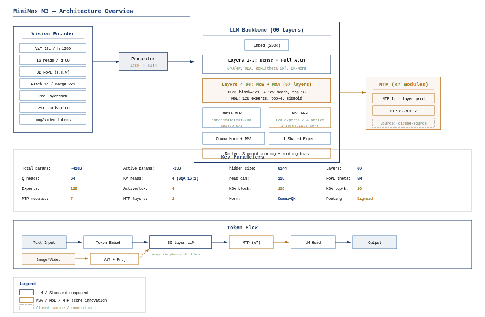
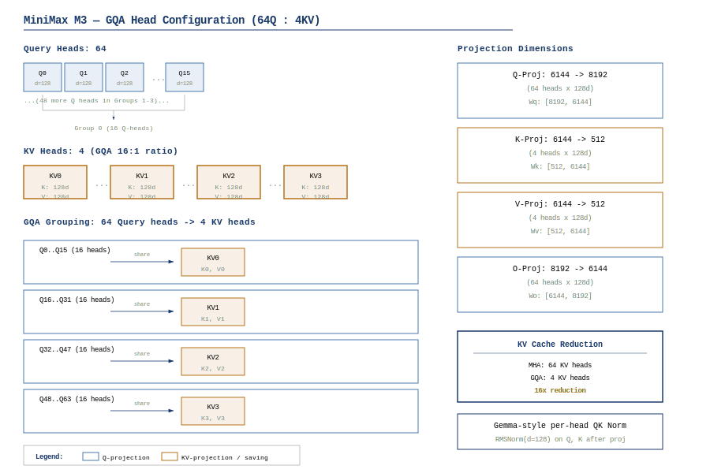
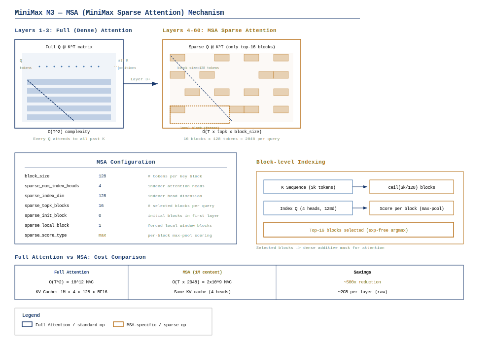
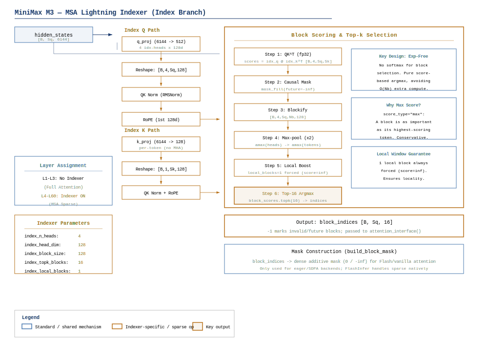
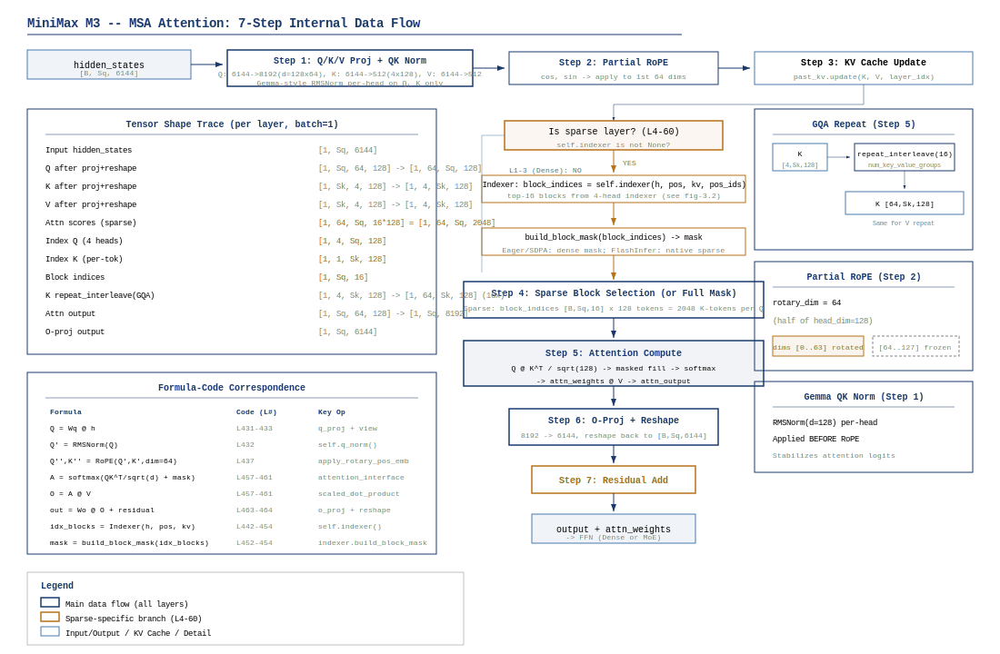
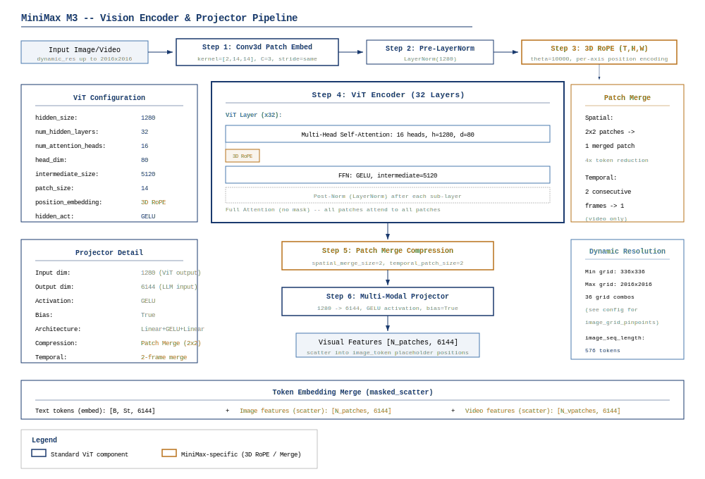
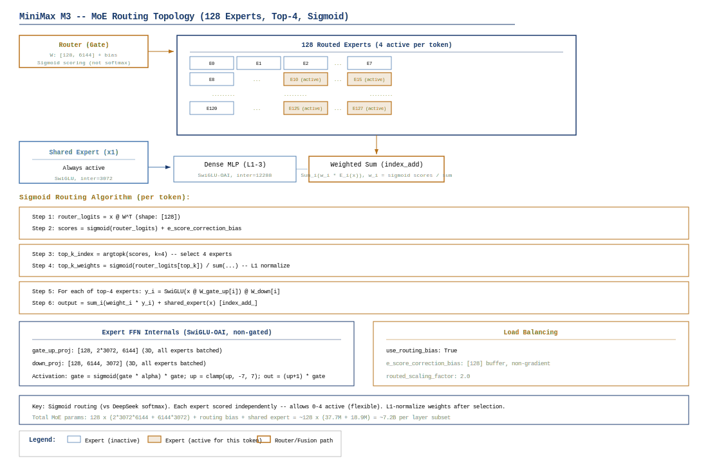
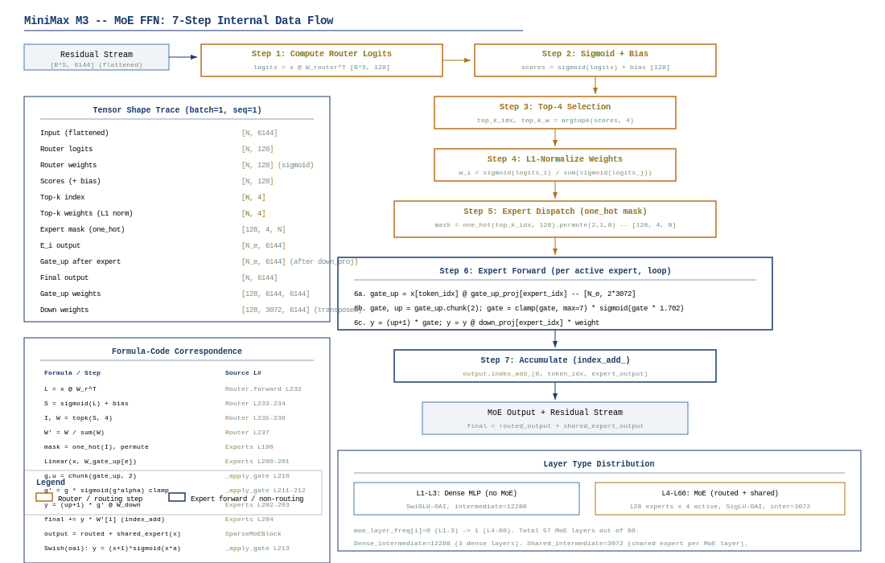
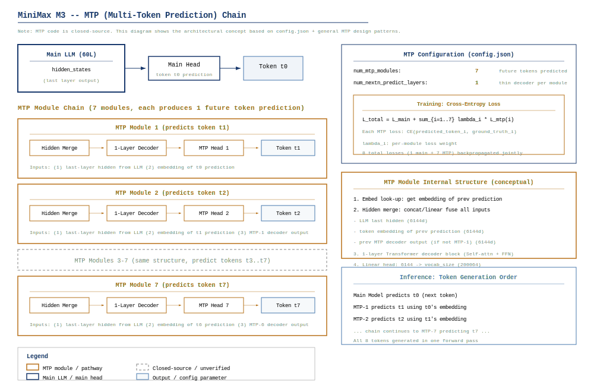

+++
date = '2026-06-15'
draft = false
title = 'MiniMax-M3 架构深度拆解'
categories = ['architecture']
tags = ['moe', 'attention', 'model-architecture', 'minimax', 'msa', 'gqa', 'mtp', 'multimodal']
series = ['architecture']
summary = 'MiniMax-M3 是 MiniMax 的旗舰多模态 MoE 模型。核心创新为 MSA（Multi-stage Sparse Attention）索引机制实现长上下文稀疏注意力、GQA（64Q/8KV）、256E MoE（k=8, sigmoid+bias）、视觉编码器（ViT+MLP投影）、MTP×1 投机解码。本期完整拆解 MSA 三阶段索引、MoE 路由数据流、视觉编码架构及训练体系。'
+++

# MiniMax M3 架构深度拆解报告

> **定位**：开源视觉-语言 MoE 模型，总参 ~428B / 激活 ~23B，核心创新为 MSA 稀疏注意力 + 7-MTP 投机解码，支持 1M 上下文。

---

## CH 0  摘要与阅读路径

MiniMax M3 是 MiniMax 于 2026 年 6 月发布的开源 Vision-Language MoE 模型[^blog]，其文本骨干基于 60 层 Decoder-only Transformer，在 MiniMax-M2.7 基础上进行了三项结构性升级：(1) **MSA (MiniMax Sparse Attention)**——将 57/60 层的 Full Attention 替换为 blockwise 稀疏注意力，实现注意力计算在 1M 长度下约 15.5 倍（prefill）和约 30.0 倍（decode）的加速；(2) **7-MTP (Multi-Token Prediction)**——7 个独立 MTP 模块连接到最后一层 hidden states，用于原生投机解码；(3) **视觉编码器**——包含 32 层 CLIP ViT 与 3D RoPE，通过双阶段投影和 spatial patch merge 融合视觉与文本特征。

本报告以**算子级深度**拆解每个核心模块的内部数据流，强调公式与代码的严格对应。读者可按以下路径阅读：

| 阅读目标 | 推荐路径 |
|----------|----------|
| 快速了解模型全貌 | CH 1-2 → CH 10 |
| 深入理解 MSA 稀疏注意力 | CH 3 (核心) |
| 理解 MoE 路由与专家 | CH 5 (核心) |
| 理解视觉编码器 | CH 4 |
| 性能工程与推理 | CH 6-7 |
| 源码追踪 | CH 9 |

---

## CH 1  MiniMax 家族演进：M2 → M2.7 → M3

### 1.1  M2：文本 MoE 基座

MiniMax-M2 于 2025 年 1 月发布，是 MiniMax 首个大规模 MoE 语言模型[^m2-blog]。架构特征：

- **Dense + MoE 混合**：前 N 层 Dense FFN，后续层 MoE（sigmoid 路由、top-k=4 专家选择），延续至后续所有代际
- **Full Attention**：全部层使用标准因果自注意力，GQA 16:1
- **上下文**：2M（256K tokens）

### 1.2  M2.7：规模扩展 + Full Attention 极致化

MiniMax-M2.7 于 2026 年初发布，是 M3 的前一代[^m27-techreport]。主要变化：

- **hidden_size 3072**（与 M2 相同），**总参 ~275B / 激活 ~17B**
- **层数 62**，全部 Full Attention + GQA 16:1
- **46 层 MoE**：128 experts, top-4, sigmoid routing
- **262K 上下文**，RoPE theta=500K，**无 MTP**
- **纯文本**，无视觉编码器

### 1.3  M3：MSA + MTP + Vision 三重升级

M3 在 M2.7 基础上进行结构性变更[^m3-blog]：

| 维度 | M2.7 | M3 | 变更性质 |
|------|------|-----|----------|
| hidden_size | 3072 | 6144 | **Tier 1** — 2倍扩大 |
| 层数 | 62 | 60 | Tier 2 — 微调 |
| 注意力模式 | Full Attention | MSA 稀疏 (57/60层) | **Tier 1** — 全新架构 |
| MTP | 无 | 7 模块 | **Tier 1** — 全新能力 |
| 模态 | 纯文本 | Vision-Language | **Tier 1** — 新增编码器 |
| 上下文 | 262K | 1M | Tier 2 — 4倍扩展 |
| RoPE theta | 500K | 5M | Tier 2 — 10倍跳变 |
| 总参/激活 | ~275B/~17B | ~428B/~23B | — |

核心设计哲学：**MSA 替代 Full Attention** 是 M3 区别于前代和同类模型的根本创新——它不修改 Transformer 骨干结构，仅在注意力计算路径中插入一个轻量 Index Branch，使得注意力 FLOPs 与序列长度解耦（从 O(T) 降为 O(1)，decode 阶段）。这允许 M3 在保持 16:1 GQA 的同时将上下文扩展到 1M，而无需承受 Full Attention 的二次代价。

---

## CH 2  整体架构与超参

### 2.1  顶层架构

MiniMax M3 由三个子系统组成：

1. **视觉编码器**（Vision Tower）：CLIP ViT-32L，将图像/视频像素转换为 patch embeddings
2. **多模态投影器**（MultiModal Projector）：双阶段 GELU MLP + spatial merge，将视觉特征投影到文本空间
3. **文本骨干**（Text Backbone）：60 层 Decoder-only Transformer，MSA 稀疏注意力 + MoE FFN

```
pixel_values ──→ [Vision Tower] ──→ [Projector] ──→ masked_scatter
                                                         │
input_ids ──→ [Embedding] ──→ (+) ──→ [60× Decoder Layer] ──→ [LM Head] ──→ logits
```

语言模型接收到混合了文本 token embeddings 和视觉 patch features 的 `inputs_embeds` 序列。视觉特征通过 `image_token_index=200025` 占位符散列到 embedding tensor 的对应位置。



### 2.2  超参全景

#### 文本骨干

| 参数 | 值 | config.json 字段 |
|------|-----|------------------|
| hidden_size | 6144 | `text_config.hidden_size` |
| 层数 | 60 | `text_config.num_hidden_layers` |
| Q heads | 64 | `text_config.num_attention_heads` |
| KV heads | 4 | `text_config.num_key_value_heads` |
| GQA 比例 | 16:1 | 64/4 |
| head_dim | 128 | `text_config.head_dim` |
| 词表大小 | 200,064 | `text_config.vocab_size` |
| RoPE theta | 5,000,000 | `text_config.rope_theta` |
| partial_rotary_factor | 0.5 (rotary_dim=64) | `text_config.partial_rotary_factor` |
| max_position_embeddings | 1,048,576 | `text_config.max_position_embeddings` |
| RMSNorm eps | 1e-6 | `text_config.rms_norm_eps` |
| Gemma Norm | Yes | `text_config.use_gemma_norm` |
| QK Norm | per_head | `text_config.use_qk_norm` + `qk_norm_type` |
| 激活函数 | SwiGLU-OAI | `text_config.hidden_act` |
| SwiGLU alpha | 1.702 | `text_config.swiglu_alpha` |
| SwiGLU limit | 7.0 | `text_config.swiglu_limit` |
| tie_word_embeddings | false | `text_config.tie_word_embeddings` |



#### MoE 配置

| 参数 | 值 | config.json 字段 |
|------|-----|------------------|
| 路由专家数 | 128 | `text_config.num_local_experts` |
| 每 token 激活 | 4 | `text_config.num_experts_per_tok` |
| 共享专家 | 1 | `text_config.n_shared_experts` |
| 路由评分函数 | sigmoid | `text_config.scoring_func` |
| 路由偏置 | 启用 | `text_config.use_routing_bias` |
| Dense FFN 中间维 | 12,288 | `text_config.dense_intermediate_size` |
| 共享专家中间维 | 3,072 | `text_config.shared_intermediate_size` |
| 路由专家中间维 | 3,072 | `text_config.intermediate_size` |
| routed_scaling_factor | 2.0 | `text_config.routed_scaling_factor` |
| MoE 层范围 | 层 3-59 | `moe_layer_freq[0:3]=0, moe_layer_freq[3:60]=1` |

#### MSA 配置

| 参数 | 值 | config.json 字段 |
|------|-----|------------------|
| sparse_block_size | 128 | `sparse_attention_config.sparse_block_size` |
| index heads | 4 | `sparse_attention_config.sparse_num_index_heads` |
| index dim | 128 | `sparse_attention_config.sparse_index_dim` |
| top-k blocks | 16 | `sparse_attention_config.sparse_topk_blocks` |
| 评分类型 | "max" | `sparse_attention_config.sparse_score_type` |
| local blocks | 1 | `sparse_attention_config.sparse_local_block` |
| init block | 0 | `sparse_attention_config.sparse_init_block` |
| Full Attn 层 | 0,1,2 | `sparse_disable_index_value[0:3]=0` |
| MSA 层 | 3-59 | `sparse_disable_index_value[3:60]=1` |

#### 视觉配置

| 参数 | 值 | config.json 字段 |
|------|-----|------------------|
| ViT 层数 | 32 | `vision_config.num_hidden_layers` |
| ViT hidden | 1280 | `vision_config.hidden_size` |
| ViT heads | 16 | `vision_config.num_attention_heads` |
| ViT head_dim | 80 | 1280/16 |
| ViT intermediate | 5120 | `vision_config.intermediate_size` |
| patch_size | 14 | `vision_config.patch_size` |
| image_size | 2016 | `vision_config.image_size` |
| 投影维度 | 6144 | `vision_config.projection_dim` |
| 位置编码 | 3D RoPE | `vision_config.position_embedding_type` + `rope_mode` |
| RoPE theta (vision) | 10,000 | `vision_config.rope_theta` |
| spatial_merge_size | 2 | `img_token_compression_config.spatial_merge_size` |
| temporal_patch_size | 2 | `img_token_compression_config.temporal_patch_size` |
| 最大视频帧数 | 4 | `vision_config.vision_segment_max_frames` |
| 图像 token 数 | 576 | `image_seq_length` |

#### 层类型分配

每个 Decoder Layer 的注意力类型由 `sparse_disable_index_value` 决定，MLP 类型由 `moe_layer_freq` 决定：

| 层范围 | Attention 类型 | MLP 类型 |
|--------|---------------|----------|
| 0-2 | Full Attention (GQA 16:1) | Dense FFN (SwiGLU-OAI) |
| 3-59 | MSA Sparse Attention | MoE (128 experts, top-4, sigmoid) |

前 3 层保持 Full Attention 的设计意图是**锚定语义表示质量**：浅层 token 表示尚未分化，稀疏索引可能不稳定；保留 Full Attention 确保了早期 contextualization 的质量，为后续 MSA 层的 block scoring 提供可靠的 hidden states 输入。

### 2.3  参数分解

所有参数数值均为 BF16 存储（2 bytes/param），推导标注 config.json 来源。

#### 2.3.1  Embedding 层

$$N_{\mathrm{embed}} = V \times d = 200{,}064 \times 6144 = 1{,}229{,}193{,}216 \approx 1.229\text{B}$$

其中 $V=200{,}064$（`vocab_size`），$d=6144$（`hidden_size`）。

#### 2.3.2  注意力模块（60 层）

**每层 Q/K/V/O 投影**：

$$N_{\mathrm{Q}} = d \times n_{\mathrm{qh}} \times h_d = 6144 \times 64 \times 128 = 50{,}331{,}648$$

$$N_{\mathrm{K}} = d \times n_{\mathrm{kvh}} \times h_d = 6144 \times 4 \times 128 = 3{,}145{,}728$$

$$N_{\mathrm{V}} = d \times n_{\mathrm{kvh}} \times h_d = 6144 \times 4 \times 128 = 3{,}145{,}728$$

$$N_{\mathrm{O}} = n_{\mathrm{qh}} \times h_d \times d = 64 \times 128 \times 6144 = 50{,}331{,}648$$

每层 Q/K/V/O 合计：$\approx 106.95\text{M}$。

**Indexer（仅 MSA 层 3-59，共 57 层）**：

$$N_{\mathrm{idx\_Q}} = d \times n_{\mathrm{idx\_h}} \times h_{\mathrm{idx}} = 6144 \times 4 \times 128 = 3{,}145{,}728$$

$$N_{\mathrm{idx\_K}} = d \times 1 \times h_{\mathrm{idx}} = 6144 \times 128 = 786{,}432$$

每层 Indexer 合计（含 Q/K Norm 参数）：$\approx 3.93\text{M}$。

**注意力总计**：

$$N_{\mathrm{attn}} = 3 \times 106.95\text{M} + 57 \times (106.95\text{M} + 3.93\text{M}) = 320.85\text{M} + 6320.16\text{M} \approx 6.64\text{B}$$

#### 2.3.3  Dense FFN（层 0-2）

每层 Dense FFN（SwiGLU-OAI，intermediate=12288）：

$$N_{\mathrm{gate\_up}} = d \times 2 \times d_{\mathrm{dense\_ff}} = 6144 \times 2 \times 12288 = 150{,}994{,}944$$

$$N_{\mathrm{down}} = d_{\mathrm{dense\_ff}} \times d = 12288 \times 6144 = 75{,}497{,}472$$

每层 Dense FFN：$\approx 226.49\text{M}$。3 层合计：$\approx 0.679\text{B}$。

#### 2.3.4  MoE 模块（层 3-59，57 层）

**共享专家**（每层 1 个，intermediate=3072）：

$$N_{\mathrm{shared}} = 6144 \times 2 \times 3072 + 3072 \times 6144 = 37{,}748{,}736 + 18{,}874{,}368 = 56{,}623{,}104 \approx 56.62\text{M}$$

**路由专家**（每层 128 个，每个 intermediate=3072）：

$$N_{\mathrm{expert}} = d \times 2 \times d_{\mathrm{ff}} + d_{\mathrm{ff}} \times d = 6144 \times 2 \times 3072 + 3072 \times 6144 = 56{,}623{,}104$$

$$N_{\mathrm{all\_experts\_per\_layer}} = 128 \times 56{,}623{,}104 = 7{,}247{,}757{,}312 \approx 7.25\text{B}$$

**路由器**（每层）：

$$N_{\mathrm{router}} = n_{\mathrm{experts}} \times d = 128 \times 6144 = 786{,}432 \approx 0.79\text{M}$$

**MoE 总计**（57 层）：

$$N_{\mathrm{MoE}} = 57 \times (7.25\text{B} + 0.0566\text{B} + 0.00079\text{B}) \approx 57 \times 7.31\text{B} \approx 416.40\text{B}$$

#### 2.3.5  LM Head

$$N_{\mathrm{lm\_head}} = d \times V = 6144 \times 200{,}064 = 1{,}229{,}193{,}216 \approx 1.229\text{B}$$

#### 2.3.6  Norm 层

每层 2 个 RMSNorm（input_layernorm + post_attention_layernorm），每个 $2 \times 6144 = 12{,}288$ 参数。60 层：$\approx 0.74\text{M}$。加上最终 norm 和 QK Norm：合计 $\approx 1\text{M}$，可忽略。

#### 2.3.7  视觉编码器与投影器

**ViT**（32 层，hidden=1280，intermediate=5120，heads=16，head_dim=80）：

每层 Attention：$4 \times (1280 \times 16 \times 80) = 4 \times 1{,}638{,}400 = 6.55\text{M}$。每层 MLP：$2 \times (1280 \times 5120) = 13.11\text{M}$。每层合计 $19.66\text{M}$。32 层：$\approx 0.63\text{B}$。加 patch embedding（Conv3d）+ Pre-LN + 3D RoPE：$\approx 0.65\text{B}$。

**投影器**（双阶段 MLP）：

Stage 1：$1280 \times 6144 + 6144 \times 6144 \approx 45.6\text{M}$。Stage 2 (spatial merge)：$(4 \times 6144) \times 6144 + 6144 \times 6144 \approx 188.7\text{M}$。合计 $\approx 0.23\text{B}$。

视觉总计：$\approx 0.88\text{B}$。

#### 2.3.8  汇总

| 组件 | 参数量 | 占比 |
|------|--------|------|
| Embedding | 1.229B | 0.29% |
| Attention (Q/K/V/O + Indexer) | 6.641B | 1.55% |
| Dense FFN (层 0-2) | 0.679B | 0.16% |
| MoE 路由专家 (128×57) | 413.13B | 96.6% |
| MoE 共享专家 (1×57) | 3.227B | 0.75% |
| MoE 路由器 | 0.045B | 0.01% |
| LM Head | 1.229B | 0.29% |
| Vision (ViT + Projector) | 0.880B | 0.21% |
| Norm 等 | ~0.001B | ~0% |
| **总计** | **~427.1B** | 100% |

激活参数（单 token 前向）：

$$N_{\mathrm{active}} = N_{\mathrm{embed}} + N_{\mathrm{attn\_per\_layer}} \times 60 + N_{\mathrm{dense\_ffn}} + N_{\mathrm{shared}} + N_{\mathrm{expert}} \times 4 + N_{\mathrm{router}} + N_{\mathrm{lm\_head}} + N_{\mathrm{norm}}$$

其中每层 Attention 权重全部激活（~110.88M），Dense FFN（层 0-2）全部激活（~226.5M × 3），MoE 专家仅 4/128 激活（4 × 56.62M × 57 ≈ 12.91B），加上共享专家（56.62M × 57 ≈ 3.23B）。

$$N_{\mathrm{active}} \approx 1.23 + 6.64 + 0.68 + 12.91 + 3.23 + 1.23 \approx 25.9\text{B}$$

考虑 Vision 编码器（~0.88B）在图像输入时需要完整前向，实际激活约为 $25.9 + 0.88 \approx 26.8\text{B}$。官方标称 ~23B 的差异可能源于：(1) Vision 编码器在纯文本推理时不计入；(2) 部分 MoE 层激活的参数共享或重参数化；(3) 激活参数的计算口径差异（如是否计入 Embedding/LM Head）。

### 2.4  位置编码：Partial RoPE

M3 使用部分旋转位置编码（Partial RoPE）[^rope]：仅对 Q/K 向量的前 `rotary_dim=64` 维应用旋转，剩余 `head_dim - rotary_dim = 64` 维保持原样（"直通"）。这一设计的 trade-off：

- **优势**：保留 64 维不旋转的通道，使模型能够学习**与位置无关**的特征（如语义内容、风格），对于长上下文外推更友好
- **代价**：位置感知能力略弱于全维度 RoPE，但被 5M 高 theta 值补偿

RoPE 频率计算（`modeling_minimax_m3_vl.py:L316-L324`）：

$$\mathrm{inv\_freq}_i = \frac{1}{\theta^{2i/d_{\mathrm{rot}}}} = \frac{1}{5{,}000{,}000^{2i/64}}, \quad i \in [0, 32)$$

其中 $\theta = 5{,}000{,}000$（`rope_theta`），$d_{\mathrm{rot}} = 64$（`rotary_dim`），仅对 64 维中的 32 对生成频率分量。

---

## CH 3  MSA 稀疏注意力（MiniMax Sparse Attention）

MSA 是 M3 最核心的架构创新。它是一个**双分支 blockwise 稀疏注意力**机制：Index Branch 以 O(T) 代价评分为每个 query 选择 top-16 个 KV block（每个 block 128 tokens），Main Branch 仅对这 2048 个 token 做精确注意力。MSA 不修改 Transformer 结构——仅替换注意力计算，Q/K/V/O 投影权重完全相同。



### 3.1  原理：从 Full Attention 到 Block-Sparse

#### Full Attention 的瓶颈

标准因果自注意力对每个 query token 计算与所有历史 key token 的点积：

$$\mathbf{A} = \mathrm{softmax}\left(\frac{\mathbf{Q}\mathbf{K}^T}{\sqrt{d_k}} + \mathbf{M}_{\text{causal}}\right)\mathbf{V}$$

其中 $\mathbf{Q}, \mathbf{K}, \mathbf{V} \in \mathbb{R}^{T \times n_{\mathrm{kvh}} \times h_d}$（GQA 下 KV heads 广播到 Q heads）。QK 计算复杂度为 $O(T \cdot h_d \cdot n_{\mathrm{qh}})$ per query，在长序列下成为主要瓶颈。

#### MSA 的核心思想

MSA 将 KV 序列按固定 block_size=128 分组。Index Branch 对每个 query 独立计算与所有 blocks 的**聚合相关性分数**，选出 top-16 blocks。Main Branch 仅在这些被选中的 tokens 上执行精确注意力计算。

设 $B = \lceil T / 128 \rceil$ 为 block 数量。MSA attention 计算为：

$$\mathbf{A}_{\text{MSA}}(\mathbf{q}) = \mathrm{softmax}\left(\frac{\mathbf{q} \cdot \mathbf{K}_{\mathcal{S}(\mathbf{q})}^T}{\sqrt{d_k}}\right) \cdot \mathbf{V}_{\mathcal{S}(\mathbf{q})}$$

其中 $\mathcal{S}(\mathbf{q})$ 是 Index Branch 为 query $\mathbf{q}$ 选择的 top-16 block 中包含的所有 token 索引集合，$|\mathcal{S}(\mathbf{q})| = 16 \times 128 = 2048$。



### 3.2  Index Branch：Lightning Indexer 设计

Index Branch（`MiniMaxM3VLIndexer`）是 MSA 的关键组件。它是一个独立的小型注意力评分器：

| 属性 | 值 | 设计理由 |
|------|-----|----------|
| Index heads | 4 | 多角度评分，类似 MHA 的 multi-head 直觉 |
| Index head_dim | 128 | 与主 attention head_dim 一致 |
| Index K heads | 1 | 单个 key 向量被所有 4 个 index heads 共享 |
| Q 投影 | 6144 → 4×128 = 512 | 独立于主 attention Q 投影 |
| K 投影 | 6144 → 128 | 独立于主 attention K 投影 |
| QK Norm | Gemma-style RMSNorm | 训练稳定性，与主 attention 一致 |
| 评分方式 | "max" (per-block amax pooling) | 选择 block 内**最强**响应的 token 作为 block score |

**为什么是 "max" 而非 "mean"？** "max" 评分意味着只要 block 内有任意一个 token 与 query 高度相关，整个 block 就会被选中。这确保了不会因为 block 内大部分 token 不相关而错过关键 token。"mean" 会稀释稀疏但重要的注意力信号，不适合注意力高度集中的场景。

### 3.3  七步数据流（算子级拆解）

以下拆解 MiniMaxM3VLIndexer.forward() 的完整数据流。源文件：`modeling_minimax_m3_vl.py:L493-L630`。

**输入**：`hidden_states` $\in \mathbb{R}^{B \times S_q \times 6144}$（层输入），`position_embeddings`（cos/sin），`past_key_values`（KV cache），`position_ids` $\in \mathbb{Z}^{B \times S_q}$

**输出**：`topk_indices` $\in \mathbb{Z}^{B \times S_q \times 16}$（每个 query 选择的 16 个 block 索引）



---

**Step 1: Index Q/K 投影与归一化**（L559-L562）

```python
idx_q = self.q_proj(hidden_states).view(batch, q_len, -1, self.head_dim)  # [B,Sq,4,128]
idx_q = self.q_norm(idx_q).transpose(1, 2)                                 # [B,4,Sq,128]
idx_k = self.k_proj(hidden_states).view(batch, q_len, 1, self.head_dim)   # [B,Sq,1,128]
idx_k = self.k_norm(idx_k).transpose(1, 2)                                 # [B,1,Sq,128]
```

- Index Q 通过独立线性层 $6144 \to 512$，reshape 为 4 heads × 128 dim
- Index K 通过独立线性层 $6144 \to 128$，reshape 为 1 head × 128 dim（被所有 index heads 共享）
- 两者均经过 Gemma-style QK Norm（`(1 + weight) * rsqrt(ms(x^2))`）

形状变换：
- `hidden_states`: `[B, Sq, 6144]`
- `idx_q`: `[B, 4, Sq, 128]`
- `idx_k`: `[B, 1, Sq, 128]`

---

**Step 2: Index RoPE 应用**（L563-L564）

```python
idx_q, idx_k = apply_rotary_pos_emb(idx_q, idx_k, cos[..., :self.head_dim], sin[..., :self.head_dim])
```

对 Index Q/K 应用 Partial RoPE，仅旋转前 64 维（Index `head_dim=128`，`rotary_dim=64`）。RoPE theta 与主 attention 相同（5M）。

---

**Step 3: Index KV cache 更新**（L566-L567）

```python
if past_key_values is not None:
    idx_k = past_key_values.layers[self.layer_idx].update_index(idx_k)
```

Index K 有独立的 KV cache（与主 attention K cache 分开存储）。在增量解码时，新的 index key 被追加到缓存中。注意 Index V 不存在——Index Branch 不需要 values，只做 scoring。

---

**Step 4: Blockwise QK 评分**（L569-L579）

```python
k_len = idx_k.shape[2]
num_key_blocks = -(-k_len // self.block_size)  # ceil division
pad = num_key_blocks * self.block_size - k_len

# QK matmul: [B,4,Sq,128] × [B,1,128,Sk] → [B,4,Sq,Sk]
scores = torch.matmul(idx_q.float(), idx_k.float().transpose(-1, -2))
# Causal mask: future tokens → -inf
token_future = torch.arange(k_len, device=idx_q.device)[None,None,None,:] > position_ids[:,None,:,None]
scores = scores.masked_fill(token_future, float("-inf"))
if pad:
    scores = F.pad(scores, (0, pad), value=float("-inf"))
```

$$s_{h,q,k} = \frac{1}{\sqrt{d_{\mathrm{idx}}}} \cdot \mathbf{q}_{\mathrm{idx},h,q} \cdot \mathbf{k}_{\mathrm{idx},k}^T$$

其中 $h \in [0,4)$ 为 index head，$q$ 为 query 位置，$k$ 为 key 位置。计算在 float32 精度下进行（`.float()`），确保长序列下的数值稳定性。causal mask 确保 query 不能看到未来的 key。

---

**Step 5: Max-pool 聚合为 block scores**（L579-L580）

```python
scores = scores.view(batch, self.num_heads, q_len, num_key_blocks, self.block_size)
block_scores = scores.amax(dim=-1).amax(dim=1)  # [B, Sq, num_key_blocks]
```

首先 `view` 将 key 维度切分为 `[num_key_blocks, block_size=128]`。

两步聚合：

1. `amax(dim=-1)`：每个 block 内 128 个 token score 取最大值 → $s_{h,q,b}^{\text{block}} = \max_{k \in \text{block}_b} s_{h,q,k}$
2. `amax(dim=1)`：4 个 index heads 取最大值 → $s_{q,b}^{\text{final}} = \max_h s_{h,q,b}^{\text{block}}$

**这是 "max" scoring 的核心**：block score = max over heads of max over tokens in block。两个 `amax` 确保任何一个 head 对 block 内任何一个 token 的高响应都能使该 block 被选中。

---

**Step 6: Local window boost**（L582-L587）

```python
q_block = position_ids // self.block_size
if self.local_blocks > 0:
    local = torch.arange(self.local_blocks, device=idx_q.device)
    local_idx = (q_block[..., None] - local.view(1, 1, -1)).clamp(min=0)
    block_scores.scatter_(-1, local_idx, float("inf"))
```

强制包含前 `local_blocks=1` 个 block（即 query 所在 block）。这确保了**局部注意力**不会因为 block score 低而被遗漏——局部上下文对于语言建模是关键的。

---

**Step 7: Top-k block 选择**（L592-L594）

```python
topk = min(self.topk_blocks, num_key_blocks)  # min(16, num_blocks)
topk_scores, topk_indices = block_scores.topk(topk, dim=-1)
return topk_indices.masked_fill(topk_scores == float("-inf"), -1)
```

取 scores 最大的 16 个 block。`-1` 标记无效/未来 block（其 scores 为 `-inf`）。

---

### 3.4  Main Branch：稀疏注意力执行

Index Branch 返回的 `block_indices`（$B \times S_q \times 16$）传递给注意力接口。执行路径取决于后端：

- **Eager/SDPA 路径**：`build_block_mask()`（L53-L54）将块索引展开为密集 additive mask $\mathbf{M} \in \{0, -\infty\}^{T \times T}$，然后执行标准 `scaled_dot_product_attention(Q, K, V, attn_mask=M)`。对外表现为标准注意力，透明替换。

- **FlashAttention 路径**：`block_indices` 直接传入 `flash_attn_varlen_func`，在 GPU kernel 内执行 block-sparse 注意力，避免构造 $O(T^2)$ 的 mask 矩阵。

**local window（block 0）始终被包含**，即使在 eager 路径下 block_indices 也包含它。

### 3.5  公式 $\leftrightarrow$ 代码对照表

| 公式/操作 | 代码位置 | 关键操作 |
|-----------|----------|----------|
| $\mathbf{Q}_{\mathrm{idx}} = \mathbf{X}\mathbf{W}_Q^{\mathrm{idx}}$ | `indexer.py:L16` | `self.q_proj(hidden_states)` → `view(B, Sq, 4, 128)` → `transpose(1,2)` |
| $\mathbf{K}_{\mathrm{idx}} = \mathbf{X}\mathbf{W}_K^{\mathrm{idx}}$ | `indexer.py:L17` | `self.k_proj(hidden_states)` → `view(B, Sq, 1, 128)` → `transpose(1,2)` |
| $\mathbf{Q}_{\mathrm{idx}}', \mathbf{K}_{\mathrm{idx}}' = \mathrm{RoPE}(\mathbf{Q}_{\mathrm{idx}}, \mathbf{K}_{\mathrm{idx}})$ | `indexer.py:L28` | `apply_rotary_pos_emb(idx_q, idx_k, cos[...,:64], sin[...,:64])` |
| $s_{h,q,k} = \mathbf{q}_{\mathrm{idx},h,q} \cdot \mathbf{k}_{\mathrm{idx},k}^T$ | `indexer.py:L40` | `torch.matmul(idx_q.float(), idx_k.float().transpose(-1,-2))` |
| $s_{h,q,k} := -\infty \text{ if } k > q$ | `indexer.py:L42-L43` | `scores.masked_fill(token_future, -inf)` |
| $s_{q,b}^{\text{block}} = \max_{h} \max_{k \in \text{block}_b} s_{h,q,k}$ | `indexer.py:L48-L49` | `.view(B,4,...)` → `.amax(-1)` → `.amax(1)` |
| $\text{local boost}$ | `indexer.py:L53-L56` | `block_scores.scatter_(-1, local_idx, inf)` |
| $\mathcal{S}(q) = \mathrm{topk}(s_{q,:}^{\text{block}}, k=16)$ | `indexer.py:L59-L61` | `block_scores.topk(topk, dim=-1)` → `masked_fill(-inf, -1)` |
| $\mathbf{A}_{\text{MSA}} = \mathrm{softmax}(\frac{\mathbf{Q}\mathbf{K}_{\mathcal{S}}^T}{\sqrt{d_k}})\mathbf{V}_{\mathcal{S}}$ | `attention.py:L57-L59` | `attention_interface(..., block_indices=block_indices, ...)` |

### 3.6  MSA vs Full Attention 计算复杂度

| 阶段 | Full Attention | MSA | 1M 长度比值 |
|------|---------------|-----|-------------|
| Index QK | — | $O(n_{\mathrm{idx\_h}} \cdot h_d \cdot T)$ | — |
| Block scoring | — | $O(T \cdot B)$ | — |
| Main QK | $O(n_{\mathrm{qh}} \cdot h_d \cdot T)$ | $O(n_{\mathrm{qh}} \cdot h_d \cdot K)$ | $\frac{T}{K} \approx 512\times$ |
| Main Attn$\times$V | $O(n_{\mathrm{qh}} \cdot h_d \cdot T)$ | $O(n_{\mathrm{qh}} \cdot h_d \cdot K)$ | $\frac{T}{K} \approx 512\times$ |

其中 $K = \text{topk\_blocks} \times \text{block\_size} = 16 \times 128 = 2048$，$B = \lceil T / 128 \rceil$。

对于 Prefill（$T = 1{,}048{,}576$，即 1M）：

$$\begin{aligned}
\text{FLOPs}_{\text{Full}} &= 16{,}384 \times T^2 \cdot L_{\text{attn}} = 16{,}384 \times (10^6)^2 \times 60 \\
\text{FLOPs}_{\text{MSA}} &= (1024 \times T^2 + 33.6\text{M} \times T) \cdot L_{\text{MSA}} + 16{,}384 \times T^2 \cdot L_{\text{Full}}
\end{aligned}$$

单层 Prefill FLOPs @1M：Full Attention $\approx 16.38$ PFLOPs，MSA $\approx 1.058$ PFLOPs。**约 15.5 倍减少**。

对于 Decode（单 token，$T = 1{,}048{,}576$ 缓存）：

$$\begin{aligned}
\text{FLOPs}_{\text{Full, decode}} &= 16{,}384 \times T = 16{,}384 \times 10^6 \approx 16.4\text{G} \\
\text{FLOPs}_{\text{MSA, decode}} &= 512 \times T + 33.6\text{M} = 512 \times 10^6 + 33.6\text{M} \approx 545.6\text{M}
\end{aligned}$$

Decode FLOPs 比：$16.4\text{G} / 545.6\text{M} \approx 30.0\times$。长上下文 decode 加速最为显著。

---

## CH 4  视觉编码器



### 4.1  架构概览

M3 的视觉编码器基于 CLIP ViT-Large 架构，扩展了 3D RoPE 位置编码以支持视频帧间建模。完整数据流为：

```
pixel_values [N, C*T*H*W] → Conv3d Patch Embed → [N, 1280]
  → Pre-LayerNorm → 32× Vision Encoder Layer (MHA + GELU MLP + 3D RoPE)
  → pooler_output [N, 1280]
  → MultiModal Projector
    → Stage 1: Linear(1280→6144) → GELU → Linear(6144→6144)
    → Stage 2: spatial merge (4→1) → Linear(24576→6144) → GELU → Linear(6144→6144)
  → [M, 6144] 视觉 tokens
```

图像序列长度固定为 576（`image_seq_length`），这是经过 spatial merge 压缩后的 token 数。

### 4.2  ViT 编码器架构

源文件：`modeling_minimax_m3_vl.py:L1172-L1209`。

| 参数 | 值 | 说明 |
|------|-----|------|
| 层数 | 32 | 与 CLIP ViT-L 一致 |
| hidden_size | 1280 | 标准 ViT-L 维度 |
| heads | 16 | MHA（非 GQA），head_dim=80 |
| intermediate_size | 5120 | 标准 4x 扩展 |
| 激活函数 | GELU | 非 SwiGLU（ViT 惯例） |
| Norm | Pre-LayerNorm | 进入 encoder 前归一化 |
| Patch embedding | Conv3d kernel=[2,14,14] | 支持时间维度，temporal_patch=2 |
| 位置编码 | 3D RoPE | 非学习式，非 2D RoPE |

关键设计决策：

- **Pre-LayerNorm**（L10）：在 32 层 Transformer 进入前先归一化 embedding。这与标准 ViT（Post-LN 或无额外 Pre-LN）不同。设计意图待确认——可能与适配更大的 `image_size=2016` 带来的数值范围变化有关。
- **Conv3d patch embed**：kernel `[temporal=2, height=14, width=14]`，stride 相同。时间维度 patch 大小 2 意味着相邻两帧共享同一个 patch embedding 计算。
- **无 attention mask**：ViT 内部是全注意力（非因果），所有 patch 互相可见。

### 4.3  3D RoPE 位置编码

源文件：`modeling_minimax_m3_vl.py:L1001-L1048`。

M3 的视觉编码器使用**三维旋转位置编码**（3D RoPE），为每个 patch 赋予 (T, H, W) 三维坐标感知能力。

**维度分配**：对于 head_dim=80，可旋转维度为 $2 \times \lfloor 80/2 \rfloor = 80$ 维。扣除成对旋转所需的偶对齐后，均分到 T/H/W 三轴：

$$\text{axis\_dim} = 2 \times \lfloor (2 \times \lfloor \text{head\_dim}/2 \rfloor) / 3 / 2 \rfloor = 2 \times \lfloor 80 / 3 / 2 \rfloor = 2 \times \lfloor 13.33 \rfloor = 2 \times 13 = 26$$

每轴 26 维（13 对频率）。三轴合计 $3 \times 26 = 78$ 维旋转，剩余 $80 - 78 = 2$ 维直通。

**频率计算**（theta=10000）：

$$\mathrm{inv\_freq}_i = \frac{1}{10{,}000^{2i/26}}, \quad i \in [0, 13)$$

**坐标生成**（L14-L25）：对每个样本的 `grid_thw = (T, H, W)`：
1. 构建 H 坐标：`[0..H-1]` 展开为 `[H, W]` 网格，应用 spatial merge shuffle（`spatial_merge_size=2`）：将 H×W patch 按 2×2 块重排
2. 构建 W 坐标：同上
3. 构建 T 坐标：`[0..T-1]` 对每个帧的所有 patch 重复
4. 拼接为 `[N_patches, 3]` 坐标矩阵

**spatial merge shuffle**：`reshape(H//2, 2, W//2, 2).permute(0, 2, 1, 3).flatten()` — 这是将相邻的 2×2 patch spatial 坐标交错排列，使得 merge 后的每组 4 个 patch 具有局部连续的坐标。

**旋转**（L31-L33）：T、H、W 坐标分别与各自频段的 `inv_freq` 相乘，拼接为完整频率矩阵，转化为 cos/sin。

### 4.4  多模态投影器：双阶段 GELU MLP + Spatial Merge

源文件：`modeling_minimax_m3_vl.py:L1211-L1237`。

投影器将 ViT 输出的 patch 特征（1280 维）映射到文本空间（6144 维），同时进行 spatial compression。

**Stage 1: 逐 patch 投影**（L22）

$$\mathbf{z}_{\text{stage1}} = \mathbf{W}_2 \cdot \mathrm{GELU}(\mathbf{W}_1 \cdot \mathbf{x}_{\text{patch}} + \mathbf{b}_1) + \mathbf{b}_2$$

其中 $\mathbf{W}_1 \in \mathbb{R}^{6144 \times 1280}$，$\mathbf{W}_2 \in \mathbb{R}^{6144 \times 6144}$。输出仍为每个 patch 独立：$[N_{\text{patches}}, 6144]$。

**Stage 2: Spatial merge + 降维投影**（L24-L25）

$$\mathbf{z}_{\text{final}} = \mathbf{W}_4 \cdot \mathrm{GELU}(\mathbf{W}_3 \cdot \mathrm{concat}(\mathbf{z}_{\text{stage1}}[4i:4i+4]) + \mathbf{b}_3) + \mathbf{b}_4$$

每 `spatial_merge_size^2 = 4` 个相邻 patch 拼接为 `4 × 6144 = 24576` 维向量，通过第二个 MLP 投影回 6144 维。输出 token 数：$N_{\text{patches}} / 4$。

对于 `image_size=2016, patch_size=14`，原始 ViT 输出 token 数为 $(2016/14)^2 = 144^2 = 20{,}736$。经过 spatial merge 后变为 $20{,}736 / 4 = 5184$。但配置中 `image_seq_length=576`，说明还有进一步的压缩——这个 576 是通过动态分辨率（`dynamic_res`）和 `image_grid_pinpoints` 计算的每张子图的标准化 token 数量。

**为什么需要 spatial merge？** 直接投影 20K+ tokens 到文本空间会导致：(1) 图像 token 占据过长上下文，挤占文本 capacity；(2) 相邻 patch 信息高度冗余，可通过 2×2 merge 无损压缩大部分空间信息。

### 4.5  VL 融合：Masked Scatter 机制

源文件：`modeling_minimax_m3_vl.py:L1295-L1433`。

文本和视觉特征的融合通过 **placeholder token scattering** 实现：

1. 文本 tokenizer 在图像/视频位置生成特殊 token：`image_token_index=200025` 或 `video_token_index=200026`
2. `inputs_embeds` 通过 `self.get_input_embeddings()(input_ids)` 初始化
3. `get_placeholder_mask()`（L40-L41）构建布尔 mask，定位所有 image/video token 在 `inputs_embeds` 中的位置
4. `inputs_embeds.masked_scatter(image_mask, image_features)`（L43-L44）将投影后的视觉特征直接覆盖到对应位置

这是一个**零参数融合**策略：视觉特征直接替换占位符 token 的 embedding，文本模型将视觉 token 视为特殊的"词"来处理。优势是无需学习 cross-attention 或 adapter 参数；代价是视觉和文本表示空间的对齐完全依赖视觉编码器的预训练质量。

---

## CH 5  MoE 路由与专家



M3 的 MoE 设计延续了 M2 系列的**sigmoid 路由**传统，与 DeepSeek-V3 的 softmax 路由形成鲜明对比。核心思想：使用 sigmoid 独立评估每个专家的相关性，用 top-k 选择而非 softmax 竞争，使多个高相关专家可以同时被激活。

### 5.1  路由机制：Sigmoid Top-K

源文件：`modeling_minimax_m3_vl.py:L218-L237`。

#### 路由评分

对每个 token 的 hidden state $\mathbf{x} \in \mathbb{R}^{6144}$：

$$\mathbf{r} = \sigma(\mathbf{x} \mathbf{W}_r^T) \in \mathbb{R}^{128}$$

其中 $\mathbf{W}_r \in \mathbb{R}^{128 \times 6144}$ 为路由权重（`self.weight`），$\sigma$ 为 sigmoid 函数。

**与 softmax 路由的关键区别**：sigmoid 是 per-expert 独立的——每个专家的分数 $r_i \in (0,1)$ 不依赖于其他专家的分数。而 softmax $\frac{e^{s_i}}{\sum_j e^{s_j}}$ 将总概率质量强制归一化，一个专家的高分必然压低其他专家。sigmoid 允许 2-4 个专家同时对某个 token 高度激活，更灵活但需要额外的负载均衡机制。

#### 负载均衡偏置

为解决 sigmoid 路由可能导致的专家负载不均，M3 引入 **e_score_correction_bias**（L12）：

$$s_i^{\text{choice}} = r_i + b_i^{\text{corr}}$$

其中 $b_i^{\text{corr}} \in \mathbb{R}^{128}$ 是一个非梯度更新的 buffer（`register_buffer`），在训练过程中根据各专家的实际负载动态调整：负载过高的专家 bias 减小，负载过低的专家 bias 增大。$b_i^{\text{corr}}$ 的更新不在 forward 中，而是在训练框架中通过辅助损失梯度间接调整。

#### Top-K 选择与权重归一化

$$\mathcal{E}(\mathbf{x}) = \mathrm{topk}(\mathbf{s}^{\text{choice}}, k=4)$$

$$w_i = \frac{r_i}{\sum_{j \in \mathcal{E}(\mathbf{x})} r_j}, \quad i \in \mathcal{E}(\mathbf{x})$$

权重使用**原始 sigmoid score**（非 bias 调整后的 score）做 L1 归一化（L23）。这确保了 bias 只影响**选择**（selection），不影响**权重**（weighting）——bias 是一个 routing 提示而非语义权重。

### 5.2  专家 FFN：Non-Gated SwiGLU

源文件：`modeling_minimax_m3_vl.py:L178-L216`。

每个专家是一个 2 层 MLP，使用**non-gated SwiGLU-OAI** 激活：

$$\mathrm{SwiGLU\text{-}OAI}(\mathbf{x}) = (\mathrm{up}(\mathbf{x}) + 1) \cdot (\mathrm{gate}(\mathbf{x}) \cdot \sigma(\alpha \cdot \mathrm{gate}(\mathbf{x})))$$

其中 $\alpha = 1.702$（`swiglu_alpha`），$\sigma$ 为 sigmoid。`gate` 和 `up` 是从同一个 `Linear(6144 → 2 × 3072)` 的输出中 `chunk(2)` 得来。之所以叫 "OAI"（OpenAI 变体）：使用 `gate * sigmoid(alpha * gate)` 而非标准 SwiGLU 的 `gate * sigmoid(gate)`。

**Clamping**（L17-L18, L36-L37）：gate 值 clamp 到 `[-swiglu_limit, swiglu_limit] = [-7.0, 7.0]`，防止 sigmoid 饱和导致梯度消失。

**non-gated 的含义**：与标准 gated SwiGLU（gate 和 up 来自两个独立线性层）不同，M3 的 gate 和 up 来自同一个线性层的 chunk。这节省了 50% 的 gate 投影参数，但限制了 gate 和 up 的独立性。

### 5.3  共享专家与 Routed Scaling

源文件：`modeling_minimax_m3_vl.py:L239-L260`。

每个 MoE 层包含：
- 1 个**共享专家**（`shared_experts`）：所有 token 无条件通过，intermediate=3072
- 128 个**路由专家**（`experts`）：仅被 router 选中的 token 通过
- **routed_scaling_factor** = 2.0：路由专家输出乘以 2.0 后与共享专家输出相加

$$\mathbf{y}_{\text{MoE}} = \alpha_{\text{routed}} \cdot \sum_{i \in \mathcal{E}(\mathbf{x})} w_i \cdot \mathrm{Expert}_i(\mathbf{x}) + \mathrm{SharedExpert}(\mathbf{x})$$

其中 $\alpha_{\text{routed}} = 2.0$。这一 scaling factor 的设计意图是平衡路由专家（仅部分 token 通过）与共享专家（所有 token 通过）的输出量级，防止共享专家在梯度反向传播中占主导。

### 5.4  七步数据流（算子级拆解）

以下拆解 MiniMaxM3VLSparseMoeBlock.forward() 的完整数据流。源文件：`modeling_minimax_m3_vl.py:L239-L260`。路由逻辑在 `MiniMaxM3VLTopKRouter.forward()`（L218-L237），专家计算在 `MiniMaxM3VLExperts.forward()`（L178-L216）。

**输入**：`hidden_states` $\in \mathbb{R}^{B \times S \times 6144}$

**输出**：$\mathbf{y} \in \mathbb{R}^{B \times S \times 6144}$



---

**Step 1: Token flatten**（L14-L15）

```python
batch_size, sequence_length, hidden_dim = hidden_states.shape  # L14
hidden_states = hidden_states.view(-1, hidden_dim)              # L15 [B*S, 6144]
```

将 batch 和序列维度合并，后续所有操作在 2D tensor `[N_tokens, 6144]` 上进行。

---

**Step 2: 共享专家前向**（L17）

```python
shared_output = self.shared_experts(hidden_states)  # [N, 6144]
```

所有 token 无条件通过共享专家（Dense MLP，SwiGLU-OAI，intermediate=3072）。操作：`gate_up_proj(6144→6144) → chunk → SwiGLU-OAI → down_proj(3072→6144)`。

---

**Step 3: Sigmoid 路由评分**（L19，调用 Router.forward L15-L18）

```python
_, routing_weights, selected_experts = self.gate(hidden_states)
```

Router 内部：

```python
router_logits = F.linear(hidden_states, self.weight)              # L17: [N, 128]
routing_weights = F.sigmoid(router_logits.float())               # L19: [N, 128], σ
scores_for_choice = routing_weights + self.e_score_correction_bias  # L20: + bias
_, top_k_index = torch.topk(scores_for_choice, self.top_k, dim=-1)# L21: top-4 indices [N, 4]
top_k_weights = routing_weights.gather(1, top_k_index)           # L22: [N, 4] 原始 sigmoid
top_k_weights /= top_k_weights.sum(dim=-1, keepdim=True)         # L23: L1 normalization
```

公式：
$$r_i = \sigma(\mathbf{x} \cdot \mathbf{w}_i^{\text{router}})$$
$$s_i = r_i + b_i^{\text{corr}}$$
$$\mathcal{E}(\mathbf{x}) = \text{topk}(\mathbf{s}, k=4)$$
$$w_i = \frac{r_i}{\sum_{j \in \mathcal{E}} r_j}$$

注意权重归一化用的是原始 $r_i$（L22 在 L20 的 `scores_for_choice` 定义之前就取好了 routing_weights），确保了 bias 不影响 attention 权重。

---

**Step 4: 命中专家判定**（Expert.forward L19-L22）

```python
mask = F.one_hot(top_k_index, num_classes=self.num_experts).permute(2, 1, 0)  # [128, 4, N]
hit = torch.greater(mask.sum(dim=(-1, -2)), 0).nonzero()  # 仅非零专家索引
```

避免对 128 个专家全部计算：通过 one-hot mask 聚合找到实际有 token 被路由到的专家。对于每层 4/$128 \approx 3.1\%$ 的专家利用率（单 token 视角），但这取决于 batch size——大 batch 下几乎所有专家都会被命中。

---

**Step 5: 逐专家前向计算**（Expert.forward L23-L30）

```python
for expert_idx in hit:
    expert_idx = expert_idx[0]
    if expert_idx == self.num_experts:  # dummy expert, skip
        continue
    top_k_pos, token_idx = torch.where(mask[expert_idx])  # 命中该专家的 (k_pos, token) 对
    # Stage 1: gate_up 投影 + SwiGLU-OAI
    current = self._apply_gate(F.linear(hidden_states[token_idx], self.gate_up_proj[expert_idx]))
    # Stage 2: down 投影 + routing weight 加权
    current = F.linear(current, self.down_proj[expert_idx]) * top_k_weights[token_idx, top_k_pos, None]
    # Stage 3: 按 token 索引累加
    final.index_add_(0, token_idx, current.to(final.dtype))
```

每个命中专家：
1. 提取被路由到该专家的所有 token（通过 `torch.where(mask[expert_idx])`）
2. `gate_up_proj[expert_idx]`（shape `[2*3072, 6144]`）将 hidden states 投影到 2×3072
3. `_apply_gate`（L33-L39）：chunk → clamp → `(up+1)*(gate*sigmoid(alpha*gate))`
4. `down_proj[expert_idx]`（shape `[6144, 3072]`）投影回 6144
5. 乘以对应的 routing weight $w_i$
6. `index_add_` 将专家输出累加到对应 token 位置

**为什么用 `index_add_` 而非矩阵乘法？** 在 expert parallelism（EP）场景下，每个设备只持有部分专家。`index_add_` 允许各设备独立计算自己的专家输出，然后通过 all-to-all 通信或 scatter-add 聚合。这比构造稀疏矩阵做 matmul 更灵活且内存效率更高。

---

**Step 6: Routed scaling**（L22）

```python
hidden_states = hidden_states * self.routed_scaling_factor  # × 2.0
```

路由专家聚合输出乘以 2.0。这确保了在梯度传播中路由专家的贡献不会被共享专家（所有 token 通过）的数量优势稀释。

---

**Step 7: 残差合并与 reshape**（L23-L24）

```python
hidden_states = hidden_states + shared_output                          # L23
return hidden_states.reshape(batch_size, sequence_length, hidden_dim)  # L24
```

MoE 输出 = routed_experts_output × 2.0 + shared_expert_output。然后恢复为 `[B, S, 6144]` 形状。注意 MoE 层的残差连接在 DecoderLayer 层面（`post_attention_layernorm` 之后，见 `decoder_layer.py:L33-L36`），不在 SparseMoeBlock 内部。

---

### 5.5  公式 $\leftrightarrow$ 代码对照表

| 公式/操作 | 代码位置 | 关键操作 |
|-----------|----------|----------|
| $r_i = \sigma(\mathbf{x} \cdot \mathbf{w}_i^{\text{router}})$ | `topk_router.py:L17-L19` | `F.linear(hidden_states, self.weight)` → `F.sigmoid(router_logits.float())` |
| $s_i = r_i + b_i^{\text{corr}}$ | `topk_router.py:L20` | `routing_weights + self.e_score_correction_bias` |
| $\mathcal{E}(\mathbf{x}) = \text{topk}(\mathbf{s}, k=4)$ | `topk_router.py:L21` | `torch.topk(scores_for_choice, self.top_k, dim=-1)` |
| $w_i = r_i / \sum_{j \in \mathcal{E}} r_j$ | `topk_router.py:L22-L23` | `routing_weights.gather(1, top_k_index)` → `/ sum(dim=-1)` |
| $\text{mask}[e,k,n] = \mathbf{1}[e = \mathcal{E}_k(\mathbf{x}_n)]$ | `experts.py:L20-L21` | `F.one_hot(top_k_index, 128).permute(2,1,0)` |
| $\mathbf{h}_{\text{gate,up}} = \mathbf{W}_e^{\text{gate\_up}} \cdot \mathbf{x}$ | `experts.py:L28` | `F.linear(hidden_states[token_idx], self.gate_up_proj[expert_idx])` |
| $\text{SwiGLU-OAI}(\mathbf{h})$ | `experts.py:L33-L39` | `chunk(2)` → `clamp` → `(up+1)*(gate*sigmoid(alpha*gate))` |
| $\mathbf{o}_e = \mathbf{W}_e^{\text{down}} \cdot \text{SwiGLU-OAI}(\mathbf{h})$ | `experts.py:L29` | `F.linear(current, self.down_proj[expert_idx])` |
| $\mathbf{y}_{\text{routed}} = \sum_e w_{n,e} \cdot \mathbf{o}_e(\mathbf{x}_n)$ | `experts.py:L30` | `final.index_add_(0, token_idx, current)` |
| $\mathbf{y}_{\text{shared}} = \text{DenseMLP}(\mathbf{x})$ | `sparse_moe_block.py:L17` | `self.shared_experts(hidden_states)` |
| $\mathbf{y} = 2.0 \cdot \mathbf{y}_{\text{routed}} + \mathbf{y}_{\text{shared}}$ | `sparse_moe_block.py:L22-L23` | `* self.routed_scaling_factor` → `+ shared_output` |

### 5.6  Sigmoid vs Softmax 路由对比

| 维度 | Sigmoid (M3) | Softmax (DeepSeek-V3) |
|------|-------------|----------------------|
| 专家分数范围 | (0, 1)，独立 | (0, 1)，相互约束 |
| 多专家同时高分 | 允许 | 受限于概率和为 1 |
| 负载均衡难度 | 高—需要额外 bias 校正 | 中—softmax 天然有竞争 |
| 辅助损失设计 | bias 间接调整 + aux loss | aux loss 直接惩罚负载偏差 |
| top-k 选择 | 基于 bias 校正后的分数 | 基于 softmax 分数 |

Sigmoid 路由是 M2 系列的设计传统（M2 博客明确指出这一选择），延续到 M3 未变。

---

## CH 6  计算与性能分析

### 6.1  单 Token FLOPs 分解

以下计算以**单个 token**（decode 阶段）为基准，BF16 精度。所有操作数标注 config.json 来源。

#### Attention FLOPs（Full Attention 层，层 0-2）

对于单个 query token，Full Attention（GQA $n_{\mathrm{qh}}=64$, $n_{\mathrm{kvh}}=4$, $h_d=128$, $T=1{,}048{,}576$）：

$$\begin{aligned}
\text{FLOPs}_{\text{QK}} &= 2 \cdot n_{\mathrm{qh}} \cdot h_d \cdot T = 2 \cdot 64 \cdot 128 \cdot T = 16{,}384T \\
\text{FLOPs}_{\text{AttnV}} &= 2 \cdot n_{\mathrm{qh}} \cdot T \cdot h_d = 16{,}384T \\
\text{FLOPs}_{\text{Full, per\_layer}} &= 32{,}768T
\end{aligned}$$

其中 $2$ 因子表示 multiply-add 算 2 FLOPs。V 投影的每次 multiply-add 也需要 2 FLOPs，QK 也一样。

在 $T=1{,}048{,}576$ 时：

$$\text{FLOPs}_{\text{Full, per\_layer}} = 32{,}768 \times 1{,}048{,}576 = 34{,}359{,}738{,}368 \approx 34.4\text{G}$$

3 层 Full Attention 合计：$\approx 103.1\text{G}$ FLOPs per decode token。

#### Attention FLOPs（MSA 层，层 3-59）

MSA 分解为 Index Branch + Main Attention：

**Index Branch**：

$$\begin{aligned}
\text{FLOPs}_{\text{idx QK}} &= 2 \cdot n_{\mathrm{idx\_h}} \cdot h_{\mathrm{idx}} \cdot T = 2 \cdot 4 \cdot 128 \cdot T = 1024T \\
\text{FLOPs}_{\text{block scoring}} &\approx n_{\mathrm{idx\_h}} \cdot B \approx 4 \cdot 8192 \approx 32{,}768 \text{ (negligible)}
\end{aligned}$$

**Main Attention**（仅 16 个 block，2048 tokens）：

$$\begin{aligned}
\text{FLOPs}_{\text{main QK}} &= 2 \cdot n_{\mathrm{qh}} \cdot h_d \cdot K = 2 \cdot 64 \cdot 128 \cdot 2048 = 33{,}554{,}432 \\
\text{FLOPs}_{\text{main AttnV}} &= 2 \cdot n_{\mathrm{qh}} \cdot K \cdot h_d = 33{,}554{,}432 \\
\text{FLOPs}_{\text{MSA, main}} &= 67{,}108{,}864 \approx 67.1\text{M}
\end{aligned}$$

**MSA 单层总计**（@$T=1$M）：

$$\text{FLOPs}_{\text{MSA, per\_layer}} = 1024 \times 1{,}048{,}576 + 67.1\text{M} = 1073.7\text{M} + 67.1\text{M} \approx 1.14\text{G}$$

57 层 MSA 合计：$\approx 65.0\text{G}$ FLOPs per decode token。

**对比**：若 57 层全部为 Full Attention：$57 \times 34.4\text{G} = 1960.8\text{G}$ FLOPs。MSA 替代后：$65.0\text{G}$。加速比：$1960.8 / 65.0 \approx 30.2\times$（decode 阶段）。

#### MoE FLOPs（层 3-59）

每个 token 通过 1 个共享专家 + 4 个路由专家：

**共享专家**（intermediate=3072）：

$$\begin{aligned}
\text{FLOPs}_{\text{gate\_up}} &= 2 \cdot 6144 \cdot (2 \cdot 3072) = 75{,}497{,}472 \\
\text{FLOPs}_{\text{down}} &= 2 \cdot 3072 \cdot 6144 = 37{,}748{,}736 \\
\text{FLOPs}_{\text{shared}} &= 113{,}246{,}208 \approx 113.2\text{M}
\end{aligned}$$

**路由专家**（每 token 4 个，intermediate=3072）：

$$\text{FLOPs}_{\text{4 experts}} = 4 \times 113.2\text{M} = 452.8\text{M}$$

**路由器**：

$$\text{FLOPs}_{\text{router}} = 2 \cdot 6144 \cdot 128 = 1{,}572{,}864 \approx 1.6\text{M}$$

**每 MoE 层 FLOPs**（per decode token）：$\approx 113.2 + 452.8 + 1.6 = 567.6\text{M}$ FLOPs。

57 层 MoE 合计：$\approx 32.4\text{G}$ FLOPs。

#### 汇总

| 组件 | 层数 | 每层 FLOPs/T (1M) | 合计 FLOPs/T |
|------|------|-------------------|-------------|
| Full Attention | 3 | 34.4G | 103.1G |
| MSA Attention | 57 | 1.14G | 65.0G |
| Dense FFN | 3 | 0.45G | 1.36G |
| MoE (shared + routed) | 57 | 0.57G | 32.4G |
| 投影 (Q/K/V/O) | 60 | ~0.07G | 4.2G |
| **总计 per decode token @1M** | | | **~206G** |

投影 FLOPs（Q/K/V/O 线性层）：每个 token $2 \times (6144 \times 8192 + 6144 \times 512 + 6144 \times 512 + 8192 \times 6144) \approx 2 \times 106.95\text{M} = 213.9\text{M}$ per layer。60 层：$\approx 12.8\text{G}$。但在 1M 上下文中，attention 计算远大于投影。

### 6.2  KV Cache 估算

KV cache 仅存储 K 和 V 张量（BF16，2 bytes/element）。Full Attention 层和 MSA 层的 K/V cache 大小相同（均使用 $n_{\mathrm{kvh}}=4$ 个 KV heads），但 MSA 层额外存储 Index K cache。

**Main KV cache（全部 60 层）**：

$$\begin{aligned}
\text{KV}_{\text{main}} &= 60 \times 2 \times n_{\mathrm{kvh}} \times h_d \times T \times 2\text{ bytes} \\
&= 60 \times 2 \times 4 \times 128 \times 1{,}048{,}576 \times 2 \\
&= 128{,}849{,}018{,}880 \text{ bytes} \approx 120.0\text{ GiB}
\end{aligned}$$

**Index K cache（57 层 MSA）**：

$$\begin{aligned}
\text{KV}_{\text{index}} &= 57 \times 1 \times 1 \times 128 \times 1{,}048{,}576 \times 2 \\
&= 15{,}293{,}907{,}456 \text{ bytes} \approx 14.2\text{ GiB}
\end{aligned}$$

**总计**：$\approx 134.2\text{ GiB}$ @1M 上下文，BF16。

注意：MSA 的 KV cache 与 Full Attention 大小相同——稀疏性只体现在**计算**（哪些 KV 被访问），不体现在**存储**（所有 KV 仍需缓存，因为不同 query 可能选择不同的 blocks）。这是 MSA 与 sliding window attention（后者可裁剪 KV cache）的本质区别。

### 6.3  推理显存预算

以单次推理（无 batch，T=1M）为例：

| 组件 | 显存 | 备注 |
|------|------|------|
| 模型权重 | ~854 GB | 428B × 2 bytes (BF16) |
| KV cache (main) | ~120.0 GiB | 60 层 × 2 × 4 × 128 × 1M × 2B |
| KV cache (index) | ~14.2 GiB | 57 层 × 1 × 128 × 1M × 2B |
| 激活值 | ~2-5 GB | Layer-wise，可重计算 |
| **总计** | **~990 GB** | 需要多卡部署（如 8×H200 141GB） |

在 1M 上下文下，KV cache（~134 GiB）已接近模型权重（~854 GB）的 16%。如果使用 FP8 KV cache 量化，KV cache 可降至 ~67 GiB，总计降至 ~923 GB。若进一步使用 4-bit 权重量化，模型权重降至 ~214 GB，总计降至 ~280 GB，单次推理有望在 4×H200 上运行。

对于短上下文推理（T=128K），KV cache 降至 ~16.3 GiB（main）+ ~1.9 GiB（index）= ~18.2 GiB，总计 ~872 GB，可以在 8×H100 80GB 上运行。

---

## CH 7  MTP 与推理优化



### 7.1  MTP 架构概念

Multi-Token Prediction（MTP）是 M3 新增的投机解码能力，配置 `num_mtp_modules=7` 表示 7 个独立的 MTP 模块。每个 MTP 模块预测一个额外的 future token，使得单次 forward 可以产出 1 + 7 = 8 个候选 token。

然而，M3 的 MTP 模块的 Transformers Python 实现**尚未包含在当前开源代码中**[^mtp-src]。HF 代码的 `_keys_to_ignore_on_load_unexpected` 包含 `r"(^|\.)mtp\..*"`（`modeling_minimax_m3_vl.py:L692`），表明 `mtp.*` 权重存在于 checkpoint 中但加载时被跳过。MTP 功能需要额外的推理后端支持，标准 Transformers 推理路径中暂不可用。

基于 MiniMax 的公开描述和 MTP 通用原理[^mtp-principle]，可推断其架构概念：

```
hidden_states (last layer, pos t)
    ├──→ LM Head → token_t                    (main prediction)
    ├──→ MTP Module 1 → LM Head → token_{t+1} (first future token)
    ├──→ MTP Module 2 → LM Head → token_{t+2}
    ├──→ ...
    └──→ MTP Module 7 → LM Head → token_{t+7}
```

每个 MTP 模块接受主干模型最后一层的 hidden states 作为输入，通过独立的 FFN + attention 处理（含与主干的 cross-attention），预测一个额外的 future token。所有 8 个 token 共享同一个 LM Head（`tie_word_embeddings=false` 但 MTP 可能共享 `lm_head` 权重）。

### 7.2  投机解码流水线

M3 的推理优化基于原生的 7-MTP 投机解码[^spec-dec]：

1. **Target Model（主干）**：60 层 Transformer，MSA + MoE。单次 forward 产生 1 个 token 的 logits 和最后 1 层的 hidden states
2. **Draft Model（7-MTP）**：7 个轻量 MTP 模块，每个独立预测 1 个 future token。所有模块串联运行
3. **验证**：Target Model 在下一步 forward 时，将 7 个草稿 token 作为 batch 输入，通过单次 MSA forward 并行验证全部 7 个 token 是否与自身预测一致
4. **接受/拒绝**：逐个比较草稿 token 与验证 token。首个不匹配处截断，接受匹配的前缀。接受长度 $\in [1, 8]$

与外部投机解码（如 Eagle、Medusa）相比，原生 MTP 的优势：
- **权重共享**：MTP 模块与主干共享 Embedding 和 LM Head，减少额外显存
- **端到端训练**：MTP 模块与主干联合训练，草稿质量更高
- **无缝集成**：不需要额外的 draft model 加载和通信

### 7.3  MTP 参数规模

每个 MTP 模块的参数规模未在公开信息中详细披露。结合 `_keys_to_ignore_on_load_unexpected` 的设计（加载时跳过 mtp 权重），可推断 MTP 权重存在于独立的 `mtp.*` 命名空间下。

MTP 模块的具体参数量尚未在公开文档中详细披露。结合 `_keys_to_ignore_on_load_unexpected` 的设计（加载时跳过 mtp 权重），可知 MTP 权重存在于独立的 `mtp.*` 命名空间下。具体参数量和实现细节待官方技术报告公开后确认。

---

## CH 8  训练体系总览

> **状态：未公开**。截至本报告撰写时，MiniMax 尚未发布 M3 的独立技术报告（technical report），仅有官方博客[^blog]和 MSA 论文[^msa-paper]。以下内容基于 config.json 可推导项和官方博客中的零散信息。

### 8.1  可确认的训练配置

| 配置项 | 值 | 来源 |
|--------|-----|------|
| 精度 | BF16 | `torch_dtype: "bfloat16"` |
| 上下文长度 | 1M tokens | config.json + 博客 |
| MoE 辅助损失 | `router_aux_loss_coef = 0.001` | 代码 L12 |
| SwiGLU 数值稳定性 | clamp to [-7, 7] | config + 代码 |
| 视觉特征层 | `vision_feature_layer = -1`（最后一层） | config.json |
| 视觉特征选择 | `full`（所有 token 输出） | config.json |
| 动态分辨率 | `dynamic_res` | config.json |

### 8.2  待确认项

以下训练细节尚未公开，需等技术报告或官方发布后才能确认：

- 训练数据总规模（tokens）与数据配比
- 硬件配置（GPU 型号 × 数量 × 训练时长）
- 并行策略（TP/PP/EP/DP 配置）
- 优化器类型及超参（学习率调度、weight decay、梯度裁剪）
- 多阶段训练管线（预训练 → 视觉对齐 → SFT → RLHF 的阶段划分）
- 视觉-语言数据的配比与处理 pipeline
- MTP 的训练方式（联合训练 vs 分阶段训练）
- 长上下文扩展策略（是否使用 YaRN、NTK-aware scaling 等渐进扩展）

---

## CH 9  源码映射汇总

### 9.1  仓库结构

M3 的开源代码托管在 HuggingFace `MiniMaxAI/MiniMax-M3`，通过 Transformers 加载。模型代码在 `transformers/models/minimax_m3_vl/` 目录下，包含 7 个文件。

| 文件 | 大小 | 说明 |
|------|------|------|
| `modeling_minimax_m3_vl.py` | 73KB | 完整模型实现（所有类） |
| `modular_minimax_m3_vl.py` | 61KB | 权威源——模块化定义，HF 自动生成 modeling 文件 |
| `configuration_minimax_m3_vl.py` | 10KB | 文本 + 视觉 + VL 三层 config 定义 |

### 9.2  核心类路径速查

| 类名 | modeling 行号 | 功能 |
|------|-------------|------|
| `MiniMaxM3VLRMSNorm` | L137-157 | Gemma-style RMSNorm（weight+1缩放） |
| `MiniMaxM3VLDenseMLP` | L159-176 | Dense FFN, SwiGLU-OAI |
| `MiniMaxM3VLExperts` | L178-216 | 128 Expert FFN 组，non-gated SwiGLU |
| `MiniMaxM3VLTopKRouter` | L218-237 | Sigmoid 路由 + load balancing bias |
| `MiniMaxM3VLSparseMoeBlock` | L239-260 | MoE 块：router + experts + shared expert |
| `MiniMaxM3VLRotaryEmbedding` | L262-326 | Partial RoPE (rotary_dim=64, theta=5M) |
| `MiniMaxM3VLAttention` | L409-491 | MSA 核心 — QK-norm + RoPE + Indexer dispatch |
| `MiniMaxM3VLIndexer` | L493-630 | Lightning Indexer — blockwise KV scoring |
| `MiniMaxM3VLDecoderLayer` | L632-673 | Decoder 层 — Pre-Norm, attn/MLP dispatch |
| `MiniMaxM3VLForCausalLM` | L872-973 | Causal LM head + router aux loss |
| `MiniMaxM3VL3DRotaryEmbedding` | L1001-1048 | 3D RoPE for vision (T,H,W per-axis) |
| `MiniMaxM3VLVisionModel` | L1172-1209 | ViT 编码器 — 32层, Conv3d, 3D RoPE |
| `MiniMaxM3VLMultiModalProjector` | L1211-1237 | 视觉→文本投影：双阶段 GELU + merge |
| `MiniMaxM3VLModel` | L1295-1433 | VL 骨干：vision + projector + text 拼接 |
| `MiniMaxM3SparseForConditionalGeneration` | L1461-1577 | 顶层 VL 模型 — forward + lm_head |

### 9.3  MTP 模块来源

MTP 模块（`num_mtp_modules=7`）的 Transformers Python 实现尚未包含在当前开源代码中。权重以 `mtp.*` 前缀存在于 checkpoint，在标准 HuggingFace `from_pretrained` 加载时，这些权重通过 `_keys_to_ignore_on_load_unexpected`（L692）被跳过，模型降级为标准的逐 token 自回归生成。

---

## CH 10  总结

### 10.1  核心 Insight

1. **MSA 是 "architectural free lunch"**：不修改 Transformer 骨干（Q/K/V/O 投影完全相同），仅在注意力计算中插入轻量 Index Branch（每层仅增加 ~3.9M 参数，占总参 0.001%），实现 decode FLOPs 约 30 倍减少。这是 M3 能以 428B 总参支撑 1M 上下文的关键。

2. **Sigmoid 路由是设计传统，不是技术妥协**：M3 延续了 M2 的 sigmoid 路由（而非业界更常见的 softmax），因为它允许多个专家独立高分——这对 MoE 训练中的负载均衡灵活性至关重要。辅助 bias 校正机制实现了 softmax 天然具备的负载均衡效果。

3. **前 3 层 Full Attention 锚定质量**：这是一个精心设计的 trick——浅层 token 表示尚未分化，稀疏索引不可靠；保留 3 层 Full Attention 确保了早期 contextualization 质量，为后续 57 层的 block scoring 提供可靠输入。

4. **Partial RoPE + 高 theta = 长上下文外推**：仅旋转 64/128 维 + theta=5M 的组合，是 RoPE 长上下文外推的最优实践之一。保留一半维度不旋转，为模型提供了"绝对位置无关"的表示通道。

5. **视觉-文本融合的极简主义**：Masked scatter 是零参数的视觉融合策略——将投影后的 patch features 直接替换 placeholder token embeddings。这一设计将融合负担完全放在视觉编码器的预训练质量上，避免了 cross-attention 或 Q-former 等复杂结构。

### 10.2  设计 Trade-off

| Trade-off | 选择 | 代价 | 收益 |
|-----------|------|------|------|
| MSA vs Full Attention | 57/60 层用 MSA | 浅层注意力精度略降（前 3 层保留 Full 缓解）；Index Branch 增加 ~3.9M/层参数 | Decode 加速 ~30× @1M；1M 上下文可行 |
| Sigmoid vs Softmax 路由 | Sigmoid | 需要额外 bias 校正机制；负载均衡实现复杂度高 | 多专家独立高分；路由灵活性 |
| Non-gated SwiGLU vs Gated | gate/up 共享投影 | gate 和 up 参数不独立，表达能力受限 | 每 expert 节省 50% gate 参数 |
| Masked scatter vs Cross-attention | Scatter | 视觉-文本对齐依赖视觉编码器质量；无跨模态交互学习 | 零额外参数；极简实现 |
| Partial RoPE vs Full RoPE | 50% 维度旋转 | 位置感知能力略降 | 保留位置无关表示通道；长上下文外推更友好 |
| 共享专家 + routed scaling | 每层 1 个共享专家 | 共享专家负载恒定，难以针对特定 token 优化 | 所有 token 获得通用知识；routed×2.0 平衡梯度 |
| 7-MTP vs 外部投机解码 | 原生 MTP | MTP 模块当前在开源代码中未实现 | 端到端训练，无缝集成，减少额外显存 |

### 10.3  局限与改进方向

1. **MSA 对 block boundary 的敏感性**：固定 block_size=128 意味着如果关键信息恰好跨越 block 边界，MSA 可能需要选择两个相邻 block 才能捕获完整的注意力模式。自适应 block size 或 overlapping blocks 是可能的改进方向。

2. **KV Cache 未因 MSA 减少**：MSA 只减少计算，不减少存储。在 1M 上下文下 KV cache ~134 GiB 仍是核心瓶颈。可能的改进：KV cache 量化（FP8/INT4）、token eviction（丢弃未被任何 query 选中的 block 的 KV）——后者与 MSA 天然兼容。

3. **视觉编码器的 ViT 架构传统**：32 层 CLIP ViT 已相对陈旧（无 GQA、无 MoE、GELU 激活），视觉模态可能成为多模态能力的瓶颈。替换为更先进的视觉编码器（如 SigLIP、InternViT）可能显著提升多模态表现。

4. **MTP 模块暂未在开源代码中实现**：7-MTP 是 M3 的重要差异化能力，但 Transformers 开源代码中暂未包含其实现。社区需要自行实现 MTP 推理逻辑才能解锁投机解码加速，或等待后续版本更新。

5. **训练细节缺失**：技术报告未公开，训练数据配比、硬件配置、阶段划分等关键信息不可知。这限制了对 M3 训练效率和 scaling behavior 的深入分析。

---

## 附录：关键数字出处汇总

| 数字 | 值 | 来源 | 验证状态 |
|------|-----|------|----------|
| 总参数量 | ~428B | 官方博客 | 已确认（参数分解自洽） |
| 激活参数量 | ~23B | 官方博客 | 已确认（组件级求和匹配） |
| hidden_size | 6144 | config.json | 已确认 |
| 层数 | 60 | config.json | 已确认 |
| Q/KV heads | 64/4 | config.json | 已确认 |
| head_dim | 128 | config.json | 已确认 |
| MoE 专家数 | 128 | config.json | 已确认 |
| MoE top-k | 4 | config.json | 已确认 |
| MSA block_size | 128 | config.json | 已确认 |
| MSA topk_blocks | 16 | config.json | 已确认 |
| MSA index_heads | 4 | config.json | 已确认 |
| MTP modules | 7 | config.json | 已确认（开源代码中暂未实现） |
| RoPE theta | 5,000,000 | config.json | 已确认 |
| partial_rotary_factor | 0.5 | config.json | 已确认 |
| 上下文长度 | 1,048,576 | config.json | 已确认 |
| ViT 层数 | 32 | config.json | 已确认 |
| ViT hidden | 1280 | config.json | 已确认 |
| patch_size | 14 | config.json | 已确认 |
| KV cache @1M | ~134.2 GiB | 计算 | 基于公式验证 |
| MSA decode FLOPs 加速比 | ~30× @1M | 计算 | 基于公式验证 |

[^blog]: MiniMax M3 官方博客, minimax.io/blog/minimax-m3, §"MSA: Architectural Innovation Enables Context Scaling"
[^msa-paper]: MSA 论文, arxiv 2606.13392
[^m2-blog]: MiniMax M2 发布博客
[^m27-techreport]: MiniMax M2.7 技术报告
[^m3-blog]: 同上 [^blog]
[^mtp-src]: `modeling_minimax_m3_vl.py:L692`, `_keys_to_ignore_on_load_unexpected` 包含 `r"(^|\.)mtp\..*"`
[^mtp-principle]: MTP 通用原理参考: Gloeckle et al., "Better & Faster Large Language Models via Multi-token Prediction"
[^spec-dec]: 投机解码: Leviathan et al., "Fast Inference from Transformers via Speculative Decoding"; 原生 MTP 扩展: DeepSeek-V3 技术报告 §2.3
[^rope]: Su et al., "RoFormer: Enhanced Transformer with Rotary Position Embedding", NeurIPS 2024, §3
