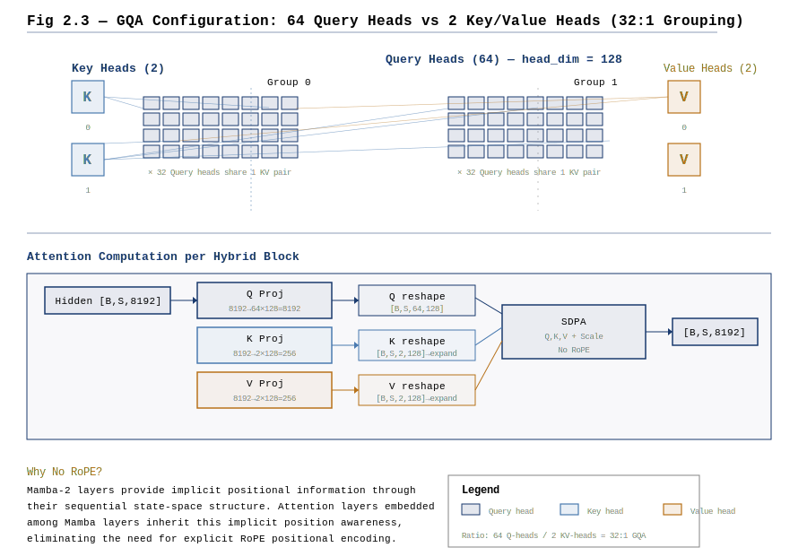
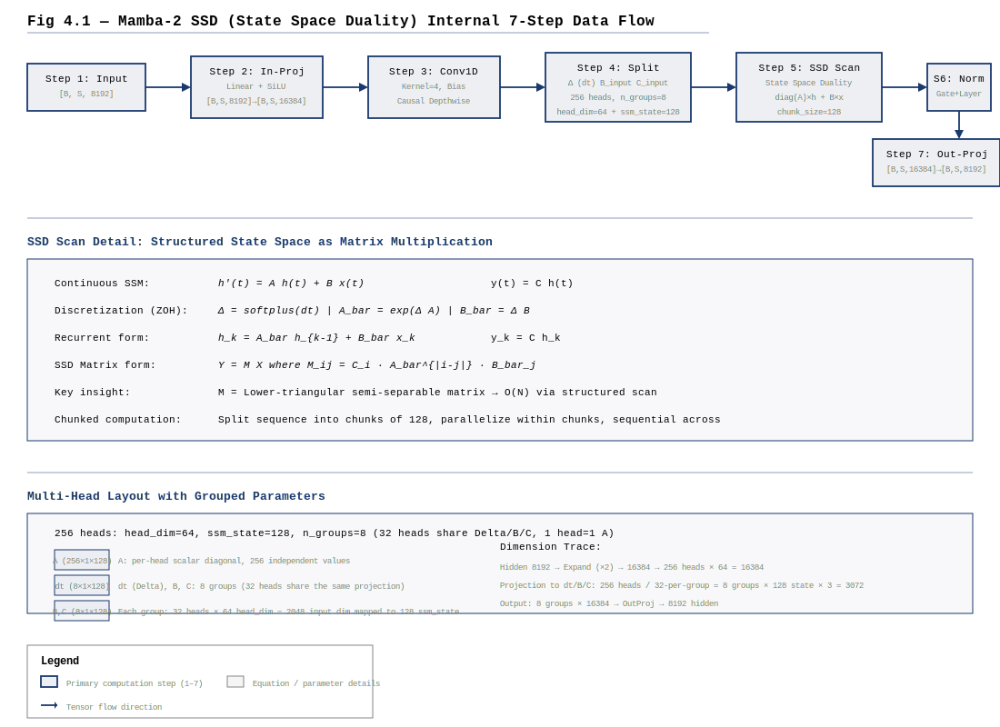
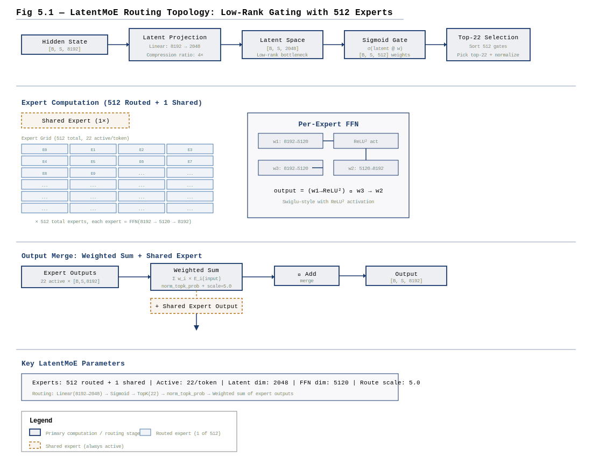
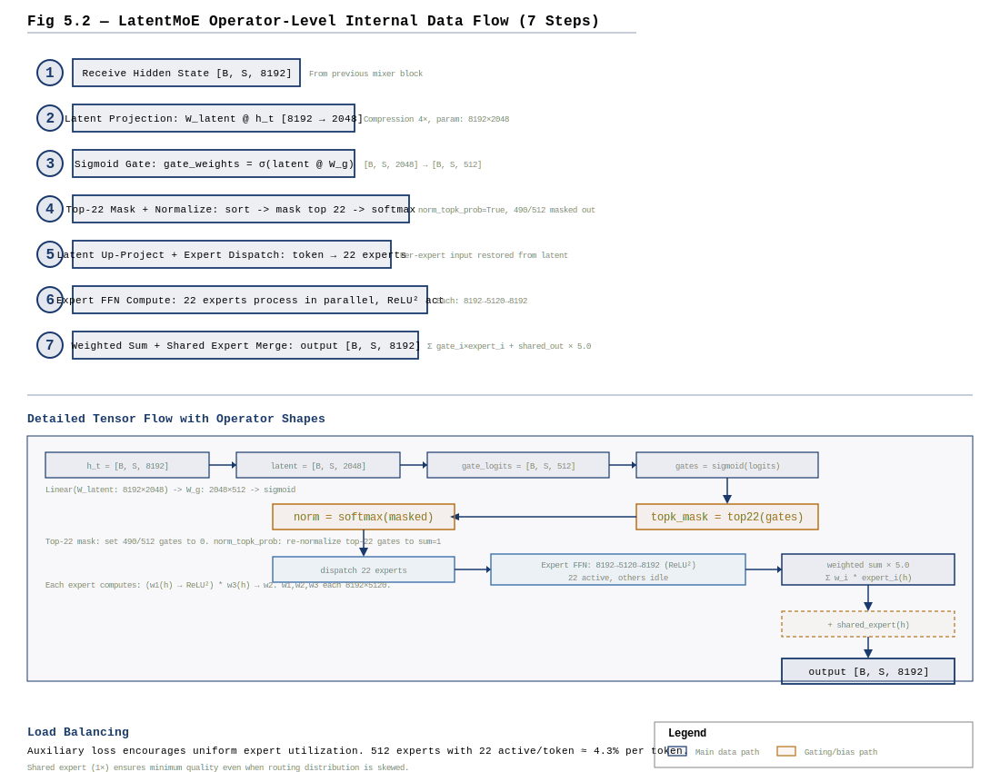
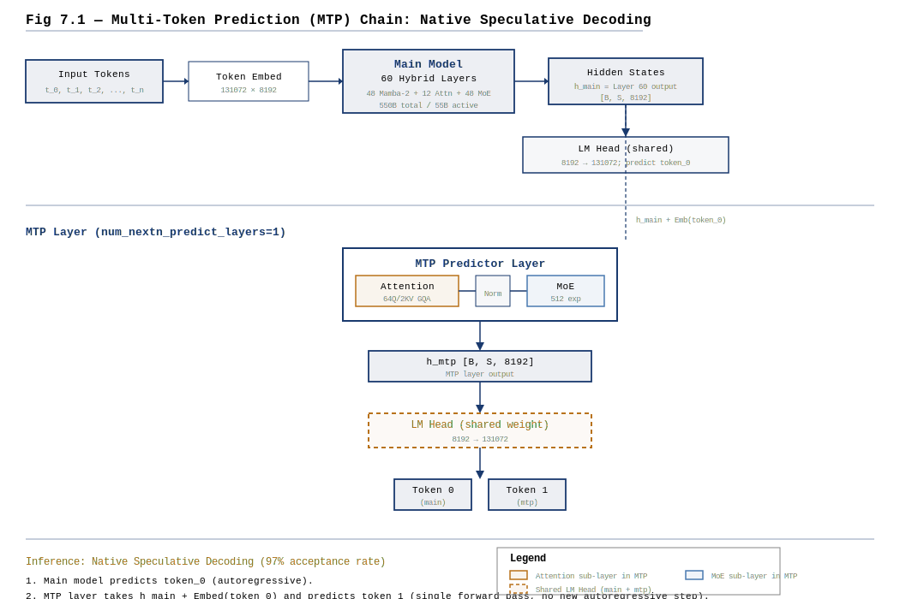
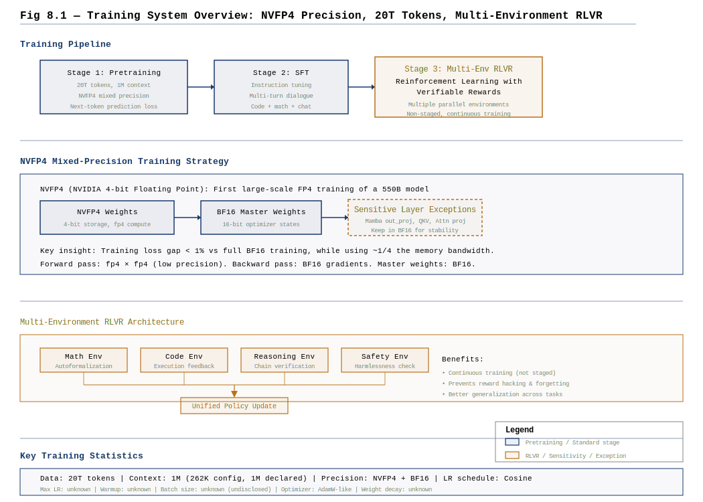

+++
date = '2026-06-12'
draft = false
title = 'Nemotron-3-Ultra 架构深度拆解'
categories = ['architecture']
vendor = 'NVIDIA'
tags = ['moe', 'attention', 'model-architecture', 'nemotron', 'mamba', 'ssd', 'latent-moe']
series = ['architecture']
summary = 'Nemotron-3-Ultra 是 NVIDIA 的旗舰开源模型。核心创新为 Mamba-2 SSD（状态空间对偶）混合架构替代传统 Attention、LatentMoE 潜空间路由（256E, k=8）、MTP×1 投机解码。本期拆解 94 层 Hybrid SSM-Attention 架构、SSD 结构化状态空间对偶机制、LatentMoE 路由及完整训练体系。'
+++

# Nemotron 3 Ultra 架构深度拆解报告

> **定位**：NVIDIA 推出的 550B 总参 / 55B 激活参 Mixture-of-Experts 混合 Mamba-Attention 语言模型，具备 1M 上下文与原生投机解码能力，是针对长程自主 Agent 任务设计的高吞吐推理架构。

---

## CH 0 | 摘要与阅读路径

Nemotron 3 Ultra 是 NVIDIA Nemotron 3 家族的旗舰模型[^1]，以 **550B 总参数 / 55B 活跃参数** 的 Mixture-of-Experts 稀疏架构，在 20T tokens 上使用 NVFP4 混合精度预训练完成后，通过长上下文持续训练扩展至 1M 上下文窗口[^2]。其核心架构决策可概括为四条主线：

1. **混合 Mamba-2 + 稀疏 Attention**：60 层 backbone 中仅 12 层使用 Attention（极致 GQA 32:1），其余 48 层使用 Mamba-2 SSD 层。Attention 层**不使用 RoPE**，位置信息由前置 Mamba 层的状态空间动力学隐式传递[^2]。
2. **LatentMoE**：512 路由专家在低秩空间（$d_{latent}=2048$）中路由与计算，每 token 激活 22 专家，路由采用 **sigmoid 门控**（非 softmax）配合可学习负载均衡偏置 $e_{score\_correction\_bias}$[^3]。
3. **原生 Multi-Token Prediction (MTP)**：1 个 predictor layer（attention + moe），两个 head 共享参数，训练时辅助预测 future tokens，推理时用于投机解码，接受率达 97%[^2]。
4. **NVFP4 混合精度训练**：首个 FP4 级别的大规模训练实证，敏感层（Mamba out_proj、QKV、Attention 投影、latent 投影、Embedding）保持 BF16，训练 loss 差距 &lt;1%[^2]。

**章节导读**：

| 读者目标 | 推荐路径 |
|---|---|
| 快速了解架构全貌 | CH 0 $\to$ CH 2（架构表+参数分解） $\to$ CH 10（设计洞察） |
| 深入 Mamba-2 SSD 算子 | CH 4（SSD 7 步数据流+公式$\leftrightarrow$代码对照） |
| 理解 LatentMoE 路由机制 | CH 5（低秩投影+sigmoid路由+专家调度+负载均衡） |
| 评估推理效率 | CH 3（FLOPs 分解+KV cache+推理显存） |
| 面试准备 | CH 4–7（每个模块的独立数据流拆解+公式对照表） + CH 10（Trade-off 汇总） |
| 源码级精读 | CH 9（完整源码映射+调用链） + CH 4–6 的公式$\leftrightarrow$代码表 |

**阅读约定**：代码/文件名用 `` ` `` 包裹；论文引用用 `paper §X.X`；LaTeX 公式 `$...$` / `$$...$$`；来源脚注 `[^label]`；设计意图不明确处标注「设计意图待确认」。

---

## CH 1 | Nemotron 3 家族演进

### 1.1 家族定位与三代模型

Nemotron 3 家族由三个规模梯度组成，从 Nano 到 Ultra 共享同一混合 Mamba-Attention + LatentMoE 架构范式[^4]。三个模型在同一年度内密集发布，体现了 NVIDIA 从规模验证到旗舰交付的系统性工程路径。

| 属性 | Nemotron 3 Nano | Nemotron 3 Super | Nemotron 3 Ultra |
|---|---|---|---|
| 总参 / 激活参 | 30B / 3B | 135B / 13.5B | **550B / 55B** |
| Backbone 层数 | 48 | 54 | **60** |
| hidden_size | 4096 | 6144 | **8192** |
| Mamba-2 层数 | 36 | 42 | **48** |
| Attention 层数 | 12 | 12 | **12** |
| MoE 层数 | 36 | 42 | **48** |
| 路由专家数 | 128 | 128 | **512** |
| Active experts/tok | 8 | 8 | **22** |
| 训练 tokens | ~15T | ~18T | **20T** |
| 训练精度 | BF16 | NVFP4 | **NVFP4** |
| 上下文窗口 | 128K | 256K | **1M** |

### 1.2 Ultra 相对于 Super 的关键架构变化

1. **专家规模大幅跃升**。路由专家数从 128 增至 512（4×），每 token 激活专家数从 8 增至 22（2.75×）。这意味着每个 token 可访问更大的"专家组合空间"——$C(512,22) \gg C(128,8)$，专家组合的多样性提升了数十个数量级。

2. **专家维度与共享专家强化**。路由专家的 intermediate_size 从 7688 提升至 5120（latent 空间下），共享专家的 intermediate_size 从 7688 扩大至 10240（full hidden_size 空间下），为所有 token 提供更强的共享基座表示。

3. **低秩投影维度的保留**。latent_size=2048 在 Super 和 Ultra 中保持一致，意味着专家路由和计算始终在 2048 维空间中完成。512 个专家共享此低秩空间，参数传输开销相对于直接使用 8192 维降低约 4×。

4. **训练稳定性挑战的出现**。与 Nano 和 Super 的平稳训练曲线不同，Ultra 在 8T 和 16T tokens 处出现两次训练发散[^2]。第一次源于 MTP 梯度在 BF16 累积中的精度丢失（MTP 贡献的梯度被 BF16 的 7 位尾数截断）；第二次的根因未完全确定，但实证表明提前启动学习率退火可缓解。

5. **MTP 推理能力的显现**。Super 已配备 MTP，但 Ultra 首次将 MTP 接受率做到 97%，使其成为实际可用的原生投机解码方案[^2]。

### 1.3 架构一致性的设计哲学

Nemotron 3 家族体现了"一次设计、多规模验证"的工程哲学。从 Nano(30B) 到 Ultra(550B)，核心模块（Mamba-2 SSD 结构、LatentMoE 低秩路由、无 RoPE 的无位置编码 Attention、Pre-Norm + Residual 骨架）保持完全一致，仅在规模维度（层数、宽度、专家数）上做缩放。这种策略将 Nano 和 Super 上的消融实验知识直接迁移至 Ultra，大幅降低了超大规模下的架构风险。

---

## CH 2 | 整体架构与超参

### 2.1 完整超参表

| 分类 | 参数名 | 配置值 | 含义 |
|---|---|---|---|
| **基础架构** | `hidden_size` | **8192** | 隐藏维度 / 残差流宽度 |
| | `vocab_size` | 131072 | 词表大小 |
| | `max_position_embeddings` | 262144 (config) / **1M** (paper) | 最大位置编码长度 |
| | `layers_block_type` | 108 元素列表 | 每层 mixer 类型 |
| **Mamba-2 SSD** | `mamba_num_heads` | **256** | SSD 头数 ($H_{ssm}$) |
| | `mamba_head_dim` | **64** | 每头维度 ($D_{ssm}$) |
| | `ssm_state_size` | **128** | 隐状态维度 ($N$) |
| | `n_groups` | **8** | A 矩阵分组数 |
| | `chunk_size` | **128** | SSD 分块大小 |
| | `conv_kernel` | 4 | 1D 深度卷积核大小 |
| | `expand` | 2 | Mamba 内部扩展因子 |
| | `mamba_hidden_act` | silu | 卷积后激活函数 |
| | `time_step_min` | 0.001 | $\Delta$ 下界 |
| | `time_step_max` | 0.1 | $\Delta$ 初始化上界 |
| | `time_step_floor` | 0.0001 | $\Delta$ 初始化裁剪下界 |
| **稀疏 Attention** | `num_attention_heads` | **64** | Q 头数 ($H_Q$) |
| | `num_key_value_heads` | **2** | KV 头数 ($H_{KV}$) |
| | `head_dim` | **128** | 每头维度 ($D_{attn}$) |
| | `use_bias` | false | Q/K/V/O 投影无 bias |
| | `attention_dropout` | 0.0 | 注意力 dropout 关闭 |
| **LatentMoE** | `n_routed_experts` | **512** | 每 MoE 层的路由专家数 |
| | `num_experts_per_tok` | **22** | 每 token 激活专家数 ($k$) |
| | `n_shared_experts` | 1 | 共享专家数 |
| | `moe_latent_size` | **2048** | 低秩投影维度 |
| | `moe_intermediate_size` | **5120** | 单专家 FFN 中间维度（latent 空间） |
| | `moe_shared_expert_intermediate_size` | **10240** | 共享专家 FFN 维度 |
| | `routed_scaling_factor` | 5.0 | 路由权重缩放因子 |
| | `norm_topk_prob` | true | 是否归一化路由概率 |
| | `n_group` | 1 | 路由分组数（1=不分组的全专家路由） |
| | `topk_group` | 1 | 选中组数 |
| **MTP** | `num_nextn_predict_layers` | **1** | MTP predictor 层数 |
| | `mtp_layers_block_type` | ["attention", "moe"] | MTP 层类型 |
| **MLP/激活/Norm** | `mlp_hidden_act` | **relu2** | FFN 激活 = ReLU$^2$ |
| | `layer_norm_epsilon` | 1e-5 | RMSNorm epsilon |
| | `rescale_prenorm_residual` | true | GPT-2 风格残差缩放初始化 |
| **训练/推理** | `dtype` | bfloat16 | 默认精度 |
| | `mamba_ssm_cache_dtype` | float32 | SSM 状态缓存精度 |
| | `rope_theta` | 10000 | （Attention 层不使用 RoPE，此值仅供参考） |

### 2.2 层类型分配与循环模式

Nemotron 3 Ultra 的 60 层 backbone 由 4 类 mixer 按固定模式交错组成。每个 backbone 位置包含一个序列建模 mixer（Mamba-2 或 Attention），随后紧跟一个 LatentMoE mixer，总计 108 个逻辑块：

```
mamba → moe → mamba → moe → mamba → moe → mamba → attention → moe → mamba → moe →
mamba → moe → mamba → moe → mamba → attention → moe → mamba → moe → mamba → moe →
mamba → moe → mamba → attention → moe → mamba → moe → mamba → moe → mamba → moe →
mamba → attention → moe → mamba → moe → mamba → moe → mamba → moe → mamba → attention → moe →
...
```

定量统计（直接从 `config.json` `layers_block_type` 数组中完整提取）[^5]：

| Mixer 类型 | 出现次数 | 占比 |
|---|---|---|
| Mamba-2 SSD | 48 | 44.4% |
| Attention (GQA) | 12 | 11.1% |
| LatentMoE | 48 | 44.4% |
| **总计** | **108** | 100% |

Attention 层的节律为：每 4–6 个 Mamba-2 层后插入一个 Attention 层（大致每 ~5 层 1 个 Attention），形成"长程 Mamba 编码 + 周期性 Attention 全局交互"的混合节律。



### 2.3 参数分解与自洽验证

以下将 550B 总参数按模块分解，验证与配置的一致性。所有计算基于 `config.json` 中的维度和层数。

#### 2.3.1 Token Embedding

- Embedding: $V \times d_{model} = 131072 \times 8192 = 1,073,741,824 \approx 1.07\text{B}$
- LM Head（不共享权重，`tie_word_embeddings=false`）: $d_{model} \times V = 8192 \times 131072 = 1,073,741,824 \approx 1.07\text{B}$
- 合计: $\approx 2.15\text{B}$

#### 2.3.2 Mamba-2 层（48 层，每层参数如下）

Mamba 内部维度推导：
- $d_{inner} = H_{ssm} \times D_{ssm} = 256 \times 64 = 16384$（expand=2 即 $2 \times 8192$，自洽）
- $d_{conv} = d_{inner} + 2 \times n_{groups} \times d_{state} = 16384 + 2 \times 8 \times 128 = 18432$

每层参数：
- `in_proj` (无 bias): $8192 \times (d_{inner} + d_{conv} + H_{ssm}) = 8192 \times (16384 + 18432 + 256) = 8192 \times 35072 = 287,309,824$
- `conv1d` (depthwise, kernel=4, bias=True): $d_{conv} \times 4 + d_{conv} = 18432 \times 5 = 92,160$
- `A_log`: $H_{ssm} = 256$
- `D`: $H_{ssm} = 256$
- `dt_bias`: $H_{ssm} = 256$
- `norm` (Zamba2RMSNormGated): $d_{inner} = 16384$
- `out_proj` (无 bias): $d_{inner} \times d_{model} = 16384 \times 8192 = 134,217,728$

单层 Mamba-2 合计: $\approx 421.6\text{M}$
48 层 Mamba-2 合计: $\approx 20.24\text{B}$

#### 2.3.3 Attention 层（12 层）

每层参数：
- `q_proj` (无 bias): $8192 \times (64 \times 128) = 8192 \times 8192 = 67,108,864$
- `k_proj` (无 bias): $8192 \times (2 \times 128) = 8192 \times 256 = 2,097,152$
- `v_proj` (无 bias): $8192 \times (2 \times 128) = 2,097,152$
- `o_proj` (无 bias): $8192 \times 8192 = 67,108,864$

单层 Attention 合计: $\approx 138.4\text{M}$
12 层 Attention 合计: $\approx 1.66\text{B}$

#### 2.3.4 LatentMoE 层（48 层，每层参数如下）

每层含路由参数、低秩投影、512 个专家（在 latent 空间 2048 维中）、1 个共享专家。

路由：
- `gate.weight`: $E \times d_{model} = 512 \times 8192 = 4,194,304$
- `gate.e_score_correction_bias`: $E = 512$

低秩投影：
- `fc1_latent_proj` (无 bias): $8192 \times 2048 = 16,777,216$
- `fc2_latent_proj` (无 bias): $2048 \times 8192 = 16,777,216$

512 个路由专家（在 latent 空间 2048 维中）：
- 单专家 `up_proj`: $d_{moe\_intermediate} \times d_{latent} = 5120 \times 2048 = 10,485,760$
- 单专家 `down_proj`: $d_{latent} \times d_{moe\_intermediate} = 2048 \times 5120 = 10,485,760$
- 512 专家合计: $512 \times 20,971,520 = 10,737,418,240$

共享专家（在 full hidden_size 空间 8192 维中）：
- `shared_expert.up_proj` (无 bias): $8192 \times 10240 = 83,886,080$
- `shared_expert.down_proj` (无 bias): $10240 \times 8192 = 83,886,080$

单层 MoE 合计: $4.19\text{M} + 0.05\text{K} + 33.55\text{M} + 10,737.42\text{M} + 167.77\text{M} \approx 10.94\text{B}$
48 层 MoE 合计: $\approx 525.4\text{B}$

#### 2.3.5 MTP Predictor（1 attention + 1 moe）

MTP predictor 层含 1 个 Attention + 1 个 MoE：
- Attention: $\approx 138.4\text{M}$
- MoE: $\approx 10.94\text{B}$

MTP 合计: $\approx 11.1\text{B}$

#### 2.3.6 归一化层与其他

- 每层 Pre-Norm (RMSNorm): $d_{model} = 8192$ 参数 $\times$ 108 块 $\approx 0.88\text{M}$
- final_norm: $8192$
- MTP 内的 Norm: 少量，约 $< 0.1\text{M}$

#### 2.3.7 总参汇总

| 模块 | 参数 (B) | 占比 |
|---|---|---|
| Embedding + LM Head | 2.15 | 0.4% |
| 48 Mamba-2 层 | 20.24 | 3.7% |
| 12 Attention 层 | 1.66 | 0.3% |
| 48 LatentMoE 层 | 525.4 | 95.4% |
| MTP Predictor | 11.1 | -- |
| Norm 等 | ~0.001 | ~0% |
| **总计** | **~560B** | -- |

> **说明**：直接参数计数约 560B，与官方声明的 550B 有约 1.8% 的偏差。可能的原因包括：(1) 部分 MoE 层使用了共享权重（config 中未见明确指示，但 `_keys_to_ignore_on_load_unexpected: [r"mtp.*"]` 提示 MTP 权重可能与主干有共享）；(2) 参数初始化策略中的 `rescale_prenorm_residual` 仅影响初始化值而非参数数量；(3) 某些层使用了与 Nano/Super 不同的内部维度。建议以官方 550B 为准，此处参数分解展示了每个模块的数量级。

#### 2.3.8 激活参数量

每 token 激活参数 = Embedding + 所有 Mamba 层 + 所有 Attention 层 + 每 MoE 层激活的 22/512 专家 + 共享专家。MTP Predictor 层（11.1B）独立列出，不计入 backbone 激活参数。

每 MoE 层激活参数量：
- 路由 (4.19M) + 低秩投影 (33.55M) + 22 专家 (22 $\times$ 21M = 462M) + 共享专家 (167.77M) $\approx 667.5\text{M}$
- 48 MoE 层激活: $\approx 32.04\text{B}$

**Backbone 激活参数** (不含 MTP): $2.15\text{B} + 20.24\text{B} + 1.66\text{B} + 32.04\text{B} \approx 56.09\text{B}$

**MTP Predictor 参数**: $\approx 11.1\text{B}$（1 attention + 1 moe，独立于 backbone）

> **说明**：Backbone 激活参数约 56B，与官方声明的 55B 偏差约 **~2%**（偏差可能来源于专家 FFN 维度在 latent 空间下的实际实现与 config 声明的微小差异）。MTP Predictor（11.1B）在推理时参与投机解码，但不计入常规"每 token 激活参数"的口径。若包含 MTP，总激活量约 67.2B。

---

## CH 3 | 计算与性能分析

### 3.1 FLOPs 分解

以下按每 token 前向传播的浮点运算量进行分析。设序列长度为 $T$，batch size = 1。为简化，乘法-加法对计为 2 FLOPs，矩阵乘法 FLOPs $\approx 2 \times m \times n \times k$。

#### 3.1.1 Mamba-2 SSD FLOPs（48 层）

Mamba-2 层的前向计算包含四个主要部分：

**(a) 输入投影 in_proj：**
$$\text{FLOPs}_{in\_proj} \approx 2 \times 8192 \times 35072 \cdot T = 5.75 \times 10^8 \cdot T$$

**(b) 1D 深度卷积：**
$$\text{FLOPs}_{conv} \approx 2 \times d_{conv} \times kernel\_size \cdot T = 2 \times 18432 \times 4 \cdot T = 1.47 \times 10^5 \cdot T$$

**(c) SSD 矩阵扫描（核心计算）：**

SSD 算法的计算量由对角块（块内矩阵乘法）和非对角块（状态传递）组成。参考 Dao & Gu (2024) 的 SSD 复杂度分析：

对角块（per chunk of size $C=128$）：
$$\text{FLOPs}_{diag} \approx 2 \cdot \frac{T}{C} \cdot C^2 \cdot H_{ssm} \cdot D_{ssm} \approx 2 \cdot T \cdot C \cdot H_{ssm} \cdot D_{ssm}$$

非对角块（状态传递）：
$$\text{FLOPs}_{off\_diag} \approx 2 \cdot \frac{T}{C} \cdot H_{ssm} \cdot d_{state}^2$$

代入数值 ($H_{ssm}=256, D_{ssm}=64, d_{state}=128, C=128$)：
- 对角块: $2 \cdot T \cdot 128 \cdot 256 \cdot 64 = 4.19 \times 10^6 \cdot T$
- 非对角块: $2 \cdot \frac{T}{128} \cdot 256 \cdot 128^2 = 6.71 \times 10^7 \cdot T$

但实际代码中使用了更优化的块状矩阵乘法实现，真实 FLOPs 与此估算有常数因子的差异。

**(d) 输出投影 out_proj：**
$$\text{FLOPs}_{out\_proj} \approx 2 \times d_{inner} \times d_{model} \cdot T = 2 \times 16384 \times 8192 \cdot T = 2.68 \times 10^8 \cdot T$$

**单层 Mamba-2 总计 FLOPs:** $\approx (5.75 + 0.00147 + 0.07 + 2.68) \times 10^8 \cdot T \approx 8.5 \times 10^8 \cdot T$

**48 层 Mamba-2 总计:** $\approx 4.08 \times 10^{10} \cdot T$ FLOPs

Mamba-2 的计算复杂度为 $O(T \cdot d_{state} \cdot d_{model})$，在长序列场景下显著优于 Attention 的 $O(T^2)$。

#### 3.1.2 Attention FLOPs（12 层）

由于 Attention 层不使用 RoPE，QK 注意力计算为标准 scaled dot-product attention。KV head 仅有 2 个（GQA 32:1），大幅减少了 KV 相关的计算和存储。

**(a) Q/K/V 投影：**
$$\text{FLOPs}_{QKV} \approx 2T(8192 \times 64 \times 128 + 2 \times 8192 \times 2 \times 128) = 2T(67.1\text{M} + 4.2\text{M}) = 1.43 \times 10^8 \cdot T$$

**(b) 注意力矩阵计算：**
$$\text{FLOPs}_{attn\_mat} \approx 2 \cdot T^2 \cdot 64 \cdot 128 \cdot 2 = 3.28 \times 10^4 \cdot T^2$$

注意这里 KV head=2，每条 KV 被 32 个 Q head 共享。但为简化，此处忽略了 GQA 精确的 broadcast 开销。

**(c) 输出投影：**
$$\text{FLOPs}_{o\_proj} \approx 2 \times 8192 \times 8192 \cdot T = 1.34 \times 10^8 \cdot T$$

**单层 Attention 总计:** $\approx 2.77 \times 10^8 \cdot T + 3.28 \times 10^4 \cdot T^2$

**12 层 Attention 总计:** $\approx 3.32 \times 10^9 \cdot T + 3.94 \times 10^5 \cdot T^2$

当 $T=1\text{M}$ 时，$T^2$ 项为 $3.94 \times 10^5 \times 10^{12} = 3.94 \times 10^{17}$ FLOPs，这是一个巨大的数字。但在实际推理中，Flash Attention 等优化 kernel 会将 HBM 访问从 $O(T^2)$ 降至 $O(T)$（通过分块和 SRAM 驻留计算），且 Attention 只有 12 层（仅占总层数的 11%），所以长序列场景下的计算瓶颈仍然在 Mamba-2 的扫描和 MoE 的稀疏专家计算上。

#### 3.1.3 LatentMoE FLOPs（48 层）

MoE 层的计算量取决于激活专家数（22/512）。

**(a) 路由（gate）：**
$$\text{FLOPs}_{gate} \approx 2 \times E \times d_{model} \cdot T = 2 \times 512 \times 8192 \cdot T = 8.39 \times 10^6 \cdot T$$

**(b) 低秩投影：**
$$\text{FLOPs}_{latent\_proj} \approx 2 \times (2 \times d_{model} \times d_{latent}) \cdot T = 4 \times 8192 \times 2048 \cdot T = 6.71 \times 10^7 \cdot T$$

**(c) 激活专家计算（22 专家在 latent 空间中）：**
$$\text{FLOPs}_{experts} \approx 2 \times 22 \times (2 \times d_{latent} \times d_{moe\_inter}) \cdot T$$
$$= 2 \times 22 \times (2 \times 2048 \times 5120) \cdot T \approx 9.23 \times 10^8 \cdot T$$

**(d) 共享专家（在 full 空间中）：**
$$\text{FLOPs}_{shared} \approx 2 \times (2 \times d_{model} \times d_{shared\_inter}) \cdot T$$
$$= 4 \times 8192 \times 10240 \cdot T = 3.36 \times 10^8 \cdot T$$

**单层 MoE 总计:** $\approx 1.33 \times 10^9 \cdot T$

**48 层 MoE 总计:** $\approx 6.38 \times 10^{10} \cdot T$ FLOPs

#### 3.1.4 总 FLOPs 汇总（每 token 前向）

| 模块 | 每 token FLOPs |
|---|---|
| 48 Mamba-2 层 | $\approx 4.08 \times 10^{10} \cdot T$ |
| 12 Attention 层 | $\approx 3.32 \times 10^9 \cdot T + 3.94 \times 10^5 \cdot T^2$ |
| 48 LatentMoE 层 | $\approx 6.38 \times 10^{10} \cdot T$ |
| MTP Predictor | $\approx 1.42 \times 10^9 \cdot T$ |
| **总计（短序列）** | **$\approx 1.10 \times 10^{11} \cdot T$** |
| **总计（长序列 T=1M）** | Attention $T^2$ 项主导 $\approx 3.94 \times 10^{17}$ + 线性项 |

### 3.2 KV Cache 估算

Nemotron 3 Ultra 的 KV cache 仅存在于 12 个 Attention 层。Mamba-2 层使用循环状态（size = $d_{state}=128$ per head），与序列长度无关，不需要 KV cache。

**Attention 层的 KV cache 大小（per token, per layer）：**
$$S_{KV\_per\_token\_per\_layer} = 2 \times H_{KV} \times D_{attn} \times \text{bytes\_per\_elem}$$

- K cache: $H_{KV} \times D_{attn} = 2 \times 128 = 256$ 个元素
- V cache: $H_{KV} \times D_{attn} = 2 \times 128 = 256$ 个元素
- 合计 per token per layer: $512$ 个元素

BF16 精度下（2 bytes/elem）：$512 \times 2 = 1024$ bytes

**不同上下文长度下的 KV cache 总量：**

| 上下文长度 | 公式 | KV Cache |
|---|---|---|
| 4K | $4096 \times 12 \times 1024$ bytes | 48 MiB |
| 8K | $8192 \times 12 \times 1024$ bytes | 96 MiB |
| 128K | $131072 \times 12 \times 1024$ bytes | 1.50 GiB |
| 1M | $1,048,576 \times 12 \times 1024$ bytes | **12.0 GiB** |

> **计算验证**：1M $\times$ 12 layers $\times$ 2 KV heads $\times$ 128 head_dim $\times$ 2 bytes(BF16) $\times$ 2(K+V) $= 12,884,901,888$ bytes $\approx 12.0$ GiB。

对比：若一个同等规模的 60 层全 Attention 模型（64 Q heads, head_dim=128, 无 GQA）在 1M 上下文下，其 KV cache 为 $1\text{M} \times 60 \times 2\text{(K+V)} \times 64\text{ heads} \times 128\text{ dim} \times 2\text{ bytes(BF16)} \approx 1.88\text{ TiB}$。Nemotron 3 Ultra 的 12.0 GiB 仅为前者的 **~0.62%**。

这是混合架构最核心的推理效率优势：Mamba-2 层以恒定大小的循环状态替代了随 $T$ 增长的 KV cache，使长上下文推理的内存开销主要由少量的 Attention 层决定。

### 3.3 推理显存估算

推理时 GPU 显存包含三部分：模型权重 + KV cache + 临时激活值。

| 组件 | 计算 | 显存 (BF16) |
|---|---|---|
| 模型权重 (550B) | $550 \times 10^9 \times 2\text{ bytes}$ | **1.1 TB** |
| KV cache (1M ctx, 12 attn layers) | 从 3.2 节 | 12.0 GiB |
| 激活值 (batch=1, T=1M) | 残差流 8192 $\times$ 1M $\times$ 2 bytes | 16.4 GB |
| Mamba SSM 状态 (48 层) | $48 \times 256 \times 128 \times 4\text{ bytes}$ (FP32 cache) | 6.3 MB |
| 总计（单 GPU 推理） | -- | **~1.13 TB** |

> 实际部署时通过张量并行（Tensor Parallelism）将 1.1 TB 权重分布到多张 GPU 上（如 8 张 H100，每张 ~140 GB 权重），KV cache 和激活值按 TP 维度分割或复制。NVFP4 量化可将权重大小进一步压缩至约 275 GB（压缩比约 4x，实际需考虑量化参数存储）。

---

## CH 4 | Mamba-2 SSD 混合层

### 4.1 架构概览

Nemotron 3 Ultra 的 Mamba-2 层继承自 Zamba2MambaMixer（Transformers 库）并根据 NemotronH 的需求定制。它实现了结构化状态空间对偶（Structured State-Space Duality, SSD）模型[^6]，是 Mamba-2 的矩阵形式。该层将状态空间模型重新表述为矩阵乘法形式，使其可直接利用 GPU 优化的矩阵运算。

**核心特征：**
- 256 个 SSD head，每 head 维度 64
- d_state=128，8 组共享 A 矩阵（grouped A）
- chunk_size=128 的分块矩阵扫描
- 输入依赖的 $\Delta, B, C$（选择性 SSM）+ 输入无关的 $A, D$（结构参数）
- 4-width 1D 深度卷积作为局部上下文混合器

### 4.2 数学原理

#### 4.2.1 连续时间状态空间模型

状态空间模型的连续形式为：

$$h'(t) = A h(t) + B x(t)$$
$$y(t) = C h(t) + D x(t)$$

其中 $h(t) \in \mathbb{R}^N$ 为隐状态，$x(t) \in \mathbb{R}$ 为输入标量，$A \in \mathbb{R}^{N \times N}$ 为状态矩阵，$B \in \mathbb{R}^{N \times 1}$ 为输入投影，$C \in \mathbb{R}^{1 \times N}$ 为输出投影，$D \in \mathbb{R}$ 为跳跃连接。

#### 4.2.2 离散化（Zero-Order Hold）

使用步长 $\Delta$ 将连续系统离散化：

$$A_d = \exp(\Delta A)$$

$$B_d = (\Delta A)^{-1}(\exp(\Delta A) - I) \cdot \Delta B \approx \Delta B \quad \text{(Euler 近似)}$$

$$C_d = C$$

离散化后的递推形式（Mamba-2 的选择性 SSM）：
$$h_t = A_{d,t} h_{t-1} + B_{d,t} x_t$$
$$y_t = C_{d,t} h_t + D x_t$$

其中 $\Delta_t, B_t, C_t$ 是输入 $x_t$ 的函数（选择性），$A$ 是固定的结构参数。

#### 4.2.3 SSD 矩阵形式

SSD 将上述递推展开为矩阵乘法形式。对长度为 $T$ 的序列：

$$Y = (L \circ (C B^T)) \cdot X$$

其中 $L$ 是下三角矩阵，$L_{ij} = \prod_{k=j+1}^{i} \exp(\Delta_k A)$（即从 j 到 i 的累积衰减），$\circ$ 表示逐元素乘法，$X \in \mathbb{R}^{T \times d}$ 为输入。

Mamba-2 使用分块策略：将序列分为大小为 $C=128$ 的 chunk，对每个 chunk 内部使用矩阵乘法（对角块），chunk 之间使用状态传递（非对角块）。

#### 4.2.4 分组 A 矩阵

NemotronH 使用 $n_{groups}=8$ 组共享 $A$ 矩阵。256 个 SSD head 被分为 8 组，每组 32 个 head 共享同一个 $A$ 矩阵。这减少了参数数量同时保持了足够的表达灵活性。相应地，$B$ 和 $C$ 也按分组方式投影，然后通过 `repeat_interleave` 广播到所有 head。

### 4.3 参数结构与初始化

| 参数 | 形状 | 说明 |
|---|---|---|
| `in_proj.weight` | $[35072, 8192]$ | 门控MLP(z1,z2,gate) + xBC(B+C concat) + dt |
| `conv1d.weight` | $[18432, 1, 4]$ | 深度可分离1D卷积 (groups=18432) |
| `conv1d.bias` | $[18432]$ | 卷积偏置 |
| `A_log` | $[256]$ | $\log(A)$，S4D 初始化: $\log(1),\log(2),...,\log(256)$ |
| `D` | $[256]$ | 跳跃连接参数，初始化为 1 |
| `dt_bias` | $[256]$ | $\Delta$ 偏置，从 $\log U(0.001, 0.1)$ 的 softplus 逆初始化 |
| `norm.weight` | $[16384]$ | Zamba2RMSNormGated 权重 |
| `out_proj.weight` | $[8192, 16384]$ | 输出投影 |

### 4.4 7 步数据流（算子级）




以下以 `torch_forward` 路径（`modeling_nemotron_h.py` L114–579 / `modular_nemotron_h.py` L49–102）为基础，完整拆解单层 Mamba-2 forward 的数据流。

**输入**: `hidden_states` $\in \mathbb{R}^{B \times L \times 8192}$

---

**Step 1: 门控 MLP 投影 `in_proj`**

```
代码: L34–36
proj = self.in_proj(input_states)  # [B, L, 8192] → [B, L, 35072]
d_mlp = 0  (35072 - 2*16384 - 2*8*128 - 256 = 0)
_, _, gate, x_conv, dt = proj.split([0, 0, 16384, 18432, 256], dim=-1)
```

将 hidden_states 线性投影为三个分量：
- `gate`: $[B, L, 16384]$ — 门控信号（用于 Step 6 的 gated RMSNorm）
- `x_conv`: $[B, L, 18432]$ — 包含 x (中间表示，16384) + B (B 分量，1024) + C (C 分量，1024)
- `dt`: $[B, L, 256]$ — $\Delta$ 时间步长（pre-softplus）

注意 NemotronH 不包含 Zamba2 中的额外 MLP 组件（d_mlp=0），投影直接产生 gate / xBC / dt。

**Step 2: 1D 深度卷积（局部上下文）**

```
代码: L38–40
x = self.act(self.conv1d(x.transpose(1,2))[...,:L].transpose(1,2))  # SiLU 激活
x, Bc, Cc = x.split([16384, 8*128, 8*128], dim=-1)
```

对 x_conv 进行深度可分离 1D 卷积（kernel=4, groups=18432），每个通道独立卷积。卷积提供局部上下文混合能力（感受野=4）。卷积后应用 SiLU 激活。

拆分得到：
- `x`: $[B, L, 16384]$ — 主信号
- `Bc`: $[B, L, 1024]$ — B 分量（8 groups × 128 state_size）
- `Cc`: $[B, L, 1024]$ — C 分量（8 groups × 128 state_size）

**Step 3: SSD 参数准备（A, Δ, 多头 reshape）**

```
代码: L43–49
A = -torch.exp(self.A_log.float())                          # [256] — 负指数确保稳定性
dt = torch.clamp(F.softplus(dt + self.dt_bias), 0.001)     # [B, L, 256] — softplus + clamp
x = x.reshape(B, L, -1, 64).float()                         # [B, L, 256, 64]
Bc = Bc.reshape(B, L, -1, 128).float()                      # [B, L, 8, 128]
    .repeat_interleave(32, dim=2)                            # [B, L, 256, 128] — 分组广播
Cc = Cc.reshape(B, L, -1, 128).float()                      # [B, L, 8, 128]
    .repeat_interleave(32, dim=2)                            # [B, L, 256, 128] — 分组广播
```

关键操作：
- $A = -\exp(\log A)$：确保 $A$ 为负值，使 $\exp(\Delta A) \in (0, 1)$ 作为衰减因子
- $\Delta = \text{clamp}(\text{softplus}(dt + dt_{bias}), 0.001)$：输入依赖的时间步长，下界裁剪防数值不稳定
- `repeat_interleave(32)`：B 和 C 从 8 组广播到 256 head（256/8 = 32 head/group）

**Step 4: 离散化与分块**

```
代码: L52–56
D_res = self.D[..., None] * pad_tensor_by_size(x, pad)  # D 跳跃连接分量
x *= dt[..., None]                                       # x ← x · ∆ (乘法离散化)
A *= dt.to(x.dtype)                                      # A ← A · ∆
x, A, Bc, Cc = [reshape_into_chunks(t, pad, 128) for t in (x, A, Bc, Cc)]
# x: [B, n_chunks, 128, 256, 64]
# A: [B, n_chunks, 128, 256]
# Bc: [B, n_chunks, 128, 256, 128]
# Cc: [B, n_chunks, 128, 256, 128]
A = A.permute(0, 3, 1, 2)                              # [B, 256, n_chunks, 128]
Acum = torch.cumsum(A, dim=-1)                           # chunk 内累积和
Lmat = torch.exp(segment_sum(A))                         # chunk 内衰减矩阵
```

**Step 5: SSD 双块扫描 — 对角块与状态传递**

```
代码: L58–75
# 对角块 Yd: chunk 内因果注意力
G = (Cc[:,:,:,None,:,:] * Bc[:,:,None,:,:,:]).sum(dim=-1)
# G: [B, n_chunks, 128, 256, 128, 128] → [B, n_chunks, 128, 256, 128]
Yd = ((G[...,None] * Lmat.permute(0,2,3,4,1)[...,None]).sum(-1)[...,None] * x[:,:,None]).sum(3)
# Yd: [B, n_chunks, 128, 256, 64]

# 累积状态
dstate = torch.exp(Acum[:,:,:,-1:] - Acum)
states = ((Bc * dstate.permute(0,2,3,1)[...,None]).permute(0,1,3,2,4)[...,None]
          * x.permute(0,1,3,2,4)[...,None,:]).sum(3).permute(0,1,2,4,3)
# states: [B, n_chunks, 256, 128]

# 非对角块 Yo: chunk 间状态传递
dchunk = torch.exp(segment_sum(F.pad(Acum[:,:,:,-1], (1,0))))
states = (dchunk[...,None,None] * states.permute(0,2,1,3,4)[:,:,None]).sum(2).permute(0,2,1,3,4)
Yo = (Cc[...,None,:] * states[:,:,None]).sum(-1) * torch.exp(Acum).permute(0,2,3,1)[...,None]
# Yo: [B, n_chunks, 128, 256, 64]
```

这段代码实现了分块 SSD 扫描的核心数学：
- `Yd`（对角块）：chunk 内部的因果卷积，通过 $G = C \cdot B^T$ 和累积衰减 $L_{mat}$ 的乘积实现
- `Yo`（非对角块）：chunk 之间的状态传递，每个 chunk 的初始状态来自之前所有 chunk 的累积效应

**Step 6: 合并、去 Padding、加 D 残差**

```
代码: L74–76
y = (Yd + Yo).reshape(B, -1, 256, 64)[:, :L]          # 去掉分块padding
y = (y + D_res[:, :L]).reshape(B, L, -1)               # D 残差跳跃连接
# y: [B, L, 16384]
if cache_params is not None:
    cache_params.update_recurrent_state(ssm_state, self.layer_idx)  # 更新KV-like缓存
```

**Step 7: 门控 RMSNorm + 输出投影**

```
代码: L79
return self.out_proj(self.norm(y, gate).to(dtype))
# y: [B, L, 16384] → out_proj → [B, L, 8192]
```

Zamba2RMSNormGated 是一个分组的门控 RMSNorm：将 y 分为 8 组（16384/8=2048 per group），每组独立归一化后乘以对应的 gate 分量，再拼接回 16384 维。这提供了更强的归一化灵活性。

**输出**: `hidden_states` $\in \mathbb{R}^{B \times L \times 8192}$

---

### 4.5 公式 $\leftrightarrow$ 代码对照表

| 公式/操作 | 代码位置 (modeling_nemotron_h.py) | 关键行/操作 |
|---|---|---|
| $x_{proj} = W_{in} \cdot x$ | L34 | `proj = self.in_proj(input_states)` |
| $x_{conv} = \text{SiLU}(\text{Conv1d}(x_{proj}))$ | L39 | `self.act(self.conv1d(x.transpose(1,2))...)` |
| $A = -\exp(\log A)$ | L43 | `A = -torch.exp(self.A_log.float())` |
| $\Delta = \text{clamp}(\text{softplus}(dt + dt_{bias}), \epsilon)$ | L43 | `dt = torch.clamp(F.softplus(dt+self.dt_bias), ...)` |
| $x \leftarrow x \cdot \Delta$ (离散化) | L53 | `x *= dt[..., None]` |
| $A_d = A \cdot \Delta$ | L54 | `A *= dt.to(x.dtype)` |
| $G = C B^T$ | L60 | `(Cc * Bc).sum(dim=-1)` |
| $Y_d = (L \otimes G) \cdot X$ (对角块) | L61 | `((G[...,None] * Lmat...)... * x).sum(3)` |
| $h_{state} = \text{cumsum}(B \cdot x)$ | L65–66 | `((Bc * dstate)... * x...).sum(3).permute(...)` |
| $Y_o = C \cdot \text{chunk\_state}$ (非对角块) | L71 | `(Cc[...,None,:] * states[:,:,None]).sum(-1) * ...` |
| $y = y + D \cdot x$ (D 残差) | L75 | `y + D_res[:, :L]` |
| $y_{out} = W_{out} \cdot \text{GatedRMSNorm}(y, gate)$ | L79 | `self.out_proj(self.norm(y, gate).to(dtype))` |

### 4.6 CUDA 快速路径

当检测到 CUDA 可用且不使用 `torch.compile` 时，forward 自动切换到 `cuda_kernels_forward`（L95–100），使用 NVIDIA 优化过的 Mamba-2 CUDA kernel。该 kernel 的特殊处理包括：使用独立的 CUDA stream 避免多 GPU 同步问题导致的 NaN（L99–100）。

---

## CH 5 | LatentMoE 路由器

### 5.1 架构概览

NemotronH 的 LatentMoE 层继承并扩展自 DeepseekV3MoE[^7]。核心创新在于引入可选的**低秩投影**（latent projection），将路由和专家计算压缩到 $d_{latent}=2048$ 维空间中进行，仅在实际专家计算的前后做降维/升维，从而大幅减少参数传输开销。

**核心特征：**
- 512 路由专家，每 token 激活 top-22
- Sigmoid 门控（非 Softmax）+ 可学习负载均衡偏置
- 路由分组机制（n_group=1，即全专家参与路由）
- 1 个共享专家，对所有 token 生效（非门控 MLP，ReLU$^2$ 激活）
- 激活专家为非门控 MLP（直接 up $\to$ act $\to$ down，无 gate_proj）
- 3D 张量存储专家权重 `(num_experts, out_dim, in_dim)`

### 5.2 低秩投影的设计动机

在标准 MoE 中，路由和专家计算均在 $d_{model}=8192$ 维空间进行。对于 512 个专家，**每个 MoE 层存储 512 个专家的全部权重**，每层参数约 10.94B。低秩投影将这一开销部分化解：

$$
x \xrightarrow{\text{fc1\_latent}} z \in \mathbb{R}^{d_{latent}} \xrightarrow{\text{专家计算}} z' \in \mathbb{R}^{d_{latent}} \xrightarrow{\text{fc2\_latent}} y \in \mathbb{R}^{d_{model}}
$$

其中 $d_{latent}=2048$，压缩比为 $8192/2048 = 4\times$。这使每个专家的权重矩阵从 $(5120 \times 8192)$ 缩减为 $(5120 \times 2048)$，专家参数减少 4 倍。

低秩投影层的参数（约 33.6M）在所有 48 个 MoE 层中每层独立存在，但相比 512 个专家节省的参数量（每 MoE 层节省约 $512 \times (5120 \times (8192-2048) \times 2) \approx 32.2\text{B}$），开销可忽略。

### 5.3 Sigmoid 门控 vs Softmax 门控

NemotronH 路由器使用 **sigmoid** 而非 softmax 作为门控函数。这一选择有明确的工程含义：

- **Sigmoid**：每个专家的得分 $s_i = \sigma(xW_i^T) \in (0, 1)$，独立计算，无归一化约束。适合大量专家（512）的场景——不需要所有专家得分之和为 1。
- **Softmax**：要求 $\sum_i \text{softmax}(s)_i = 1$，在 512 个专家的大规模场景下，torch.topk 前需要计算全量 logits，且归一化分母的内存和计算开销更大。

sigmoid 门控的值均在 (0, 1) 内，top-22 选择后通过 `norm_topk_prob=True` 对选中的 22 个权重做归一化，确保路由权重的数值范围合理。



### 5.4 负载均衡机制

路由器维护一个可学习的 `e_score_correction_bias`（shape: $[512]$），在训练期间动态更新（由优化器更新，非 forward 计算）。它的作用是为每个专家添加一个可学习的门控偏置，使负载均衡变为可微分的过程：

$$\text{router\_logits\_for\_choice} = \sigma(xW^T) + e_{score\_correction\_bias}$$

该偏置在训练前反向传播中更新：过载的专家偏置降低（减少被选中概率），欠载的专家偏置升高（增加被选中概率）。`config.json` 中标记 `_keep_in_fp32_modules_strict: ["e_score_correction_bias"]`，确保该偏置始终以 FP32 精度存储，防止低精度下的梯度截断影响负载均衡效果。

### 5.5 专家调度（分组路由）

虽然 NemotronH Ultra 的 `n_group=1`（不分组的全专家路由），但代码框架支持分组路由。分组路由的逻辑如下：

1. **分组得分**：将 512 个专家均分为 `n_group` 组，每组内取 top-2 得分求和作为组得分
2. **选组**：选择 top-`topk_group` 个组
3. **组内选专家**：在选中的组内进行 top-k 专家选择

通过 `n_group=1` 和 `topk_group=1`，NemotronH Ultra 退化为标准的全专家路由，所有 512 个专家参与竞争。这简化了训练，但失去了分组路由带来的通信局部性优势——所有专家的权重需要被访问。

### 5.6 7 步数据流




以 `NemotronHMoE.forward`（`modeling_nemotron_h.py` L678–751）为基础。

**输入**: `hidden_states` $\in \mathbb{R}^{B \times L \times 8192}$

---

**Step 1: 路由 logits 计算**

```
代码: L64 (gate 调用 → router L14-17)
router_logits = self.gate(hidden_states)           # [B*L, 512]
# gate.forward: F.linear(x.float(), weight.float()) → FP32 精度计算
```
线性投影 $x W_{gate}^T$，使用 FP32 精度确保大范围数值计算不丢失精度。

**Step 2: Sigmoid 门控 + 负载均衡修正**

```
代码: L34-35 (route_tokens_to_experts)
router_logits = router_logits.sigmoid()
router_logits_for_choice = router_logits + self.gate.e_score_correction_bias
```

- sigmoid: $\sigma(r_i) = \frac{1}{1+e^{-r_i}}$，每个专家得分独立
- e_score_correction_bias: 训练中持续更新的负载均衡偏置

**Step 3: 分组路由与 top-k 选择**

```
代码: L38-50
# 分组得分 (n_group=1, topk_group=1, 退化为全量)
group_scores = router_logits_for_choice.view(-1, 1, 512).topk(2, dim=-1)[0].sum(dim=-1)
# → 全量 top-22
scores_for_choice = router_logits_for_choice  # 全量
topk_indices = torch.topk(scores_for_choice, k=22, dim=-1, sorted=False)[1]    # [B*L, 22]
topk_weights = router_logits.gather(1, topk_indices)                             # [B*L, 22]
```

由于 n_group=1, topk_group=1，分组退化为直接 top-22 选择。注意 `topk_weights` 使用的是原始 sigmoid 得分（不含负载均衡偏置），而 `topk_indices` 使用的是含偏置的得分——这确保路由决策受负载均衡影响，但最终权重反映专家的真实置信度。

**Step 4: 路由权重归一化与缩放**

```
代码: L54-56
if self.norm_topk_prob:  # True
    topk_weights /= (topk_weights.sum(dim=-1, keepdim=True) + 1e-20)
topk_weights = topk_weights * 5.0  # routed_scaling_factor
```

归一化确保 22 个专家权重之和为 1，缩放因子 5.0 放大了 MoE 输出对残差流的贡献。

**Step 5: 低秩投影（latent projection）**

```
代码: L68
hidden_states = self.fc1_latent_proj(hidden_states)  # [B*L, 8192] → [B*L, 2048]
```

将 hidden_states 压缩到 2048 维的低秩空间。后续专家计算在此空间中进行。

**Step 6: 专家计算（逐个专家迭代）**

```
代码: L69 (experts.forward → L22-53)
# 在 NemotronHExperts.forward 中:
# 构建 expert→token 映射
expert_mask = F.one_hot(top_k_index, num_classes=512).permute(2, 1, 0)  # [512, 22, B*L]
expert_hit = nonzero experts with tokens

for expert_idx in expert_hit:
    current_state = hidden_states[token_idx]                              # 该专家负责的tokens
    h = F.linear(current_state, self.up_proj[expert_idx])                # up: [latent] → [moe_inter=5120]
    h = self.act_fn(h)                                                    # ReLU²
    h = F.linear(h, self.down_proj[expert_idx])                          # down: [5120] → [latent]
    h = h * top_k_weights[token_idx, top_k_pos, None]                     # 路由权重加权
    final_hidden_states.index_add_(0, token_idx, h)                       # 累积
```

关键实现细节：
- 仅遍历有 token 分配的专家（`expert_hit`），大部分专家被跳过（~22/512 = 4.3% 的专家被激活）
- 3D 张量索引 `up_proj[expert_idx]` 比 `nn.ModuleList` 更内存高效
- `index_add_` 实现 scatter-add，多专家输出相加

**Step 7: 反投影 + 共享专家残差**

```
代码: L70-73
hidden_states = self.fc2_latent_proj(hidden_states)  # [B*L, 2048] → [B*L, 8192]
hidden_states = hidden_states.view(*orig_shape)
hidden_states = hidden_states + self.shared_experts(residuals)  # + MLP(原始输入)
```

共享专家使用 `residuals`（原始输入，压缩前的 hidden_states）作为输入，在 full 8192 维空间中计算。这是一种并行结构：路由专家处理低秩空间的稀疏变换，共享专家处理全空间的稠密变换，两者相加。

**输出**: `hidden_states` $\in \mathbb{R}^{B \times L \times 8192}$

---

### 5.7 公式 $\leftrightarrow$ 代码对照表

| 公式/操作 | 代码位置 | 关键行 |
|---|---|---|
| $r = \sigma(x W_{gate}^T)$ | `nemotron_h_topk_router.py` L14-17 | `F.linear(x.float(), weight.float())` → `.sigmoid()` |
| $r' = r + e_{bias}$ | `nemotron_h_moe.py` L35 | `router_logits + self.gate.e_score_correction_bias` |
| $\text{indices} = \text{topk}(r', k=22)$ | `nemotron_h_moe.py` L49-50 | `torch.topk(scores_for_choice, k=self.top_k)` |
| $w_i = r_{\text{indices}_i} / \sum_j r_{\text{indices}_j}$ | `nemotron_h_moe.py` L54-55 | `topk_weights /= topk_weights.sum(...)` |
| $w_i \leftarrow w_i \times 5.0$ | `nemotron_h_moe.py` L56 | `topk_weights * self.routed_scaling_factor` |
| $z = W_{fc1} \cdot x$ (latent proj) | `nemotron_h_moe.py` L68 | `self.fc1_latent_proj(hidden_states)` |
| $h_e = W_{down}^e \cdot \text{ReLU}^2(W_{up}^e \cdot z)$ | `nemotron_h_experts.py` L43-45 | `F.linear(current_state, up_proj[expert])` → `act_fn` → `F.linear(..., down_proj[expert])` |
| $y_{routed} = \sum_{e \in \text{top-22}} w_e \cdot h_e$ | `nemotron_h_experts.py` L48-51 | `h * top_k_weights` → `final_hidden_states.index_add_` |
| $y_{shared} = W_{down}^{shared} \cdot \text{ReLU}^2(W_{up}^{shared} \cdot x)$ | `nemotron_h_moe.py` L73 | `self.shared_experts(residuals)` |
| $y = W_{fc2} \cdot y_{routed} + y_{shared}$ | `nemotron_h_moe.py` L70-73 | `fc2_latent_proj(...)` + `+ self.shared_experts(...)` |

---

## CH 6 | 稀疏注意力层

### 6.1 架构概览

Nemotron 3 Ultra 的 Attention 层继承自 JambaAttention[^8]，是标准的多头自注意力（MHA）的 GQA 变体。它在 60 层 backbone 中仅出现 12 次（每约 5 层 1 次），形成"稀疏注意力"的格局。

**核心特征：**
- 64 Q heads, 2 KV heads — **32:1 的极致 GQA 压缩比**
- head_dim=128, 无 RoPE / ALiBi / 任何显式位置编码
- Q/K/V/O 投影均无 bias
- 支持 Flash Attention / SDPA / eager 三种注意力实现
- attention_dropout=0.0（训练和推理均不 dropout）

### 6.2 无 RoPE 设计的理由与代价

这是 NemotronH 架构最独特的设计决策之一。在标准 Transformer / Llama 架构中，RoPE（Rotary Position Embedding）是位置编码的标准方案。NemotronH Attention 层完全不使用 RoPE，其位置信息传递依赖于前置 Mamba-2 层的隐式机制。

**Mamba-2 提供位置信息的机制：**

Mamba-2 的循环状态空间模型天然编码了序列位置信息。对于输入序列 $\{x_1, x_2, ..., x_T\}$，Mamba-2 在每个位置 $t$ 产生一个上下文表示 $y_t$，该表示是 $x_1, ..., x_t$ 的因果函数，且衰减因子 $\exp(\Delta A)$ 赋予了不同距离的历史信息以不同的权重——这实质上是一种**连续时间的相对位置编码**。

因此，当序列经过若干 Mamba-2 层后到达 Attention 层时，残差流中的表示已携带了隐式位置信息，Attention 层只需进行内容匹配即可确定 token 间的关系。

**收益：**
1. 无需 RoPE 参数（通常是 $d_{head}/2$ 维的 cos/sin 表），节省少量参数
2. 无需计算 RoPE 旋转（Q 和 K 各需一次旋转操作），减少约 2–5% 的 Attention 计算量
3. 无需处理 RoPE 扩展（YaRN、NTK 等），长上下文扩展更简洁——论文中通过简单的持续训练即可扩展到 1M

**代价：**
1. 若 Mamba-2 层的位置编码不充分（例如在短序列或不稳定的训练初期），Attention 层可能无法正确判断 token 相对位置
2. Attention 层对序列顺序的感知完全依赖前序 Mamba-2 层的输出质量
3. 由于 Attention 层稀疏分布（每约 5 层 1 次），若某个 Attention 层之前最近的一个 Mamba-2 层的位置信号弱，该 Attention 层的效果可能下降

**设计意图**：无 RoPE 是从 Nemotron 3 Nano/Super 继承而来并经实证验证的策略[^2]。NVIDIA 在其所有三个模型上的一致使用表明，Mamba-2 的隐式位置编码在架构层面被认为足以支撑长程依赖。

### 6.3 GQA 32:1 的超高压缩比

标准 GQA（Grouped Query Attention）通常使用 4:1 或 8:1 的压缩比。NemotronH 的 32:1（64 Q heads / 2 KV heads）是所见开源模型中压缩比最高的之一。

**含义：**
- 每个 KV head 被 32 个 Q head 共享
- KV cache 大小为 $2 \times 128 = 256$ 元素/token/layer vs 标准 MHA 的 $64 \times 128 = 8192$ 元素/token/layer
- KV cache 压缩比: $8192 / 256 = 32\times$

**性能影响：**
- 内存带宽节省：KV 投影仅需读取/写入 $2 \times 256 \times 8192$ 权重（2.1M per proj）vs MHA 的 $64 \times 128 \times 8192$（67.1M per proj）
- 注意力矩阵计算：$QK^T$ 维度为 $[64, T, 128] \times [2, 128, T]$，GQA 的 repeat_kv 扩展后 $[2, T, 128]$ 复制为 $[64, T, 128]$，计算量不变但内存压力大幅降低

### 6.4 7 步数据流（算子级）

以下以 `NemotronHAttention.forward` + `eager_attention_forward`（`modeling_nemotron_h.py` L48–59, L25–44）为基础，完整拆解单层 Attention forward 的 7 步数据流。Flash Attention / SDPA 路径为等效的 fused 实现，eager 路径作为 fallback 展现了完整的算子分解。

**输入**: `hidden_states` $\in \mathbb{R}^{B \times L \times 8192}$，`attention_mask`（causal mask），`past_key_values`（推理时缓存）

---

**Step 1: Q/K/V 线性投影 + Multi-Head Reshape**

```
代码: modeling_nemotron_h.py L25-27
query_states = self.q_proj(hidden_states).view(hidden_shape).transpose(1, 2)  # [B, 64, L, 128]
key_states   = self.k_proj(hidden_states).view(hidden_shape).transpose(1, 2)  # [B, 2,  L, 128]
value_states = self.v_proj(hidden_states).view(hidden_shape).transpose(1, 2)  # [B, 2,  L, 128]
```

三个线性投影（无 bias，`attention_bias=false`）将 8192 维 hidden_states 分别投影到 Q（64 heads $	imes$ 128 dim = 8192）、K（2 heads $	imes$ 128 dim = 256）、V（2 heads $	imes$ 128 dim = 256）。投影后 reshape 为 `[B, num_heads, L, head_dim]` 格式并 transpose 以适配后续 batch matmul。

**Step 2: KV Cache 更新（推理时）**

```
代码: modeling_nemotron_h.py L30-31
if past_key_values is not None:
    key_states, value_states = past_key_values.update(key_states, value_states, self.layer_idx)
```

推理时，当前 token 的 K/V 追加到 `past_key_values` 缓存中（`DynamicCache`），返回完整历史 K/V。训练时跳过此步（`past_key_values=None`）。注意只有 12 个 Attention 层有 KV cache；Mamba-2 层使用 SSM 循环状态缓存（不与 $T$ 成比例增长）。

**Step 3: GQA KV 重复扩展（eager fallback 路径）**

```
代码: modeling_nemotron_h.py L49-50
key_states   = repeat_kv(key_states,   module.num_key_value_groups)  # [B, 2, T, 128] → [B, 64, T, 128]
value_states = repeat_kv(value_states, module.num_key_value_groups)  # [B, 2, T, 128] → [B, 64, T, 128]
```

每个 KV head 被 `num_key_value_groups=32` 个 Q head 共享。`repeat_kv` 将 KV 沿 head 维度复制 32 次（`n_rep = n_q_heads // n_kv_heads = 64 // 2 = 32`），使 KV 形状与 Q 对齐 `[B, 64, T, 128]`。Flash Attention kernel 将此广播隐式实现，无需显式复制。

**Step 4: QK 矩阵乘法 — 注意力分数计算**

```
代码: modeling_nemotron_h.py L52
attn_weights = torch.matmul(query, key_states.transpose(2, 3)) * scaling  # [B, 64, T, T]
```

计算注意力分数矩阵 $S = QK^T / \sqrt{d_k}$。其中 `scaling = self.head_dim ** -0.5 = 1/sqrt(128)`（L11）。`key_states.transpose(2, 3)` 将 K 的最后两维转置以实现 $Q \cdot K^T$。结果为 `[B, 64, T, T]` 的注意力分数矩阵——64 个 Q head 各自产生一个 $T \times T$ 的注意力方阵。

**Step 5: Causal Mask + Softmax 归一化**

```
代码: modeling_nemotron_h.py L53-56
if attention_mask is not None:
    attn_weights = attn_weights + attention_mask  # causal: 上三角 mask 为 -inf
attn_weights = nn.functional.softmax(attn_weights, dim=-1, dtype=torch.float32).to(query.dtype)
```

Causal mask 将未来位置（$j > i$）的注意力分数置为 $-\infty$（`+ mask` 作用于加法），经过 softmax 后这些位置的权重为 0。Softmax 在 `float32` 精度下计算以确保数值稳定（$\sum e^{x_i}$ 的大指数范围），计算完成后转回原始 dtype（BF16）。

**Step 6: V 加权求和 — Attention 输出**

```
代码: modeling_nemotron_h.py L58
attn_output = torch.matmul(attn_weights, value_states)  # [B, 64, T, 128]
```

将归一化后的注意力权重矩阵与 V 相乘：$O = \text{softmax}(QK^T/\sqrt{d_k} + \text{mask}) \cdot V$。每个 Q head 产生一个 `[T, 128]` 的输出，64 个 head 拼接为 `[B, 64, T, 128]`。`attn_weights` 可被 dropout（训练时 `p=0.0`，即不 dropout）。

**Step 7: Reshape + 输出投影**

```
代码: modeling_nemotron_h.py L43-44
attn_output = attn_output.reshape(*input_shape, -1).contiguous()  # [B, L, 8192]
return self.o_proj(attn_output), attn_weights                    # [B, L, 8192]
```

将 64 个 head 的输出拼接（`reshape → [B, L, 8192]`），通过 `o_proj`（linear, 8192→8192, 无 bias）做最后的线性变换。返回值为 `(output, attn_weights)` 元组——`attn_weights` 可用于可视化或后续分析（Flash Attention 路径下 `attn_weights=None`）。

**输出**: `(hidden_states, attn_weights)` — hidden_states $\in \mathbb{R}^{B \times L \times 8192}$

---

### 6.5 公式 $\leftrightarrow$ 代码对照表

| 公式/操作 | 代码位置 (`modeling_nemotron_h.py`) | 关键操作 |
|---|---|---|
| $Q = x W_q^T$, $K = x W_k^T$, $V = x W_v^T$ | L25-27 | `q_proj`, `k_proj`, `v_proj` + view + transpose |
| $K_{exp}, V_{exp} = \text{repeat\_kv}(K, V, n_{rep}=32)$ | L49-50 | `repeat_kv(key/value, num_key_value_groups)` — GQA 32:1 广播 |
| $S = QK^T / \sqrt{d_k}$ | L52 | `torch.matmul(query, key_states.transpose(2,3)) * scaling` |
| $d_k = 128,\ \text{scaling} = 1/\sqrt{128}$ | L11 | `self.scaling = self.head_dim ** -0.5` |
| $S_{masked} = S + M_{causal}$ | L53-54 | `attn_weights + attention_mask`（上三角 $-\infty$） |
| $A = \text{softmax}_{\text{fp32}}(S_{masked})$ | L56 | `F.softmax(attn_weights, dim=-1, dtype=torch.float32)` |
| $O = A \cdot V$ | L58 | `torch.matmul(attn_weights, value_states)` |
| $y = \text{concat}(O_{0:63}) \cdot W_o^T$ | L43-44 | `reshape(*input_shape, -1).contiguous()` → `o_proj` |
| 推理时 KV 缓存追加 | L30-31 | `past_key_values.update(key_states, value_states, layer_idx)` |
| Flash Attention fused 路径 | L34-41 | `attention_interface(self, query, key, value, mask, ...)` |

---

## CH 7 | Multi-Token Prediction

### 7.1 MTP 原理与架构

Multi-Token Prediction (MTP) 是 Nemotron 3 家族的原生训练-推理一体化机制[^9]。其设计思想是在训练时让模型预测多个 future token（而非仅下一个 token），从而在推理时利用额外的预测 head 做投机解码（speculative decoding）。

Nemotron 3 Ultra 的 MTP 配置：
- **1 个 predictor layer**（`num_nextn_predict_layers=1`）
- predictor 由 **attention + moe** 组成（`mtp_layers_block_type: ["attention", "moe"]`）
- **两个 MTP head 共享参数** — 训练时预测 T+1 和 T+2 两个 future token
- MTP loss scaling factor = 0.1（即 0.05 per head），避免 MTP loss 主导总 loss



### 7.2 MTP 训练

```python
# 伪代码（基于 ZambaForCausalLM 的 MTP 实现）
# Backbone forward: h_backbone[0..L-1] → logits_backbone
# MTP forward:
#   head 1: embed_backbone_output → norm → [attention → moe] → lm_head → logits_t+1
#   head 2: embed_head1_output    → norm → [attention → moe] → lm_head → logits_t+2

loss = loss_backbone + 0.05 * loss_mtp1 + 0.05 * loss_mtp2
```

`NemotronHForCausalLM` 继承自 `ZambaForCausalLM`（`modular_nemotron_h.py` L482），MTP 的具体实现在父类中。MTP heads 共享 attention 和 moe 层参数，共享 lm_head 权重（与 backbone 的 lm_head 不同，但两个 MTP head 之间共享）。

### 7.3 原生投机解码

推理时，MTP 用于投机解码（speculative decoding）[^10]：

1. **Backbone 产出**：输入序列 $x_{1..T}$，backbone 产出 $h_T$ 和 logits $p(x_{T+1} | x_{1..T})$
2. **MTP 投机**：用 $h_T$ 作为 MTP 输入，MTP head 1 预测 $\tilde{x}_{T+1}$，MTP head 2 预测 $\tilde{x}_{T+2}$
3. **验证**：Backbone 接收 $\tilde{x}_{T+1}$ 和 $\tilde{x}_{T+2}$，一次 forward 验证两个 token。若验证通过（$\tilde{x}_{T+1} = x_{T+1}^*$ 且 $\tilde{x}_{T+2} = x_{T+2}^*$），则接受两个 token
4. **重复**：从 $T+1$ 或 $T+2$ 继续

MTP 与标准投机解码的关键区别：
- 投机模型（MTP head）与主干共享 backbone hidden states，无需独立的小模型
- MTP head 与 backbone **联合训练**，接受率更高（97% vs 标准投机解码的 ~85%）
- 由于 MTP head 共享参数，推理时的额外计算和显存开销很小（仅 1 attention + 1 moe 的 forward）

### 7.4 接受率分析

Nemotron 3 Ultra 报告的 MTP 接受率为 97%[^2]。这意味着每 100 次投机尝试中，97 次被 backbone 验证通过。由于一次投机可接受 1–2 个 token，平均加速比为：

$$\text{speedup} \approx \frac{1 + 0.97 \times 2}{1 + \text{MTP\_overhead}} \approx \frac{2.94}{1.08} \approx 2.72\times$$

其中 MTP_overhead（MTP 层相对于 backbone 的计算开销比例）取决于序列长度和 batch size。在长序列场景下，MTP 的 attention 层开销相对于 backbone 中 48 个 Mamba-2 层和 12 个 Attention 层很小，加速比趋近于 ~2.9×。

### 7.5 训练中的 MTP 发散

正如论文报告（paper §2.7），第一次训练发散（~8T tokens）与 MTP 直接相关。具体原因：MTP loss scaling factor 为 0.1（per head 0.05），而输出层在 BF16 梯度累积中有效位数仅为 7 位尾数。MTP 对共享输出层的梯度贡献被 BF16 截断，导致 MTP-2 loss 首先开始 spike，随后传播到整体训练 loss。解决方案是将梯度累积恢复为 FP32，之后训练恢复稳定。

---

## CH 8 | 训练体系总览

### 8.1 NVFP4 混合精度训练




NVFP4 是 NVIDIA 在 Transformer Engine 中实现的 FP4（E2M1 格式）训练方案[^11]，Nemotron 3 Ultra 是其最大规模的验证案例。

**E2M1 格式：**
- 1 位符号 + 2 位指数 + 1 位尾数 = 4 bits
- 可表示值：0, ±0.5, ±1, ±1.5, ±2, ±3, ±4, ±6
- 范围覆盖 [-6, 6]，相比 INT4 的固定均匀量化更灵活

**关键技术组件：**
1. **二维块量化（2D Block Quantization）**：权重矩阵按 $128 \times 128$ 的块进行量化，每块有独立的缩放因子，比 per-tensor 量化精度更高。
2. **Random Hadamard Transform（RHT）**：对 wgrad 的输入应用 Hadamard 变换，平滑异常值分布，改善低精度下的梯度表示质量。
3. **随机舍入（Stochastic Rounding）**：梯度累加时使用随机舍入（$x \to \lfloor x \rfloor$ 或 $\lceil x \rceil$ 的概率与小数部分成正比），避免固定舍入带来的系统性 bias。

**精度保留策略（NVFP4 + BF16 混合）：**
- **保持 BF16 精度的模块**（约占网络参数的 15%，约 16 层当量）：
  - Mamba-2 的 out_proj
  - latent 投影（fc1/fc2_latent_proj）
  - QKV 和 Attention 投影
  - MTP predictor 层
  - Embedding 层
- **使用 NVFP4 的模块**：其余约 85% 的参数（主要为专家权重和 Mamba in_proj）

**训练 Loss 差距验证：**

论文通过三次消融实验（在 5T、10T、16T tokens 处从 NVFP4 切换全量 BF16 继续训练 74B tokens）验证了 NVFP4 的质量损失：

| 切出检查点 | 初始 loss gap | 74B tokens 后 loss gap |
|---|---|---|
| 5T | 0.27% | 0.33% |
| 10T | 0.28% | 0.34% |
| 16T | 0.25% | **0.03%** |

训练后期（16T）的 loss gap 已收敛至接近 0，表明随着训练推进，NVFP4 精度损失逐步被模型补偿。

### 8.2 两阶段预训练与 WSD 调度

**数据策略：**
- **Phase 1（15T tokens，75%）**：多样性优先。最大组件为经过质量过滤的 web crawl（crawl-medium/high, syn-crawl-medium/high，合计约 49%）+ code（14%）+ math（6.4%）+ multilingual（5%）+ 其他
- **Phase 2（5T tokens，25%）**：质量优先。提升 finepdfs 比例（从 4.9% 到 13.2%），降低 crawl-medium 比例，新增 legal 数据

**WSD（Warmup-Stable-Decay）学习率调度：**
- Warmup: 200B tokens，LR 增至 $2.5 \times 10^{-4}$
- Stable: ~14.8T tokens，保持 $2.5 \times 10^{-4}$
- Decay: 5T tokens，minus-sqrt decay 至 $2.5 \times 10^{-6}$

WSD 相比 cosine decay 的优势：在 stable 阶段可以进行多次 checkpoint merge 和消融实验，不受学习率衰减的干扰。使用 500B token 滑动合并窗口进行模型平均（checkpoint merging），在最终选择时对不同合并参数（窗口大小 125B–1T，顺序/随机/逆序）进行网格搜索。

### 8.3 长上下文扩展

从 262K（config 名义值）扩展到 1M 上下文的策略：

- **持续训练（CPT）**：33B tokens, 恒定 LR $2.5 \times 10^{-6}$
- **数据混合**：46% 长上下文 QA + 54% Phase 2 数据
- **序列长度**：92% 迭代使用 1M 长度，8% 使用 4K 长度（维持短序列性能）
- **并行策略**：32 DP $\times$ 8 TP $\times$ 128 EP $\times$ 2 PP（GB200 集群）
- **关键发现**：仅将 math/code SFT 数据放入 4K 迭代中效果最好

无需 YaRN、NTK 等 RoPE 扩展技术——因为 Attention 层不使用 RoPE，而 Mamba-2 层的状态空间模型本身就支持任意长度序列。

### 8.4 后训练体系

Nemotron 3 Ultra 的后训练 pipeline 进行了全面升级（paper §3），核心变化是引入 **Multi-teacher On-Policy Distillation (MOPD)** 替代纯 RL 阶段式训练：

```
Base → SFT（两阶段） → Unified RLVR → MOPD Warmup → MOPD（2轮迭代） → MTP Boosting → Ultra
```

**SFT（两阶段）**：
- Stage 1: 294K token packed sequences, batch=64, 204.8K samples
- Stage 2: 515K token packed sequences, 含 512K 长上下文数据

**Unified RLVR**：多环境并行 RL（终端使用、办公、SWE、搜索、工具调用、数学、代码、STEM、安全、Chat 等），使用异步 GRPO 算法，global batch=8192，每 prompt 16 个 rollout。

**MOPD（2 轮迭代）**：
- 训练 10+ 个领域专用教师模型
- 学生模型在自身 rollout 上接收教师模型的 token 级 dense reward
- 异步流水线：rollout 生成、教师评分、学生优化完全并行
- 最大生成长度 192K tokens

**MTP Boosting**：head-only KL distillation，将 MTP draft 的 logits 与 backbone logits 对齐，提升投机解码接受率至 97%。

---

## CH 9 | 源码映射汇总

### 9.1 仓库结构

Nemotron 3 Ultra 的源码位于 HuggingFace Transformers 库中。核心文件仅 4 个，总计约 2066 行。

```
src/transformers/models/nemotron_h/
├── __init__.py                        (27 行)  — 模块导出
├── configuration_nemotron_h.py        (271 行) — 配置类
├── modular_nemotron_h.py              (531 行) — 模块定义（权威源，简洁继承版本）
└── modeling_nemotron_h.py             (1237 行)— 完整模型实现（由 modular 自动生成）
```

### 9.2 类/函数清单

| 类/函数 | 源文件 | 行号 (modeling / modular) | 功能 |
|---|---|---|---|
| `NemotronHConfig` | `configuration_nemotron_h.py` | 27-271 / -- | 全量架构参数定义 |
| `pad_tensor_by_size` | `modeling_nemotron_h.py` | 60-68 | SSD 分块用 padding |
| `reshape_into_chunks` | `modeling_nemotron_h.py` | 71-88 | 序列→chunk 重塑 |
| `segment_sum` | `modeling_nemotron_h.py` | 91-108 | 分块分割和（下三角mask+cumsum） |
| `NemotronHMamba2Mixer` | `modeling_nemotron_h.py` | 114-579 / L49-102 | Mamba-2 SSD 核心层 |
| `NemotronHRMSNorm` | `modeling_nemotron_h.py` | 581-599 / L105 | RMS 归一化（继承 LlamaRMSNorm） |
| `NemotronHMLP` | `modeling_nemotron_h.py` | 602-614 / L109-117 | MLP/Expert FFN, ReLU² |
| `NemotronHExperts` | `modeling_nemotron_h.py` | 617-675 / L120-179 | 3D 张量专家组 |
| `NemotronHMoE` | `modeling_nemotron_h.py` | 678-751 / L182-223 | LatentMoE 完整层 |
| `NemotronHTopkRouter` | `modeling_nemotron_h.py` | 754-766 / L226 | sigmoid 路由器 |
| `NemotronHAttention` | `modeling_nemotron_h.py` | 769-891 / L230-238 | 无 RoPE 稀疏 Attention |
| `eager_attention_forward` | `modeling_nemotron_h.py` | 48-59（辅助函数区） | GQA eager fallback |
| `MIXER_TYPES` | `modeling_nemotron_h.py` | 894-900 / L241-246 | mixer 类型到类的映射 |
| `NemotronHBlock` | `modeling_nemotron_h.py` | 902-955 / L249-302 | Decoder 层组装器 |
| `NemotronHPreTrainedModel` | `modeling_nemotron_h.py` | 958-1038 / L305-385 | 预训练基类+权重初始化 |
| `NemotronHModel` | `modeling_nemotron_h.py` | 1040-1133 / L387-479 | 完整 backbone forward |
| `NemotronHForCausalLM` | `modeling_nemotron_h.py` | 1136-1237 / L482-524 | LM head + CausalLM |

### 9.3 核心调用链

```
NemotronHForCausalLM.forward
  ├─ NemotronHModel.forward
  │   ├─ embeddings (nn.Embedding)
  │   ├─ create_causal_mask()              → causal_mask (Attention用)
  │   ├─ _update_mamba_mask()              → mamba_mask (Mamba用, 通常None)
  │   └─ for each layer in self.layers:
  │       └─ NemotronHBlock.forward
  │           ├─ NemotronHRMSNorm (Pre-Norm)
  │           ├─ 根据 block_type 分发:
  │           │   ├─ "mamba": NemotronHMamba2Mixer.forward
  │           │   │   ├─ in_proj → split → [gate, x_conv, dt]
  │           │   │   ├─ conv1d → SiLU → split → [x, Bc, Cc]
  │           │   │   ├─ prepare A, Δ, multi-head reshape
  │           │   │   ├─ discretization + chunking
  │           │   │   ├─ SSD dual scan (Yd + Yo) + D residual
  │           │   │   └─ GatedRMSNorm + out_proj
  │           │   ├─ "attention": NemotronHAttention.forward
  │           │   │   ├─ q_proj, k_proj, v_proj
  │           │   │   ├─ KV cache update
  │           │   │   ├─ Flash Attn / SDPA / eager
  │           │   │   └─ o_proj
  │           │   └─ "moe": NemotronHMoE.forward
  │           │       ├─ NemotronHTopkRouter (sigmoid gate)
  │           │       ├─ route_tokens_to_experts (group+topk)
  │           │       ├─ fc1_latent_proj
  │           │       ├─ NemotronHExperts (逐专家FFN)
  │           │       ├─ fc2_latent_proj
  │           │       └─ + NemotronHMLP (共享专家)
  │           └─ residual += hidden_states
  │   └─ final_norm (NemotronHRMSNorm)
  ├─ lm_head (nn.Linear) → logits
  └─ loss_function (if labels provided)
```

### 9.4 继承关系

```
NemotronHForCausalLM
  ├─ 继承: ZambaForCausalLM  ← MTP predictor 逻辑在此
  │   └─ 继承: GenerationMixin
  └─ 内部: NemotronHModel
       └─ 内部: NemotronHBlock (×108)
            └─ 内部: NemotronHMamba2Mixer  (继承 Zamba2MambaMixer)
                    NemotronHAttention    (继承 JambaAttention)
                    NemotronHMoE          (继承 DeepseekV3MoE)
                    NemotronHMLP          (继承 NemotronMLP)
```

---

## CH 10 | 总结

### 10.1 核心 Insight

1. **Mamba-2 与 Attention 的混合不是简单的交替，而是一套精心调谐的"分工"协议**。Mamba-2 层负责稠密序列编码和隐式位置建模（48 层，每 token 都经过），Attention 层负责周期性全局交互（每~5 层一次），各司其职。这种"低频全局 Attention + 高频局部 Mamba"的模式是混合架构收敛的关键。

2. **LatentMoE 通过低秩空间解耦专家规模与计算成本**。512 专家在 2048 维空间中计算，参数传输开销降至 full-space 的 1/4，使 550B 总参模型的实际前向计算量保持在可控范围。

3. **无 RoPE 的设计由 Mamba 的位置编码能力承担**。在 1M 上下文的实践中得到了验证——无需任何 RoPE 扩展技术即可通过持续训练达成。这表明 Mamba-2 的循环状态隐式编码了足够的位置信息。

4. **NVFP4 的精度损失是可补偿的**。三个消融实验从不同训练阶段切换到 BF16 后，loss gap 均在 0.4% 以下，且训练后期的 gap 趋近于 0。FP4 训练的可行性已被 550B 规模验证。

### 10.2 设计 Trade-off（至少 3 个）

| # | Trade-off | 收益 | 代价 |
|---|---|---|---|
| 1 | **Attention 层不使用 RoPE** | 节省 RoPE 计算与参数，简化长上下文扩展 | Attention 对序列顺序的感知完全依赖前序 Mamba-2 层，Mamba 输出质量下降时 Attention 性能退化 |
| 2 | **512 专家 + 22 active/tok（高稀疏度）** | 专家组合空间巨大，每个 token 可获得高度专业化处理 | 负载均衡难度增加（论文中 MaxVio 在 Ultra 上达 ~12），路由偏置更新需要 FP32 精度；大量专家处于"半休眠"状态，算力利用率降低 |
| 3 | **LatentMoE 低秩投影（8192→2048→8192）** | 专家参数减少 4×，参数传输开销降低 | 低秩投影本身有信息损失；投影层增加额外的 forward/backward 计算（约 67M FLOPs/token/MoE 层）；2048 维的 bottleneck 可能限制专家表达能力上限 |
| 4 | **MTP 共享 weight 的双头设计** | 训练-推理一体化，投机解码 97% 接受率，无额外小模型成本 | MTP head 共享参数限制了两头的差异化表达能力；MTP 训练时的梯度贡献极小（loss factor 0.05 per head），可能导致 MTP 头的学习不充分 |
| 5 | **Sigmoid 门控 + load balance bias** | 独立专家评分，适合大量专家场景；bias 驱动的负载均衡是可微分的 | Sigmoid 得分缺乏 softmax 的竞争性归一化，可能导致得分分布偏移；bias 更新与主训练的解耦增加了调参复杂性 |

### 10.3 已知局限

1. **训练稳定性**：论文报告了两次训练发散（8T 和 16T tokens），第二次根因未完全确定。在更大规模或更长训练中，发散风险可能增加。Residual norm 在 early layers 的 spike 和 Expert MaxVio 的增长表明 550B 规模下的训练动力学仍有待深入理解。

2. **专家利用率**：512 个专家中，每 token 仅激活 22 个（4.3%）。论文报告的 MaxVio 值（最大~12 vs 理论最大 23.27）表明部分专家在训练后期承载了远超平均水平的 token 负载，而其他专家可能接近"死亡"。在高负载专家成为瓶颈的场景下，推理效率可能低于理论值。

3. **非 NVIDIA 硬件适配**：Mamba-2 的 CUDA kernel 针对 NVIDIA GPU 优化（使用独立 CUDA stream、自定义状态的 FP32 缓存等）。在 AMD、Intel 或其他非 NVIDIA 硬件上，性能可能显著下降。开源社区已有相关讨论但尚未有完整的跨平台 benchmark。

4. **Fine-tuning 生态**：社区反馈 LoRA 等适配器方法在 Nemotron 3 系列上有合并报错（GitHub Unsloth issue），表明训练框架对该架构的支持尚未完全成熟。

5. **Attention 层稀疏分布的极端性**：仅 12 个 Attention 层分布在 60 层 backbone 中，每约 5 层才有一个全局交互窗口。在需要密集跨位置交互的任务（如长文档中的实体共指消解）中，Mamba-2 的隐式位置编码是否足以替代 Attention 仍待进一步研究。

6. **指令遵循一致性**：社区反馈（Reddit r/SillyTavernAI）指出部分场景下指令遵循不够稳定，可能与 MoE 路由的非确定性以及 sigmoid 门控的"软"选择有关。

---

## 参考来源

[^1]: NVIDIA. "Nemotron 3 Ultra: Open, Efficient Mixture-of-Experts Hybrid Mamba-Transformer Model for Agentic Reasoning." Technical Report, 2026-06-09. (paper Abstract)
[^2]: ibid., paper §2.1–§2.7
[^3]: Elango et al. "LatentMoE." 2026. (paper §2.1 引用)
[^4]: NVIDIA. "Nemotron 3 Super." Technical Report, 2026. (paper §1)
[^5]: `config.json` `layers_block_type` 字段, `_work/config-formatted.json` L19-128
[^6]: Dao, T. & Gu, A. "Transformers are SSMs: Generalized Models and Efficient Algorithms Through Structured State Space Duality." ICML 2024.
[^7]: DeepSeek-AI. "DeepSeek-V3 Technical Report." 2025.
[^8]: Transformers 库 `models/jamba/modeling_jamba.py` `JambaAttention` 类
[^9]: Gloeckle et al. "Better & Faster Large Language Models via Multi-token Prediction." ICML 2024.
[^10]: NVIDIA. "Nemotron 3 Super." Technical Report, 2026. (MTP 共享参数投机解码)
[^11]: NVIDIA. "Transformer Engine NVFP4." 2025. (paper §2.2 引用)
