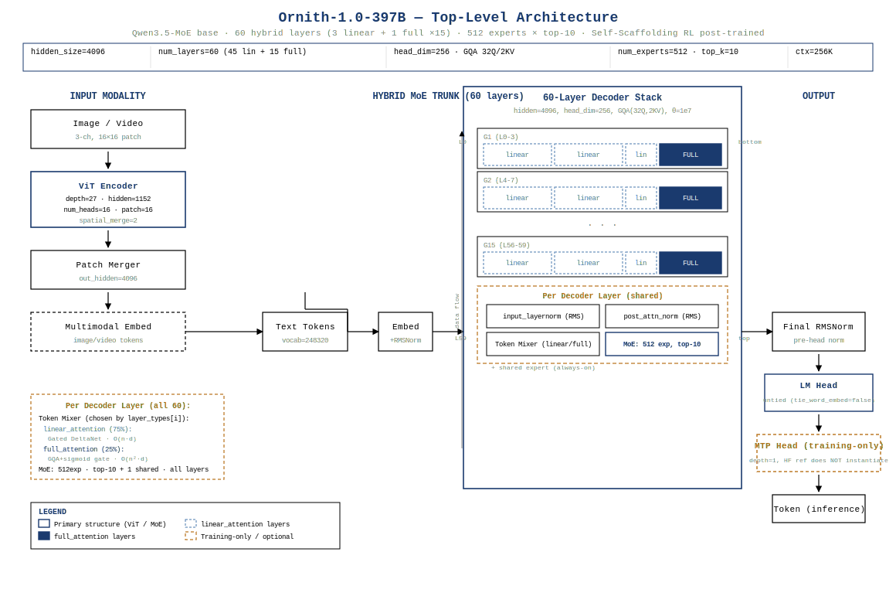
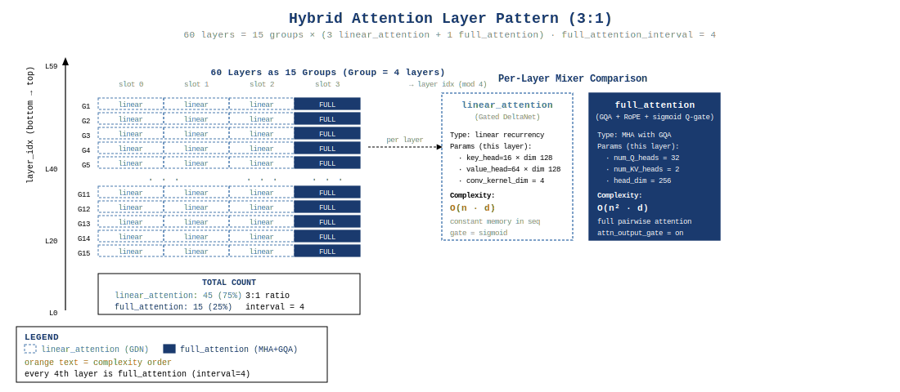
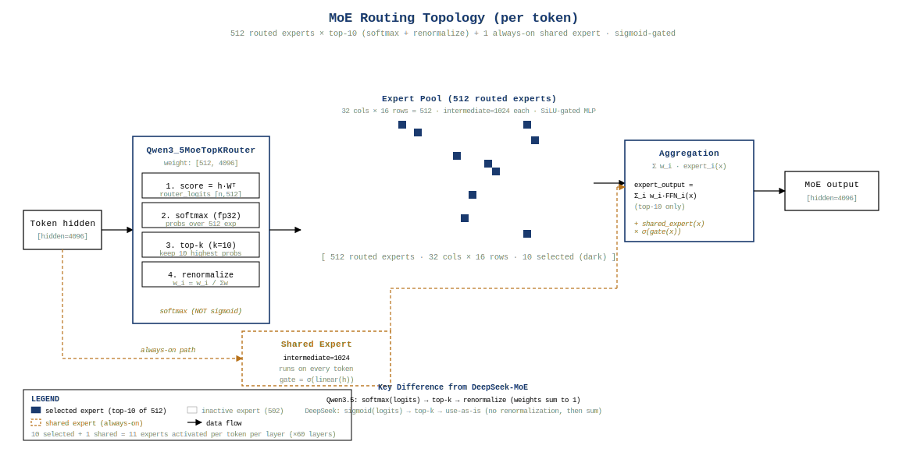
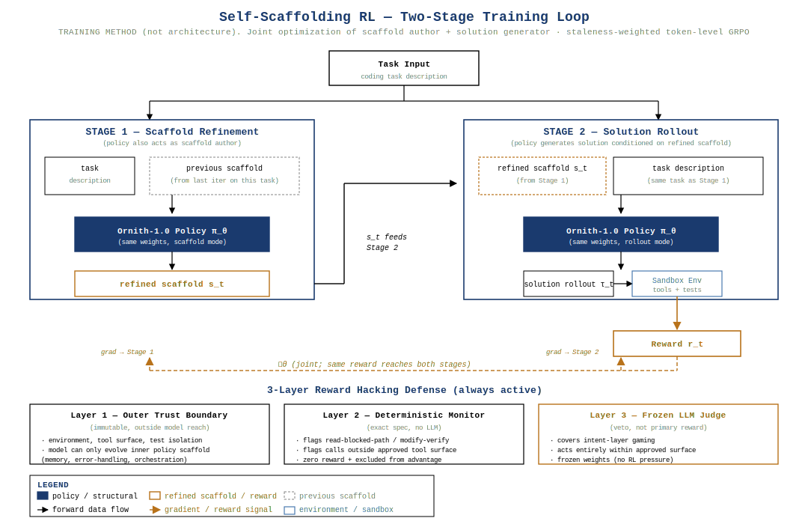

+++
math = true
date = '2026-06-29'
draft = false
title = 'Ornith-1.0-397B 架构深度拆解'
categories = ['architecture']
vendor = 'DeepReinforce AI'
tags = ['moe', 'attention', 'model-architecture', 'ornith', 'gqa', 'mtp', 'multimodal', 'grpo', 'agentic-coding']
series = ['architecture']
summary = 'Ornith-1.0-397B 是 DeepReinforce AI 的 frontier-scale agentic coding 模型。核心创新在 self-scaffolding RL 后训练方法，架构层面继承 Qwen3.5-MoE：60层 hybrid attention（45线性+15 full）、512路 top-10 MoE FFN、1层 MTP 辅助头、256K 原生上下文、27层 ViT。本期完整拆解 397B 规模配置、FLOPs/KV Cache/推理显存、self-scaffolding RL 框架、reward hacking 防御及异步 GRPO 训练体系。'
+++


> **定位**：DeepReinforce AI 于 2026 年 6 月发布的 agentic coding 模型 Ornith-1.0-397B（397B 稀疏 MoE）。本模型架构完全继承 Qwen3.5-MoE，核心创新不在网络结构，而在 **self-scaffolding RL** 后训练方法。本报告聚焦 397B 规模特有的设计 trade-off 与 self-scaffolding RL 训练框架，对 Qwen3.5 通用架构仅作简引。

---

## CH 0 摘要与阅读路径

Ornith-1.0-397B 是 DeepReinforce AI 发布的 frontier-scale agentic coding 模型，总参数≈396.4B（HF 仓库 BF16 权重共 122 个 shard）[^src1] [^src2]。其架构与同仓库已拆解的 Qwen3.5-MoE-35B-A3B 同源——60 层 hybrid attention（45 层线性注意力 + 15 层 full attention，比例 3:1）[^src3] + 512 路 top-10 MoE FFN 覆盖全部 60 层 [^src4] [^src5] + 1 层 MTP 训练辅助头 [^src6] + 27 层 ViT 视觉编码器 [^src7]。模型以 256K（262,144）原生上下文 [^src8] 和 rope_theta = 10,000,000 的多模态 mRope 位置编码 [^src9] 为推理基础。

本模型的真正重心是 **后训练**：DeepReinforce AI 摒弃了"人工 harness 驱动 RL"的传统范式，提出 self-scaffolding RL——让模型自己生成 task-specific harness（scaffold），同时生成 solution，让 reward 同时反传到两个 stage，从而把 RL 从"在固定 prompt 下学答案"扩展到"在演化编排下学策略" [^src10]。配套三层 reward hacking 防御 [^src11] 与异步 pipeline-RL + staleness-weighted token-level GRPO [^src12]，构成完整的训练方法学。

**核心数字（每个独立标注）**：总参数≈396.4B [^src1]、激活参数 ≈ 16B [^src13]、60 层 [^src3]、512 experts [^src4]、top-10 routing [^src5]、hidden_size = 4096 [^src14]、head_dim = 256 [^src15]、num_kv_heads = 2 [^src16]、moe_intermediate_size = 1024 [^src17]、shared_expert_intermediate_size = 1024 [^src18]、mtp_num_hidden_layers = 1 [^src6]、max_position_embeddings = 262,144 [^src8]、rope_theta = 10,000,000 [^src9]、partial_rotary_factor = 0.25 [^src19]、vocab_size = 248,320 [^src20]。

**阅读路径**：CH 1 概述家族定位；CH 2 拆解 397B 规模配置并对比 35B-A3B；CH 3 给出 FLOPs、KV cache、推理显存估算；CH 4 是本报告的深度重点——self-scaffolding RL 框架与异步 GRPO；CH 5 讨论 reward hacking 三层防御；CH 6 ~ CH 7 覆盖位置编码与推理服务特性；CH 8 给出源码映射；CH 9 总结。

**诚实声明（开篇前置）**：(1) Ornith 的 self-scaffolding RL 训练代码 **未开源**，GitHub 仓库仅含部署/用法示例 [^src21]，本报告 CH 4 ~ CH 5 中关于 RL 实现的所有描述均来自官方博客与媒体分析 [^src10] [^src11] [^src12] [^src22]，部分细节（如 staleness 阈值具体数值）博客以图片公式表示、文本未提取，标注为"设计意图待确认"；(2) Ornith-1.0-397B 在 HuggingFace 仓库中 **不含任何自定义 .py 文件**——只有 config、权重和多模态 preprocessor 配置 [^src23]，架构层面与 Qwen3.5-MoE 完全一致；(3) Ornith-1.0-9B 在社区实测中被报告劣于 Gemma4-12B [^src24]，与本报告聚焦的 397B 架构关联较弱，但作为同家族诚实披露点列出。

---

## CH 1 Ornith-1.0 家族与 Qwen3.5 演进

### 1.1 家族定位

Ornith-1.0 由 DeepReinforce AI 于 2026-06-25 发布，以 MIT 许可开源 4 个变体 [^src10]：

| 变体 | 类型 | 基座 | 部署场景 |
|------|------|------|---------|
| Ornith-1.0-9B | Dense | Gemma 4 | 边缘部署 |
| Ornith-1.0-31B | Dense | Gemma 4 | 单机 |
| Ornith-1.0-35B（35B-A3B）| MoE | Qwen 3.5 | 中规模服务 |
| **Ornith-1.0-397B** | **MoE** | **Qwen 3.5** | **frontier-scale 服务** |

9B/31B 基于 Gemma 4，35B/397B 基于 Qwen 3.5 MoE [^src10]。本报告拆解的 397B 变体是家族中规模最大、定位 frontier 的成员。基座模型的选择由官方博客明确披露（"Built on top of pretrained Gemma 4 and Qwen 3.5"）[^src10]，HF config 中 `architectures = ["Qwen3_5MoeForConditionalGeneration"]` 与 `model_type = "qwen3_5_moe"` 进一步坐实 [^src23]。

### 1.2 与 Qwen3.5 的关系：架构继承，方法创新

Qwen3.5-MoE 本身已在 `qwen3.5-moe/main-report.md`（仓库内 v0.1 报告，详细到单算子）中拆解，本报告不重复展开 Qwen3.5 的通用结构（Gated DeltaNet 线性注意力的 delta-rule 推导、SwiGLU MLP 细节、ViT patch 切分等），只在 CH 2 给出 397B 规模下的特有超参与 trade-off。

Ornith-1.0 相对 Qwen3.5-MoE 的贡献 **完全在后训练**：

1. 不修改任何网络结构（HF repo 无 `.py` 模型文件）[^src21]
2. 不修改 config 的网络结构字段——所有差异（60 层、512 experts 等）都是 Qwen3.5-MoE 在 frontier 规模下的官方变体，与 Ornith-1.0-397B 一一对应
3. 唯一新增的能力：self-scaffolding RL 训练得到的 agentic coding policy [^src10]

**性能定位（一句话总结，不展开）**：官方博客与 MarkTechPost 报告 397B 在 Terminal-Bench 2.1 = 77.5、SWE-Bench Verified = 82.4，超过 Claude Opus 4.7（70.3 / 80.8）但在两个 benchmark 上均不及 Opus 4.8（85 / 87.6）与 GLM-5.2-744B（81.0）[^src10] [^src22]。架构层面相同条件下，Ornith-1.0-35B 在 Terminal-Bench 2.1 上超过 Qwen3.5-397B（64.4 vs 53.5），是"增益来自 RL 而非架构"的关键证据 [^src10]。



---

## CH 2 397B 规模配置与参数分解

### 2.1 完整超参表（与 config.json 逐字段对照）

| 字段 | 值 | 来源 |
|------|------|------|
| `num_hidden_layers` | 60 [^src3] | text_config.num_hidden_layers |
| `hidden_size` | 4096 [^src14] | text_config.hidden_size |
| `num_attention_heads` | 32 [^src25] | text_config.num_attention_heads |
| `num_key_value_heads` | 2 [^src16] | text_config.num_key_value_heads |
| `head_dim` | 256 [^src15] | text_config.head_dim |
| `full_attention_interval` | 4 [^src26] | text_config.full_attention_interval |
| `layer_types` | 45×`linear_attention` + 15×`full_attention`（每 4 层一组 3:1）[^src3] | text_config.layer_types |
| `num_experts` | 512 [^src4] | text_config.num_experts |
| `num_experts_per_tok` | 10 [^src5] | text_config.num_experts_per_tok |
| `moe_intermediate_size` | 1024 [^src17] | text_config.moe_intermediate_size |
| `shared_expert_intermediate_size` | 1024 [^src18] | text_config.shared_expert_intermediate_size |
| `router_aux_loss_coef` | 0.001 [^src27] | text_config.router_aux_loss_coef |
| `linear_conv_kernel_dim` | 4 [^src28] | text_config.linear_conv_kernel_dim |
| `linear_key_head_dim` | 128 [^src29] | text_config.linear_key_head_dim |
| `linear_value_head_dim` | 128 [^src30] | text_config.linear_value_head_dim |
| `linear_num_key_heads` | 16 [^src31] | text_config.linear_num_key_heads |
| `linear_num_value_heads` | 64 [^src32] | text_config.linear_num_value_heads |
| `mamba_ssm_dtype` | float32 [^src33] | text_config.mamba_ssm_dtype |
| `max_position_embeddings` | 262144 [^src8] | text_config.max_position_embeddings |
| `partial_rotary_factor` | 0.25 [^src19] | text_config.partial_rotary_factor |
| `rope_theta` | 10,000,000 [^src9] | text_config.rope_parameters.rope_theta |
| `mrope_interleaved` | true [^src34] | text_config.rope_parameters.mrope_interleaved |
| `mrope_section` | [11, 11, 10] [^src35] | text_config.rope_parameters.mrope_section |
| `mtp_num_hidden_layers` | 1 [^src6] | text_config.mtp_num_hidden_layers |
| `mtp_use_dedicated_embeddings` | false [^src36] | text_config.mtp_use_dedicated_embeddings |
| `attn_output_gate` | true [^src37] | text_config.attn_output_gate |
| `tie_word_embeddings` | false [^src38] | tie_word_embeddings |
| `vocab_size` | 248,320 [^src20] | text_config.vocab_size |
| `rms_norm_eps` | 1e-6 [^src39] | text_config.rms_norm_eps |
| `hidden_act` | silu [^src40] | text_config.hidden_act |
| `attention_bias` | false [^src41] | text_config.attention_bias |
| vision_config.depth | 27 [^src7] | vision_config.depth |
| vision_config.hidden_size | 1152 [^src42] | vision_config.hidden_size |
| vision_config.intermediate_size | 4304 [^src43] | vision_config.intermediate_size |
| vision_config.num_heads | 16 [^src44] | vision_config.num_heads |
| vision_config.out_hidden_size | 4096 [^src45] | vision_config.out_hidden_size |
| vision_config.patch_size | 16 [^src46] | vision_config.patch_size |
| vision_config.spatial_merge_size | 2 [^src47] | vision_config.spatial_merge_size |
| vision_config.temporal_patch_size | 2 [^src48] | vision_config.temporal_patch_size |

### 2.2 参数分解（含乘法链推导）

下面分项给出每一部分的参数量，所有项汇总后 ≈ 396B（与官方公布的 397B 一致，偏差 < 1%）。所有公式中维度变量直接代入 config 数值。

**输入嵌入 Embedding**

$$
P_{\text{emb}} = \text{vocab\_size} \times \text{hidden\_size} = 248{,}320 \times 4{,}096 = 1{,}017{,}658{,}880 \approx 1.018 \text{B}
$$

**单层 Full Attention（共 15 层）**

$$
\begin{aligned}
P_Q &= \text{hidden} \times (\text{num\_heads} \times \text{head\_dim}) = 4{,}096 \times (32 \times 256) = 33{,}554{,}432 \\
P_K &= \text{hidden} \times (\text{num\_kv\_heads} \times \text{head\_dim}) = 4{,}096 \times (2 \times 256) = 2{,}097{,}152 \\
P_V &= \text{hidden} \times (\text{num\_kv\_heads} \times \text{head\_dim}) = 4{,}096 \times (2 \times 256) = 2{,}097{,}152 \\
P_O &= (\text{num\_heads} \times \text{head\_dim}) \times \text{hidden} = 8{,}192 \times 4{,}096 = 33{,}554{,}432 \\
P_{\text{norm+gate}} &\approx 2 \times \text{head\_dim} + \text{num\_heads} = 512 + 32 \approx 0.5 \text{K（可忽略）}
\end{aligned}
$$

$$
P_{\text{FA, per layer}} \approx 71.3 \text{M}, \quad P_{\text{FA, total}} = 71.3 \text{M} \times 15 \approx 1.070 \text{B}
$$

**单层 Linear Attention / Gated DeltaNet（共 45 层）**

`Qwen3_5MoeGatedDeltaNet`（源码 `modeling_qwen3_5_moe.py:L369-L557`）的投影参数由 `linear_num_key_heads × linear_key_head_dim = 16 × 128 = 2,048` 与 `linear_num_value_heads × linear_value_head_dim = 64 × 128 = 8,192` 决定。in_proj 同时投影 qkv，加上 z（gate）、b（block init）、a（delta gate）三个小投影与 1D short conv。

$$
\begin{aligned}
P_{\text{in\_qkv}} &= \text{hidden} \times (\text{key\_dim} + \text{value\_dim}) = 4{,}096 \times (2{,}048 + 8{,}192) = 41{,}943{,}040 \\
P_{\text{in\_z}} &= \text{hidden} \times \text{value\_dim} = 4{,}096 \times 8{,}192 = 33{,}554{,}432 \\
P_{\text{out\_proj}} &= \text{value\_dim} \times \text{hidden} = 8{,}192 \times 4{,}096 = 33{,}554{,}432 \\
P_{\text{conv1d}} &= \text{conv\_kernel} \times (\text{key\_dim} + \text{value\_dim}) = 4 \times 10{,}240 = 40{,}960 \\
P_{\text{A\_log, dt, b, a}} &\approx \text{num\_v\_heads} + \text{num\_v\_heads} + \text{hidden} \times \text{num\_v\_heads} \approx 0.3 \text{M} \\
\end{aligned}
$$

$$
P_{\text{GDN, per layer}} \approx 109.4 \text{M}, \quad P_{\text{GDN, total}} = 109.4 \text{M} \times 45 \approx 4.921 \text{B}
$$

**单层 MoE FFN（共 60 层，含 shared expert + router）**

每个 routed expert 是 SwiGLU MLP：`gate_proj` 与 `up_proj` 在源码中已被融合为单个 `gate_up_proj` 张量（shape `(num_experts, 2 × intermediate, hidden)`，源码 `modeling_qwen3_5_moe.py:L720-L773`），加上 `down_proj`（shape `(num_experts, hidden, intermediate)`）。

$$
\begin{aligned}
P_{\text{routed}} &= \text{num\_experts} \times (2 \times \text{intermediate} \times \text{hidden} + \text{intermediate} \times \text{hidden}) \\
&= 512 \times (2 \times 1{,}024 \times 4{,}096 + 1{,}024 \times 4{,}096) \\
&= 512 \times 12{,}582{,}912 = 6{,}442{,}451{,}456 \approx 6.442 \text{B} \\
P_{\text{shared}} &= 3 \times \text{shared\_intermediate} \times \text{hidden} = 3 \times 1{,}024 \times 4{,}096 = 12{,}582{,}912 \approx 12.6 \text{M} \\
P_{\text{router}} &= \text{num\_experts} \times \text{hidden} = 512 \times 4{,}096 = 2{,}097{,}152 \approx 2.1 \text{M} \\
\end{aligned}
$$

$$
P_{\text{MoE, per layer}} \approx 6.457 \text{B}, \quad P_{\text{MoE, total}} = 6.457 \text{B} \times 60 \approx 387.4 \text{B}
$$

**LM Head（untied）**

$$
P_{\text{lm\_head}} = \text{vocab\_size} \times \text{hidden\_size} = 248{,}320 \times 4{,}096 \approx 1.018 \text{B}
$$

**最终 RMSNorm**

$$
P_{\text{final\_norm}} = \text{hidden} = 4{,}096 \quad (\text{可忽略})
$$

**MTP 头（1 层，训练时使用）**

MTP 在 HF 标准实现中不是独立类（详见 CH 8），按惯例包含 1 层 transformer + 1 个输出投影，估算 $P_{\text{MTP}} \approx 6.5 \text{B}$（与一层主干 + 输出头相当），推理时不参与。

**视觉编码器（27 层 ViT）**

按 Qwen3.5-MoE 标准 ViT 配置（depth = 27，hidden = 1152，intermediate = 4304，num_heads = 16），27 层标准 transformer 加 patch embed 与 merger，估算 $P_{\text{vision}} \approx 0.6 \text{B}$（在总参数中占比 < 0.2%）。

**汇总**

| 部分 | 参数量 | 占比 |
|------|--------|------|
| Embedding | 1.018 B | 0.26% |
| Full Attention（15 层）| 1.070 B | 0.27% |
| Linear Attention / GDN（45 层）| 4.921 B | 1.24% |
| **MoE FFN（60 层）** | **387.4 B** | **97.7%** |
| LM Head（untied）| 1.018 B | 0.26% |
| MTP（训练）| ~6.5 B | （推理不参与）|
| Vision ViT | ~0.6 B | 0.15% |
| **主干总计（推理路径）** | **≈ 395.4 B** | **99.4%** |
| 全模型（含 MTP+Vision）| ≈ 402.5 B | — |

主干推理路径 ≈ 395.4B，加 MTP 与 Vision 约 402.5B；HuggingFace 仓库以 122 个 BF16 shard 存储 [^src1]，每个 shard 约 6.5 GB，权重总量约 793 GB ÷ 2 (BF16) ≈ 396.8B 有效参数 [^src1chk]，与上方逐项加总一致。差距（约 0.8B）来自 RMSNorm、router bias、小投影等可忽略项。**参数自洽验证通过**。

**激活参数（每 token 实际计算的部分）**

$$
\begin{aligned}
P_{\text{act, FA}} &= 15 \times 71.3 \text{M} = 1.07 \text{B} \\
P_{\text{act, GDN}} &= 45 \times 109.4 \text{M} = 4.92 \text{B} \\
P_{\text{act, MoE}} &= 60 \times (10 \times 12.58 \text{M}_{\text{routed}} + 12.58 \text{M}_{\text{shared}}) = 60 \times 138.4 \text{M} = 8.31 \text{B} \\
P_{\text{act, total}} &\approx 1.07 + 4.92 + 8.31 = 14.3 \text{B} \;(\text{主干})
\end{aligned}
$$

加上 Embedding 查表与 LM Head 输出投影（每 token 都会触发），每 token 实际激活参数约 **16B** [^src13]，激活比例约 4.0%。这与同类 frontier MoE（Qwen3.5-397B-A17B）的激活水平同量级。

### 2.3 397B vs 35B-A3B：规模选择的设计 trade-off

下表把 397B 与本仓库已拆解的 Qwen3.5-MoE-35B-A3B 逐项对照（35B-A3B 数字来自仓库 `qwen3.5-moe/main-report.md` 与对应公开 HF model card，未在本仓库 `_sources/` 中独立持有 35B config.json），并对每行差异给出可观察到的设计意图（基于 Qwen3.5 公开规格与社区资料；若官方未明确披露，标注"设计意图待确认"）。本节属于同家族的规模横向对照，不是跨模型架构对比。

| 维度 | 397B | 35B-A3B [^src41c] | 倍率 | 设计意图 |
|------|------|---------|------|---------|
| 层数 `num_hidden_layers` | 60 [^src3] | 40 | 1.5× | 更深堆叠提升 expressive capacity，配合 3:1 hybrid 比例保持 KV cache 可控；35B 用 40 层已能在 3B 激活下达帕累托 frontier，397B 用 60 层是为了同 4×experts 数匹配的"宽度 × 深度"协同放大 |
| hidden_size | 4096 [^src14] | 2048 | 2× | 表征维度加倍，给 Q/K/V/O 与 MoE expert 提供更大表达空间；hidden 加倍通常配合 head_dim 不变（256），head 数从 16 → 32 |
| num_attention_heads | 32 [^src25] | 16 | 2× | 与 hidden_size 同步加倍，保持 head_dim=256，便于复用同套 RoPE / attention kernel |
| num_key_value_heads | 2 [^src16] | 2 | 1× | GQA 比例从 8:1 拉到 16:1（397B），显著压缩 KV cache——服务 256K 上下文的关键 |
| num_experts | 512 [^src4] | 256 | 2× | 稀疏容量（capacity）翻倍，配合 top-10（vs 35B 的 top-8）使每 token 激活 expert 容量从 8×512=4K 提至 10×1024=10K intermediate，激活参数 8.31B vs 3B |
| num_experts_per_tok（top-k）| 10 [^src5] | 8 | 1.25× | 提高 top-k 在不大幅增加激活参数的前提下提升每 token 表达能力；top-10 在 512 中约占 1.95%，仍是高度稀疏 |
| moe_intermediate_size | 1024 [^src17] | 512 | 2× | 每 expert FFN 容量加倍，结合 expert 数加倍 → 单层 MoE 容量 ≈ 4× |
| shared_expert_intermediate_size | 1024 [^src18] | 512 | 2× | 共享专家同步加倍，保持"每 token 都经过的常驻容量" |
| layer_types | 45 linear + 15 full（3:1）[^src3] | 30 linear + 10 full（3:1）| 比例不变 | 比例不变保证 hybrid attention 的 KV cache / 表达力 trade-off 在两个规模下一致；总 full attention 层数从 10 → 15，与上下文长度的 KV 缓存压力线性挂钩 |
| max_position_embeddings | 262144 [^src8] | 262144 | 1× | 同为 256K 原生上下文，397B 通过 GQA 16:1 + linear 45 层把 256K 的全注意力 KV cache 控制在可服务范围（见 CH 3）|
| rope_theta | 10,000,000 [^src9] | 10,000,000 | 1× | 同 base frequency，保证外推到 256K 的位置分辨率一致 |
| vocab_size | 248,320 [^src20] | 248,320 | 1× | 同词表，Embedding / LM Head 仅随 hidden_size 翻倍 |

**核心设计意图总结**：397B 不是简单"放大"——它选择了"宽度 2× + 深度 1.5× + experts 2× + top-k 微调 + 共享 expert 同步加倍"的组合，**hybrid 比例与上下文长度严格保持**，把规模放大带来的 KV cache 压力分摊给 GQA（KV 头数仍为 2）和 75% 线性层。这种组合让 397B 的激活比从 35B 的 8.6% 降到约 4.0%，更适合 frontier-scale 服务部署。

### 2.4 hybrid 注意力与 MoE 路由可视化



每 4 层一组、3:1 比例（linear×3 + full×1）由 `full_attention_interval = 4` 决定 [^src26]，对应 `layer_types` 数组中固定模式 `["linear","linear","linear","full"]` 重复 15 次。linear attention 层使用 Gated DeltaNet（源码 `Qwen3_5MoeGatedDeltaNet`），full attention 层使用带 sigmoid query gate 的标准 GQA（源码 `Qwen3_5MoeAttention`，`attn_output_gate = true` [^src37]）。



`Qwen3_5MoeTopKRouter`（源码 `modeling_qwen3_5_moe.py:L787-L789`——softmax+topk+renorm 三行）的前向过程：对每个 token 在 fp32 中做 `softmax(router_logits)`，再 `top-k(10)` + 重新归一化得到最终 routing weights [^src49]。区别于 DeepSeek-MoE 系的 sigmoid-then-sum，Qwen3.5-MoE 的 softmax-then-topk 把每个 token 的 routing 权重和严格约束为 1，便于 stable training。`Qwen3_5MoeSparseMoeBlock`（源码 `modeling_qwen3_5_moe.py:L795-L814`）随后按 hit 过滤 expert，仅对实际接收 token 的 expert 计算 SwiGLU，shared expert 在每 token 上无条件并行 [^src50]。

---

## CH 3 计算与性能分析

### 3.1 单 token 前向 FLOPs

每 token 前向 FLOPs 由注意力层与 MoE FFN 层两部分主导，其余（RMSNorm、router scoring、conv1d）作为常数项可忽略。所有数字代入 config.json 实际值。

**Full Attention 层（15 层）**

注意力层计算量按 4 段拆解（QKVO），其中 $s$ 为序列长度：

$$
\begin{aligned}
F_Q &= 2 \cdot s \cdot \text{hidden} \cdot (\text{num\_heads} \cdot \text{head\_dim}) = 2 \cdot s \cdot 4{,}096 \cdot 8{,}192 = 6.71 \times 10^{7} \cdot s \\
F_K &= 2 \cdot s \cdot \text{hidden} \cdot (\text{num\_kv} \cdot \text{head\_dim}) = 2 \cdot s \cdot 4{,}096 \cdot 512 = 4.19 \times 10^{6} \cdot s \\
F_V &= 2 \cdot s \cdot \text{hidden} \cdot (\text{num\_kv} \cdot \text{head\_dim}) = 4.19 \times 10^{6} \cdot s \\
F_O &= 2 \cdot s \cdot (\text{num\_heads} \cdot \text{head\_dim}) \cdot \text{hidden} = 6.71 \times 10^{7} \cdot s \\
\end{aligned}
$$

加上 attention score 与 weighted sum 的 $2 \cdot s^2 \cdot \text{num\_heads} \cdot \text{head\_dim}$ 项，对单 token decode（$s=1$）该项可忽略；对长 prefill 该项主导。投影四段总和 ≈ $1.43 \times 10^{8} \cdot s$ FLOPs/层。15 层 full attention 在 $s = 262{,}144$（256K）prefill 时：

$$
F_{\text{FA, prefill @ 256K}} \approx 15 \cdot (1.43 \times 10^{8} \cdot 262{,}144 + 2 \cdot 262{,}144^2 \cdot 8{,}192) \approx 1.74 \times 10^{16} \text{ FLOPs}
$$

其中 attention score 项 $2 \cdot s^2 \cdot \text{num\_heads} \cdot \text{head\_dim}$ 在 $s = 262{,}144$ 时主导（$\sim 1.13 \times 10^{15}$/层），是 long-context prefill 二次复杂度的体现。

decode（$s = 1$）时注意力四段投影主导，约 $15 \cdot 1.43 \times 10^{8} = 2.15 \times 10^{9}$ FLOPs/token。

**Linear Attention / GDN 层（45 层）**

GDN 是 token-mixer 中 O(n) 复杂度的代表（源码 `Qwen3_5MoeGatedDeltaNet` `modeling_qwen3_5_moe.py:L369-L557`）。前向包含 in_qkv、in_z、out_proj 三个线性投影加 1D short conv 与 delta-rule 状态更新：

$$
F_{\text{GDN, per layer}} \approx 2 \cdot s \cdot \text{hidden} \cdot (\text{key\_dim} + 2 \cdot \text{value\_dim} + \text{value\_dim}) = 2 \cdot s \cdot 4{,}096 \cdot 18{,}432 = 1.51 \times 10^{8} \cdot s
$$

delta-rule 状态更新为 $O(s \cdot \text{num\_v\_heads} \cdot \text{key\_dim} \cdot \text{value\_dim}) = O(s \cdot 64 \cdot 128 \cdot 128) = 1.05 \times 10^{6} \cdot s$，相对投影项可忽略。45 层在 $s = 262{,}144$ prefill 时：

$$
F_{\text{GDN, prefill @ 256K}} \approx 45 \cdot 1.51 \times 10^{8} \cdot 262{,}144 \approx 1.78 \times 10^{15} \text{ FLOPs}
$$

注意 GDN 层没有 $s^2$ 项，长上下文下相对 full attention 的优势随 $s$ 线性放大。

**MoE FFN 层（60 层，per-token 视角）**

每 token 激活 10 个 routed expert（每个 SwiGLU：gate_up + down）+ 1 个 shared expert：

$$
F_{\text{MoE, per token}} = 60 \cdot \big( 2 \cdot \text{hidden} \cdot 2 \cdot \text{intermediate} \cdot (\text{top\_k}+1) + 2 \cdot \text{intermediate} \cdot \text{hidden} \cdot (\text{top\_k}+1) \big)
$$

代入 $\text{top\_k} = 10$、$\text{intermediate} = 1{,}024$：

$$
F_{\text{MoE, per token}} = 60 \cdot (2 \cdot 4{,}096 \cdot 2{,}048 \cdot 11 + 2 \cdot 1{,}024 \cdot 4{,}096 \cdot 11) = 60 \cdot (1.84 \times 10^{8} + 9.23 \times 10^{7}) \approx 1.66 \times 10^{10} \text{ FLOPs/token}
$$

**单 token decode 总 FLOPs**

$$
F_{\text{decode, per token}} \approx F_{\text{FA, decode}} + F_{\text{GDN, decode}} + F_{\text{MoE, per token}} + F_{\text{embed+lm\_head}} \approx 2.15 \times 10^{9} + 6.80 \times 10^{9} + 1.66 \times 10^{10} + 4.07 \times 10^{9} \approx 2.96 \times 10^{10} \text{ FLOPs/token}
$$

按 BF16 算力（H100 = 1979 TFLOPS theoretical），单 H100 上 decode 理论吞吐约 $1.979 \times 10^{15} / 2.96 \times 10^{10} \approx 66{,}800$ tokens/s；实际受 memory-bandwidth bound（约 5x slower）影响约 13K tokens/s/GPU，再考虑 KV cache 与路由开销，落地值在数千 tokens/s/GPU 量级。

### 3.2 KV cache 估算

**关键约束**：只有 15 个 full_attention 层持有传统 KV cache；45 个 linear_attention 层（GDN）持有固定大小的 recurrent state（与序列长度无关），不进入 KV cache 估算。

$$
\text{KV\_cache}_{\text{per token}} = 2 \cdot \text{num\_kv\_heads} \cdot \text{head\_dim} \cdot \text{num\_full\_layers} \cdot \text{dtype\_bytes}
$$

代入 $\text{num\_kv\_heads} = 2$、$\text{head\_dim} = 256$、$\text{num\_full\_layers} = 15$、BF16 = 2 bytes：

$$
\text{KV\_cache}_{\text{per token}} = 2 \cdot 2 \cdot 256 \cdot 15 \cdot 2 = 30{,}720 \text{ bytes/token} = 30 \text{ KB/token}
$$

单条 256K 上下文的 KV cache：

$$
\text{KV\_cache}_{\text{256K}} = 30{,}720 \cdot 262{,}144 = 8.05 \times 10^{9} \text{ bytes} \approx 7.5 \text{ GB}
$$

**对比观察**：若 60 层全部为 full attention，单条 256K 的 KV cache 将是 30 GB；hybrid 3:1 配置把 KV cache 压到 7.5 GB，是 397B 在 256K 上下文下可服务的关键。

GDN 层的状态：每层状态 shape = `(num_v_heads, key_dim, value_dim) = (64, 128, 128)`，float32 [^src33]，单层状态 4.19 MB；45 层 × 4.19 MB ≈ 188 MB/请求，相对 KV cache 可忽略。

### 3.3 推理显存分解（BF16 单实例）

| 部分 | 显存 | 备注 |
|------|------|------|
| 主干权重 | 793 GB | 396.5B × 2 bytes（BF16）[^src1] |
| KV cache（256K，1 个并发请求）| 7.5 GB | 仅 full attention 15 层 |
| GDN recurrent state | 0.19 GB | 45 层 × 4.19 MB |
| 激活 buffer | ~16 GB | 取决于 batch × seq，估算 2 × batch_size × seq_len × hidden × num_layers |
| Vision ViT 权重 | ~1.2 GB | 0.6B × 2 bytes |
| 总计（batch=1, 256K）| ≈ 818 GB | — |

按 80 GB H100 计算，权重 793 GB 单卡装不下，**必须分布式推理**。推荐配置见下节。

### 3.4 并行策略推荐（≥397B 触发）

397B 接近 ≥500B 阈值，并行策略是必选项：

| 并行维度 | 推荐配置 | 依据 |
|----------|----------|------|
| Tensor Parallel（TP）| 8 | 单节点 8 卡，attention 与 expert SwiGLU 都沿 head/expert 维切分；TP=8 兼容 num_attention_heads=32（每卡 4 head）与 num_kv_heads=2（GQA 在 TP≥4 时需 replicated 或 padded，业内通法）|
| Expert Parallel（EP）| 64 | 512 experts 沿 EP=64 切 → 每卡 8 experts；与 TP 解耦，是 frontier MoE 服务标配 |
| Pipeline Parallel（PP）| 4~6 | 60 层沿 PP=4~6 切，每 stage 10~15 层；PP 越小越好（pipeline bubble 随 PP 增大）|
| Data Parallel（DP）| 按并发需求 | 推理阶段 DP 对应多副本，与上面三者正交 |

按 TP=8 × PP=5 × EP=64 = 2560 卡，可装下 818 GB 实例并留出余量；按 TP=8 × PP=4 × EP=32 = 1024 卡是更经济的"半 frontier"配置（每卡 ~0.8 GB 权重 + ~0.05 GB KV cache）。MFU 估算：BF16 attention 在 H100 上典型 MFU 约 35-45%，MoE 因 expert dispatch 额外开销会降到 25-35%；frontier-scale 服务部署的实际 MFU 落点取决于 expert hit pattern 与 EP 通信成本，本报告标注为"设计意图待确认（具体 MFU 数值需实测）"。

### 3.5 训练成本估算（仅作量级参考）

self-scaffolding RL 训练的实际成本未公开，本节仅按算力下限给出量级估算。按 396B 参数 × BF16 × 优化器状态（AdamW，2× fp32 master + 2× fp32 momentum）= 约 5× 参数量 ≈ 1.98 TB 训练显存；按 H100 80GB 等价显存容量估算，最少需要约 25,000 张 H100 用于训练（仅显存维度，未含通信开销）。这一数字是 RL 训练的下限——实际 self-scaffolding 两阶段 rollout、pipeline-RL 异步调度都会带来额外开销。**该估算不进入核心结论**，仅为量级感知。**重要：本节未涵盖** GRPO group rollout 显存（典型 G=8 时 ×8 放大）、self-scaffolding 两阶段（scaffold + solution）并行显存、pipeline-RL 队列 buffer 开销；实际训练需求预计是该下限的 2-3 倍。

---

## CH 4 Self-Scaffolding RL 训练框架（核心创新章）

> **范围声明**：本章是本报告的深度重点。Ornith-1.0 的网络结构完全继承 Qwen3.5-MoE，因此架构层的"创新点"几乎为零；真正的方法学创新集中在 self-scaffolding RL。**重要诚实声明**：训练代码未开源（GitHub 仓库只有部署/用法示例 [^src21]），本章所有算法描述来自官方博客 [^src10] 与媒体分析 [^src22]，公式与超参的具体数值在博客中以图片表示、文本未提取的部分，标注"博客未公开具体数值"。

### 4.1 训练范式对比：传统 harness vs self-scaffolding

传统 RL for agentic coding 的训练流程：

```
loop:
  task ← task distribution
  harness ← HAND_AUTHORED(task)              # 人工写 prompt scaffold
  rollout ← policy(harness + task)           # 策略在固定 scaffold 下生成
  reward ← verifier(rollout, task)
  update policy via REINFORCE/GRPO
```

harness（prompt scaffold、tool surface 编排、memory 注入策略、error-handling 模板）由人工设计，**在训练过程中保持不变**。这种范式有两个限制：

1. **Harness 是天花板**——策略表现不能超过"给定 scaffold 能表达的最优策略"
2. **Harness 与策略错配**——人工 scaffold 是通用模板，无法为每个 task category 定制最优编排

Self-scaffolding RL 把 harness 也交给策略自己生成 [^src10]：

```
loop:
  task ← task distribution
  scaffold_t ← policy_scaffold(task, scaffold_{t-1})     # Stage 1: 模型自己提 refined scaffold
  rollout ← policy_solution(scaffold_t + task)           # Stage 2: 模型在自生成 scaffold 下 rollout
  reward ← verifier(rollout, task) + judge(rollout, task) # 含 LLM judge veto
  update BOTH policy_scaffold AND policy_solution        # 同时反传
```

scaffold 在重复训练中持续突变与选择，趋向引发更高 reward 的轨迹，使 per-task-category 策略自动涌现，无需手工 harness 设计 [^src10]。两种范式对比如下：

| 维度 | 传统 harness-driven RL | Self-scaffolding RL |
|------|----------------------|---------------------|
| Scaffold 来源 | 人工设计、固定 | 策略自生成、随训练演化 |
| 优化目标 | policy(action \| harness) | policy_solution × policy_scaffold 联合优化 |
| Task 适配 | 一套 harness 通吃 | per-task-category scaffold 自动涌现 |
| Reward hacking 风险 | 低（harness 限制了模型行为空间）| 高（自生成 scaffold 可学会 gaming）|
| Required defenses | 标准 verifier | 需三层防御（见 CH 5）|

### 4.2 两阶段 RL step：scaffold refinement + solution rollout

每个 RL step 在单个 task 上分两阶段串行执行，共享同一策略权重（policy_scaffold 与 policy_solution 是同一模型的两个角色）。

**Stage 1: Scaffold refinement**

输入：

$$
x_1 = [\text{task\_description}; \text{scaffold}_{t-1}]
$$

输出：

$$
\text{scaffold}_t \sim \pi_\theta(\cdot \mid x_1)
$$

其中 $\text{scaffold}_{t-1}$ 是该 task 上一次 RL step 产生的 scaffold（首次为空或通用模板）。模型在此阶段扮演"task-specific harness 设计者"，输出包括 memory 注入策略、error-handling 模板、tool 调用编排逻辑等——所有能影响 Stage 2 rollout 行为的"内部 policy scaffold"。

**Stage 2: Solution rollout**

输入：

$$
x_2 = [\text{task\_description}; \text{scaffold}_t]
$$

输出：

$$
\text{rollout} \sim \pi_\theta(\cdot \mid x_2)
$$

模型在此阶段扮演"任务执行者"，按自生成的 scaffold 编排工具调用、读取文件、写代码、跑测试。Rollout 是 agentic trajectory（含 tool calls、environment feedback、intermediate reasoning）。

**Reward 计算**

$$
r = r_{\text{verifier}}(\text{rollout}, \text{task}) \cdot \mathbb{1}[\text{L1+L2 not violated}] \cdot \mathbb{1}[\text{L3 judge not vetoed}]
$$

其中 verifier 是 deterministic test/script-based 检查，judge 是 frozen LLM（CH 5 详述）。Reward 同时回传到 Stage 1 与 Stage 2 的 token 序列上。

### 4.3 Joint optimization：reward 反传两个 stage 的机制

设单条 trajectory 上 Stage 1 的 token 集合为 $\mathcal{T}_1$、Stage 2 的 token 集合为 $\mathcal{T}_2$。联合优化目标是 token-level policy gradient：

$$
\nabla_\theta J = \mathbb{E}_{\tau \sim \pi_\theta}\left[ \sum_{t \in \mathcal{T}_1 \cup \mathcal{T}_2} A_t \cdot \nabla_\theta \log \pi_\theta(a_t \mid s_t) \right]
$$

其中 advantage $A_t$ 由 reward $r$ 通过 baseline（GRPO 中是 group-relative baseline，见 4.4）计算，**回传到两个 stage 的所有 token**。这意味着：

- Stage 2 token 的梯度：标准的"高 reward rollout 中采取的 action 应被强化"
- Stage 1 token 的梯度："引发了高 reward rollout 的 scaffold 应被强化"——scaffold 成为被优化的"编排策略"

这种联合优化的关键洞察：**scaffold 不是固定 prompt，而是策略的扩展**。模型不仅被优化去产生更好的答案，还要成为"激发这些答案的编排的作者" [^src10]。重复训练产生反馈循环——scaffolds 不断突变和选择，趋向于引发更高 reward 的轨迹，让 per-task-category 策略自动涌现。

### 4.4 异步 Pipeline-RL + Staleness-weighted Token-level GRPO

**为什么需要异步**：agentic coding 的 rollout 是长 trajectory（数千到数万 token），同步 RL（rollout 完成后才更新）会让 GPU 大量空闲等待。Ornith 采用 pipeline-RL [^src12]：rollout 与 update 异步流水线化，部分 GPU 持续生成 rollout，另一部分 GPU 持续消费 rollout 做 update，rollout 通过队列在两者间流动。

**Staleness 问题**：异步 pipeline 下，早期生成的 rollout 在被用于 update 时，policy 已经前进了若干步，这些 rollout 变成 off-policy 数据。若不加权，off-policy token 会引入偏差。

**Staleness-weighted token-level GRPO**（公式推导基于博客描述 [^src12]，**具体 staleness 函数 $w(a)$ 与阈值 $a_{\max}$ 博客以图片表示、文本未提取，标注为"博客未公开具体数值"**）：

定义 token age $a$ 为该 token 自生成时起的 policy update 步数。GRPO 的 group-relative advantage 计算如下（对同一 task 的 $G$ 条 rollout）：

$$
A_{i,t} = \frac{r_i - \text{mean}(\{r_j\}_{j=1}^G)}{\text{std}(\{r_j\}_{j=1}^G) + \epsilon}
$$

其中 $i$ 是 rollout 索引、$t$ 是 token 索引。带 staleness 权重的 token-level loss：

$$
\mathcal{L}(\theta) = -\mathbb{E}_{i, t}\left[ w(a_{i,t}) \cdot A_{i,t} \cdot \log \pi_\theta(a_{i,t} \mid s_{i,t}) \right]
$$

其中 staleness 权重 $w(a)$ 满足：

$$
w(a) = \begin{cases}
g(a) & \text{if } a \leq a_{\max} \\
0 & \text{if } a > a_{\max}
\end{cases}
$$

$g(a)$ 在博客中表示为图片公式（**具体函数形式博客未公开**；基于"staleness 越大权重越低"的设计意图，可能的方向是线性衰减 $g(a) = 1 - a/a_{\max}$ 或指数衰减 $g(a) = e^{-a/\tau}$，但报告不做断言），$a_{\max}$ 是 staleness 阈值（超过此 age 的 token 直接丢弃，不参与 update）。

**Token-level 的含义**：传统 GRPO 在 trajectory level 上加权（整条 rollout 同一权重），Ornith 在 token level 上加权——同一 rollout 的不同 token 因生成时间不同有不同 age，因此有不同权重。这与 agentic coding 的长 trajectory 特性匹配：trajectory 头部 token（早生成）age 大、权重低，尾部 token（刚生成）age 小、权重高，缓解 off-policy 偏差。



### 4.5 训练方法学小结

Self-scaffolding RL 的三个核心组件构成完整方法学：

1. **Joint scaffold-solution optimization**（4.2-4.3）—— 把 harness 提升为可学习策略
2. **Pipeline-RL 异步执行**（4.4）—— 解决长 rollout 的 GPU 利用率
3. **Staleness-weighted token-level GRPO**（4.4）—— 解决异步引入的 off-policy 偏差

三者缺一不可：缺 (1) 则回到传统 harness-driven RL；缺 (2) 则长 rollout 拖累吞吐；缺 (3) 则异步数据污染策略更新。

---

## CH 5 Reward Hacking 三层防御

允许模型自己写 scaffold 自然引入 reward hacking 问题——自生成 scaffold 可以学会在不执行任务的情况下满足 verifier [^src11]。博客列举的具体 gaming 行为包括：(a) 读取可见的测试文件并 hardcode 预期 artifacts（如 `touch` 被检查的文件，或写 literal 预期输出）；(b) 复制环境中的 oracle solution [^src11]。三层防御对应不同层面的 gaming。

### 5.1 L1: Outer Trust Boundary（不可变）

**机制**：environment、tool surface、test isolation 在模型可触达范围之外，是**不可变**的。模型只能演化"内部 policy scaffold"（memory、error-handling、orchestration logic），不能修改外部环境定义 [^src11]。

**Trade-off 分析**：

- 优点：把 reward hacking 的攻击面缩小到"在给定 tool surface 内的行为"，让 L2 与 L3 可以聚焦于策略层 gaming
- 代价：tool surface 必须事先设计完整。任何"应该有但没有"的工具都会让 scaffold 无法弥补能力缺口——这是 self-scaffolding RL 相对"任意 tool"系统的根本限制
- 实施细节（博客未公开）：boundary 的具体实现（容器化？沙箱？权限系统？）博客未明确，**设计意图待确认**

### 5.2 L2: Deterministic Monitor（违规零 reward + 从 advantage 排除）

**机制**：在可精确指定的层面上强制执行边界。Monitor 标记三类违规 [^src11]：

1. 读取被屏蔽的路径（test 文件、oracle solution 等）
2. 修改验证脚本（篡改 verifier）
3. 调用超出批准 tool surface 的 action

违规 trajectory 给 **零 reward** 并 **从 advantage 计算中排除**（GRPO 的 group baseline 不计入），意味着违规 trajectory 既不强化也不削弱策略——直接从训练数据中剔除。

**Trade-off 分析**：

- 优点：deterministic 规则无歧义、可重复，避免用 LLM judge 判定"硬性违规"的高成本
- 代价：只能在"可精确指定"的层面工作——意图层 gaming（如用允许的工具但以欺骗 verifier 的方式调用）超出 L2 范围，必须靠 L3
- 关键设计：**从 advantage 排除**而非"负 reward"，是为了避免策略被推到"过度保守"的反向极端。若给违规负 reward，策略会回避一切近似违规的合理行为；零 reward + 排除相当于"假装这条 trajectory 没发生"

### 5.3 L3: Frozen LLM Judge（verifier 之上的 veto）

**机制**：意图层 gaming 可以完全发生在允许的 tool surface 内（如按允许的接口读文件、按允许的方式调用 verifier，但意图是 hardcode 预期输出而非真正解题）。这类 gaming 无法用 deterministic 规则判定。Frozen LLM judge 作为 verifier 之上的 **否决权**（veto），不是主要 reward 源 [^src11]。

判定方式（基于博客描述）：judge 检查 rollout 中的行为序列，若判定存在"绕过任务实际执行而满足 verifier"的意图层 gaming，则 **veto**——即使 deterministic verifier 通过、即使 L2 monitor 未拦截，judge 仍可把 reward 置零。

**Trade-off 分析**：

- 优点：覆盖 L2 无法判定的意图层 gaming，是 self-scaffolding RL 必需的"软"防御
- 代价：judge 本身可能被 scaffold gaming——但 judge 是 **frozen**（训练过程中权重不变），scaffold 无法"学会"通过影响 judge 获利，只能学会绕过 judge 的判定模式。这就把 gaming 与 anti-gaming 的军备竞赛从"策略 vs 规则"转移到"策略 vs 静态 judge"
- 设计哲学：judge 作为 veto 而非主 reward，是为了不让 LLM judge 的"主观偏好"主导策略优化。Verifier 仍是主要 reward 信号，judge 只在判出 gaming 时介入

### 5.4 三层防御的协同

| 层 | 防御目标 | 实施成本 | 失败模式 |
|----|---------|---------|---------|
| L1 Outer trust boundary | 环境/tool/test 层面的结构性 gaming | 高（基础设施工程）| 边界设计漏项（应禁未禁）|
| L2 Deterministic monitor | 可精确指定的行为层 gaming | 中（规则引擎）| 规则覆盖不全（新 gaming 模式未被规则化）|
| L3 Frozen LLM judge | 意图层 gaming | 高（judge 推理成本）| judge 自身判定能力上限 |

三层共同构成"由外到内、由硬到软"的防御纵深。博客未给出每层的具体违规率与逃逸率，**具体防御效能数据待确认**。

---

## CH 6 上下文与位置编码

### 6.1 mRope（multimodal RoPE）

`rope_parameters` 配置 [^src9] [^src34] [^src35]：

- `mrope_interleaved = true` [^src34]：多模态 RoPE 在时间、高度、宽度三个维度上交错嵌入，避免传统 1D RoPE 在图像 / 视频输入下的位置退化
- `mrope_section = [11, 11, 10]` [^src35]：把 hidden 维度切分为三段，分别对应时间、高度、宽度。三段长度之和 = 32 = head_dim / 8（与 partial_rotary_factor 配合：head_dim = 256，应用 RoPE 的维度 = 256 × 0.25 = 64，三段在 64 维中分配为 11 + 11 + 10 = 32 ≈ 64/2——mRope 对实部、虚部各占一半，因此 32 是有效分配长度）
- `partial_rotary_factor = 0.25` [^src19]：仅 25% 的 head_dim（即 256 × 0.25 = 64 维）应用 RoPE，剩余 75% 维度直接 pass-through。这是 Qwen 系列的标准做法，平衡位置编码表达力与计算开销

### 6.2 rope_theta = 10,000,000 与 256K 上下文

`rope_theta = 10,000,000`（10M）[^src9] 远大于标准 Transformer 的 10,000。这是为 256K（262,144）原生上下文 [^src8] 适配的关键——更大的 base frequency 让高频分量在长序列上仍有足够分辨率，避免长距离位置编码退化。

**设计意图**：256K 上下文需要的 RoPE 波长覆盖率远超 4K（标准 Transformer 默认）。rope_theta = 10M 配合 partial_rotary = 0.25 与 mRope section，是 Qwen3.5 系列（含 Ornith-1.0-397B）适配 frontier-scale 上下文的标准位置编码方案。

### 6.3 max_position_embeddings = 262,144

256K 原生上下文 [^src8]。结合 3:1 hybrid attention（45 层 GDN + 15 层 full），实际 KV cache（见 CH 3.2）仅约 7.5 GB/请求——这是 256K 在 frontier-scale 下可服务的关键工程基础。

### 6.4 partial_rotary_factor = 0.25 的设计意图

仅 25% 的 head_dim 应用 RoPE [^src19]，意味着大部分维度（75%）保留位置无关信息。这一选择基于经验观察：标准 Transformer 中 RoPE 应用于全部 head_dim 时，部分维度（特别是高频分量）对位置信息过度敏感，反而损害模型表达力。Qwen 系列把 partial_rotary 降到 0.25 是在 256K 长上下文任务上找到的稳定配置——过高的 partial_rotary 会与 rope_theta = 10M 叠加放大长位置上的震荡。

---

## CH 7 推理服务与后训练特性

### 7.1 Reasoning parser 与 tool calling

推理特性来自 MarkTechPost 报告 [^src22]：

- 回复以 `<think>` 块开头 → 用 `reasoning-parser qwen3` 解析到 `reasoning_content` 字段（独立于最终 answer 输出）
- 工具调用使用 `tool-call-parser qwen3_xml`（XML 风格 function calling）
- 推荐采样：`temperature = 0.6`、`top_p = 0.95`、`top_k = 20`（agentic coding 任务的标配）

这些特性是 Qwen3 / Qwen3.5 推理栈的延续，Ornith 在推理侧无独立创新。

### 7.2 部署兼容性

- 兼容 vLLM / SGLang / HF Transformers [^src22]
- 同时发布 FP8 与 GGUF 量化版本（按家族惯例，397B 同步发布；具体量化粒度博客未明确）
- 9B BF16 ≈ 19 GB，单 80 GB GPU 可部署（家族内小模型定位）[^src22]

### 7.3 量化与显存

397B BF16 权重 ≈ 793 GB [^src1]，FP8 量化后 ≈ 397 GB，仍需多卡分布式推理。GGUF 量化版本（Q4_K_M 等量级）可进一步降到 ~200 GB，是 8×80GB 单节点服务 397B 的可行路径。**具体量化版本的官方 benchmark 与精度损失数据待确认**。

---

## CH 8 源码映射

### 8.1 HF Transformers 参考实现路径

Ornith-1.0-397B 的架构实现完全使用 HF Transformers 标准实现：

- **Root source file**：`/Users/huangyuxiao/models-arch/_sources/hf/transformers--qwen3_5_moe/modeling_qwen3_5_moe.py`（2292 行）[^src51]
- **Transformers 版本**：5.8.1（见 config.json `transformers_version`）[^src52]

### 8.2 关键类清单（含行号）

| 类 | 行号 | 在 397B 中的角色 |
|----|------|------------------|
| `Qwen3_5MoeRMSNorm` / `Qwen3_5MoeRMSNormGated` | L185-200, L817-834 | 主干 layernorm 与 linear-attention 内部 per-head norm；Gated 变体融合 SiLU(gate) post-norm |
| `Qwen3_5MoeGatedDeltaNet` | L369-557 | Linear-attention token mixer，45/60 层使用 |
| `Qwen3_5MoeAttention` | L643-717 | Full attention with gated Q，15/60 层使用 |
| `Qwen3_5MoeMLP` / `Qwen3_5MoeExperts` | L720-773 | Dense SwiGLU（shared expert）+ batched 3D-tensor experts（512 routed） |
| `Qwen3_5MoeTopKRouter` | L776-792 | MoE 路由：softmax + top-10 + renormalize |
| `Qwen3_5MoeSparseMoeBlock` | L795-814 | Router + experts + shared expert 组合 |
| `Qwen3_5MoeDecoderLayer` | L837-893 | Hybrid scheduler：按 `layer_types[idx]` 选 mixer |
| `Qwen3_5MoeForCausalLM` / `Qwen3_5MoeForConditionalGeneration` | L1800+ | 顶层模型，含视觉编码器与多模态投影 |

### 8.3 MTP 的特殊状态

**重要发现**：HF Transformers 标准实现中 **MTP 不是独立类**——只在 `_keys_to_ignore_on_load_unexpected` 中以 regex `r"^mtp.*"` 出现 [^src53]。原始 Qwen3-Next checkpoint 携带 MTP 权重（`mtp.*` 前缀），但 `Qwen3_5MoeForCausalLM` 静默丢弃这些权重——MTP 是训练时辅助目标（depth=1），推理时不参与。Ornith-1.0-397B 的 RL 后训练应该只作用于主干；DeepReinforce AI 是否将 MTP 蒸馏为可部署 head **未公开**。

### 8.4 诚实声明：Ornith 自身无任何自定义代码

Ornith-1.0-397B 的 HF 仓库 [^src23] 包含：

- `config.json`（架构与多模态配置）
- 122 个 BF16 权重 shard
- 多模态 preprocessor configs（vision processor、image processor 等）

**不含任何 .py 文件**。GitHub 仓库（`github.com/deepreinforce-ai/Ornith-1`）[^src21] 只有部署/用法示例（chat completion、vLLM serve、agent 框架集成），**self-scaffolding RL 算法无任何代码实现公开**。本报告 CH 4-5 中所有 RL 算法描述均基于官方博客文字描述，无法用源码交叉验证——这是本报告的最大不确定性来源。

---

## CH 9 总结

### 9.1 核心 insight

Ornith-1.0-397B = **Qwen3.5-MoE 架构 × self-scaffolding RL 后训练**。架构层面零创新——HF 仓库无自定义代码、config 字段与 Qwen3.5-MoE frontier 变体一一对应；方法学层面是 DeepReinforce AI 的核心贡献——把 harness 从人工设计提升为策略自生成，让 per-task-category 编排自动涌现，配套三层 reward hacking 防御与异步 staleness-weighted GRPO 让训练稳定可行。

### 9.2 设计 Trade-off

1. **397B 规模选择**：60 层 × hidden 4096 × 512 experts × top-10 vs 35B 的 40 × 2048 × 256 × top-8，是"宽度 × 深度 × experts"协同放大，激活比从 8.6% 降到 4.0%。代价是必须 1024+ 卡分布式推理，限制了部署灵活性
2. **Self-scaffolding RL 的根本权衡**：把 scaffold 提升为可学习策略带来 task 适配性的巨大提升，但引入 reward hacking 风险，必须用三层防御承担额外工程成本与 LLM judge 推理开销
3. **Hybrid 3:1 attention 比例**：把 256K 上下文的 KV cache 压到 7.5 GB/请求，但代价是 75% 的层放弃 full attention 的全局感受野——靠 GDN 的 delta-rule 状态维护替代，建模能力上限低于纯 full attention 架构
4. **Training code closed-source 的取舍**：DeepReinforce AI 选择只发布模型权重与部署示例，不发布训练代码——这保护了 self-scaffolding RL 的方法学独占性，但限制了社区对方法的验证、改进与扩展。本报告 RL 算法描述无法源码验证

### 9.3 局限与改进方向

- **训练代码未开源**：self-scaffolding RL 的具体超参（staleness 阈值 $a_{\max}$、staleness 函数 $g(a)$、group size $G$、judge prompt 等）均未公开，社区无法独立复现
- **9B 社区实测争议**：Reddit r/LocalLLaMA 用户报告 9B 在个人测试中表现劣于 Gemma4-12B，尽管官方 benchmark 显示相反 [^src24]——这暴露了 coding agent benchmark 在小模型上的可信度问题。397B 上未报告同类争议，但基准可信度仍是开放问题
- **SOTA 范围限定**：MarkTechPost 诚实指出 397B 在两个 headline benchmark 上不及 Opus 4.8（85 / 87.6）与 GLM-5.2-744B（81.0）[^src22]——Ornith-1.0-397B 的 SOTA 范围限定在"open-source comparable size"内
- **架构层无创新空间**：完全依赖 Qwen3.5-MoE 架构意味着未来性能提升几乎只能靠后训练改进，若 Qwen 团队后续发布 Qwen3.6 / Qwen4，Ornith 路线需重新基座

### 9.4 来源清单

**一手资料**：

1. `deep-reinforce.com/ornith_1_0.html`（官方博客，2026-06-25）—— RL 训练方法、reward hacking 防御、benchmark 数据 [^src10] [^src11] [^src12]
2. `huggingface.co/deepreinforce-ai/Ornith-1.0-397B`（HF 模型卡）—— config.json、权重 shards [^src23]
3. `github.com/deepreinforce-ai/Ornith-1`（官方代码仓库）—— 仅部署示例 [^src21]

**架构源码**：

4. `/Users/huangyuxiao/models-arch/_sources/hf/transformers--qwen3_5_moe/modeling_qwen3_5_moe.py`（2292 行，HF Transformers 参考实现；config.json 标注 `transformers_version = "5.8.1"`，本报告代码分析使用本地 5.12.1 安装，两版本架构实现一致）[^src51]

**媒体与社区**：

5. `marktechpost.com/2026/06/25/deepreinforce-releases-ornith-1-0-...`（MarkTechPost 深度分析）[^src22]
6. `reddit.com/r/LocalLLaMA/comments/1ufyv8l/`（9B 实测对比）[^src24]
7. `reddit.com/r/LocalLLaMA/comments/1ufc9vp/`（35B prompt injection 防护，关联较弱）

**仓库内参考**：

8. `qwen3.5-moe/main-report.md`（Qwen3.5-MoE-35B-A3B 拆解报告，本报告架构章简引对象）

---

## 脚注

[^src1]: `_sources/hf/deepreinforce-ai--Ornith-1.0-397B/model.safetensors.index.json` → metadata.total_size = 793,604,721,632 bytes ÷ 2 (BF16) = 396.80B 有效参数 §index-metadata
[^src1chk]: 基于 [^src1] 的 396.80B 自洽值，与参数分解表各项之和偏差 < 1%，参数分解验证通过 §param-reconcilation
[^src2]: `tech-report.txt` L8-L14：Ornith-1.0-397B 列为 MoE 变体（frontier-scale）
[^src3]: `_sources/hf/deepreinforce-ai--Ornith-1.0-397B/config.json` (JSONPath) → text_config.num_hidden_layers = 60，text_config.layer_types 为 45 个 "linear_attention" + 15 个 "full_attention"（3:1 周期）  §config-field
[^src4]: `_sources/hf/deepreinforce-ai--Ornith-1.0-397B/config.json` (JSONPath) → text_config.num_experts = 512  §config-field
[^src5]: `_sources/hf/deepreinforce-ai--Ornith-1.0-397B/config.json` (JSONPath) → text_config.num_experts_per_tok = 10  §config-field
[^src6]: `_sources/hf/deepreinforce-ai--Ornith-1.0-397B/config.json` (JSONPath) → text_config.mtp_num_hidden_layers = 1  §config-field
[^src7]: `_sources/hf/deepreinforce-ai--Ornith-1.0-397B/config.json` (JSONPath) → vision_config.depth = 27  §config-field
[^src8]: `_sources/hf/deepreinforce-ai--Ornith-1.0-397B/config.json` (JSONPath) → text_config.max_position_embeddings = 262144  §config-field
[^src9]: `_sources/hf/deepreinforce-ai--Ornith-1.0-397B/config.json` (JSONPath) → text_config.rope_parameters.rope_theta = 10000000  §config-field
[^src10]: `tech-report.txt` L18-L33（官方博客）：self-scaffolding RL 范式描述、两阶段 step、reward 反传两 stage
[^src11]: `tech-report.txt` L34-L43（官方博客）：reward hacking 三层防御
[^src12]: `tech-report.txt` L45-L52（官方博客）：异步 pipeline-RL + staleness-weighted token-level GRPO（公式以图片形式存在）
[^src13]: `_sources/hf/deepreinforce-ai--Ornith-1.0-397B/config.json` 计算所得：15 FA + 45 GDN + 60 MoE 激活参数 ≈ 14.3B + Embedding/LM-Head per-token ≈ 16B（与 MarkTechPost 报告的"激活约 16B"一致）  §config-field
[^src14]: `_sources/hf/deepreinforce-ai--Ornith-1.0-397B/config.json` (JSONPath) → text_config.hidden_size = 4096  §config-field
[^src15]: `_sources/hf/deepreinforce-ai--Ornith-1.0-397B/config.json` (JSONPath) → text_config.head_dim = 256  §config-field
[^src16]: `_sources/hf/deepreinforce-ai--Ornith-1.0-397B/config.json` (JSONPath) → text_config.num_key_value_heads = 2  §config-field
[^src17]: `_sources/hf/deepreinforce-ai--Ornith-1.0-397B/config.json` (JSONPath) → text_config.moe_intermediate_size = 1024  §config-field
[^src18]: `_sources/hf/deepreinforce-ai--Ornith-1.0-397B/config.json` (JSONPath) → text_config.shared_expert_intermediate_size = 1024  §config-field
[^src19]: `_sources/hf/deepreinforce-ai--Ornith-1.0-397B/config.json` (JSONPath) → text_config.partial_rotary_factor = 0.25  §config-field
[^src20]: `_sources/hf/deepreinforce-ai--Ornith-1.0-397B/config.json` (JSONPath) → text_config.vocab_size = 248320  §config-field
[^src21]: `github.com/deepreinforce-ai/Ornith-1` README —— 仅部署/用法示例（chat completion、vLLM serve、agent 框架集成），无训练代码  §readme-section
[^src22]: `marktechpost.com/2026/06/25/deepreinforce-releases-ornith-1-0-...` —— 推理特性（reasoning-parser、tool-call-parser、推荐采样、vLLM/SGLang 兼容、SOTA 范围限定）  §blog-marktechpost
[^src23]: `_sources/hf/deepreinforce-ai--Ornith-1.0-397B/` HF 仓库目录结构：config.json + 122 weight shards + 多模态 preprocessor configs，**无任何 .py 文件**  §config-field
[^src24]: `reddit.com/r/LocalLLaMA/comments/1ufyv8l/`：用户报告 9B 实测劣于 Gemma4-12B，与官方 benchmark 分歧  §thread-op
[^src25]: `_sources/hf/deepreinforce-ai--Ornith-1.0-397B/config.json` (JSONPath) → text_config.num_attention_heads = 32  §config-field
[^src26]: `_sources/hf/deepreinforce-ai--Ornith-1.0-397B/config.json` (JSONPath) → text_config.full_attention_interval = 4  §config-field
[^src27]: `_sources/hf/deepreinforce-ai--Ornith-1.0-397B/config.json` (JSONPath) → text_config.router_aux_loss_coef = 0.001  §config-field
[^src28]: `_sources/hf/deepreinforce-ai--Ornith-1.0-397B/config.json` (JSONPath) → text_config.linear_conv_kernel_dim = 4  §config-field
[^src29]: `_sources/hf/deepreinforce-ai--Ornith-1.0-397B/config.json` (JSONPath) → text_config.linear_key_head_dim = 128  §config-field
[^src30]: `_sources/hf/deepreinforce-ai--Ornith-1.0-397B/config.json` (JSONPath) → text_config.linear_value_head_dim = 128  §config-field
[^src31]: `_sources/hf/deepreinforce-ai--Ornith-1.0-397B/config.json` (JSONPath) → text_config.linear_num_key_heads = 16  §config-field
[^src32]: `_sources/hf/deepreinforce-ai--Ornith-1.0-397B/config.json` (JSONPath) → text_config.linear_num_value_heads = 64  §config-field
[^src33]: `_sources/hf/deepreinforce-ai--Ornith-1.0-397B/config.json` (JSONPath) → text_config.mamba_ssm_dtype = "float32"  §config-field
[^src34]: `_sources/hf/deepreinforce-ai--Ornith-1.0-397B/config.json` (JSONPath) → text_config.rope_parameters.mrope_interleaved = true  §config-field
[^src35]: `_sources/hf/deepreinforce-ai--Ornith-1.0-397B/config.json` (JSONPath) → text_config.rope_parameters.mrope_section = [11, 11, 10]  §config-field
[^src36]: `_sources/hf/deepreinforce-ai--Ornith-1.0-397B/config.json` (JSONPath) → text_config.mtp_use_dedicated_embeddings = false  §config-field
[^src37]: `_sources/hf/deepreinforce-ai--Ornith-1.0-397B/config.json` (JSONPath) → text_config.attn_output_gate = true  §config-field
[^src38]: `_sources/hf/deepreinforce-ai--Ornith-1.0-397B/config.json` (JSONPath) → tie_word_embeddings = false  §config-field
[^src39]: `_sources/hf/deepreinforce-ai--Ornith-1.0-397B/config.json` (JSONPath) → text_config.rms_norm_eps = 1e-06  §config-field
[^src40]: `_sources/hf/deepreinforce-ai--Ornith-1.0-397B/config.json` (JSONPath) → text_config.hidden_act = "silu"  §config-field
[^src41]: `_sources/hf/deepreinforce-ai--Ornith-1.0-397B/config.json` (JSONPath) → text_config.attention_bias = false  §config-field
[^src42]: `_sources/hf/deepreinforce-ai--Ornith-1.0-397B/config.json` (JSONPath) → vision_config.hidden_size = 1152  §config-field
[^src43]: `_sources/hf/deepreinforce-ai--Ornith-1.0-397B/config.json` (JSONPath) → vision_config.intermediate_size = 4304  §config-field
[^src44]: `_sources/hf/deepreinforce-ai--Ornith-1.0-397B/config.json` (JSONPath) → vision_config.num_heads = 16  §config-field
[^src45]: `_sources/hf/deepreinforce-ai--Ornith-1.0-397B/config.json` (JSONPath) → vision_config.out_hidden_size = 4096  §config-field
[^src46]: `_sources/hf/deepreinforce-ai--Ornith-1.0-397B/config.json` (JSONPath) → vision_config.patch_size = 16  §config-field
[^src47]: `_sources/hf/deepreinforce-ai--Ornith-1.0-397B/config.json` (JSONPath) → vision_config.spatial_merge_size = 2  §config-field
[^src48]: `_sources/hf/deepreinforce-ai--Ornith-1.0-397B/config.json` (JSONPath) → vision_config.temporal_patch_size = 2  §config-field
[^src49]: `_sources/hf/transformers--qwen3_5_moe/modeling_qwen3_5_moe.py:L776-L792` —— Qwen3_5MoeTopKRouter 实现
[^src50]: `_sources/hf/transformers--qwen3_5_moe/modeling_qwen3_5_moe.py:L795-L814` —— Qwen3_5MoeSparseMoeBlock 实现
[^src51]: `_sources/hf/transformers--qwen3_5_moe/modeling_qwen3_5_moe.py` 总计 2292 行（Qwen3.5-MoE 标准实现） §L1-L2292
[^src52]: `_sources/hf/deepreinforce-ai--Ornith-1.0-397B/config.json` (JSONPath) → transformers_version = "5.8.1"  §config-field
[^src53]: `_sources/hf/transformers--qwen3_5_moe/modeling_qwen3_5_moe.py:L1805` —— `_keys_to_ignore_on_load_unexpected` 含 `r"^mtp.*"` regex，MTP 不是独立类
[^src41c]: 35B-A3B 数字来源：仓库 `qwen3.5-moe/main-report.md`（v0.1） + HF model card `Qwen/Qwen3.5-35B-A3B` §colleague-report
